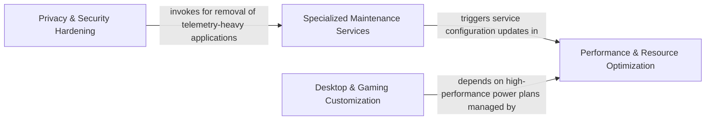

## Details

Contains the actual logic for system tweaks and specialized utilities like bloatware removal and disk cleanup.

### Privacy & Security Hardening
Manages the reduction of the Windows attack surface and data collection footprint, targeting telemetry services, AI assistants, and background activity logging.

**Related Classes/Methods**:

- `Domain.Optimizations.Categories.SecurityAndPrivacy`:15-687
- `Domain.Optimizations.Categories.SecurityAndPrivacy.DisableTelemetry`:27-165
- `Domain.Optimizations.Categories.SecurityAndPrivacy.DisableCopilot`:583-637

**Source Files:**

- [`optimizerDuck/Domain/Optimizations/Categories/SecurityAndPrivacy.cs`](https://github.com/CodeBoarding/optimizerDuck/blob/master/.codeboardingoptimizerDuck/Domain/Optimizations/Categories/SecurityAndPrivacy.cs)
  - `Domain.Optimizations.Categories.SecurityAndPrivacy.DisableTelemetry` ([L27-L165](https://github.com/CodeBoarding/optimizerDuck/blob/master/.codeboardingoptimizerDuck/Domain/Optimizations/Categories/SecurityAndPrivacy.cs#L27-L165)) - Class
  - `Domain.Optimizations.Categories.SecurityAndPrivacy.DisableErrorReporting` ([L171-L222](https://github.com/CodeBoarding/optimizerDuck/blob/master/.codeboardingoptimizerDuck/Domain/Optimizations/Categories/SecurityAndPrivacy.cs#L171-L222)) - Class
  - `Domain.Optimizations.Categories.SecurityAndPrivacy.DisableAdvertisingAndSuggestions` ([L228-L331](https://github.com/CodeBoarding/optimizerDuck/blob/master/.codeboardingoptimizerDuck/Domain/Optimizations/Categories/SecurityAndPrivacy.cs#L228-L331)) - Class
  - `Domain.Optimizations.Categories.SecurityAndPrivacy.DisableActivityHistory` ([L337-L371](https://github.com/CodeBoarding/optimizerDuck/blob/master/.codeboardingoptimizerDuck/Domain/Optimizations/Categories/SecurityAndPrivacy.cs#L337-L371)) - Class
  - `Domain.Optimizations.Categories.SecurityAndPrivacy.DisableLocationAndSensors` ([L377-L449](https://github.com/CodeBoarding/optimizerDuck/blob/master/.codeboardingoptimizerDuck/Domain/Optimizations/Categories/SecurityAndPrivacy.cs#L377-L449)) - Class
  - `Domain.Optimizations.Categories.SecurityAndPrivacy.DisableAutoLogger` ([L455-L518](https://github.com/CodeBoarding/optimizerDuck/blob/master/.codeboardingoptimizerDuck/Domain/Optimizations/Categories/SecurityAndPrivacy.cs#L455-L518)) - Class
  - `Domain.Optimizations.Categories.SecurityAndPrivacy.DisableCortana` ([L524-L577](https://github.com/CodeBoarding/optimizerDuck/blob/master/.codeboardingoptimizerDuck/Domain/Optimizations/Categories/SecurityAndPrivacy.cs#L524-L577)) - Class
  - `Domain.Optimizations.Categories.SecurityAndPrivacy.DisableCopilot` ([L583-L637](https://github.com/CodeBoarding/optimizerDuck/blob/master/.codeboardingoptimizerDuck/Domain/Optimizations/Categories/SecurityAndPrivacy.cs#L583-L637)) - Class
  - `Domain.Optimizations.Categories.SecurityAndPrivacy.DisableContentDeliveryManager` ([L643-L686](https://github.com/CodeBoarding/optimizerDuck/blob/master/.codeboardingoptimizerDuck/Domain/Optimizations/Categories/SecurityAndPrivacy.cs#L643-L686)) - Class

### Performance & Resource Optimization
Consolidates modules aimed at improving system responsiveness and resource utilization by managing background process priorities, power plans, and non-essential services.

**Related Classes/Methods**:

- `Domain.Optimizations.Categories.Performance.SvcHostSplit`:56-94
- `Domain.Optimizations.Categories.PowerManagement.InstallOptimizerDuckPowerPlan`:146-228
- `Domain.Optimizations.Categories.BloatwareAndServices.ConfigureServices`:66-341

**Source Files:**

- [`optimizerDuck/Domain/Optimizations/Categories/BloatwareAndServices.cs`](https://github.com/CodeBoarding/optimizerDuck/blob/master/.codeboardingoptimizerDuck/Domain/Optimizations/Categories/BloatwareAndServices.cs)
  - `Domain.Optimizations.Categories.BloatwareAndServices.DisablePreinstalledApps` ([L27-L60](https://github.com/CodeBoarding/optimizerDuck/blob/master/.codeboardingoptimizerDuck/Domain/Optimizations/Categories/BloatwareAndServices.cs#L27-L60)) - Class
  - `Domain.Optimizations.Categories.BloatwareAndServices.ConfigureServices` ([L66-L341](https://github.com/CodeBoarding/optimizerDuck/blob/master/.codeboardingoptimizerDuck/Domain/Optimizations/Categories/BloatwareAndServices.cs#L66-L341)) - Class
- [`optimizerDuck/Domain/Optimizations/Categories/Performance.cs`](https://github.com/CodeBoarding/optimizerDuck/blob/master/.codeboardingoptimizerDuck/Domain/Optimizations/Categories/Performance.cs)
  - `Domain.Optimizations.Categories.Performance.DisableBackgroundApps` ([L27-L50](https://github.com/CodeBoarding/optimizerDuck/blob/master/.codeboardingoptimizerDuck/Domain/Optimizations/Categories/Performance.cs#L27-L50)) - Class
  - `Domain.Optimizations.Categories.Performance.SvcHostSplit` ([L56-L94](https://github.com/CodeBoarding/optimizerDuck/blob/master/.codeboardingoptimizerDuck/Domain/Optimizations/Categories/Performance.cs#L56-L94)) - Class
  - `Domain.Optimizations.Categories.Performance.ProcessPriority` ([L100-L142](https://github.com/CodeBoarding/optimizerDuck/blob/master/.codeboardingoptimizerDuck/Domain/Optimizations/Categories/Performance.cs#L100-L142)) - Class
  - `Domain.Optimizations.Categories.Performance.OptimizeMultimediaScheduler` ([L148-L190](https://github.com/CodeBoarding/optimizerDuck/blob/master/.codeboardingoptimizerDuck/Domain/Optimizations/Categories/Performance.cs#L148-L190)) - Class
  - `Domain.Optimizations.Categories.Performance.KeyboardLatencyOptimization` ([L196-L212](https://github.com/CodeBoarding/optimizerDuck/blob/master/.codeboardingoptimizerDuck/Domain/Optimizations/Categories/Performance.cs#L196-L212)) - Class
  - `Domain.Optimizations.Categories.Performance.DisableAccessibilityKeyboardHotkeys` ([L218-L247](https://github.com/CodeBoarding/optimizerDuck/blob/master/.codeboardingoptimizerDuck/Domain/Optimizations/Categories/Performance.cs#L218-L247)) - Class
- [`optimizerDuck/Domain/Optimizations/Categories/PowerManagement.cs`](https://github.com/CodeBoarding/optimizerDuck/blob/master/.codeboardingoptimizerDuck/Domain/Optimizations/Categories/PowerManagement.cs)
  - `Domain.Optimizations.Categories.PowerManagement.DisableHibernateAndFastStartup` ([L34-L59](https://github.com/CodeBoarding/optimizerDuck/blob/master/.codeboardingoptimizerDuck/Domain/Optimizations/Categories/PowerManagement.cs#L34-L59)) - Class
  - `Domain.Optimizations.Categories.PowerManagement.DisableUSBPowerSaving` ([L65-L140](https://github.com/CodeBoarding/optimizerDuck/blob/master/.codeboardingoptimizerDuck/Domain/Optimizations/Categories/PowerManagement.cs#L65-L140)) - Class
  - `Domain.Optimizations.Categories.PowerManagement.InstallOptimizerDuckPowerPlan` ([L146-L228](https://github.com/CodeBoarding/optimizerDuck/blob/master/.codeboardingoptimizerDuck/Domain/Optimizations/Categories/PowerManagement.cs#L146-L228)) - Class
  - `Domain.Optimizations.Categories.PowerManagement.DisablePowerSaving` ([L234-L257](https://github.com/CodeBoarding/optimizerDuck/blob/master/.codeboardingoptimizerDuck/Domain/Optimizations/Categories/PowerManagement.cs#L234-L257)) - Class
- [`optimizerDuck/Domain/Optimizations/Categories/UserExperience.cs`](https://github.com/CodeBoarding/optimizerDuck/blob/master/.codeboardingoptimizerDuck/Domain/Optimizations/Categories/UserExperience.cs)
  - `Domain.Optimizations.Categories.UserExperience.SpeedUpExplorerAndMenus` ([L27-L46](https://github.com/CodeBoarding/optimizerDuck/blob/master/.codeboardingoptimizerDuck/Domain/Optimizations/Categories/UserExperience.cs#L27-L46)) - Class
  - `Domain.Optimizations.Categories.UserExperience.DisableVisualEffects` ([L52-L81](https://github.com/CodeBoarding/optimizerDuck/blob/master/.codeboardingoptimizerDuck/Domain/Optimizations/Categories/UserExperience.cs#L52-L81)) - Class

### Desktop & Gaming Customization
Focuses on user environment tailoring, specifically modifying the Windows Shell and optimizing system parameters for low-latency gaming and visual clarity.

**Related Classes/Methods**:

- `Domain.Customize.Categories.Desktop`:16-223
- `Domain.Customize.Categories.Gaming.GameMode`:35-59
- `Domain.Customize.Categories.Gaming.HardwareAcceleratedGpuScheduling`:267-281

**Source Files:**

- [`optimizerDuck/Domain/Customize/Categories/Desktop.cs`](https://github.com/CodeBoarding/optimizerDuck/blob/master/.codeboardingoptimizerDuck/Domain/Customize/Categories/Desktop.cs)
  - `Domain.Customize.Categories.Desktop.Sections` ([L18-L23](https://github.com/CodeBoarding/optimizerDuck/blob/master/.codeboardingoptimizerDuck/Domain/Customize/Categories/Desktop.cs#L18-L23)) - Enum
  - `Domain.Customize.Categories.Desktop.ShowThisPc` ([L31-L48](https://github.com/CodeBoarding/optimizerDuck/blob/master/.codeboardingoptimizerDuck/Domain/Customize/Categories/Desktop.cs#L31-L48)) - Class
  - `Domain.Customize.Categories.Desktop.ShowRecycleBin` ([L50-L67](https://github.com/CodeBoarding/optimizerDuck/blob/master/.codeboardingoptimizerDuck/Domain/Customize/Categories/Desktop.cs#L50-L67)) - Class
  - `Domain.Customize.Categories.Desktop.ShowUserFiles` ([L69-L86](https://github.com/CodeBoarding/optimizerDuck/blob/master/.codeboardingoptimizerDuck/Domain/Customize/Categories/Desktop.cs#L69-L86)) - Class
  - `Domain.Customize.Categories.Desktop.ShowNetwork` ([L88-L105](https://github.com/CodeBoarding/optimizerDuck/blob/master/.codeboardingoptimizerDuck/Domain/Customize/Categories/Desktop.cs#L88-L105)) - Class
  - `Domain.Customize.Categories.Desktop.ShowControlPanel` ([L107-L124](https://github.com/CodeBoarding/optimizerDuck/blob/master/.codeboardingoptimizerDuck/Domain/Customize/Categories/Desktop.cs#L107-L124)) - Class
  - `Domain.Customize.Categories.Desktop.ShowDesktopIcons` ([L126-L143](https://github.com/CodeBoarding/optimizerDuck/blob/master/.codeboardingoptimizerDuck/Domain/Customize/Categories/Desktop.cs#L126-L143)) - Class
  - `Domain.Customize.Categories.Desktop.ShortcutArrow` ([L145-L222](https://github.com/CodeBoarding/optimizerDuck/blob/master/.codeboardingoptimizerDuck/Domain/Customize/Categories/Desktop.cs#L145-L222)) - Class
- [`optimizerDuck/Domain/Customize/Categories/Gaming.cs`](https://github.com/CodeBoarding/optimizerDuck/blob/master/.codeboardingoptimizerDuck/Domain/Customize/Categories/Gaming.cs)
  - `Domain.Customize.Categories.Gaming.Sections` ([L17-L23](https://github.com/CodeBoarding/optimizerDuck/blob/master/.codeboardingoptimizerDuck/Domain/Customize/Categories/Gaming.cs#L17-L23)) - Enum
  - `Domain.Customize.Categories.Gaming.GameMode` ([L35-L59](https://github.com/CodeBoarding/optimizerDuck/blob/master/.codeboardingoptimizerDuck/Domain/Customize/Categories/Gaming.cs#L35-L59)) - Class
  - `Domain.Customize.Categories.Gaming.GameBar` ([L65-L108](https://github.com/CodeBoarding/optimizerDuck/blob/master/.codeboardingoptimizerDuck/Domain/Customize/Categories/Gaming.cs#L65-L108)) - Class
  - `Domain.Customize.Categories.Gaming.BackgroundRecording` ([L114-L165](https://github.com/CodeBoarding/optimizerDuck/blob/master/.codeboardingoptimizerDuck/Domain/Customize/Categories/Gaming.cs#L114-L165)) - Class
  - `Domain.Customize.Categories.Gaming.MouseAcceleration` ([L171-L215](https://github.com/CodeBoarding/optimizerDuck/blob/master/.codeboardingoptimizerDuck/Domain/Customize/Categories/Gaming.cs#L171-L215)) - Class
  - `Domain.Customize.Categories.Gaming.FullscreenOptimizations` ([L221-L261](https://github.com/CodeBoarding/optimizerDuck/blob/master/.codeboardingoptimizerDuck/Domain/Customize/Categories/Gaming.cs#L221-L261)) - Class
  - `Domain.Customize.Categories.Gaming.HardwareAcceleratedGpuScheduling` ([L267-L281](https://github.com/CodeBoarding/optimizerDuck/blob/master/.codeboardingoptimizerDuck/Domain/Customize/Categories/Gaming.cs#L267-L281)) - Class
- [`optimizerDuck/Domain/Customize/Categories/SystemFeatures.cs`](https://github.com/CodeBoarding/optimizerDuck/blob/master/.codeboardingoptimizerDuck/Domain/Customize/Categories/SystemFeatures.cs)
  - `Domain.Customize.Categories.SystemFeatures.Sections` ([L15-L21](https://github.com/CodeBoarding/optimizerDuck/blob/master/.codeboardingoptimizerDuck/Domain/Customize/Categories/SystemFeatures.cs#L15-L21)) - Enum
  - `Domain.Customize.Categories.SystemFeatures.NumLockOnBoot` ([L33-L55](https://github.com/CodeBoarding/optimizerDuck/blob/master/.codeboardingoptimizerDuck/Domain/Customize/Categories/SystemFeatures.cs#L33-L55)) - Class

### Specialized Maintenance Services
Provides active service classes that perform complex, multi-step maintenance tasks like scanning, enumeration, and execution of cleanup or uninstallation logic.

**Related Classes/Methods**:

- `Services.UI.BloatwareService`:21-484
- `Services.UI.DiskCleanupService`:13-367
- `Services.UI.StartupManagerService`:16-445

**Source Files:**

- [`optimizerDuck/Services/UI/BloatwareService.cs`](https://github.com/CodeBoarding/optimizerDuck/blob/master/.codeboardingoptimizerDuck/Services/UI/BloatwareService.cs)
  - `Services.UI.BloatwareService` ([L21-L484](https://github.com/CodeBoarding/optimizerDuck/blob/master/.codeboardingoptimizerDuck/Services/UI/BloatwareService.cs#L21-L484)) - Class
- [`optimizerDuck/Services/UI/DiskCleanupService.cs`](https://github.com/CodeBoarding/optimizerDuck/blob/master/.codeboardingoptimizerDuck/Services/UI/DiskCleanupService.cs)
  - `Services.UI.DiskCleanupService` ([L13-L367](https://github.com/CodeBoarding/optimizerDuck/blob/master/.codeboardingoptimizerDuck/Services/UI/DiskCleanupService.cs#L13-L367)) - Class
- [`optimizerDuck/Services/UI/StartupManagerService.cs`](https://github.com/CodeBoarding/optimizerDuck/blob/master/.codeboardingoptimizerDuck/Services/UI/StartupManagerService.cs)
  - `Services.UI.StartupManagerService` ([L16-L445](https://github.com/CodeBoarding/optimizerDuck/blob/master/.codeboardingoptimizerDuck/Services/UI/StartupManagerService.cs#L16-L445)) - Class

### [FAQ](https://github.com/CodeBoarding/GeneratedOnBoardings/tree/main?tab=readme-ov-file#faq)