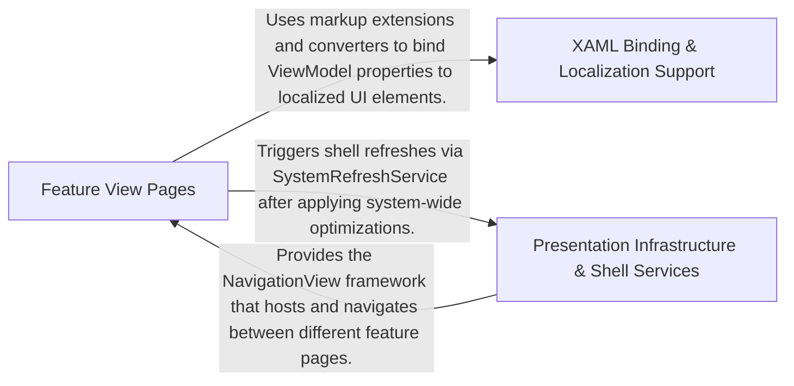

## Details

Handles user interaction, visual layout, and WPF-specific rendering logic, providing the primary interface for system optimization.

### Feature View Pages
Contains the primary user interface screens and category-specific layouts where users interact with optimization and customization modules.

**Related Classes/Methods**:

- `UI.Pages.Customize.Categories.CustomizeCategoryPage`

**Source Files:**

- [`optimizerDuck.Test/Domain/Optimizations/PowerManagementTests.cs`](https://github.com/CodeBoarding/optimizerDuck/blob/master/.codeboardingoptimizerDuck.Test/Domain/Optimizations/PowerManagementTests.cs)
  - `Domain.Optimizations.PowerManagementTests` ([L8-L27](https://github.com/CodeBoarding/optimizerDuck/blob/master/.codeboardingoptimizerDuck.Test/Domain/Optimizations/PowerManagementTests.cs#L8-L27)) - Class
  - `Domain.Optimizations.PowerManagementTests.RegistryPath_WithHklmPrefix_IsReadable()` ([L11-L26](https://github.com/CodeBoarding/optimizerDuck/blob/master/.codeboardingoptimizerDuck.Test/Domain/Optimizations/PowerManagementTests.cs#L11-L26)) - Method
- [`optimizerDuck/Domain/Optimizations/Models/Bloatware/AppXPackage.cs`](https://github.com/CodeBoarding/optimizerDuck/blob/master/.codeboardingoptimizerDuck/Domain/Optimizations/Models/Bloatware/AppXPackage.cs)
  - `Domain.Optimizations.Models.Bloatware.AppXPackage.AppRisk` ([L11-L17](https://github.com/CodeBoarding/optimizerDuck/blob/master/.codeboardingoptimizerDuck/Domain/Optimizations/Models/Bloatware/AppXPackage.cs#L11-L17)) - Enum
  - `Domain.Optimizations.Models.Bloatware.AppXPackage` ([L21-L92](https://github.com/CodeBoarding/optimizerDuck/blob/master/.codeboardingoptimizerDuck/Domain/Optimizations/Models/Bloatware/AppXPackage.cs#L21-L92)) - Class
- [`optimizerDuck/Resources/Languages/Translations.Designer.cs`](https://github.com/CodeBoarding/optimizerDuck/blob/master/.codeboardingoptimizerDuck/Resources/Languages/Translations.Designer.cs)
  - `Resources.Languages.Translations.Designer.Translations` ([L25-L5072](https://github.com/CodeBoarding/optimizerDuck/blob/master/.codeboardingoptimizerDuck/Resources/Languages/Translations.Designer.cs#L25-L5072)) - Class
  - `Resources.Languages.Translations.Designer.Translations.Translations()` ([L32-L34](https://github.com/CodeBoarding/optimizerDuck/blob/master/.codeboardingoptimizerDuck/Resources/Languages/Translations.Designer.cs#L32-L34)) - Constructor
- [`optimizerDuck/UI/Dialogs/ScheduledTaskCreateDialog.xaml.cs`](https://github.com/CodeBoarding/optimizerDuck/blob/master/.codeboardingoptimizerDuck/UI/Dialogs/ScheduledTaskCreateDialog.xaml.cs)
  - `UI.Dialogs.ScheduledTaskCreateDialog.xaml.ScheduledTaskCreateDialog` ([L6-L59](https://github.com/CodeBoarding/optimizerDuck/blob/master/.codeboardingoptimizerDuck/UI/Dialogs/ScheduledTaskCreateDialog.xaml.cs#L6-L59)) - Class
  - `UI.Dialogs.ScheduledTaskCreateDialog.xaml.ScheduledTaskCreateDialog.ScheduledTaskCreateDialog()` ([L8-L12](https://github.com/CodeBoarding/optimizerDuck/blob/master/.codeboardingoptimizerDuck/UI/Dialogs/ScheduledTaskCreateDialog.xaml.cs#L8-L12)) - Constructor
- [`optimizerDuck/UI/Pages/BloatwarePage.xaml.cs`](https://github.com/CodeBoarding/optimizerDuck/blob/master/.codeboardingoptimizerDuck/UI/Pages/BloatwarePage.xaml.cs)
  - `UI.Pages.BloatwarePage.xaml.BloatwarePage` ([L6-L18](https://github.com/CodeBoarding/optimizerDuck/blob/master/.codeboardingoptimizerDuck/UI/Pages/BloatwarePage.xaml.cs#L6-L18)) - Class
  - `UI.Pages.BloatwarePage.xaml.BloatwarePage.BloatwarePage(BloatwareViewModel viewModel)` ([L8-L15](https://github.com/CodeBoarding/optimizerDuck/blob/master/.codeboardingoptimizerDuck/UI/Pages/BloatwarePage.xaml.cs#L8-L15)) - Constructor
- [`optimizerDuck/UI/Pages/Customize/Categories/CustomizeCategoryPage.xaml.cs`](https://github.com/CodeBoarding/optimizerDuck/blob/master/.codeboardingoptimizerDuck/UI/Pages/Customize/Categories/CustomizeCategoryPage.xaml.cs)
  - `UI.Pages.Customize.Categories.CustomizeCategoryPage.xaml.CustomizeCategoryPage` ([L6-L17](https://github.com/CodeBoarding/optimizerDuck/blob/master/.codeboardingoptimizerDuck/UI/Pages/Customize/Categories/CustomizeCategoryPage.xaml.cs#L6-L17)) - Class
  - `UI.Pages.Customize.Categories.CustomizeCategoryPage.xaml.CustomizeCategoryPage.CustomizeCategoryPage(CustomizeCategoryViewModel viewModel)` ([L8-L14](https://github.com/CodeBoarding/optimizerDuck/blob/master/.codeboardingoptimizerDuck/UI/Pages/Customize/Categories/CustomizeCategoryPage.xaml.cs#L8-L14)) - Constructor
- [`optimizerDuck/UI/Pages/Customize/Categories/CustomizeCategoryPages.cs`](https://github.com/CodeBoarding/optimizerDuck/blob/master/.codeboardingoptimizerDuck/UI/Pages/Customize/Categories/CustomizeCategoryPages.cs)
  - `UI.Pages.Customize.Categories.CustomizeCategoryPages.PreferencesFeatureCategory` ([L5-L13](https://github.com/CodeBoarding/optimizerDuck/blob/master/.codeboardingoptimizerDuck/UI/Pages/Customize/Categories/CustomizeCategoryPages.cs#L5-L13)) - Class
  - `UI.Pages.Customize.Categories.CustomizeCategoryPages.PreferencesFeatureCategory.PreferencesFeatureCategory(CustomizeCategoryViewModel viewModel)` ([L7-L12](https://github.com/CodeBoarding/optimizerDuck/blob/master/.codeboardingoptimizerDuck/UI/Pages/Customize/Categories/CustomizeCategoryPages.cs#L7-L12)) - Constructor
  - `UI.Pages.Customize.Categories.CustomizeCategoryPages.SystemFeatureCategory` ([L14-L22](https://github.com/CodeBoarding/optimizerDuck/blob/master/.codeboardingoptimizerDuck/UI/Pages/Customize/Categories/CustomizeCategoryPages.cs#L14-L22)) - Class
  - `UI.Pages.Customize.Categories.CustomizeCategoryPages.SystemFeatureCategory.SystemFeatureCategory(CustomizeCategoryViewModel viewModel)` ([L16-L21](https://github.com/CodeBoarding/optimizerDuck/blob/master/.codeboardingoptimizerDuck/UI/Pages/Customize/Categories/CustomizeCategoryPages.cs#L16-L21)) - Constructor
  - `UI.Pages.Customize.Categories.CustomizeCategoryPages.GamingFeatureCategory` ([L23-L31](https://github.com/CodeBoarding/optimizerDuck/blob/master/.codeboardingoptimizerDuck/UI/Pages/Customize/Categories/CustomizeCategoryPages.cs#L23-L31)) - Class
  - `UI.Pages.Customize.Categories.CustomizeCategoryPages.GamingFeatureCategory.GamingFeatureCategory(CustomizeCategoryViewModel viewModel)` ([L25-L30](https://github.com/CodeBoarding/optimizerDuck/blob/master/.codeboardingoptimizerDuck/UI/Pages/Customize/Categories/CustomizeCategoryPages.cs#L25-L30)) - Constructor
  - `UI.Pages.Customize.Categories.CustomizeCategoryPages.DesktopFeatureCategory` ([L32-L40](https://github.com/CodeBoarding/optimizerDuck/blob/master/.codeboardingoptimizerDuck/UI/Pages/Customize/Categories/CustomizeCategoryPages.cs#L32-L40)) - Class
  - `UI.Pages.Customize.Categories.CustomizeCategoryPages.DesktopFeatureCategory.DesktopFeatureCategory(CustomizeCategoryViewModel viewModel)` ([L34-L39](https://github.com/CodeBoarding/optimizerDuck/blob/master/.codeboardingoptimizerDuck/UI/Pages/Customize/Categories/CustomizeCategoryPages.cs#L34-L39)) - Constructor
- [`optimizerDuck/UI/Pages/DashboardPage.xaml.cs`](https://github.com/CodeBoarding/optimizerDuck/blob/master/.codeboardingoptimizerDuck/UI/Pages/DashboardPage.xaml.cs)
  - `UI.Pages.DashboardPage.xaml.DashboardPage` ([L6-L18](https://github.com/CodeBoarding/optimizerDuck/blob/master/.codeboardingoptimizerDuck/UI/Pages/DashboardPage.xaml.cs#L6-L18)) - Class
  - `UI.Pages.DashboardPage.xaml.DashboardPage.DashboardPage(DashboardViewModel viewModel)` ([L8-L15](https://github.com/CodeBoarding/optimizerDuck/blob/master/.codeboardingoptimizerDuck/UI/Pages/DashboardPage.xaml.cs#L8-L15)) - Constructor
- [`optimizerDuck/UI/Pages/DiskCleanupPage.xaml.cs`](https://github.com/CodeBoarding/optimizerDuck/blob/master/.codeboardingoptimizerDuck/UI/Pages/DiskCleanupPage.xaml.cs)
  - `UI.Pages.DiskCleanupPage.xaml.DiskCleanupPage` ([L6-L18](https://github.com/CodeBoarding/optimizerDuck/blob/master/.codeboardingoptimizerDuck/UI/Pages/DiskCleanupPage.xaml.cs#L6-L18)) - Class
  - `UI.Pages.DiskCleanupPage.xaml.DiskCleanupPage.DiskCleanupPage(DiskCleanupViewModel viewModel)` ([L8-L15](https://github.com/CodeBoarding/optimizerDuck/blob/master/.codeboardingoptimizerDuck/UI/Pages/DiskCleanupPage.xaml.cs#L8-L15)) - Constructor
- [`optimizerDuck/UI/Pages/Optimize/Categories/OptimizationPage.xaml.cs`](https://github.com/CodeBoarding/optimizerDuck/blob/master/.codeboardingoptimizerDuck/UI/Pages/Optimize/Categories/OptimizationPage.xaml.cs)
  - `UI.Pages.Optimize.Categories.OptimizationPage.xaml.OptimizationPage` ([L6-L18](https://github.com/CodeBoarding/optimizerDuck/blob/master/.codeboardingoptimizerDuck/UI/Pages/Optimize/Categories/OptimizationPage.xaml.cs#L6-L18)) - Class
  - `UI.Pages.Optimize.Categories.OptimizationPage.xaml.OptimizationPage.OptimizationPage(OptimizationCategoryViewModel viewModel)` ([L8-L15](https://github.com/CodeBoarding/optimizerDuck/blob/master/.codeboardingoptimizerDuck/UI/Pages/Optimize/Categories/OptimizationPage.xaml.cs#L8-L15)) - Constructor
- [`optimizerDuck/UI/Pages/Optimize/Categories/OptimizationPages.cs`](https://github.com/CodeBoarding/optimizerDuck/blob/master/.codeboardingoptimizerDuck/UI/Pages/Optimize/Categories/OptimizationPages.cs)
  - `UI.Pages.Optimize.Categories.OptimizationPages.PowerManagementOptimizerPage` ([L5-L13](https://github.com/CodeBoarding/optimizerDuck/blob/master/.codeboardingoptimizerDuck/UI/Pages/Optimize/Categories/OptimizationPages.cs#L5-L13)) - Class
  - `UI.Pages.Optimize.Categories.OptimizationPages.PowerManagementOptimizerPage.PowerManagementOptimizerPage(OptimizationCategoryViewModel viewModel)` ([L7-L12](https://github.com/CodeBoarding/optimizerDuck/blob/master/.codeboardingoptimizerDuck/UI/Pages/Optimize/Categories/OptimizationPages.cs#L7-L12)) - Constructor
  - `UI.Pages.Optimize.Categories.OptimizationPages.UserExperienceOptimizerPage` ([L14-L22](https://github.com/CodeBoarding/optimizerDuck/blob/master/.codeboardingoptimizerDuck/UI/Pages/Optimize/Categories/OptimizationPages.cs#L14-L22)) - Class
  - `UI.Pages.Optimize.Categories.OptimizationPages.UserExperienceOptimizerPage.UserExperienceOptimizerPage(OptimizationCategoryViewModel viewModel)` ([L16-L21](https://github.com/CodeBoarding/optimizerDuck/blob/master/.codeboardingoptimizerDuck/UI/Pages/Optimize/Categories/OptimizationPages.cs#L16-L21)) - Constructor
  - `UI.Pages.Optimize.Categories.OptimizationPages.BloatwareAndServicesOptimizerPage` ([L23-L31](https://github.com/CodeBoarding/optimizerDuck/blob/master/.codeboardingoptimizerDuck/UI/Pages/Optimize/Categories/OptimizationPages.cs#L23-L31)) - Class
  - `UI.Pages.Optimize.Categories.OptimizationPages.BloatwareAndServicesOptimizerPage.BloatwareAndServicesOptimizerPage(OptimizationCategoryViewModel viewModel)` ([L25-L30](https://github.com/CodeBoarding/optimizerDuck/blob/master/.codeboardingoptimizerDuck/UI/Pages/Optimize/Categories/OptimizationPages.cs#L25-L30)) - Constructor
  - `UI.Pages.Optimize.Categories.OptimizationPages.GpuOptimizerPage` ([L32-L40](https://github.com/CodeBoarding/optimizerDuck/blob/master/.codeboardingoptimizerDuck/UI/Pages/Optimize/Categories/OptimizationPages.cs#L32-L40)) - Class
  - `UI.Pages.Optimize.Categories.OptimizationPages.GpuOptimizerPage.GpuOptimizerPage(OptimizationCategoryViewModel viewModel)` ([L34-L39](https://github.com/CodeBoarding/optimizerDuck/blob/master/.codeboardingoptimizerDuck/UI/Pages/Optimize/Categories/OptimizationPages.cs#L34-L39)) - Constructor
  - `UI.Pages.Optimize.Categories.OptimizationPages.PerformanceOptimizerPage` ([L41-L49](https://github.com/CodeBoarding/optimizerDuck/blob/master/.codeboardingoptimizerDuck/UI/Pages/Optimize/Categories/OptimizationPages.cs#L41-L49)) - Class
  - `UI.Pages.Optimize.Categories.OptimizationPages.PerformanceOptimizerPage.PerformanceOptimizerPage(OptimizationCategoryViewModel viewModel)` ([L43-L48](https://github.com/CodeBoarding/optimizerDuck/blob/master/.codeboardingoptimizerDuck/UI/Pages/Optimize/Categories/OptimizationPages.cs#L43-L48)) - Constructor
  - `UI.Pages.Optimize.Categories.OptimizationPages.SecurityAndPrivacyOptimizerPage` ([L50-L58](https://github.com/CodeBoarding/optimizerDuck/blob/master/.codeboardingoptimizerDuck/UI/Pages/Optimize/Categories/OptimizationPages.cs#L50-L58)) - Class
  - `UI.Pages.Optimize.Categories.OptimizationPages.SecurityAndPrivacyOptimizerPage.SecurityAndPrivacyOptimizerPage(OptimizationCategoryViewModel viewModel)` ([L52-L57](https://github.com/CodeBoarding/optimizerDuck/blob/master/.codeboardingoptimizerDuck/UI/Pages/Optimize/Categories/OptimizationPages.cs#L52-L57)) - Constructor
- [`optimizerDuck/UI/Pages/Optimize/OptimizePage.xaml.cs`](https://github.com/CodeBoarding/optimizerDuck/blob/master/.codeboardingoptimizerDuck/UI/Pages/Optimize/OptimizePage.xaml.cs)
  - `UI.Pages.Optimize.OptimizePage.xaml.OptimizePage` ([L8-L36](https://github.com/CodeBoarding/optimizerDuck/blob/master/.codeboardingoptimizerDuck/UI/Pages/Optimize/OptimizePage.xaml.cs#L8-L36)) - Class
  - `UI.Pages.Optimize.OptimizePage.xaml.OptimizePage.OptimizePage(OptimizeViewModel viewModel, INavigationViewPageProvider pageProvider)` ([L10-L20](https://github.com/CodeBoarding/optimizerDuck/blob/master/.codeboardingoptimizerDuck/UI/Pages/Optimize/OptimizePage.xaml.cs#L10-L20)) - Constructor
  - `UI.Pages.Optimize.OptimizePage.xaml.OptimizePage.OnOptimizationsLoaded()` ([L23-L35](https://github.com/CodeBoarding/optimizerDuck/blob/master/.codeboardingoptimizerDuck/UI/Pages/Optimize/OptimizePage.xaml.cs#L23-L35)) - Method
- [`optimizerDuck/UI/Pages/ScheduledTasksPage.xaml.cs`](https://github.com/CodeBoarding/optimizerDuck/blob/master/.codeboardingoptimizerDuck/UI/Pages/ScheduledTasksPage.xaml.cs)
  - `UI.Pages.ScheduledTasksPage.xaml.ScheduledTasksPage` ([L6-L17](https://github.com/CodeBoarding/optimizerDuck/blob/master/.codeboardingoptimizerDuck/UI/Pages/ScheduledTasksPage.xaml.cs#L6-L17)) - Class
  - `UI.Pages.ScheduledTasksPage.xaml.ScheduledTasksPage.ScheduledTasksPage(ScheduledTasksViewModel viewModel)` ([L8-L14](https://github.com/CodeBoarding/optimizerDuck/blob/master/.codeboardingoptimizerDuck/UI/Pages/ScheduledTasksPage.xaml.cs#L8-L14)) - Constructor
- [`optimizerDuck/UI/Pages/SettingsPage.xaml.cs`](https://github.com/CodeBoarding/optimizerDuck/blob/master/.codeboardingoptimizerDuck/UI/Pages/SettingsPage.xaml.cs)
  - `UI.Pages.SettingsPage.xaml.SettingsPage` ([L6-L17](https://github.com/CodeBoarding/optimizerDuck/blob/master/.codeboardingoptimizerDuck/UI/Pages/SettingsPage.xaml.cs#L6-L17)) - Class
  - `UI.Pages.SettingsPage.xaml.SettingsPage.SettingsPage(SettingsViewModel viewModel)` ([L8-L14](https://github.com/CodeBoarding/optimizerDuck/blob/master/.codeboardingoptimizerDuck/UI/Pages/SettingsPage.xaml.cs#L8-L14)) - Constructor
- [`optimizerDuck/UI/Pages/StartupManagerPage.xaml.cs`](https://github.com/CodeBoarding/optimizerDuck/blob/master/.codeboardingoptimizerDuck/UI/Pages/StartupManagerPage.xaml.cs)
  - `UI.Pages.StartupManagerPage.xaml.StartupManagerPage` ([L6-L17](https://github.com/CodeBoarding/optimizerDuck/blob/master/.codeboardingoptimizerDuck/UI/Pages/StartupManagerPage.xaml.cs#L6-L17)) - Class
  - `UI.Pages.StartupManagerPage.xaml.StartupManagerPage.StartupManagerPage(StartupManagerViewModel viewModel)` ([L8-L14](https://github.com/CodeBoarding/optimizerDuck/blob/master/.codeboardingoptimizerDuck/UI/Pages/StartupManagerPage.xaml.cs#L8-L14)) - Constructor

### Presentation Infrastructure & Shell Services
Provides the foundational UI controls, navigation logic, and services that interact directly with the Windows Shell to refresh the system environment.

**Related Classes/Methods**:

- `UI.Controls.FilledNavigationViewItem`:9-27
- `Common.Helpers.SystemRefreshService`:5-275
- `Common.Helpers.ThemeResource`:5-13

**Source Files:**

- [`optimizerDuck.Test/Common/Helpers/SystemRefreshServiceTests.cs`](https://github.com/CodeBoarding/optimizerDuck/blob/master/.codeboardingoptimizerDuck.Test/Common/Helpers/SystemRefreshServiceTests.cs)
  - `Common.Helpers.SystemRefreshServiceTests` ([L5-L119](https://github.com/CodeBoarding/optimizerDuck/blob/master/.codeboardingoptimizerDuck.Test/Common/Helpers/SystemRefreshServiceTests.cs#L5-L119)) - Class
  - `Common.Helpers.SystemRefreshServiceTests.NotifySettingChange_DoesNotThrow()` ([L8-L13](https://github.com/CodeBoarding/optimizerDuck/blob/master/.codeboardingoptimizerDuck.Test/Common/Helpers/SystemRefreshServiceTests.cs#L8-L13)) - Method
  - `Common.Helpers.SystemRefreshServiceTests.RefreshShell_DoesNotThrow()` ([L15-L20](https://github.com/CodeBoarding/optimizerDuck/blob/master/.codeboardingoptimizerDuck.Test/Common/Helpers/SystemRefreshServiceTests.cs#L15-L20)) - Method
  - `Common.Helpers.SystemRefreshServiceTests.NotifySettingChange_ThenRefreshShell_DoesNotThrow()` ([L22-L30](https://github.com/CodeBoarding/optimizerDuck/blob/master/.codeboardingoptimizerDuck.Test/Common/Helpers/SystemRefreshServiceTests.cs#L22-L30)) - Method
  - `Common.Helpers.SystemRefreshServiceTests.NotifySettingChange_CanBeCalledMultipleTimes()` ([L32-L40](https://github.com/CodeBoarding/optimizerDuck/blob/master/.codeboardingoptimizerDuck.Test/Common/Helpers/SystemRefreshServiceTests.cs#L32-L40)) - Method
  - `Common.Helpers.SystemRefreshServiceTests.NotifyTaskbarSettingChange_DoesNotThrow()` ([L42-L49](https://github.com/CodeBoarding/optimizerDuck/blob/master/.codeboardingoptimizerDuck.Test/Common/Helpers/SystemRefreshServiceTests.cs#L42-L49)) - Method
  - `Common.Helpers.SystemRefreshServiceTests.RefreshDesktop_DoesNotThrow()` ([L51-L56](https://github.com/CodeBoarding/optimizerDuck/blob/master/.codeboardingoptimizerDuck.Test/Common/Helpers/SystemRefreshServiceTests.cs#L51-L56)) - Method
  - `Common.Helpers.SystemRefreshServiceTests.UpdatePerUserSystemParameters_DoesNotThrow()` ([L58-L65](https://github.com/CodeBoarding/optimizerDuck/blob/master/.codeboardingoptimizerDuck.Test/Common/Helpers/SystemRefreshServiceTests.cs#L58-L65)) - Method
  - `Common.Helpers.SystemRefreshServiceTests.NotifyThemeChanged_DoesNotThrow()` ([L67-L72](https://github.com/CodeBoarding/optimizerDuck/blob/master/.codeboardingoptimizerDuck.Test/Common/Helpers/SystemRefreshServiceTests.cs#L67-L72)) - Method
  - `Common.Helpers.SystemRefreshServiceTests.SetDesktopIconsVisible_True_DoesNotThrow()` ([L74-L81](https://github.com/CodeBoarding/optimizerDuck/blob/master/.codeboardingoptimizerDuck.Test/Common/Helpers/SystemRefreshServiceTests.cs#L74-L81)) - Method
  - `Common.Helpers.SystemRefreshServiceTests.SetDesktopIconsVisible_False_DoesNotThrow()` ([L83-L90](https://github.com/CodeBoarding/optimizerDuck/blob/master/.codeboardingoptimizerDuck.Test/Common/Helpers/SystemRefreshServiceTests.cs#L83-L90)) - Method
  - `Common.Helpers.SystemRefreshServiceTests.RefreshDesktopIconVisibilityFromRegistry_DoesNotThrow()` ([L92-L99](https://github.com/CodeBoarding/optimizerDuck/blob/master/.codeboardingoptimizerDuck.Test/Common/Helpers/SystemRefreshServiceTests.cs#L92-L99)) - Method
  - `Common.Helpers.SystemRefreshServiceTests.SetDesktopIconsVisible_ToggleBackAndForth_DoesNotThrow()` ([L101-L118](https://github.com/CodeBoarding/optimizerDuck/blob/master/.codeboardingoptimizerDuck.Test/Common/Helpers/SystemRefreshServiceTests.cs#L101-L118)) - Method
- [`optimizerDuck/Common/Helpers/EmbeddedResourceHelper.cs`](https://github.com/CodeBoarding/optimizerDuck/blob/master/.codeboardingoptimizerDuck/Common/Helpers/EmbeddedResourceHelper.cs)
  - `Common.Helpers.EmbeddedResourceHelper` ([L9-L120](https://github.com/CodeBoarding/optimizerDuck/blob/master/.codeboardingoptimizerDuck/Common/Helpers/EmbeddedResourceHelper.cs#L9-L120)) - Class
- [`optimizerDuck/Common/Helpers/ReflectionHelper.cs`](https://github.com/CodeBoarding/optimizerDuck/blob/master/.codeboardingoptimizerDuck/Common/Helpers/ReflectionHelper.cs)
  - `Common.Helpers.ReflectionHelper` ([L5-L61](https://github.com/CodeBoarding/optimizerDuck/blob/master/.codeboardingoptimizerDuck/Common/Helpers/ReflectionHelper.cs#L5-L61)) - Class
- [`optimizerDuck/Common/Helpers/Shared.cs`](https://github.com/CodeBoarding/optimizerDuck/blob/master/.codeboardingoptimizerDuck/Common/Helpers/Shared.cs)
  - `Common.Helpers.Shared` ([L6-L152](https://github.com/CodeBoarding/optimizerDuck/blob/master/.codeboardingoptimizerDuck/Common/Helpers/Shared.cs#L6-L152)) - Class
- [`optimizerDuck/Common/Helpers/SystemRefreshService.cs`](https://github.com/CodeBoarding/optimizerDuck/blob/master/.codeboardingoptimizerDuck/Common/Helpers/SystemRefreshService.cs)
  - `Common.Helpers.SystemRefreshService` ([L5-L275](https://github.com/CodeBoarding/optimizerDuck/blob/master/.codeboardingoptimizerDuck/Common/Helpers/SystemRefreshService.cs#L5-L275)) - Class
- [`optimizerDuck/Common/Helpers/ThemeResource.cs`](https://github.com/CodeBoarding/optimizerDuck/blob/master/.codeboardingoptimizerDuck/Common/Helpers/ThemeResource.cs)
  - `Common.Helpers.ThemeResource` ([L5-L13](https://github.com/CodeBoarding/optimizerDuck/blob/master/.codeboardingoptimizerDuck/Common/Helpers/ThemeResource.cs#L5-L13)) - Class
- [`optimizerDuck/UI/Controls/FilledNavigationViewItem.cs`](https://github.com/CodeBoarding/optimizerDuck/blob/master/.codeboardingoptimizerDuck/UI/Controls/FilledNavigationViewItem.cs)
  - `UI.Controls.FilledNavigationViewItem` ([L9-L27](https://github.com/CodeBoarding/optimizerDuck/blob/master/.codeboardingoptimizerDuck/UI/Controls/FilledNavigationViewItem.cs#L9-L27)) - Class
  - `UI.Controls.FilledNavigationViewItem.Activate(INavigationView navigationView)` ([L11-L18](https://github.com/CodeBoarding/optimizerDuck/blob/master/.codeboardingoptimizerDuck/UI/Controls/FilledNavigationViewItem.cs#L11-L18)) - Method
  - `UI.Controls.FilledNavigationViewItem.Deactivate(INavigationView navigationView)` ([L19-L26](https://github.com/CodeBoarding/optimizerDuck/blob/master/.codeboardingoptimizerDuck/UI/Controls/FilledNavigationViewItem.cs#L19-L26)) - Method

### XAML Binding & Localization Support
Manages the transformation of ViewModel data into UI-ready formats and handles the dynamic injection of localized strings into XAML elements.

**Related Classes/Methods**:

- `Common.Extensions.LanguageExtensions.LocExtension`:11-106
- `Common.Converters.BooleanToVisibilityConverter`:5-7
- `Common.Converters.MBToGBConverter`:6-25

**Source Files:**

- [`optimizerDuck/Common/Converters/BooleanConverter.cs`](https://github.com/CodeBoarding/optimizerDuck/blob/master/.codeboardingoptimizerDuck/Common/Converters/BooleanConverter.cs)
  - `Common.Converters.BooleanConverter.BooleanConverter<T>` ([L10-L35](https://github.com/CodeBoarding/optimizerDuck/blob/master/.codeboardingoptimizerDuck/Common/Converters/BooleanConverter.cs#L10-L35)) - Class
  - `Common.Converters.BooleanConverter.BooleanConverter<T>.Convert(object? value, Type targetType, object? parameter, CultureInfo culture)` ([L15-L24](https://github.com/CodeBoarding/optimizerDuck/blob/master/.codeboardingoptimizerDuck/Common/Converters/BooleanConverter.cs#L15-L24)) - Method
  - `Common.Converters.BooleanConverter.BooleanConverter<T>.ConvertBack(object? value, Type targetType, object? parameter, CultureInfo culture)` ([L25-L34](https://github.com/CodeBoarding/optimizerDuck/blob/master/.codeboardingoptimizerDuck/Common/Converters/BooleanConverter.cs#L25-L34)) - Method
- [`optimizerDuck/Common/Converters/BooleanToVisibilityConverter.cs`](https://github.com/CodeBoarding/optimizerDuck/blob/master/.codeboardingoptimizerDuck/Common/Converters/BooleanToVisibilityConverter.cs)
  - `Common.Converters.BooleanToVisibilityConverter` ([L5-L7](https://github.com/CodeBoarding/optimizerDuck/blob/master/.codeboardingoptimizerDuck/Common/Converters/BooleanToVisibilityConverter.cs#L5-L7)) - Class
- [`optimizerDuck/Common/Converters/EmptyWhileNotLoadingConverter.cs`](https://github.com/CodeBoarding/optimizerDuck/blob/master/.codeboardingoptimizerDuck/Common/Converters/EmptyWhileNotLoadingConverter.cs)
  - `Common.Converters.EmptyWhileNotLoadingConverter` ([L7-L30](https://github.com/CodeBoarding/optimizerDuck/blob/master/.codeboardingoptimizerDuck/Common/Converters/EmptyWhileNotLoadingConverter.cs#L7-L30)) - Class
  - `Common.Converters.EmptyWhileNotLoadingConverter.Convert(object[] values, Type targetType, object parameter, CultureInfo culture)` ([L9-L19](https://github.com/CodeBoarding/optimizerDuck/blob/master/.codeboardingoptimizerDuck/Common/Converters/EmptyWhileNotLoadingConverter.cs#L9-L19)) - Method
  - `Common.Converters.EmptyWhileNotLoadingConverter.ConvertBack(object value, Type[] targetTypes, object parameter, CultureInfo culture)` ([L20-L29](https://github.com/CodeBoarding/optimizerDuck/blob/master/.codeboardingoptimizerDuck/Common/Converters/EmptyWhileNotLoadingConverter.cs#L20-L29)) - Method
- [`optimizerDuck/Common/Converters/EqualityToVisibilityConverter.cs`](https://github.com/CodeBoarding/optimizerDuck/blob/master/.codeboardingoptimizerDuck/Common/Converters/EqualityToVisibilityConverter.cs)
  - `Common.Converters.EqualityToVisibilityConverter` ([L7-L33](https://github.com/CodeBoarding/optimizerDuck/blob/master/.codeboardingoptimizerDuck/Common/Converters/EqualityToVisibilityConverter.cs#L7-L33)) - Class
  - `Common.Converters.EqualityToVisibilityConverter.Convert(object? value, Type targetType, object? parameter, CultureInfo culture)` ([L12-L22](https://github.com/CodeBoarding/optimizerDuck/blob/master/.codeboardingoptimizerDuck/Common/Converters/EqualityToVisibilityConverter.cs#L12-L22)) - Method
  - `Common.Converters.EqualityToVisibilityConverter.ConvertBack(object? value, Type targetType, object? parameter, CultureInfo culture)` ([L23-L32](https://github.com/CodeBoarding/optimizerDuck/blob/master/.codeboardingoptimizerDuck/Common/Converters/EqualityToVisibilityConverter.cs#L23-L32)) - Method
- [`optimizerDuck/Common/Converters/InverseBooleanConverter.cs`](https://github.com/CodeBoarding/optimizerDuck/blob/master/.codeboardingoptimizerDuck/Common/Converters/InverseBooleanConverter.cs)
  - `Common.Converters.InverseBooleanConverter` ([L3-L4](https://github.com/CodeBoarding/optimizerDuck/blob/master/.codeboardingoptimizerDuck/Common/Converters/InverseBooleanConverter.cs#L3-L4)) - Class
- [`optimizerDuck/Common/Converters/InverseBooleanToVisibilityConverter.cs`](https://github.com/CodeBoarding/optimizerDuck/blob/master/.codeboardingoptimizerDuck/Common/Converters/InverseBooleanToVisibilityConverter.cs)
  - `Common.Converters.InverseBooleanToVisibilityConverter` ([L5-L7](https://github.com/CodeBoarding/optimizerDuck/blob/master/.codeboardingoptimizerDuck/Common/Converters/InverseBooleanToVisibilityConverter.cs#L5-L7)) - Class
- [`optimizerDuck/Common/Converters/MBToGBConverter.cs`](https://github.com/CodeBoarding/optimizerDuck/blob/master/.codeboardingoptimizerDuck/Common/Converters/MBToGBConverter.cs)
  - `Common.Converters.MBToGBConverter` ([L6-L25](https://github.com/CodeBoarding/optimizerDuck/blob/master/.codeboardingoptimizerDuck/Common/Converters/MBToGBConverter.cs#L6-L25)) - Class
  - `Common.Converters.MBToGBConverter.Convert(object? value, Type targetType, object? parameter, CultureInfo culture)` ([L8-L14](https://github.com/CodeBoarding/optimizerDuck/blob/master/.codeboardingoptimizerDuck/Common/Converters/MBToGBConverter.cs#L8-L14)) - Method
  - `Common.Converters.MBToGBConverter.ConvertBack(object? value, Type targetType, object? parameter, CultureInfo culture)` ([L15-L24](https://github.com/CodeBoarding/optimizerDuck/blob/master/.codeboardingoptimizerDuck/Common/Converters/MBToGBConverter.cs#L15-L24)) - Method
- [`optimizerDuck/Common/Converters/MinusNumberConverter.cs`](https://github.com/CodeBoarding/optimizerDuck/blob/master/.codeboardingoptimizerDuck/Common/Converters/MinusNumberConverter.cs)
  - `Common.Converters.MinusNumberConverter` ([L6-L22](https://github.com/CodeBoarding/optimizerDuck/blob/master/.codeboardingoptimizerDuck/Common/Converters/MinusNumberConverter.cs#L6-L22)) - Class
  - `Common.Converters.MinusNumberConverter.Convert(object value, Type targetType, object parameter, CultureInfo culture)` ([L10-L16](https://github.com/CodeBoarding/optimizerDuck/blob/master/.codeboardingoptimizerDuck/Common/Converters/MinusNumberConverter.cs#L10-L16)) - Method
  - `Common.Converters.MinusNumberConverter.ConvertBack(object value, Type targetType, object parameter, CultureInfo culture)` ([L17-L21](https://github.com/CodeBoarding/optimizerDuck/blob/master/.codeboardingoptimizerDuck/Common/Converters/MinusNumberConverter.cs#L17-L21)) - Method
- [`optimizerDuck/Common/Converters/NumericComparisonToVisibilityConverter.cs`](https://github.com/CodeBoarding/optimizerDuck/blob/master/.codeboardingoptimizerDuck/Common/Converters/NumericComparisonToVisibilityConverter.cs)
  - `Common.Converters.NumericComparisonToVisibilityConverter.NumericComparisonType` ([L7-L16](https://github.com/CodeBoarding/optimizerDuck/blob/master/.codeboardingoptimizerDuck/Common/Converters/NumericComparisonToVisibilityConverter.cs#L7-L16)) - Enum
  - `Common.Converters.NumericComparisonToVisibilityConverter` ([L17-L56](https://github.com/CodeBoarding/optimizerDuck/blob/master/.codeboardingoptimizerDuck/Common/Converters/NumericComparisonToVisibilityConverter.cs#L17-L56)) - Class
  - `Common.Converters.NumericComparisonToVisibilityConverter.Convert(object? value, Type targetType, object? parameter, CultureInfo culture)` ([L27-L45](https://github.com/CodeBoarding/optimizerDuck/blob/master/.codeboardingoptimizerDuck/Common/Converters/NumericComparisonToVisibilityConverter.cs#L27-L45)) - Method
  - `Common.Converters.NumericComparisonToVisibilityConverter.ConvertBack(object? value, Type targetType, object? parameter, CultureInfo culture)` ([L46-L55](https://github.com/CodeBoarding/optimizerDuck/blob/master/.codeboardingoptimizerDuck/Common/Converters/NumericComparisonToVisibilityConverter.cs#L46-L55)) - Method
- [`optimizerDuck/Common/Converters/ProgressBarValueToBrushConverter.cs`](https://github.com/CodeBoarding/optimizerDuck/blob/master/.codeboardingoptimizerDuck/Common/Converters/ProgressBarValueToBrushConverter.cs)
  - `Common.Converters.ProgressBarValueToBrushConverter` ([L8-L43](https://github.com/CodeBoarding/optimizerDuck/blob/master/.codeboardingoptimizerDuck/Common/Converters/ProgressBarValueToBrushConverter.cs#L8-L43)) - Class
  - `Common.Converters.ProgressBarValueToBrushConverter.Convert(object? value, Type targetType, object? parameter, CultureInfo culture)` ([L24-L37](https://github.com/CodeBoarding/optimizerDuck/blob/master/.codeboardingoptimizerDuck/Common/Converters/ProgressBarValueToBrushConverter.cs#L24-L37)) - Method
  - `Common.Converters.ProgressBarValueToBrushConverter.ConvertBack(object? value, Type targetType, object? parameter, CultureInfo culture)` ([L38-L42](https://github.com/CodeBoarding/optimizerDuck/blob/master/.codeboardingoptimizerDuck/Common/Converters/ProgressBarValueToBrushConverter.cs#L38-L42)) - Method
- [`optimizerDuck/Common/Converters/ProgressBarVisibilityConverter.cs`](https://github.com/CodeBoarding/optimizerDuck/blob/master/.codeboardingoptimizerDuck/Common/Converters/ProgressBarVisibilityConverter.cs)
  - `Common.Converters.ProgressBarVisibilityConverter` ([L7-L36](https://github.com/CodeBoarding/optimizerDuck/blob/master/.codeboardingoptimizerDuck/Common/Converters/ProgressBarVisibilityConverter.cs#L7-L36)) - Class
  - `Common.Converters.ProgressBarVisibilityConverter.Convert(object[] values, Type targetType, object parameter, CultureInfo culture)` ([L9-L25](https://github.com/CodeBoarding/optimizerDuck/blob/master/.codeboardingoptimizerDuck/Common/Converters/ProgressBarVisibilityConverter.cs#L9-L25)) - Method
  - `Common.Converters.ProgressBarVisibilityConverter.ConvertBack(object value, Type[] targetTypes, object parameter, CultureInfo culture)` ([L26-L35](https://github.com/CodeBoarding/optimizerDuck/blob/master/.codeboardingoptimizerDuck/Common/Converters/ProgressBarVisibilityConverter.cs#L26-L35)) - Method
- [`optimizerDuck/Common/Converters/RecommendationForegroundConverter.cs`](https://github.com/CodeBoarding/optimizerDuck/blob/master/.codeboardingoptimizerDuck/Common/Converters/RecommendationForegroundConverter.cs)
  - `Common.Converters.RecommendationForegroundConverter.ThemeBrushes` ([L11-L28](https://github.com/CodeBoarding/optimizerDuck/blob/master/.codeboardingoptimizerDuck/Common/Converters/RecommendationForegroundConverter.cs#L11-L28)) - Class
  - `Common.Converters.RecommendationForegroundConverter.ThemeBrushes.Clone(string key)` ([L19-L27](https://github.com/CodeBoarding/optimizerDuck/blob/master/.codeboardingoptimizerDuck/Common/Converters/RecommendationForegroundConverter.cs#L19-L27)) - Method
  - `Common.Converters.RecommendationForegroundConverter` ([L29-L66](https://github.com/CodeBoarding/optimizerDuck/blob/master/.codeboardingoptimizerDuck/Common/Converters/RecommendationForegroundConverter.cs#L29-L66)) - Class
  - `Common.Converters.RecommendationForegroundConverter.Convert(object[] values, Type targetType, object parameter, CultureInfo culture)` ([L31-L55](https://github.com/CodeBoarding/optimizerDuck/blob/master/.codeboardingoptimizerDuck/Common/Converters/RecommendationForegroundConverter.cs#L31-L55)) - Method
  - `Common.Converters.RecommendationForegroundConverter.ConvertBack(object value, Type[] targetTypes, object parameter, CultureInfo culture)` ([L56-L65](https://github.com/CodeBoarding/optimizerDuck/blob/master/.codeboardingoptimizerDuck/Common/Converters/RecommendationForegroundConverter.cs#L56-L65)) - Method
- [`optimizerDuck/Common/Converters/SizeToBrushConverter.cs`](https://github.com/CodeBoarding/optimizerDuck/blob/master/.codeboardingoptimizerDuck/Common/Converters/SizeToBrushConverter.cs)
  - `Common.Converters.SizeToBrushConverter` ([L12-L55](https://github.com/CodeBoarding/optimizerDuck/blob/master/.codeboardingoptimizerDuck/Common/Converters/SizeToBrushConverter.cs#L12-L55)) - Class
  - `Common.Converters.SizeToBrushConverter.Convert(object? value, Type targetType, object? parameter, CultureInfo culture)` ([L31-L44](https://github.com/CodeBoarding/optimizerDuck/blob/master/.codeboardingoptimizerDuck/Common/Converters/SizeToBrushConverter.cs#L31-L44)) - Method
  - `Common.Converters.SizeToBrushConverter.ConvertBack(object? value, Type targetType, object? parameter, CultureInfo culture)` ([L45-L54](https://github.com/CodeBoarding/optimizerDuck/blob/master/.codeboardingoptimizerDuck/Common/Converters/SizeToBrushConverter.cs#L45-L54)) - Method
- [`optimizerDuck/Common/Converters/ThemeConverterBase.cs`](https://github.com/CodeBoarding/optimizerDuck/blob/master/.codeboardingoptimizerDuck/Common/Converters/ThemeConverterBase.cs)
  - `Common.Converters.ThemeConverterBase.ThemeConverterBase<T>` ([L7-L26](https://github.com/CodeBoarding/optimizerDuck/blob/master/.codeboardingoptimizerDuck/Common/Converters/ThemeConverterBase.cs#L7-L26)) - Class
  - `Common.Converters.ThemeConverterBase.ThemeConverterBase<T>.Convert(object value, Type targetType, object parameter, CultureInfo culture)` ([L9-L16](https://github.com/CodeBoarding/optimizerDuck/blob/master/.codeboardingoptimizerDuck/Common/Converters/ThemeConverterBase.cs#L9-L16)) - Method
  - `Common.Converters.ThemeConverterBase.ThemeConverterBase<T>.ConvertBack(object value, Type targetType, object parameter, CultureInfo culture)` ([L17-L21](https://github.com/CodeBoarding/optimizerDuck/blob/master/.codeboardingoptimizerDuck/Common/Converters/ThemeConverterBase.cs#L17-L21)) - Method
  - `Common.Converters.ThemeConverterBase.ThemeConverterBase<T>.ConvertTheme(ApplicationTheme theme, object parameter)` ([L22-L23](https://github.com/CodeBoarding/optimizerDuck/blob/master/.codeboardingoptimizerDuck/Common/Converters/ThemeConverterBase.cs#L22-L23)) - Method
  - `Common.Converters.ThemeConverterBase.ThemeConverterBase<T>.GetDefault()` ([L24-L25](https://github.com/CodeBoarding/optimizerDuck/blob/master/.codeboardingoptimizerDuck/Common/Converters/ThemeConverterBase.cs#L24-L25)) - Method
- [`optimizerDuck/Common/Converters/ThemeToGitHubIconConverter.cs`](https://github.com/CodeBoarding/optimizerDuck/blob/master/.codeboardingoptimizerDuck/Common/Converters/ThemeToGitHubIconConverter.cs)
  - `Common.Converters.ThemeToGitHubIconConverter` ([L6-L20](https://github.com/CodeBoarding/optimizerDuck/blob/master/.codeboardingoptimizerDuck/Common/Converters/ThemeToGitHubIconConverter.cs#L6-L20)) - Class
  - `Common.Converters.ThemeToGitHubIconConverter.ConvertTheme(ApplicationTheme theme, object parameter)` ([L8-L19](https://github.com/CodeBoarding/optimizerDuck/blob/master/.codeboardingoptimizerDuck/Common/Converters/ThemeToGitHubIconConverter.cs#L8-L19)) - Method
- [`optimizerDuck/Common/Converters/ThemeToIndexConverter.cs`](https://github.com/CodeBoarding/optimizerDuck/blob/master/.codeboardingoptimizerDuck/Common/Converters/ThemeToIndexConverter.cs)
  - `Common.Converters.ThemeToIndexConverter` ([L7-L34](https://github.com/CodeBoarding/optimizerDuck/blob/master/.codeboardingoptimizerDuck/Common/Converters/ThemeToIndexConverter.cs#L7-L34)) - Class
  - `Common.Converters.ThemeToIndexConverter.Convert(object? value, Type targetType, object? parameter, CultureInfo culture)` ([L9-L18](https://github.com/CodeBoarding/optimizerDuck/blob/master/.codeboardingoptimizerDuck/Common/Converters/ThemeToIndexConverter.cs#L9-L18)) - Method
  - `Common.Converters.ThemeToIndexConverter.ConvertBack(object? value, Type targetType, object? parameter, CultureInfo culture)` ([L19-L33](https://github.com/CodeBoarding/optimizerDuck/blob/master/.codeboardingoptimizerDuck/Common/Converters/ThemeToIndexConverter.cs#L19-L33)) - Method
- [`optimizerDuck/Common/Converters/ValueConditionToVisibilityConverter.cs`](https://github.com/CodeBoarding/optimizerDuck/blob/master/.codeboardingoptimizerDuck/Common/Converters/ValueConditionToVisibilityConverter.cs)
  - `Common.Converters.ValueConditionToVisibilityConverter.ValueConditionType` ([L7-L16](https://github.com/CodeBoarding/optimizerDuck/blob/master/.codeboardingoptimizerDuck/Common/Converters/ValueConditionToVisibilityConverter.cs#L7-L16)) - Enum
  - `Common.Converters.ValueConditionToVisibilityConverter` ([L17-L51](https://github.com/CodeBoarding/optimizerDuck/blob/master/.codeboardingoptimizerDuck/Common/Converters/ValueConditionToVisibilityConverter.cs#L17-L51)) - Class
  - `Common.Converters.ValueConditionToVisibilityConverter.Convert(object? value, Type targetType, object? parameter, CultureInfo culture)` ([L25-L40](https://github.com/CodeBoarding/optimizerDuck/blob/master/.codeboardingoptimizerDuck/Common/Converters/ValueConditionToVisibilityConverter.cs#L25-L40)) - Method
  - `Common.Converters.ValueConditionToVisibilityConverter.ConvertBack(object? value, Type targetType, object? parameter, CultureInfo culture)` ([L41-L50](https://github.com/CodeBoarding/optimizerDuck/blob/master/.codeboardingoptimizerDuck/Common/Converters/ValueConditionToVisibilityConverter.cs#L41-L50)) - Method
- [`optimizerDuck/Common/Converters/WidthToColumnConverter.cs`](https://github.com/CodeBoarding/optimizerDuck/blob/master/.codeboardingoptimizerDuck/Common/Converters/WidthToColumnConverter.cs)
  - `Common.Converters.WidthToColumnConverter` ([L6-L31](https://github.com/CodeBoarding/optimizerDuck/blob/master/.codeboardingoptimizerDuck/Common/Converters/WidthToColumnConverter.cs#L6-L31)) - Class
  - `Common.Converters.WidthToColumnConverter.Convert(object? value, Type targetType, object? parameter, CultureInfo culture)` ([L8-L20](https://github.com/CodeBoarding/optimizerDuck/blob/master/.codeboardingoptimizerDuck/Common/Converters/WidthToColumnConverter.cs#L8-L20)) - Method
  - `Common.Converters.WidthToColumnConverter.ConvertBack(object? value, Type targetType, object? parameter, CultureInfo culture)` ([L21-L30](https://github.com/CodeBoarding/optimizerDuck/blob/master/.codeboardingoptimizerDuck/Common/Converters/WidthToColumnConverter.cs#L21-L30)) - Method
- [`optimizerDuck/Common/Extensions/LanguageExtensions.cs`](https://github.com/CodeBoarding/optimizerDuck/blob/master/.codeboardingoptimizerDuck/Common/Extensions/LanguageExtensions.cs)
  - `Common.Extensions.LanguageExtensions.LocExtension` ([L11-L106](https://github.com/CodeBoarding/optimizerDuck/blob/master/.codeboardingoptimizerDuck/Common/Extensions/LanguageExtensions.cs#L11-L106)) - Class
  - `Common.Extensions.LanguageExtensions.LocExtension.LocExtension()` ([L13-L14](https://github.com/CodeBoarding/optimizerDuck/blob/master/.codeboardingoptimizerDuck/Common/Extensions/LanguageExtensions.cs#L13-L14)) - Constructor
  - `Common.Extensions.LanguageExtensions.LocExtension.LocExtension(string key)` ([L15-L19](https://github.com/CodeBoarding/optimizerDuck/blob/master/.codeboardingoptimizerDuck/Common/Extensions/LanguageExtensions.cs#L15-L19)) - Constructor
  - `Common.Extensions.LanguageExtensions.LocExtension.LocExtension(string key, BindingBase arg1)` ([L20-L25](https://github.com/CodeBoarding/optimizerDuck/blob/master/.codeboardingoptimizerDuck/Common/Extensions/LanguageExtensions.cs#L20-L25)) - Constructor
  - `Common.Extensions.LanguageExtensions.LocExtension.LocExtension(string key, BindingBase arg1, BindingBase arg2)` ([L26-L32](https://github.com/CodeBoarding/optimizerDuck/blob/master/.codeboardingoptimizerDuck/Common/Extensions/LanguageExtensions.cs#L26-L32)) - Constructor
  - `Common.Extensions.LanguageExtensions.LocExtension.LocExtension(string key, BindingBase arg1, BindingBase arg2, BindingBase arg3)` ([L33-L40](https://github.com/CodeBoarding/optimizerDuck/blob/master/.codeboardingoptimizerDuck/Common/Extensions/LanguageExtensions.cs#L33-L40)) - Constructor
  - `Common.Extensions.LanguageExtensions.LocExtension.LocExtension(string key, BindingBase arg1, BindingBase arg2, BindingBase arg3, BindingBase arg4)` ([L41-L55](https://github.com/CodeBoarding/optimizerDuck/blob/master/.codeboardingoptimizerDuck/Common/Extensions/LanguageExtensions.cs#L41-L55)) - Constructor
  - `Common.Extensions.LanguageExtensions.LocExtension.LocExtension(string key, BindingBase arg1, BindingBase arg2, BindingBase arg3, BindingBase arg4, BindingBase arg5)` ([L56-L72](https://github.com/CodeBoarding/optimizerDuck/blob/master/.codeboardingoptimizerDuck/Common/Extensions/LanguageExtensions.cs#L56-L72)) - Constructor
  - `Common.Extensions.LanguageExtensions.LocExtension.ProvideValue(IServiceProvider serviceProvider)` ([L77-L105](https://github.com/CodeBoarding/optimizerDuck/blob/master/.codeboardingoptimizerDuck/Common/Extensions/LanguageExtensions.cs#L77-L105)) - Method
  - `Common.Extensions.LanguageExtensions.LocDynamicConverter` ([L107-L136](https://github.com/CodeBoarding/optimizerDuck/blob/master/.codeboardingoptimizerDuck/Common/Extensions/LanguageExtensions.cs#L107-L136)) - Class
  - `Common.Extensions.LanguageExtensions.LocDynamicConverter.Convert(object[] values, Type targetType, object? parameter, CultureInfo culture)` ([L109-L125](https://github.com/CodeBoarding/optimizerDuck/blob/master/.codeboardingoptimizerDuck/Common/Extensions/LanguageExtensions.cs#L109-L125)) - Method
  - `Common.Extensions.LanguageExtensions.LocDynamicConverter.ConvertBack(object value, Type[] targetTypes, object parameter, CultureInfo culture)` ([L126-L135](https://github.com/CodeBoarding/optimizerDuck/blob/master/.codeboardingoptimizerDuck/Common/Extensions/LanguageExtensions.cs#L126-L135)) - Method
- [`optimizerDuck/Common/Helpers/ThemeResource.cs`](https://github.com/CodeBoarding/optimizerDuck/blob/master/.codeboardingoptimizerDuck/Common/Helpers/ThemeResource.cs)
  - `Common.Helpers.ThemeResource.Get<T>(string key)` ([L7-L12](https://github.com/CodeBoarding/optimizerDuck/blob/master/.codeboardingoptimizerDuck/Common/Helpers/ThemeResource.cs#L7-L12)) - Method

### [FAQ](https://github.com/CodeBoarding/GeneratedOnBoardings/tree/main?tab=readme-ov-file#faq)