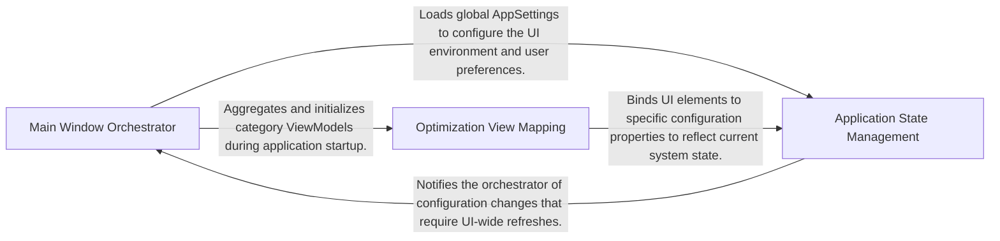

## Details

Bridges the UI and the Engine, managing application state, user commands, and the mapping of optimization categories to the view.

### Main Window Orchestrator
The primary entry point for the UI layer, managing top-level state, application initialization, and navigation between views.

**Related Classes/Methods**:

- `UI.ViewModels.Windows.MainWindowViewModel`:8-51

**Source Files:**

- [`optimizerDuck/UI/ViewModels/Windows/MainWindowViewModel.cs`](https://github.com/CodeBoarding/optimizerDuck/blob/master/.codeboardingoptimizerDuck/UI/ViewModels/Windows/MainWindowViewModel.cs)
  - `UI.ViewModels.Windows.MainWindowViewModel` ([L8-L51](https://github.com/CodeBoarding/optimizerDuck/blob/master/.codeboardingoptimizerDuck/UI/ViewModels/Windows/MainWindowViewModel.cs#L8-L51)) - Class
  - `UI.ViewModels.Windows.MainWindowViewModel.OpenSupportLink()` ([L19-L32](https://github.com/CodeBoarding/optimizerDuck/blob/master/.codeboardingoptimizerDuck/UI/ViewModels/Windows/MainWindowViewModel.cs#L19-L32)) - Method
  - `UI.ViewModels.Windows.MainWindowViewModel.OpenDiscordLink()` ([L37-L50](https://github.com/CodeBoarding/optimizerDuck/blob/master/.codeboardingoptimizerDuck/UI/ViewModels/Windows/MainWindowViewModel.cs#L37-L50)) - Method

### Optimization View Mapping
A translation layer converting technical optimization categories and system tags into interactive ViewModels for the UI.

**Related Classes/Methods**: _None_

**Source Files:**

- [`optimizerDuck/Domain/UI/OptimizationTags.cs`](https://github.com/CodeBoarding/optimizerDuck/blob/master/.codeboardingoptimizerDuck/Domain/UI/OptimizationTags.cs)
  - `Domain.UI.OptimizationTags.OptimizationTagsToDisplay` ([L48-L176](https://github.com/CodeBoarding/optimizerDuck/blob/master/.codeboardingoptimizerDuck/Domain/UI/OptimizationTags.cs#L48-L176)) - Class
  - `Domain.UI.OptimizationTags.OptimizationTagsToDisplay.OptimizationTagsToDisplay(OptimizationTags tags)` ([L50-L52](https://github.com/CodeBoarding/optimizerDuck/blob/master/.codeboardingoptimizerDuck/Domain/UI/OptimizationTags.cs#L50-L52)) - Constructor
  - `Domain.UI.OptimizationTags.OptimizationTagsToDisplay.ToDisplays()` ([L56-L67](https://github.com/CodeBoarding/optimizerDuck/blob/master/.codeboardingoptimizerDuck/Domain/UI/OptimizationTags.cs#L56-L67)) - Method
  - `Domain.UI.OptimizationTags.OptimizationTagsToDisplay.ToDisplay()` ([L71-L174](https://github.com/CodeBoarding/optimizerDuck/blob/master/.codeboardingoptimizerDuck/Domain/UI/OptimizationTags.cs#L71-L174)) - Method
  - `Domain.UI.OptimizationTags.OptimizationTagDisplay` ([L180-L192](https://github.com/CodeBoarding/optimizerDuck/blob/master/.codeboardingoptimizerDuck/Domain/UI/OptimizationTags.cs#L180-L192)) - Struct

### Application State Management
Manages persistent configuration and domain models, handling serialization of user preferences and providing observable data structures.

**Related Classes/Methods**:

- `Domain.Configuration.AppSettings`:8-78

**Source Files:**

- [`optimizerDuck/Domain/Configuration/AppSettings.cs`](https://github.com/CodeBoarding/optimizerDuck/blob/master/.codeboardingoptimizerDuck/Domain/Configuration/AppSettings.cs)
  - `Domain.Configuration.AppSettings.AppOptions` ([L28-L45](https://github.com/CodeBoarding/optimizerDuck/blob/master/.codeboardingoptimizerDuck/Domain/Configuration/AppSettings.cs#L28-L45)) - Class
  - `Domain.Configuration.AppSettings.OptimizeOptions` ([L49-L66](https://github.com/CodeBoarding/optimizerDuck/blob/master/.codeboardingoptimizerDuck/Domain/Configuration/AppSettings.cs#L49-L66)) - Class
  - `Domain.Configuration.AppSettings.BloatwareOptions` ([L70-L77](https://github.com/CodeBoarding/optimizerDuck/blob/master/.codeboardingoptimizerDuck/Domain/Configuration/AppSettings.cs#L70-L77)) - Class
- [`optimizerDuck/Domain/Optimizations/Models/StartupManager/StartupApp.cs`](https://github.com/CodeBoarding/optimizerDuck/blob/master/.codeboardingoptimizerDuck/Domain/Optimizations/Models/StartupManager/StartupApp.cs)
  - `Domain.Optimizations.Models.StartupManager.StartupApp.StartupAppLocation` ([L10-L19](https://github.com/CodeBoarding/optimizerDuck/blob/master/.codeboardingoptimizerDuck/Domain/Optimizations/Models/StartupManager/StartupApp.cs#L10-L19)) - Enum
  - `Domain.Optimizations.Models.StartupManager.StartupApp` ([L23-L105](https://github.com/CodeBoarding/optimizerDuck/blob/master/.codeboardingoptimizerDuck/Domain/Optimizations/Models/StartupManager/StartupApp.cs#L23-L105)) - Class
- [`optimizerDuck/Domain/Optimizations/Models/StartupManager/StartupTask.cs`](https://github.com/CodeBoarding/optimizerDuck/blob/master/.codeboardingoptimizerDuck/Domain/Optimizations/Models/StartupManager/StartupTask.cs)
  - `Domain.Optimizations.Models.StartupManager.StartupTask` ([L9-L59](https://github.com/CodeBoarding/optimizerDuck/blob/master/.codeboardingoptimizerDuck/Domain/Optimizations/Models/StartupManager/StartupTask.cs#L9-L59)) - Class

### [FAQ](https://github.com/CodeBoarding/GeneratedOnBoardings/tree/main?tab=readme-ov-file#faq)