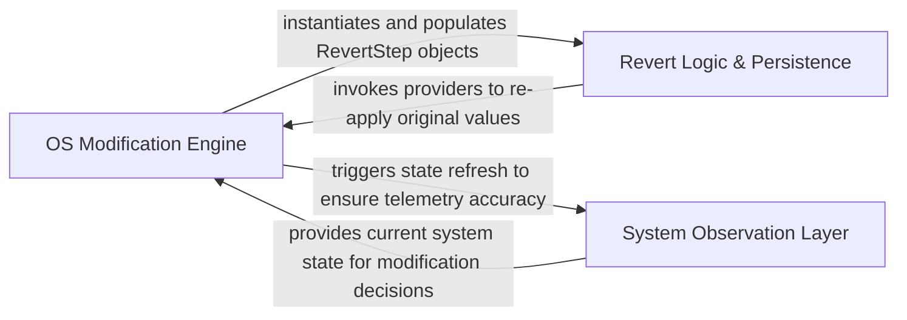

## Details

Low-level OS interaction layer that translates high-level commands into Registry, Service, and Task Scheduler modifications while persisting revert steps.

### OS Modification Engine
The active execution layer that translates optimization requests into system-level changes using a semantic DSL.

**Related Classes/Methods**:

- `Services.Optimization.Providers.RegistryService`:13-979
- `Services.Optimization.Providers.ScheduledTaskService`:12-503
- `Common.Extensions.OptimizationPageRegistryExtensions`:16-65
- `Services.Optimization.Providers.ServiceProcessService`:11-235

**Source Files:**

- [`optimizerDuck/Common/Extensions/CustomizePageRegistryExtensions.cs`](https://github.com/CodeBoarding/optimizerDuck/blob/master/.codeboardingoptimizerDuck/Common/Extensions/CustomizePageRegistryExtensions.cs)
  - `Common.Extensions.CustomizePageRegistryExtensions` ([L12-L47](https://github.com/CodeBoarding/optimizerDuck/blob/master/.codeboardingoptimizerDuck/Common/Extensions/CustomizePageRegistryExtensions.cs#L12-L47)) - Class
- [`optimizerDuck/Common/Extensions/OptimizationPageRegistryExtensions.cs`](https://github.com/CodeBoarding/optimizerDuck/blob/master/.codeboardingoptimizerDuck/Common/Extensions/OptimizationPageRegistryExtensions.cs)
  - `Common.Extensions.OptimizationPageRegistryExtensions` ([L16-L65](https://github.com/CodeBoarding/optimizerDuck/blob/master/.codeboardingoptimizerDuck/Common/Extensions/OptimizationPageRegistryExtensions.cs#L16-L65)) - Class
- [`optimizerDuck/Services/Optimization/Providers/RegistryService.cs`](https://github.com/CodeBoarding/optimizerDuck/blob/master/.codeboardingoptimizerDuck/Services/Optimization/Providers/RegistryService.cs)
  - `Services.Optimization.Providers.RegistryService` ([L13-L979](https://github.com/CodeBoarding/optimizerDuck/blob/master/.codeboardingoptimizerDuck/Services/Optimization/Providers/RegistryService.cs#L13-L979)) - Class
- [`optimizerDuck/Services/Optimization/Providers/ScheduledTaskService.cs`](https://github.com/CodeBoarding/optimizerDuck/blob/master/.codeboardingoptimizerDuck/Services/Optimization/Providers/ScheduledTaskService.cs)
  - `Services.Optimization.Providers.ScheduledTaskService` ([L12-L503](https://github.com/CodeBoarding/optimizerDuck/blob/master/.codeboardingoptimizerDuck/Services/Optimization/Providers/ScheduledTaskService.cs#L12-L503)) - Class
- [`optimizerDuck/Services/Optimization/Providers/ServiceProcessService.cs`](https://github.com/CodeBoarding/optimizerDuck/blob/master/.codeboardingoptimizerDuck/Services/Optimization/Providers/ServiceProcessService.cs)
  - `Services.Optimization.Providers.ServiceProcessService` ([L11-L235](https://github.com/CodeBoarding/optimizerDuck/blob/master/.codeboardingoptimizerDuck/Services/Optimization/Providers/ServiceProcessService.cs#L11-L235)) - Class
- [`optimizerDuck/Services/Optimization/Providers/ShellService.cs`](https://github.com/CodeBoarding/optimizerDuck/blob/master/.codeboardingoptimizerDuck/Services/Optimization/Providers/ShellService.cs)
  - `Services.Optimization.Providers.ShellService.ShellPolicy.From(Func<ShellResult, bool> isSuccess, Func<ShellResult, string?>? errorFactory = null)` ([L35-L46](https://github.com/CodeBoarding/optimizerDuck/blob/master/.codeboardingoptimizerDuck/Services/Optimization/Providers/ShellService.cs#L35-L46)) - Method
  - `Services.Optimization.Providers.ShellService.ShellPolicy.SuccessExitCodes(params int[] okExitCodes)` ([L50-L54](https://github.com/CodeBoarding/optimizerDuck/blob/master/.codeboardingoptimizerDuck/Services/Optimization/Providers/ShellService.cs#L50-L54)) - Method
  - `Services.Optimization.Providers.ShellService.ShellPolicy.SuccessExitCodeRange(int maxOk)` ([L58-L62](https://github.com/CodeBoarding/optimizerDuck/blob/master/.codeboardingoptimizerDuck/Services/Optimization/Providers/ShellService.cs#L58-L62)) - Method
  - `Services.Optimization.Providers.ShellService` ([L64-L874](https://github.com/CodeBoarding/optimizerDuck/blob/master/.codeboardingoptimizerDuck/Services/Optimization/Providers/ShellService.cs#L64-L874)) - Class

### Revert Logic & Persistence
A domain-driven layer that encapsulates 'Undo' blueprints to restore Windows components to their original configuration.

**Related Classes/Methods**:

- `Domain.Revert.Steps.RegistryRevertStep`:14-257
- `Domain.Revert.Steps.ServiceRevertStep`:13-78
- `Domain.Revert.Steps.ScheduledTaskRevertStep`:12-76

**Source Files:**

- [`optimizerDuck.Test/Domain/Revert/Steps/RevertStepSerializationTests.cs`](https://github.com/CodeBoarding/optimizerDuck/blob/master/.codeboardingoptimizerDuck.Test/Domain/Revert/Steps/RevertStepSerializationTests.cs)
  - `Domain.Revert.Steps.RevertStepSerializationTests` ([L8-L489](https://github.com/CodeBoarding/optimizerDuck/blob/master/.codeboardingoptimizerDuck.Test/Domain/Revert/Steps/RevertStepSerializationTests.cs#L8-L489)) - Class
- [`optimizerDuck.Test/Domain/Revert/Steps/ScheduledTaskRevertStepTests.cs`](https://github.com/CodeBoarding/optimizerDuck/blob/master/.codeboardingoptimizerDuck.Test/Domain/Revert/Steps/ScheduledTaskRevertStepTests.cs)
  - `Domain.Revert.Steps.ScheduledTaskRevertStepTests` ([L6-L22](https://github.com/CodeBoarding/optimizerDuck/blob/master/.codeboardingoptimizerDuck.Test/Domain/Revert/Steps/ScheduledTaskRevertStepTests.cs#L6-L22)) - Class
- [`optimizerDuck/Domain/Revert/Steps/RegistryRevertStep.cs`](https://github.com/CodeBoarding/optimizerDuck/blob/master/.codeboardingoptimizerDuck/Domain/Revert/Steps/RegistryRevertStep.cs)
  - `Domain.Revert.Steps.RegistryRevertStep` ([L14-L257](https://github.com/CodeBoarding/optimizerDuck/blob/master/.codeboardingoptimizerDuck/Domain/Revert/Steps/RegistryRevertStep.cs#L14-L257)) - Class
- [`optimizerDuck/Domain/Revert/Steps/ScheduledTaskRevertStep.cs`](https://github.com/CodeBoarding/optimizerDuck/blob/master/.codeboardingoptimizerDuck/Domain/Revert/Steps/ScheduledTaskRevertStep.cs)
  - `Domain.Revert.Steps.ScheduledTaskRevertStep` ([L12-L76](https://github.com/CodeBoarding/optimizerDuck/blob/master/.codeboardingoptimizerDuck/Domain/Revert/Steps/ScheduledTaskRevertStep.cs#L12-L76)) - Class
- [`optimizerDuck/Domain/Revert/Steps/ServiceRevertStep.cs`](https://github.com/CodeBoarding/optimizerDuck/blob/master/.codeboardingoptimizerDuck/Domain/Revert/Steps/ServiceRevertStep.cs)
  - `Domain.Revert.Steps.ServiceRevertStep` ([L13-L78](https://github.com/CodeBoarding/optimizerDuck/blob/master/.codeboardingoptimizerDuck/Domain/Revert/Steps/ServiceRevertStep.cs#L13-L78)) - Class
- [`optimizerDuck/Domain/Revert/Steps/ShellRevertStep.cs`](https://github.com/CodeBoarding/optimizerDuck/blob/master/.codeboardingoptimizerDuck/Domain/Revert/Steps/ShellRevertStep.cs)
  - `Domain.Revert.Steps.ShellRevertStep` ([L13-L84](https://github.com/CodeBoarding/optimizerDuck/blob/master/.codeboardingoptimizerDuck/Domain/Revert/Steps/ShellRevertStep.cs#L13-L84)) - Class
- [`optimizerDuck/Domain/Revert/Steps/UsbPowerRevertStep.cs`](https://github.com/CodeBoarding/optimizerDuck/blob/master/.codeboardingoptimizerDuck/Domain/Revert/Steps/UsbPowerRevertStep.cs)
  - `Domain.Revert.Steps.UsbPowerRevertStep` ([L14-L84](https://github.com/CodeBoarding/optimizerDuck/blob/master/.codeboardingoptimizerDuck/Domain/Revert/Steps/UsbPowerRevertStep.cs#L14-L84)) - Class

### System Observation Layer
A read-only telemetry layer that monitors the current state of the Windows environment to inform optimization logic.

**Related Classes/Methods**:

- `Services.System.RegistryWatcher`:14-300
- `Services.System.SystemInfoService`:1993-2197
- `Services.System.UpdaterService`:9-104

**Source Files:**

- [`optimizerDuck/Services/System/RegistryWatcher.cs`](https://github.com/CodeBoarding/optimizerDuck/blob/master/.codeboardingoptimizerDuck/Services/System/RegistryWatcher.cs)
  - `Services.System.RegistryWatcher` ([L14-L300](https://github.com/CodeBoarding/optimizerDuck/blob/master/.codeboardingoptimizerDuck/Services/System/RegistryWatcher.cs#L14-L300)) - Class
- [`optimizerDuck/Services/System/StreamService.cs`](https://github.com/CodeBoarding/optimizerDuck/blob/master/.codeboardingoptimizerDuck/Services/System/StreamService.cs)
  - `Services.System.StreamService` ([L8-L71](https://github.com/CodeBoarding/optimizerDuck/blob/master/.codeboardingoptimizerDuck/Services/System/StreamService.cs#L8-L71)) - Class
  - `Services.System.StreamService.TryDownloadAsync(string url, string fileName)` ([L12-L70](https://github.com/CodeBoarding/optimizerDuck/blob/master/.codeboardingoptimizerDuck/Services/System/StreamService.cs#L12-L70)) - Method
- [`optimizerDuck/Services/System/SystemInfoService.cs`](https://github.com/CodeBoarding/optimizerDuck/blob/master/.codeboardingoptimizerDuck/Services/System/SystemInfoService.cs)
  - `Services.System.SystemInfoService` ([L1993-L2197](https://github.com/CodeBoarding/optimizerDuck/blob/master/.codeboardingoptimizerDuck/Services/System/SystemInfoService.cs#L1993-L2197)) - Class
- [`optimizerDuck/Services/System/UpdaterService.cs`](https://github.com/CodeBoarding/optimizerDuck/blob/master/.codeboardingoptimizerDuck/Services/System/UpdaterService.cs)
  - `Services.System.UpdaterService` ([L9-L104](https://github.com/CodeBoarding/optimizerDuck/blob/master/.codeboardingoptimizerDuck/Services/System/UpdaterService.cs#L9-L104)) - Class

### [FAQ](https://github.com/CodeBoarding/GeneratedOnBoardings/tree/main?tab=readme-ov-file#faq)