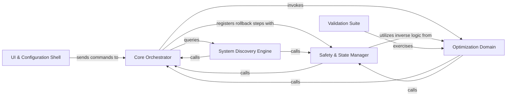
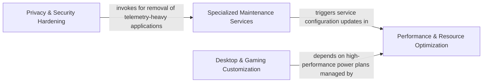
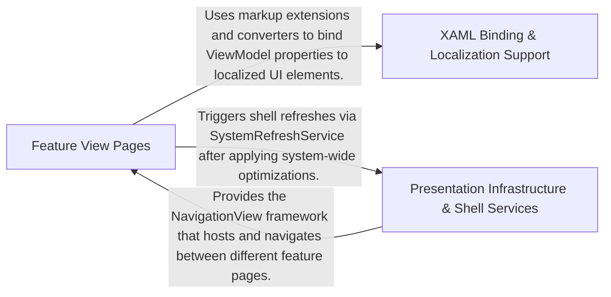
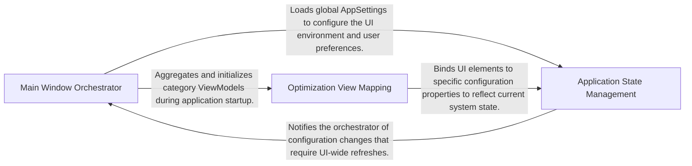
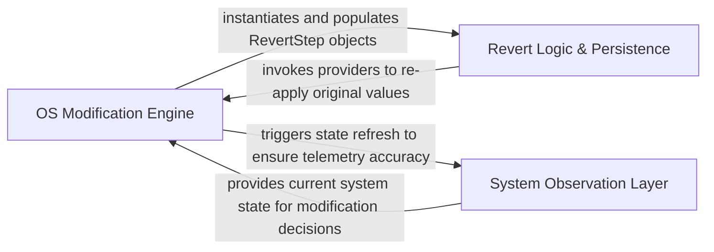

```mermaid
graph LR
    UI_Presentation_Layer["UI Presentation Layer"]
    ViewModel_Orchestration_Layer["ViewModel Orchestration Layer"]
    Optimization_Core_Engine["Optimization Core Engine"]
    System_Tweaks_Feature_Modules["System Tweaks & Feature Modules"]
    Windows_Interop_Revert_Provider["Windows Interop & Revert Provider"]
    System_Support_Diagnostics["System Support & Diagnostics"]
    UI_Presentation_Layer -- "Binds user interactions to application logic and state updates" --> ViewModel_Orchestration_Layer
    ViewModel_Orchestration_Layer -- "Triggers optimization workflows and revert processes based on user selection" --> Optimization_Core_Engine
    Optimization_Core_Engine -- "Discovers and iterates through available optimization payloads for execution" --> System_Tweaks_Feature_Modules
    Optimization_Core_Engine -- "Manages the persistence of revert data and coordinates state restoration" --> Windows_Interop_Revert_Provider
    System_Tweaks_Feature_Modules -- "Utilizes low-level services to apply specific system modifications" --> Windows_Interop_Revert_Provider
    System_Support_Diagnostics -- "Validates engine logic through integration tests and formats execution logs" --> Optimization_Core_Engine
    click UI_Presentation_Layer href "https://github.com/CodeBoarding/optimizerDuck/blob/master/.codeboarding/UI_Presentation_Layer.md" "Details"
    click ViewModel_Orchestration_Layer href "https://github.com/CodeBoarding/optimizerDuck/blob/master/.codeboarding/ViewModel_Orchestration_Layer.md" "Details"
    click Optimization_Core_Engine href "https://github.com/CodeBoarding/optimizerDuck/blob/master/.codeboarding/Optimization_Core_Engine.md" "Details"
    click System_Tweaks_Feature_Modules href "https://github.com/CodeBoarding/optimizerDuck/blob/master/.codeboarding/System_Tweaks_Feature_Modules.md" "Details"
    click Windows_Interop_Revert_Provider href "https://github.com/CodeBoarding/optimizerDuck/blob/master/.codeboarding/Windows_Interop_Revert_Provider.md" "Details"
    click System_Support_Diagnostics href "https://github.com/CodeBoarding/optimizerDuck/blob/master/.codeboarding/System_Support_Diagnostics.md" "Details"
```

## Details

optimizerDuck utilizes a layered MVVM architecture designed for extensible Windows system optimization. The UI Presentation Layer captures user intent and binds to the ViewModel Orchestration Layer, which manages application state and triggers the Optimization Core Engine. This central engine discovers and executes System Tweaks & Feature Modules while coordinating with the Windows Interop & Revert Provider to perform low-level system changes and maintain a persistent state for safe reversibility.

### UI Presentation Layer [[Expand]](./UI_Presentation_Layer.md)
Handles user interaction, visual layout, and WPF-specific rendering logic, providing the primary interface for system optimization.

**Related Classes/Methods**:

- `Common.Extensions.LanguageExtensions.LocExtension`:11-106
- `UI.Controls.FilledNavigationViewItem`:9-27

**Source Files:**

- [`optimizerDuck.Test/Common/Helpers/SystemRefreshServiceTests.cs`](https://github.com/CodeBoarding/optimizerDuck/blob/master/.codeboardingoptimizerDuck.Test/Common/Helpers/SystemRefreshServiceTests.cs)
  - `Common.Helpers.SystemRefreshServiceTests` ([L5-L119](https://github.com/CodeBoarding/optimizerDuck/blob/master/.codeboardingoptimizerDuck.Test/Common/Helpers/SystemRefreshServiceTests.cs#L5-L119)) - Class
  - `Common.Helpers.SystemRefreshServiceTests.NotifySettingChange_DoesNotThrow()` ([L8-L13](https://github.com/CodeBoarding/optimizerDuck/blob/master/.codeboardingoptimizerDuck.Test/Common/Helpers/SystemRefreshServiceTests.cs#L8-L13)) - Method
  - `Common.Helpers.SystemRefreshServiceTests.RefreshShell_DoesNotThrow()` ([L15-L20](https://github.com/CodeBoarding/optimizerDuck/blob/master/.codeboardingoptimizerDuck.Test/Common/Helpers/SystemRefreshServiceTests.cs#L15-L20)) - Method
  - `Common.Helpers.SystemRefreshServiceTests.NotifySettingChange_ThenRefreshShell_DoesNotThrow()` ([L22-L30](https://github.com/CodeBoarding/optimizerDuck/blob/master/.codeboardingoptimizerDuck.Test/Common/Helpers/SystemRefreshServiceTests.cs#L22-L30)) - Method
  - `Common.Helpers.SystemRefreshServiceTests.NotifySettingChange_CanBeCalledMultipleTimes()` ([L32-L40](https://github.com/CodeBoarding/optimizerDuck/blob/master/.codeboardingoptimizerDuck.Test/Common/Helpers/SystemRefreshServiceTests.cs#L32-L40)) - Method
  - `Common.Helpers.SystemRefreshServiceTests.NotifyTaskbarSettingChange_DoesNotThrow()` ([L42-L49](https://github.com/CodeBoarding/optimizerDuck/blob/master/.codeboardingoptimizerDuck.Test/Common/Helpers/SystemRefreshServiceTests.cs#L42-L49)) - Method
  - `Common.Helpers.SystemRefreshServiceTests.RefreshDesktop_DoesNotThrow()` ([L51-L56](https://github.com/CodeBoarding/optimizerDuck/blob/master/.codeboardingoptimizerDuck.Test/Common/Helpers/SystemRefreshServiceTests.cs#L51-L56)) - Method
  - `Common.Helpers.SystemRefreshServiceTests.UpdatePerUserSystemParameters_DoesNotThrow()` ([L58-L65](https://github.com/CodeBoarding/optimizerDuck/blob/master/.codeboardingoptimizerDuck.Test/Common/Helpers/SystemRefreshServiceTests.cs#L58-L65)) - Method
  - `Common.Helpers.SystemRefreshServiceTests.NotifyThemeChanged_DoesNotThrow()` ([L67-L72](https://github.com/CodeBoarding/optimizerDuck/blob/master/.codeboardingoptimizerDuck.Test/Common/Helpers/SystemRefreshServiceTests.cs#L67-L72)) - Method
  - `Common.Helpers.SystemRefreshServiceTests.SetDesktopIconsVisible_True_DoesNotThrow()` ([L74-L81](https://github.com/CodeBoarding/optimizerDuck/blob/master/.codeboardingoptimizerDuck.Test/Common/Helpers/SystemRefreshServiceTests.cs#L74-L81)) - Method
  - `Common.Helpers.SystemRefreshServiceTests.SetDesktopIconsVisible_False_DoesNotThrow()` ([L83-L90](https://github.com/CodeBoarding/optimizerDuck/blob/master/.codeboardingoptimizerDuck.Test/Common/Helpers/SystemRefreshServiceTests.cs#L83-L90)) - Method
  - `Common.Helpers.SystemRefreshServiceTests.RefreshDesktopIconVisibilityFromRegistry_DoesNotThrow()` ([L92-L99](https://github.com/CodeBoarding/optimizerDuck/blob/master/.codeboardingoptimizerDuck.Test/Common/Helpers/SystemRefreshServiceTests.cs#L92-L99)) - Method
  - `Common.Helpers.SystemRefreshServiceTests.SetDesktopIconsVisible_ToggleBackAndForth_DoesNotThrow()` ([L101-L118](https://github.com/CodeBoarding/optimizerDuck/blob/master/.codeboardingoptimizerDuck.Test/Common/Helpers/SystemRefreshServiceTests.cs#L101-L118)) - Method
- [`optimizerDuck.Test/Domain/Optimizations/PowerManagementTests.cs`](https://github.com/CodeBoarding/optimizerDuck/blob/master/.codeboardingoptimizerDuck.Test/Domain/Optimizations/PowerManagementTests.cs)
  - `Domain.Optimizations.PowerManagementTests` ([L8-L27](https://github.com/CodeBoarding/optimizerDuck/blob/master/.codeboardingoptimizerDuck.Test/Domain/Optimizations/PowerManagementTests.cs#L8-L27)) - Class
  - `Domain.Optimizations.PowerManagementTests.RegistryPath_WithHklmPrefix_IsReadable()` ([L11-L26](https://github.com/CodeBoarding/optimizerDuck/blob/master/.codeboardingoptimizerDuck.Test/Domain/Optimizations/PowerManagementTests.cs#L11-L26)) - Method
- [`optimizerDuck/Common/Converters/BooleanConverter.cs`](https://github.com/CodeBoarding/optimizerDuck/blob/master/.codeboardingoptimizerDuck/Common/Converters/BooleanConverter.cs)
  - `Common.Converters.BooleanConverter.BooleanConverter<T>` ([L10-L35](https://github.com/CodeBoarding/optimizerDuck/blob/master/.codeboardingoptimizerDuck/Common/Converters/BooleanConverter.cs#L10-L35)) - Class
  - `Common.Converters.BooleanConverter.BooleanConverter<T>.Convert(object? value, Type targetType, object? parameter, CultureInfo culture)` ([L15-L24](https://github.com/CodeBoarding/optimizerDuck/blob/master/.codeboardingoptimizerDuck/Common/Converters/BooleanConverter.cs#L15-L24)) - Method
  - `Common.Converters.BooleanConverter.BooleanConverter<T>.ConvertBack(object? value, Type targetType, object? parameter, CultureInfo culture)` ([L25-L34](https://github.com/CodeBoarding/optimizerDuck/blob/master/.codeboardingoptimizerDuck/Common/Converters/BooleanConverter.cs#L25-L34)) - Method
- [`optimizerDuck/Common/Converters/BooleanToVisibilityConverter.cs`](https://github.com/CodeBoarding/optimizerDuck/blob/master/.codeboardingoptimizerDuck/Common/Converters/BooleanToVisibilityConverter.cs)
  - `Common.Converters.BooleanToVisibilityConverter` ([L5-L7](https://github.com/CodeBoarding/optimizerDuck/blob/master/.codeboardingoptimizerDuck/Common/Converters/BooleanToVisibilityConverter.cs#L5-L7)) - Class
- [`optimizerDuck/Common/Converters/EmptyWhileNotLoadingConverter.cs`](https://github.com/CodeBoarding/optimizerDuck/blob/master/.codeboardingoptimizerDuck/Common/Converters/EmptyWhileNotLoadingConverter.cs)
  - `Common.Converters.EmptyWhileNotLoadingConverter` ([L7-L30](https://github.com/CodeBoarding/optimizerDuck/blob/master/.codeboardingoptimizerDuck/Common/Converters/EmptyWhileNotLoadingConverter.cs#L7-L30)) - Class
  - `Common.Converters.EmptyWhileNotLoadingConverter.Convert(object[] values, Type targetType, object parameter, CultureInfo culture)` ([L9-L19](https://github.com/CodeBoarding/optimizerDuck/blob/master/.codeboardingoptimizerDuck/Common/Converters/EmptyWhileNotLoadingConverter.cs#L9-L19)) - Method
  - `Common.Converters.EmptyWhileNotLoadingConverter.ConvertBack(object value, Type[] targetTypes, object parameter, CultureInfo culture)` ([L20-L29](https://github.com/CodeBoarding/optimizerDuck/blob/master/.codeboardingoptimizerDuck/Common/Converters/EmptyWhileNotLoadingConverter.cs#L20-L29)) - Method
- [`optimizerDuck/Common/Converters/EqualityToVisibilityConverter.cs`](https://github.com/CodeBoarding/optimizerDuck/blob/master/.codeboardingoptimizerDuck/Common/Converters/EqualityToVisibilityConverter.cs)
  - `Common.Converters.EqualityToVisibilityConverter` ([L7-L33](https://github.com/CodeBoarding/optimizerDuck/blob/master/.codeboardingoptimizerDuck/Common/Converters/EqualityToVisibilityConverter.cs#L7-L33)) - Class
  - `Common.Converters.EqualityToVisibilityConverter.Convert(object? value, Type targetType, object? parameter, CultureInfo culture)` ([L12-L22](https://github.com/CodeBoarding/optimizerDuck/blob/master/.codeboardingoptimizerDuck/Common/Converters/EqualityToVisibilityConverter.cs#L12-L22)) - Method
  - `Common.Converters.EqualityToVisibilityConverter.ConvertBack(object? value, Type targetType, object? parameter, CultureInfo culture)` ([L23-L32](https://github.com/CodeBoarding/optimizerDuck/blob/master/.codeboardingoptimizerDuck/Common/Converters/EqualityToVisibilityConverter.cs#L23-L32)) - Method
- [`optimizerDuck/Common/Converters/InverseBooleanConverter.cs`](https://github.com/CodeBoarding/optimizerDuck/blob/master/.codeboardingoptimizerDuck/Common/Converters/InverseBooleanConverter.cs)
  - `Common.Converters.InverseBooleanConverter` ([L3-L4](https://github.com/CodeBoarding/optimizerDuck/blob/master/.codeboardingoptimizerDuck/Common/Converters/InverseBooleanConverter.cs#L3-L4)) - Class
- [`optimizerDuck/Common/Converters/InverseBooleanToVisibilityConverter.cs`](https://github.com/CodeBoarding/optimizerDuck/blob/master/.codeboardingoptimizerDuck/Common/Converters/InverseBooleanToVisibilityConverter.cs)
  - `Common.Converters.InverseBooleanToVisibilityConverter` ([L5-L7](https://github.com/CodeBoarding/optimizerDuck/blob/master/.codeboardingoptimizerDuck/Common/Converters/InverseBooleanToVisibilityConverter.cs#L5-L7)) - Class
- [`optimizerDuck/Common/Converters/MBToGBConverter.cs`](https://github.com/CodeBoarding/optimizerDuck/blob/master/.codeboardingoptimizerDuck/Common/Converters/MBToGBConverter.cs)
  - `Common.Converters.MBToGBConverter` ([L6-L25](https://github.com/CodeBoarding/optimizerDuck/blob/master/.codeboardingoptimizerDuck/Common/Converters/MBToGBConverter.cs#L6-L25)) - Class
  - `Common.Converters.MBToGBConverter.Convert(object? value, Type targetType, object? parameter, CultureInfo culture)` ([L8-L14](https://github.com/CodeBoarding/optimizerDuck/blob/master/.codeboardingoptimizerDuck/Common/Converters/MBToGBConverter.cs#L8-L14)) - Method
  - `Common.Converters.MBToGBConverter.ConvertBack(object? value, Type targetType, object? parameter, CultureInfo culture)` ([L15-L24](https://github.com/CodeBoarding/optimizerDuck/blob/master/.codeboardingoptimizerDuck/Common/Converters/MBToGBConverter.cs#L15-L24)) - Method
- [`optimizerDuck/Common/Converters/MinusNumberConverter.cs`](https://github.com/CodeBoarding/optimizerDuck/blob/master/.codeboardingoptimizerDuck/Common/Converters/MinusNumberConverter.cs)
  - `Common.Converters.MinusNumberConverter` ([L6-L22](https://github.com/CodeBoarding/optimizerDuck/blob/master/.codeboardingoptimizerDuck/Common/Converters/MinusNumberConverter.cs#L6-L22)) - Class
  - `Common.Converters.MinusNumberConverter.Convert(object value, Type targetType, object parameter, CultureInfo culture)` ([L10-L16](https://github.com/CodeBoarding/optimizerDuck/blob/master/.codeboardingoptimizerDuck/Common/Converters/MinusNumberConverter.cs#L10-L16)) - Method
  - `Common.Converters.MinusNumberConverter.ConvertBack(object value, Type targetType, object parameter, CultureInfo culture)` ([L17-L21](https://github.com/CodeBoarding/optimizerDuck/blob/master/.codeboardingoptimizerDuck/Common/Converters/MinusNumberConverter.cs#L17-L21)) - Method
- [`optimizerDuck/Common/Converters/NumericComparisonToVisibilityConverter.cs`](https://github.com/CodeBoarding/optimizerDuck/blob/master/.codeboardingoptimizerDuck/Common/Converters/NumericComparisonToVisibilityConverter.cs)
  - `Common.Converters.NumericComparisonToVisibilityConverter.NumericComparisonType` ([L7-L16](https://github.com/CodeBoarding/optimizerDuck/blob/master/.codeboardingoptimizerDuck/Common/Converters/NumericComparisonToVisibilityConverter.cs#L7-L16)) - Enum
  - `Common.Converters.NumericComparisonToVisibilityConverter` ([L17-L56](https://github.com/CodeBoarding/optimizerDuck/blob/master/.codeboardingoptimizerDuck/Common/Converters/NumericComparisonToVisibilityConverter.cs#L17-L56)) - Class
  - `Common.Converters.NumericComparisonToVisibilityConverter.Convert(object? value, Type targetType, object? parameter, CultureInfo culture)` ([L27-L45](https://github.com/CodeBoarding/optimizerDuck/blob/master/.codeboardingoptimizerDuck/Common/Converters/NumericComparisonToVisibilityConverter.cs#L27-L45)) - Method
  - `Common.Converters.NumericComparisonToVisibilityConverter.ConvertBack(object? value, Type targetType, object? parameter, CultureInfo culture)` ([L46-L55](https://github.com/CodeBoarding/optimizerDuck/blob/master/.codeboardingoptimizerDuck/Common/Converters/NumericComparisonToVisibilityConverter.cs#L46-L55)) - Method
- [`optimizerDuck/Common/Converters/ProgressBarValueToBrushConverter.cs`](https://github.com/CodeBoarding/optimizerDuck/blob/master/.codeboardingoptimizerDuck/Common/Converters/ProgressBarValueToBrushConverter.cs)
  - `Common.Converters.ProgressBarValueToBrushConverter` ([L8-L43](https://github.com/CodeBoarding/optimizerDuck/blob/master/.codeboardingoptimizerDuck/Common/Converters/ProgressBarValueToBrushConverter.cs#L8-L43)) - Class
  - `Common.Converters.ProgressBarValueToBrushConverter.Convert(object? value, Type targetType, object? parameter, CultureInfo culture)` ([L24-L37](https://github.com/CodeBoarding/optimizerDuck/blob/master/.codeboardingoptimizerDuck/Common/Converters/ProgressBarValueToBrushConverter.cs#L24-L37)) - Method
  - `Common.Converters.ProgressBarValueToBrushConverter.ConvertBack(object? value, Type targetType, object? parameter, CultureInfo culture)` ([L38-L42](https://github.com/CodeBoarding/optimizerDuck/blob/master/.codeboardingoptimizerDuck/Common/Converters/ProgressBarValueToBrushConverter.cs#L38-L42)) - Method
- [`optimizerDuck/Common/Converters/ProgressBarVisibilityConverter.cs`](https://github.com/CodeBoarding/optimizerDuck/blob/master/.codeboardingoptimizerDuck/Common/Converters/ProgressBarVisibilityConverter.cs)
  - `Common.Converters.ProgressBarVisibilityConverter` ([L7-L36](https://github.com/CodeBoarding/optimizerDuck/blob/master/.codeboardingoptimizerDuck/Common/Converters/ProgressBarVisibilityConverter.cs#L7-L36)) - Class
  - `Common.Converters.ProgressBarVisibilityConverter.Convert(object[] values, Type targetType, object parameter, CultureInfo culture)` ([L9-L25](https://github.com/CodeBoarding/optimizerDuck/blob/master/.codeboardingoptimizerDuck/Common/Converters/ProgressBarVisibilityConverter.cs#L9-L25)) - Method
  - `Common.Converters.ProgressBarVisibilityConverter.ConvertBack(object value, Type[] targetTypes, object parameter, CultureInfo culture)` ([L26-L35](https://github.com/CodeBoarding/optimizerDuck/blob/master/.codeboardingoptimizerDuck/Common/Converters/ProgressBarVisibilityConverter.cs#L26-L35)) - Method
- [`optimizerDuck/Common/Converters/RecommendationForegroundConverter.cs`](https://github.com/CodeBoarding/optimizerDuck/blob/master/.codeboardingoptimizerDuck/Common/Converters/RecommendationForegroundConverter.cs)
  - `Common.Converters.RecommendationForegroundConverter.ThemeBrushes` ([L11-L28](https://github.com/CodeBoarding/optimizerDuck/blob/master/.codeboardingoptimizerDuck/Common/Converters/RecommendationForegroundConverter.cs#L11-L28)) - Class
  - `Common.Converters.RecommendationForegroundConverter.ThemeBrushes.Clone(string key)` ([L19-L27](https://github.com/CodeBoarding/optimizerDuck/blob/master/.codeboardingoptimizerDuck/Common/Converters/RecommendationForegroundConverter.cs#L19-L27)) - Method
  - `Common.Converters.RecommendationForegroundConverter` ([L29-L66](https://github.com/CodeBoarding/optimizerDuck/blob/master/.codeboardingoptimizerDuck/Common/Converters/RecommendationForegroundConverter.cs#L29-L66)) - Class
  - `Common.Converters.RecommendationForegroundConverter.Convert(object[] values, Type targetType, object parameter, CultureInfo culture)` ([L31-L55](https://github.com/CodeBoarding/optimizerDuck/blob/master/.codeboardingoptimizerDuck/Common/Converters/RecommendationForegroundConverter.cs#L31-L55)) - Method
  - `Common.Converters.RecommendationForegroundConverter.ConvertBack(object value, Type[] targetTypes, object parameter, CultureInfo culture)` ([L56-L65](https://github.com/CodeBoarding/optimizerDuck/blob/master/.codeboardingoptimizerDuck/Common/Converters/RecommendationForegroundConverter.cs#L56-L65)) - Method
- [`optimizerDuck/Common/Converters/SizeToBrushConverter.cs`](https://github.com/CodeBoarding/optimizerDuck/blob/master/.codeboardingoptimizerDuck/Common/Converters/SizeToBrushConverter.cs)
  - `Common.Converters.SizeToBrushConverter` ([L12-L55](https://github.com/CodeBoarding/optimizerDuck/blob/master/.codeboardingoptimizerDuck/Common/Converters/SizeToBrushConverter.cs#L12-L55)) - Class
  - `Common.Converters.SizeToBrushConverter.Convert(object? value, Type targetType, object? parameter, CultureInfo culture)` ([L31-L44](https://github.com/CodeBoarding/optimizerDuck/blob/master/.codeboardingoptimizerDuck/Common/Converters/SizeToBrushConverter.cs#L31-L44)) - Method
  - `Common.Converters.SizeToBrushConverter.ConvertBack(object? value, Type targetType, object? parameter, CultureInfo culture)` ([L45-L54](https://github.com/CodeBoarding/optimizerDuck/blob/master/.codeboardingoptimizerDuck/Common/Converters/SizeToBrushConverter.cs#L45-L54)) - Method
- [`optimizerDuck/Common/Converters/ThemeConverterBase.cs`](https://github.com/CodeBoarding/optimizerDuck/blob/master/.codeboardingoptimizerDuck/Common/Converters/ThemeConverterBase.cs)
  - `Common.Converters.ThemeConverterBase.ThemeConverterBase<T>` ([L7-L26](https://github.com/CodeBoarding/optimizerDuck/blob/master/.codeboardingoptimizerDuck/Common/Converters/ThemeConverterBase.cs#L7-L26)) - Class
  - `Common.Converters.ThemeConverterBase.ThemeConverterBase<T>.Convert(object value, Type targetType, object parameter, CultureInfo culture)` ([L9-L16](https://github.com/CodeBoarding/optimizerDuck/blob/master/.codeboardingoptimizerDuck/Common/Converters/ThemeConverterBase.cs#L9-L16)) - Method
  - `Common.Converters.ThemeConverterBase.ThemeConverterBase<T>.ConvertBack(object value, Type targetType, object parameter, CultureInfo culture)` ([L17-L21](https://github.com/CodeBoarding/optimizerDuck/blob/master/.codeboardingoptimizerDuck/Common/Converters/ThemeConverterBase.cs#L17-L21)) - Method
  - `Common.Converters.ThemeConverterBase.ThemeConverterBase<T>.ConvertTheme(ApplicationTheme theme, object parameter)` ([L22-L23](https://github.com/CodeBoarding/optimizerDuck/blob/master/.codeboardingoptimizerDuck/Common/Converters/ThemeConverterBase.cs#L22-L23)) - Method
  - `Common.Converters.ThemeConverterBase.ThemeConverterBase<T>.GetDefault()` ([L24-L25](https://github.com/CodeBoarding/optimizerDuck/blob/master/.codeboardingoptimizerDuck/Common/Converters/ThemeConverterBase.cs#L24-L25)) - Method
- [`optimizerDuck/Common/Converters/ThemeToGitHubIconConverter.cs`](https://github.com/CodeBoarding/optimizerDuck/blob/master/.codeboardingoptimizerDuck/Common/Converters/ThemeToGitHubIconConverter.cs)
  - `Common.Converters.ThemeToGitHubIconConverter` ([L6-L20](https://github.com/CodeBoarding/optimizerDuck/blob/master/.codeboardingoptimizerDuck/Common/Converters/ThemeToGitHubIconConverter.cs#L6-L20)) - Class
  - `Common.Converters.ThemeToGitHubIconConverter.ConvertTheme(ApplicationTheme theme, object parameter)` ([L8-L19](https://github.com/CodeBoarding/optimizerDuck/blob/master/.codeboardingoptimizerDuck/Common/Converters/ThemeToGitHubIconConverter.cs#L8-L19)) - Method
- [`optimizerDuck/Common/Converters/ThemeToIndexConverter.cs`](https://github.com/CodeBoarding/optimizerDuck/blob/master/.codeboardingoptimizerDuck/Common/Converters/ThemeToIndexConverter.cs)
  - `Common.Converters.ThemeToIndexConverter` ([L7-L34](https://github.com/CodeBoarding/optimizerDuck/blob/master/.codeboardingoptimizerDuck/Common/Converters/ThemeToIndexConverter.cs#L7-L34)) - Class
  - `Common.Converters.ThemeToIndexConverter.Convert(object? value, Type targetType, object? parameter, CultureInfo culture)` ([L9-L18](https://github.com/CodeBoarding/optimizerDuck/blob/master/.codeboardingoptimizerDuck/Common/Converters/ThemeToIndexConverter.cs#L9-L18)) - Method
  - `Common.Converters.ThemeToIndexConverter.ConvertBack(object? value, Type targetType, object? parameter, CultureInfo culture)` ([L19-L33](https://github.com/CodeBoarding/optimizerDuck/blob/master/.codeboardingoptimizerDuck/Common/Converters/ThemeToIndexConverter.cs#L19-L33)) - Method
- [`optimizerDuck/Common/Converters/ValueConditionToVisibilityConverter.cs`](https://github.com/CodeBoarding/optimizerDuck/blob/master/.codeboardingoptimizerDuck/Common/Converters/ValueConditionToVisibilityConverter.cs)
  - `Common.Converters.ValueConditionToVisibilityConverter.ValueConditionType` ([L7-L16](https://github.com/CodeBoarding/optimizerDuck/blob/master/.codeboardingoptimizerDuck/Common/Converters/ValueConditionToVisibilityConverter.cs#L7-L16)) - Enum
  - `Common.Converters.ValueConditionToVisibilityConverter` ([L17-L51](https://github.com/CodeBoarding/optimizerDuck/blob/master/.codeboardingoptimizerDuck/Common/Converters/ValueConditionToVisibilityConverter.cs#L17-L51)) - Class
  - `Common.Converters.ValueConditionToVisibilityConverter.Convert(object? value, Type targetType, object? parameter, CultureInfo culture)` ([L25-L40](https://github.com/CodeBoarding/optimizerDuck/blob/master/.codeboardingoptimizerDuck/Common/Converters/ValueConditionToVisibilityConverter.cs#L25-L40)) - Method
  - `Common.Converters.ValueConditionToVisibilityConverter.ConvertBack(object? value, Type targetType, object? parameter, CultureInfo culture)` ([L41-L50](https://github.com/CodeBoarding/optimizerDuck/blob/master/.codeboardingoptimizerDuck/Common/Converters/ValueConditionToVisibilityConverter.cs#L41-L50)) - Method
- [`optimizerDuck/Common/Converters/WidthToColumnConverter.cs`](https://github.com/CodeBoarding/optimizerDuck/blob/master/.codeboardingoptimizerDuck/Common/Converters/WidthToColumnConverter.cs)
  - `Common.Converters.WidthToColumnConverter` ([L6-L31](https://github.com/CodeBoarding/optimizerDuck/blob/master/.codeboardingoptimizerDuck/Common/Converters/WidthToColumnConverter.cs#L6-L31)) - Class
  - `Common.Converters.WidthToColumnConverter.Convert(object? value, Type targetType, object? parameter, CultureInfo culture)` ([L8-L20](https://github.com/CodeBoarding/optimizerDuck/blob/master/.codeboardingoptimizerDuck/Common/Converters/WidthToColumnConverter.cs#L8-L20)) - Method
  - `Common.Converters.WidthToColumnConverter.ConvertBack(object? value, Type targetType, object? parameter, CultureInfo culture)` ([L21-L30](https://github.com/CodeBoarding/optimizerDuck/blob/master/.codeboardingoptimizerDuck/Common/Converters/WidthToColumnConverter.cs#L21-L30)) - Method
- [`optimizerDuck/Common/Extensions/LanguageExtensions.cs`](https://github.com/CodeBoarding/optimizerDuck/blob/master/.codeboardingoptimizerDuck/Common/Extensions/LanguageExtensions.cs)
  - `Common.Extensions.LanguageExtensions.LocExtension` ([L11-L106](https://github.com/CodeBoarding/optimizerDuck/blob/master/.codeboardingoptimizerDuck/Common/Extensions/LanguageExtensions.cs#L11-L106)) - Class
  - `Common.Extensions.LanguageExtensions.LocExtension.LocExtension()` ([L13-L14](https://github.com/CodeBoarding/optimizerDuck/blob/master/.codeboardingoptimizerDuck/Common/Extensions/LanguageExtensions.cs#L13-L14)) - Constructor
  - `Common.Extensions.LanguageExtensions.LocExtension.LocExtension(string key)` ([L15-L19](https://github.com/CodeBoarding/optimizerDuck/blob/master/.codeboardingoptimizerDuck/Common/Extensions/LanguageExtensions.cs#L15-L19)) - Constructor
  - `Common.Extensions.LanguageExtensions.LocExtension.LocExtension(string key, BindingBase arg1)` ([L20-L25](https://github.com/CodeBoarding/optimizerDuck/blob/master/.codeboardingoptimizerDuck/Common/Extensions/LanguageExtensions.cs#L20-L25)) - Constructor
  - `Common.Extensions.LanguageExtensions.LocExtension.LocExtension(string key, BindingBase arg1, BindingBase arg2)` ([L26-L32](https://github.com/CodeBoarding/optimizerDuck/blob/master/.codeboardingoptimizerDuck/Common/Extensions/LanguageExtensions.cs#L26-L32)) - Constructor
  - `Common.Extensions.LanguageExtensions.LocExtension.LocExtension(string key, BindingBase arg1, BindingBase arg2, BindingBase arg3)` ([L33-L40](https://github.com/CodeBoarding/optimizerDuck/blob/master/.codeboardingoptimizerDuck/Common/Extensions/LanguageExtensions.cs#L33-L40)) - Constructor
  - `Common.Extensions.LanguageExtensions.LocExtension.LocExtension(string key, BindingBase arg1, BindingBase arg2, BindingBase arg3, BindingBase arg4)` ([L41-L55](https://github.com/CodeBoarding/optimizerDuck/blob/master/.codeboardingoptimizerDuck/Common/Extensions/LanguageExtensions.cs#L41-L55)) - Constructor
  - `Common.Extensions.LanguageExtensions.LocExtension.LocExtension(string key, BindingBase arg1, BindingBase arg2, BindingBase arg3, BindingBase arg4, BindingBase arg5)` ([L56-L72](https://github.com/CodeBoarding/optimizerDuck/blob/master/.codeboardingoptimizerDuck/Common/Extensions/LanguageExtensions.cs#L56-L72)) - Constructor
  - `Common.Extensions.LanguageExtensions.LocExtension.ProvideValue(IServiceProvider serviceProvider)` ([L77-L105](https://github.com/CodeBoarding/optimizerDuck/blob/master/.codeboardingoptimizerDuck/Common/Extensions/LanguageExtensions.cs#L77-L105)) - Method
  - `Common.Extensions.LanguageExtensions.LocDynamicConverter` ([L107-L136](https://github.com/CodeBoarding/optimizerDuck/blob/master/.codeboardingoptimizerDuck/Common/Extensions/LanguageExtensions.cs#L107-L136)) - Class
  - `Common.Extensions.LanguageExtensions.LocDynamicConverter.Convert(object[] values, Type targetType, object? parameter, CultureInfo culture)` ([L109-L125](https://github.com/CodeBoarding/optimizerDuck/blob/master/.codeboardingoptimizerDuck/Common/Extensions/LanguageExtensions.cs#L109-L125)) - Method
  - `Common.Extensions.LanguageExtensions.LocDynamicConverter.ConvertBack(object value, Type[] targetTypes, object parameter, CultureInfo culture)` ([L126-L135](https://github.com/CodeBoarding/optimizerDuck/blob/master/.codeboardingoptimizerDuck/Common/Extensions/LanguageExtensions.cs#L126-L135)) - Method
- [`optimizerDuck/Common/Helpers/EmbeddedResourceHelper.cs`](https://github.com/CodeBoarding/optimizerDuck/blob/master/.codeboardingoptimizerDuck/Common/Helpers/EmbeddedResourceHelper.cs)
  - `Common.Helpers.EmbeddedResourceHelper` ([L9-L120](https://github.com/CodeBoarding/optimizerDuck/blob/master/.codeboardingoptimizerDuck/Common/Helpers/EmbeddedResourceHelper.cs#L9-L120)) - Class
- [`optimizerDuck/Common/Helpers/ReflectionHelper.cs`](https://github.com/CodeBoarding/optimizerDuck/blob/master/.codeboardingoptimizerDuck/Common/Helpers/ReflectionHelper.cs)
  - `Common.Helpers.ReflectionHelper` ([L5-L61](https://github.com/CodeBoarding/optimizerDuck/blob/master/.codeboardingoptimizerDuck/Common/Helpers/ReflectionHelper.cs#L5-L61)) - Class
- [`optimizerDuck/Common/Helpers/Shared.cs`](https://github.com/CodeBoarding/optimizerDuck/blob/master/.codeboardingoptimizerDuck/Common/Helpers/Shared.cs)
  - `Common.Helpers.Shared` ([L6-L152](https://github.com/CodeBoarding/optimizerDuck/blob/master/.codeboardingoptimizerDuck/Common/Helpers/Shared.cs#L6-L152)) - Class
- [`optimizerDuck/Common/Helpers/SystemRefreshService.cs`](https://github.com/CodeBoarding/optimizerDuck/blob/master/.codeboardingoptimizerDuck/Common/Helpers/SystemRefreshService.cs)
  - `Common.Helpers.SystemRefreshService` ([L5-L275](https://github.com/CodeBoarding/optimizerDuck/blob/master/.codeboardingoptimizerDuck/Common/Helpers/SystemRefreshService.cs#L5-L275)) - Class
- [`optimizerDuck/Common/Helpers/ThemeResource.cs`](https://github.com/CodeBoarding/optimizerDuck/blob/master/.codeboardingoptimizerDuck/Common/Helpers/ThemeResource.cs)
  - `Common.Helpers.ThemeResource` ([L5-L13](https://github.com/CodeBoarding/optimizerDuck/blob/master/.codeboardingoptimizerDuck/Common/Helpers/ThemeResource.cs#L5-L13)) - Class
  - `Common.Helpers.ThemeResource.Get<T>(string key)` ([L7-L12](https://github.com/CodeBoarding/optimizerDuck/blob/master/.codeboardingoptimizerDuck/Common/Helpers/ThemeResource.cs#L7-L12)) - Method
- [`optimizerDuck/Domain/Optimizations/Models/Bloatware/AppXPackage.cs`](https://github.com/CodeBoarding/optimizerDuck/blob/master/.codeboardingoptimizerDuck/Domain/Optimizations/Models/Bloatware/AppXPackage.cs)
  - `Domain.Optimizations.Models.Bloatware.AppXPackage.AppRisk` ([L11-L17](https://github.com/CodeBoarding/optimizerDuck/blob/master/.codeboardingoptimizerDuck/Domain/Optimizations/Models/Bloatware/AppXPackage.cs#L11-L17)) - Enum
  - `Domain.Optimizations.Models.Bloatware.AppXPackage` ([L21-L92](https://github.com/CodeBoarding/optimizerDuck/blob/master/.codeboardingoptimizerDuck/Domain/Optimizations/Models/Bloatware/AppXPackage.cs#L21-L92)) - Class
- [`optimizerDuck/Resources/Languages/Translations.Designer.cs`](https://github.com/CodeBoarding/optimizerDuck/blob/master/.codeboardingoptimizerDuck/Resources/Languages/Translations.Designer.cs)
  - `Resources.Languages.Translations.Designer.Translations` ([L25-L5072](https://github.com/CodeBoarding/optimizerDuck/blob/master/.codeboardingoptimizerDuck/Resources/Languages/Translations.Designer.cs#L25-L5072)) - Class
  - `Resources.Languages.Translations.Designer.Translations.Translations()` ([L32-L34](https://github.com/CodeBoarding/optimizerDuck/blob/master/.codeboardingoptimizerDuck/Resources/Languages/Translations.Designer.cs#L32-L34)) - Constructor
- [`optimizerDuck/UI/Controls/FilledNavigationViewItem.cs`](https://github.com/CodeBoarding/optimizerDuck/blob/master/.codeboardingoptimizerDuck/UI/Controls/FilledNavigationViewItem.cs)
  - `UI.Controls.FilledNavigationViewItem` ([L9-L27](https://github.com/CodeBoarding/optimizerDuck/blob/master/.codeboardingoptimizerDuck/UI/Controls/FilledNavigationViewItem.cs#L9-L27)) - Class
  - `UI.Controls.FilledNavigationViewItem.Activate(INavigationView navigationView)` ([L11-L18](https://github.com/CodeBoarding/optimizerDuck/blob/master/.codeboardingoptimizerDuck/UI/Controls/FilledNavigationViewItem.cs#L11-L18)) - Method
  - `UI.Controls.FilledNavigationViewItem.Deactivate(INavigationView navigationView)` ([L19-L26](https://github.com/CodeBoarding/optimizerDuck/blob/master/.codeboardingoptimizerDuck/UI/Controls/FilledNavigationViewItem.cs#L19-L26)) - Method
- [`optimizerDuck/UI/Dialogs/ScheduledTaskCreateDialog.xaml.cs`](https://github.com/CodeBoarding/optimizerDuck/blob/master/.codeboardingoptimizerDuck/UI/Dialogs/ScheduledTaskCreateDialog.xaml.cs)
  - `UI.Dialogs.ScheduledTaskCreateDialog.xaml.ScheduledTaskCreateDialog` ([L6-L59](https://github.com/CodeBoarding/optimizerDuck/blob/master/.codeboardingoptimizerDuck/UI/Dialogs/ScheduledTaskCreateDialog.xaml.cs#L6-L59)) - Class
  - `UI.Dialogs.ScheduledTaskCreateDialog.xaml.ScheduledTaskCreateDialog.ScheduledTaskCreateDialog()` ([L8-L12](https://github.com/CodeBoarding/optimizerDuck/blob/master/.codeboardingoptimizerDuck/UI/Dialogs/ScheduledTaskCreateDialog.xaml.cs#L8-L12)) - Constructor
- [`optimizerDuck/UI/Pages/BloatwarePage.xaml.cs`](https://github.com/CodeBoarding/optimizerDuck/blob/master/.codeboardingoptimizerDuck/UI/Pages/BloatwarePage.xaml.cs)
  - `UI.Pages.BloatwarePage.xaml.BloatwarePage` ([L6-L18](https://github.com/CodeBoarding/optimizerDuck/blob/master/.codeboardingoptimizerDuck/UI/Pages/BloatwarePage.xaml.cs#L6-L18)) - Class
  - `UI.Pages.BloatwarePage.xaml.BloatwarePage.BloatwarePage(BloatwareViewModel viewModel)` ([L8-L15](https://github.com/CodeBoarding/optimizerDuck/blob/master/.codeboardingoptimizerDuck/UI/Pages/BloatwarePage.xaml.cs#L8-L15)) - Constructor
- [`optimizerDuck/UI/Pages/Customize/Categories/CustomizeCategoryPage.xaml.cs`](https://github.com/CodeBoarding/optimizerDuck/blob/master/.codeboardingoptimizerDuck/UI/Pages/Customize/Categories/CustomizeCategoryPage.xaml.cs)
  - `UI.Pages.Customize.Categories.CustomizeCategoryPage.xaml.CustomizeCategoryPage` ([L6-L17](https://github.com/CodeBoarding/optimizerDuck/blob/master/.codeboardingoptimizerDuck/UI/Pages/Customize/Categories/CustomizeCategoryPage.xaml.cs#L6-L17)) - Class
  - `UI.Pages.Customize.Categories.CustomizeCategoryPage.xaml.CustomizeCategoryPage.CustomizeCategoryPage(CustomizeCategoryViewModel viewModel)` ([L8-L14](https://github.com/CodeBoarding/optimizerDuck/blob/master/.codeboardingoptimizerDuck/UI/Pages/Customize/Categories/CustomizeCategoryPage.xaml.cs#L8-L14)) - Constructor
- [`optimizerDuck/UI/Pages/Customize/Categories/CustomizeCategoryPages.cs`](https://github.com/CodeBoarding/optimizerDuck/blob/master/.codeboardingoptimizerDuck/UI/Pages/Customize/Categories/CustomizeCategoryPages.cs)
  - `UI.Pages.Customize.Categories.CustomizeCategoryPages.PreferencesFeatureCategory` ([L5-L13](https://github.com/CodeBoarding/optimizerDuck/blob/master/.codeboardingoptimizerDuck/UI/Pages/Customize/Categories/CustomizeCategoryPages.cs#L5-L13)) - Class
  - `UI.Pages.Customize.Categories.CustomizeCategoryPages.PreferencesFeatureCategory.PreferencesFeatureCategory(CustomizeCategoryViewModel viewModel)` ([L7-L12](https://github.com/CodeBoarding/optimizerDuck/blob/master/.codeboardingoptimizerDuck/UI/Pages/Customize/Categories/CustomizeCategoryPages.cs#L7-L12)) - Constructor
  - `UI.Pages.Customize.Categories.CustomizeCategoryPages.SystemFeatureCategory` ([L14-L22](https://github.com/CodeBoarding/optimizerDuck/blob/master/.codeboardingoptimizerDuck/UI/Pages/Customize/Categories/CustomizeCategoryPages.cs#L14-L22)) - Class
  - `UI.Pages.Customize.Categories.CustomizeCategoryPages.SystemFeatureCategory.SystemFeatureCategory(CustomizeCategoryViewModel viewModel)` ([L16-L21](https://github.com/CodeBoarding/optimizerDuck/blob/master/.codeboardingoptimizerDuck/UI/Pages/Customize/Categories/CustomizeCategoryPages.cs#L16-L21)) - Constructor
  - `UI.Pages.Customize.Categories.CustomizeCategoryPages.GamingFeatureCategory` ([L23-L31](https://github.com/CodeBoarding/optimizerDuck/blob/master/.codeboardingoptimizerDuck/UI/Pages/Customize/Categories/CustomizeCategoryPages.cs#L23-L31)) - Class
  - `UI.Pages.Customize.Categories.CustomizeCategoryPages.GamingFeatureCategory.GamingFeatureCategory(CustomizeCategoryViewModel viewModel)` ([L25-L30](https://github.com/CodeBoarding/optimizerDuck/blob/master/.codeboardingoptimizerDuck/UI/Pages/Customize/Categories/CustomizeCategoryPages.cs#L25-L30)) - Constructor
  - `UI.Pages.Customize.Categories.CustomizeCategoryPages.DesktopFeatureCategory` ([L32-L40](https://github.com/CodeBoarding/optimizerDuck/blob/master/.codeboardingoptimizerDuck/UI/Pages/Customize/Categories/CustomizeCategoryPages.cs#L32-L40)) - Class
  - `UI.Pages.Customize.Categories.CustomizeCategoryPages.DesktopFeatureCategory.DesktopFeatureCategory(CustomizeCategoryViewModel viewModel)` ([L34-L39](https://github.com/CodeBoarding/optimizerDuck/blob/master/.codeboardingoptimizerDuck/UI/Pages/Customize/Categories/CustomizeCategoryPages.cs#L34-L39)) - Constructor
- [`optimizerDuck/UI/Pages/DashboardPage.xaml.cs`](https://github.com/CodeBoarding/optimizerDuck/blob/master/.codeboardingoptimizerDuck/UI/Pages/DashboardPage.xaml.cs)
  - `UI.Pages.DashboardPage.xaml.DashboardPage` ([L6-L18](https://github.com/CodeBoarding/optimizerDuck/blob/master/.codeboardingoptimizerDuck/UI/Pages/DashboardPage.xaml.cs#L6-L18)) - Class
  - `UI.Pages.DashboardPage.xaml.DashboardPage.DashboardPage(DashboardViewModel viewModel)` ([L8-L15](https://github.com/CodeBoarding/optimizerDuck/blob/master/.codeboardingoptimizerDuck/UI/Pages/DashboardPage.xaml.cs#L8-L15)) - Constructor
- [`optimizerDuck/UI/Pages/DiskCleanupPage.xaml.cs`](https://github.com/CodeBoarding/optimizerDuck/blob/master/.codeboardingoptimizerDuck/UI/Pages/DiskCleanupPage.xaml.cs)
  - `UI.Pages.DiskCleanupPage.xaml.DiskCleanupPage` ([L6-L18](https://github.com/CodeBoarding/optimizerDuck/blob/master/.codeboardingoptimizerDuck/UI/Pages/DiskCleanupPage.xaml.cs#L6-L18)) - Class
  - `UI.Pages.DiskCleanupPage.xaml.DiskCleanupPage.DiskCleanupPage(DiskCleanupViewModel viewModel)` ([L8-L15](https://github.com/CodeBoarding/optimizerDuck/blob/master/.codeboardingoptimizerDuck/UI/Pages/DiskCleanupPage.xaml.cs#L8-L15)) - Constructor
- [`optimizerDuck/UI/Pages/Optimize/Categories/OptimizationPage.xaml.cs`](https://github.com/CodeBoarding/optimizerDuck/blob/master/.codeboardingoptimizerDuck/UI/Pages/Optimize/Categories/OptimizationPage.xaml.cs)
  - `UI.Pages.Optimize.Categories.OptimizationPage.xaml.OptimizationPage` ([L6-L18](https://github.com/CodeBoarding/optimizerDuck/blob/master/.codeboardingoptimizerDuck/UI/Pages/Optimize/Categories/OptimizationPage.xaml.cs#L6-L18)) - Class
  - `UI.Pages.Optimize.Categories.OptimizationPage.xaml.OptimizationPage.OptimizationPage(OptimizationCategoryViewModel viewModel)` ([L8-L15](https://github.com/CodeBoarding/optimizerDuck/blob/master/.codeboardingoptimizerDuck/UI/Pages/Optimize/Categories/OptimizationPage.xaml.cs#L8-L15)) - Constructor
- [`optimizerDuck/UI/Pages/Optimize/Categories/OptimizationPages.cs`](https://github.com/CodeBoarding/optimizerDuck/blob/master/.codeboardingoptimizerDuck/UI/Pages/Optimize/Categories/OptimizationPages.cs)
  - `UI.Pages.Optimize.Categories.OptimizationPages.PowerManagementOptimizerPage` ([L5-L13](https://github.com/CodeBoarding/optimizerDuck/blob/master/.codeboardingoptimizerDuck/UI/Pages/Optimize/Categories/OptimizationPages.cs#L5-L13)) - Class
  - `UI.Pages.Optimize.Categories.OptimizationPages.PowerManagementOptimizerPage.PowerManagementOptimizerPage(OptimizationCategoryViewModel viewModel)` ([L7-L12](https://github.com/CodeBoarding/optimizerDuck/blob/master/.codeboardingoptimizerDuck/UI/Pages/Optimize/Categories/OptimizationPages.cs#L7-L12)) - Constructor
  - `UI.Pages.Optimize.Categories.OptimizationPages.UserExperienceOptimizerPage` ([L14-L22](https://github.com/CodeBoarding/optimizerDuck/blob/master/.codeboardingoptimizerDuck/UI/Pages/Optimize/Categories/OptimizationPages.cs#L14-L22)) - Class
  - `UI.Pages.Optimize.Categories.OptimizationPages.UserExperienceOptimizerPage.UserExperienceOptimizerPage(OptimizationCategoryViewModel viewModel)` ([L16-L21](https://github.com/CodeBoarding/optimizerDuck/blob/master/.codeboardingoptimizerDuck/UI/Pages/Optimize/Categories/OptimizationPages.cs#L16-L21)) - Constructor
  - `UI.Pages.Optimize.Categories.OptimizationPages.BloatwareAndServicesOptimizerPage` ([L23-L31](https://github.com/CodeBoarding/optimizerDuck/blob/master/.codeboardingoptimizerDuck/UI/Pages/Optimize/Categories/OptimizationPages.cs#L23-L31)) - Class
  - `UI.Pages.Optimize.Categories.OptimizationPages.BloatwareAndServicesOptimizerPage.BloatwareAndServicesOptimizerPage(OptimizationCategoryViewModel viewModel)` ([L25-L30](https://github.com/CodeBoarding/optimizerDuck/blob/master/.codeboardingoptimizerDuck/UI/Pages/Optimize/Categories/OptimizationPages.cs#L25-L30)) - Constructor
  - `UI.Pages.Optimize.Categories.OptimizationPages.GpuOptimizerPage` ([L32-L40](https://github.com/CodeBoarding/optimizerDuck/blob/master/.codeboardingoptimizerDuck/UI/Pages/Optimize/Categories/OptimizationPages.cs#L32-L40)) - Class
  - `UI.Pages.Optimize.Categories.OptimizationPages.GpuOptimizerPage.GpuOptimizerPage(OptimizationCategoryViewModel viewModel)` ([L34-L39](https://github.com/CodeBoarding/optimizerDuck/blob/master/.codeboardingoptimizerDuck/UI/Pages/Optimize/Categories/OptimizationPages.cs#L34-L39)) - Constructor
  - `UI.Pages.Optimize.Categories.OptimizationPages.PerformanceOptimizerPage` ([L41-L49](https://github.com/CodeBoarding/optimizerDuck/blob/master/.codeboardingoptimizerDuck/UI/Pages/Optimize/Categories/OptimizationPages.cs#L41-L49)) - Class
  - `UI.Pages.Optimize.Categories.OptimizationPages.PerformanceOptimizerPage.PerformanceOptimizerPage(OptimizationCategoryViewModel viewModel)` ([L43-L48](https://github.com/CodeBoarding/optimizerDuck/blob/master/.codeboardingoptimizerDuck/UI/Pages/Optimize/Categories/OptimizationPages.cs#L43-L48)) - Constructor
  - `UI.Pages.Optimize.Categories.OptimizationPages.SecurityAndPrivacyOptimizerPage` ([L50-L58](https://github.com/CodeBoarding/optimizerDuck/blob/master/.codeboardingoptimizerDuck/UI/Pages/Optimize/Categories/OptimizationPages.cs#L50-L58)) - Class
  - `UI.Pages.Optimize.Categories.OptimizationPages.SecurityAndPrivacyOptimizerPage.SecurityAndPrivacyOptimizerPage(OptimizationCategoryViewModel viewModel)` ([L52-L57](https://github.com/CodeBoarding/optimizerDuck/blob/master/.codeboardingoptimizerDuck/UI/Pages/Optimize/Categories/OptimizationPages.cs#L52-L57)) - Constructor
- [`optimizerDuck/UI/Pages/Optimize/OptimizePage.xaml.cs`](https://github.com/CodeBoarding/optimizerDuck/blob/master/.codeboardingoptimizerDuck/UI/Pages/Optimize/OptimizePage.xaml.cs)
  - `UI.Pages.Optimize.OptimizePage.xaml.OptimizePage` ([L8-L36](https://github.com/CodeBoarding/optimizerDuck/blob/master/.codeboardingoptimizerDuck/UI/Pages/Optimize/OptimizePage.xaml.cs#L8-L36)) - Class
  - `UI.Pages.Optimize.OptimizePage.xaml.OptimizePage.OptimizePage(OptimizeViewModel viewModel, INavigationViewPageProvider pageProvider)` ([L10-L20](https://github.com/CodeBoarding/optimizerDuck/blob/master/.codeboardingoptimizerDuck/UI/Pages/Optimize/OptimizePage.xaml.cs#L10-L20)) - Constructor
  - `UI.Pages.Optimize.OptimizePage.xaml.OptimizePage.OnOptimizationsLoaded()` ([L23-L35](https://github.com/CodeBoarding/optimizerDuck/blob/master/.codeboardingoptimizerDuck/UI/Pages/Optimize/OptimizePage.xaml.cs#L23-L35)) - Method
- [`optimizerDuck/UI/Pages/ScheduledTasksPage.xaml.cs`](https://github.com/CodeBoarding/optimizerDuck/blob/master/.codeboardingoptimizerDuck/UI/Pages/ScheduledTasksPage.xaml.cs)
  - `UI.Pages.ScheduledTasksPage.xaml.ScheduledTasksPage` ([L6-L17](https://github.com/CodeBoarding/optimizerDuck/blob/master/.codeboardingoptimizerDuck/UI/Pages/ScheduledTasksPage.xaml.cs#L6-L17)) - Class
  - `UI.Pages.ScheduledTasksPage.xaml.ScheduledTasksPage.ScheduledTasksPage(ScheduledTasksViewModel viewModel)` ([L8-L14](https://github.com/CodeBoarding/optimizerDuck/blob/master/.codeboardingoptimizerDuck/UI/Pages/ScheduledTasksPage.xaml.cs#L8-L14)) - Constructor
- [`optimizerDuck/UI/Pages/SettingsPage.xaml.cs`](https://github.com/CodeBoarding/optimizerDuck/blob/master/.codeboardingoptimizerDuck/UI/Pages/SettingsPage.xaml.cs)
  - `UI.Pages.SettingsPage.xaml.SettingsPage` ([L6-L17](https://github.com/CodeBoarding/optimizerDuck/blob/master/.codeboardingoptimizerDuck/UI/Pages/SettingsPage.xaml.cs#L6-L17)) - Class
  - `UI.Pages.SettingsPage.xaml.SettingsPage.SettingsPage(SettingsViewModel viewModel)` ([L8-L14](https://github.com/CodeBoarding/optimizerDuck/blob/master/.codeboardingoptimizerDuck/UI/Pages/SettingsPage.xaml.cs#L8-L14)) - Constructor
- [`optimizerDuck/UI/Pages/StartupManagerPage.xaml.cs`](https://github.com/CodeBoarding/optimizerDuck/blob/master/.codeboardingoptimizerDuck/UI/Pages/StartupManagerPage.xaml.cs)
  - `UI.Pages.StartupManagerPage.xaml.StartupManagerPage` ([L6-L17](https://github.com/CodeBoarding/optimizerDuck/blob/master/.codeboardingoptimizerDuck/UI/Pages/StartupManagerPage.xaml.cs#L6-L17)) - Class
  - `UI.Pages.StartupManagerPage.xaml.StartupManagerPage.StartupManagerPage(StartupManagerViewModel viewModel)` ([L8-L14](https://github.com/CodeBoarding/optimizerDuck/blob/master/.codeboardingoptimizerDuck/UI/Pages/StartupManagerPage.xaml.cs#L8-L14)) - Constructor

### ViewModel Orchestration Layer [[Expand]](./ViewModel_Orchestration_Layer.md)
Bridges the UI and the Engine, managing application state, user commands, and the mapping of optimization categories to the view.

**Related Classes/Methods**:

- `UI.ViewModels.Windows.MainWindowViewModel`:8-51
- `UI.ViewModels.Optimizer.OptimizationCategoryViewModel`:29-923
- `Domain.Configuration.AppSettings`:8-78

**Source Files:**

- [`optimizerDuck/Domain/Configuration/AppSettings.cs`](https://github.com/CodeBoarding/optimizerDuck/blob/master/.codeboardingoptimizerDuck/Domain/Configuration/AppSettings.cs)
  - `Domain.Configuration.AppSettings.AppOptions` ([L28-L45](https://github.com/CodeBoarding/optimizerDuck/blob/master/.codeboardingoptimizerDuck/Domain/Configuration/AppSettings.cs#L28-L45)) - Class
  - `Domain.Configuration.AppSettings.OptimizeOptions` ([L49-L66](https://github.com/CodeBoarding/optimizerDuck/blob/master/.codeboardingoptimizerDuck/Domain/Configuration/AppSettings.cs#L49-L66)) - Class
  - `Domain.Configuration.AppSettings.BloatwareOptions` ([L70-L77](https://github.com/CodeBoarding/optimizerDuck/blob/master/.codeboardingoptimizerDuck/Domain/Configuration/AppSettings.cs#L70-L77)) - Class
- [`optimizerDuck/Domain/Optimizations/Models/StartupManager/StartupApp.cs`](https://github.com/CodeBoarding/optimizerDuck/blob/master/.codeboardingoptimizerDuck/Domain/Optimizations/Models/StartupManager/StartupApp.cs)
  - `Domain.Optimizations.Models.StartupManager.StartupApp.StartupAppLocation` ([L10-L19](https://github.com/CodeBoarding/optimizerDuck/blob/master/.codeboardingoptimizerDuck/Domain/Optimizations/Models/StartupManager/StartupApp.cs#L10-L19)) - Enum
  - `Domain.Optimizations.Models.StartupManager.StartupApp` ([L23-L105](https://github.com/CodeBoarding/optimizerDuck/blob/master/.codeboardingoptimizerDuck/Domain/Optimizations/Models/StartupManager/StartupApp.cs#L23-L105)) - Class
- [`optimizerDuck/Domain/Optimizations/Models/StartupManager/StartupTask.cs`](https://github.com/CodeBoarding/optimizerDuck/blob/master/.codeboardingoptimizerDuck/Domain/Optimizations/Models/StartupManager/StartupTask.cs)
  - `Domain.Optimizations.Models.StartupManager.StartupTask` ([L9-L59](https://github.com/CodeBoarding/optimizerDuck/blob/master/.codeboardingoptimizerDuck/Domain/Optimizations/Models/StartupManager/StartupTask.cs#L9-L59)) - Class
- [`optimizerDuck/Domain/UI/OptimizationTags.cs`](https://github.com/CodeBoarding/optimizerDuck/blob/master/.codeboardingoptimizerDuck/Domain/UI/OptimizationTags.cs)
  - `Domain.UI.OptimizationTags.OptimizationTagsToDisplay` ([L48-L176](https://github.com/CodeBoarding/optimizerDuck/blob/master/.codeboardingoptimizerDuck/Domain/UI/OptimizationTags.cs#L48-L176)) - Class
  - `Domain.UI.OptimizationTags.OptimizationTagsToDisplay.OptimizationTagsToDisplay(OptimizationTags tags)` ([L50-L52](https://github.com/CodeBoarding/optimizerDuck/blob/master/.codeboardingoptimizerDuck/Domain/UI/OptimizationTags.cs#L50-L52)) - Constructor
  - `Domain.UI.OptimizationTags.OptimizationTagsToDisplay.ToDisplays()` ([L56-L67](https://github.com/CodeBoarding/optimizerDuck/blob/master/.codeboardingoptimizerDuck/Domain/UI/OptimizationTags.cs#L56-L67)) - Method
  - `Domain.UI.OptimizationTags.OptimizationTagsToDisplay.ToDisplay()` ([L71-L174](https://github.com/CodeBoarding/optimizerDuck/blob/master/.codeboardingoptimizerDuck/Domain/UI/OptimizationTags.cs#L71-L174)) - Method
  - `Domain.UI.OptimizationTags.OptimizationTagDisplay` ([L180-L192](https://github.com/CodeBoarding/optimizerDuck/blob/master/.codeboardingoptimizerDuck/Domain/UI/OptimizationTags.cs#L180-L192)) - Struct
- [`optimizerDuck/UI/ViewModels/Windows/MainWindowViewModel.cs`](https://github.com/CodeBoarding/optimizerDuck/blob/master/.codeboardingoptimizerDuck/UI/ViewModels/Windows/MainWindowViewModel.cs)
  - `UI.ViewModels.Windows.MainWindowViewModel` ([L8-L51](https://github.com/CodeBoarding/optimizerDuck/blob/master/.codeboardingoptimizerDuck/UI/ViewModels/Windows/MainWindowViewModel.cs#L8-L51)) - Class
  - `UI.ViewModels.Windows.MainWindowViewModel.OpenSupportLink()` ([L19-L32](https://github.com/CodeBoarding/optimizerDuck/blob/master/.codeboardingoptimizerDuck/UI/ViewModels/Windows/MainWindowViewModel.cs#L19-L32)) - Method
  - `UI.ViewModels.Windows.MainWindowViewModel.OpenDiscordLink()` ([L37-L50](https://github.com/CodeBoarding/optimizerDuck/blob/master/.codeboardingoptimizerDuck/UI/ViewModels/Windows/MainWindowViewModel.cs#L37-L50)) - Method

### Optimization Core Engine [[Expand]](./Optimization_Core_Engine.md)
The central controller that manages the lifecycle of optimizations, coordinates revert operations, and manages execution scopes.

**Related Classes/Methods**:

- `Services.Optimization.OptimizationService`:21-469
- `Services.Revert.RevertManager`:18-499
- `Domain.Execution.ExecutionScope`:11-481
- `Domain.Abstractions.IOptimization`:10-53

**Source Files:**

- [`optimizerDuck.Test/Domain/Customize/BaseCustomizeSettingTests.cs`](https://github.com/CodeBoarding/optimizerDuck/blob/master/.codeboardingoptimizerDuck.Test/Domain/Customize/BaseCustomizeSettingTests.cs)
  - `Domain.Customize.BaseCustomizeSettingTests` ([L14-L482](https://github.com/CodeBoarding/optimizerDuck/blob/master/.codeboardingoptimizerDuck.Test/Domain/Customize/BaseCustomizeSettingTests.cs#L14-L482)) - Class
  - `Domain.Customize.BaseCustomizeSettingTests.TestCustomizeSetting` ([L18-L32](https://github.com/CodeBoarding/optimizerDuck/blob/master/.codeboardingoptimizerDuck.Test/Domain/Customize/BaseCustomizeSettingTests.cs#L18-L32)) - Class
  - `Domain.Customize.BaseCustomizeSettingTests.StableStateSetting` ([L36-L42](https://github.com/CodeBoarding/optimizerDuck/blob/master/.codeboardingoptimizerDuck.Test/Domain/Customize/BaseCustomizeSettingTests.cs#L36-L42)) - Class
  - `Domain.Customize.BaseCustomizeSettingTests.StableStateSetting.GetStateAsync()` ([L40-L41](https://github.com/CodeBoarding/optimizerDuck/blob/master/.codeboardingoptimizerDuck.Test/Domain/Customize/BaseCustomizeSettingTests.cs#L40-L41)) - Method
  - `Domain.Customize.BaseCustomizeSettingTests.EmptyTogglesSetting` ([L44-L49](https://github.com/CodeBoarding/optimizerDuck/blob/master/.codeboardingoptimizerDuck.Test/Domain/Customize/BaseCustomizeSettingTests.cs#L44-L49)) - Class
  - `Domain.Customize.BaseCustomizeSettingTests.OscillatingStateSetting` ([L51-L58](https://github.com/CodeBoarding/optimizerDuck/blob/master/.codeboardingoptimizerDuck.Test/Domain/Customize/BaseCustomizeSettingTests.cs#L51-L58)) - Class
  - `Domain.Customize.BaseCustomizeSettingTests.OscillatingStateSetting.GetStateAsync()` ([L55-L57](https://github.com/CodeBoarding/optimizerDuck/blob/master/.codeboardingoptimizerDuck.Test/Domain/Customize/BaseCustomizeSettingTests.cs#L55-L57)) - Method
  - `Domain.Customize.BaseCustomizeSettingTests.DelayedStateSetting` ([L60-L74](https://github.com/CodeBoarding/optimizerDuck/blob/master/.codeboardingoptimizerDuck.Test/Domain/Customize/BaseCustomizeSettingTests.cs#L60-L74)) - Class
  - `Domain.Customize.BaseCustomizeSettingTests.DelayedStateSetting.GetStateAsync()` ([L66-L73](https://github.com/CodeBoarding/optimizerDuck/blob/master/.codeboardingoptimizerDuck.Test/Domain/Customize/BaseCustomizeSettingTests.cs#L66-L73)) - Method
  - `Domain.Customize.BaseCustomizeSettingTests.MultiToggleSetting` ([L76-L85](https://github.com/CodeBoarding/optimizerDuck/blob/master/.codeboardingoptimizerDuck.Test/Domain/Customize/BaseCustomizeSettingTests.cs#L76-L85)) - Class
  - `Domain.Customize.BaseCustomizeSettingTests.BaseCustomizeSettingTests()` ([L88-L92](https://github.com/CodeBoarding/optimizerDuck/blob/master/.codeboardingoptimizerDuck.Test/Domain/Customize/BaseCustomizeSettingTests.cs#L88-L92)) - Constructor
  - `Domain.Customize.BaseCustomizeSettingTests.Dispose()` ([L93-L97](https://github.com/CodeBoarding/optimizerDuck/blob/master/.codeboardingoptimizerDuck.Test/Domain/Customize/BaseCustomizeSettingTests.cs#L93-L97)) - Method
  - `Domain.Customize.BaseCustomizeSettingTests.CleanupTestKeys()` ([L98-L110](https://github.com/CodeBoarding/optimizerDuck/blob/master/.codeboardingoptimizerDuck.Test/Domain/Customize/BaseCustomizeSettingTests.cs#L98-L110)) - Method
  - `Domain.Customize.BaseCustomizeSettingTests.ApplyAsync_True_WritesCorrectValueToRegistry()` ([L112-L121](https://github.com/CodeBoarding/optimizerDuck/blob/master/.codeboardingoptimizerDuck.Test/Domain/Customize/BaseCustomizeSettingTests.cs#L112-L121)) - Method
  - `Domain.Customize.BaseCustomizeSettingTests.ApplyAsync_False_WritesCorrectValueToRegistry()` ([L123-L132](https://github.com/CodeBoarding/optimizerDuck/blob/master/.codeboardingoptimizerDuck.Test/Domain/Customize/BaseCustomizeSettingTests.cs#L123-L132)) - Method
  - `Domain.Customize.BaseCustomizeSettingTests.GetStateAsync_ReturnsCorrectState()` ([L134-L152](https://github.com/CodeBoarding/optimizerDuck/blob/master/.codeboardingoptimizerDuck.Test/Domain/Customize/BaseCustomizeSettingTests.cs#L134-L152)) - Method
  - `Domain.Customize.BaseCustomizeSettingTests.MultipleApplies_ExecutesSequentiallyWithoutCorruption()` ([L154-L178](https://github.com/CodeBoarding/optimizerDuck/blob/master/.codeboardingoptimizerDuck.Test/Domain/Customize/BaseCustomizeSettingTests.cs#L154-L178)) - Method
  - `Domain.Customize.BaseCustomizeSettingTests.GetStateWithRetryAsync_StableState_ReturnsTrue()` ([L182-L190](https://github.com/CodeBoarding/optimizerDuck/blob/master/.codeboardingoptimizerDuck.Test/Domain/Customize/BaseCustomizeSettingTests.cs#L182-L190)) - Method
  - `Domain.Customize.BaseCustomizeSettingTests.GetStateWithRetryAsync_StableState_ReturnsFalse()` ([L192-L200](https://github.com/CodeBoarding/optimizerDuck/blob/master/.codeboardingoptimizerDuck.Test/Domain/Customize/BaseCustomizeSettingTests.cs#L192-L200)) - Method
  - `Domain.Customize.BaseCustomizeSettingTests.GetStateWithRetryAsync_OscillatingState_UsesAllRetriesAndReturnsLast()` ([L202-L211](https://github.com/CodeBoarding/optimizerDuck/blob/master/.codeboardingoptimizerDuck.Test/Domain/Customize/BaseCustomizeSettingTests.cs#L202-L211)) - Method
  - `Domain.Customize.BaseCustomizeSettingTests.GetStateWithRetryAsync_WithNoToggles_ReturnsFalse()` ([L213-L222](https://github.com/CodeBoarding/optimizerDuck/blob/master/.codeboardingoptimizerDuck.Test/Domain/Customize/BaseCustomizeSettingTests.cs#L213-L222)) - Method
  - `Domain.Customize.BaseCustomizeSettingTests.GetStateWithRetryAsync_ThroughInterface_WorksCorrectly()` ([L224-L232](https://github.com/CodeBoarding/optimizerDuck/blob/master/.codeboardingoptimizerDuck.Test/Domain/Customize/BaseCustomizeSettingTests.cs#L224-L232)) - Method
  - `Domain.Customize.BaseCustomizeSettingTests.GetStateWithRetryAsync_AfterApply_ReturnsCorrectState()` ([L234-L248](https://github.com/CodeBoarding/optimizerDuck/blob/master/.codeboardingoptimizerDuck.Test/Domain/Customize/BaseCustomizeSettingTests.cs#L234-L248)) - Method
  - `Domain.Customize.BaseCustomizeSettingTests.WatchedRegistryPaths_WhenMultipleToggles_ReturnsDistinctPaths()` ([L254-L265](https://github.com/CodeBoarding/optimizerDuck/blob/master/.codeboardingoptimizerDuck.Test/Domain/Customize/BaseCustomizeSettingTests.cs#L254-L265)) - Method
  - `Domain.Customize.BaseCustomizeSettingTests.WatchedRegistryPaths_WhenSingleToggle_ReturnsOnePath()` ([L267-L276](https://github.com/CodeBoarding/optimizerDuck/blob/master/.codeboardingoptimizerDuck.Test/Domain/Customize/BaseCustomizeSettingTests.cs#L267-L276)) - Method
  - `Domain.Customize.BaseCustomizeSettingTests.WatchedRegistryPaths_WhenNoToggles_ReturnsEmpty()` ([L278-L287](https://github.com/CodeBoarding/optimizerDuck/blob/master/.codeboardingoptimizerDuck.Test/Domain/Customize/BaseCustomizeSettingTests.cs#L278-L287)) - Method
  - `Domain.Customize.BaseCustomizeSettingTests.GetRefreshScope(BaseCustomizeSetting s)` ([L308-L310](https://github.com/CodeBoarding/optimizerDuck/blob/master/.codeboardingoptimizerDuck.Test/Domain/Customize/BaseCustomizeSettingTests.cs#L308-L310)) - Method
  - `Domain.Customize.BaseCustomizeSettingTests.GetNeedsPostAction(BaseCustomizeSetting s)` ([L311-L313](https://github.com/CodeBoarding/optimizerDuck/blob/master/.codeboardingoptimizerDuck.Test/Domain/Customize/BaseCustomizeSettingTests.cs#L311-L313)) - Method
  - `Domain.Customize.BaseCustomizeSettingTests.DefaultScopeSetting` ([L315-L319](https://github.com/CodeBoarding/optimizerDuck/blob/master/.codeboardingoptimizerDuck.Test/Domain/Customize/BaseCustomizeSettingTests.cs#L315-L319)) - Class
  - `Domain.Customize.BaseCustomizeSettingTests.DefaultScopeSetting.GetStateAsync()` ([L317-L318](https://github.com/CodeBoarding/optimizerDuck/blob/master/.codeboardingoptimizerDuck.Test/Domain/Customize/BaseCustomizeSettingTests.cs#L317-L318)) - Method
  - `Domain.Customize.BaseCustomizeSettingTests.DefaultExplorerScopeSetting` ([L321-L327](https://github.com/CodeBoarding/optimizerDuck/blob/master/.codeboardingoptimizerDuck.Test/Domain/Customize/BaseCustomizeSettingTests.cs#L321-L327)) - Class
  - `Domain.Customize.BaseCustomizeSettingTests.DefaultExplorerScopeSetting.GetStateAsync()` ([L325-L326](https://github.com/CodeBoarding/optimizerDuck/blob/master/.codeboardingoptimizerDuck.Test/Domain/Customize/BaseCustomizeSettingTests.cs#L325-L326)) - Method
  - `Domain.Customize.BaseCustomizeSettingTests.DesktopIconsScopeSetting` ([L329-L336](https://github.com/CodeBoarding/optimizerDuck/blob/master/.codeboardingoptimizerDuck.Test/Domain/Customize/BaseCustomizeSettingTests.cs#L329-L336)) - Class
  - `Domain.Customize.BaseCustomizeSettingTests.DesktopIconsScopeSetting.GetStateAsync()` ([L334-L335](https://github.com/CodeBoarding/optimizerDuck/blob/master/.codeboardingoptimizerDuck.Test/Domain/Customize/BaseCustomizeSettingTests.cs#L334-L335)) - Method
  - `Domain.Customize.BaseCustomizeSettingTests.HideDesktopIconsScopeSetting` ([L338-L345](https://github.com/CodeBoarding/optimizerDuck/blob/master/.codeboardingoptimizerDuck.Test/Domain/Customize/BaseCustomizeSettingTests.cs#L338-L345)) - Class
  - `Domain.Customize.BaseCustomizeSettingTests.HideDesktopIconsScopeSetting.GetStateAsync()` ([L343-L344](https://github.com/CodeBoarding/optimizerDuck/blob/master/.codeboardingoptimizerDuck.Test/Domain/Customize/BaseCustomizeSettingTests.cs#L343-L344)) - Method
  - `Domain.Customize.BaseCustomizeSettingTests.TaskbarScopeSetting` ([L347-L354](https://github.com/CodeBoarding/optimizerDuck/blob/master/.codeboardingoptimizerDuck.Test/Domain/Customize/BaseCustomizeSettingTests.cs#L347-L354)) - Class
  - `Domain.Customize.BaseCustomizeSettingTests.TaskbarScopeSetting.GetStateAsync()` ([L352-L353](https://github.com/CodeBoarding/optimizerDuck/blob/master/.codeboardingoptimizerDuck.Test/Domain/Customize/BaseCustomizeSettingTests.cs#L352-L353)) - Method
  - `Domain.Customize.BaseCustomizeSettingTests.MultiScopeSetting` ([L356-L365](https://github.com/CodeBoarding/optimizerDuck/blob/master/.codeboardingoptimizerDuck.Test/Domain/Customize/BaseCustomizeSettingTests.cs#L356-L365)) - Class
  - `Domain.Customize.BaseCustomizeSettingTests.MultiScopeSetting.GetStateAsync()` ([L363-L364](https://github.com/CodeBoarding/optimizerDuck/blob/master/.codeboardingoptimizerDuck.Test/Domain/Customize/BaseCustomizeSettingTests.cs#L363-L364)) - Method
  - `Domain.Customize.BaseCustomizeSettingTests.RefreshScope_ByDefault_IsNone_SoPostActionDoesNotRun()` ([L367-L374](https://github.com/CodeBoarding/optimizerDuck/blob/master/.codeboardingoptimizerDuck.Test/Domain/Customize/BaseCustomizeSettingTests.cs#L367-L374)) - Method
  - `Domain.Customize.BaseCustomizeSettingTests.NeedsPostAction_IsDerivedFromRefreshScope()` ([L376-L385](https://github.com/CodeBoarding/optimizerDuck/blob/master/.codeboardingoptimizerDuck.Test/Domain/Customize/BaseCustomizeSettingTests.cs#L376-L385)) - Method
  - `Domain.Customize.BaseCustomizeSettingTests.RefreshScope_OnEachSubclass_MatchesExpectedValue()` ([L387-L399](https://github.com/CodeBoarding/optimizerDuck/blob/master/.codeboardingoptimizerDuck.Test/Domain/Customize/BaseCustomizeSettingTests.cs#L387-L399)) - Method
  - `Domain.Customize.BaseCustomizeSettingTests.ApplyAsync_WhenRefreshScopeIsNone_DoesNotCallPostAction()` ([L401-L411](https://github.com/CodeBoarding/optimizerDuck/blob/master/.codeboardingoptimizerDuck.Test/Domain/Customize/BaseCustomizeSettingTests.cs#L401-L411)) - Method
  - `Domain.Customize.BaseCustomizeSettingTests.ApplyAsync_WhenRefreshScopeIsSet_RunsWithoutThrowing()` ([L413-L432](https://github.com/CodeBoarding/optimizerDuck/blob/master/.codeboardingoptimizerDuck.Test/Domain/Customize/BaseCustomizeSettingTests.cs#L413-L432)) - Method
  - `Domain.Customize.BaseCustomizeSettingTests.CustomizeRefreshScope_DefaultEqualsSettingsPlusAssociations()` ([L434-L441](https://github.com/CodeBoarding/optimizerDuck/blob/master/.codeboardingoptimizerDuck.Test/Domain/Customize/BaseCustomizeSettingTests.cs#L434-L441)) - Method
  - `Domain.Customize.BaseCustomizeSettingTests.CustomizeRefreshScope_DesktopIconsEqualsSettingsPlusDesktop()` ([L443-L450](https://github.com/CodeBoarding/optimizerDuck/blob/master/.codeboardingoptimizerDuck.Test/Domain/Customize/BaseCustomizeSettingTests.cs#L443-L450)) - Method
  - `Domain.Customize.BaseCustomizeSettingTests.CustomizeRefreshScope_TaskbarSettingsEqualsSettingsPlusTaskbar()` ([L452-L459](https://github.com/CodeBoarding/optimizerDuck/blob/master/.codeboardingoptimizerDuck.Test/Domain/Customize/BaseCustomizeSettingTests.cs#L452-L459)) - Method
  - `Domain.Customize.BaseCustomizeSettingTests.CustomizeRefreshScope_ExplorerViewIncludesPolicyUpdate()` ([L461-L465](https://github.com/CodeBoarding/optimizerDuck/blob/master/.codeboardingoptimizerDuck.Test/Domain/Customize/BaseCustomizeSettingTests.cs#L461-L465)) - Method
  - `Domain.Customize.BaseCustomizeSettingTests.CustomizeRefreshScope_AllFlagsCanBeCombined()` ([L467-L479](https://github.com/CodeBoarding/optimizerDuck/blob/master/.codeboardingoptimizerDuck.Test/Domain/Customize/BaseCustomizeSettingTests.cs#L467-L479)) - Method
- [`optimizerDuck.Test/Domain/Exceptions/StepExecutionExceptionTests.cs`](https://github.com/CodeBoarding/optimizerDuck/blob/master/.codeboardingoptimizerDuck.Test/Domain/Exceptions/StepExecutionExceptionTests.cs)
  - `Domain.Exceptions.StepExecutionExceptionTests` ([L5-L43](https://github.com/CodeBoarding/optimizerDuck/blob/master/.codeboardingoptimizerDuck.Test/Domain/Exceptions/StepExecutionExceptionTests.cs#L5-L43)) - Class
- [`optimizerDuck.Test/Domain/Optimizations/Models/Services/RegistryItemKindDetectionTests.cs`](https://github.com/CodeBoarding/optimizerDuck/blob/master/.codeboardingoptimizerDuck.Test/Domain/Optimizations/Models/Services/RegistryItemKindDetectionTests.cs)
  - `Domain.Optimizations.Models.Services.RegistryItemKindDetectionTests` ([L6-L81](https://github.com/CodeBoarding/optimizerDuck/blob/master/.codeboardingoptimizerDuck.Test/Domain/Optimizations/Models/Services/RegistryItemKindDetectionTests.cs#L6-L81)) - Class
  - `Domain.Optimizations.Models.Services.RegistryItemKindDetectionTests.Constructor_WithIntValue_DetectsDWord()` ([L9-L14](https://github.com/CodeBoarding/optimizerDuck/blob/master/.codeboardingoptimizerDuck.Test/Domain/Optimizations/Models/Services/RegistryItemKindDetectionTests.cs#L9-L14)) - Method
  - `Domain.Optimizations.Models.Services.RegistryItemKindDetectionTests.Constructor_WithLongValue_DetectsQWord()` ([L16-L21](https://github.com/CodeBoarding/optimizerDuck/blob/master/.codeboardingoptimizerDuck.Test/Domain/Optimizations/Models/Services/RegistryItemKindDetectionTests.cs#L16-L21)) - Method
  - `Domain.Optimizations.Models.Services.RegistryItemKindDetectionTests.Constructor_WithStringValue_DetectsString()` ([L23-L28](https://github.com/CodeBoarding/optimizerDuck/blob/master/.codeboardingoptimizerDuck.Test/Domain/Optimizations/Models/Services/RegistryItemKindDetectionTests.cs#L23-L28)) - Method
  - `Domain.Optimizations.Models.Services.RegistryItemKindDetectionTests.Constructor_WithStringArrayValue_DetectsMultiString()` ([L30-L35](https://github.com/CodeBoarding/optimizerDuck/blob/master/.codeboardingoptimizerDuck.Test/Domain/Optimizations/Models/Services/RegistryItemKindDetectionTests.cs#L30-L35)) - Method
  - `Domain.Optimizations.Models.Services.RegistryItemKindDetectionTests.Constructor_WithByteArrayValue_DetectsBinary()` ([L37-L42](https://github.com/CodeBoarding/optimizerDuck/blob/master/.codeboardingoptimizerDuck.Test/Domain/Optimizations/Models/Services/RegistryItemKindDetectionTests.cs#L37-L42)) - Method
  - `Domain.Optimizations.Models.Services.RegistryItemKindDetectionTests.Constructor_WithNullValue_DetectsUnknown()` ([L44-L49](https://github.com/CodeBoarding/optimizerDuck/blob/master/.codeboardingoptimizerDuck.Test/Domain/Optimizations/Models/Services/RegistryItemKindDetectionTests.cs#L44-L49)) - Method
  - `Domain.Optimizations.Models.Services.RegistryItemKindDetectionTests.Constructor_WithExplicitKind_DoesNotAutoDetect()` ([L51-L56](https://github.com/CodeBoarding/optimizerDuck/blob/master/.codeboardingoptimizerDuck.Test/Domain/Optimizations/Models/Services/RegistryItemKindDetectionTests.cs#L51-L56)) - Method
  - `Domain.Optimizations.Models.Services.RegistryItemKindDetectionTests.Constructor_WithoutValue_SetsKindUnknown()` ([L58-L64](https://github.com/CodeBoarding/optimizerDuck/blob/master/.codeboardingoptimizerDuck.Test/Domain/Optimizations/Models/Services/RegistryItemKindDetectionTests.cs#L58-L64)) - Method
  - `Domain.Optimizations.Models.Services.RegistryItemKindDetectionTests.Constructor_KeyOnly_SetsKindUnknownAndNullName()` ([L66-L73](https://github.com/CodeBoarding/optimizerDuck/blob/master/.codeboardingoptimizerDuck.Test/Domain/Optimizations/Models/Services/RegistryItemKindDetectionTests.cs#L66-L73)) - Method
  - `Domain.Optimizations.Models.Services.RegistryItemKindDetectionTests.Constructor_WithBoolValue_DetectsUnknown()` ([L75-L80](https://github.com/CodeBoarding/optimizerDuck/blob/master/.codeboardingoptimizerDuck.Test/Domain/Optimizations/Models/Services/RegistryItemKindDetectionTests.cs#L75-L80)) - Method
- [`optimizerDuck/App.xaml.cs`](https://github.com/CodeBoarding/optimizerDuck/blob/master/.codeboardingoptimizerDuck/App.xaml.cs)
  - `App.xaml.ScopeBlockTextFormatter` ([L36-L114](https://github.com/CodeBoarding/optimizerDuck/blob/master/.codeboardingoptimizerDuck/App.xaml.cs#L36-L114)) - Class
  - `App.xaml.App` ([L115-L427](https://github.com/CodeBoarding/optimizerDuck/blob/master/.codeboardingoptimizerDuck/App.xaml.cs#L115-L427)) - Class
  - `App.xaml.App.OnStartup(StartupEventArgs e)` ([L140-L158](https://github.com/CodeBoarding/optimizerDuck/blob/master/.codeboardingoptimizerDuck/App.xaml.cs#L140-L158)) - Method
  - `App.xaml.App.HandleStartupErrorAsync(Exception ex)` ([L159-L182](https://github.com/CodeBoarding/optimizerDuck/blob/master/.codeboardingoptimizerDuck/App.xaml.cs#L159-L182)) - Method
  - `App.xaml.App.OnStartupAsync(StartupEventArgs e)` ([L183-L336](https://github.com/CodeBoarding/optimizerDuck/blob/master/.codeboardingoptimizerDuck/App.xaml.cs#L183-L336)) - Method
  - `App.xaml.App.OnExit(ExitEventArgs e)` ([L337-L359](https://github.com/CodeBoarding/optimizerDuck/blob/master/.codeboardingoptimizerDuck/App.xaml.cs#L337-L359)) - Method
  - `App.xaml.App.MainWindow_Closing(object? sender, CancelEventArgs e)` ([L360-L426](https://github.com/CodeBoarding/optimizerDuck/blob/master/.codeboardingoptimizerDuck/App.xaml.cs#L360-L426)) - Method
- [`optimizerDuck/Common/Extensions/CustomizePageRegistryExtensions.cs`](https://github.com/CodeBoarding/optimizerDuck/blob/master/.codeboardingoptimizerDuck/Common/Extensions/CustomizePageRegistryExtensions.cs)
  - `Common.Extensions.CustomizePageRegistryExtensions.AddAllCustomizeCategoryPages(this IServiceCollection services)` ([L14-L30](https://github.com/CodeBoarding/optimizerDuck/blob/master/.codeboardingoptimizerDuck/Common/Extensions/CustomizePageRegistryExtensions.cs#L14-L30)) - Method
  - `Common.Extensions.CustomizePageRegistryExtensions.CreatePage(IServiceProvider serviceProvider, Type categoryType, Type pageType)` ([L31-L46](https://github.com/CodeBoarding/optimizerDuck/blob/master/.codeboardingoptimizerDuck/Common/Extensions/CustomizePageRegistryExtensions.cs#L31-L46)) - Method
- [`optimizerDuck/Common/Extensions/OptimizationPageRegistryExtensions.cs`](https://github.com/CodeBoarding/optimizerDuck/blob/master/.codeboardingoptimizerDuck/Common/Extensions/OptimizationPageRegistryExtensions.cs)
  - `Common.Extensions.OptimizationPageRegistryExtensions.AddAllOptimizationPages(this IServiceCollection services)` ([L18-L35](https://github.com/CodeBoarding/optimizerDuck/blob/master/.codeboardingoptimizerDuck/Common/Extensions/OptimizationPageRegistryExtensions.cs#L18-L35)) - Method
  - `Common.Extensions.OptimizationPageRegistryExtensions.CreateOptimizationPage(IServiceProvider serviceProvider, Type categoryType, Type pageType)` ([L36-L64](https://github.com/CodeBoarding/optimizerDuck/blob/master/.codeboardingoptimizerDuck/Common/Extensions/OptimizationPageRegistryExtensions.cs#L36-L64)) - Method
- [`optimizerDuck/Common/Extensions/StringExtensions.cs`](https://github.com/CodeBoarding/optimizerDuck/blob/master/.codeboardingoptimizerDuck/Common/Extensions/StringExtensions.cs)
  - `Common.Extensions.StringExtensions.TextExtensions` ([L7-L105](https://github.com/CodeBoarding/optimizerDuck/blob/master/.codeboardingoptimizerDuck/Common/Extensions/StringExtensions.cs#L7-L105)) - Class
  - `Common.Extensions.StringExtensions.TextExtensions.ParseCliXml(this string? cliXml)` ([L9-L41](https://github.com/CodeBoarding/optimizerDuck/blob/master/.codeboardingoptimizerDuck/Common/Extensions/StringExtensions.cs#L9-L41)) - Method
  - `Common.Extensions.StringExtensions.TextExtensions.ExtractRawText(this string xml)` ([L42-L64](https://github.com/CodeBoarding/optimizerDuck/blob/master/.codeboardingoptimizerDuck/Common/Extensions/StringExtensions.cs#L42-L64)) - Method
  - `Common.Extensions.StringExtensions.TextExtensions.EncodeBase64(this string value)` ([L65-L79](https://github.com/CodeBoarding/optimizerDuck/blob/master/.codeboardingoptimizerDuck/Common/Extensions/StringExtensions.cs#L65-L79)) - Method
  - `Common.Extensions.StringExtensions.TextExtensions.DecodeBase64(this string value)` ([L80-L95](https://github.com/CodeBoarding/optimizerDuck/blob/master/.codeboardingoptimizerDuck/Common/Extensions/StringExtensions.cs#L80-L95)) - Method
  - `Common.Extensions.StringExtensions.TextExtensions.FormatTime(this TimeSpan time)` ([L96-L104](https://github.com/CodeBoarding/optimizerDuck/blob/master/.codeboardingoptimizerDuck/Common/Extensions/StringExtensions.cs#L96-L104)) - Method
- [`optimizerDuck/Common/Helpers/EmbeddedResourceHelper.cs`](https://github.com/CodeBoarding/optimizerDuck/blob/master/.codeboardingoptimizerDuck/Common/Helpers/EmbeddedResourceHelper.cs)
  - `Common.Helpers.EmbeddedResourceHelper.TryExtract(string relativePath, string outputPath, bool overwrite = false)` ([L20-L78](https://github.com/CodeBoarding/optimizerDuck/blob/master/.codeboardingoptimizerDuck/Common/Helpers/EmbeddedResourceHelper.cs#L20-L78)) - Method
  - `Common.Helpers.EmbeddedResourceHelper.Exists(string relativePath)` ([L84-L96](https://github.com/CodeBoarding/optimizerDuck/blob/master/.codeboardingoptimizerDuck/Common/Helpers/EmbeddedResourceHelper.cs#L84-L96)) - Method
  - `Common.Helpers.EmbeddedResourceHelper.GetAvailableResources()` ([L101-L111](https://github.com/CodeBoarding/optimizerDuck/blob/master/.codeboardingoptimizerDuck/Common/Helpers/EmbeddedResourceHelper.cs#L101-L111)) - Method
  - `Common.Helpers.EmbeddedResourceHelper.ResourceExists(Assembly assembly, string resourceName)` ([L115-L119](https://github.com/CodeBoarding/optimizerDuck/blob/master/.codeboardingoptimizerDuck/Common/Helpers/EmbeddedResourceHelper.cs#L115-L119)) - Method
- [`optimizerDuck/Common/Helpers/ReflectionHelper.cs`](https://github.com/CodeBoarding/optimizerDuck/blob/master/.codeboardingoptimizerDuck/Common/Helpers/ReflectionHelper.cs)
  - `Common.Helpers.ReflectionHelper.SafeGetTypes(Assembly asm)` ([L7-L23](https://github.com/CodeBoarding/optimizerDuck/blob/master/.codeboardingoptimizerDuck/Common/Helpers/ReflectionHelper.cs#L7-L23)) - Method
  - `Common.Helpers.ReflectionHelper.FindImplementationsInLoadedAssemblies(Type interfaceType)` ([L27-L55](https://github.com/CodeBoarding/optimizerDuck/blob/master/.codeboardingoptimizerDuck/Common/Helpers/ReflectionHelper.cs#L27-L55)) - Method
  - `Common.Helpers.ReflectionHelper.FindImplementationsInLoadedAssemblies<TInterface>()` ([L56-L60](https://github.com/CodeBoarding/optimizerDuck/blob/master/.codeboardingoptimizerDuck/Common/Helpers/ReflectionHelper.cs#L56-L60)) - Method
- [`optimizerDuck/Common/Helpers/SystemRefreshService.cs`](https://github.com/CodeBoarding/optimizerDuck/blob/master/.codeboardingoptimizerDuck/Common/Helpers/SystemRefreshService.cs)
  - `Common.Helpers.SystemRefreshService.SendMessageTimeout(IntPtr hWnd, uint Msg, IntPtr wParam, string? lParam, uint fuFlags, uint uTimeout, out IntPtr lpdwResult)` ([L10-L19](https://github.com/CodeBoarding/optimizerDuck/blob/master/.codeboardingoptimizerDuck/Common/Helpers/SystemRefreshService.cs#L10-L19)) - Method
  - `Common.Helpers.SystemRefreshService.SendMessage(IntPtr hWnd, uint Msg, IntPtr wParam, IntPtr lParam)` ([L21-L27](https://github.com/CodeBoarding/optimizerDuck/blob/master/.codeboardingoptimizerDuck/Common/Helpers/SystemRefreshService.cs#L21-L27)) - Method
  - `Common.Helpers.SystemRefreshService.FindWindow(string? lpClassName, string? lpWindowName)` ([L29-L30](https://github.com/CodeBoarding/optimizerDuck/blob/master/.codeboardingoptimizerDuck/Common/Helpers/SystemRefreshService.cs#L29-L30)) - Method
  - `Common.Helpers.SystemRefreshService.FindWindowEx(IntPtr hWndParent, IntPtr hWndChildAfter, string? lpszClass, string? lpszWindow)` ([L32-L38](https://github.com/CodeBoarding/optimizerDuck/blob/master/.codeboardingoptimizerDuck/Common/Helpers/SystemRefreshService.cs#L32-L38)) - Method
  - `Common.Helpers.SystemRefreshService.InvalidateRect(IntPtr hWnd, IntPtr lpRect, bool bErase)` ([L41-L42](https://github.com/CodeBoarding/optimizerDuck/blob/master/.codeboardingoptimizerDuck/Common/Helpers/SystemRefreshService.cs#L41-L42)) - Method
  - `Common.Helpers.SystemRefreshService.UpdateWindow(IntPtr hWnd)` ([L45-L46](https://github.com/CodeBoarding/optimizerDuck/blob/master/.codeboardingoptimizerDuck/Common/Helpers/SystemRefreshService.cs#L45-L46)) - Method
  - `Common.Helpers.SystemRefreshService.IsWindowVisible(IntPtr hWnd)` ([L49-L50](https://github.com/CodeBoarding/optimizerDuck/blob/master/.codeboardingoptimizerDuck/Common/Helpers/SystemRefreshService.cs#L49-L50)) - Method
  - `Common.Helpers.SystemRefreshService.SHChangeNotify(uint wEventId, uint uFlags, IntPtr dwItem1, IntPtr dwItem2)` ([L52-L58](https://github.com/CodeBoarding/optimizerDuck/blob/master/.codeboardingoptimizerDuck/Common/Helpers/SystemRefreshService.cs#L52-L58)) - Method
  - `Common.Helpers.SystemRefreshService.SystemParametersInfo(uint uiAction, uint uiParam, IntPtr pvParam, uint fWinIni)` ([L60-L66](https://github.com/CodeBoarding/optimizerDuck/blob/master/.codeboardingoptimizerDuck/Common/Helpers/SystemRefreshService.cs#L60-L66)) - Method
  - `Common.Helpers.SystemRefreshService.NotifySettingChange()` ([L97-L109](https://github.com/CodeBoarding/optimizerDuck/blob/master/.codeboardingoptimizerDuck/Common/Helpers/SystemRefreshService.cs#L97-L109)) - Method
  - `Common.Helpers.SystemRefreshService.NotifyTaskbarSettingChange()` ([L110-L122](https://github.com/CodeBoarding/optimizerDuck/blob/master/.codeboardingoptimizerDuck/Common/Helpers/SystemRefreshService.cs#L110-L122)) - Method
  - `Common.Helpers.SystemRefreshService.RefreshShell()` ([L123-L127](https://github.com/CodeBoarding/optimizerDuck/blob/master/.codeboardingoptimizerDuck/Common/Helpers/SystemRefreshService.cs#L123-L127)) - Method
  - `Common.Helpers.SystemRefreshService.RefreshDesktop()` ([L128-L141](https://github.com/CodeBoarding/optimizerDuck/blob/master/.codeboardingoptimizerDuck/Common/Helpers/SystemRefreshService.cs#L128-L141)) - Method
  - `Common.Helpers.SystemRefreshService.SetDesktopIconsVisible(bool showIcons)` ([L142-L156](https://github.com/CodeBoarding/optimizerDuck/blob/master/.codeboardingoptimizerDuck/Common/Helpers/SystemRefreshService.cs#L142-L156)) - Method
  - `Common.Helpers.SystemRefreshService.RefreshDesktopIconVisibilityFromRegistry()` ([L157-L187](https://github.com/CodeBoarding/optimizerDuck/blob/master/.codeboardingoptimizerDuck/Common/Helpers/SystemRefreshService.cs#L157-L187)) - Method
  - `Common.Helpers.SystemRefreshService.UpdatePerUserSystemParameters()` ([L188-L197](https://github.com/CodeBoarding/optimizerDuck/blob/master/.codeboardingoptimizerDuck/Common/Helpers/SystemRefreshService.cs#L188-L197)) - Method
  - `Common.Helpers.SystemRefreshService.NotifyThemeChanged()` ([L198-L210](https://github.com/CodeBoarding/optimizerDuck/blob/master/.codeboardingoptimizerDuck/Common/Helpers/SystemRefreshService.cs#L198-L210)) - Method
  - `Common.Helpers.SystemRefreshService.FindDesktopDefView()` ([L211-L233](https://github.com/CodeBoarding/optimizerDuck/blob/master/.codeboardingoptimizerDuck/Common/Helpers/SystemRefreshService.cs#L211-L233)) - Method
  - `Common.Helpers.SystemRefreshService.EnumerateDesktopListViews()` ([L234-L260](https://github.com/CodeBoarding/optimizerDuck/blob/master/.codeboardingoptimizerDuck/Common/Helpers/SystemRefreshService.cs#L234-L260)) - Method
  - `Common.Helpers.SystemRefreshService.EnumerateListViewsUnder(IntPtr host)` ([L261-L274](https://github.com/CodeBoarding/optimizerDuck/blob/master/.codeboardingoptimizerDuck/Common/Helpers/SystemRefreshService.cs#L261-L274)) - Method
- [`optimizerDuck/Domain/Abstractions/ICustomizeCategory.cs`](https://github.com/CodeBoarding/optimizerDuck/blob/master/.codeboardingoptimizerDuck/Domain/Abstractions/ICustomizeCategory.cs)
  - `Domain.Abstractions.ICustomizeCategory` ([L8-L16](https://github.com/CodeBoarding/optimizerDuck/blob/master/.codeboardingoptimizerDuck/Domain/Abstractions/ICustomizeCategory.cs#L8-L16)) - Interface
- [`optimizerDuck/Domain/Abstractions/ICustomizeSetting.cs`](https://github.com/CodeBoarding/optimizerDuck/blob/master/.codeboardingoptimizerDuck/Domain/Abstractions/ICustomizeSetting.cs)
  - `Domain.Abstractions.ICustomizeSetting` ([L6-L38](https://github.com/CodeBoarding/optimizerDuck/blob/master/.codeboardingoptimizerDuck/Domain/Abstractions/ICustomizeSetting.cs#L6-L38)) - Interface
  - `Domain.Abstractions.ICustomizeSetting.GetStateAsync()` ([L19-L20](https://github.com/CodeBoarding/optimizerDuck/blob/master/.codeboardingoptimizerDuck/Domain/Abstractions/ICustomizeSetting.cs#L19-L20)) - Method
  - `Domain.Abstractions.ICustomizeSetting.GetStateWithRetryAsync(int maxRetries = 3, int delayMs = 80)` ([L25-L26](https://github.com/CodeBoarding/optimizerDuck/blob/master/.codeboardingoptimizerDuck/Domain/Abstractions/ICustomizeSetting.cs#L25-L26)) - Method
  - `Domain.Abstractions.ICustomizeSetting.ApplyAsync(object? value)` ([L28-L29](https://github.com/CodeBoarding/optimizerDuck/blob/master/.codeboardingoptimizerDuck/Domain/Abstractions/ICustomizeSetting.cs#L28-L29)) - Method
  - `Domain.Abstractions.ICustomizeSetting.GetRecommendation()` ([L36-L37](https://github.com/CodeBoarding/optimizerDuck/blob/master/.codeboardingoptimizerDuck/Domain/Abstractions/ICustomizeSetting.cs#L36-L37)) - Method
- [`optimizerDuck/Domain/Abstractions/IOptimization.cs`](https://github.com/CodeBoarding/optimizerDuck/blob/master/.codeboardingoptimizerDuck/Domain/Abstractions/IOptimization.cs)
  - `Domain.Abstractions.IOptimization` ([L10-L53](https://github.com/CodeBoarding/optimizerDuck/blob/master/.codeboardingoptimizerDuck/Domain/Abstractions/IOptimization.cs#L10-L53)) - Interface
  - `Domain.Abstractions.IOptimization.ApplyAsync(IProgress<ProcessingProgress> progress, OptimizationContext context)` ([L48-L52](https://github.com/CodeBoarding/optimizerDuck/blob/master/.codeboardingoptimizerDuck/Domain/Abstractions/IOptimization.cs#L48-L52)) - Method
- [`optimizerDuck/Domain/Abstractions/IOptimizationCategory.cs`](https://github.com/CodeBoarding/optimizerDuck/blob/master/.codeboardingoptimizerDuck/Domain/Abstractions/IOptimizationCategory.cs)
  - `Domain.Abstractions.IOptimizationCategory` ([L9-L26](https://github.com/CodeBoarding/optimizerDuck/blob/master/.codeboardingoptimizerDuck/Domain/Abstractions/IOptimizationCategory.cs#L9-L26)) - Interface
- [`optimizerDuck/Domain/Abstractions/IRevertStep.cs`](https://github.com/CodeBoarding/optimizerDuck/blob/master/.codeboardingoptimizerDuck/Domain/Abstractions/IRevertStep.cs)
  - `Domain.Abstractions.IRevertStep` ([L8-L32](https://github.com/CodeBoarding/optimizerDuck/blob/master/.codeboardingoptimizerDuck/Domain/Abstractions/IRevertStep.cs#L8-L32)) - Interface
  - `Domain.Abstractions.IRevertStep.ExecuteAsync()` ([L24-L25](https://github.com/CodeBoarding/optimizerDuck/blob/master/.codeboardingoptimizerDuck/Domain/Abstractions/IRevertStep.cs#L24-L25)) - Method
  - `Domain.Abstractions.IRevertStep.ToData()` ([L30-L31](https://github.com/CodeBoarding/optimizerDuck/blob/master/.codeboardingoptimizerDuck/Domain/Abstractions/IRevertStep.cs#L30-L31)) - Method
- [`optimizerDuck/Domain/Abstractions/IWindow.cs`](https://github.com/CodeBoarding/optimizerDuck/blob/master/.codeboardingoptimizerDuck/Domain/Abstractions/IWindow.cs)
  - `Domain.Abstractions.IWindow` ([L8-L20](https://github.com/CodeBoarding/optimizerDuck/blob/master/.codeboardingoptimizerDuck/Domain/Abstractions/IWindow.cs#L8-L20)) - Interface
  - `Domain.Abstractions.IWindow.Show()` ([L18-L19](https://github.com/CodeBoarding/optimizerDuck/blob/master/.codeboardingoptimizerDuck/Domain/Abstractions/IWindow.cs#L18-L19)) - Method
- [`optimizerDuck/Domain/Attributes/CustomizeCategoryAttribute.cs`](https://github.com/CodeBoarding/optimizerDuck/blob/master/.codeboardingoptimizerDuck/Domain/Attributes/CustomizeCategoryAttribute.cs)
  - `Domain.Attributes.CustomizeCategoryAttribute` ([L4-L8](https://github.com/CodeBoarding/optimizerDuck/blob/master/.codeboardingoptimizerDuck/Domain/Attributes/CustomizeCategoryAttribute.cs#L4-L8)) - Class
- [`optimizerDuck/Domain/Attributes/CustomizeSettingAttribute.cs`](https://github.com/CodeBoarding/optimizerDuck/blob/master/.codeboardingoptimizerDuck/Domain/Attributes/CustomizeSettingAttribute.cs)
  - `Domain.Attributes.CustomizeSettingAttribute` ([L7-L23](https://github.com/CodeBoarding/optimizerDuck/blob/master/.codeboardingoptimizerDuck/Domain/Attributes/CustomizeSettingAttribute.cs#L7-L23)) - Class
  - `Domain.Attributes.CustomizeSettingAttribute.GetSectionName()` ([L13-L22](https://github.com/CodeBoarding/optimizerDuck/blob/master/.codeboardingoptimizerDuck/Domain/Attributes/CustomizeSettingAttribute.cs#L13-L22)) - Method
- [`optimizerDuck/Domain/Attributes/OptimizationAttribute.cs`](https://github.com/CodeBoarding/optimizerDuck/blob/master/.codeboardingoptimizerDuck/Domain/Attributes/OptimizationAttribute.cs)
  - `Domain.Attributes.OptimizationAttribute` ([L9-L26](https://github.com/CodeBoarding/optimizerDuck/blob/master/.codeboardingoptimizerDuck/Domain/Attributes/OptimizationAttribute.cs#L9-L26)) - Class
- [`optimizerDuck/Domain/Attributes/OptimizationCategoryAttribute.cs`](https://github.com/CodeBoarding/optimizerDuck/blob/master/.codeboardingoptimizerDuck/Domain/Attributes/OptimizationCategoryAttribute.cs)
  - `Domain.Attributes.OptimizationCategoryAttribute` ([L9-L16](https://github.com/CodeBoarding/optimizerDuck/blob/master/.codeboardingoptimizerDuck/Domain/Attributes/OptimizationCategoryAttribute.cs#L9-L16)) - Class
- [`optimizerDuck/Domain/Configuration/AppSettings.cs`](https://github.com/CodeBoarding/optimizerDuck/blob/master/.codeboardingoptimizerDuck/Domain/Configuration/AppSettings.cs)
  - `Domain.Configuration.AppSettings` ([L8-L78](https://github.com/CodeBoarding/optimizerDuck/blob/master/.codeboardingoptimizerDuck/Domain/Configuration/AppSettings.cs#L8-L78)) - Class
- [`optimizerDuck/Domain/Customize/Categories/Desktop.cs`](https://github.com/CodeBoarding/optimizerDuck/blob/master/.codeboardingoptimizerDuck/Domain/Customize/Categories/Desktop.cs)
  - `Domain.Customize.Categories.Desktop` ([L16-L223](https://github.com/CodeBoarding/optimizerDuck/blob/master/.codeboardingoptimizerDuck/Domain/Customize/Categories/Desktop.cs#L16-L223)) - Class
  - `Domain.Customize.Categories.Desktop.ShortcutArrow.IsHiddenShortcutOverlay(string value)` ([L156-L176](https://github.com/CodeBoarding/optimizerDuck/blob/master/.codeboardingoptimizerDuck/Domain/Customize/Categories/Desktop.cs#L156-L176)) - Method
  - `Domain.Customize.Categories.Desktop.ShortcutArrow.GetWatchedRegistryPaths()` ([L180-L181](https://github.com/CodeBoarding/optimizerDuck/blob/master/.codeboardingoptimizerDuck/Domain/Customize/Categories/Desktop.cs#L180-L181)) - Method
  - `Domain.Customize.Categories.Desktop.ShortcutArrow.GetStateAsync()` ([L182-L195](https://github.com/CodeBoarding/optimizerDuck/blob/master/.codeboardingoptimizerDuck/Domain/Customize/Categories/Desktop.cs#L182-L195)) - Method
  - `Domain.Customize.Categories.Desktop.ShortcutArrow.ApplyAsync(object? value)` ([L196-L221](https://github.com/CodeBoarding/optimizerDuck/blob/master/.codeboardingoptimizerDuck/Domain/Customize/Categories/Desktop.cs#L196-L221)) - Method
- [`optimizerDuck/Domain/Customize/Categories/Gaming.cs`](https://github.com/CodeBoarding/optimizerDuck/blob/master/.codeboardingoptimizerDuck/Domain/Customize/Categories/Gaming.cs)
  - `Domain.Customize.Categories.Gaming` ([L15-L282](https://github.com/CodeBoarding/optimizerDuck/blob/master/.codeboardingoptimizerDuck/Domain/Customize/Categories/Gaming.cs#L15-L282)) - Class
  - `Domain.Customize.Categories.Gaming.MouseAcceleration.GetWatchedRegistryPaths()` ([L178-L179](https://github.com/CodeBoarding/optimizerDuck/blob/master/.codeboardingoptimizerDuck/Domain/Customize/Categories/Gaming.cs#L178-L179)) - Method
  - `Domain.Customize.Categories.Gaming.MouseAcceleration.GetStateAsync()` ([L180-L202](https://github.com/CodeBoarding/optimizerDuck/blob/master/.codeboardingoptimizerDuck/Domain/Customize/Categories/Gaming.cs#L180-L202)) - Method
  - `Domain.Customize.Categories.Gaming.MouseAcceleration.ApplyAsync(object? value)` ([L203-L214](https://github.com/CodeBoarding/optimizerDuck/blob/master/.codeboardingoptimizerDuck/Domain/Customize/Categories/Gaming.cs#L203-L214)) - Method
- [`optimizerDuck/Domain/Customize/Categories/Preferences.cs`](https://github.com/CodeBoarding/optimizerDuck/blob/master/.codeboardingoptimizerDuck/Domain/Customize/Categories/Preferences.cs)
  - `Domain.Customize.Categories.Preferences` ([L15-L479](https://github.com/CodeBoarding/optimizerDuck/blob/master/.codeboardingoptimizerDuck/Domain/Customize/Categories/Preferences.cs#L15-L479)) - Class
  - `Domain.Customize.Categories.Preferences.Sections` ([L17-L23](https://github.com/CodeBoarding/optimizerDuck/blob/master/.codeboardingoptimizerDuck/Domain/Customize/Categories/Preferences.cs#L17-L23)) - Enum
  - `Domain.Customize.Categories.Preferences.TaskbarAlignment` ([L34-L60](https://github.com/CodeBoarding/optimizerDuck/blob/master/.codeboardingoptimizerDuck/Domain/Customize/Categories/Preferences.cs#L34-L60)) - Class
  - `Domain.Customize.Categories.Preferences.TaskbarAlignment.ApplyAsync(object? value)` ([L49-L54](https://github.com/CodeBoarding/optimizerDuck/blob/master/.codeboardingoptimizerDuck/Domain/Customize/Categories/Preferences.cs#L49-L54)) - Method
  - `Domain.Customize.Categories.Preferences.TaskbarAlignment.GetWatchedRegistryPaths()` ([L58-L59](https://github.com/CodeBoarding/optimizerDuck/blob/master/.codeboardingoptimizerDuck/Domain/Customize/Categories/Preferences.cs#L58-L59)) - Method
  - `Domain.Customize.Categories.Preferences.TaskbarWidgets` ([L66-L101](https://github.com/CodeBoarding/optimizerDuck/blob/master/.codeboardingoptimizerDuck/Domain/Customize/Categories/Preferences.cs#L66-L101)) - Class
  - `Domain.Customize.Categories.Preferences.TaskbarTaskViewButton` ([L103-L120](https://github.com/CodeBoarding/optimizerDuck/blob/master/.codeboardingoptimizerDuck/Domain/Customize/Categories/Preferences.cs#L103-L120)) - Class
  - `Domain.Customize.Categories.Preferences.TaskbarEndTask` ([L126-L144](https://github.com/CodeBoarding/optimizerDuck/blob/master/.codeboardingoptimizerDuck/Domain/Customize/Categories/Preferences.cs#L126-L144)) - Class
  - `Domain.Customize.Categories.Preferences.DarkMode` ([L146-L171](https://github.com/CodeBoarding/optimizerDuck/blob/master/.codeboardingoptimizerDuck/Domain/Customize/Categories/Preferences.cs#L146-L171)) - Class
  - `Domain.Customize.Categories.Preferences.ExplorerSyncNotifications` ([L177-L193](https://github.com/CodeBoarding/optimizerDuck/blob/master/.codeboardingoptimizerDuck/Domain/Customize/Categories/Preferences.cs#L177-L193)) - Class
  - `Domain.Customize.Categories.Preferences.SystemSuggestions` ([L199-L215](https://github.com/CodeBoarding/optimizerDuck/blob/master/.codeboardingoptimizerDuck/Domain/Customize/Categories/Preferences.cs#L199-L215)) - Class
  - `Domain.Customize.Categories.Preferences.ToastNotifications` ([L217-L242](https://github.com/CodeBoarding/optimizerDuck/blob/master/.codeboardingoptimizerDuck/Domain/Customize/Categories/Preferences.cs#L217-L242)) - Class
  - `Domain.Customize.Categories.Preferences.ExplorerCompactMode` ([L244-L260](https://github.com/CodeBoarding/optimizerDuck/blob/master/.codeboardingoptimizerDuck/Domain/Customize/Categories/Preferences.cs#L244-L260)) - Class
  - `Domain.Customize.Categories.Preferences.SnapAssistFlyout` ([L262-L278](https://github.com/CodeBoarding/optimizerDuck/blob/master/.codeboardingoptimizerDuck/Domain/Customize/Categories/Preferences.cs#L262-L278)) - Class
  - `Domain.Customize.Categories.Preferences.ExplorerItemCheckboxes` ([L280-L296](https://github.com/CodeBoarding/optimizerDuck/blob/master/.codeboardingoptimizerDuck/Domain/Customize/Categories/Preferences.cs#L280-L296)) - Class
  - `Domain.Customize.Categories.Preferences.ShowFileExtensions` ([L302-L318](https://github.com/CodeBoarding/optimizerDuck/blob/master/.codeboardingoptimizerDuck/Domain/Customize/Categories/Preferences.cs#L302-L318)) - Class
  - `Domain.Customize.Categories.Preferences.ShowHiddenFiles` ([L324-L340](https://github.com/CodeBoarding/optimizerDuck/blob/master/.codeboardingoptimizerDuck/Domain/Customize/Categories/Preferences.cs#L324-L340)) - Class
  - `Domain.Customize.Categories.Preferences.ClipboardHistory` ([L346-L362](https://github.com/CodeBoarding/optimizerDuck/blob/master/.codeboardingoptimizerDuck/Domain/Customize/Categories/Preferences.cs#L346-L362)) - Class
  - `Domain.Customize.Categories.Preferences.WindowShake` ([L364-L380](https://github.com/CodeBoarding/optimizerDuck/blob/master/.codeboardingoptimizerDuck/Domain/Customize/Categories/Preferences.cs#L364-L380)) - Class
  - `Domain.Customize.Categories.Preferences.ShowSecondsInSystemClock` ([L382-L399](https://github.com/CodeBoarding/optimizerDuck/blob/master/.codeboardingoptimizerDuck/Domain/Customize/Categories/Preferences.cs#L382-L399)) - Class
  - `Domain.Customize.Categories.Preferences.LaunchToThisPc` ([L401-L417](https://github.com/CodeBoarding/optimizerDuck/blob/master/.codeboardingoptimizerDuck/Domain/Customize/Categories/Preferences.cs#L401-L417)) - Class
  - `Domain.Customize.Categories.Preferences.BingSearch` ([L423-L440](https://github.com/CodeBoarding/optimizerDuck/blob/master/.codeboardingoptimizerDuck/Domain/Customize/Categories/Preferences.cs#L423-L440)) - Class
  - `Domain.Customize.Categories.Preferences.ClassicContextMenu` ([L446-L478](https://github.com/CodeBoarding/optimizerDuck/blob/master/.codeboardingoptimizerDuck/Domain/Customize/Categories/Preferences.cs#L446-L478)) - Class
  - `Domain.Customize.Categories.Preferences.ClassicContextMenu.GetWatchedRegistryPaths()` ([L457-L458](https://github.com/CodeBoarding/optimizerDuck/blob/master/.codeboardingoptimizerDuck/Domain/Customize/Categories/Preferences.cs#L457-L458)) - Method
  - `Domain.Customize.Categories.Preferences.ClassicContextMenu.GetStateAsync()` ([L459-L464](https://github.com/CodeBoarding/optimizerDuck/blob/master/.codeboardingoptimizerDuck/Domain/Customize/Categories/Preferences.cs#L459-L464)) - Method
  - `Domain.Customize.Categories.Preferences.ClassicContextMenu.ApplyAsync(object? value)` ([L465-L477](https://github.com/CodeBoarding/optimizerDuck/blob/master/.codeboardingoptimizerDuck/Domain/Customize/Categories/Preferences.cs#L465-L477)) - Method
- [`optimizerDuck/Domain/Customize/Categories/SystemFeatures.cs`](https://github.com/CodeBoarding/optimizerDuck/blob/master/.codeboardingoptimizerDuck/Domain/Customize/Categories/SystemFeatures.cs)
  - `Domain.Customize.Categories.SystemFeatures` ([L13-L56](https://github.com/CodeBoarding/optimizerDuck/blob/master/.codeboardingoptimizerDuck/Domain/Customize/Categories/SystemFeatures.cs#L13-L56)) - Class
- [`optimizerDuck/Domain/Customize/Models/BaseCustomizeSetting.cs`](https://github.com/CodeBoarding/optimizerDuck/blob/master/.codeboardingoptimizerDuck/Domain/Customize/Models/BaseCustomizeSetting.cs)
  - `Domain.Customize.Models.BaseCustomizeSetting` ([L10-L166](https://github.com/CodeBoarding/optimizerDuck/blob/master/.codeboardingoptimizerDuck/Domain/Customize/Models/BaseCustomizeSetting.cs#L10-L166)) - Class
  - `Domain.Customize.Models.BaseCustomizeSetting.GetStateAsync()` ([L48-L63](https://github.com/CodeBoarding/optimizerDuck/blob/master/.codeboardingoptimizerDuck/Domain/Customize/Models/BaseCustomizeSetting.cs#L48-L63)) - Method
  - `Domain.Customize.Models.BaseCustomizeSetting.GetStateWithRetryAsync(int maxRetries = 3, int delayMs = 80)` ([L64-L83](https://github.com/CodeBoarding/optimizerDuck/blob/master/.codeboardingoptimizerDuck/Domain/Customize/Models/BaseCustomizeSetting.cs#L64-L83)) - Method
  - `Domain.Customize.Models.BaseCustomizeSetting.ApplyAsync(object? value)` ([L84-L98](https://github.com/CodeBoarding/optimizerDuck/blob/master/.codeboardingoptimizerDuck/Domain/Customize/Models/BaseCustomizeSetting.cs#L84-L98)) - Method
  - `Domain.Customize.Models.BaseCustomizeSetting.GetWatchedRegistryPaths()` ([L103-L105](https://github.com/CodeBoarding/optimizerDuck/blob/master/.codeboardingoptimizerDuck/Domain/Customize/Models/BaseCustomizeSetting.cs#L103-L105)) - Method
  - `Domain.Customize.Models.BaseCustomizeSetting.ExecutePostActionAsync()` ([L127-L151](https://github.com/CodeBoarding/optimizerDuck/blob/master/.codeboardingoptimizerDuck/Domain/Customize/Models/BaseCustomizeSetting.cs#L127-L151)) - Method
  - `Domain.Customize.Models.BaseCustomizeSetting.Option(string optionKey, object value)` ([L152-L154](https://github.com/CodeBoarding/optimizerDuck/blob/master/.codeboardingoptimizerDuck/Domain/Customize/Models/BaseCustomizeSetting.cs#L152-L154)) - Method
  - `Domain.Customize.Models.BaseCustomizeSetting.GetRecommendation()` ([L157-L165](https://github.com/CodeBoarding/optimizerDuck/blob/master/.codeboardingoptimizerDuck/Domain/Customize/Models/BaseCustomizeSetting.cs#L157-L165)) - Method
- [`optimizerDuck/Domain/Customize/Models/CustomizeControlType.cs`](https://github.com/CodeBoarding/optimizerDuck/blob/master/.codeboardingoptimizerDuck/Domain/Customize/Models/CustomizeControlType.cs)
  - `Domain.Customize.Models.CustomizeControlType` ([L6-L27](https://github.com/CodeBoarding/optimizerDuck/blob/master/.codeboardingoptimizerDuck/Domain/Customize/Models/CustomizeControlType.cs#L6-L27)) - Enum
- [`optimizerDuck/Domain/Customize/Models/CustomizeRecommendationResult.cs`](https://github.com/CodeBoarding/optimizerDuck/blob/master/.codeboardingoptimizerDuck/Domain/Customize/Models/CustomizeRecommendationResult.cs)
  - `Domain.Customize.Models.CustomizeRecommendationResult` ([L3-L7](https://github.com/CodeBoarding/optimizerDuck/blob/master/.codeboardingoptimizerDuck/Domain/Customize/Models/CustomizeRecommendationResult.cs#L3-L7)) - Class
- [`optimizerDuck/Domain/Customize/Models/CustomizeRefreshScope.cs`](https://github.com/CodeBoarding/optimizerDuck/blob/master/.codeboardingoptimizerDuck/Domain/Customize/Models/CustomizeRefreshScope.cs)
  - `Domain.Customize.Models.CustomizeRefreshScope` ([L4-L61](https://github.com/CodeBoarding/optimizerDuck/blob/master/.codeboardingoptimizerDuck/Domain/Customize/Models/CustomizeRefreshScope.cs#L4-L61)) - Enum
- [`optimizerDuck/Domain/Customize/Models/CustomizeSection.cs`](https://github.com/CodeBoarding/optimizerDuck/blob/master/.codeboardingoptimizerDuck/Domain/Customize/Models/CustomizeSection.cs)
  - `Domain.Customize.Models.CustomizeSection` ([L7-L15](https://github.com/CodeBoarding/optimizerDuck/blob/master/.codeboardingoptimizerDuck/Domain/Customize/Models/CustomizeSection.cs#L7-L15)) - Class
- [`optimizerDuck/Domain/Customize/Models/RecommendationState.cs`](https://github.com/CodeBoarding/optimizerDuck/blob/master/.codeboardingoptimizerDuck/Domain/Customize/Models/RecommendationState.cs)
  - `Domain.Customize.Models.RecommendationState` ([L3-L11](https://github.com/CodeBoarding/optimizerDuck/blob/master/.codeboardingoptimizerDuck/Domain/Customize/Models/RecommendationState.cs#L3-L11)) - Enum
- [`optimizerDuck/Domain/Customize/Models/RegistryToggle.cs`](https://github.com/CodeBoarding/optimizerDuck/blob/master/.codeboardingoptimizerDuck/Domain/Customize/Models/RegistryToggle.cs)
  - `Domain.Customize.Models.RegistryToggle` ([L7-L123](https://github.com/CodeBoarding/optimizerDuck/blob/master/.codeboardingoptimizerDuck/Domain/Customize/Models/RegistryToggle.cs#L7-L123)) - Class
  - `Domain.Customize.Models.RegistryToggle.GetState()` ([L18-L31](https://github.com/CodeBoarding/optimizerDuck/blob/master/.codeboardingoptimizerDuck/Domain/Customize/Models/RegistryToggle.cs#L18-L31)) - Method
  - `Domain.Customize.Models.RegistryToggle.AreEqual(object? a, object? b)` ([L32-L103](https://github.com/CodeBoarding/optimizerDuck/blob/master/.codeboardingoptimizerDuck/Domain/Customize/Models/RegistryToggle.cs#L32-L103)) - Method
  - `Domain.Customize.Models.RegistryToggle.GetRawValue()` ([L104-L113](https://github.com/CodeBoarding/optimizerDuck/blob/master/.codeboardingoptimizerDuck/Domain/Customize/Models/RegistryToggle.cs#L104-L113)) - Method
  - `Domain.Customize.Models.RegistryToggle.SetState(bool isOn)` ([L114-L122](https://github.com/CodeBoarding/optimizerDuck/blob/master/.codeboardingoptimizerDuck/Domain/Customize/Models/RegistryToggle.cs#L114-L122)) - Method
- [`optimizerDuck/Domain/Customize/Models/SettingOption.cs`](https://github.com/CodeBoarding/optimizerDuck/blob/master/.codeboardingoptimizerDuck/Domain/Customize/Models/SettingOption.cs)
  - `Domain.Customize.Models.SettingOption` ([L3-L4](https://github.com/CodeBoarding/optimizerDuck/blob/master/.codeboardingoptimizerDuck/Domain/Customize/Models/SettingOption.cs#L3-L4)) - Class
- [`optimizerDuck/Domain/Exceptions/StepExecutionException.cs`](https://github.com/CodeBoarding/optimizerDuck/blob/master/.codeboardingoptimizerDuck/Domain/Exceptions/StepExecutionException.cs)
  - `Domain.Exceptions.StepExecutionException` ([L3-L13](https://github.com/CodeBoarding/optimizerDuck/blob/master/.codeboardingoptimizerDuck/Domain/Exceptions/StepExecutionException.cs#L3-L13)) - Class
  - `Domain.Exceptions.StepExecutionException.StepExecutionException(string? error, string? errorDetail)` ([L7-L12](https://github.com/CodeBoarding/optimizerDuck/blob/master/.codeboardingoptimizerDuck/Domain/Exceptions/StepExecutionException.cs#L7-L12)) - Constructor
- [`optimizerDuck/Domain/Execution/ExecutionScope.cs`](https://github.com/CodeBoarding/optimizerDuck/blob/master/.codeboardingoptimizerDuck/Domain/Execution/ExecutionScope.cs)
  - `Domain.Execution.ExecutionScope` ([L11-L481](https://github.com/CodeBoarding/optimizerDuck/blob/master/.codeboardingoptimizerDuck/Domain/Execution/ExecutionScope.cs#L11-L481)) - Class
  - `Domain.Execution.ExecutionScope.Dispose()` ([L64-L103](https://github.com/CodeBoarding/optimizerDuck/blob/master/.codeboardingoptimizerDuck/Domain/Execution/ExecutionScope.cs#L64-L103)) - Method
  - `Domain.Execution.ExecutionScope.Begin(IOptimization optimization, ILogger logger)` ([L109-L131](https://github.com/CodeBoarding/optimizerDuck/blob/master/.codeboardingoptimizerDuck/Domain/Execution/ExecutionScope.cs#L109-L131)) - Method
  - `Domain.Execution.ExecutionScope.BeginForLogging(ILogger logger)` ([L136-L155](https://github.com/CodeBoarding/optimizerDuck/blob/master/.codeboardingoptimizerDuck/Domain/Execution/ExecutionScope.cs#L136-L155)) - Method
  - `Domain.Execution.ExecutionScope.BeginForLogging(Guid optimizationId, string optimizationKey, ILogger logger)` ([L162-L185](https://github.com/CodeBoarding/optimizerDuck/blob/master/.codeboardingoptimizerDuck/Domain/Execution/ExecutionScope.cs#L162-L185)) - Method
  - `Domain.Execution.ExecutionScope.BeginForCapture(ILogger logger)` ([L195-L213](https://github.com/CodeBoarding/optimizerDuck/blob/master/.codeboardingoptimizerDuck/Domain/Execution/ExecutionScope.cs#L195-L213)) - Method
  - `Domain.Execution.ExecutionScope.RecordStep(string name, string description, bool success, IRevertStep revertStep = null, string? error = null, Func<Task<bool>>? retryAction = null, string? errorDetail = null)` ([L223-L245](https://github.com/CodeBoarding/optimizerDuck/blob/master/.codeboardingoptimizerDuck/Domain/Execution/ExecutionScope.cs#L223-L245)) - Method
  - `Domain.Execution.ExecutionScope.RecordStepAtIndex(int index, string name, string description, bool success, IRevertStep revertStep = null, string? error = null, Func<Task<bool>>? retryAction = null, string? errorDetail = null)` ([L256-L280](https://github.com/CodeBoarding/optimizerDuck/blob/master/.codeboardingoptimizerDuck/Domain/Execution/ExecutionScope.cs#L256-L280)) - Method
  - `Domain.Execution.ExecutionScope.Track(string serviceName, bool success)` ([L284-L301](https://github.com/CodeBoarding/optimizerDuck/blob/master/.codeboardingoptimizerDuck/Domain/Execution/ExecutionScope.cs#L284-L301)) - Method
  - `Domain.Execution.ExecutionScope.GetStepResults()` ([L304-L308](https://github.com/CodeBoarding/optimizerDuck/blob/master/.codeboardingoptimizerDuck/Domain/Execution/ExecutionScope.cs#L304-L308)) - Method
  - `Domain.Execution.ExecutionScope.ToApplyResult()` ([L311-L321](https://github.com/CodeBoarding/optimizerDuck/blob/master/.codeboardingoptimizerDuck/Domain/Execution/ExecutionScope.cs#L311-L321)) - Method
  - `Domain.Execution.ExecutionScope.ToResult()` ([L327-L358](https://github.com/CodeBoarding/optimizerDuck/blob/master/.codeboardingoptimizerDuck/Domain/Execution/ExecutionScope.cs#L327-L358)) - Method
  - `Domain.Execution.ExecutionScope.RecordStepInternal(string name, string description, bool success, IRevertStep revertStep, string? error, Func<Task<bool>>? retryAction = null, string? errorDetail = null, int? explicitIndex = null)` ([L359-L392](https://github.com/CodeBoarding/optimizerDuck/blob/master/.codeboardingoptimizerDuck/Domain/Execution/ExecutionScope.cs#L359-L392)) - Method
  - `Domain.Execution.ExecutionScope.ResolveStatus()` ([L393-L405](https://github.com/CodeBoarding/optimizerDuck/blob/master/.codeboardingoptimizerDuck/Domain/Execution/ExecutionScope.cs#L393-L405)) - Method
  - `Domain.Execution.ExecutionScope.ToOperationStepResult(ExecutedStep step)` ([L406-L420](https://github.com/CodeBoarding/optimizerDuck/blob/master/.codeboardingoptimizerDuck/Domain/Execution/ExecutionScope.cs#L406-L420)) - Method
  - `Domain.Execution.ExecutionScope.Stats` ([L421-L426](https://github.com/CodeBoarding/optimizerDuck/blob/master/.codeboardingoptimizerDuck/Domain/Execution/ExecutionScope.cs#L421-L426)) - Class
  - `Domain.Execution.ExecutionScope.Log(LogLevel level, string message, params object[] args)` ([L433-L437](https://github.com/CodeBoarding/optimizerDuck/blob/master/.codeboardingoptimizerDuck/Domain/Execution/ExecutionScope.cs#L433-L437)) - Method
  - `Domain.Execution.ExecutionScope.LogDebug(string message, params object[] args)` ([L441-L445](https://github.com/CodeBoarding/optimizerDuck/blob/master/.codeboardingoptimizerDuck/Domain/Execution/ExecutionScope.cs#L441-L445)) - Method
  - `Domain.Execution.ExecutionScope.LogTrace(string message, params object[] args)` ([L449-L453](https://github.com/CodeBoarding/optimizerDuck/blob/master/.codeboardingoptimizerDuck/Domain/Execution/ExecutionScope.cs#L449-L453)) - Method
  - `Domain.Execution.ExecutionScope.LogInfo(string message, params object[] args)` ([L457-L461](https://github.com/CodeBoarding/optimizerDuck/blob/master/.codeboardingoptimizerDuck/Domain/Execution/ExecutionScope.cs#L457-L461)) - Method
  - `Domain.Execution.ExecutionScope.LogWarning(string message, params object[] args)` ([L465-L469](https://github.com/CodeBoarding/optimizerDuck/blob/master/.codeboardingoptimizerDuck/Domain/Execution/ExecutionScope.cs#L465-L469)) - Method
  - `Domain.Execution.ExecutionScope.LogError(Exception? ex, string message, params object[] args)` ([L474-L478](https://github.com/CodeBoarding/optimizerDuck/blob/master/.codeboardingoptimizerDuck/Domain/Execution/ExecutionScope.cs#L474-L478)) - Method
  - `Domain.Execution.ExecutionScope.ExecutedStep` ([L483-L555](https://github.com/CodeBoarding/optimizerDuck/blob/master/.codeboardingoptimizerDuck/Domain/Execution/ExecutionScope.cs#L483-L555)) - Class
  - `Domain.Execution.ExecutionScope.ExecutedStep.ExecutedStep(int index, string name, string description, bool success, IRevertStep revertStep, string? error, Func<Task<bool>>? retryAction = null, string? errorDetail = null)` ([L494-L514](https://github.com/CodeBoarding/optimizerDuck/blob/master/.codeboardingoptimizerDuck/Domain/Execution/ExecutionScope.cs#L494-L514)) - Constructor
- [`optimizerDuck/Domain/Optimizations/Categories/BloatwareAndServices.cs`](https://github.com/CodeBoarding/optimizerDuck/blob/master/.codeboardingoptimizerDuck/Domain/Optimizations/Categories/BloatwareAndServices.cs)
  - `Domain.Optimizations.Categories.BloatwareAndServices` ([L15-L342](https://github.com/CodeBoarding/optimizerDuck/blob/master/.codeboardingoptimizerDuck/Domain/Optimizations/Categories/BloatwareAndServices.cs#L15-L342)) - Class
  - `Domain.Optimizations.Categories.BloatwareAndServices.DisablePreinstalledApps.ApplyAsync(IProgress<ProcessingProgress> progress, OptimizationContext context)` ([L29-L59](https://github.com/CodeBoarding/optimizerDuck/blob/master/.codeboardingoptimizerDuck/Domain/Optimizations/Categories/BloatwareAndServices.cs#L29-L59)) - Method
  - `Domain.Optimizations.Categories.BloatwareAndServices.ConfigureServices.ApplyAsync(IProgress<ProcessingProgress> progress, OptimizationContext context)` ([L68-L340](https://github.com/CodeBoarding/optimizerDuck/blob/master/.codeboardingoptimizerDuck/Domain/Optimizations/Categories/BloatwareAndServices.cs#L68-L340)) - Method
- [`optimizerDuck/Domain/Optimizations/Categories/Gpu.cs`](https://github.com/CodeBoarding/optimizerDuck/blob/master/.codeboardingoptimizerDuck/Domain/Optimizations/Categories/Gpu.cs)
  - `Domain.Optimizations.Categories.Gpu.GpuRegistryOptimization` ([L15-L56](https://github.com/CodeBoarding/optimizerDuck/blob/master/.codeboardingoptimizerDuck/Domain/Optimizations/Categories/Gpu.cs#L15-L56)) - Class
  - `Domain.Optimizations.Categories.Gpu.GpuRegistryOptimization.CreateItems(string registryPath)` ([L19-L20](https://github.com/CodeBoarding/optimizerDuck/blob/master/.codeboardingoptimizerDuck/Domain/Optimizations/Categories/Gpu.cs#L19-L20)) - Method
  - `Domain.Optimizations.Categories.Gpu.GpuRegistryOptimization.ApplyAsync(IProgress<ProcessingProgress> progress, OptimizationContext context)` ([L21-L55](https://github.com/CodeBoarding/optimizerDuck/blob/master/.codeboardingoptimizerDuck/Domain/Optimizations/Categories/Gpu.cs#L21-L55)) - Method
  - `Domain.Optimizations.Categories.Gpu` ([L58-L274](https://github.com/CodeBoarding/optimizerDuck/blob/master/.codeboardingoptimizerDuck/Domain/Optimizations/Categories/Gpu.cs#L58-L274)) - Class
  - `Domain.Optimizations.Categories.Gpu.TryParseDeviceIdToIndex(string? deviceId, out int index)` ([L121-L138](https://github.com/CodeBoarding/optimizerDuck/blob/master/.codeboardingoptimizerDuck/Domain/Optimizations/Categories/Gpu.cs#L121-L138)) - Method
  - `Domain.Optimizations.Categories.Gpu.AmdDisableUlps` ([L144-L153](https://github.com/CodeBoarding/optimizerDuck/blob/master/.codeboardingoptimizerDuck/Domain/Optimizations/Categories/Gpu.cs#L144-L153)) - Class
  - `Domain.Optimizations.Categories.Gpu.AmdDisableUlps.CreateItems(string path)` ([L148-L152](https://github.com/CodeBoarding/optimizerDuck/blob/master/.codeboardingoptimizerDuck/Domain/Optimizations/Categories/Gpu.cs#L148-L152)) - Method
  - `Domain.Optimizations.Categories.Gpu.AmdDisablePowerGating` ([L159-L173](https://github.com/CodeBoarding/optimizerDuck/blob/master/.codeboardingoptimizerDuck/Domain/Optimizations/Categories/Gpu.cs#L159-L173)) - Class
  - `Domain.Optimizations.Categories.Gpu.AmdDisablePowerGating.CreateItems(string path)` ([L163-L172](https://github.com/CodeBoarding/optimizerDuck/blob/master/.codeboardingoptimizerDuck/Domain/Optimizations/Categories/Gpu.cs#L163-L172)) - Method
  - `Domain.Optimizations.Categories.Gpu.AmdDisableVideoClockGating` ([L179-L194](https://github.com/CodeBoarding/optimizerDuck/blob/master/.codeboardingoptimizerDuck/Domain/Optimizations/Categories/Gpu.cs#L179-L194)) - Class
  - `Domain.Optimizations.Categories.Gpu.AmdDisableVideoClockGating.CreateItems(string path)` ([L183-L193](https://github.com/CodeBoarding/optimizerDuck/blob/master/.codeboardingoptimizerDuck/Domain/Optimizations/Categories/Gpu.cs#L183-L193)) - Method
  - `Domain.Optimizations.Categories.Gpu.AmdDisableAspm` ([L200-L213](https://github.com/CodeBoarding/optimizerDuck/blob/master/.codeboardingoptimizerDuck/Domain/Optimizations/Categories/Gpu.cs#L200-L213)) - Class
  - `Domain.Optimizations.Categories.Gpu.AmdDisableAspm.CreateItems(string path)` ([L204-L212](https://github.com/CodeBoarding/optimizerDuck/blob/master/.codeboardingoptimizerDuck/Domain/Optimizations/Categories/Gpu.cs#L204-L212)) - Method
  - `Domain.Optimizations.Categories.Gpu.NvidiaDisableDynamicPstate` ([L219-L228](https://github.com/CodeBoarding/optimizerDuck/blob/master/.codeboardingoptimizerDuck/Domain/Optimizations/Categories/Gpu.cs#L219-L228)) - Class
  - `Domain.Optimizations.Categories.Gpu.NvidiaDisableDynamicPstate.CreateItems(string path)` ([L223-L227](https://github.com/CodeBoarding/optimizerDuck/blob/master/.codeboardingoptimizerDuck/Domain/Optimizations/Categories/Gpu.cs#L223-L227)) - Method
  - `Domain.Optimizations.Categories.Gpu.NvidiaDisableAsyncPstates` ([L234-L243](https://github.com/CodeBoarding/optimizerDuck/blob/master/.codeboardingoptimizerDuck/Domain/Optimizations/Categories/Gpu.cs#L234-L243)) - Class
  - `Domain.Optimizations.Categories.Gpu.NvidiaDisableAsyncPstates.CreateItems(string path)` ([L238-L242](https://github.com/CodeBoarding/optimizerDuck/blob/master/.codeboardingoptimizerDuck/Domain/Optimizations/Categories/Gpu.cs#L238-L242)) - Method
  - `Domain.Optimizations.Categories.Gpu.IntelDisableAsyncFlips` ([L249-L258](https://github.com/CodeBoarding/optimizerDuck/blob/master/.codeboardingoptimizerDuck/Domain/Optimizations/Categories/Gpu.cs#L249-L258)) - Class
  - `Domain.Optimizations.Categories.Gpu.IntelDisableAsyncFlips.CreateItems(string path)` ([L253-L257](https://github.com/CodeBoarding/optimizerDuck/blob/master/.codeboardingoptimizerDuck/Domain/Optimizations/Categories/Gpu.cs#L253-L257)) - Method
  - `Domain.Optimizations.Categories.Gpu.IntelDisableAdaptiveVsync` ([L264-L273](https://github.com/CodeBoarding/optimizerDuck/blob/master/.codeboardingoptimizerDuck/Domain/Optimizations/Categories/Gpu.cs#L264-L273)) - Class
  - `Domain.Optimizations.Categories.Gpu.IntelDisableAdaptiveVsync.CreateItems(string path)` ([L268-L272](https://github.com/CodeBoarding/optimizerDuck/blob/master/.codeboardingoptimizerDuck/Domain/Optimizations/Categories/Gpu.cs#L268-L272)) - Method
- [`optimizerDuck/Domain/Optimizations/Categories/Performance.cs`](https://github.com/CodeBoarding/optimizerDuck/blob/master/.codeboardingoptimizerDuck/Domain/Optimizations/Categories/Performance.cs)
  - `Domain.Optimizations.Categories.Performance` ([L16-L248](https://github.com/CodeBoarding/optimizerDuck/blob/master/.codeboardingoptimizerDuck/Domain/Optimizations/Categories/Performance.cs#L16-L248)) - Class
  - `Domain.Optimizations.Categories.Performance.DisableBackgroundApps.ApplyAsync(IProgress<ProcessingProgress> progress, OptimizationContext context)` ([L29-L49](https://github.com/CodeBoarding/optimizerDuck/blob/master/.codeboardingoptimizerDuck/Domain/Optimizations/Categories/Performance.cs#L29-L49)) - Method
  - `Domain.Optimizations.Categories.Performance.SvcHostSplit.ApplyAsync(IProgress<ProcessingProgress> progress, OptimizationContext context)` ([L58-L93](https://github.com/CodeBoarding/optimizerDuck/blob/master/.codeboardingoptimizerDuck/Domain/Optimizations/Categories/Performance.cs#L58-L93)) - Method
  - `Domain.Optimizations.Categories.Performance.ProcessPriority.ApplyAsync(IProgress<ProcessingProgress> progress, OptimizationContext context)` ([L102-L141](https://github.com/CodeBoarding/optimizerDuck/blob/master/.codeboardingoptimizerDuck/Domain/Optimizations/Categories/Performance.cs#L102-L141)) - Method
  - `Domain.Optimizations.Categories.Performance.OptimizeMultimediaScheduler.ApplyAsync(IProgress<ProcessingProgress> progress, OptimizationContext context)` ([L150-L189](https://github.com/CodeBoarding/optimizerDuck/blob/master/.codeboardingoptimizerDuck/Domain/Optimizations/Categories/Performance.cs#L150-L189)) - Method
  - `Domain.Optimizations.Categories.Performance.KeyboardLatencyOptimization.ApplyAsync(IProgress<ProcessingProgress> progress, OptimizationContext context)` ([L198-L211](https://github.com/CodeBoarding/optimizerDuck/blob/master/.codeboardingoptimizerDuck/Domain/Optimizations/Categories/Performance.cs#L198-L211)) - Method
  - `Domain.Optimizations.Categories.Performance.DisableAccessibilityKeyboardHotkeys.ApplyAsync(IProgress<ProcessingProgress> progress, OptimizationContext context)` ([L220-L246](https://github.com/CodeBoarding/optimizerDuck/blob/master/.codeboardingoptimizerDuck/Domain/Optimizations/Categories/Performance.cs#L220-L246)) - Method
- [`optimizerDuck/Domain/Optimizations/Categories/PowerManagement.cs`](https://github.com/CodeBoarding/optimizerDuck/blob/master/.codeboardingoptimizerDuck/Domain/Optimizations/Categories/PowerManagement.cs)
  - `Domain.Optimizations.Categories.PowerManagement` ([L23-L258](https://github.com/CodeBoarding/optimizerDuck/blob/master/.codeboardingoptimizerDuck/Domain/Optimizations/Categories/PowerManagement.cs#L23-L258)) - Class
  - `Domain.Optimizations.Categories.PowerManagement.DisableHibernateAndFastStartup.ApplyAsync(IProgress<ProcessingProgress> progress, OptimizationContext context)` ([L36-L58](https://github.com/CodeBoarding/optimizerDuck/blob/master/.codeboardingoptimizerDuck/Domain/Optimizations/Categories/PowerManagement.cs#L36-L58)) - Method
  - `Domain.Optimizations.Categories.PowerManagement.DisableUSBPowerSaving.ApplyAsync(IProgress<ProcessingProgress> progress, OptimizationContext context)` ([L67-L121](https://github.com/CodeBoarding/optimizerDuck/blob/master/.codeboardingoptimizerDuck/Domain/Optimizations/Categories/PowerManagement.cs#L67-L121)) - Method
  - `Domain.Optimizations.Categories.PowerManagement.DisableUSBPowerSaving.ParseUsbPowerStates(string stdout)` ([L122-L139](https://github.com/CodeBoarding/optimizerDuck/blob/master/.codeboardingoptimizerDuck/Domain/Optimizations/Categories/PowerManagement.cs#L122-L139)) - Method
  - `Domain.Optimizations.Categories.PowerManagement.InstallOptimizerDuckPowerPlan.ApplyAsync(IProgress<ProcessingProgress> progress, OptimizationContext context)` ([L148-L227](https://github.com/CodeBoarding/optimizerDuck/blob/master/.codeboardingoptimizerDuck/Domain/Optimizations/Categories/PowerManagement.cs#L148-L227)) - Method
  - `Domain.Optimizations.Categories.PowerManagement.DisablePowerSaving.ApplyAsync(IProgress<ProcessingProgress> progress, OptimizationContext context)` ([L236-L256](https://github.com/CodeBoarding/optimizerDuck/blob/master/.codeboardingoptimizerDuck/Domain/Optimizations/Categories/PowerManagement.cs#L236-L256)) - Method
- [`optimizerDuck/Domain/Optimizations/Categories/SecurityAndPrivacy.cs`](https://github.com/CodeBoarding/optimizerDuck/blob/master/.codeboardingoptimizerDuck/Domain/Optimizations/Categories/SecurityAndPrivacy.cs)
  - `Domain.Optimizations.Categories.SecurityAndPrivacy` ([L15-L687](https://github.com/CodeBoarding/optimizerDuck/blob/master/.codeboardingoptimizerDuck/Domain/Optimizations/Categories/SecurityAndPrivacy.cs#L15-L687)) - Class
  - `Domain.Optimizations.Categories.SecurityAndPrivacy.DisableTelemetry.ApplyAsync(IProgress<ProcessingProgress> progress, OptimizationContext context)` ([L29-L164](https://github.com/CodeBoarding/optimizerDuck/blob/master/.codeboardingoptimizerDuck/Domain/Optimizations/Categories/SecurityAndPrivacy.cs#L29-L164)) - Method
  - `Domain.Optimizations.Categories.SecurityAndPrivacy.DisableErrorReporting.ApplyAsync(IProgress<ProcessingProgress> progress, OptimizationContext context)` ([L173-L221](https://github.com/CodeBoarding/optimizerDuck/blob/master/.codeboardingoptimizerDuck/Domain/Optimizations/Categories/SecurityAndPrivacy.cs#L173-L221)) - Method
  - `Domain.Optimizations.Categories.SecurityAndPrivacy.DisableAdvertisingAndSuggestions.ApplyAsync(IProgress<ProcessingProgress> progress, OptimizationContext context)` ([L230-L330](https://github.com/CodeBoarding/optimizerDuck/blob/master/.codeboardingoptimizerDuck/Domain/Optimizations/Categories/SecurityAndPrivacy.cs#L230-L330)) - Method
  - `Domain.Optimizations.Categories.SecurityAndPrivacy.DisableActivityHistory.ApplyAsync(IProgress<ProcessingProgress> progress, OptimizationContext context)` ([L339-L370](https://github.com/CodeBoarding/optimizerDuck/blob/master/.codeboardingoptimizerDuck/Domain/Optimizations/Categories/SecurityAndPrivacy.cs#L339-L370)) - Method
  - `Domain.Optimizations.Categories.SecurityAndPrivacy.DisableLocationAndSensors.ApplyAsync(IProgress<ProcessingProgress> progress, OptimizationContext context)` ([L379-L448](https://github.com/CodeBoarding/optimizerDuck/blob/master/.codeboardingoptimizerDuck/Domain/Optimizations/Categories/SecurityAndPrivacy.cs#L379-L448)) - Method
  - `Domain.Optimizations.Categories.SecurityAndPrivacy.DisableAutoLogger.ApplyAsync(IProgress<ProcessingProgress> progress, OptimizationContext context)` ([L457-L517](https://github.com/CodeBoarding/optimizerDuck/blob/master/.codeboardingoptimizerDuck/Domain/Optimizations/Categories/SecurityAndPrivacy.cs#L457-L517)) - Method
  - `Domain.Optimizations.Categories.SecurityAndPrivacy.DisableCortana.ApplyAsync(IProgress<ProcessingProgress> progress, OptimizationContext context)` ([L526-L576](https://github.com/CodeBoarding/optimizerDuck/blob/master/.codeboardingoptimizerDuck/Domain/Optimizations/Categories/SecurityAndPrivacy.cs#L526-L576)) - Method
  - `Domain.Optimizations.Categories.SecurityAndPrivacy.DisableCopilot.ApplyAsync(IProgress<ProcessingProgress> progress, OptimizationContext context)` ([L585-L636](https://github.com/CodeBoarding/optimizerDuck/blob/master/.codeboardingoptimizerDuck/Domain/Optimizations/Categories/SecurityAndPrivacy.cs#L585-L636)) - Method
  - `Domain.Optimizations.Categories.SecurityAndPrivacy.DisableContentDeliveryManager.ApplyAsync(IProgress<ProcessingProgress> progress, OptimizationContext context)` ([L645-L685](https://github.com/CodeBoarding/optimizerDuck/blob/master/.codeboardingoptimizerDuck/Domain/Optimizations/Categories/SecurityAndPrivacy.cs#L645-L685)) - Method
- [`optimizerDuck/Domain/Optimizations/Categories/UserExperience.cs`](https://github.com/CodeBoarding/optimizerDuck/blob/master/.codeboardingoptimizerDuck/Domain/Optimizations/Categories/UserExperience.cs)
  - `Domain.Optimizations.Categories.UserExperience` ([L15-L82](https://github.com/CodeBoarding/optimizerDuck/blob/master/.codeboardingoptimizerDuck/Domain/Optimizations/Categories/UserExperience.cs#L15-L82)) - Class
  - `Domain.Optimizations.Categories.UserExperience.SpeedUpExplorerAndMenus.ApplyAsync(IProgress<ProcessingProgress> progress, OptimizationContext context)` ([L29-L45](https://github.com/CodeBoarding/optimizerDuck/blob/master/.codeboardingoptimizerDuck/Domain/Optimizations/Categories/UserExperience.cs#L29-L45)) - Method
  - `Domain.Optimizations.Categories.UserExperience.DisableVisualEffects.ApplyAsync(IProgress<ProcessingProgress> progress, OptimizationContext context)` ([L54-L80](https://github.com/CodeBoarding/optimizerDuck/blob/master/.codeboardingoptimizerDuck/Domain/Optimizations/Categories/UserExperience.cs#L54-L80)) - Method
- [`optimizerDuck/Domain/Optimizations/Models/ApplyResult.cs`](https://github.com/CodeBoarding/optimizerDuck/blob/master/.codeboardingoptimizerDuck/Domain/Optimizations/Models/ApplyResult.cs)
  - `Domain.Optimizations.Models.ApplyResult` ([L6-L32](https://github.com/CodeBoarding/optimizerDuck/blob/master/.codeboardingoptimizerDuck/Domain/Optimizations/Models/ApplyResult.cs#L6-L32)) - Struct
  - `Domain.Optimizations.Models.ApplyResult.True()` ([L17-L21](https://github.com/CodeBoarding/optimizerDuck/blob/master/.codeboardingoptimizerDuck/Domain/Optimizations/Models/ApplyResult.cs#L17-L21)) - Method
  - `Domain.Optimizations.Models.ApplyResult.False(string message)` ([L27-L31](https://github.com/CodeBoarding/optimizerDuck/blob/master/.codeboardingoptimizerDuck/Domain/Optimizations/Models/ApplyResult.cs#L27-L31)) - Method
- [`optimizerDuck/Domain/Optimizations/Models/BaseOptimization.cs`](https://github.com/CodeBoarding/optimizerDuck/blob/master/.codeboardingoptimizerDuck/Domain/Optimizations/Models/BaseOptimization.cs)
  - `Domain.Optimizations.Models.BaseOptimization` ([L13-L100](https://github.com/CodeBoarding/optimizerDuck/blob/master/.codeboardingoptimizerDuck/Domain/Optimizations/Models/BaseOptimization.cs#L13-L100)) - Class
  - `Domain.Optimizations.Models.BaseOptimization.ApplyAsync(IProgress<ProcessingProgress> progress, OptimizationContext context)` ([L86-L90](https://github.com/CodeBoarding/optimizerDuck/blob/master/.codeboardingoptimizerDuck/Domain/Optimizations/Models/BaseOptimization.cs#L86-L90)) - Method
  - `Domain.Optimizations.Models.BaseOptimization.CompleteFromScope()` ([L94-L99](https://github.com/CodeBoarding/optimizerDuck/blob/master/.codeboardingoptimizerDuck/Domain/Optimizations/Models/BaseOptimization.cs#L94-L99)) - Method
- [`optimizerDuck/Domain/Optimizations/Models/Cleanup/CleanupItem.cs`](https://github.com/CodeBoarding/optimizerDuck/blob/master/.codeboardingoptimizerDuck/Domain/Optimizations/Models/Cleanup/CleanupItem.cs)
  - `Domain.Optimizations.Models.Cleanup.CleanupItem` ([L9-L114](https://github.com/CodeBoarding/optimizerDuck/blob/master/.codeboardingoptimizerDuck/Domain/Optimizations/Models/Cleanup/CleanupItem.cs#L9-L114)) - Class
  - `Domain.Optimizations.Models.Cleanup.CleanupItem.OnSizeBytesChanged(long value)` ([L95-L99](https://github.com/CodeBoarding/optimizerDuck/blob/master/.codeboardingoptimizerDuck/Domain/Optimizations/Models/Cleanup/CleanupItem.cs#L95-L99)) - Method
  - `Domain.Optimizations.Models.Cleanup.CleanupItem.FormatBytes(long bytes)` ([L103-L113](https://github.com/CodeBoarding/optimizerDuck/blob/master/.codeboardingoptimizerDuck/Domain/Optimizations/Models/Cleanup/CleanupItem.cs#L103-L113)) - Method
- [`optimizerDuck/Domain/Optimizations/Models/OperationStepResult.cs`](https://github.com/CodeBoarding/optimizerDuck/blob/master/.codeboardingoptimizerDuck/Domain/Optimizations/Models/OperationStepResult.cs)
  - `Domain.Optimizations.Models.OperationStepResult` ([L8-L50](https://github.com/CodeBoarding/optimizerDuck/blob/master/.codeboardingoptimizerDuck/Domain/Optimizations/Models/OperationStepResult.cs#L8-L50)) - Class
- [`optimizerDuck/Domain/Optimizations/Models/OptimizationContext.cs`](https://github.com/CodeBoarding/optimizerDuck/blob/master/.codeboardingoptimizerDuck/Domain/Optimizations/Models/OptimizationContext.cs)
  - `Domain.Optimizations.Models.OptimizationContext` ([L9-L26](https://github.com/CodeBoarding/optimizerDuck/blob/master/.codeboardingoptimizerDuck/Domain/Optimizations/Models/OptimizationContext.cs#L9-L26)) - Class
- [`optimizerDuck/Domain/Optimizations/Models/OptimizationResult.cs`](https://github.com/CodeBoarding/optimizerDuck/blob/master/.codeboardingoptimizerDuck/Domain/Optimizations/Models/OptimizationResult.cs)
  - `Domain.Optimizations.Models.OptimizationResult` ([L8-L30](https://github.com/CodeBoarding/optimizerDuck/blob/master/.codeboardingoptimizerDuck/Domain/Optimizations/Models/OptimizationResult.cs#L8-L30)) - Class
- [`optimizerDuck/Domain/Optimizations/Models/ScheduledTask/ScheduledTaskModel.cs`](https://github.com/CodeBoarding/optimizerDuck/blob/master/.codeboardingoptimizerDuck/Domain/Optimizations/Models/ScheduledTask/ScheduledTaskModel.cs)
  - `Domain.Optimizations.Models.ScheduledTask.ScheduledTaskModel` ([L10-L168](https://github.com/CodeBoarding/optimizerDuck/blob/master/.codeboardingoptimizerDuck/Domain/Optimizations/Models/ScheduledTask/ScheduledTaskModel.cs#L10-L168)) - Class
  - `Domain.Optimizations.Models.ScheduledTask.ScheduledTaskModel.NotifyStateChanged()` ([L161-L167](https://github.com/CodeBoarding/optimizerDuck/blob/master/.codeboardingoptimizerDuck/Domain/Optimizations/Models/ScheduledTask/ScheduledTaskModel.cs#L161-L167)) - Method
- [`optimizerDuck/Domain/Optimizations/Models/Services/RegistryItem.cs`](https://github.com/CodeBoarding/optimizerDuck/blob/master/.codeboardingoptimizerDuck/Domain/Optimizations/Models/Services/RegistryItem.cs)
  - `Domain.Optimizations.Models.Services.RegistryItem` ([L8-L102](https://github.com/CodeBoarding/optimizerDuck/blob/master/.codeboardingoptimizerDuck/Domain/Optimizations/Models/Services/RegistryItem.cs#L8-L102)) - Struct
  - `Domain.Optimizations.Models.Services.RegistryItem.RegistryItem(string path, string? name, object? value, RegistryValueKind kind)` ([L37-L44](https://github.com/CodeBoarding/optimizerDuck/blob/master/.codeboardingoptimizerDuck/Domain/Optimizations/Models/Services/RegistryItem.cs#L37-L44)) - Constructor
  - `Domain.Optimizations.Models.Services.RegistryItem.RegistryItem(string path, string? name, object? value)` ([L51-L58](https://github.com/CodeBoarding/optimizerDuck/blob/master/.codeboardingoptimizerDuck/Domain/Optimizations/Models/Services/RegistryItem.cs#L51-L58)) - Constructor
  - `Domain.Optimizations.Models.Services.RegistryItem.RegistryItem(string path, string? name)` ([L64-L71](https://github.com/CodeBoarding/optimizerDuck/blob/master/.codeboardingoptimizerDuck/Domain/Optimizations/Models/Services/RegistryItem.cs#L64-L71)) - Constructor
  - `Domain.Optimizations.Models.Services.RegistryItem.RegistryItem(string path)` ([L77-L84](https://github.com/CodeBoarding/optimizerDuck/blob/master/.codeboardingoptimizerDuck/Domain/Optimizations/Models/Services/RegistryItem.cs#L77-L84)) - Constructor
  - `Domain.Optimizations.Models.Services.RegistryItem.AutoDetectKind(object? value)` ([L88-L101](https://github.com/CodeBoarding/optimizerDuck/blob/master/.codeboardingoptimizerDuck/Domain/Optimizations/Models/Services/RegistryItem.cs#L88-L101)) - Method
- [`optimizerDuck/Domain/Optimizations/Models/Services/ServiceItem.cs`](https://github.com/CodeBoarding/optimizerDuck/blob/master/.codeboardingoptimizerDuck/Domain/Optimizations/Models/Services/ServiceItem.cs)
  - `Domain.Optimizations.Models.Services.ServiceItem` ([L8-L32](https://github.com/CodeBoarding/optimizerDuck/blob/master/.codeboardingoptimizerDuck/Domain/Optimizations/Models/Services/ServiceItem.cs#L8-L32)) - Struct
  - `Domain.Optimizations.Models.Services.ServiceItem.ServiceItem(string name, ServiceStartupType startupType)` ([L16-L21](https://github.com/CodeBoarding/optimizerDuck/blob/master/.codeboardingoptimizerDuck/Domain/Optimizations/Models/Services/ServiceItem.cs#L16-L21)) - Constructor
- [`optimizerDuck/Domain/Optimizations/Models/Services/ServiceStartupType.cs`](https://github.com/CodeBoarding/optimizerDuck/blob/master/.codeboardingoptimizerDuck/Domain/Optimizations/Models/Services/ServiceStartupType.cs)
  - `Domain.Optimizations.Models.Services.ServiceStartupType` ([L6-L20](https://github.com/CodeBoarding/optimizerDuck/blob/master/.codeboardingoptimizerDuck/Domain/Optimizations/Models/Services/ServiceStartupType.cs#L6-L20)) - Enum
- [`optimizerDuck/Domain/Optimizations/Models/Services/ShellResult.cs`](https://github.com/CodeBoarding/optimizerDuck/blob/master/.codeboardingoptimizerDuck/Domain/Optimizations/Models/Services/ShellResult.cs)
  - `Domain.Optimizations.Models.Services.ShellResult` ([L6-L34](https://github.com/CodeBoarding/optimizerDuck/blob/master/.codeboardingoptimizerDuck/Domain/Optimizations/Models/Services/ShellResult.cs#L6-L34)) - Class
- [`optimizerDuck/Domain/Revert/RevertData.cs`](https://github.com/CodeBoarding/optimizerDuck/blob/master/.codeboardingoptimizerDuck/Domain/Revert/RevertData.cs)
  - `Domain.Revert.RevertData.RevertStepData` ([L8-L25](https://github.com/CodeBoarding/optimizerDuck/blob/master/.codeboardingoptimizerDuck/Domain/Revert/RevertData.cs#L8-L25)) - Class
  - `Domain.Revert.RevertData` ([L29-L57](https://github.com/CodeBoarding/optimizerDuck/blob/master/.codeboardingoptimizerDuck/Domain/Revert/RevertData.cs#L29-L57)) - Class
- [`optimizerDuck/Domain/Revert/RevertResult.cs`](https://github.com/CodeBoarding/optimizerDuck/blob/master/.codeboardingoptimizerDuck/Domain/Revert/RevertResult.cs)
  - `Domain.Revert.RevertResult` ([L8-L35](https://github.com/CodeBoarding/optimizerDuck/blob/master/.codeboardingoptimizerDuck/Domain/Revert/RevertResult.cs#L8-L35)) - Class
- [`optimizerDuck/Domain/Revert/Steps/RegistryRevertStep.cs`](https://github.com/CodeBoarding/optimizerDuck/blob/master/.codeboardingoptimizerDuck/Domain/Revert/Steps/RegistryRevertStep.cs)
  - `Domain.Revert.Steps.RegistryRevertStep.ExecuteAsync()` ([L84-L117](https://github.com/CodeBoarding/optimizerDuck/blob/master/.codeboardingoptimizerDuck/Domain/Revert/Steps/RegistryRevertStep.cs#L84-L117)) - Method
  - `Domain.Revert.Steps.RegistryRevertStep.ToData()` ([L119-L180](https://github.com/CodeBoarding/optimizerDuck/blob/master/.codeboardingoptimizerDuck/Domain/Revert/Steps/RegistryRevertStep.cs#L119-L180)) - Method
  - `Domain.Revert.Steps.RegistryRevertStep.FromData(JObject data)` ([L186-L244](https://github.com/CodeBoarding/optimizerDuck/blob/master/.codeboardingoptimizerDuck/Domain/Revert/Steps/RegistryRevertStep.cs#L186-L244)) - Method
  - `Domain.Revert.Steps.RegistryRevertStep.ExecuteSubStepsAsync()` ([L245-L256](https://github.com/CodeBoarding/optimizerDuck/blob/master/.codeboardingoptimizerDuck/Domain/Revert/Steps/RegistryRevertStep.cs#L245-L256)) - Method
  - `Domain.Revert.Steps.RegistryRevertStep.RevertAction` ([L261-L278](https://github.com/CodeBoarding/optimizerDuck/blob/master/.codeboardingoptimizerDuck/Domain/Revert/Steps/RegistryRevertStep.cs#L261-L278)) - Enum
- [`optimizerDuck/Domain/Revert/Steps/ScheduledTaskRevertStep.cs`](https://github.com/CodeBoarding/optimizerDuck/blob/master/.codeboardingoptimizerDuck/Domain/Revert/Steps/ScheduledTaskRevertStep.cs)
  - `Domain.Revert.Steps.ScheduledTaskRevertStep.ExecuteAsync()` ([L37-L51](https://github.com/CodeBoarding/optimizerDuck/blob/master/.codeboardingoptimizerDuck/Domain/Revert/Steps/ScheduledTaskRevertStep.cs#L37-L51)) - Method
  - `Domain.Revert.Steps.ScheduledTaskRevertStep.ToData()` ([L53-L61](https://github.com/CodeBoarding/optimizerDuck/blob/master/.codeboardingoptimizerDuck/Domain/Revert/Steps/ScheduledTaskRevertStep.cs#L53-L61)) - Method
  - `Domain.Revert.Steps.ScheduledTaskRevertStep.FromData(JObject data)` ([L67-L75](https://github.com/CodeBoarding/optimizerDuck/blob/master/.codeboardingoptimizerDuck/Domain/Revert/Steps/ScheduledTaskRevertStep.cs#L67-L75)) - Method
- [`optimizerDuck/Domain/Revert/Steps/ServiceRevertStep.cs`](https://github.com/CodeBoarding/optimizerDuck/blob/master/.codeboardingoptimizerDuck/Domain/Revert/Steps/ServiceRevertStep.cs)
  - `Domain.Revert.Steps.ServiceRevertStep.ExecuteAsync()` ([L37-L51](https://github.com/CodeBoarding/optimizerDuck/blob/master/.codeboardingoptimizerDuck/Domain/Revert/Steps/ServiceRevertStep.cs#L37-L51)) - Method
  - `Domain.Revert.Steps.ServiceRevertStep.ToData()` ([L53-L61](https://github.com/CodeBoarding/optimizerDuck/blob/master/.codeboardingoptimizerDuck/Domain/Revert/Steps/ServiceRevertStep.cs#L53-L61)) - Method
  - `Domain.Revert.Steps.ServiceRevertStep.FromData(JObject data)` ([L67-L77](https://github.com/CodeBoarding/optimizerDuck/blob/master/.codeboardingoptimizerDuck/Domain/Revert/Steps/ServiceRevertStep.cs#L67-L77)) - Method
- [`optimizerDuck/Domain/Revert/Steps/ShellRevertStep.cs`](https://github.com/CodeBoarding/optimizerDuck/blob/master/.codeboardingoptimizerDuck/Domain/Revert/Steps/ShellRevertStep.cs)
  - `Domain.Revert.Steps.ShellRevertStep.ExecuteAsync()` ([L33-L59](https://github.com/CodeBoarding/optimizerDuck/blob/master/.codeboardingoptimizerDuck/Domain/Revert/Steps/ShellRevertStep.cs#L33-L59)) - Method
  - `Domain.Revert.Steps.ShellRevertStep.ToData()` ([L61-L69](https://github.com/CodeBoarding/optimizerDuck/blob/master/.codeboardingoptimizerDuck/Domain/Revert/Steps/ShellRevertStep.cs#L61-L69)) - Method
  - `Domain.Revert.Steps.ShellRevertStep.FromData(JToken data)` ([L75-L83](https://github.com/CodeBoarding/optimizerDuck/blob/master/.codeboardingoptimizerDuck/Domain/Revert/Steps/ShellRevertStep.cs#L75-L83)) - Method
  - `Domain.Revert.Steps.ShellRevertStep.ShellType` ([L88-L96](https://github.com/CodeBoarding/optimizerDuck/blob/master/.codeboardingoptimizerDuck/Domain/Revert/Steps/ShellRevertStep.cs#L88-L96)) - Enum
- [`optimizerDuck/Domain/Revert/Steps/UsbPowerRevertStep.cs`](https://github.com/CodeBoarding/optimizerDuck/blob/master/.codeboardingoptimizerDuck/Domain/Revert/Steps/UsbPowerRevertStep.cs)
  - `Domain.Revert.Steps.UsbPowerRevertStep.DeviceState` ([L19-L24](https://github.com/CodeBoarding/optimizerDuck/blob/master/.codeboardingoptimizerDuck/Domain/Revert/Steps/UsbPowerRevertStep.cs#L19-L24)) - Class
  - `Domain.Revert.Steps.UsbPowerRevertStep.ExecuteAsync()` ([L34-L67](https://github.com/CodeBoarding/optimizerDuck/blob/master/.codeboardingoptimizerDuck/Domain/Revert/Steps/UsbPowerRevertStep.cs#L34-L67)) - Method
  - `Domain.Revert.Steps.UsbPowerRevertStep.ToData()` ([L69-L73](https://github.com/CodeBoarding/optimizerDuck/blob/master/.codeboardingoptimizerDuck/Domain/Revert/Steps/UsbPowerRevertStep.cs#L69-L73)) - Method
  - `Domain.Revert.Steps.UsbPowerRevertStep.FromData(JObject data)` ([L77-L83](https://github.com/CodeBoarding/optimizerDuck/blob/master/.codeboardingoptimizerDuck/Domain/Revert/Steps/UsbPowerRevertStep.cs#L77-L83)) - Method
- [`optimizerDuck/Domain/UI/CustomizeOrder.cs`](https://github.com/CodeBoarding/optimizerDuck/blob/master/.codeboardingoptimizerDuck/Domain/UI/CustomizeOrder.cs)
  - `Domain.UI.CustomizeOrder` ([L3-L10](https://github.com/CodeBoarding/optimizerDuck/blob/master/.codeboardingoptimizerDuck/Domain/UI/CustomizeOrder.cs#L3-L10)) - Enum
- [`optimizerDuck/Domain/UI/LanguageOption.cs`](https://github.com/CodeBoarding/optimizerDuck/blob/master/.codeboardingoptimizerDuck/Domain/UI/LanguageOption.cs)
  - `Domain.UI.LanguageOption` ([L8-L20](https://github.com/CodeBoarding/optimizerDuck/blob/master/.codeboardingoptimizerDuck/Domain/UI/LanguageOption.cs#L8-L20)) - Class
- [`optimizerDuck/Domain/UI/OptimizationCategoryOrder.cs`](https://github.com/CodeBoarding/optimizerDuck/blob/master/.codeboardingoptimizerDuck/Domain/UI/OptimizationCategoryOrder.cs)
  - `Domain.UI.OptimizationCategoryOrder` ([L6-L26](https://github.com/CodeBoarding/optimizerDuck/blob/master/.codeboardingoptimizerDuck/Domain/UI/OptimizationCategoryOrder.cs#L6-L26)) - Enum
- [`optimizerDuck/Domain/UI/OptimizationRisk.cs`](https://github.com/CodeBoarding/optimizerDuck/blob/master/.codeboardingoptimizerDuck/Domain/UI/OptimizationRisk.cs)
  - `Domain.UI.OptimizationRisk` ([L6-L17](https://github.com/CodeBoarding/optimizerDuck/blob/master/.codeboardingoptimizerDuck/Domain/UI/OptimizationRisk.cs#L6-L17)) - Enum
- [`optimizerDuck/Domain/UI/OptimizationState.cs`](https://github.com/CodeBoarding/optimizerDuck/blob/master/.codeboardingoptimizerDuck/Domain/UI/OptimizationState.cs)
  - `Domain.UI.OptimizationState` ([L12-L123](https://github.com/CodeBoarding/optimizerDuck/blob/master/.codeboardingoptimizerDuck/Domain/UI/OptimizationState.cs#L12-L123)) - Class
  - `Domain.UI.OptimizationState.OptimizationState()` ([L54-L61](https://github.com/CodeBoarding/optimizerDuck/blob/master/.codeboardingoptimizerDuck/Domain/UI/OptimizationState.cs#L54-L61)) - Constructor
  - `Domain.UI.OptimizationState.UpdateAllRelativeTimes()` ([L62-L73](https://github.com/CodeBoarding/optimizerDuck/blob/master/.codeboardingoptimizerDuck/Domain/UI/OptimizationState.cs#L62-L73)) - Method
  - `Domain.UI.OptimizationState.UpdateRelativeTime()` ([L74-L116](https://github.com/CodeBoarding/optimizerDuck/blob/master/.codeboardingoptimizerDuck/Domain/UI/OptimizationState.cs#L74-L116)) - Method
  - `Domain.UI.OptimizationState.OnAppliedAtChanged(DateTime? value)` ([L117-L122](https://github.com/CodeBoarding/optimizerDuck/blob/master/.codeboardingoptimizerDuck/Domain/UI/OptimizationState.cs#L117-L122)) - Method
- [`optimizerDuck/Domain/UI/OptimizationSuccessResult.cs`](https://github.com/CodeBoarding/optimizerDuck/blob/master/.codeboardingoptimizerDuck/Domain/UI/OptimizationSuccessResult.cs)
  - `Domain.UI.OptimizationSuccessResult` ([L6-L17](https://github.com/CodeBoarding/optimizerDuck/blob/master/.codeboardingoptimizerDuck/Domain/UI/OptimizationSuccessResult.cs#L6-L17)) - Enum
- [`optimizerDuck/Domain/UI/OptimizationTags.cs`](https://github.com/CodeBoarding/optimizerDuck/blob/master/.codeboardingoptimizerDuck/Domain/UI/OptimizationTags.cs)
  - `Domain.UI.OptimizationTags` ([L10-L44](https://github.com/CodeBoarding/optimizerDuck/blob/master/.codeboardingoptimizerDuck/Domain/UI/OptimizationTags.cs#L10-L44)) - Enum
- [`optimizerDuck/Domain/UI/ProcessingProgress.cs`](https://github.com/CodeBoarding/optimizerDuck/blob/master/.codeboardingoptimizerDuck/Domain/UI/ProcessingProgress.cs)
  - `Domain.UI.ProcessingProgress` ([L6-L28](https://github.com/CodeBoarding/optimizerDuck/blob/master/.codeboardingoptimizerDuck/Domain/UI/ProcessingProgress.cs#L6-L28)) - Class
- [`optimizerDuck/Domain/UI/RiskVisual.cs`](https://github.com/CodeBoarding/optimizerDuck/blob/master/.codeboardingoptimizerDuck/Domain/UI/RiskVisual.cs)
  - `Domain.UI.RiskVisual` ([L8-L20](https://github.com/CodeBoarding/optimizerDuck/blob/master/.codeboardingoptimizerDuck/Domain/UI/RiskVisual.cs#L8-L20)) - Class
- [`optimizerDuck/Services/Configuration/ConfigManager.cs`](https://github.com/CodeBoarding/optimizerDuck/blob/master/.codeboardingoptimizerDuck/Services/Configuration/ConfigManager.cs)
  - `Services.Configuration.ConfigManager` ([L15-L430](https://github.com/CodeBoarding/optimizerDuck/blob/master/.codeboardingoptimizerDuck/Services/Configuration/ConfigManager.cs#L15-L430)) - Class
  - `Services.Configuration.ConfigManager.InitializeAsync()` ([L35-L39](https://github.com/CodeBoarding/optimizerDuck/blob/master/.codeboardingoptimizerDuck/Services/Configuration/ConfigManager.cs#L35-L39)) - Method
  - `Services.Configuration.ConfigManager.EnsureDefaultsAsync()` ([L43-L112](https://github.com/CodeBoarding/optimizerDuck/blob/master/.codeboardingoptimizerDuck/Services/Configuration/ConfigManager.cs#L43-L112)) - Method
  - `Services.Configuration.ConfigManager.CheckNestedExists(JObject root, string section, string key)` ([L116-L123](https://github.com/CodeBoarding/optimizerDuck/blob/master/.codeboardingoptimizerDuck/Services/Configuration/ConfigManager.cs#L116-L123)) - Method
  - `Services.Configuration.ConfigManager.EnsureNestedValue(JObject root, string section, string key, string value)` ([L127-L132](https://github.com/CodeBoarding/optimizerDuck/blob/master/.codeboardingoptimizerDuck/Services/Configuration/ConfigManager.cs#L127-L132)) - Method
  - `Services.Configuration.ConfigManager.CleanupDuplicateKeys(JObject root)` ([L136-L167](https://github.com/CodeBoarding/optimizerDuck/blob/master/.codeboardingoptimizerDuck/Services/Configuration/ConfigManager.cs#L136-L167)) - Method
  - `Services.Configuration.ConfigManager.SetAsync<T>(Expression<Func<AppSettings, T>> property, T value)` ([L181-L209](https://github.com/CodeBoarding/optimizerDuck/blob/master/.codeboardingoptimizerDuck/Services/Configuration/ConfigManager.cs#L181-L209)) - Method
  - `Services.Configuration.ConfigManager.SetAsync(string key, string value)` ([L215-L234](https://github.com/CodeBoarding/optimizerDuck/blob/master/.codeboardingoptimizerDuck/Services/Configuration/ConfigManager.cs#L215-L234)) - Method
  - `Services.Configuration.ConfigManager.RemoveAsync(string key)` ([L239-L263](https://github.com/CodeBoarding/optimizerDuck/blob/master/.codeboardingoptimizerDuck/Services/Configuration/ConfigManager.cs#L239-L263)) - Method
  - `Services.Configuration.ConfigManager.LoadConfigAsync()` ([L268-L291](https://github.com/CodeBoarding/optimizerDuck/blob/master/.codeboardingoptimizerDuck/Services/Configuration/ConfigManager.cs#L268-L291)) - Method
  - `Services.Configuration.ConfigManager.SaveConfigAsync()` ([L295-L302](https://github.com/CodeBoarding/optimizerDuck/blob/master/.codeboardingoptimizerDuck/Services/Configuration/ConfigManager.cs#L295-L302)) - Method
  - `Services.Configuration.ConfigManager.GetTokenIgnoreCase(JObject obj, string key)` ([L309-L315](https://github.com/CodeBoarding/optimizerDuck/blob/master/.codeboardingoptimizerDuck/Services/Configuration/ConfigManager.cs#L309-L315)) - Method
  - `Services.Configuration.ConfigManager.GetOrCreateObjectIgnoreCase(JObject current, string key)` ([L322-L353](https://github.com/CodeBoarding/optimizerDuck/blob/master/.codeboardingoptimizerDuck/Services/Configuration/ConfigManager.cs#L322-L353)) - Method
  - `Services.Configuration.ConfigManager.SetValueIgnoreCase(JObject current, string key, string value)` ([L360-L375](https://github.com/CodeBoarding/optimizerDuck/blob/master/.codeboardingoptimizerDuck/Services/Configuration/ConfigManager.cs#L360-L375)) - Method
  - `Services.Configuration.ConfigManager.RemoveIgnoreCase(JObject current, string key)` ([L381-L391](https://github.com/CodeBoarding/optimizerDuck/blob/master/.codeboardingoptimizerDuck/Services/Configuration/ConfigManager.cs#L381-L391)) - Method
  - `Services.Configuration.ConfigManager.ValidateConfig()` ([L395-L429](https://github.com/CodeBoarding/optimizerDuck/blob/master/.codeboardingoptimizerDuck/Services/Configuration/ConfigManager.cs#L395-L429)) - Method
- [`optimizerDuck/Services/Configuration/LanguageManager.cs`](https://github.com/CodeBoarding/optimizerDuck/blob/master/.codeboardingoptimizerDuck/Services/Configuration/LanguageManager.cs)
  - `Services.Configuration.LanguageManager.Loc` ([L9-L38](https://github.com/CodeBoarding/optimizerDuck/blob/master/.codeboardingoptimizerDuck/Services/Configuration/LanguageManager.cs#L9-L38)) - Class
  - `Services.Configuration.LanguageManager.Loc.ChangeCulture(CultureInfo culture)` ([L33-L37](https://github.com/CodeBoarding/optimizerDuck/blob/master/.codeboardingoptimizerDuck/Services/Configuration/LanguageManager.cs#L33-L37)) - Method
- [`optimizerDuck/Services/Customize/CustomizeRegistry.cs`](https://github.com/CodeBoarding/optimizerDuck/blob/master/.codeboardingoptimizerDuck/Services/Customize/CustomizeRegistry.cs)
  - `Services.Customize.CustomizeRegistry` ([L11-L75](https://github.com/CodeBoarding/optimizerDuck/blob/master/.codeboardingoptimizerDuck/Services/Customize/CustomizeRegistry.cs#L11-L75)) - Class
  - `Services.Customize.CustomizeRegistry.RegisterCategories()` ([L15-L57](https://github.com/CodeBoarding/optimizerDuck/blob/master/.codeboardingoptimizerDuck/Services/Customize/CustomizeRegistry.cs#L15-L57)) - Method
  - `Services.Customize.CustomizeRegistry.GetNavigationItems()` ([L58-L74](https://github.com/CodeBoarding/optimizerDuck/blob/master/.codeboardingoptimizerDuck/Services/Customize/CustomizeRegistry.cs#L58-L74)) - Method
- [`optimizerDuck/Services/Optimization/OptimizationRegistry.cs`](https://github.com/CodeBoarding/optimizerDuck/blob/master/.codeboardingoptimizerDuck/Services/Optimization/OptimizationRegistry.cs)
  - `Services.Optimization.OptimizationRegistry` ([L10-L98](https://github.com/CodeBoarding/optimizerDuck/blob/master/.codeboardingoptimizerDuck/Services/Optimization/OptimizationRegistry.cs#L10-L98)) - Class
  - `Services.Optimization.OptimizationRegistry.StartPreload()` ([L22-L26](https://github.com/CodeBoarding/optimizerDuck/blob/master/.codeboardingoptimizerDuck/Services/Optimization/OptimizationRegistry.cs#L22-L26)) - Method
  - `Services.Optimization.OptimizationRegistry.EnsurePreloadedAsync()` ([L30-L34](https://github.com/CodeBoarding/optimizerDuck/blob/master/.codeboardingoptimizerDuck/Services/Optimization/OptimizationRegistry.cs#L30-L34)) - Method
  - `Services.Optimization.OptimizationRegistry.PreloadOptimizationsAsync()` ([L35-L92](https://github.com/CodeBoarding/optimizerDuck/blob/master/.codeboardingoptimizerDuck/Services/Optimization/OptimizationRegistry.cs#L35-L92)) - Method
  - `Services.Optimization.OptimizationRegistry.GetCategory(Type type)` ([L93-L97](https://github.com/CodeBoarding/optimizerDuck/blob/master/.codeboardingoptimizerDuck/Services/Optimization/OptimizationRegistry.cs#L93-L97)) - Method
- [`optimizerDuck/Services/Optimization/OptimizationService.cs`](https://github.com/CodeBoarding/optimizerDuck/blob/master/.codeboardingoptimizerDuck/Services/Optimization/OptimizationService.cs)
  - `Services.Optimization.OptimizationService` ([L21-L469](https://github.com/CodeBoarding/optimizerDuck/blob/master/.codeboardingoptimizerDuck/Services/Optimization/OptimizationService.cs#L21-L469)) - Class
  - `Services.Optimization.OptimizationService.CreateRestorePointAsync()` ([L34-L138](https://github.com/CodeBoarding/optimizerDuck/blob/master/.codeboardingoptimizerDuck/Services/Optimization/OptimizationService.cs#L34-L138)) - Method
  - `Services.Optimization.OptimizationService.ApplyAsync(IOptimization optimization, IProgress<ProcessingProgress> progress, CancellationToken cancellationToken = null)` ([L139-L221](https://github.com/CodeBoarding/optimizerDuck/blob/master/.codeboardingoptimizerDuck/Services/Optimization/OptimizationService.cs#L139-L221)) - Method
  - `Services.Optimization.OptimizationService.RevertAsync(IOptimization optimization, IProgress<ProcessingProgress>? progress = null, CancellationToken cancellationToken = null)` ([L222-L247](https://github.com/CodeBoarding/optimizerDuck/blob/master/.codeboardingoptimizerDuck/Services/Optimization/OptimizationService.cs#L222-L247)) - Method
  - `Services.Optimization.OptimizationService.UpdateOptimizationStateAsync(params IOptimization[] optimizations)` ([L248-L283](https://github.com/CodeBoarding/optimizerDuck/blob/master/.codeboardingoptimizerDuck/Services/Optimization/OptimizationService.cs#L248-L283)) - Method
  - `Services.Optimization.OptimizationService.UpdateOptimizationStateAsync(IEnumerable<IOptimization> optimizations)` ([L284-L288](https://github.com/CodeBoarding/optimizerDuck/blob/master/.codeboardingoptimizerDuck/Services/Optimization/OptimizationService.cs#L284-L288)) - Method
  - `Services.Optimization.OptimizationService.RetryFailedStepsAsync(IReadOnlyList<OperationStepResult> failedSteps, bool reverseOrder, ILogger logger, RevertManager revertManager = null, Guid? optimizationId = null, string? optimizationKey = null, IProgress<ProcessingProgress>? progress = null)` ([L289-L311](https://github.com/CodeBoarding/optimizerDuck/blob/master/.codeboardingoptimizerDuck/Services/Optimization/OptimizationService.cs#L289-L311)) - Method
  - `Services.Optimization.OptimizationService.RetryFailedStepsWithResultsAsync(IReadOnlyList<OperationStepResult> failedSteps, bool reverseOrder, ILogger logger, RevertManager revertManager = null, Guid? optimizationId = null, string? optimizationKey = null, IProgress<ProcessingProgress>? progress = null)` ([L312-L434](https://github.com/CodeBoarding/optimizerDuck/blob/master/.codeboardingoptimizerDuck/Services/Optimization/OptimizationService.cs#L312-L434)) - Method
  - `Services.Optimization.OptimizationService.TrySaveRevertDataAsync(ExecutionScope scope, IOptimization optimization)` ([L435-L453](https://github.com/CodeBoarding/optimizerDuck/blob/master/.codeboardingoptimizerDuck/Services/Optimization/OptimizationService.cs#L435-L453)) - Method
  - `Services.Optimization.OptimizationService.ClearDownloads(ILogger logger)` ([L454-L468](https://github.com/CodeBoarding/optimizerDuck/blob/master/.codeboardingoptimizerDuck/Services/Optimization/OptimizationService.cs#L454-L468)) - Method
  - `Services.Optimization.OptimizationService.RestorePointResult` ([L470-L476](https://github.com/CodeBoarding/optimizerDuck/blob/master/.codeboardingoptimizerDuck/Services/Optimization/OptimizationService.cs#L470-L476)) - Enum
  - `Services.Optimization.OptimizationService.RetryFailedStepsResult` ([L477-L481](https://github.com/CodeBoarding/optimizerDuck/blob/master/.codeboardingoptimizerDuck/Services/Optimization/OptimizationService.cs#L477-L481)) - Class
- [`optimizerDuck/Services/Optimization/Providers/RegistryService.cs`](https://github.com/CodeBoarding/optimizerDuck/blob/master/.codeboardingoptimizerDuck/Services/Optimization/Providers/RegistryService.cs)
  - `Services.Optimization.Providers.RegistryService.TryParsePath(string fullPath, out RegistryKey? rootKey, out string? subPath)` ([L42-L74](https://github.com/CodeBoarding/optimizerDuck/blob/master/.codeboardingoptimizerDuck/Services/Optimization/Providers/RegistryService.cs#L42-L74)) - Method
  - `Services.Optimization.Providers.RegistryService.TryOpenSubKey(RegistryKey rootKey, string? subPath, out RegistryKey? key, out bool shouldDispose, bool writable, bool createIfMissing, List<string>? createdSubKeys)` ([L75-L147](https://github.com/CodeBoarding/optimizerDuck/blob/master/.codeboardingoptimizerDuck/Services/Optimization/Providers/RegistryService.cs#L75-L147)) - Method
  - `Services.Optimization.Providers.RegistryService.WithKey<T>(RegistryItem item, Func<RegistryKey, T> action, bool writable = false, bool createIfMissing = false, List<string>? createdSubKeys = null)` ([L148-L182](https://github.com/CodeBoarding/optimizerDuck/blob/master/.codeboardingoptimizerDuck/Services/Optimization/Providers/RegistryService.cs#L148-L182)) - Method
  - `Services.Optimization.Providers.RegistryService.NormalizeValueName(string? name)` ([L183-L187](https://github.com/CodeBoarding/optimizerDuck/blob/master/.codeboardingoptimizerDuck/Services/Optimization/Providers/RegistryService.cs#L183-L187)) - Method
  - `Services.Optimization.Providers.RegistryService.KeyExists(RegistryItem item)` ([L191-L195](https://github.com/CodeBoarding/optimizerDuck/blob/master/.codeboardingoptimizerDuck/Services/Optimization/Providers/RegistryService.cs#L191-L195)) - Method
  - `Services.Optimization.Providers.RegistryService.Read<T>(RegistryItem item)` ([L200-L239](https://github.com/CodeBoarding/optimizerDuck/blob/master/.codeboardingoptimizerDuck/Services/Optimization/Providers/RegistryService.cs#L200-L239)) - Method
  - `Services.Optimization.Providers.RegistryService.Write(RegistryItem item)` ([L243-L372](https://github.com/CodeBoarding/optimizerDuck/blob/master/.codeboardingoptimizerDuck/Services/Optimization/Providers/RegistryService.cs#L243-L372)) - Method
  - `Services.Optimization.Providers.RegistryService.DeleteValue(RegistryItem item)` ([L376-L491](https://github.com/CodeBoarding/optimizerDuck/blob/master/.codeboardingoptimizerDuck/Services/Optimization/Providers/RegistryService.cs#L376-L491)) - Method
  - `Services.Optimization.Providers.RegistryService.CreateSubKey(RegistryItem item)` ([L495-L577](https://github.com/CodeBoarding/optimizerDuck/blob/master/.codeboardingoptimizerDuck/Services/Optimization/Providers/RegistryService.cs#L495-L577)) - Method
  - `Services.Optimization.Providers.RegistryService.DeleteSubKeyTree(RegistryItem item)` ([L581-L686](https://github.com/CodeBoarding/optimizerDuck/blob/master/.codeboardingoptimizerDuck/Services/Optimization/Providers/RegistryService.cs#L581-L686)) - Method
  - `Services.Optimization.Providers.RegistryService.BackupRegistryTree(RegistryKey key, string keyPath)` ([L687-L697](https://github.com/CodeBoarding/optimizerDuck/blob/master/.codeboardingoptimizerDuck/Services/Optimization/Providers/RegistryService.cs#L687-L697)) - Method
  - `Services.Optimization.Providers.RegistryService.BackupRegistryTreeRecursive(RegistryKey key, string keyPath, List<RegistryRevertStep> steps, int depth, ref bool truncated)` ([L700-L765](https://github.com/CodeBoarding/optimizerDuck/blob/master/.codeboardingoptimizerDuck/Services/Optimization/Providers/RegistryService.cs#L700-L765)) - Method
  - `Services.Optimization.Providers.RegistryService.Write(params RegistryItem[] items)` ([L768-L773](https://github.com/CodeBoarding/optimizerDuck/blob/master/.codeboardingoptimizerDuck/Services/Optimization/Providers/RegistryService.cs#L768-L773)) - Method
  - `Services.Optimization.Providers.RegistryService.DeleteValue(params RegistryItem[] items)` ([L776-L781](https://github.com/CodeBoarding/optimizerDuck/blob/master/.codeboardingoptimizerDuck/Services/Optimization/Providers/RegistryService.cs#L776-L781)) - Method
  - `Services.Optimization.Providers.RegistryService.ConvertRegistryValue<T>(object value)` ([L784-L830](https://github.com/CodeBoarding/optimizerDuck/blob/master/.codeboardingoptimizerDuck/Services/Optimization/Providers/RegistryService.cs#L784-L830)) - Method
  - `Services.Optimization.Providers.RegistryService.TrackRegistryError(string uiReason, string logReason, RegistryKey root, string? subPath, Exception ex)` ([L831-L848](https://github.com/CodeBoarding/optimizerDuck/blob/master/.codeboardingoptimizerDuck/Services/Optimization/Providers/RegistryService.cs#L831-L848)) - Method
  - `Services.Optimization.Providers.RegistryService.CreateSubKeyTrack(RegistryKey root, string subPath, List<string> createdSubKeys)` ([L851-L903](https://github.com/CodeBoarding/optimizerDuck/blob/master/.codeboardingoptimizerDuck/Services/Optimization/Providers/RegistryService.cs#L851-L903)) - Method
  - `Services.Optimization.Providers.RegistryService.CleanupEmptyKeys(IEnumerable<string> createdSubKeys)` ([L907-L976](https://github.com/CodeBoarding/optimizerDuck/blob/master/.codeboardingoptimizerDuck/Services/Optimization/Providers/RegistryService.cs#L907-L976)) - Method
- [`optimizerDuck/Services/Optimization/Providers/ScheduledTaskService.cs`](https://github.com/CodeBoarding/optimizerDuck/blob/master/.codeboardingoptimizerDuck/Services/Optimization/Providers/ScheduledTaskService.cs)
  - `Services.Optimization.Providers.ScheduledTaskService.IsTaskEnabled(string fullPath)` ([L21-L39](https://github.com/CodeBoarding/optimizerDuck/blob/master/.codeboardingoptimizerDuck/Services/Optimization/Providers/ScheduledTaskService.cs#L21-L39)) - Method
  - `Services.Optimization.Providers.ScheduledTaskService.DisableTask(string fullPath)` ([L43-L120](https://github.com/CodeBoarding/optimizerDuck/blob/master/.codeboardingoptimizerDuck/Services/Optimization/Providers/ScheduledTaskService.cs#L43-L120)) - Method
  - `Services.Optimization.Providers.ScheduledTaskService.EnableTask(string fullPath)` ([L124-L201](https://github.com/CodeBoarding/optimizerDuck/blob/master/.codeboardingoptimizerDuck/Services/Optimization/Providers/ScheduledTaskService.cs#L124-L201)) - Method
  - `Services.Optimization.Providers.ScheduledTaskService.GetAllTasks()` ([L204-L230](https://github.com/CodeBoarding/optimizerDuck/blob/master/.codeboardingoptimizerDuck/Services/Optimization/Providers/ScheduledTaskService.cs#L204-L230)) - Method
  - `Services.Optimization.Providers.ScheduledTaskService.GetStartupTasks()` ([L233-L240](https://github.com/CodeBoarding/optimizerDuck/blob/master/.codeboardingoptimizerDuck/Services/Optimization/Providers/ScheduledTaskService.cs#L233-L240)) - Method
  - `Services.Optimization.Providers.ScheduledTaskService.RunTask(string fullPath)` ([L244-L268](https://github.com/CodeBoarding/optimizerDuck/blob/master/.codeboardingoptimizerDuck/Services/Optimization/Providers/ScheduledTaskService.cs#L244-L268)) - Method
  - `Services.Optimization.Providers.ScheduledTaskService.StopTask(string fullPath)` ([L272-L296](https://github.com/CodeBoarding/optimizerDuck/blob/master/.codeboardingoptimizerDuck/Services/Optimization/Providers/ScheduledTaskService.cs#L272-L296)) - Method
  - `Services.Optimization.Providers.ScheduledTaskService.GetTaskState(string fullPath)` ([L300-L318](https://github.com/CodeBoarding/optimizerDuck/blob/master/.codeboardingoptimizerDuck/Services/Optimization/Providers/ScheduledTaskService.cs#L300-L318)) - Method
  - `Services.Optimization.Providers.ScheduledTaskService.DeleteTask(string fullPath)` ([L322-L347](https://github.com/CodeBoarding/optimizerDuck/blob/master/.codeboardingoptimizerDuck/Services/Optimization/Providers/ScheduledTaskService.cs#L322-L347)) - Method
  - `Services.Optimization.Providers.ScheduledTaskService.RegisterTask(string folderPath, ScheduledTaskModel model)` ([L352-L428](https://github.com/CodeBoarding/optimizerDuck/blob/master/.codeboardingoptimizerDuck/Services/Optimization/Providers/ScheduledTaskService.cs#L352-L428)) - Method
  - `Services.Optimization.Providers.ScheduledTaskService.CollectTasks(TaskFolder folder, List<ScheduledTaskModel> results)` ([L431-L461](https://github.com/CodeBoarding/optimizerDuck/blob/master/.codeboardingoptimizerDuck/Services/Optimization/Providers/ScheduledTaskService.cs#L431-L461)) - Method
  - `Services.Optimization.Providers.ScheduledTaskService.MapTaskToModel(Task task)` ([L462-L500](https://github.com/CodeBoarding/optimizerDuck/blob/master/.codeboardingoptimizerDuck/Services/Optimization/Providers/ScheduledTaskService.cs#L462-L500)) - Method
- [`optimizerDuck/Services/Optimization/Providers/ServiceProcessService.cs`](https://github.com/CodeBoarding/optimizerDuck/blob/master/.codeboardingoptimizerDuck/Services/Optimization/Providers/ServiceProcessService.cs)
  - `Services.Optimization.Providers.ServiceProcessService.GetStartupTypeAsync(string serviceName)` ([L29-L78](https://github.com/CodeBoarding/optimizerDuck/blob/master/.codeboardingoptimizerDuck/Services/Optimization/Providers/ServiceProcessService.cs#L29-L78)) - Method
  - `Services.Optimization.Providers.ServiceProcessService.ChangeServiceStartupTypeAsync(ServiceItem item)` ([L79-L190](https://github.com/CodeBoarding/optimizerDuck/blob/master/.codeboardingoptimizerDuck/Services/Optimization/Providers/ServiceProcessService.cs#L79-L190)) - Method
  - `Services.Optimization.Providers.ServiceProcessService.RunScExeAsync(string arguments, int timeoutMs)` ([L191-L226](https://github.com/CodeBoarding/optimizerDuck/blob/master/.codeboardingoptimizerDuck/Services/Optimization/Providers/ServiceProcessService.cs#L191-L226)) - Method
  - `Services.Optimization.Providers.ServiceProcessService.ChangeServiceStartupTypeAsync(params ServiceItem[] items)` ([L229-L234](https://github.com/CodeBoarding/optimizerDuck/blob/master/.codeboardingoptimizerDuck/Services/Optimization/Providers/ServiceProcessService.cs#L229-L234)) - Method
- [`optimizerDuck/Services/Optimization/Providers/ShellService.cs`](https://github.com/CodeBoarding/optimizerDuck/blob/master/.codeboardingoptimizerDuck/Services/Optimization/Providers/ShellService.cs)
  - `Services.Optimization.Providers.ShellService.ShellPolicy` ([L14-L63](https://github.com/CodeBoarding/optimizerDuck/blob/master/.codeboardingoptimizerDuck/Services/Optimization/Providers/ShellService.cs#L14-L63)) - Class
  - `Services.Optimization.Providers.ShellService.Init(IOptionsMonitor<AppSettings> options)` ([L73-L77](https://github.com/CodeBoarding/optimizerDuck/blob/master/.codeboardingoptimizerDuck/Services/Optimization/Providers/ShellService.cs#L73-L77)) - Method
  - `Services.Optimization.Providers.ShellService.SanitizeCommandForUser(string fileName, string arguments, string command)` ([L78-L102](https://github.com/CodeBoarding/optimizerDuck/blob/master/.codeboardingoptimizerDuck/Services/Optimization/Providers/ShellService.cs#L78-L102)) - Method
  - `Services.Optimization.Providers.ShellService.Run(string fileName, string arguments, string command, string serviceName, ShellRevertStep revertStep, ShellPolicy policy = null)` ([L103-L304](https://github.com/CodeBoarding/optimizerDuck/blob/master/.codeboardingoptimizerDuck/Services/Optimization/Providers/ShellService.cs#L103-L304)) - Method
  - `Services.Optimization.Providers.ShellService.RunAsync(string fileName, string arguments, string command, string serviceName, ShellRevertStep revertStep, ShellPolicy policy = null, CancellationToken ct = null)` ([L305-L558](https://github.com/CodeBoarding/optimizerDuck/blob/master/.codeboardingoptimizerDuck/Services/Optimization/Providers/ShellService.cs#L305-L558)) - Method
  - `Services.Optimization.Providers.ShellService.CMD(string command, ShellRevertStep revertStep = null, ShellPolicy policy = null)` ([L568-L576](https://github.com/CodeBoarding/optimizerDuck/blob/master/.codeboardingoptimizerDuck/Services/Optimization/Providers/ShellService.cs#L568-L576)) - Method
  - `Services.Optimization.Providers.ShellService.CMDAsync(string command, string revertCommand, ShellPolicy policy = null, CancellationToken ct = null)` ([L585-L602](https://github.com/CodeBoarding/optimizerDuck/blob/master/.codeboardingoptimizerDuck/Services/Optimization/Providers/ShellService.cs#L585-L602)) - Method
  - `Services.Optimization.Providers.ShellService.CMDAsync(string command, ShellRevertStep revertStep = null, ShellPolicy policy = null, CancellationToken ct = null)` ([L609-L618](https://github.com/CodeBoarding/optimizerDuck/blob/master/.codeboardingoptimizerDuck/Services/Optimization/Providers/ShellService.cs#L609-L618)) - Method
  - `Services.Optimization.Providers.ShellService.CMDAsync(string command, Func<string> revertCommand, ShellPolicy policy = null, CancellationToken ct = null)` ([L625-L642](https://github.com/CodeBoarding/optimizerDuck/blob/master/.codeboardingoptimizerDuck/Services/Optimization/Providers/ShellService.cs#L625-L642)) - Method
  - `Services.Optimization.Providers.ShellService.CMD(string command, string revertCommand, ShellPolicy policy = null)` ([L650-L658](https://github.com/CodeBoarding/optimizerDuck/blob/master/.codeboardingoptimizerDuck/Services/Optimization/Providers/ShellService.cs#L650-L658)) - Method
  - `Services.Optimization.Providers.ShellService.CMD(string command, Func<string> revertCommand, ShellPolicy policy = null)` ([L666-L678](https://github.com/CodeBoarding/optimizerDuck/blob/master/.codeboardingoptimizerDuck/Services/Optimization/Providers/ShellService.cs#L666-L678)) - Method
  - `Services.Optimization.Providers.ShellService.PowerShell(string command, ShellRevertStep revertStep = null, ShellPolicy policy = null)` ([L690-L712](https://github.com/CodeBoarding/optimizerDuck/blob/master/.codeboardingoptimizerDuck/Services/Optimization/Providers/ShellService.cs#L690-L712)) - Method
  - `Services.Optimization.Providers.ShellService.PowerShellAsync(string command, ShellRevertStep revertStep = null, ShellPolicy policy = null, CancellationToken ct = null)` ([L721-L743](https://github.com/CodeBoarding/optimizerDuck/blob/master/.codeboardingoptimizerDuck/Services/Optimization/Providers/ShellService.cs#L721-L743)) - Method
  - `Services.Optimization.Providers.ShellService.PowerShellAsync(string command, string revertCommand, ShellPolicy policy = null, CancellationToken ct = null)` ([L750-L772](https://github.com/CodeBoarding/optimizerDuck/blob/master/.codeboardingoptimizerDuck/Services/Optimization/Providers/ShellService.cs#L750-L772)) - Method
  - `Services.Optimization.Providers.ShellService.PowerShellAsync(string command, Func<string> revertFunction, ShellPolicy policy = null, CancellationToken ct = null)` ([L779-L801](https://github.com/CodeBoarding/optimizerDuck/blob/master/.codeboardingoptimizerDuck/Services/Optimization/Providers/ShellService.cs#L779-L801)) - Method
  - `Services.Optimization.Providers.ShellService.PowerShell(string command, string revertCommand, ShellPolicy policy = null)` ([L809-L821](https://github.com/CodeBoarding/optimizerDuck/blob/master/.codeboardingoptimizerDuck/Services/Optimization/Providers/ShellService.cs#L809-L821)) - Method
  - `Services.Optimization.Providers.ShellService.PowerShell(string command, Func<string> revertCommand, ShellPolicy policy = null)` ([L829-L841](https://github.com/CodeBoarding/optimizerDuck/blob/master/.codeboardingoptimizerDuck/Services/Optimization/Providers/ShellService.cs#L829-L841)) - Method
  - `Services.Optimization.Providers.ShellService.GetShellErrorDetail(ShellResult result)` ([L842-L871](https://github.com/CodeBoarding/optimizerDuck/blob/master/.codeboardingoptimizerDuck/Services/Optimization/Providers/ShellService.cs#L842-L871)) - Method
- [`optimizerDuck/Services/Revert/RevertManager.cs`](https://github.com/CodeBoarding/optimizerDuck/blob/master/.codeboardingoptimizerDuck/Services/Revert/RevertManager.cs)
  - `Services.Revert.RevertManager` ([L18-L499](https://github.com/CodeBoarding/optimizerDuck/blob/master/.codeboardingoptimizerDuck/Services/Revert/RevertManager.cs#L18-L499)) - Class
  - `Services.Revert.RevertManager.SaveRevertDataAsync(ExecutionScope scope)` ([L28-L65](https://github.com/CodeBoarding/optimizerDuck/blob/master/.codeboardingoptimizerDuck/Services/Revert/RevertManager.cs#L28-L65)) - Method
  - `Services.Revert.RevertManager.RevertAsync(IOptimization optimization, IProgress<ProcessingProgress>? progress = null)` ([L66-L169](https://github.com/CodeBoarding/optimizerDuck/blob/master/.codeboardingoptimizerDuck/Services/Revert/RevertManager.cs#L66-L169)) - Method
  - `Services.Revert.RevertManager.UpsertRevertStepAtIndexAsync(Guid id, string name, int stepIndex, IRevertStep step)` ([L170-L216](https://github.com/CodeBoarding/optimizerDuck/blob/master/.codeboardingoptimizerDuck/Services/Revert/RevertManager.cs#L170-L216)) - Method
  - `Services.Revert.RevertManager.IsAppliedAsync(Guid id)` ([L217-L222](https://github.com/CodeBoarding/optimizerDuck/blob/master/.codeboardingoptimizerDuck/Services/Revert/RevertManager.cs#L217-L222)) - Method
  - `Services.Revert.RevertManager.GetRevertDataAsync(Guid id)` ([L223-L227](https://github.com/CodeBoarding/optimizerDuck/blob/master/.codeboardingoptimizerDuck/Services/Revert/RevertManager.cs#L223-L227)) - Method
  - `Services.Revert.RevertManager.ClearAllRevertData(ILogger logger)` ([L228-L252](https://github.com/CodeBoarding/optimizerDuck/blob/master/.codeboardingoptimizerDuck/Services/Revert/RevertManager.cs#L228-L252)) - Method
  - `Services.Revert.RevertManager.GetFilePath(Guid id)` ([L253-L257](https://github.com/CodeBoarding/optimizerDuck/blob/master/.codeboardingoptimizerDuck/Services/Revert/RevertManager.cs#L253-L257)) - Method
  - `Services.Revert.RevertManager.LoadAsync(string path)` ([L258-L281](https://github.com/CodeBoarding/optimizerDuck/blob/master/.codeboardingoptimizerDuck/Services/Revert/RevertManager.cs#L258-L281)) - Method
  - `Services.Revert.RevertManager.LoadAsyncUnlocked(string path)` ([L282-L317](https://github.com/CodeBoarding/optimizerDuck/blob/master/.codeboardingoptimizerDuck/Services/Revert/RevertManager.cs#L282-L317)) - Method
  - `Services.Revert.RevertManager.ExtractIdFromPath(string path)` ([L318-L329](https://github.com/CodeBoarding/optimizerDuck/blob/master/.codeboardingoptimizerDuck/Services/Revert/RevertManager.cs#L318-L329)) - Method
  - `Services.Revert.RevertManager.TraceCorruptRevertFile(string path, Exception ex)` ([L330-L334](https://github.com/CodeBoarding/optimizerDuck/blob/master/.codeboardingoptimizerDuck/Services/Revert/RevertManager.cs#L330-L334)) - Method
  - `Services.Revert.RevertManager.RemoveRevertData(Guid id, string? name = null)` ([L335-L343](https://github.com/CodeBoarding/optimizerDuck/blob/master/.codeboardingoptimizerDuck/Services/Revert/RevertManager.cs#L335-L343)) - Method
  - `Services.Revert.RevertManager.WriteJsonAsync(Guid optimizationId, string path, RevertData data)` ([L344-L359](https://github.com/CodeBoarding/optimizerDuck/blob/master/.codeboardingoptimizerDuck/Services/Revert/RevertManager.cs#L344-L359)) - Method
  - `Services.Revert.RevertManager.WriteJsonAtomicAsync(string path, RevertData data)` ([L360-L373](https://github.com/CodeBoarding/optimizerDuck/blob/master/.codeboardingoptimizerDuck/Services/Revert/RevertManager.cs#L360-L373)) - Method
  - `Services.Revert.RevertManager.AcquireFileLockAsync(Guid id)` ([L374-L388](https://github.com/CodeBoarding/optimizerDuck/blob/master/.codeboardingoptimizerDuck/Services/Revert/RevertManager.cs#L374-L388)) - Method
  - `Services.Revert.RevertManager.LoadStepsAsync(Guid id)` ([L389-L437](https://github.com/CodeBoarding/optimizerDuck/blob/master/.codeboardingoptimizerDuck/Services/Revert/RevertManager.cs#L389-L437)) - Method
  - `Services.Revert.RevertManager.Remove(Guid id, string? name = null)` ([L438-L462](https://github.com/CodeBoarding/optimizerDuck/blob/master/.codeboardingoptimizerDuck/Services/Revert/RevertManager.cs#L438-L462)) - Method
  - `Services.Revert.RevertManager.BuildStepRegistry()` ([L463-L487](https://github.com/CodeBoarding/optimizerDuck/blob/master/.codeboardingoptimizerDuck/Services/Revert/RevertManager.cs#L463-L487)) - Method
  - `Services.Revert.RevertManager.DeserializeStep(string type, JToken data)` ([L488-L498](https://github.com/CodeBoarding/optimizerDuck/blob/master/.codeboardingoptimizerDuck/Services/Revert/RevertManager.cs#L488-L498)) - Method
- [`optimizerDuck/Services/System/RegistryWatcher.cs`](https://github.com/CodeBoarding/optimizerDuck/blob/master/.codeboardingoptimizerDuck/Services/System/RegistryWatcher.cs)
  - `Services.System.RegistryWatcher.IRegistryWatcher` ([L7-L13](https://github.com/CodeBoarding/optimizerDuck/blob/master/.codeboardingoptimizerDuck/Services/System/RegistryWatcher.cs#L7-L13)) - Interface
  - `Services.System.RegistryWatcher.IRegistryWatcher.Watch(string registryPath)` ([L10-L11](https://github.com/CodeBoarding/optimizerDuck/blob/master/.codeboardingoptimizerDuck/Services/System/RegistryWatcher.cs#L10-L11)) - Method
  - `Services.System.RegistryWatcher.IRegistryWatcher.Unwatch(string registryPath)` ([L11-L12](https://github.com/CodeBoarding/optimizerDuck/blob/master/.codeboardingoptimizerDuck/Services/System/RegistryWatcher.cs#L11-L12)) - Method
  - `Services.System.RegistryWatcher.Watch(string registryPath)` ([L23-L43](https://github.com/CodeBoarding/optimizerDuck/blob/master/.codeboardingoptimizerDuck/Services/System/RegistryWatcher.cs#L23-L43)) - Method
  - `Services.System.RegistryWatcher.Unwatch(string registryPath)` ([L44-L54](https://github.com/CodeBoarding/optimizerDuck/blob/master/.codeboardingoptimizerDuck/Services/System/RegistryWatcher.cs#L44-L54)) - Method
  - `Services.System.RegistryWatcher.OnPathChanged(string path)` ([L55-L59](https://github.com/CodeBoarding/optimizerDuck/blob/master/.codeboardingoptimizerDuck/Services/System/RegistryWatcher.cs#L55-L59)) - Method
  - `Services.System.RegistryWatcher.Dispose()` ([L60-L73](https://github.com/CodeBoarding/optimizerDuck/blob/master/.codeboardingoptimizerDuck/Services/System/RegistryWatcher.cs#L60-L73)) - Method
  - `Services.System.RegistryWatcher.PathWatcher` ([L74-L265](https://github.com/CodeBoarding/optimizerDuck/blob/master/.codeboardingoptimizerDuck/Services/System/RegistryWatcher.cs#L74-L265)) - Class
  - `Services.System.RegistryWatcher.PathWatcher.PathWatcher(string path, Action<string> onChanged, ILogger logger)` ([L89-L95](https://github.com/CodeBoarding/optimizerDuck/blob/master/.codeboardingoptimizerDuck/Services/System/RegistryWatcher.cs#L89-L95)) - Constructor
  - `Services.System.RegistryWatcher.PathWatcher.Start()` ([L96-L108](https://github.com/CodeBoarding/optimizerDuck/blob/master/.codeboardingoptimizerDuck/Services/System/RegistryWatcher.cs#L96-L108)) - Method
  - `Services.System.RegistryWatcher.PathWatcher.ArmWatcherAsync(CancellationToken token)` ([L109-L174](https://github.com/CodeBoarding/optimizerDuck/blob/master/.codeboardingoptimizerDuck/Services/System/RegistryWatcher.cs#L109-L174)) - Method
  - `Services.System.RegistryWatcher.PathWatcher.OnKeyChangedCallback(object? state, bool timedOut)` ([L175-L197](https://github.com/CodeBoarding/optimizerDuck/blob/master/.codeboardingoptimizerDuck/Services/System/RegistryWatcher.cs#L175-L197)) - Method
  - `Services.System.RegistryWatcher.PathWatcher.CleanupArm()` ([L198-L216](https://github.com/CodeBoarding/optimizerDuck/blob/master/.codeboardingoptimizerDuck/Services/System/RegistryWatcher.cs#L198-L216)) - Method
  - `Services.System.RegistryWatcher.PathWatcher.Dispose()` ([L217-L237](https://github.com/CodeBoarding/optimizerDuck/blob/master/.codeboardingoptimizerDuck/Services/System/RegistryWatcher.cs#L217-L237)) - Method
  - `Services.System.RegistryWatcher.PathWatcher.ParseRegistryPath(string path)` ([L238-L264](https://github.com/CodeBoarding/optimizerDuck/blob/master/.codeboardingoptimizerDuck/Services/System/RegistryWatcher.cs#L238-L264)) - Method
  - `Services.System.RegistryWatcher.NativeMethods` ([L266-L299](https://github.com/CodeBoarding/optimizerDuck/blob/master/.codeboardingoptimizerDuck/Services/System/RegistryWatcher.cs#L266-L299)) - Class
  - `Services.System.RegistryWatcher.NativeMethods.RegOpenKeyEx(IntPtr hKey, string lpSubKey, uint ulOptions, int samDesired, out IntPtr phkResult)` ([L279-L286](https://github.com/CodeBoarding/optimizerDuck/blob/master/.codeboardingoptimizerDuck/Services/System/RegistryWatcher.cs#L279-L286)) - Method
  - `Services.System.RegistryWatcher.NativeMethods.RegNotifyChangeKeyValue(IntPtr hKey, bool bWatchSubtree, uint dwNotifyFilter, IntPtr hEvent, bool fAsynchronous)` ([L288-L295](https://github.com/CodeBoarding/optimizerDuck/blob/master/.codeboardingoptimizerDuck/Services/System/RegistryWatcher.cs#L288-L295)) - Method
  - `Services.System.RegistryWatcher.NativeMethods.RegCloseKey(IntPtr hKey)` ([L297-L298](https://github.com/CodeBoarding/optimizerDuck/blob/master/.codeboardingoptimizerDuck/Services/System/RegistryWatcher.cs#L297-L298)) - Method
- [`optimizerDuck/Services/System/SystemInfoService.cs`](https://github.com/CodeBoarding/optimizerDuck/blob/master/.codeboardingoptimizerDuck/Services/System/SystemInfoService.cs)
  - `Services.System.SystemInfoService.GpuVendor` ([L19-L33](https://github.com/CodeBoarding/optimizerDuck/blob/master/.codeboardingoptimizerDuck/Services/System/SystemInfoService.cs#L19-L33)) - Enum
  - `Services.System.SystemInfoService.GpuInfo` ([L37-L85](https://github.com/CodeBoarding/optimizerDuck/blob/master/.codeboardingoptimizerDuck/Services/System/SystemInfoService.cs#L37-L85)) - Class
  - `Services.System.SystemInfoService.GpuInfo.ToString()` ([L80-L84](https://github.com/CodeBoarding/optimizerDuck/blob/master/.codeboardingoptimizerDuck/Services/System/SystemInfoService.cs#L80-L84)) - Method
  - `Services.System.SystemInfoService.CpuInfo` ([L89-L158](https://github.com/CodeBoarding/optimizerDuck/blob/master/.codeboardingoptimizerDuck/Services/System/SystemInfoService.cs#L89-L158)) - Class
  - `Services.System.SystemInfoService.DiskVolume` ([L162-L229](https://github.com/CodeBoarding/optimizerDuck/blob/master/.codeboardingoptimizerDuck/Services/System/SystemInfoService.cs#L162-L229)) - Class
  - `Services.System.SystemInfoService.DiskInfo` ([L233-L245](https://github.com/CodeBoarding/optimizerDuck/blob/master/.codeboardingoptimizerDuck/Services/System/SystemInfoService.cs#L233-L245)) - Class
  - `Services.System.SystemInfoService.RamModule` ([L249-L276](https://github.com/CodeBoarding/optimizerDuck/blob/master/.codeboardingoptimizerDuck/Services/System/SystemInfoService.cs#L249-L276)) - Class
  - `Services.System.SystemInfoService.RamInfo` ([L280-L331](https://github.com/CodeBoarding/optimizerDuck/blob/master/.codeboardingoptimizerDuck/Services/System/SystemInfoService.cs#L280-L331)) - Class
  - `Services.System.SystemInfoService.OsInfo` ([L335-L392](https://github.com/CodeBoarding/optimizerDuck/blob/master/.codeboardingoptimizerDuck/Services/System/SystemInfoService.cs#L335-L392)) - Class
  - `Services.System.SystemInfoService.BiosInfo` ([L396-L435](https://github.com/CodeBoarding/optimizerDuck/blob/master/.codeboardingoptimizerDuck/Services/System/SystemInfoService.cs#L396-L435)) - Class
  - `Services.System.SystemInfoService.SystemSnapshot` ([L439-L490](https://github.com/CodeBoarding/optimizerDuck/blob/master/.codeboardingoptimizerDuck/Services/System/SystemInfoService.cs#L439-L490)) - Class
  - `Services.System.SystemInfoService.WmiHelper` ([L495-L642](https://github.com/CodeBoarding/optimizerDuck/blob/master/.codeboardingoptimizerDuck/Services/System/SystemInfoService.cs#L495-L642)) - Class
  - `Services.System.SystemInfoService.WmiHelper.Initialize()` ([L506-L511](https://github.com/CodeBoarding/optimizerDuck/blob/master/.codeboardingoptimizerDuck/Services/System/SystemInfoService.cs#L506-L511)) - Method
  - `Services.System.SystemInfoService.WmiHelper.OnProcessExit(object? sender, EventArgs e)` ([L512-L524](https://github.com/CodeBoarding/optimizerDuck/blob/master/.codeboardingoptimizerDuck/Services/System/SystemInfoService.cs#L512-L524)) - Method
  - `Services.System.SystemInfoService.WmiHelper.GetScope(string namespacePath = "root\\cimv2")` ([L528-L541](https://github.com/CodeBoarding/optimizerDuck/blob/master/.codeboardingoptimizerDuck/Services/System/SystemInfoService.cs#L528-L541)) - Method
  - `Services.System.SystemInfoService.WmiHelper.DisposeScopes()` ([L546-L553](https://github.com/CodeBoarding/optimizerDuck/blob/master/.codeboardingoptimizerDuck/Services/System/SystemInfoService.cs#L546-L553)) - Method
  - `Services.System.SystemInfoService.WmiHelper.Query(string query, string namespacePath = "root\\cimv2")` ([L554-L570](https://github.com/CodeBoarding/optimizerDuck/blob/master/.codeboardingoptimizerDuck/Services/System/SystemInfoService.cs#L554-L570)) - Method
  - `Services.System.SystemInfoService.WmiHelper.GetString(ManagementObject mo, string property, string? fallback = null)` ([L578-L596](https://github.com/CodeBoarding/optimizerDuck/blob/master/.codeboardingoptimizerDuck/Services/System/SystemInfoService.cs#L578-L596)) - Method
  - `Services.System.SystemInfoService.WmiHelper.GetInt(ManagementObject mo, string property, int fallback = 0)` ([L604-L616](https://github.com/CodeBoarding/optimizerDuck/blob/master/.codeboardingoptimizerDuck/Services/System/SystemInfoService.cs#L604-L616)) - Method
  - `Services.System.SystemInfoService.WmiHelper.GetLong(ManagementObject mo, string property, long fallback = null)` ([L624-L636](https://github.com/CodeBoarding/optimizerDuck/blob/master/.codeboardingoptimizerDuck/Services/System/SystemInfoService.cs#L624-L636)) - Method
  - `Services.System.SystemInfoService.WmiHelper.GetFirst(string query, string namespacePath = "root\\cimv2")` ([L637-L641](https://github.com/CodeBoarding/optimizerDuck/blob/master/.codeboardingoptimizerDuck/Services/System/SystemInfoService.cs#L637-L641)) - Method
  - `Services.System.SystemInfoService.NativeMemory` ([L647-L676](https://github.com/CodeBoarding/optimizerDuck/blob/master/.codeboardingoptimizerDuck/Services/System/SystemInfoService.cs#L647-L676)) - Class
  - `Services.System.SystemInfoService.NativeMemory.GlobalMemoryStatusEx(ref MEMORYSTATUSEX lpBuffer)` ([L651-L652](https://github.com/CodeBoarding/optimizerDuck/blob/master/.codeboardingoptimizerDuck/Services/System/SystemInfoService.cs#L651-L652)) - Method
  - `Services.System.SystemInfoService.NativeMemory.GetMemoryStatus()` ([L656-L661](https://github.com/CodeBoarding/optimizerDuck/blob/master/.codeboardingoptimizerDuck/Services/System/SystemInfoService.cs#L656-L661)) - Method
  - `Services.System.SystemInfoService.NativeMemory.MEMORYSTATUSEX` ([L663-L675](https://github.com/CodeBoarding/optimizerDuck/blob/master/.codeboardingoptimizerDuck/Services/System/SystemInfoService.cs#L663-L675)) - Struct
  - `Services.System.SystemInfoService.CpuProvider` ([L681-L778](https://github.com/CodeBoarding/optimizerDuck/blob/master/.codeboardingoptimizerDuck/Services/System/SystemInfoService.cs#L681-L778)) - Class
  - `Services.System.SystemInfoService.CpuProvider.Get()` ([L689-L767](https://github.com/CodeBoarding/optimizerDuck/blob/master/.codeboardingoptimizerDuck/Services/System/SystemInfoService.cs#L689-L767)) - Method
  - `Services.System.SystemInfoService.CpuProvider.DetectCpuVendor(string manufacturer)` ([L768-L777](https://github.com/CodeBoarding/optimizerDuck/blob/master/.codeboardingoptimizerDuck/Services/System/SystemInfoService.cs#L768-L777)) - Method
  - `Services.System.SystemInfoService.RamProvider` ([L779-L888](https://github.com/CodeBoarding/optimizerDuck/blob/master/.codeboardingoptimizerDuck/Services/System/SystemInfoService.cs#L779-L888)) - Class
  - `Services.System.SystemInfoService.RamProvider.Get()` ([L787-L812](https://github.com/CodeBoarding/optimizerDuck/blob/master/.codeboardingoptimizerDuck/Services/System/SystemInfoService.cs#L787-L812)) - Method
  - `Services.System.SystemInfoService.RamProvider.GetPhysicalModules()` ([L813-L847](https://github.com/CodeBoarding/optimizerDuck/blob/master/.codeboardingoptimizerDuck/Services/System/SystemInfoService.cs#L813-L847)) - Method
  - `Services.System.SystemInfoService.RamProvider.GetMemoryStats(List<RamModule> modules)` ([L855-L887](https://github.com/CodeBoarding/optimizerDuck/blob/master/.codeboardingoptimizerDuck/Services/System/SystemInfoService.cs#L855-L887)) - Method
  - `Services.System.SystemInfoService.DiskHelper` ([L889-L1106](https://github.com/CodeBoarding/optimizerDuck/blob/master/.codeboardingoptimizerDuck/Services/System/SystemInfoService.cs#L889-L1106)) - Class
  - `Services.System.SystemInfoService.DiskHelper.CreateFile(string lpFileName, uint dwDesiredAccess, uint dwShareMode, IntPtr lpSecurityAttributes, uint dwCreationDisposition, uint dwFlagsAndAttributes, IntPtr hTemplateFile)` ([L904-L913](https://github.com/CodeBoarding/optimizerDuck/blob/master/.codeboardingoptimizerDuck/Services/System/SystemInfoService.cs#L904-L913)) - Method
  - `Services.System.SystemInfoService.DiskHelper.DeviceIoControl(SafeFileHandle hDevice, uint dwIoControlCode, IntPtr lpInBuffer, uint nInBufferSize, IntPtr lpOutBuffer, uint nOutBufferSize, out uint lpBytesReturned, IntPtr lpOverlapped)` ([L915-L925](https://github.com/CodeBoarding/optimizerDuck/blob/master/.codeboardingoptimizerDuck/Services/System/SystemInfoService.cs#L915-L925)) - Method
  - `Services.System.SystemInfoService.DiskHelper.DetectMediaType(string driveLetter)` ([L926-L939](https://github.com/CodeBoarding/optimizerDuck/blob/master/.codeboardingoptimizerDuck/Services/System/SystemInfoService.cs#L926-L939)) - Method
  - `Services.System.SystemInfoService.DiskHelper.DetectViaSSDSeekPenalty(string driveLetter)` ([L940-L1012](https://github.com/CodeBoarding/optimizerDuck/blob/master/.codeboardingoptimizerDuck/Services/System/SystemInfoService.cs#L940-L1012)) - Method
  - `Services.System.SystemInfoService.DiskHelper.DetectViaWMI(string driveLetter)` ([L1013-L1065](https://github.com/CodeBoarding/optimizerDuck/blob/master/.codeboardingoptimizerDuck/Services/System/SystemInfoService.cs#L1013-L1065)) - Method
  - `Services.System.SystemInfoService.DiskHelper.IsSystemDrive(string driveLetter)` ([L1066-L1075](https://github.com/CodeBoarding/optimizerDuck/blob/master/.codeboardingoptimizerDuck/Services/System/SystemInfoService.cs#L1066-L1075)) - Method
  - `Services.System.SystemInfoService.DiskHelper.STORAGE_PROPERTY_ID` ([L1076-L1080](https://github.com/CodeBoarding/optimizerDuck/blob/master/.codeboardingoptimizerDuck/Services/System/SystemInfoService.cs#L1076-L1080)) - Enum
  - `Services.System.SystemInfoService.DiskHelper.STORAGE_QUERY_TYPE` ([L1081-L1085](https://github.com/CodeBoarding/optimizerDuck/blob/master/.codeboardingoptimizerDuck/Services/System/SystemInfoService.cs#L1081-L1085)) - Enum
  - `Services.System.SystemInfoService.DiskHelper.STORAGE_PROPERTY_QUERY` ([L1087-L1095](https://github.com/CodeBoarding/optimizerDuck/blob/master/.codeboardingoptimizerDuck/Services/System/SystemInfoService.cs#L1087-L1095)) - Struct
  - `Services.System.SystemInfoService.DiskHelper.DEVICE_SEEK_PENALTY_DESCRIPTOR` ([L1097-L1105](https://github.com/CodeBoarding/optimizerDuck/blob/master/.codeboardingoptimizerDuck/Services/System/SystemInfoService.cs#L1097-L1105)) - Struct
  - `Services.System.SystemInfoService.DiskProvider` ([L1107-L1354](https://github.com/CodeBoarding/optimizerDuck/blob/master/.codeboardingoptimizerDuck/Services/System/SystemInfoService.cs#L1107-L1354)) - Class
  - `Services.System.SystemInfoService.DiskProvider.Get()` ([L1113-L1174](https://github.com/CodeBoarding/optimizerDuck/blob/master/.codeboardingoptimizerDuck/Services/System/SystemInfoService.cs#L1113-L1174)) - Method
  - `Services.System.SystemInfoService.DiskProvider.GetPhysicalDiskInfo()` ([L1179-L1188](https://github.com/CodeBoarding/optimizerDuck/blob/master/.codeboardingoptimizerDuck/Services/System/SystemInfoService.cs#L1179-L1188)) - Method
  - `Services.System.SystemInfoService.DiskProvider.GetViaMsftPhysicalDisk()` ([L1193-L1233](https://github.com/CodeBoarding/optimizerDuck/blob/master/.codeboardingoptimizerDuck/Services/System/SystemInfoService.cs#L1193-L1233)) - Method
  - `Services.System.SystemInfoService.DiskProvider.GetViaWin32DiskDrive()` ([L1237-L1264](https://github.com/CodeBoarding/optimizerDuck/blob/master/.codeboardingoptimizerDuck/Services/System/SystemInfoService.cs#L1237-L1264)) - Method
  - `Services.System.SystemInfoService.DiskProvider.BuildDiskNumberMap(List<PhysicalDiskInfo> disks)` ([L1268-L1279](https://github.com/CodeBoarding/optimizerDuck/blob/master/.codeboardingoptimizerDuck/Services/System/SystemInfoService.cs#L1268-L1279)) - Method
  - `Services.System.SystemInfoService.DiskProvider.GetDiskInfoForDrive(string driveLetter, Dictionary<int, PhysicalDiskInfo> diskNumberMap)` ([L1283-L1344](https://github.com/CodeBoarding/optimizerDuck/blob/master/.codeboardingoptimizerDuck/Services/System/SystemInfoService.cs#L1283-L1344)) - Method
  - `Services.System.SystemInfoService.DiskProvider.PhysicalDiskInfo` ([L1345-L1353](https://github.com/CodeBoarding/optimizerDuck/blob/master/.codeboardingoptimizerDuck/Services/System/SystemInfoService.cs#L1345-L1353)) - Class
  - `Services.System.SystemInfoService.DxgiHelper` ([L1359-L1495](https://github.com/CodeBoarding/optimizerDuck/blob/master/.codeboardingoptimizerDuck/Services/System/SystemInfoService.cs#L1359-L1495)) - Class
  - `Services.System.SystemInfoService.DxgiHelper.CreateDXGIFactory1(ref Guid riid, out IDXGIFactory1 factory)` ([L1371-L1375](https://github.com/CodeBoarding/optimizerDuck/blob/master/.codeboardingoptimizerDuck/Services/System/SystemInfoService.cs#L1371-L1375)) - Method
  - `Services.System.SystemInfoService.DxgiHelper.CreateFactory()` ([L1376-L1382](https://github.com/CodeBoarding/optimizerDuck/blob/master/.codeboardingoptimizerDuck/Services/System/SystemInfoService.cs#L1376-L1382)) - Method
  - `Services.System.SystemInfoService.DxgiHelper.IsSoftwareAdapter(DXGI_ADAPTER_DESC1 desc)` ([L1383-L1391](https://github.com/CodeBoarding/optimizerDuck/blob/master/.codeboardingoptimizerDuck/Services/System/SystemInfoService.cs#L1383-L1391)) - Method
  - `Services.System.SystemInfoService.DxgiHelper.IDXGIFactory1` ([L1395-L1433](https://github.com/CodeBoarding/optimizerDuck/blob/master/.codeboardingoptimizerDuck/Services/System/SystemInfoService.cs#L1395-L1433)) - Interface
  - `Services.System.SystemInfoService.DxgiHelper.IDXGIFactory1.SetPrivateData(ref Guid Name, uint DataSize, IntPtr pData)` ([L1398-L1399](https://github.com/CodeBoarding/optimizerDuck/blob/master/.codeboardingoptimizerDuck/Services/System/SystemInfoService.cs#L1398-L1399)) - Method
  - `Services.System.SystemInfoService.DxgiHelper.IDXGIFactory1.SetPrivateDataInterface(ref Guid Name, object pUnknown)` ([L1400-L1404](https://github.com/CodeBoarding/optimizerDuck/blob/master/.codeboardingoptimizerDuck/Services/System/SystemInfoService.cs#L1400-L1404)) - Method
  - `Services.System.SystemInfoService.DxgiHelper.IDXGIFactory1.GetPrivateData(ref Guid Name, ref uint pDataSize, IntPtr pData)` ([L1405-L1406](https://github.com/CodeBoarding/optimizerDuck/blob/master/.codeboardingoptimizerDuck/Services/System/SystemInfoService.cs#L1405-L1406)) - Method
  - `Services.System.SystemInfoService.DxgiHelper.IDXGIFactory1.GetParent(ref Guid riid, out object ppParent)` ([L1407-L1408](https://github.com/CodeBoarding/optimizerDuck/blob/master/.codeboardingoptimizerDuck/Services/System/SystemInfoService.cs#L1407-L1408)) - Method
  - `Services.System.SystemInfoService.DxgiHelper.IDXGIFactory1.EnumAdapters(uint Adapter, out object ppAdapter)` ([L1410-L1411](https://github.com/CodeBoarding/optimizerDuck/blob/master/.codeboardingoptimizerDuck/Services/System/SystemInfoService.cs#L1410-L1411)) - Method
  - `Services.System.SystemInfoService.DxgiHelper.IDXGIFactory1.MakeWindowAssociation(IntPtr WindowHandle, uint Flags)` ([L1412-L1413](https://github.com/CodeBoarding/optimizerDuck/blob/master/.codeboardingoptimizerDuck/Services/System/SystemInfoService.cs#L1412-L1413)) - Method
  - `Services.System.SystemInfoService.DxgiHelper.IDXGIFactory1.GetWindowAssociation(out IntPtr pWindowHandle)` ([L1414-L1415](https://github.com/CodeBoarding/optimizerDuck/blob/master/.codeboardingoptimizerDuck/Services/System/SystemInfoService.cs#L1414-L1415)) - Method
  - `Services.System.SystemInfoService.DxgiHelper.IDXGIFactory1.CreateSwapChain(object pDevice, IntPtr pDesc, out object ppSwapChain)` ([L1416-L1421](https://github.com/CodeBoarding/optimizerDuck/blob/master/.codeboardingoptimizerDuck/Services/System/SystemInfoService.cs#L1416-L1421)) - Method
  - `Services.System.SystemInfoService.DxgiHelper.IDXGIFactory1.CreateSoftwareAdapter(IntPtr Module, out object ppAdapter)` ([L1422-L1426](https://github.com/CodeBoarding/optimizerDuck/blob/master/.codeboardingoptimizerDuck/Services/System/SystemInfoService.cs#L1422-L1426)) - Method
  - `Services.System.SystemInfoService.DxgiHelper.IDXGIFactory1.EnumAdapters1(uint Adapter, out IDXGIAdapter1 ppAdapter)` ([L1429-L1430](https://github.com/CodeBoarding/optimizerDuck/blob/master/.codeboardingoptimizerDuck/Services/System/SystemInfoService.cs#L1429-L1430)) - Method
  - `Services.System.SystemInfoService.DxgiHelper.IDXGIFactory1.IsCurrent()` ([L1431-L1432](https://github.com/CodeBoarding/optimizerDuck/blob/master/.codeboardingoptimizerDuck/Services/System/SystemInfoService.cs#L1431-L1432)) - Method
  - `Services.System.SystemInfoService.DxgiHelper.IDXGIAdapter1` ([L1437-L1461](https://github.com/CodeBoarding/optimizerDuck/blob/master/.codeboardingoptimizerDuck/Services/System/SystemInfoService.cs#L1437-L1461)) - Interface
  - `Services.System.SystemInfoService.DxgiHelper.IDXGIAdapter1.SetPrivateData(ref Guid Name, uint DataSize, IntPtr pData)` ([L1440-L1441](https://github.com/CodeBoarding/optimizerDuck/blob/master/.codeboardingoptimizerDuck/Services/System/SystemInfoService.cs#L1440-L1441)) - Method
  - `Services.System.SystemInfoService.DxgiHelper.IDXGIAdapter1.SetPrivateDataInterface(ref Guid Name, object pUnknown)` ([L1442-L1446](https://github.com/CodeBoarding/optimizerDuck/blob/master/.codeboardingoptimizerDuck/Services/System/SystemInfoService.cs#L1442-L1446)) - Method
  - `Services.System.SystemInfoService.DxgiHelper.IDXGIAdapter1.GetPrivateData(ref Guid Name, ref uint pDataSize, IntPtr pData)` ([L1447-L1448](https://github.com/CodeBoarding/optimizerDuck/blob/master/.codeboardingoptimizerDuck/Services/System/SystemInfoService.cs#L1447-L1448)) - Method
  - `Services.System.SystemInfoService.DxgiHelper.IDXGIAdapter1.GetParent(ref Guid riid, out object ppParent)` ([L1449-L1450](https://github.com/CodeBoarding/optimizerDuck/blob/master/.codeboardingoptimizerDuck/Services/System/SystemInfoService.cs#L1449-L1450)) - Method
  - `Services.System.SystemInfoService.DxgiHelper.IDXGIAdapter1.EnumOutputs(uint Output, out object ppOutput)` ([L1452-L1453](https://github.com/CodeBoarding/optimizerDuck/blob/master/.codeboardingoptimizerDuck/Services/System/SystemInfoService.cs#L1452-L1453)) - Method
  - `Services.System.SystemInfoService.DxgiHelper.IDXGIAdapter1.GetDesc(out DXGI_ADAPTER_DESC pDesc)` ([L1454-L1455](https://github.com/CodeBoarding/optimizerDuck/blob/master/.codeboardingoptimizerDuck/Services/System/SystemInfoService.cs#L1454-L1455)) - Method
  - `Services.System.SystemInfoService.DxgiHelper.IDXGIAdapter1.CheckInterfaceSupport(ref Guid InterfaceName, out long pUMDVersion)` ([L1456-L1457](https://github.com/CodeBoarding/optimizerDuck/blob/master/.codeboardingoptimizerDuck/Services/System/SystemInfoService.cs#L1456-L1457)) - Method
  - `Services.System.SystemInfoService.DxgiHelper.IDXGIAdapter1.GetDesc1(out DXGI_ADAPTER_DESC1 pDesc)` ([L1459-L1460](https://github.com/CodeBoarding/optimizerDuck/blob/master/.codeboardingoptimizerDuck/Services/System/SystemInfoService.cs#L1459-L1460)) - Method
  - `Services.System.SystemInfoService.DxgiHelper.DXGI_ADAPTER_DESC` ([L1463-L1477](https://github.com/CodeBoarding/optimizerDuck/blob/master/.codeboardingoptimizerDuck/Services/System/SystemInfoService.cs#L1463-L1477)) - Struct
  - `Services.System.SystemInfoService.DxgiHelper.DXGI_ADAPTER_DESC1` ([L1479-L1494](https://github.com/CodeBoarding/optimizerDuck/blob/master/.codeboardingoptimizerDuck/Services/System/SystemInfoService.cs#L1479-L1494)) - Struct
  - `Services.System.SystemInfoService.GpuProvider` ([L1500-L1810](https://github.com/CodeBoarding/optimizerDuck/blob/master/.codeboardingoptimizerDuck/Services/System/SystemInfoService.cs#L1500-L1810)) - Class
  - `Services.System.SystemInfoService.GpuProvider.GetAll()` ([L1506-L1518](https://github.com/CodeBoarding/optimizerDuck/blob/master/.codeboardingoptimizerDuck/Services/System/SystemInfoService.cs#L1506-L1518)) - Method
  - `Services.System.SystemInfoService.GpuProvider.GetPrimary(IReadOnlyList<GpuInfo> gpus)` ([L1525-L1537](https://github.com/CodeBoarding/optimizerDuck/blob/master/.codeboardingoptimizerDuck/Services/System/SystemInfoService.cs#L1525-L1537)) - Method
  - `Services.System.SystemInfoService.GpuProvider.GetAllViaDxgi()` ([L1540-L1598](https://github.com/CodeBoarding/optimizerDuck/blob/master/.codeboardingoptimizerDuck/Services/System/SystemInfoService.cs#L1540-L1598)) - Method
  - `Services.System.SystemInfoService.GpuProvider.GetAllViaWmi()` ([L1601-L1637](https://github.com/CodeBoarding/optimizerDuck/blob/master/.codeboardingoptimizerDuck/Services/System/SystemInfoService.cs#L1601-L1637)) - Method
  - `Services.System.SystemInfoService.GpuProvider.BuildWmiLookup()` ([L1642-L1673](https://github.com/CodeBoarding/optimizerDuck/blob/master/.codeboardingoptimizerDuck/Services/System/SystemInfoService.cs#L1642-L1673)) - Method
  - `Services.System.SystemInfoService.GpuProvider.ParsePnpIds(string? pnpId, out uint vendorId, out uint hardwareDeviceId)` ([L1677-L1710](https://github.com/CodeBoarding/optimizerDuck/blob/master/.codeboardingoptimizerDuck/Services/System/SystemInfoService.cs#L1677-L1710)) - Method
  - `Services.System.SystemInfoService.GpuProvider.FindWmiMatch(string dxgiName, uint dxgiVendorId, uint dxgiDeviceId, List<WmiGpuEntry> wmiEntries)` ([L1715-L1738](https://github.com/CodeBoarding/optimizerDuck/blob/master/.codeboardingoptimizerDuck/Services/System/SystemInfoService.cs#L1715-L1738)) - Method
  - `Services.System.SystemInfoService.GpuProvider.IsVirtualAdapter(string name)` ([L1741-L1748](https://github.com/CodeBoarding/optimizerDuck/blob/master/.codeboardingoptimizerDuck/Services/System/SystemInfoService.cs#L1741-L1748)) - Method
  - `Services.System.SystemInfoService.GpuProvider.DetectGpuVendorById(uint vendorId)` ([L1752-L1762](https://github.com/CodeBoarding/optimizerDuck/blob/master/.codeboardingoptimizerDuck/Services/System/SystemInfoService.cs#L1752-L1762)) - Method
  - `Services.System.SystemInfoService.GpuProvider.DetectGpuVendor(string name, string? pnpId)` ([L1766-L1798](https://github.com/CodeBoarding/optimizerDuck/blob/master/.codeboardingoptimizerDuck/Services/System/SystemInfoService.cs#L1766-L1798)) - Method
  - `Services.System.SystemInfoService.GpuProvider.WmiGpuEntry` ([L1801-L1809](https://github.com/CodeBoarding/optimizerDuck/blob/master/.codeboardingoptimizerDuck/Services/System/SystemInfoService.cs#L1801-L1809)) - Class
  - `Services.System.SystemInfoService.OsProvider` ([L1811-L1947](https://github.com/CodeBoarding/optimizerDuck/blob/master/.codeboardingoptimizerDuck/Services/System/SystemInfoService.cs#L1811-L1947)) - Class
  - `Services.System.SystemInfoService.OsProvider.Get()` ([L1816-L1882](https://github.com/CodeBoarding/optimizerDuck/blob/master/.codeboardingoptimizerDuck/Services/System/SystemInfoService.cs#L1816-L1882)) - Method
  - `Services.System.SystemInfoService.OsProvider.MapWindowsVersion(string build)` ([L1883-L1899](https://github.com/CodeBoarding/optimizerDuck/blob/master/.codeboardingoptimizerDuck/Services/System/SystemInfoService.cs#L1883-L1899)) - Method
  - `Services.System.SystemInfoService.OsProvider.GetDeviceType()` ([L1900-L1917](https://github.com/CodeBoarding/optimizerDuck/blob/master/.codeboardingoptimizerDuck/Services/System/SystemInfoService.cs#L1900-L1917)) - Method
  - `Services.System.SystemInfoService.OsProvider.MapChassisType(IEnumerable<ushort> types)` ([L1918-L1939](https://github.com/CodeBoarding/optimizerDuck/blob/master/.codeboardingoptimizerDuck/Services/System/SystemInfoService.cs#L1918-L1939)) - Method
  - `Services.System.SystemInfoService.OsProvider.FormatWmiDateTime(string wmiDate)` ([L1940-L1946](https://github.com/CodeBoarding/optimizerDuck/blob/master/.codeboardingoptimizerDuck/Services/System/SystemInfoService.cs#L1940-L1946)) - Method
  - `Services.System.SystemInfoService.BiosProvider` ([L1948-L1988](https://github.com/CodeBoarding/optimizerDuck/blob/master/.codeboardingoptimizerDuck/Services/System/SystemInfoService.cs#L1948-L1988)) - Class
  - `Services.System.SystemInfoService.BiosProvider.Get()` ([L1950-L1980](https://github.com/CodeBoarding/optimizerDuck/blob/master/.codeboardingoptimizerDuck/Services/System/SystemInfoService.cs#L1950-L1980)) - Method
  - `Services.System.SystemInfoService.BiosProvider.FormatWmiDate(string wmiDate)` ([L1981-L1987](https://github.com/CodeBoarding/optimizerDuck/blob/master/.codeboardingoptimizerDuck/Services/System/SystemInfoService.cs#L1981-L1987)) - Method
  - `Services.System.SystemInfoService.SystemInfoService(ILogger<SystemInfoService> logger)` ([L2005-L2009](https://github.com/CodeBoarding/optimizerDuck/blob/master/.codeboardingoptimizerDuck/Services/System/SystemInfoService.cs#L2005-L2009)) - Constructor
  - `Services.System.SystemInfoService.RefreshAsync(CancellationToken ct = null)` ([L2012-L2085](https://github.com/CodeBoarding/optimizerDuck/blob/master/.codeboardingoptimizerDuck/Services/System/SystemInfoService.cs#L2012-L2085)) - Method
  - `Services.System.SystemInfoService.LogSummary()` ([L2086-L2135](https://github.com/CodeBoarding/optimizerDuck/blob/master/.codeboardingoptimizerDuck/Services/System/SystemInfoService.cs#L2086-L2135)) - Method
  - `Services.System.SystemInfoService.LogGpuSummary()` ([L2136-L2196](https://github.com/CodeBoarding/optimizerDuck/blob/master/.codeboardingoptimizerDuck/Services/System/SystemInfoService.cs#L2136-L2196)) - Method
- [`optimizerDuck/Services/System/UpdaterService.cs`](https://github.com/CodeBoarding/optimizerDuck/blob/master/.codeboardingoptimizerDuck/Services/System/UpdaterService.cs)
  - `Services.System.UpdaterService.UpdaterService(ILogger<UpdaterService> logger)` ([L19-L27](https://github.com/CodeBoarding/optimizerDuck/blob/master/.codeboardingoptimizerDuck/Services/System/UpdaterService.cs#L19-L27)) - Constructor
  - `Services.System.UpdaterService.CheckForUpdatesAsync()` ([L28-L103](https://github.com/CodeBoarding/optimizerDuck/blob/master/.codeboardingoptimizerDuck/Services/System/UpdaterService.cs#L28-L103)) - Method
  - `Services.System.UpdaterService.GitHubRelease` ([L106-L117](https://github.com/CodeBoarding/optimizerDuck/blob/master/.codeboardingoptimizerDuck/Services/System/UpdaterService.cs#L106-L117)) - Class
  - `Services.System.UpdaterService.GitHubAsset` ([L118-L126](https://github.com/CodeBoarding/optimizerDuck/blob/master/.codeboardingoptimizerDuck/Services/System/UpdaterService.cs#L118-L126)) - Class
- [`optimizerDuck/Services/UI/BloatwareService.cs`](https://github.com/CodeBoarding/optimizerDuck/blob/master/.codeboardingoptimizerDuck/Services/UI/BloatwareService.cs)
  - `Services.UI.BloatwareService.GetAppXPackagesAsync()` ([L43-L118](https://github.com/CodeBoarding/optimizerDuck/blob/master/.codeboardingoptimizerDuck/Services/UI/BloatwareService.cs#L43-L118)) - Method
  - `Services.UI.BloatwareService.RemoveAppXPackage(AppXPackage appXPackage)` ([L123-L205](https://github.com/CodeBoarding/optimizerDuck/blob/master/.codeboardingoptimizerDuck/Services/UI/BloatwareService.cs#L123-L205)) - Method
  - `Services.UI.BloatwareService.ResolveLogo(string installLocation)` ([L206-L218](https://github.com/CodeBoarding/optimizerDuck/blob/master/.codeboardingoptimizerDuck/Services/UI/BloatwareService.cs#L206-L218)) - Method
  - `Services.UI.BloatwareService.ResolveLogoCore(string installLocation)` ([L219-L269](https://github.com/CodeBoarding/optimizerDuck/blob/master/.codeboardingoptimizerDuck/Services/UI/BloatwareService.cs#L219-L269)) - Method
  - `Services.UI.BloatwareService.GetManifestLogoCandidates(string installLocation)` ([L270-L314](https://github.com/CodeBoarding/optimizerDuck/blob/master/.codeboardingoptimizerDuck/Services/UI/BloatwareService.cs#L270-L314)) - Method
  - `Services.UI.BloatwareService.ResolveBestQualifiedVariant(string installLocation, string resourcePath, bool includeThemeSpecific)` ([L315-L368](https://github.com/CodeBoarding/optimizerDuck/blob/master/.codeboardingoptimizerDuck/Services/UI/BloatwareService.cs#L315-L368)) - Method
  - `Services.UI.BloatwareService.StripKnownQualifiers(string fileNameWithoutExtension)` ([L369-L380](https://github.com/CodeBoarding/optimizerDuck/blob/master/.codeboardingoptimizerDuck/Services/UI/BloatwareService.cs#L369-L380)) - Method
  - `Services.UI.BloatwareService.GuessLogicalBaseSize(string baseName)` ([L381-L413](https://github.com/CodeBoarding/optimizerDuck/blob/master/.codeboardingoptimizerDuck/Services/UI/BloatwareService.cs#L381-L413)) - Method
  - `Services.UI.BloatwareService.LogoVariant` ([L414-L476](https://github.com/CodeBoarding/optimizerDuck/blob/master/.codeboardingoptimizerDuck/Services/UI/BloatwareService.cs#L414-L476)) - Class
  - `Services.UI.BloatwareService.LogoVariant.LogoVariant(string path, int logicalBaseSize, bool includeThemeSpecific)` ([L416-L463](https://github.com/CodeBoarding/optimizerDuck/blob/master/.codeboardingoptimizerDuck/Services/UI/BloatwareService.cs#L416-L463)) - Constructor
  - `Services.UI.BloatwareService.LogoVariant.TryGetQualifierNumber(Regex regex, string text)` ([L467-L475](https://github.com/CodeBoarding/optimizerDuck/blob/master/.codeboardingoptimizerDuck/Services/UI/BloatwareService.cs#L467-L475)) - Method
  - `Services.UI.BloatwareService.AddAttr(List<string> list, XElement el, string name)` ([L477-L483](https://github.com/CodeBoarding/optimizerDuck/blob/master/.codeboardingoptimizerDuck/Services/UI/BloatwareService.cs#L477-L483)) - Method
- [`optimizerDuck/Services/UI/DiskCleanupService.cs`](https://github.com/CodeBoarding/optimizerDuck/blob/master/.codeboardingoptimizerDuck/Services/UI/DiskCleanupService.cs)
  - `Services.UI.DiskCleanupService.GetCleanupItems()` ([L19-L96](https://github.com/CodeBoarding/optimizerDuck/blob/master/.codeboardingoptimizerDuck/Services/UI/DiskCleanupService.cs#L19-L96)) - Method
  - `Services.UI.DiskCleanupService.ScanAsync(CleanupItem item)` ([L101-L159](https://github.com/CodeBoarding/optimizerDuck/blob/master/.codeboardingoptimizerDuck/Services/UI/DiskCleanupService.cs#L101-L159)) - Method
  - `Services.UI.DiskCleanupService.ScanAllAsync(IEnumerable<CleanupItem> items)` ([L164-L168](https://github.com/CodeBoarding/optimizerDuck/blob/master/.codeboardingoptimizerDuck/Services/UI/DiskCleanupService.cs#L164-L168)) - Method
  - `Services.UI.DiskCleanupService.CleanAsync(CleanupItem item)` ([L174-L214](https://github.com/CodeBoarding/optimizerDuck/blob/master/.codeboardingoptimizerDuck/Services/UI/DiskCleanupService.cs#L174-L214)) - Method
  - `Services.UI.DiskCleanupService.CleanSelectedAsync(IEnumerable<CleanupItem> items)` ([L220-L227](https://github.com/CodeBoarding/optimizerDuck/blob/master/.codeboardingoptimizerDuck/Services/UI/DiskCleanupService.cs#L220-L227)) - Method
  - `Services.UI.DiskCleanupService.CalculateDirectoryMetrics(string path, string itemId)` ([L228-L287](https://github.com/CodeBoarding/optimizerDuck/blob/master/.codeboardingoptimizerDuck/Services/UI/DiskCleanupService.cs#L228-L287)) - Method
  - `Services.UI.DiskCleanupService.DeleteFilesInDirectory(string path, string itemId)` ([L288-L366](https://github.com/CodeBoarding/optimizerDuck/blob/master/.codeboardingoptimizerDuck/Services/UI/DiskCleanupService.cs#L288-L366)) - Method
- [`optimizerDuck/Services/UI/StartupManagerService.cs`](https://github.com/CodeBoarding/optimizerDuck/blob/master/.codeboardingoptimizerDuck/Services/UI/StartupManagerService.cs)
  - `Services.UI.StartupManagerService.GetStartupAppsAsync()` ([L18-L85](https://github.com/CodeBoarding/optimizerDuck/blob/master/.codeboardingoptimizerDuck/Services/UI/StartupManagerService.cs#L18-L85)) - Method
  - `Services.UI.StartupManagerService.ScanRegistryKey(RegistryKey rootKey, string subKeyPath, StartupAppLocation location, List<StartupApp> apps)` ([L86-L132](https://github.com/CodeBoarding/optimizerDuck/blob/master/.codeboardingoptimizerDuck/Services/UI/StartupManagerService.cs#L86-L132)) - Method
  - `Services.UI.StartupManagerService.IsStartupApproved(RegistryKey? approvedKey, string valueName)` ([L138-L156](https://github.com/CodeBoarding/optimizerDuck/blob/master/.codeboardingoptimizerDuck/Services/UI/StartupManagerService.cs#L138-L156)) - Method
  - `Services.UI.StartupManagerService.ScanDirectory(string dirPath, StartupAppLocation location, List<StartupApp> apps)` ([L157-L203](https://github.com/CodeBoarding/optimizerDuck/blob/master/.codeboardingoptimizerDuck/Services/UI/StartupManagerService.cs#L157-L203)) - Method
  - `Services.UI.StartupManagerService.ToggleStartupApp(StartupApp app, bool enable)` ([L204-L229](https://github.com/CodeBoarding/optimizerDuck/blob/master/.codeboardingoptimizerDuck/Services/UI/StartupManagerService.cs#L204-L229)) - Method
  - `Services.UI.StartupManagerService.ToggleRegistryStartupApp(StartupApp app, bool enable)` ([L230-L265](https://github.com/CodeBoarding/optimizerDuck/blob/master/.codeboardingoptimizerDuck/Services/UI/StartupManagerService.cs#L230-L265)) - Method
  - `Services.UI.StartupManagerService.ToggleFolderStartupApp(StartupApp app, bool enable)` ([L266-L283](https://github.com/CodeBoarding/optimizerDuck/blob/master/.codeboardingoptimizerDuck/Services/UI/StartupManagerService.cs#L266-L283)) - Method
  - `Services.UI.StartupManagerService.GetStartupTasksAsync()` ([L284-L325](https://github.com/CodeBoarding/optimizerDuck/blob/master/.codeboardingoptimizerDuck/Services/UI/StartupManagerService.cs#L284-L325)) - Method
  - `Services.UI.StartupManagerService.ToggleStartupTask(StartupTask task, bool enable)` ([L326-L350](https://github.com/CodeBoarding/optimizerDuck/blob/master/.codeboardingoptimizerDuck/Services/UI/StartupManagerService.cs#L326-L350)) - Method
  - `Services.UI.StartupManagerService.ExtractIcon(string command)` ([L351-L398](https://github.com/CodeBoarding/optimizerDuck/blob/master/.codeboardingoptimizerDuck/Services/UI/StartupManagerService.cs#L351-L398)) - Method
  - `Services.UI.StartupManagerService.GetFullPathFromEnvironment(string fileName)` ([L399-L417](https://github.com/CodeBoarding/optimizerDuck/blob/master/.codeboardingoptimizerDuck/Services/UI/StartupManagerService.cs#L399-L417)) - Method
  - `Services.UI.StartupManagerService.GetAppInfo(string command)` ([L418-L444](https://github.com/CodeBoarding/optimizerDuck/blob/master/.codeboardingoptimizerDuck/Services/UI/StartupManagerService.cs#L418-L444)) - Method
- [`optimizerDuck/UI/Behaviors/SmoothScrollBehavior.cs`](https://github.com/CodeBoarding/optimizerDuck/blob/master/.codeboardingoptimizerDuck/UI/Behaviors/SmoothScrollBehavior.cs)
  - `UI.Behaviors.SmoothScrollBehavior` ([L10-L425](https://github.com/CodeBoarding/optimizerDuck/blob/master/.codeboardingoptimizerDuck/UI/Behaviors/SmoothScrollBehavior.cs#L10-L425)) - Class
  - `UI.Behaviors.SmoothScrollBehavior.ScrollState` ([L30-L44](https://github.com/CodeBoarding/optimizerDuck/blob/master/.codeboardingoptimizerDuck/UI/Behaviors/SmoothScrollBehavior.cs#L30-L44)) - Class
  - `UI.Behaviors.SmoothScrollBehavior.GetIsEnabled(DependencyObject obj)` ([L85-L86](https://github.com/CodeBoarding/optimizerDuck/blob/master/.codeboardingoptimizerDuck/UI/Behaviors/SmoothScrollBehavior.cs#L85-L86)) - Method
  - `UI.Behaviors.SmoothScrollBehavior.SetIsEnabled(DependencyObject obj, bool value)` ([L87-L89](https://github.com/CodeBoarding/optimizerDuck/blob/master/.codeboardingoptimizerDuck/UI/Behaviors/SmoothScrollBehavior.cs#L87-L89)) - Method
  - `UI.Behaviors.SmoothScrollBehavior.GetScrollDelta(DependencyObject obj)` ([L90-L92](https://github.com/CodeBoarding/optimizerDuck/blob/master/.codeboardingoptimizerDuck/UI/Behaviors/SmoothScrollBehavior.cs#L90-L92)) - Method
  - `UI.Behaviors.SmoothScrollBehavior.SetScrollDelta(DependencyObject obj, double value)` ([L93-L95](https://github.com/CodeBoarding/optimizerDuck/blob/master/.codeboardingoptimizerDuck/UI/Behaviors/SmoothScrollBehavior.cs#L93-L95)) - Method
  - `UI.Behaviors.SmoothScrollBehavior.GetMultiplier(DependencyObject obj)` ([L96-L98](https://github.com/CodeBoarding/optimizerDuck/blob/master/.codeboardingoptimizerDuck/UI/Behaviors/SmoothScrollBehavior.cs#L96-L98)) - Method
  - `UI.Behaviors.SmoothScrollBehavior.SetMultiplier(DependencyObject obj, double value)` ([L99-L101](https://github.com/CodeBoarding/optimizerDuck/blob/master/.codeboardingoptimizerDuck/UI/Behaviors/SmoothScrollBehavior.cs#L99-L101)) - Method
  - `UI.Behaviors.SmoothScrollBehavior.GetSmoothing(DependencyObject obj)` ([L102-L104](https://github.com/CodeBoarding/optimizerDuck/blob/master/.codeboardingoptimizerDuck/UI/Behaviors/SmoothScrollBehavior.cs#L102-L104)) - Method
  - `UI.Behaviors.SmoothScrollBehavior.SetSmoothing(DependencyObject obj, double value)` ([L105-L107](https://github.com/CodeBoarding/optimizerDuck/blob/master/.codeboardingoptimizerDuck/UI/Behaviors/SmoothScrollBehavior.cs#L105-L107)) - Method
  - `UI.Behaviors.SmoothScrollBehavior.OnIsEnabledChanged(DependencyObject d, DependencyPropertyChangedEventArgs e)` ([L108-L133](https://github.com/CodeBoarding/optimizerDuck/blob/master/.codeboardingoptimizerDuck/UI/Behaviors/SmoothScrollBehavior.cs#L108-L133)) - Method
  - `UI.Behaviors.SmoothScrollBehavior.OnElementLoaded(object sender, RoutedEventArgs e)` ([L134-L139](https://github.com/CodeBoarding/optimizerDuck/blob/master/.codeboardingoptimizerDuck/UI/Behaviors/SmoothScrollBehavior.cs#L134-L139)) - Method
  - `UI.Behaviors.SmoothScrollBehavior.UpdateAllCanContentScroll()` ([L140-L157](https://github.com/CodeBoarding/optimizerDuck/blob/master/.codeboardingoptimizerDuck/UI/Behaviors/SmoothScrollBehavior.cs#L140-L157)) - Method
  - `UI.Behaviors.SmoothScrollBehavior.Attach(ScrollViewer sv)` ([L158-L172](https://github.com/CodeBoarding/optimizerDuck/blob/master/.codeboardingoptimizerDuck/UI/Behaviors/SmoothScrollBehavior.cs#L158-L172)) - Method
  - `UI.Behaviors.SmoothScrollBehavior.Detach(ScrollViewer sv)` ([L173-L187](https://github.com/CodeBoarding/optimizerDuck/blob/master/.codeboardingoptimizerDuck/UI/Behaviors/SmoothScrollBehavior.cs#L173-L187)) - Method
  - `UI.Behaviors.SmoothScrollBehavior.OnScrollViewerUnloaded(object sender, RoutedEventArgs e)` ([L188-L196](https://github.com/CodeBoarding/optimizerDuck/blob/master/.codeboardingoptimizerDuck/UI/Behaviors/SmoothScrollBehavior.cs#L188-L196)) - Method
  - `UI.Behaviors.SmoothScrollBehavior.OnPreviewMouseWheel(object sender, MouseWheelEventArgs e)` ([L197-L274](https://github.com/CodeBoarding/optimizerDuck/blob/master/.codeboardingoptimizerDuck/UI/Behaviors/SmoothScrollBehavior.cs#L197-L274)) - Method
  - `UI.Behaviors.SmoothScrollBehavior.OnRendering(object? sender, EventArgs e)` ([L275-L357](https://github.com/CodeBoarding/optimizerDuck/blob/master/.codeboardingoptimizerDuck/UI/Behaviors/SmoothScrollBehavior.cs#L275-L357)) - Method
  - `UI.Behaviors.SmoothScrollBehavior.RemoveActive(ScrollViewer sv)` ([L358-L369](https://github.com/CodeBoarding/optimizerDuck/blob/master/.codeboardingoptimizerDuck/UI/Behaviors/SmoothScrollBehavior.cs#L358-L369)) - Method
  - `UI.Behaviors.SmoothScrollBehavior.RemoveAttached(ScrollViewer sv)` ([L370-L381](https://github.com/CodeBoarding/optimizerDuck/blob/master/.codeboardingoptimizerDuck/UI/Behaviors/SmoothScrollBehavior.cs#L370-L381)) - Method
  - `UI.Behaviors.SmoothScrollBehavior.IsNestedScrollViewer(DependencyObject? element, ScrollViewer parent)` ([L382-L403](https://github.com/CodeBoarding/optimizerDuck/blob/master/.codeboardingoptimizerDuck/UI/Behaviors/SmoothScrollBehavior.cs#L382-L403)) - Method
  - `UI.Behaviors.SmoothScrollBehavior.FindScrollViewer(DependencyObject element)` ([L404-L424](https://github.com/CodeBoarding/optimizerDuck/blob/master/.codeboardingoptimizerDuck/UI/Behaviors/SmoothScrollBehavior.cs#L404-L424)) - Method
- [`optimizerDuck/UI/Dialogs/BloatwareConfirmationDialog.xaml.cs`](https://github.com/CodeBoarding/optimizerDuck/blob/master/.codeboardingoptimizerDuck/UI/Dialogs/BloatwareConfirmationDialog.xaml.cs)
  - `UI.Dialogs.BloatwareConfirmationDialog.xaml.BloatwareConfirmationDialog` ([L5-L12](https://github.com/CodeBoarding/optimizerDuck/blob/master/.codeboardingoptimizerDuck/UI/Dialogs/BloatwareConfirmationDialog.xaml.cs#L5-L12)) - Class
  - `UI.Dialogs.BloatwareConfirmationDialog.xaml.BloatwareConfirmationDialog.BloatwareConfirmationDialog()` ([L7-L11](https://github.com/CodeBoarding/optimizerDuck/blob/master/.codeboardingoptimizerDuck/UI/Dialogs/BloatwareConfirmationDialog.xaml.cs#L7-L11)) - Constructor
- [`optimizerDuck/UI/Dialogs/LegalDialog.xaml.cs`](https://github.com/CodeBoarding/optimizerDuck/blob/master/.codeboardingoptimizerDuck/UI/Dialogs/LegalDialog.xaml.cs)
  - `UI.Dialogs.LegalDialog.xaml.LegalDialog` ([L8-L15](https://github.com/CodeBoarding/optimizerDuck/blob/master/.codeboardingoptimizerDuck/UI/Dialogs/LegalDialog.xaml.cs#L8-L15)) - Class
  - `UI.Dialogs.LegalDialog.xaml.LegalDialog.LegalDialog()` ([L10-L14](https://github.com/CodeBoarding/optimizerDuck/blob/master/.codeboardingoptimizerDuck/UI/Dialogs/LegalDialog.xaml.cs#L10-L14)) - Constructor
- [`optimizerDuck/UI/Dialogs/OptimizationDetailsDialog.xaml.cs`](https://github.com/CodeBoarding/optimizerDuck/blob/master/.codeboardingoptimizerDuck/UI/Dialogs/OptimizationDetailsDialog.xaml.cs)
  - `UI.Dialogs.OptimizationDetailsDialog.xaml.OptimizationDetailsDialog` ([L8-L15](https://github.com/CodeBoarding/optimizerDuck/blob/master/.codeboardingoptimizerDuck/UI/Dialogs/OptimizationDetailsDialog.xaml.cs#L8-L15)) - Class
  - `UI.Dialogs.OptimizationDetailsDialog.xaml.OptimizationDetailsDialog.OptimizationDetailsDialog()` ([L10-L14](https://github.com/CodeBoarding/optimizerDuck/blob/master/.codeboardingoptimizerDuck/UI/Dialogs/OptimizationDetailsDialog.xaml.cs#L10-L14)) - Constructor
- [`optimizerDuck/UI/Dialogs/OptimizationResultDialog.xaml.cs`](https://github.com/CodeBoarding/optimizerDuck/blob/master/.codeboardingoptimizerDuck/UI/Dialogs/OptimizationResultDialog.xaml.cs)
  - `UI.Dialogs.OptimizationResultDialog.xaml.OptimizationResultDialog` ([L3-L10](https://github.com/CodeBoarding/optimizerDuck/blob/master/.codeboardingoptimizerDuck/UI/Dialogs/OptimizationResultDialog.xaml.cs#L3-L10)) - Class
  - `UI.Dialogs.OptimizationResultDialog.xaml.OptimizationResultDialog.OptimizationResultDialog()` ([L5-L9](https://github.com/CodeBoarding/optimizerDuck/blob/master/.codeboardingoptimizerDuck/UI/Dialogs/OptimizationResultDialog.xaml.cs#L5-L9)) - Constructor
- [`optimizerDuck/UI/Dialogs/ProcessingDialog.xaml.cs`](https://github.com/CodeBoarding/optimizerDuck/blob/master/.codeboardingoptimizerDuck/UI/Dialogs/ProcessingDialog.xaml.cs)
  - `UI.Dialogs.ProcessingDialog.xaml.ProcessingDialog` ([L9-L18](https://github.com/CodeBoarding/optimizerDuck/blob/master/.codeboardingoptimizerDuck/UI/Dialogs/ProcessingDialog.xaml.cs#L9-L18)) - Class
  - `UI.Dialogs.ProcessingDialog.xaml.ProcessingDialog.ProcessingDialog()` ([L11-L15](https://github.com/CodeBoarding/optimizerDuck/blob/master/.codeboardingoptimizerDuck/UI/Dialogs/ProcessingDialog.xaml.cs#L11-L15)) - Constructor
- [`optimizerDuck/UI/Dialogs/RestorePointDialog.xaml.cs`](https://github.com/CodeBoarding/optimizerDuck/blob/master/.codeboardingoptimizerDuck/UI/Dialogs/RestorePointDialog.xaml.cs)
  - `UI.Dialogs.RestorePointDialog.xaml.RestorePointDialog` ([L5-L12](https://github.com/CodeBoarding/optimizerDuck/blob/master/.codeboardingoptimizerDuck/UI/Dialogs/RestorePointDialog.xaml.cs#L5-L12)) - Class
  - `UI.Dialogs.RestorePointDialog.xaml.RestorePointDialog.RestorePointDialog()` ([L7-L11](https://github.com/CodeBoarding/optimizerDuck/blob/master/.codeboardingoptimizerDuck/UI/Dialogs/RestorePointDialog.xaml.cs#L7-L11)) - Constructor
- [`optimizerDuck/UI/Dialogs/ScheduledTaskDetailsDialog.xaml.cs`](https://github.com/CodeBoarding/optimizerDuck/blob/master/.codeboardingoptimizerDuck/UI/Dialogs/ScheduledTaskDetailsDialog.xaml.cs)
  - `UI.Dialogs.ScheduledTaskDetailsDialog.xaml.ScheduledTaskDetailsDialog` ([L8-L77](https://github.com/CodeBoarding/optimizerDuck/blob/master/.codeboardingoptimizerDuck/UI/Dialogs/ScheduledTaskDetailsDialog.xaml.cs#L8-L77)) - Class
  - `UI.Dialogs.ScheduledTaskDetailsDialog.xaml.ScheduledTaskDetailsDialog.ScheduledTaskDetailsDialog()` ([L12-L16](https://github.com/CodeBoarding/optimizerDuck/blob/master/.codeboardingoptimizerDuck/UI/Dialogs/ScheduledTaskDetailsDialog.xaml.cs#L12-L16)) - Constructor
- [`optimizerDuck/UI/Dialogs/StartupTaskDetailsPanel.xaml.cs`](https://github.com/CodeBoarding/optimizerDuck/blob/master/.codeboardingoptimizerDuck/UI/Dialogs/StartupTaskDetailsPanel.xaml.cs)
  - `UI.Dialogs.StartupTaskDetailsPanel.xaml.StartupTaskDetailsPanel` ([L8-L32](https://github.com/CodeBoarding/optimizerDuck/blob/master/.codeboardingoptimizerDuck/UI/Dialogs/StartupTaskDetailsPanel.xaml.cs#L8-L32)) - Class
  - `UI.Dialogs.StartupTaskDetailsPanel.xaml.StartupTaskDetailsPanel.StartupTaskDetailsPanel(StartupTask task)` ([L10-L31](https://github.com/CodeBoarding/optimizerDuck/blob/master/.codeboardingoptimizerDuck/UI/Dialogs/StartupTaskDetailsPanel.xaml.cs#L10-L31)) - Constructor
- [`optimizerDuck/UI/Pages/Customize/CustomizePage.xaml.cs`](https://github.com/CodeBoarding/optimizerDuck/blob/master/.codeboardingoptimizerDuck/UI/Pages/Customize/CustomizePage.xaml.cs)
  - `UI.Pages.Customize.CustomizePage.xaml.CustomizePage` ([L6-L20](https://github.com/CodeBoarding/optimizerDuck/blob/master/.codeboardingoptimizerDuck/UI/Pages/Customize/CustomizePage.xaml.cs#L6-L20)) - Class
  - `UI.Pages.Customize.CustomizePage.xaml.CustomizePage.CustomizePage(CustomizeViewModel viewModel)` ([L8-L17](https://github.com/CodeBoarding/optimizerDuck/blob/master/.codeboardingoptimizerDuck/UI/Pages/Customize/CustomizePage.xaml.cs#L8-L17)) - Constructor
- [`optimizerDuck/UI/ViewModels/Customize/CustomizeItemViewModel.cs`](https://github.com/CodeBoarding/optimizerDuck/blob/master/.codeboardingoptimizerDuck/UI/ViewModels/Customize/CustomizeItemViewModel.cs)
  - `UI.ViewModels.Customize.CustomizeItemViewModel` ([L14-L289](https://github.com/CodeBoarding/optimizerDuck/blob/master/.codeboardingoptimizerDuck/UI/ViewModels/Customize/CustomizeItemViewModel.cs#L14-L289)) - Class
  - `UI.ViewModels.Customize.CustomizeItemViewModel.LoadStateAsync()` ([L86-L101](https://github.com/CodeBoarding/optimizerDuck/blob/master/.codeboardingoptimizerDuck/UI/ViewModels/Customize/CustomizeItemViewModel.cs#L86-L101)) - Method
  - `UI.ViewModels.Customize.CustomizeItemViewModel.SubscribeToRegistryChanges()` ([L102-L116](https://github.com/CodeBoarding/optimizerDuck/blob/master/.codeboardingoptimizerDuck/UI/ViewModels/Customize/CustomizeItemViewModel.cs#L102-L116)) - Method
  - `UI.ViewModels.Customize.CustomizeItemViewModel.OnRegistryKeyChanged(object? sender, string path)` ([L117-L149](https://github.com/CodeBoarding/optimizerDuck/blob/master/.codeboardingoptimizerDuck/UI/ViewModels/Customize/CustomizeItemViewModel.cs#L117-L149)) - Method
  - `UI.ViewModels.Customize.CustomizeItemViewModel.Toggle()` ([L151-L169](https://github.com/CodeBoarding/optimizerDuck/blob/master/.codeboardingoptimizerDuck/UI/ViewModels/Customize/CustomizeItemViewModel.cs#L151-L169)) - Method
  - `UI.ViewModels.Customize.CustomizeItemViewModel.OnCurrentValueChanged(object? value)` ([L170-L183](https://github.com/CodeBoarding/optimizerDuck/blob/master/.codeboardingoptimizerDuck/UI/ViewModels/Customize/CustomizeItemViewModel.cs#L170-L183)) - Method
  - `UI.ViewModels.Customize.CustomizeItemViewModel.QueueApplyValue(object? value)` ([L184-L199](https://github.com/CodeBoarding/optimizerDuck/blob/master/.codeboardingoptimizerDuck/UI/ViewModels/Customize/CustomizeItemViewModel.cs#L184-L199)) - Method
  - `UI.ViewModels.Customize.CustomizeItemViewModel.ApplyWithDebounceAsync(object? value)` ([L200-L216](https://github.com/CodeBoarding/optimizerDuck/blob/master/.codeboardingoptimizerDuck/UI/ViewModels/Customize/CustomizeItemViewModel.cs#L200-L216)) - Method
  - `UI.ViewModels.Customize.CustomizeItemViewModel.ProcessPendingValuesAsync()` ([L217-L271](https://github.com/CodeBoarding/optimizerDuck/blob/master/.codeboardingoptimizerDuck/UI/ViewModels/Customize/CustomizeItemViewModel.cs#L217-L271)) - Method
  - `UI.ViewModels.Customize.CustomizeItemViewModel.Dispose()` ([L272-L288](https://github.com/CodeBoarding/optimizerDuck/blob/master/.codeboardingoptimizerDuck/UI/ViewModels/Customize/CustomizeItemViewModel.cs#L272-L288)) - Method
- [`optimizerDuck/UI/ViewModels/Dialogs/BloatwareConfirmationDialogViewModel.cs`](https://github.com/CodeBoarding/optimizerDuck/blob/master/.codeboardingoptimizerDuck/UI/ViewModels/Dialogs/BloatwareConfirmationDialogViewModel.cs)
  - `UI.ViewModels.Dialogs.BloatwareConfirmationDialogViewModel` ([L5-L16](https://github.com/CodeBoarding/optimizerDuck/blob/master/.codeboardingoptimizerDuck/UI/ViewModels/Dialogs/BloatwareConfirmationDialogViewModel.cs#L5-L16)) - Class
  - `UI.ViewModels.Dialogs.BloatwareConfirmationDialogViewModel.BloatwareConfirmationDialogViewModel(IEnumerable<AppXPackage> selectedPackages)` ([L7-L13](https://github.com/CodeBoarding/optimizerDuck/blob/master/.codeboardingoptimizerDuck/UI/ViewModels/Dialogs/BloatwareConfirmationDialogViewModel.cs#L7-L13)) - Constructor
  - `UI.ViewModels.Dialogs.BloatwareConfirmationDialogViewModel.BloatwareConfirmationItemViewModel` ([L17-L23](https://github.com/CodeBoarding/optimizerDuck/blob/master/.codeboardingoptimizerDuck/UI/ViewModels/Dialogs/BloatwareConfirmationDialogViewModel.cs#L17-L23)) - Class
- [`optimizerDuck/UI/ViewModels/Dialogs/OptimizationDetailsViewModel.cs`](https://github.com/CodeBoarding/optimizerDuck/blob/master/.codeboardingoptimizerDuck/UI/ViewModels/Dialogs/OptimizationDetailsViewModel.cs)
  - `UI.ViewModels.Dialogs.OptimizationDetailsViewModel` ([L18-L142](https://github.com/CodeBoarding/optimizerDuck/blob/master/.codeboardingoptimizerDuck/UI/ViewModels/Dialogs/OptimizationDetailsViewModel.cs#L18-L142)) - Class
  - `UI.ViewModels.Dialogs.OptimizationDetailsViewModel.OpenRevertFileAsync()` ([L34-L68](https://github.com/CodeBoarding/optimizerDuck/blob/master/.codeboardingoptimizerDuck/UI/ViewModels/Dialogs/OptimizationDetailsViewModel.cs#L34-L68)) - Method
  - `UI.ViewModels.Dialogs.OptimizationDetailsViewModel.ViewSourceOnGitHubAsync()` ([L70-L132](https://github.com/CodeBoarding/optimizerDuck/blob/master/.codeboardingoptimizerDuck/UI/ViewModels/Dialogs/OptimizationDetailsViewModel.cs#L70-L132)) - Method
  - `UI.ViewModels.Dialogs.OptimizationDetailsViewModel.CreateSourceCacheEntry(string rawUrl)` ([L133-L141](https://github.com/CodeBoarding/optimizerDuck/blob/master/.codeboardingoptimizerDuck/UI/ViewModels/Dialogs/OptimizationDetailsViewModel.cs#L133-L141)) - Method
- [`optimizerDuck/UI/ViewModels/Dialogs/OptimizationResultDialogViewModel.cs`](https://github.com/CodeBoarding/optimizerDuck/blob/master/.codeboardingoptimizerDuck/UI/ViewModels/Dialogs/OptimizationResultDialogViewModel.cs)
  - `UI.ViewModels.Dialogs.OptimizationResultDialogViewModel` ([L7-L18](https://github.com/CodeBoarding/optimizerDuck/blob/master/.codeboardingoptimizerDuck/UI/ViewModels/Dialogs/OptimizationResultDialogViewModel.cs#L7-L18)) - Class
  - `UI.ViewModels.Dialogs.OptimizationResultDialogViewModel.OptimizationResultDialogViewModel(IEnumerable<OperationStepResult> failedSteps)` ([L9-L13](https://github.com/CodeBoarding/optimizerDuck/blob/master/.codeboardingoptimizerDuck/UI/ViewModels/Dialogs/OptimizationResultDialogViewModel.cs#L9-L13)) - Constructor
- [`optimizerDuck/UI/ViewModels/Dialogs/ProcessingViewModel.cs`](https://github.com/CodeBoarding/optimizerDuck/blob/master/.codeboardingoptimizerDuck/UI/ViewModels/Dialogs/ProcessingViewModel.cs)
  - `UI.ViewModels.Dialogs.ProcessingViewModel` ([L6-L33](https://github.com/CodeBoarding/optimizerDuck/blob/master/.codeboardingoptimizerDuck/UI/ViewModels/Dialogs/ProcessingViewModel.cs#L6-L33)) - Class
  - `UI.ViewModels.Dialogs.ProcessingViewModel.ProcessingViewModel()` ([L20-L30](https://github.com/CodeBoarding/optimizerDuck/blob/master/.codeboardingoptimizerDuck/UI/ViewModels/Dialogs/ProcessingViewModel.cs#L20-L30)) - Constructor
- [`optimizerDuck/UI/ViewModels/Optimizer/OptimizationCategoryViewModel.cs`](https://github.com/CodeBoarding/optimizerDuck/blob/master/.codeboardingoptimizerDuck/UI/ViewModels/Optimizer/OptimizationCategoryViewModel.cs)
  - `UI.ViewModels.Optimizer.OptimizationCategoryViewModel` ([L29-L923](https://github.com/CodeBoarding/optimizerDuck/blob/master/.codeboardingoptimizerDuck/UI/ViewModels/Optimizer/OptimizationCategoryViewModel.cs#L29-L923)) - Class
  - `UI.ViewModels.Optimizer.OptimizationCategoryViewModel.OptimizationCategoryViewModel(IOptimizationCategory category, OptimizationService optimizationService, RevertManager revertManager, ISnackbarService snackbarService, IContentDialogService contentDialogService, ILogger<OptimizationCategoryViewModel> logger, IOptionsMonitor<AppSettings> appOptionsMonitor)` ([L56-L74](https://github.com/CodeBoarding/optimizerDuck/blob/master/.codeboardingoptimizerDuck/UI/ViewModels/Optimizer/OptimizationCategoryViewModel.cs#L56-L74)) - Constructor
  - `UI.ViewModels.Optimizer.OptimizationCategoryViewModel.OnSearchTextChanged(string value)` ([L107-L108](https://github.com/CodeBoarding/optimizerDuck/blob/master/.codeboardingoptimizerDuck/UI/ViewModels/Optimizer/OptimizationCategoryViewModel.cs#L107-L108)) - Method
  - `UI.ViewModels.Optimizer.OptimizationCategoryViewModel.OnSelectedRiskFilterIndexChanged(int value)` ([L109-L110](https://github.com/CodeBoarding/optimizerDuck/blob/master/.codeboardingoptimizerDuck/UI/ViewModels/Optimizer/OptimizationCategoryViewModel.cs#L109-L110)) - Method
  - `UI.ViewModels.Optimizer.OptimizationCategoryViewModel.OnSelectedSortByIndexChanged(int value)` ([L111-L112](https://github.com/CodeBoarding/optimizerDuck/blob/master/.codeboardingoptimizerDuck/UI/ViewModels/Optimizer/OptimizationCategoryViewModel.cs#L111-L112)) - Method
  - `UI.ViewModels.Optimizer.OptimizationCategoryViewModel.OnHideAppliedChanged(bool value)` ([L113-L114](https://github.com/CodeBoarding/optimizerDuck/blob/master/.codeboardingoptimizerDuck/UI/ViewModels/Optimizer/OptimizationCategoryViewModel.cs#L113-L114)) - Method
  - `UI.ViewModels.Optimizer.OptimizationCategoryViewModel.ScheduleApplyFilter()` ([L115-L145](https://github.com/CodeBoarding/optimizerDuck/blob/master/.codeboardingoptimizerDuck/UI/ViewModels/Optimizer/OptimizationCategoryViewModel.cs#L115-L145)) - Method
  - `UI.ViewModels.Optimizer.OptimizationCategoryViewModel.OnNavigatedToAsync()` ([L148-L152](https://github.com/CodeBoarding/optimizerDuck/blob/master/.codeboardingoptimizerDuck/UI/ViewModels/Optimizer/OptimizationCategoryViewModel.cs#L148-L152)) - Method
  - `UI.ViewModels.Optimizer.OptimizationCategoryViewModel.CanToggleOptimization(IOptimization optimization)` ([L155-L159](https://github.com/CodeBoarding/optimizerDuck/blob/master/.codeboardingoptimizerDuck/UI/ViewModels/Optimizer/OptimizationCategoryViewModel.cs#L155-L159)) - Method
  - `UI.ViewModels.Optimizer.OptimizationCategoryViewModel.ToggleOptimizationAsync(IOptimization optimization)` ([L169-L362](https://github.com/CodeBoarding/optimizerDuck/blob/master/.codeboardingoptimizerDuck/UI/ViewModels/Optimizer/OptimizationCategoryViewModel.cs#L169-L362)) - Method
  - `UI.ViewModels.Optimizer.OptimizationCategoryViewModel.ShowDetailsAsync(IOptimization optimization)` ([L368-L384](https://github.com/CodeBoarding/optimizerDuck/blob/master/.codeboardingoptimizerDuck/UI/ViewModels/Optimizer/OptimizationCategoryViewModel.cs#L368-L384)) - Method
  - `UI.ViewModels.Optimizer.OptimizationCategoryViewModel.ViewSourceOnGitHubAsync(IOptimization optimization)` ([L386-L454](https://github.com/CodeBoarding/optimizerDuck/blob/master/.codeboardingoptimizerDuck/UI/ViewModels/Optimizer/OptimizationCategoryViewModel.cs#L386-L454)) - Method
  - `UI.ViewModels.Optimizer.OptimizationCategoryViewModel.LoadOptimizationStatesAsync()` ([L459-L484](https://github.com/CodeBoarding/optimizerDuck/blob/master/.codeboardingoptimizerDuck/UI/ViewModels/Optimizer/OptimizationCategoryViewModel.cs#L459-L484)) - Method
  - `UI.ViewModels.Optimizer.OptimizationCategoryViewModel.CreateSourceCacheEntry(string rawUrl)` ([L485-L493](https://github.com/CodeBoarding/optimizerDuck/blob/master/.codeboardingoptimizerDuck/UI/ViewModels/Optimizer/OptimizationCategoryViewModel.cs#L485-L493)) - Method
  - `UI.ViewModels.Optimizer.OptimizationCategoryViewModel.ApplyFilter()` ([L497-L538](https://github.com/CodeBoarding/optimizerDuck/blob/master/.codeboardingoptimizerDuck/UI/ViewModels/Optimizer/OptimizationCategoryViewModel.cs#L497-L538)) - Method
  - `UI.ViewModels.Optimizer.OptimizationCategoryViewModel.RunWithProcessingDialogAsync<T>(IOptimization optimization, Func<IProgress<ProcessingProgress>, Task<T>> action)` ([L546-L570](https://github.com/CodeBoarding/optimizerDuck/blob/master/.codeboardingoptimizerDuck/UI/ViewModels/Optimizer/OptimizationCategoryViewModel.cs#L546-L570)) - Method
  - `UI.ViewModels.Optimizer.OptimizationCategoryViewModel.HandleRetryableFailuresAsync(IOptimization optimization, IReadOnlyList<OperationStepResult> failedSteps, OptimizationOperation operation)` ([L578-L659](https://github.com/CodeBoarding/optimizerDuck/blob/master/.codeboardingoptimizerDuck/UI/ViewModels/Optimizer/OptimizationCategoryViewModel.cs#L578-L659)) - Method
  - `UI.ViewModels.Optimizer.OptimizationCategoryViewModel.ResolveApplyNotificationState(OptimizationResult applyResult, FailureResolutionOutcome retryOutcome)` ([L660-L675](https://github.com/CodeBoarding/optimizerDuck/blob/master/.codeboardingoptimizerDuck/UI/ViewModels/Optimizer/OptimizationCategoryViewModel.cs#L660-L675)) - Method
  - `UI.ViewModels.Optimizer.OptimizationCategoryViewModel.ResolveRevertNotificationState(RevertResult revertResult, FailureResolutionOutcome retryOutcome)` ([L676-L688](https://github.com/CodeBoarding/optimizerDuck/blob/master/.codeboardingoptimizerDuck/UI/ViewModels/Optimizer/OptimizationCategoryViewModel.cs#L676-L688)) - Method
  - `UI.ViewModels.Optimizer.OptimizationCategoryViewModel.ShowOperationOutcomeSnackbar(OperationNotificationState notificationState, OptimizationOperation operation, string message, bool restorePointCreated = false)` ([L696-L752](https://github.com/CodeBoarding/optimizerDuck/blob/master/.codeboardingoptimizerDuck/UI/ViewModels/Optimizer/OptimizationCategoryViewModel.cs#L696-L752)) - Method
  - `UI.ViewModels.Optimizer.OptimizationCategoryViewModel.HandleRestorePointAsync()` ([L757-L874](https://github.com/CodeBoarding/optimizerDuck/blob/master/.codeboardingoptimizerDuck/UI/ViewModels/Optimizer/OptimizationCategoryViewModel.cs#L757-L874)) - Method
  - `UI.ViewModels.Optimizer.OptimizationCategoryViewModel.BuildDialogTitle(IOptimization optimization)` ([L880-L900](https://github.com/CodeBoarding/optimizerDuck/blob/master/.codeboardingoptimizerDuck/UI/ViewModels/Optimizer/OptimizationCategoryViewModel.cs#L880-L900)) - Method
  - `UI.ViewModels.Optimizer.OptimizationCategoryViewModel.FailureResolutionOutcome` ([L901-L907](https://github.com/CodeBoarding/optimizerDuck/blob/master/.codeboardingoptimizerDuck/UI/ViewModels/Optimizer/OptimizationCategoryViewModel.cs#L901-L907)) - Enum
  - `UI.ViewModels.Optimizer.OptimizationCategoryViewModel.OperationNotificationState` ([L908-L914](https://github.com/CodeBoarding/optimizerDuck/blob/master/.codeboardingoptimizerDuck/UI/ViewModels/Optimizer/OptimizationCategoryViewModel.cs#L908-L914)) - Enum
  - `UI.ViewModels.Optimizer.OptimizationCategoryViewModel.OptimizationOperation` ([L915-L920](https://github.com/CodeBoarding/optimizerDuck/blob/master/.codeboardingoptimizerDuck/UI/ViewModels/Optimizer/OptimizationCategoryViewModel.cs#L915-L920)) - Enum
- [`optimizerDuck/UI/ViewModels/Pages/BloatwareViewModel.cs`](https://github.com/CodeBoarding/optimizerDuck/blob/master/.codeboardingoptimizerDuck/UI/ViewModels/Pages/BloatwareViewModel.cs)
  - `UI.ViewModels.Pages.BloatwareViewModel` ([L18-L272](https://github.com/CodeBoarding/optimizerDuck/blob/master/.codeboardingoptimizerDuck/UI/ViewModels/Pages/BloatwareViewModel.cs#L18-L272)) - Class
  - `UI.ViewModels.Pages.BloatwareViewModel.BloatwareViewModel(BloatwareService bloatwareService, IContentDialogService contentDialogService, ILogger<BloatwareViewModel> logger)` ([L40-L64](https://github.com/CodeBoarding/optimizerDuck/blob/master/.codeboardingoptimizerDuck/UI/ViewModels/Pages/BloatwareViewModel.cs#L40-L64)) - Constructor
  - `UI.ViewModels.Pages.BloatwareViewModel.OnSearchTextChanged(string value)` ([L75-L79](https://github.com/CodeBoarding/optimizerDuck/blob/master/.codeboardingoptimizerDuck/UI/ViewModels/Pages/BloatwareViewModel.cs#L75-L79)) - Method
  - `UI.ViewModels.Pages.BloatwareViewModel.OnSelectedRiskFilterIndexChanged(int value)` ([L80-L84](https://github.com/CodeBoarding/optimizerDuck/blob/master/.codeboardingoptimizerDuck/UI/ViewModels/Pages/BloatwareViewModel.cs#L80-L84)) - Method
  - `UI.ViewModels.Pages.BloatwareViewModel.OnSelectedSortByIndexChanged(int value)` ([L85-L89](https://github.com/CodeBoarding/optimizerDuck/blob/master/.codeboardingoptimizerDuck/UI/ViewModels/Pages/BloatwareViewModel.cs#L85-L89)) - Method
  - `UI.ViewModels.Pages.BloatwareViewModel.OnNavigatedToAsync()` ([L90-L103](https://github.com/CodeBoarding/optimizerDuck/blob/master/.codeboardingoptimizerDuck/UI/ViewModels/Pages/BloatwareViewModel.cs#L90-L103)) - Method
  - `UI.ViewModels.Pages.BloatwareViewModel.ApplyFilter()` ([L104-L145](https://github.com/CodeBoarding/optimizerDuck/blob/master/.codeboardingoptimizerDuck/UI/ViewModels/Pages/BloatwareViewModel.cs#L104-L145)) - Method
  - `UI.ViewModels.Pages.BloatwareViewModel.Item_PropertyChanged(object? sender, PropertyChangedEventArgs e)` ([L148-L156](https://github.com/CodeBoarding/optimizerDuck/blob/master/.codeboardingoptimizerDuck/UI/ViewModels/Pages/BloatwareViewModel.cs#L148-L156)) - Method
  - `UI.ViewModels.Pages.BloatwareViewModel.UpdateProperties()` ([L161-L169](https://github.com/CodeBoarding/optimizerDuck/blob/master/.codeboardingoptimizerDuck/UI/ViewModels/Pages/BloatwareViewModel.cs#L161-L169)) - Method
  - `UI.ViewModels.Pages.BloatwareViewModel.RemoveSelected()` ([L175-L242](https://github.com/CodeBoarding/optimizerDuck/blob/master/.codeboardingoptimizerDuck/UI/ViewModels/Pages/BloatwareViewModel.cs#L175-L242)) - Method
  - `UI.ViewModels.Pages.BloatwareViewModel.CanRemoveSelected()` ([L243-L247](https://github.com/CodeBoarding/optimizerDuck/blob/master/.codeboardingoptimizerDuck/UI/ViewModels/Pages/BloatwareViewModel.cs#L243-L247)) - Method
  - `UI.ViewModels.Pages.BloatwareViewModel.Refresh()` ([L249-L261](https://github.com/CodeBoarding/optimizerDuck/blob/master/.codeboardingoptimizerDuck/UI/ViewModels/Pages/BloatwareViewModel.cs#L249-L261)) - Method
  - `UI.ViewModels.Pages.BloatwareViewModel.SelectAllSafe()` ([L263-L269](https://github.com/CodeBoarding/optimizerDuck/blob/master/.codeboardingoptimizerDuck/UI/ViewModels/Pages/BloatwareViewModel.cs#L263-L269)) - Method
- [`optimizerDuck/UI/ViewModels/Pages/CustomizeCategoryViewModel.cs`](https://github.com/CodeBoarding/optimizerDuck/blob/master/.codeboardingoptimizerDuck/UI/ViewModels/Pages/CustomizeCategoryViewModel.cs)
  - `UI.ViewModels.Pages.CustomizeCategoryViewModel` ([L21-L239](https://github.com/CodeBoarding/optimizerDuck/blob/master/.codeboardingoptimizerDuck/UI/ViewModels/Pages/CustomizeCategoryViewModel.cs#L21-L239)) - Class
  - `UI.ViewModels.Pages.CustomizeCategoryViewModel.CustomizeCategoryViewModel(ICustomizeCategory category, ILoggerFactory loggerFactory, IRegistryWatcher registryWatcher)` ([L67-L87](https://github.com/CodeBoarding/optimizerDuck/blob/master/.codeboardingoptimizerDuck/UI/ViewModels/Pages/CustomizeCategoryViewModel.cs#L67-L87)) - Constructor
  - `UI.ViewModels.Pages.CustomizeCategoryViewModel.InitializeAsync()` ([L88-L94](https://github.com/CodeBoarding/optimizerDuck/blob/master/.codeboardingoptimizerDuck/UI/ViewModels/Pages/CustomizeCategoryViewModel.cs#L88-L94)) - Method
  - `UI.ViewModels.Pages.CustomizeCategoryViewModel.OnThemeChanged(ApplicationTheme currentApplicationTheme, Color systemAccent)` ([L95-L103](https://github.com/CodeBoarding/optimizerDuck/blob/master/.codeboardingoptimizerDuck/UI/ViewModels/Pages/CustomizeCategoryViewModel.cs#L95-L103)) - Method
  - `UI.ViewModels.Pages.CustomizeCategoryViewModel.OnNavigatedToAsync()` ([L104-L110](https://github.com/CodeBoarding/optimizerDuck/blob/master/.codeboardingoptimizerDuck/UI/ViewModels/Pages/CustomizeCategoryViewModel.cs#L104-L110)) - Method
  - `UI.ViewModels.Pages.CustomizeCategoryViewModel.OnSearchTextChanged(string value)` ([L115-L119](https://github.com/CodeBoarding/optimizerDuck/blob/master/.codeboardingoptimizerDuck/UI/ViewModels/Pages/CustomizeCategoryViewModel.cs#L115-L119)) - Method
  - `UI.ViewModels.Pages.CustomizeCategoryViewModel.OnSelectedSortByIndexChanged(int value)` ([L120-L124](https://github.com/CodeBoarding/optimizerDuck/blob/master/.codeboardingoptimizerDuck/UI/ViewModels/Pages/CustomizeCategoryViewModel.cs#L120-L124)) - Method
  - `UI.ViewModels.Pages.CustomizeCategoryViewModel.ApplyFilters()` ([L125-L164](https://github.com/CodeBoarding/optimizerDuck/blob/master/.codeboardingoptimizerDuck/UI/ViewModels/Pages/CustomizeCategoryViewModel.cs#L125-L164)) - Method
  - `UI.ViewModels.Pages.CustomizeCategoryViewModel.ViewSourceOnGitHubAsync(CustomizeItemViewModel itemViewModel)` ([L168-L238](https://github.com/CodeBoarding/optimizerDuck/blob/master/.codeboardingoptimizerDuck/UI/ViewModels/Pages/CustomizeCategoryViewModel.cs#L168-L238)) - Method
- [`optimizerDuck/UI/ViewModels/Pages/CustomizeViewModel.cs`](https://github.com/CodeBoarding/optimizerDuck/blob/master/.codeboardingoptimizerDuck/UI/ViewModels/Pages/CustomizeViewModel.cs)
  - `UI.ViewModels.Pages.CustomizeViewModel` ([L12-L66](https://github.com/CodeBoarding/optimizerDuck/blob/master/.codeboardingoptimizerDuck/UI/ViewModels/Pages/CustomizeViewModel.cs#L12-L66)) - Class
  - `UI.ViewModels.Pages.CustomizeViewModel.CustomizeViewModel(INavigationService navigationService, CustomizeRegistry registry)` ([L23-L28](https://github.com/CodeBoarding/optimizerDuck/blob/master/.codeboardingoptimizerDuck/UI/ViewModels/Pages/CustomizeViewModel.cs#L23-L28)) - Constructor
  - `UI.ViewModels.Pages.CustomizeViewModel.InitializeAsync()` ([L29-L58](https://github.com/CodeBoarding/optimizerDuck/blob/master/.codeboardingoptimizerDuck/UI/ViewModels/Pages/CustomizeViewModel.cs#L29-L58)) - Method
  - `UI.ViewModels.Pages.CustomizeViewModel.NavigateToCategory(CustomizeCategoryItemViewModel customizeCategoryItem)` ([L60-L65](https://github.com/CodeBoarding/optimizerDuck/blob/master/.codeboardingoptimizerDuck/UI/ViewModels/Pages/CustomizeViewModel.cs#L60-L65)) - Method
  - `UI.ViewModels.Pages.CustomizeViewModel.CustomizeCategoryItemViewModel` ([L67-L84](https://github.com/CodeBoarding/optimizerDuck/blob/master/.codeboardingoptimizerDuck/UI/ViewModels/Pages/CustomizeViewModel.cs#L67-L84)) - Class
- [`optimizerDuck/UI/ViewModels/Pages/DashboardViewModel.cs`](https://github.com/CodeBoarding/optimizerDuck/blob/master/.codeboardingoptimizerDuck/UI/ViewModels/Pages/DashboardViewModel.cs)
  - `UI.ViewModels.Pages.DashboardViewModel` ([L16-L334](https://github.com/CodeBoarding/optimizerDuck/blob/master/.codeboardingoptimizerDuck/UI/ViewModels/Pages/DashboardViewModel.cs#L16-L334)) - Class
  - `UI.ViewModels.Pages.DashboardViewModel.DashboardViewModel(SystemInfoService systemInfoService, ISnackbarService snackbarService, ILogger<DashboardViewModel> logger, UpdaterService updaterService, IContentDialogService contentDialogService)` ([L51-L70](https://github.com/CodeBoarding/optimizerDuck/blob/master/.codeboardingoptimizerDuck/UI/ViewModels/Pages/DashboardViewModel.cs#L51-L70)) - Constructor
  - `UI.ViewModels.Pages.DashboardViewModel.OnNavigatedToAsync()` ([L87-L113](https://github.com/CodeBoarding/optimizerDuck/blob/master/.codeboardingoptimizerDuck/UI/ViewModels/Pages/DashboardViewModel.cs#L87-L113)) - Method
  - `UI.ViewModels.Pages.DashboardViewModel.OnNavigatedFromAsync()` ([L114-L119](https://github.com/CodeBoarding/optimizerDuck/blob/master/.codeboardingoptimizerDuck/UI/ViewModels/Pages/DashboardViewModel.cs#L114-L119)) - Method
  - `UI.ViewModels.Pages.DashboardViewModel.OnThemeChanged(ApplicationTheme currentApplicationTheme, Color systemAccent)` ([L122-L127](https://github.com/CodeBoarding/optimizerDuck/blob/master/.codeboardingoptimizerDuck/UI/ViewModels/Pages/DashboardViewModel.cs#L122-L127)) - Method
  - `UI.ViewModels.Pages.DashboardViewModel.RefreshAsync()` ([L133-L137](https://github.com/CodeBoarding/optimizerDuck/blob/master/.codeboardingoptimizerDuck/UI/ViewModels/Pages/DashboardViewModel.cs#L133-L137)) - Method
  - `UI.ViewModels.Pages.DashboardViewModel.SelectDisk(DiskVolume diskVolume)` ([L139-L166](https://github.com/CodeBoarding/optimizerDuck/blob/master/.codeboardingoptimizerDuck/UI/ViewModels/Pages/DashboardViewModel.cs#L139-L166)) - Method
  - `UI.ViewModels.Pages.DashboardViewModel.OpenAction(string action)` ([L168-L218](https://github.com/CodeBoarding/optimizerDuck/blob/master/.codeboardingoptimizerDuck/UI/ViewModels/Pages/DashboardViewModel.cs#L168-L218)) - Method
  - `UI.ViewModels.Pages.DashboardViewModel.Run(string action)` ([L220-L257](https://github.com/CodeBoarding/optimizerDuck/blob/master/.codeboardingoptimizerDuck/UI/ViewModels/Pages/DashboardViewModel.cs#L220-L257)) - Method
  - `UI.ViewModels.Pages.DashboardViewModel.LoadSystemInfoAsync()` ([L262-L291](https://github.com/CodeBoarding/optimizerDuck/blob/master/.codeboardingoptimizerDuck/UI/ViewModels/Pages/DashboardViewModel.cs#L262-L291)) - Method
  - `UI.ViewModels.Pages.DashboardViewModel.UpdateRuntimeInfoAsync()` ([L292-L306](https://github.com/CodeBoarding/optimizerDuck/blob/master/.codeboardingoptimizerDuck/UI/ViewModels/Pages/DashboardViewModel.cs#L292-L306)) - Method
  - `UI.ViewModels.Pages.DashboardViewModel.OpenLatestRelease()` ([L307-L331](https://github.com/CodeBoarding/optimizerDuck/blob/master/.codeboardingoptimizerDuck/UI/ViewModels/Pages/DashboardViewModel.cs#L307-L331)) - Method
- [`optimizerDuck/UI/ViewModels/Pages/DiskCleanupViewModel.cs`](https://github.com/CodeBoarding/optimizerDuck/blob/master/.codeboardingoptimizerDuck/UI/ViewModels/Pages/DiskCleanupViewModel.cs)
  - `UI.ViewModels.Pages.DiskCleanupViewModel` ([L14-L294](https://github.com/CodeBoarding/optimizerDuck/blob/master/.codeboardingoptimizerDuck/UI/ViewModels/Pages/DiskCleanupViewModel.cs#L14-L294)) - Class
  - `UI.ViewModels.Pages.DiskCleanupViewModel.OnSelectedSortByIndexChanged(int value)` ([L54-L58](https://github.com/CodeBoarding/optimizerDuck/blob/master/.codeboardingoptimizerDuck/UI/ViewModels/Pages/DiskCleanupViewModel.cs#L54-L58)) - Method
  - `UI.ViewModels.Pages.DiskCleanupViewModel.OnNavigatedToAsync()` ([L59-L107](https://github.com/CodeBoarding/optimizerDuck/blob/master/.codeboardingoptimizerDuck/UI/ViewModels/Pages/DiskCleanupViewModel.cs#L59-L107)) - Method
  - `UI.ViewModels.Pages.DiskCleanupViewModel.ScanAsync()` ([L109-L129](https://github.com/CodeBoarding/optimizerDuck/blob/master/.codeboardingoptimizerDuck/UI/ViewModels/Pages/DiskCleanupViewModel.cs#L109-L129)) - Method
  - `UI.ViewModels.Pages.DiskCleanupViewModel.CleanItemAsync(CleanupItem item)` ([L131-L182](https://github.com/CodeBoarding/optimizerDuck/blob/master/.codeboardingoptimizerDuck/UI/ViewModels/Pages/DiskCleanupViewModel.cs#L131-L182)) - Method
  - `UI.ViewModels.Pages.DiskCleanupViewModel.CleanSelectedAsync()` ([L184-L237](https://github.com/CodeBoarding/optimizerDuck/blob/master/.codeboardingoptimizerDuck/UI/ViewModels/Pages/DiskCleanupViewModel.cs#L184-L237)) - Method
  - `UI.ViewModels.Pages.DiskCleanupViewModel.OpenFolder(CleanupItem item)` ([L239-L261](https://github.com/CodeBoarding/optimizerDuck/blob/master/.codeboardingoptimizerDuck/UI/ViewModels/Pages/DiskCleanupViewModel.cs#L239-L261)) - Method
  - `UI.ViewModels.Pages.DiskCleanupViewModel.ApplySort()` ([L262-L279](https://github.com/CodeBoarding/optimizerDuck/blob/master/.codeboardingoptimizerDuck/UI/ViewModels/Pages/DiskCleanupViewModel.cs#L262-L279)) - Method
  - `UI.ViewModels.Pages.DiskCleanupViewModel.UpdateProperties()` ([L280-L293](https://github.com/CodeBoarding/optimizerDuck/blob/master/.codeboardingoptimizerDuck/UI/ViewModels/Pages/DiskCleanupViewModel.cs#L280-L293)) - Method
- [`optimizerDuck/UI/ViewModels/Pages/OptimizeViewModel.cs`](https://github.com/CodeBoarding/optimizerDuck/blob/master/.codeboardingoptimizerDuck/UI/ViewModels/Pages/OptimizeViewModel.cs)
  - `UI.ViewModels.Pages.OptimizeViewModel` ([L9-L40](https://github.com/CodeBoarding/optimizerDuck/blob/master/.codeboardingoptimizerDuck/UI/ViewModels/Pages/OptimizeViewModel.cs#L9-L40)) - Class
  - `UI.ViewModels.Pages.OptimizeViewModel.OnNavigatedToAsync()` ([L17-L39](https://github.com/CodeBoarding/optimizerDuck/blob/master/.codeboardingoptimizerDuck/UI/ViewModels/Pages/OptimizeViewModel.cs#L17-L39)) - Method
- [`optimizerDuck/UI/ViewModels/Pages/ScheduledTasksViewModel.cs`](https://github.com/CodeBoarding/optimizerDuck/blob/master/.codeboardingoptimizerDuck/UI/ViewModels/Pages/ScheduledTasksViewModel.cs)
  - `UI.ViewModels.Pages.ScheduledTasksViewModel` ([L16-L486](https://github.com/CodeBoarding/optimizerDuck/blob/master/.codeboardingoptimizerDuck/UI/ViewModels/Pages/ScheduledTasksViewModel.cs#L16-L486)) - Class
  - `UI.ViewModels.Pages.ScheduledTasksViewModel.ScheduledTasksViewModel(IContentDialogService contentDialogService, ISnackbarService snackbarService, ILogger<ScheduledTasksViewModel> logger)` ([L38-L48](https://github.com/CodeBoarding/optimizerDuck/blob/master/.codeboardingoptimizerDuck/UI/ViewModels/Pages/ScheduledTasksViewModel.cs#L38-L48)) - Constructor
  - `UI.ViewModels.Pages.ScheduledTasksViewModel.OnNavigatedToAsync()` ([L57-L65](https://github.com/CodeBoarding/optimizerDuck/blob/master/.codeboardingoptimizerDuck/UI/ViewModels/Pages/ScheduledTasksViewModel.cs#L57-L65)) - Method
  - `UI.ViewModels.Pages.ScheduledTasksViewModel.Refresh()` ([L67-L71](https://github.com/CodeBoarding/optimizerDuck/blob/master/.codeboardingoptimizerDuck/UI/ViewModels/Pages/ScheduledTasksViewModel.cs#L67-L71)) - Method
  - `UI.ViewModels.Pages.ScheduledTasksViewModel.OpenTaskScheduler()` ([L73-L84](https://github.com/CodeBoarding/optimizerDuck/blob/master/.codeboardingoptimizerDuck/UI/ViewModels/Pages/ScheduledTasksViewModel.cs#L73-L84)) - Method
  - `UI.ViewModels.Pages.ScheduledTasksViewModel.ToggleTask(ScheduledTaskModel task)` ([L86-L144](https://github.com/CodeBoarding/optimizerDuck/blob/master/.codeboardingoptimizerDuck/UI/ViewModels/Pages/ScheduledTasksViewModel.cs#L86-L144)) - Method
  - `UI.ViewModels.Pages.ScheduledTasksViewModel.RunTask(ScheduledTaskModel task)` ([L146-L207](https://github.com/CodeBoarding/optimizerDuck/blob/master/.codeboardingoptimizerDuck/UI/ViewModels/Pages/ScheduledTasksViewModel.cs#L146-L207)) - Method
  - `UI.ViewModels.Pages.ScheduledTasksViewModel.StopTask(ScheduledTaskModel task)` ([L209-L270](https://github.com/CodeBoarding/optimizerDuck/blob/master/.codeboardingoptimizerDuck/UI/ViewModels/Pages/ScheduledTasksViewModel.cs#L209-L270)) - Method
  - `UI.ViewModels.Pages.ScheduledTasksViewModel.DeleteTask(ScheduledTaskModel task)` ([L272-L346](https://github.com/CodeBoarding/optimizerDuck/blob/master/.codeboardingoptimizerDuck/UI/ViewModels/Pages/ScheduledTasksViewModel.cs#L272-L346)) - Method
  - `UI.ViewModels.Pages.ScheduledTasksViewModel.ViewDetails(ScheduledTaskModel task)` ([L348-L363](https://github.com/CodeBoarding/optimizerDuck/blob/master/.codeboardingoptimizerDuck/UI/ViewModels/Pages/ScheduledTasksViewModel.cs#L348-L363)) - Method
  - `UI.ViewModels.Pages.ScheduledTasksViewModel.OnSearchTextChanged(string value)` ([L365-L369](https://github.com/CodeBoarding/optimizerDuck/blob/master/.codeboardingoptimizerDuck/UI/ViewModels/Pages/ScheduledTasksViewModel.cs#L365-L369)) - Method
  - `UI.ViewModels.Pages.ScheduledTasksViewModel.OnSortByIndexChanged(int value)` ([L370-L374](https://github.com/CodeBoarding/optimizerDuck/blob/master/.codeboardingoptimizerDuck/UI/ViewModels/Pages/ScheduledTasksViewModel.cs#L370-L374)) - Method
  - `UI.ViewModels.Pages.ScheduledTasksViewModel.OnHideMicrosoftTasksChanged(bool value)` ([L375-L379](https://github.com/CodeBoarding/optimizerDuck/blob/master/.codeboardingoptimizerDuck/UI/ViewModels/Pages/ScheduledTasksViewModel.cs#L375-L379)) - Method
  - `UI.ViewModels.Pages.ScheduledTasksViewModel.RefreshTaskState(ScheduledTaskModel task)` ([L383-L399](https://github.com/CodeBoarding/optimizerDuck/blob/master/.codeboardingoptimizerDuck/UI/ViewModels/Pages/ScheduledTasksViewModel.cs#L383-L399)) - Method
  - `UI.ViewModels.Pages.ScheduledTasksViewModel.LoadDataAsync()` ([L400-L422](https://github.com/CodeBoarding/optimizerDuck/blob/master/.codeboardingoptimizerDuck/UI/ViewModels/Pages/ScheduledTasksViewModel.cs#L400-L422)) - Method
  - `UI.ViewModels.Pages.ScheduledTasksViewModel.ApplyFilter()` ([L423-L467](https://github.com/CodeBoarding/optimizerDuck/blob/master/.codeboardingoptimizerDuck/UI/ViewModels/Pages/ScheduledTasksViewModel.cs#L423-L467)) - Method
  - `UI.ViewModels.Pages.ScheduledTasksViewModel.Task_PropertyChanged(object? sender, PropertyChangedEventArgs e)` ([L468-L485](https://github.com/CodeBoarding/optimizerDuck/blob/master/.codeboardingoptimizerDuck/UI/ViewModels/Pages/ScheduledTasksViewModel.cs#L468-L485)) - Method
- [`optimizerDuck/UI/ViewModels/Pages/SettingsViewModel.cs`](https://github.com/CodeBoarding/optimizerDuck/blob/master/.codeboardingoptimizerDuck/UI/ViewModels/Pages/SettingsViewModel.cs)
  - `UI.ViewModels.Pages.SettingsViewModel` ([L23-L437](https://github.com/CodeBoarding/optimizerDuck/blob/master/.codeboardingoptimizerDuck/UI/ViewModels/Pages/SettingsViewModel.cs#L23-L437)) - Class
  - `UI.ViewModels.Pages.SettingsViewModel.OnNavigatedToAsync()` ([L64-L69](https://github.com/CodeBoarding/optimizerDuck/blob/master/.codeboardingoptimizerDuck/UI/ViewModels/Pages/SettingsViewModel.cs#L64-L69)) - Method
  - `UI.ViewModels.Pages.SettingsViewModel.InitializeViewModel()` ([L70-L88](https://github.com/CodeBoarding/optimizerDuck/blob/master/.codeboardingoptimizerDuck/UI/ViewModels/Pages/SettingsViewModel.cs#L70-L88)) - Method
  - `UI.ViewModels.Pages.SettingsViewModel.OnThemeChanged(ApplicationTheme currentApplicationTheme, Color systemAccent)` ([L89-L95](https://github.com/CodeBoarding/optimizerDuck/blob/master/.codeboardingoptimizerDuck/UI/ViewModels/Pages/SettingsViewModel.cs#L89-L95)) - Method
  - `UI.ViewModels.Pages.SettingsViewModel.ConfirmationDialogAsync(string content)` ([L98-L114](https://github.com/CodeBoarding/optimizerDuck/blob/master/.codeboardingoptimizerDuck/UI/ViewModels/Pages/SettingsViewModel.cs#L98-L114)) - Method
  - `UI.ViewModels.Pages.SettingsViewModel.SaveConfigAsync(Func<Task> saveAction, Func<Task>? revertAction = null)` ([L117-L139](https://github.com/CodeBoarding/optimizerDuck/blob/master/.codeboardingoptimizerDuck/UI/ViewModels/Pages/SettingsViewModel.cs#L117-L139)) - Method
  - `UI.ViewModels.Pages.SettingsViewModel.OpenRootDir()` ([L143-L164](https://github.com/CodeBoarding/optimizerDuck/blob/master/.codeboardingoptimizerDuck/UI/ViewModels/Pages/SettingsViewModel.cs#L143-L164)) - Method
  - `UI.ViewModels.Pages.SettingsViewModel.ClearDownloads()` ([L166-L174](https://github.com/CodeBoarding/optimizerDuck/blob/master/.codeboardingoptimizerDuck/UI/ViewModels/Pages/SettingsViewModel.cs#L166-L174)) - Method
  - `UI.ViewModels.Pages.SettingsViewModel.ClearAllRevertData()` ([L176-L190](https://github.com/CodeBoarding/optimizerDuck/blob/master/.codeboardingoptimizerDuck/UI/ViewModels/Pages/SettingsViewModel.cs#L176-L190)) - Method
  - `UI.ViewModels.Pages.SettingsViewModel.OpenWebsite(string type)` ([L192-L258](https://github.com/CodeBoarding/optimizerDuck/blob/master/.codeboardingoptimizerDuck/UI/ViewModels/Pages/SettingsViewModel.cs#L192-L258)) - Method
  - `UI.ViewModels.Pages.SettingsViewModel.ToggleRemoveProvisioned()` ([L260-L278](https://github.com/CodeBoarding/optimizerDuck/blob/master/.codeboardingoptimizerDuck/UI/ViewModels/Pages/SettingsViewModel.cs#L260-L278)) - Method
  - `UI.ViewModels.Pages.SettingsViewModel.ToggleShowCompletionNotification()` ([L280-L304](https://github.com/CodeBoarding/optimizerDuck/blob/master/.codeboardingoptimizerDuck/UI/ViewModels/Pages/SettingsViewModel.cs#L280-L304)) - Method
  - `UI.ViewModels.Pages.SettingsViewModel.ToggleSmoothScrolling()` ([L306-L325](https://github.com/CodeBoarding/optimizerDuck/blob/master/.codeboardingoptimizerDuck/UI/ViewModels/Pages/SettingsViewModel.cs#L306-L325)) - Method
  - `UI.ViewModels.Pages.SettingsViewModel.OpenLatestRelease()` ([L327-L355](https://github.com/CodeBoarding/optimizerDuck/blob/master/.codeboardingoptimizerDuck/UI/ViewModels/Pages/SettingsViewModel.cs#L327-L355)) - Method
  - `UI.ViewModels.Pages.SettingsViewModel.OnSelectedCultureNameChanged(string value)` ([L360-L393](https://github.com/CodeBoarding/optimizerDuck/blob/master/.codeboardingoptimizerDuck/UI/ViewModels/Pages/SettingsViewModel.cs#L360-L393)) - Method
  - `UI.ViewModels.Pages.SettingsViewModel.OnCurrentApplicationThemeChanged(ApplicationTheme oldValue, ApplicationTheme newValue)` ([L394-L414](https://github.com/CodeBoarding/optimizerDuck/blob/master/.codeboardingoptimizerDuck/UI/ViewModels/Pages/SettingsViewModel.cs#L394-L414)) - Method
  - `UI.ViewModels.Pages.SettingsViewModel.OnShellTimeoutMsChanged(int value)` ([L415-L434](https://github.com/CodeBoarding/optimizerDuck/blob/master/.codeboardingoptimizerDuck/UI/ViewModels/Pages/SettingsViewModel.cs#L415-L434)) - Method
- [`optimizerDuck/UI/ViewModels/Pages/StartupManagerViewModel.cs`](https://github.com/CodeBoarding/optimizerDuck/blob/master/.codeboardingoptimizerDuck/UI/ViewModels/Pages/StartupManagerViewModel.cs)
  - `UI.ViewModels.Pages.StartupManagerViewModel` ([L17-L319](https://github.com/CodeBoarding/optimizerDuck/blob/master/.codeboardingoptimizerDuck/UI/ViewModels/Pages/StartupManagerViewModel.cs#L17-L319)) - Class
  - `UI.ViewModels.Pages.StartupManagerViewModel.StartupManagerViewModel(StartupManagerService startupManagerService, IContentDialogService contentDialogService, ILogger<StartupManagerViewModel> logger)` ([L48-L58](https://github.com/CodeBoarding/optimizerDuck/blob/master/.codeboardingoptimizerDuck/UI/ViewModels/Pages/StartupManagerViewModel.cs#L48-L58)) - Constructor
  - `UI.ViewModels.Pages.StartupManagerViewModel.OnNavigatedToAsync()` ([L71-L79](https://github.com/CodeBoarding/optimizerDuck/blob/master/.codeboardingoptimizerDuck/UI/ViewModels/Pages/StartupManagerViewModel.cs#L71-L79)) - Method
  - `UI.ViewModels.Pages.StartupManagerViewModel.Refresh()` ([L81-L85](https://github.com/CodeBoarding/optimizerDuck/blob/master/.codeboardingoptimizerDuck/UI/ViewModels/Pages/StartupManagerViewModel.cs#L81-L85)) - Method
  - `UI.ViewModels.Pages.StartupManagerViewModel.OpenStartupSettings()` ([L87-L100](https://github.com/CodeBoarding/optimizerDuck/blob/master/.codeboardingoptimizerDuck/UI/ViewModels/Pages/StartupManagerViewModel.cs#L87-L100)) - Method
  - `UI.ViewModels.Pages.StartupManagerViewModel.OpenTaskScheduler()` ([L102-L113](https://github.com/CodeBoarding/optimizerDuck/blob/master/.codeboardingoptimizerDuck/UI/ViewModels/Pages/StartupManagerViewModel.cs#L102-L113)) - Method
  - `UI.ViewModels.Pages.StartupManagerViewModel.OpenLocation(StartupApp app)` ([L115-L127](https://github.com/CodeBoarding/optimizerDuck/blob/master/.codeboardingoptimizerDuck/UI/ViewModels/Pages/StartupManagerViewModel.cs#L115-L127)) - Method
  - `UI.ViewModels.Pages.StartupManagerViewModel.ViewTaskDetails(StartupTask task)` ([L129-L143](https://github.com/CodeBoarding/optimizerDuck/blob/master/.codeboardingoptimizerDuck/UI/ViewModels/Pages/StartupManagerViewModel.cs#L129-L143)) - Method
  - `UI.ViewModels.Pages.StartupManagerViewModel.OnAppSearchTextChanged(string value)` ([L145-L149](https://github.com/CodeBoarding/optimizerDuck/blob/master/.codeboardingoptimizerDuck/UI/ViewModels/Pages/StartupManagerViewModel.cs#L145-L149)) - Method
  - `UI.ViewModels.Pages.StartupManagerViewModel.OnAppSortByIndexChanged(int value)` ([L150-L154](https://github.com/CodeBoarding/optimizerDuck/blob/master/.codeboardingoptimizerDuck/UI/ViewModels/Pages/StartupManagerViewModel.cs#L150-L154)) - Method
  - `UI.ViewModels.Pages.StartupManagerViewModel.OnTaskSearchTextChanged(string value)` ([L156-L160](https://github.com/CodeBoarding/optimizerDuck/blob/master/.codeboardingoptimizerDuck/UI/ViewModels/Pages/StartupManagerViewModel.cs#L156-L160)) - Method
  - `UI.ViewModels.Pages.StartupManagerViewModel.OnTaskSortByIndexChanged(int value)` ([L161-L165](https://github.com/CodeBoarding/optimizerDuck/blob/master/.codeboardingoptimizerDuck/UI/ViewModels/Pages/StartupManagerViewModel.cs#L161-L165)) - Method
  - `UI.ViewModels.Pages.StartupManagerViewModel.OnHideMicrosoftTasksChanged(bool value)` ([L166-L170](https://github.com/CodeBoarding/optimizerDuck/blob/master/.codeboardingoptimizerDuck/UI/ViewModels/Pages/StartupManagerViewModel.cs#L166-L170)) - Method
  - `UI.ViewModels.Pages.StartupManagerViewModel.LoadDataAsync()` ([L171-L207](https://github.com/CodeBoarding/optimizerDuck/blob/master/.codeboardingoptimizerDuck/UI/ViewModels/Pages/StartupManagerViewModel.cs#L171-L207)) - Method
  - `UI.ViewModels.Pages.StartupManagerViewModel.ApplyAppFilter()` ([L208-L245](https://github.com/CodeBoarding/optimizerDuck/blob/master/.codeboardingoptimizerDuck/UI/ViewModels/Pages/StartupManagerViewModel.cs#L208-L245)) - Method
  - `UI.ViewModels.Pages.StartupManagerViewModel.ApplyTaskFilter()` ([L246-L288](https://github.com/CodeBoarding/optimizerDuck/blob/master/.codeboardingoptimizerDuck/UI/ViewModels/Pages/StartupManagerViewModel.cs#L246-L288)) - Method
  - `UI.ViewModels.Pages.StartupManagerViewModel.App_PropertyChanged(object? sender, PropertyChangedEventArgs e)` ([L289-L303](https://github.com/CodeBoarding/optimizerDuck/blob/master/.codeboardingoptimizerDuck/UI/ViewModels/Pages/StartupManagerViewModel.cs#L289-L303)) - Method
  - `UI.ViewModels.Pages.StartupManagerViewModel.Task_PropertyChanged(object? sender, PropertyChangedEventArgs e)` ([L304-L318](https://github.com/CodeBoarding/optimizerDuck/blob/master/.codeboardingoptimizerDuck/UI/ViewModels/Pages/StartupManagerViewModel.cs#L304-L318)) - Method
- [`optimizerDuck/UI/ViewModels/ViewModel.cs`](https://github.com/CodeBoarding/optimizerDuck/blob/master/.codeboardingoptimizerDuck/UI/ViewModels/ViewModel.cs)
  - `UI.ViewModels.ViewModel` ([L15-L35](https://github.com/CodeBoarding/optimizerDuck/blob/master/.codeboardingoptimizerDuck/UI/ViewModels/ViewModel.cs#L15-L35)) - Class
  - `UI.ViewModels.ViewModel.OnNavigatedToAsync()` ([L17-L23](https://github.com/CodeBoarding/optimizerDuck/blob/master/.codeboardingoptimizerDuck/UI/ViewModels/ViewModel.cs#L17-L23)) - Method
  - `UI.ViewModels.ViewModel.OnNavigatedFromAsync()` ([L24-L30](https://github.com/CodeBoarding/optimizerDuck/blob/master/.codeboardingoptimizerDuck/UI/ViewModels/ViewModel.cs#L24-L30)) - Method
  - `UI.ViewModels.ViewModel.OnNavigatedTo()` ([L31-L32](https://github.com/CodeBoarding/optimizerDuck/blob/master/.codeboardingoptimizerDuck/UI/ViewModels/ViewModel.cs#L31-L32)) - Method
  - `UI.ViewModels.ViewModel.OnNavigatedFrom()` ([L33-L34](https://github.com/CodeBoarding/optimizerDuck/blob/master/.codeboardingoptimizerDuck/UI/ViewModels/ViewModel.cs#L33-L34)) - Method
- [`optimizerDuck/UI/Windows/MainWindow.xaml.cs`](https://github.com/CodeBoarding/optimizerDuck/blob/master/.codeboardingoptimizerDuck/UI/Windows/MainWindow.xaml.cs)
  - `UI.Windows.MainWindow.xaml.MainWindow` ([L18-L88](https://github.com/CodeBoarding/optimizerDuck/blob/master/.codeboardingoptimizerDuck/UI/Windows/MainWindow.xaml.cs#L18-L88)) - Class
  - `UI.Windows.MainWindow.xaml.MainWindow.MainWindow(MainWindowViewModel viewModel, ConfigManager configManager, INavigationService navigationService, IContentDialogService contentDialogService, INavigationViewPageProvider pageProvider, IOptionsMonitor<AppSettings> appOptionsMonitor, ISnackbarService snackbarService, CustomizeRegistry customizeRegistry)` ([L24-L50](https://github.com/CodeBoarding/optimizerDuck/blob/master/.codeboardingoptimizerDuck/UI/Windows/MainWindow.xaml.cs#L24-L50)) - Constructor
  - `UI.Windows.MainWindow.xaml.MainWindow.UpdatePendingIndicator(bool hasPending)` ([L51-L56](https://github.com/CodeBoarding/optimizerDuck/blob/master/.codeboardingoptimizerDuck/UI/Windows/MainWindow.xaml.cs#L51-L56)) - Method
  - `UI.Windows.MainWindow.xaml.MainWindow.OnRootNavigationLoaded(object sender, RoutedEventArgs e)` ([L57-L87](https://github.com/CodeBoarding/optimizerDuck/blob/master/.codeboardingoptimizerDuck/UI/Windows/MainWindow.xaml.cs#L57-L87)) - Method

### System Tweaks & Feature Modules [[Expand]](./System_Tweaks_Feature_Modules.md)
Contains the actual logic for system tweaks and specialized utilities like bloatware removal and disk cleanup.

**Related Classes/Methods**:

- `Domain.Optimizations.Categories.SecurityAndPrivacy`:15-687
- `Services.UI.BloatwareService`:21-484
- `Services.UI.DiskCleanupService`:13-367
- `Domain.Customize.Categories.Desktop`:16-223

**Source Files:**

- [`optimizerDuck/Domain/Customize/Categories/Desktop.cs`](https://github.com/CodeBoarding/optimizerDuck/blob/master/.codeboardingoptimizerDuck/Domain/Customize/Categories/Desktop.cs)
  - `Domain.Customize.Categories.Desktop.Sections` ([L18-L23](https://github.com/CodeBoarding/optimizerDuck/blob/master/.codeboardingoptimizerDuck/Domain/Customize/Categories/Desktop.cs#L18-L23)) - Enum
  - `Domain.Customize.Categories.Desktop.ShowThisPc` ([L31-L48](https://github.com/CodeBoarding/optimizerDuck/blob/master/.codeboardingoptimizerDuck/Domain/Customize/Categories/Desktop.cs#L31-L48)) - Class
  - `Domain.Customize.Categories.Desktop.ShowRecycleBin` ([L50-L67](https://github.com/CodeBoarding/optimizerDuck/blob/master/.codeboardingoptimizerDuck/Domain/Customize/Categories/Desktop.cs#L50-L67)) - Class
  - `Domain.Customize.Categories.Desktop.ShowUserFiles` ([L69-L86](https://github.com/CodeBoarding/optimizerDuck/blob/master/.codeboardingoptimizerDuck/Domain/Customize/Categories/Desktop.cs#L69-L86)) - Class
  - `Domain.Customize.Categories.Desktop.ShowNetwork` ([L88-L105](https://github.com/CodeBoarding/optimizerDuck/blob/master/.codeboardingoptimizerDuck/Domain/Customize/Categories/Desktop.cs#L88-L105)) - Class
  - `Domain.Customize.Categories.Desktop.ShowControlPanel` ([L107-L124](https://github.com/CodeBoarding/optimizerDuck/blob/master/.codeboardingoptimizerDuck/Domain/Customize/Categories/Desktop.cs#L107-L124)) - Class
  - `Domain.Customize.Categories.Desktop.ShowDesktopIcons` ([L126-L143](https://github.com/CodeBoarding/optimizerDuck/blob/master/.codeboardingoptimizerDuck/Domain/Customize/Categories/Desktop.cs#L126-L143)) - Class
  - `Domain.Customize.Categories.Desktop.ShortcutArrow` ([L145-L222](https://github.com/CodeBoarding/optimizerDuck/blob/master/.codeboardingoptimizerDuck/Domain/Customize/Categories/Desktop.cs#L145-L222)) - Class
- [`optimizerDuck/Domain/Customize/Categories/Gaming.cs`](https://github.com/CodeBoarding/optimizerDuck/blob/master/.codeboardingoptimizerDuck/Domain/Customize/Categories/Gaming.cs)
  - `Domain.Customize.Categories.Gaming.Sections` ([L17-L23](https://github.com/CodeBoarding/optimizerDuck/blob/master/.codeboardingoptimizerDuck/Domain/Customize/Categories/Gaming.cs#L17-L23)) - Enum
  - `Domain.Customize.Categories.Gaming.GameMode` ([L35-L59](https://github.com/CodeBoarding/optimizerDuck/blob/master/.codeboardingoptimizerDuck/Domain/Customize/Categories/Gaming.cs#L35-L59)) - Class
  - `Domain.Customize.Categories.Gaming.GameBar` ([L65-L108](https://github.com/CodeBoarding/optimizerDuck/blob/master/.codeboardingoptimizerDuck/Domain/Customize/Categories/Gaming.cs#L65-L108)) - Class
  - `Domain.Customize.Categories.Gaming.BackgroundRecording` ([L114-L165](https://github.com/CodeBoarding/optimizerDuck/blob/master/.codeboardingoptimizerDuck/Domain/Customize/Categories/Gaming.cs#L114-L165)) - Class
  - `Domain.Customize.Categories.Gaming.MouseAcceleration` ([L171-L215](https://github.com/CodeBoarding/optimizerDuck/blob/master/.codeboardingoptimizerDuck/Domain/Customize/Categories/Gaming.cs#L171-L215)) - Class
  - `Domain.Customize.Categories.Gaming.FullscreenOptimizations` ([L221-L261](https://github.com/CodeBoarding/optimizerDuck/blob/master/.codeboardingoptimizerDuck/Domain/Customize/Categories/Gaming.cs#L221-L261)) - Class
  - `Domain.Customize.Categories.Gaming.HardwareAcceleratedGpuScheduling` ([L267-L281](https://github.com/CodeBoarding/optimizerDuck/blob/master/.codeboardingoptimizerDuck/Domain/Customize/Categories/Gaming.cs#L267-L281)) - Class
- [`optimizerDuck/Domain/Customize/Categories/SystemFeatures.cs`](https://github.com/CodeBoarding/optimizerDuck/blob/master/.codeboardingoptimizerDuck/Domain/Customize/Categories/SystemFeatures.cs)
  - `Domain.Customize.Categories.SystemFeatures.Sections` ([L15-L21](https://github.com/CodeBoarding/optimizerDuck/blob/master/.codeboardingoptimizerDuck/Domain/Customize/Categories/SystemFeatures.cs#L15-L21)) - Enum
  - `Domain.Customize.Categories.SystemFeatures.NumLockOnBoot` ([L33-L55](https://github.com/CodeBoarding/optimizerDuck/blob/master/.codeboardingoptimizerDuck/Domain/Customize/Categories/SystemFeatures.cs#L33-L55)) - Class
- [`optimizerDuck/Domain/Optimizations/Categories/BloatwareAndServices.cs`](https://github.com/CodeBoarding/optimizerDuck/blob/master/.codeboardingoptimizerDuck/Domain/Optimizations/Categories/BloatwareAndServices.cs)
  - `Domain.Optimizations.Categories.BloatwareAndServices.DisablePreinstalledApps` ([L27-L60](https://github.com/CodeBoarding/optimizerDuck/blob/master/.codeboardingoptimizerDuck/Domain/Optimizations/Categories/BloatwareAndServices.cs#L27-L60)) - Class
  - `Domain.Optimizations.Categories.BloatwareAndServices.ConfigureServices` ([L66-L341](https://github.com/CodeBoarding/optimizerDuck/blob/master/.codeboardingoptimizerDuck/Domain/Optimizations/Categories/BloatwareAndServices.cs#L66-L341)) - Class
- [`optimizerDuck/Domain/Optimizations/Categories/Performance.cs`](https://github.com/CodeBoarding/optimizerDuck/blob/master/.codeboardingoptimizerDuck/Domain/Optimizations/Categories/Performance.cs)
  - `Domain.Optimizations.Categories.Performance.DisableBackgroundApps` ([L27-L50](https://github.com/CodeBoarding/optimizerDuck/blob/master/.codeboardingoptimizerDuck/Domain/Optimizations/Categories/Performance.cs#L27-L50)) - Class
  - `Domain.Optimizations.Categories.Performance.SvcHostSplit` ([L56-L94](https://github.com/CodeBoarding/optimizerDuck/blob/master/.codeboardingoptimizerDuck/Domain/Optimizations/Categories/Performance.cs#L56-L94)) - Class
  - `Domain.Optimizations.Categories.Performance.ProcessPriority` ([L100-L142](https://github.com/CodeBoarding/optimizerDuck/blob/master/.codeboardingoptimizerDuck/Domain/Optimizations/Categories/Performance.cs#L100-L142)) - Class
  - `Domain.Optimizations.Categories.Performance.OptimizeMultimediaScheduler` ([L148-L190](https://github.com/CodeBoarding/optimizerDuck/blob/master/.codeboardingoptimizerDuck/Domain/Optimizations/Categories/Performance.cs#L148-L190)) - Class
  - `Domain.Optimizations.Categories.Performance.KeyboardLatencyOptimization` ([L196-L212](https://github.com/CodeBoarding/optimizerDuck/blob/master/.codeboardingoptimizerDuck/Domain/Optimizations/Categories/Performance.cs#L196-L212)) - Class
  - `Domain.Optimizations.Categories.Performance.DisableAccessibilityKeyboardHotkeys` ([L218-L247](https://github.com/CodeBoarding/optimizerDuck/blob/master/.codeboardingoptimizerDuck/Domain/Optimizations/Categories/Performance.cs#L218-L247)) - Class
- [`optimizerDuck/Domain/Optimizations/Categories/PowerManagement.cs`](https://github.com/CodeBoarding/optimizerDuck/blob/master/.codeboardingoptimizerDuck/Domain/Optimizations/Categories/PowerManagement.cs)
  - `Domain.Optimizations.Categories.PowerManagement.DisableHibernateAndFastStartup` ([L34-L59](https://github.com/CodeBoarding/optimizerDuck/blob/master/.codeboardingoptimizerDuck/Domain/Optimizations/Categories/PowerManagement.cs#L34-L59)) - Class
  - `Domain.Optimizations.Categories.PowerManagement.DisableUSBPowerSaving` ([L65-L140](https://github.com/CodeBoarding/optimizerDuck/blob/master/.codeboardingoptimizerDuck/Domain/Optimizations/Categories/PowerManagement.cs#L65-L140)) - Class
  - `Domain.Optimizations.Categories.PowerManagement.InstallOptimizerDuckPowerPlan` ([L146-L228](https://github.com/CodeBoarding/optimizerDuck/blob/master/.codeboardingoptimizerDuck/Domain/Optimizations/Categories/PowerManagement.cs#L146-L228)) - Class
  - `Domain.Optimizations.Categories.PowerManagement.DisablePowerSaving` ([L234-L257](https://github.com/CodeBoarding/optimizerDuck/blob/master/.codeboardingoptimizerDuck/Domain/Optimizations/Categories/PowerManagement.cs#L234-L257)) - Class
- [`optimizerDuck/Domain/Optimizations/Categories/SecurityAndPrivacy.cs`](https://github.com/CodeBoarding/optimizerDuck/blob/master/.codeboardingoptimizerDuck/Domain/Optimizations/Categories/SecurityAndPrivacy.cs)
  - `Domain.Optimizations.Categories.SecurityAndPrivacy.DisableTelemetry` ([L27-L165](https://github.com/CodeBoarding/optimizerDuck/blob/master/.codeboardingoptimizerDuck/Domain/Optimizations/Categories/SecurityAndPrivacy.cs#L27-L165)) - Class
  - `Domain.Optimizations.Categories.SecurityAndPrivacy.DisableErrorReporting` ([L171-L222](https://github.com/CodeBoarding/optimizerDuck/blob/master/.codeboardingoptimizerDuck/Domain/Optimizations/Categories/SecurityAndPrivacy.cs#L171-L222)) - Class
  - `Domain.Optimizations.Categories.SecurityAndPrivacy.DisableAdvertisingAndSuggestions` ([L228-L331](https://github.com/CodeBoarding/optimizerDuck/blob/master/.codeboardingoptimizerDuck/Domain/Optimizations/Categories/SecurityAndPrivacy.cs#L228-L331)) - Class
  - `Domain.Optimizations.Categories.SecurityAndPrivacy.DisableActivityHistory` ([L337-L371](https://github.com/CodeBoarding/optimizerDuck/blob/master/.codeboardingoptimizerDuck/Domain/Optimizations/Categories/SecurityAndPrivacy.cs#L337-L371)) - Class
  - `Domain.Optimizations.Categories.SecurityAndPrivacy.DisableLocationAndSensors` ([L377-L449](https://github.com/CodeBoarding/optimizerDuck/blob/master/.codeboardingoptimizerDuck/Domain/Optimizations/Categories/SecurityAndPrivacy.cs#L377-L449)) - Class
  - `Domain.Optimizations.Categories.SecurityAndPrivacy.DisableAutoLogger` ([L455-L518](https://github.com/CodeBoarding/optimizerDuck/blob/master/.codeboardingoptimizerDuck/Domain/Optimizations/Categories/SecurityAndPrivacy.cs#L455-L518)) - Class
  - `Domain.Optimizations.Categories.SecurityAndPrivacy.DisableCortana` ([L524-L577](https://github.com/CodeBoarding/optimizerDuck/blob/master/.codeboardingoptimizerDuck/Domain/Optimizations/Categories/SecurityAndPrivacy.cs#L524-L577)) - Class
  - `Domain.Optimizations.Categories.SecurityAndPrivacy.DisableCopilot` ([L583-L637](https://github.com/CodeBoarding/optimizerDuck/blob/master/.codeboardingoptimizerDuck/Domain/Optimizations/Categories/SecurityAndPrivacy.cs#L583-L637)) - Class
  - `Domain.Optimizations.Categories.SecurityAndPrivacy.DisableContentDeliveryManager` ([L643-L686](https://github.com/CodeBoarding/optimizerDuck/blob/master/.codeboardingoptimizerDuck/Domain/Optimizations/Categories/SecurityAndPrivacy.cs#L643-L686)) - Class
- [`optimizerDuck/Domain/Optimizations/Categories/UserExperience.cs`](https://github.com/CodeBoarding/optimizerDuck/blob/master/.codeboardingoptimizerDuck/Domain/Optimizations/Categories/UserExperience.cs)
  - `Domain.Optimizations.Categories.UserExperience.SpeedUpExplorerAndMenus` ([L27-L46](https://github.com/CodeBoarding/optimizerDuck/blob/master/.codeboardingoptimizerDuck/Domain/Optimizations/Categories/UserExperience.cs#L27-L46)) - Class
  - `Domain.Optimizations.Categories.UserExperience.DisableVisualEffects` ([L52-L81](https://github.com/CodeBoarding/optimizerDuck/blob/master/.codeboardingoptimizerDuck/Domain/Optimizations/Categories/UserExperience.cs#L52-L81)) - Class
- [`optimizerDuck/Services/UI/BloatwareService.cs`](https://github.com/CodeBoarding/optimizerDuck/blob/master/.codeboardingoptimizerDuck/Services/UI/BloatwareService.cs)
  - `Services.UI.BloatwareService` ([L21-L484](https://github.com/CodeBoarding/optimizerDuck/blob/master/.codeboardingoptimizerDuck/Services/UI/BloatwareService.cs#L21-L484)) - Class
- [`optimizerDuck/Services/UI/DiskCleanupService.cs`](https://github.com/CodeBoarding/optimizerDuck/blob/master/.codeboardingoptimizerDuck/Services/UI/DiskCleanupService.cs)
  - `Services.UI.DiskCleanupService` ([L13-L367](https://github.com/CodeBoarding/optimizerDuck/blob/master/.codeboardingoptimizerDuck/Services/UI/DiskCleanupService.cs#L13-L367)) - Class
- [`optimizerDuck/Services/UI/StartupManagerService.cs`](https://github.com/CodeBoarding/optimizerDuck/blob/master/.codeboardingoptimizerDuck/Services/UI/StartupManagerService.cs)
  - `Services.UI.StartupManagerService` ([L16-L445](https://github.com/CodeBoarding/optimizerDuck/blob/master/.codeboardingoptimizerDuck/Services/UI/StartupManagerService.cs#L16-L445)) - Class

### Windows Interop & Revert Provider [[Expand]](./Windows_Interop_Revert_Provider.md)
Low-level OS interaction layer that translates high-level commands into Registry, Service, and Task Scheduler modifications while persisting revert steps.

**Related Classes/Methods**:

- `Services.Optimization.Providers.RegistryService`:13-979
- `Services.Optimization.Providers.ScheduledTaskService`:12-503
- `Domain.Revert.Steps.RegistryRevertStep`:14-257
- `Services.System.RegistryWatcher`:14-300

**Source Files:**

- [`optimizerDuck.Test/Domain/Revert/Steps/RevertStepSerializationTests.cs`](https://github.com/CodeBoarding/optimizerDuck/blob/master/.codeboardingoptimizerDuck.Test/Domain/Revert/Steps/RevertStepSerializationTests.cs)
  - `Domain.Revert.Steps.RevertStepSerializationTests` ([L8-L489](https://github.com/CodeBoarding/optimizerDuck/blob/master/.codeboardingoptimizerDuck.Test/Domain/Revert/Steps/RevertStepSerializationTests.cs#L8-L489)) - Class
- [`optimizerDuck.Test/Domain/Revert/Steps/ScheduledTaskRevertStepTests.cs`](https://github.com/CodeBoarding/optimizerDuck/blob/master/.codeboardingoptimizerDuck.Test/Domain/Revert/Steps/ScheduledTaskRevertStepTests.cs)
  - `Domain.Revert.Steps.ScheduledTaskRevertStepTests` ([L6-L22](https://github.com/CodeBoarding/optimizerDuck/blob/master/.codeboardingoptimizerDuck.Test/Domain/Revert/Steps/ScheduledTaskRevertStepTests.cs#L6-L22)) - Class
- [`optimizerDuck/Common/Extensions/CustomizePageRegistryExtensions.cs`](https://github.com/CodeBoarding/optimizerDuck/blob/master/.codeboardingoptimizerDuck/Common/Extensions/CustomizePageRegistryExtensions.cs)
  - `Common.Extensions.CustomizePageRegistryExtensions` ([L12-L47](https://github.com/CodeBoarding/optimizerDuck/blob/master/.codeboardingoptimizerDuck/Common/Extensions/CustomizePageRegistryExtensions.cs#L12-L47)) - Class
- [`optimizerDuck/Common/Extensions/OptimizationPageRegistryExtensions.cs`](https://github.com/CodeBoarding/optimizerDuck/blob/master/.codeboardingoptimizerDuck/Common/Extensions/OptimizationPageRegistryExtensions.cs)
  - `Common.Extensions.OptimizationPageRegistryExtensions` ([L16-L65](https://github.com/CodeBoarding/optimizerDuck/blob/master/.codeboardingoptimizerDuck/Common/Extensions/OptimizationPageRegistryExtensions.cs#L16-L65)) - Class
- [`optimizerDuck/Domain/Revert/Steps/RegistryRevertStep.cs`](https://github.com/CodeBoarding/optimizerDuck/blob/master/.codeboardingoptimizerDuck/Domain/Revert/Steps/RegistryRevertStep.cs)
  - `Domain.Revert.Steps.RegistryRevertStep` ([L14-L257](https://github.com/CodeBoarding/optimizerDuck/blob/master/.codeboardingoptimizerDuck/Domain/Revert/Steps/RegistryRevertStep.cs#L14-L257)) - Class
- [`optimizerDuck/Domain/Revert/Steps/ScheduledTaskRevertStep.cs`](https://github.com/CodeBoarding/optimizerDuck/blob/master/.codeboardingoptimizerDuck/Domain/Revert/Steps/ScheduledTaskRevertStep.cs)
  - `Domain.Revert.Steps.ScheduledTaskRevertStep` ([L12-L76](https://github.com/CodeBoarding/optimizerDuck/blob/master/.codeboardingoptimizerDuck/Domain/Revert/Steps/ScheduledTaskRevertStep.cs#L12-L76)) - Class
- [`optimizerDuck/Domain/Revert/Steps/ServiceRevertStep.cs`](https://github.com/CodeBoarding/optimizerDuck/blob/master/.codeboardingoptimizerDuck/Domain/Revert/Steps/ServiceRevertStep.cs)
  - `Domain.Revert.Steps.ServiceRevertStep` ([L13-L78](https://github.com/CodeBoarding/optimizerDuck/blob/master/.codeboardingoptimizerDuck/Domain/Revert/Steps/ServiceRevertStep.cs#L13-L78)) - Class
- [`optimizerDuck/Domain/Revert/Steps/ShellRevertStep.cs`](https://github.com/CodeBoarding/optimizerDuck/blob/master/.codeboardingoptimizerDuck/Domain/Revert/Steps/ShellRevertStep.cs)
  - `Domain.Revert.Steps.ShellRevertStep` ([L13-L84](https://github.com/CodeBoarding/optimizerDuck/blob/master/.codeboardingoptimizerDuck/Domain/Revert/Steps/ShellRevertStep.cs#L13-L84)) - Class
- [`optimizerDuck/Domain/Revert/Steps/UsbPowerRevertStep.cs`](https://github.com/CodeBoarding/optimizerDuck/blob/master/.codeboardingoptimizerDuck/Domain/Revert/Steps/UsbPowerRevertStep.cs)
  - `Domain.Revert.Steps.UsbPowerRevertStep` ([L14-L84](https://github.com/CodeBoarding/optimizerDuck/blob/master/.codeboardingoptimizerDuck/Domain/Revert/Steps/UsbPowerRevertStep.cs#L14-L84)) - Class
- [`optimizerDuck/Services/Optimization/Providers/RegistryService.cs`](https://github.com/CodeBoarding/optimizerDuck/blob/master/.codeboardingoptimizerDuck/Services/Optimization/Providers/RegistryService.cs)
  - `Services.Optimization.Providers.RegistryService` ([L13-L979](https://github.com/CodeBoarding/optimizerDuck/blob/master/.codeboardingoptimizerDuck/Services/Optimization/Providers/RegistryService.cs#L13-L979)) - Class
- [`optimizerDuck/Services/Optimization/Providers/ScheduledTaskService.cs`](https://github.com/CodeBoarding/optimizerDuck/blob/master/.codeboardingoptimizerDuck/Services/Optimization/Providers/ScheduledTaskService.cs)
  - `Services.Optimization.Providers.ScheduledTaskService` ([L12-L503](https://github.com/CodeBoarding/optimizerDuck/blob/master/.codeboardingoptimizerDuck/Services/Optimization/Providers/ScheduledTaskService.cs#L12-L503)) - Class
- [`optimizerDuck/Services/Optimization/Providers/ServiceProcessService.cs`](https://github.com/CodeBoarding/optimizerDuck/blob/master/.codeboardingoptimizerDuck/Services/Optimization/Providers/ServiceProcessService.cs)
  - `Services.Optimization.Providers.ServiceProcessService` ([L11-L235](https://github.com/CodeBoarding/optimizerDuck/blob/master/.codeboardingoptimizerDuck/Services/Optimization/Providers/ServiceProcessService.cs#L11-L235)) - Class
- [`optimizerDuck/Services/Optimization/Providers/ShellService.cs`](https://github.com/CodeBoarding/optimizerDuck/blob/master/.codeboardingoptimizerDuck/Services/Optimization/Providers/ShellService.cs)
  - `Services.Optimization.Providers.ShellService.ShellPolicy.From(Func<ShellResult, bool> isSuccess, Func<ShellResult, string?>? errorFactory = null)` ([L35-L46](https://github.com/CodeBoarding/optimizerDuck/blob/master/.codeboardingoptimizerDuck/Services/Optimization/Providers/ShellService.cs#L35-L46)) - Method
  - `Services.Optimization.Providers.ShellService.ShellPolicy.SuccessExitCodes(params int[] okExitCodes)` ([L50-L54](https://github.com/CodeBoarding/optimizerDuck/blob/master/.codeboardingoptimizerDuck/Services/Optimization/Providers/ShellService.cs#L50-L54)) - Method
  - `Services.Optimization.Providers.ShellService.ShellPolicy.SuccessExitCodeRange(int maxOk)` ([L58-L62](https://github.com/CodeBoarding/optimizerDuck/blob/master/.codeboardingoptimizerDuck/Services/Optimization/Providers/ShellService.cs#L58-L62)) - Method
  - `Services.Optimization.Providers.ShellService` ([L64-L874](https://github.com/CodeBoarding/optimizerDuck/blob/master/.codeboardingoptimizerDuck/Services/Optimization/Providers/ShellService.cs#L64-L874)) - Class
- [`optimizerDuck/Services/System/RegistryWatcher.cs`](https://github.com/CodeBoarding/optimizerDuck/blob/master/.codeboardingoptimizerDuck/Services/System/RegistryWatcher.cs)
  - `Services.System.RegistryWatcher` ([L14-L300](https://github.com/CodeBoarding/optimizerDuck/blob/master/.codeboardingoptimizerDuck/Services/System/RegistryWatcher.cs#L14-L300)) - Class
- [`optimizerDuck/Services/System/StreamService.cs`](https://github.com/CodeBoarding/optimizerDuck/blob/master/.codeboardingoptimizerDuck/Services/System/StreamService.cs)
  - `Services.System.StreamService` ([L8-L71](https://github.com/CodeBoarding/optimizerDuck/blob/master/.codeboardingoptimizerDuck/Services/System/StreamService.cs#L8-L71)) - Class
  - `Services.System.StreamService.TryDownloadAsync(string url, string fileName)` ([L12-L70](https://github.com/CodeBoarding/optimizerDuck/blob/master/.codeboardingoptimizerDuck/Services/System/StreamService.cs#L12-L70)) - Method
- [`optimizerDuck/Services/System/SystemInfoService.cs`](https://github.com/CodeBoarding/optimizerDuck/blob/master/.codeboardingoptimizerDuck/Services/System/SystemInfoService.cs)
  - `Services.System.SystemInfoService` ([L1993-L2197](https://github.com/CodeBoarding/optimizerDuck/blob/master/.codeboardingoptimizerDuck/Services/System/SystemInfoService.cs#L1993-L2197)) - Class
- [`optimizerDuck/Services/System/UpdaterService.cs`](https://github.com/CodeBoarding/optimizerDuck/blob/master/.codeboardingoptimizerDuck/Services/System/UpdaterService.cs)
  - `Services.System.UpdaterService` ([L9-L104](https://github.com/CodeBoarding/optimizerDuck/blob/master/.codeboardingoptimizerDuck/Services/System/UpdaterService.cs#L9-L104)) - Class

### System Support & Diagnostics [[Expand]](./System_Support_Diagnostics.md)
Provides logging, formatting, and a comprehensive testing suite to ensure the stability of optimization and revert logic.

**Related Classes/Methods**:

- `App.xaml.ScopeBlockTextFormatter`:36-114
- `Services.ApplyRevertComprehensiveTests`:20-1134
- `Domain.Revert.Steps.RevertStepSerializationTests`:8-489

**Source Files:**

- [`optimizerDuck.Test/Domain/Exceptions/StepExecutionExceptionTests.cs`](https://github.com/CodeBoarding/optimizerDuck/blob/master/.codeboardingoptimizerDuck.Test/Domain/Exceptions/StepExecutionExceptionTests.cs)
  - `Domain.Exceptions.StepExecutionExceptionTests.Constructor_WithErrorAndDetail_SetsProperties()` ([L8-L15](https://github.com/CodeBoarding/optimizerDuck/blob/master/.codeboardingoptimizerDuck.Test/Domain/Exceptions/StepExecutionExceptionTests.cs#L8-L15)) - Method
  - `Domain.Exceptions.StepExecutionExceptionTests.Constructor_WithNullError_UsesDefaultMessage()` ([L17-L24](https://github.com/CodeBoarding/optimizerDuck/blob/master/.codeboardingoptimizerDuck.Test/Domain/Exceptions/StepExecutionExceptionTests.cs#L17-L24)) - Method
  - `Domain.Exceptions.StepExecutionExceptionTests.Constructor_WithErrorOnly_SetsMessageAndNullDetail()` ([L26-L33](https://github.com/CodeBoarding/optimizerDuck/blob/master/.codeboardingoptimizerDuck.Test/Domain/Exceptions/StepExecutionExceptionTests.cs#L26-L33)) - Method
  - `Domain.Exceptions.StepExecutionExceptionTests.Constructor_WithDetailOnly_DefaultMessageUsed()` ([L35-L42](https://github.com/CodeBoarding/optimizerDuck/blob/master/.codeboardingoptimizerDuck.Test/Domain/Exceptions/StepExecutionExceptionTests.cs#L35-L42)) - Method
- [`optimizerDuck.Test/Domain/Revert/Steps/RevertStepSerializationTests.cs`](https://github.com/CodeBoarding/optimizerDuck/blob/master/.codeboardingoptimizerDuck.Test/Domain/Revert/Steps/RevertStepSerializationTests.cs)
  - `Domain.Revert.Steps.RevertStepSerializationTests.ShellRevertStep_RoundTrip_PreservesAllProperties()` ([L11-L26](https://github.com/CodeBoarding/optimizerDuck/blob/master/.codeboardingoptimizerDuck.Test/Domain/Revert/Steps/RevertStepSerializationTests.cs#L11-L26)) - Method
  - `Domain.Revert.Steps.RevertStepSerializationTests.ShellRevertStep_PowerShell_RoundTrip()` ([L28-L42](https://github.com/CodeBoarding/optimizerDuck/blob/master/.codeboardingoptimizerDuck.Test/Domain/Revert/Steps/RevertStepSerializationTests.cs#L28-L42)) - Method
  - `Domain.Revert.Steps.RevertStepSerializationTests.ShellRevertStep_WithEmptyCommand_RoundTrip()` ([L44-L53](https://github.com/CodeBoarding/optimizerDuck/blob/master/.codeboardingoptimizerDuck.Test/Domain/Revert/Steps/RevertStepSerializationTests.cs#L44-L53)) - Method
  - `Domain.Revert.Steps.RevertStepSerializationTests.ServiceRevertStep_RoundTrip_PreservesAllProperties()` ([L55-L70](https://github.com/CodeBoarding/optimizerDuck/blob/master/.codeboardingoptimizerDuck.Test/Domain/Revert/Steps/RevertStepSerializationTests.cs#L55-L70)) - Method
  - `Domain.Revert.Steps.RevertStepSerializationTests.ServiceRevertStep_Disabled_RoundTrip()` ([L72-L86](https://github.com/CodeBoarding/optimizerDuck/blob/master/.codeboardingoptimizerDuck.Test/Domain/Revert/Steps/RevertStepSerializationTests.cs#L72-L86)) - Method
  - `Domain.Revert.Steps.RevertStepSerializationTests.ServiceRevertStep_Manual_RoundTrip()` ([L88-L101](https://github.com/CodeBoarding/optimizerDuck/blob/master/.codeboardingoptimizerDuck.Test/Domain/Revert/Steps/RevertStepSerializationTests.cs#L88-L101)) - Method
  - `Domain.Revert.Steps.RevertStepSerializationTests.ServiceRevertStep_DelayedStart_RoundTrip()` ([L103-L116](https://github.com/CodeBoarding/optimizerDuck/blob/master/.codeboardingoptimizerDuck.Test/Domain/Revert/Steps/RevertStepSerializationTests.cs#L103-L116)) - Method
  - `Domain.Revert.Steps.RevertStepSerializationTests.ServiceRevertStep_EmptyServiceName_RoundTrip()` ([L118-L131](https://github.com/CodeBoarding/optimizerDuck/blob/master/.codeboardingoptimizerDuck.Test/Domain/Revert/Steps/RevertStepSerializationTests.cs#L118-L131)) - Method
  - `Domain.Revert.Steps.RevertStepSerializationTests.ScheduledTaskRevertStep_RoundTrip_PreservesAllProperties()` ([L133-L148](https://github.com/CodeBoarding/optimizerDuck/blob/master/.codeboardingoptimizerDuck.Test/Domain/Revert/Steps/RevertStepSerializationTests.cs#L133-L148)) - Method
  - `Domain.Revert.Steps.RevertStepSerializationTests.ScheduledTaskRevertStep_DisabledTask_RoundTrip()` ([L150-L163](https://github.com/CodeBoarding/optimizerDuck/blob/master/.codeboardingoptimizerDuck.Test/Domain/Revert/Steps/RevertStepSerializationTests.cs#L150-L163)) - Method
  - `Domain.Revert.Steps.RevertStepSerializationTests.ScheduledTaskRevertStep_WithBothEnabledStates_RoundTrip(bool originalState)` ([L167-L180](https://github.com/CodeBoarding/optimizerDuck/blob/master/.codeboardingoptimizerDuck.Test/Domain/Revert/Steps/RevertStepSerializationTests.cs#L167-L180)) - Method
  - `Domain.Revert.Steps.RevertStepSerializationTests.UsbPowerRevertStep_RoundTrip_PreservesAllProperties()` ([L182-L211](https://github.com/CodeBoarding/optimizerDuck/blob/master/.codeboardingoptimizerDuck.Test/Domain/Revert/Steps/RevertStepSerializationTests.cs#L182-L211)) - Method
  - `Domain.Revert.Steps.RevertStepSerializationTests.UsbPowerRevertStep_EmptyStates_RoundTrip()` ([L213-L222](https://github.com/CodeBoarding/optimizerDuck/blob/master/.codeboardingoptimizerDuck.Test/Domain/Revert/Steps/RevertStepSerializationTests.cs#L213-L222)) - Method
  - `Domain.Revert.Steps.RevertStepSerializationTests.RegistryRevertStep_RestorePreviousDWord_RoundTrip()` ([L224-L244](https://github.com/CodeBoarding/optimizerDuck/blob/master/.codeboardingoptimizerDuck.Test/Domain/Revert/Steps/RevertStepSerializationTests.cs#L224-L244)) - Method
  - `Domain.Revert.Steps.RevertStepSerializationTests.RegistryRevertStep_RestorePreviousQWord_RoundTrip()` ([L246-L263](https://github.com/CodeBoarding/optimizerDuck/blob/master/.codeboardingoptimizerDuck.Test/Domain/Revert/Steps/RevertStepSerializationTests.cs#L246-L263)) - Method
  - `Domain.Revert.Steps.RevertStepSerializationTests.RegistryRevertStep_RestorePreviousString_RoundTrip()` ([L265-L281](https://github.com/CodeBoarding/optimizerDuck/blob/master/.codeboardingoptimizerDuck.Test/Domain/Revert/Steps/RevertStepSerializationTests.cs#L265-L281)) - Method
  - `Domain.Revert.Steps.RevertStepSerializationTests.RegistryRevertStep_RestorePreviousExpandString_RoundTrip()` ([L283-L300](https://github.com/CodeBoarding/optimizerDuck/blob/master/.codeboardingoptimizerDuck.Test/Domain/Revert/Steps/RevertStepSerializationTests.cs#L283-L300)) - Method
  - `Domain.Revert.Steps.RevertStepSerializationTests.RegistryRevertStep_RestorePreviousMultiString_RoundTrip()` ([L302-L320](https://github.com/CodeBoarding/optimizerDuck/blob/master/.codeboardingoptimizerDuck.Test/Domain/Revert/Steps/RevertStepSerializationTests.cs#L302-L320)) - Method
  - `Domain.Revert.Steps.RevertStepSerializationTests.RegistryRevertStep_RestorePreviousBinary_RoundTrip()` ([L322-L340](https://github.com/CodeBoarding/optimizerDuck/blob/master/.codeboardingoptimizerDuck.Test/Domain/Revert/Steps/RevertStepSerializationTests.cs#L322-L340)) - Method
  - `Domain.Revert.Steps.RevertStepSerializationTests.RegistryRevertStep_RestorePreviousNullValue_RoundTrip()` ([L342-L358](https://github.com/CodeBoarding/optimizerDuck/blob/master/.codeboardingoptimizerDuck.Test/Domain/Revert/Steps/RevertStepSerializationTests.cs#L342-L358)) - Method
  - `Domain.Revert.Steps.RevertStepSerializationTests.RegistryRevertStep_NoPreviousValue_RoundTrip()` ([L360-L376](https://github.com/CodeBoarding/optimizerDuck/blob/master/.codeboardingoptimizerDuck.Test/Domain/Revert/Steps/RevertStepSerializationTests.cs#L360-L376)) - Method
  - `Domain.Revert.Steps.RevertStepSerializationTests.RegistryRevertStep_DefaultValueName_RoundTrip()` ([L378-L395](https://github.com/CodeBoarding/optimizerDuck/blob/master/.codeboardingoptimizerDuck.Test/Domain/Revert/Steps/RevertStepSerializationTests.cs#L378-L395)) - Method
  - `Domain.Revert.Steps.RevertStepSerializationTests.RegistryRevertStep_RestoreKeyAction_RoundTrip()` ([L397-L411](https://github.com/CodeBoarding/optimizerDuck/blob/master/.codeboardingoptimizerDuck.Test/Domain/Revert/Steps/RevertStepSerializationTests.cs#L397-L411)) - Method
  - `Domain.Revert.Steps.RevertStepSerializationTests.RegistryRevertStep_DeleteKeyAction_RoundTrip()` ([L413-L427](https://github.com/CodeBoarding/optimizerDuck/blob/master/.codeboardingoptimizerDuck.Test/Domain/Revert/Steps/RevertStepSerializationTests.cs#L413-L427)) - Method
  - `Domain.Revert.Steps.RevertStepSerializationTests.RegistryRevertStep_WithCreatedSubKeys_RoundTrip()` ([L429-L452](https://github.com/CodeBoarding/optimizerDuck/blob/master/.codeboardingoptimizerDuck.Test/Domain/Revert/Steps/RevertStepSerializationTests.cs#L429-L452)) - Method
  - `Domain.Revert.Steps.RevertStepSerializationTests.RegistryRevertStep_WithSubSteps_RoundTrip()` ([L454-L488](https://github.com/CodeBoarding/optimizerDuck/blob/master/.codeboardingoptimizerDuck.Test/Domain/Revert/Steps/RevertStepSerializationTests.cs#L454-L488)) - Method
- [`optimizerDuck.Test/Domain/Revert/Steps/ScheduledTaskRevertStepTests.cs`](https://github.com/CodeBoarding/optimizerDuck/blob/master/.codeboardingoptimizerDuck.Test/Domain/Revert/Steps/ScheduledTaskRevertStepTests.cs)
  - `Domain.Revert.Steps.ScheduledTaskRevertStepTests.ExecuteAsync_WithMissingTask_ThrowsStepExecutionException()` ([L9-L21](https://github.com/CodeBoarding/optimizerDuck/blob/master/.codeboardingoptimizerDuck.Test/Domain/Revert/Steps/ScheduledTaskRevertStepTests.cs#L9-L21)) - Method
- [`optimizerDuck.Test/Services/ApplyRevertComprehensiveTests.cs`](https://github.com/CodeBoarding/optimizerDuck/blob/master/.codeboardingoptimizerDuck.Test/Services/ApplyRevertComprehensiveTests.cs)
  - `Services.ApplyRevertComprehensiveTests` ([L20-L1134](https://github.com/CodeBoarding/optimizerDuck/blob/master/.codeboardingoptimizerDuck.Test/Services/ApplyRevertComprehensiveTests.cs#L20-L1134)) - Class
  - `Services.ApplyRevertComprehensiveTests.ApplyAsync_AllStepsSuccess_CompleteRevertDataSaved()` ([L25-L117](https://github.com/CodeBoarding/optimizerDuck/blob/master/.codeboardingoptimizerDuck.Test/Services/ApplyRevertComprehensiveTests.cs#L25-L117)) - Method
  - `Services.ApplyRevertComprehensiveTests.ApplyAsync_FirstStepFails_PartialSuccessWithGapInRevertData()` ([L123-L186](https://github.com/CodeBoarding/optimizerDuck/blob/master/.codeboardingoptimizerDuck.Test/Services/ApplyRevertComprehensiveTests.cs#L123-L186)) - Method
  - `Services.ApplyRevertComprehensiveTests.ApplyAsync_MiddleStepsFail_MultipleGapsInRevertData()` ([L188-L268](https://github.com/CodeBoarding/optimizerDuck/blob/master/.codeboardingoptimizerDuck.Test/Services/ApplyRevertComprehensiveTests.cs#L188-L268)) - Method
  - `Services.ApplyRevertComprehensiveTests.ApplyAsync_AllStepsFail_NoRevertDataFileCreated()` ([L270-L307](https://github.com/CodeBoarding/optimizerDuck/blob/master/.codeboardingoptimizerDuck.Test/Services/ApplyRevertComprehensiveTests.cs#L270-L307)) - Method
  - `Services.ApplyRevertComprehensiveTests.RevertAsync_AllStepsSucceed_FileDeletedAndSuccessReturned()` ([L313-L384](https://github.com/CodeBoarding/optimizerDuck/blob/master/.codeboardingoptimizerDuck.Test/Services/ApplyRevertComprehensiveTests.cs#L313-L384)) - Method
  - `Services.ApplyRevertComprehensiveTests.RevertAsync_StepsExecutedInReverseOrder_LastStepFirst()` ([L386-L459](https://github.com/CodeBoarding/optimizerDuck/blob/master/.codeboardingoptimizerDuck.Test/Services/ApplyRevertComprehensiveTests.cs#L386-L459)) - Method
  - `Services.ApplyRevertComprehensiveTests.RevertAsync_WithNullStepsInData_SkipsNullStepsSuccessfully()` ([L461-L533](https://github.com/CodeBoarding/optimizerDuck/blob/master/.codeboardingoptimizerDuck.Test/Services/ApplyRevertComprehensiveTests.cs#L461-L533)) - Method
  - `Services.ApplyRevertComprehensiveTests.RevertAsync_LastStepFails_PartialFailureWithFileDeleted()` ([L539-L604](https://github.com/CodeBoarding/optimizerDuck/blob/master/.codeboardingoptimizerDuck.Test/Services/ApplyRevertComprehensiveTests.cs#L539-L604)) - Method
  - `Services.ApplyRevertComprehensiveTests.RevertAsync_AllStepsFail_FilePreservedForRetry()` ([L606-L667](https://github.com/CodeBoarding/optimizerDuck/blob/master/.codeboardingoptimizerDuck.Test/Services/ApplyRevertComprehensiveTests.cs#L606-L667)) - Method
  - `Services.ApplyRevertComprehensiveTests.RevertAsync_PartialFailure_RetryActionCanRecoverFailedSteps()` ([L669-L743](https://github.com/CodeBoarding/optimizerDuck/blob/master/.codeboardingoptimizerDuck.Test/Services/ApplyRevertComprehensiveTests.cs#L669-L743)) - Method
  - `Services.ApplyRevertComprehensiveTests.ApplyThenRevert_FullWorkflow_SuccessfulRoundTrip()` ([L749-L801](https://github.com/CodeBoarding/optimizerDuck/blob/master/.codeboardingoptimizerDuck.Test/Services/ApplyRevertComprehensiveTests.cs#L749-L801)) - Method
  - `Services.ApplyRevertComprehensiveTests.ApplyPartialThenRevert_PartialApplyFollowedByRevert()` ([L803-L860](https://github.com/CodeBoarding/optimizerDuck/blob/master/.codeboardingoptimizerDuck.Test/Services/ApplyRevertComprehensiveTests.cs#L803-L860)) - Method
  - `Services.ApplyRevertComprehensiveTests.ApplyRetryThenRevert_CompleteWorkflowWithRetry()` ([L862-L972](https://github.com/CodeBoarding/optimizerDuck/blob/master/.codeboardingoptimizerDuck.Test/Services/ApplyRevertComprehensiveTests.cs#L862-L972)) - Method
  - `Services.ApplyRevertComprehensiveTests.RevertAsync_NoRevertDataFile_ReturnsFailure()` ([L978-L993](https://github.com/CodeBoarding/optimizerDuck/blob/master/.codeboardingoptimizerDuck.Test/Services/ApplyRevertComprehensiveTests.cs#L978-L993)) - Method
  - `Services.ApplyRevertComprehensiveTests.RevertAsync_CorruptJsonFile_ReturnsFailure()` ([L995-L1021](https://github.com/CodeBoarding/optimizerDuck/blob/master/.codeboardingoptimizerDuck.Test/Services/ApplyRevertComprehensiveTests.cs#L995-L1021)) - Method
  - `Services.ApplyRevertComprehensiveTests.ApplyAsync_WithException_HandlesGracefully()` ([L1023-L1055](https://github.com/CodeBoarding/optimizerDuck/blob/master/.codeboardingoptimizerDuck.Test/Services/ApplyRevertComprehensiveTests.cs#L1023-L1055)) - Method
  - `Services.ApplyRevertComprehensiveTests.CreateService()` ([L1060-L1080](https://github.com/CodeBoarding/optimizerDuck/blob/master/.codeboardingoptimizerDuck.Test/Services/ApplyRevertComprehensiveTests.cs#L1060-L1080)) - Method
  - `Services.ApplyRevertComprehensiveTests.GetRevertFilePath(Guid id)` ([L1081-L1085](https://github.com/CodeBoarding/optimizerDuck/blob/master/.codeboardingoptimizerDuck.Test/Services/ApplyRevertComprehensiveTests.cs#L1081-L1085)) - Method
  - `Services.ApplyRevertComprehensiveTests.RunInStaThreadAsync(Func<Task> action)` ([L1086-L1108](https://github.com/CodeBoarding/optimizerDuck/blob/master/.codeboardingoptimizerDuck.Test/Services/ApplyRevertComprehensiveTests.cs#L1086-L1108)) - Method
  - `Services.ApplyRevertComprehensiveTests.TestOptimization` ([L1109-L1131](https://github.com/CodeBoarding/optimizerDuck/blob/master/.codeboardingoptimizerDuck.Test/Services/ApplyRevertComprehensiveTests.cs#L1109-L1131)) - Class
  - `Services.ApplyRevertComprehensiveTests.TestOptimization.ApplyAsync(IProgress<ProcessingProgress> progress, OptimizationContext context)` ([L1123-L1130](https://github.com/CodeBoarding/optimizerDuck/blob/master/.codeboardingoptimizerDuck.Test/Services/ApplyRevertComprehensiveTests.cs#L1123-L1130)) - Method
- [`optimizerDuck.Test/Services/Managers/RevertManagerTests.cs`](https://github.com/CodeBoarding/optimizerDuck/blob/master/.codeboardingoptimizerDuck.Test/Services/Managers/RevertManagerTests.cs)
  - `Services.Managers.RevertManagerTests` ([L14-L289](https://github.com/CodeBoarding/optimizerDuck/blob/master/.codeboardingoptimizerDuck.Test/Services/Managers/RevertManagerTests.cs#L14-L289)) - Class
  - `Services.Managers.RevertManagerTests.IsAppliedAsync_And_GetRevertDataAsync_HandleMissingFile()` ([L17-L27](https://github.com/CodeBoarding/optimizerDuck/blob/master/.codeboardingoptimizerDuck.Test/Services/Managers/RevertManagerTests.cs#L17-L27)) - Method
  - `Services.Managers.RevertManagerTests.GetRevertDataAsync_ReadsValidPayload()` ([L29-L60](https://github.com/CodeBoarding/optimizerDuck/blob/master/.codeboardingoptimizerDuck.Test/Services/Managers/RevertManagerTests.cs#L29-L60)) - Method
  - `Services.Managers.RevertManagerTests.IsAppliedAsync_WithInvalidJson_ReturnsFalse()` ([L62-L83](https://github.com/CodeBoarding/optimizerDuck/blob/master/.codeboardingoptimizerDuck.Test/Services/Managers/RevertManagerTests.cs#L62-L83)) - Method
  - `Services.Managers.RevertManagerTests.RevertAsync_WithInvalidJson_ReturnsFailure()` ([L85-L111](https://github.com/CodeBoarding/optimizerDuck/blob/master/.codeboardingoptimizerDuck.Test/Services/Managers/RevertManagerTests.cs#L85-L111)) - Method
  - `Services.Managers.RevertManagerTests.RevertAsync_WithPartialStepFailures_ReturnsFailure_And_DeletesFile()` ([L113-L172](https://github.com/CodeBoarding/optimizerDuck/blob/master/.codeboardingoptimizerDuck.Test/Services/Managers/RevertManagerTests.cs#L113-L172)) - Method
  - `Services.Managers.RevertManagerTests.RevertAsync_WithAllStepFailures_LeavesFileForAnotherAttempt()` ([L174-L224](https://github.com/CodeBoarding/optimizerDuck/blob/master/.codeboardingoptimizerDuck.Test/Services/Managers/RevertManagerTests.cs#L174-L224)) - Method
  - `Services.Managers.RevertManagerTests.RevertAsync_WithPartialFailures_RetryActionSucceedsAfterRevertDataIsDeleted()` ([L226-L288](https://github.com/CodeBoarding/optimizerDuck/blob/master/.codeboardingoptimizerDuck.Test/Services/Managers/RevertManagerTests.cs#L226-L288)) - Method
  - `Services.Managers.RevertManagerTests.MockOptimization` ([L290-L307](https://github.com/CodeBoarding/optimizerDuck/blob/master/.codeboardingoptimizerDuck.Test/Services/Managers/RevertManagerTests.cs#L290-L307)) - Class
  - `Services.Managers.RevertManagerTests.MockOptimization.ApplyAsync(IProgress<ProcessingProgress> progress, OptimizationContext context)` ([L299-L306](https://github.com/CodeBoarding/optimizerDuck/blob/master/.codeboardingoptimizerDuck.Test/Services/Managers/RevertManagerTests.cs#L299-L306)) - Method
  - `Services.Managers.RevertManagerTests.RetryableTestRevertStep` ([L308-L349](https://github.com/CodeBoarding/optimizerDuck/blob/master/.codeboardingoptimizerDuck.Test/Services/Managers/RevertManagerTests.cs#L308-L349)) - Class
  - `Services.Managers.RevertManagerTests.RetryableTestRevertStep.ExecuteAsync()` ([L320-L330](https://github.com/CodeBoarding/optimizerDuck/blob/master/.codeboardingoptimizerDuck.Test/Services/Managers/RevertManagerTests.cs#L320-L330)) - Method
  - `Services.Managers.RevertManagerTests.RetryableTestRevertStep.ToData()` ([L331-L339](https://github.com/CodeBoarding/optimizerDuck/blob/master/.codeboardingoptimizerDuck.Test/Services/Managers/RevertManagerTests.cs#L331-L339)) - Method
  - `Services.Managers.RevertManagerTests.RetryableTestRevertStep.FromData(JToken data)` ([L340-L348](https://github.com/CodeBoarding/optimizerDuck/blob/master/.codeboardingoptimizerDuck.Test/Services/Managers/RevertManagerTests.cs#L340-L348)) - Method
- [`optimizerDuck.Test/Services/OptimizationExecutionContextTests.cs`](https://github.com/CodeBoarding/optimizerDuck/blob/master/.codeboardingoptimizerDuck.Test/Services/OptimizationExecutionContextTests.cs)
  - `Services.OptimizationExecutionContextTests.ExecutionScopeTests` ([L11-L173](https://github.com/CodeBoarding/optimizerDuck/blob/master/.codeboardingoptimizerDuck.Test/Services/OptimizationExecutionContextTests.cs#L11-L173)) - Class
  - `Services.OptimizationExecutionContextTests.ExecutionScopeTests.RecordStep_WithSuccessfulStep_RecordsStep()` ([L14-L26](https://github.com/CodeBoarding/optimizerDuck/blob/master/.codeboardingoptimizerDuck.Test/Services/OptimizationExecutionContextTests.cs#L14-L26)) - Method
  - `Services.OptimizationExecutionContextTests.ExecutionScopeTests.RecordStep_WithFailedStep_RecordsFailedStep()` ([L28-L41](https://github.com/CodeBoarding/optimizerDuck/blob/master/.codeboardingoptimizerDuck.Test/Services/OptimizationExecutionContextTests.cs#L28-L41)) - Method
  - `Services.OptimizationExecutionContextTests.ExecutionScopeTests.RecordStep_WithRevertStep_RecordsRevertData()` ([L43-L55](https://github.com/CodeBoarding/optimizerDuck/blob/master/.codeboardingoptimizerDuck.Test/Services/OptimizationExecutionContextTests.cs#L43-L55)) - Method
  - `Services.OptimizationExecutionContextTests.ExecutionScopeTests.FailedSteps_ReturnsOnlyFailedSteps()` ([L57-L72](https://github.com/CodeBoarding/optimizerDuck/blob/master/.codeboardingoptimizerDuck.Test/Services/OptimizationExecutionContextTests.cs#L57-L72)) - Method
  - `Services.OptimizationExecutionContextTests.ExecutionScopeTests.StepIndex_IncrementsSequentially()` ([L74-L88](https://github.com/CodeBoarding/optimizerDuck/blob/master/.codeboardingoptimizerDuck.Test/Services/OptimizationExecutionContextTests.cs#L74-L88)) - Method
  - `Services.OptimizationExecutionContextTests.ExecutionScopeTests.Dispose_ClearsCurrentScope()` ([L90-L105](https://github.com/CodeBoarding/optimizerDuck/blob/master/.codeboardingoptimizerDuck.Test/Services/OptimizationExecutionContextTests.cs#L90-L105)) - Method
  - `Services.OptimizationExecutionContextTests.ExecutionScopeTests.Begin_WithLogger_CreatesLightweightScope()` ([L107-L119](https://github.com/CodeBoarding/optimizerDuck/blob/master/.codeboardingoptimizerDuck.Test/Services/OptimizationExecutionContextTests.cs#L107-L119)) - Method
  - `Services.OptimizationExecutionContextTests.ExecutionScopeTests.Begin_ThrowsIfAlreadyActive()` ([L121-L131](https://github.com/CodeBoarding/optimizerDuck/blob/master/.codeboardingoptimizerDuck.Test/Services/OptimizationExecutionContextTests.cs#L121-L131)) - Method
  - `Services.OptimizationExecutionContextTests.ExecutionScopeTests.RecordStep_WithoutActiveScope_ReturnsNull()` ([L133-L139](https://github.com/CodeBoarding/optimizerDuck/blob/master/.codeboardingoptimizerDuck.Test/Services/OptimizationExecutionContextTests.cs#L133-L139)) - Method
  - `Services.OptimizationExecutionContextTests.ExecutionScopeTests.Track_UpdatesStats()` ([L141-L154](https://github.com/CodeBoarding/optimizerDuck/blob/master/.codeboardingoptimizerDuck.Test/Services/OptimizationExecutionContextTests.cs#L141-L154)) - Method
  - `Services.OptimizationExecutionContextTests.ExecutionScopeTests.GetStepResults_ReturnsOperationStepResults()` ([L156-L172](https://github.com/CodeBoarding/optimizerDuck/blob/master/.codeboardingoptimizerDuck.Test/Services/OptimizationExecutionContextTests.cs#L156-L172)) - Method
  - `Services.OptimizationExecutionContextTests.MockOptimization` ([L174-L191](https://github.com/CodeBoarding/optimizerDuck/blob/master/.codeboardingoptimizerDuck.Test/Services/OptimizationExecutionContextTests.cs#L174-L191)) - Class
  - `Services.OptimizationExecutionContextTests.MockOptimization.ApplyAsync(IProgress<ProcessingProgress> progress, OptimizationContext context)` ([L183-L190](https://github.com/CodeBoarding/optimizerDuck/blob/master/.codeboardingoptimizerDuck.Test/Services/OptimizationExecutionContextTests.cs#L183-L190)) - Method
  - `Services.OptimizationExecutionContextTests.MockRevertStep` ([L192-L212](https://github.com/CodeBoarding/optimizerDuck/blob/master/.codeboardingoptimizerDuck.Test/Services/OptimizationExecutionContextTests.cs#L192-L212)) - Class
  - `Services.OptimizationExecutionContextTests.MockRevertStep.ExecuteAsync()` ([L197-L201](https://github.com/CodeBoarding/optimizerDuck/blob/master/.codeboardingoptimizerDuck.Test/Services/OptimizationExecutionContextTests.cs#L197-L201)) - Method
  - `Services.OptimizationExecutionContextTests.MockRevertStep.ToData()` ([L202-L206](https://github.com/CodeBoarding/optimizerDuck/blob/master/.codeboardingoptimizerDuck.Test/Services/OptimizationExecutionContextTests.cs#L202-L206)) - Method
  - `Services.OptimizationExecutionContextTests.MockRevertStep.FromData(JObject data)` ([L207-L211](https://github.com/CodeBoarding/optimizerDuck/blob/master/.codeboardingoptimizerDuck.Test/Services/OptimizationExecutionContextTests.cs#L207-L211)) - Method
- [`optimizerDuck.Test/Services/OptimizationServiceIntegrationTests.cs`](https://github.com/CodeBoarding/optimizerDuck/blob/master/.codeboardingoptimizerDuck.Test/Services/OptimizationServiceIntegrationTests.cs)
  - `Services.OptimizationServiceIntegrationTests` ([L21-L222](https://github.com/CodeBoarding/optimizerDuck/blob/master/.codeboardingoptimizerDuck.Test/Services/OptimizationServiceIntegrationTests.cs#L21-L222)) - Class
  - `Services.OptimizationServiceIntegrationTests.PartialFailureOptimization` ([L23-L77](https://github.com/CodeBoarding/optimizerDuck/blob/master/.codeboardingoptimizerDuck.Test/Services/OptimizationServiceIntegrationTests.cs#L23-L77)) - Class
  - `Services.OptimizationServiceIntegrationTests.PartialFailureOptimization.PartialFailureOptimization(bool shouldFail = false)` ([L35-L39](https://github.com/CodeBoarding/optimizerDuck/blob/master/.codeboardingoptimizerDuck.Test/Services/OptimizationServiceIntegrationTests.cs#L35-L39)) - Constructor
  - `Services.OptimizationServiceIntegrationTests.PartialFailureOptimization.ApplyAsync(IProgress<ProcessingProgress> progress, OptimizationContext context)` ([L40-L76](https://github.com/CodeBoarding/optimizerDuck/blob/master/.codeboardingoptimizerDuck.Test/Services/OptimizationServiceIntegrationTests.cs#L40-L76)) - Method
  - `Services.OptimizationServiceIntegrationTests.TestRevertStep` ([L78-L95](https://github.com/CodeBoarding/optimizerDuck/blob/master/.codeboardingoptimizerDuck.Test/Services/OptimizationServiceIntegrationTests.cs#L78-L95)) - Class
  - `Services.OptimizationServiceIntegrationTests.TestRevertStep.ExecuteAsync()` ([L84-L89](https://github.com/CodeBoarding/optimizerDuck/blob/master/.codeboardingoptimizerDuck.Test/Services/OptimizationServiceIntegrationTests.cs#L84-L89)) - Method
  - `Services.OptimizationServiceIntegrationTests.TestRevertStep.ToData()` ([L90-L94](https://github.com/CodeBoarding/optimizerDuck/blob/master/.codeboardingoptimizerDuck.Test/Services/OptimizationServiceIntegrationTests.cs#L90-L94)) - Method
  - `Services.OptimizationServiceIntegrationTests.OptimizationServiceIntegrationTests()` ([L98-L99](https://github.com/CodeBoarding/optimizerDuck/blob/master/.codeboardingoptimizerDuck.Test/Services/OptimizationServiceIntegrationTests.cs#L98-L99)) - Constructor
  - `Services.OptimizationServiceIntegrationTests.Dispose()` ([L100-L117](https://github.com/CodeBoarding/optimizerDuck/blob/master/.codeboardingoptimizerDuck.Test/Services/OptimizationServiceIntegrationTests.cs#L100-L117)) - Method
  - `Services.OptimizationServiceIntegrationTests.ApplyAsync_WithSuccess_SavesRevertDataCorrectly()` ([L119-L148](https://github.com/CodeBoarding/optimizerDuck/blob/master/.codeboardingoptimizerDuck.Test/Services/OptimizationServiceIntegrationTests.cs#L119-L148)) - Method
  - `Services.OptimizationServiceIntegrationTests.UpdateOptimizationStateAsync_WithMissingData_HandlesGracefully()` ([L150-L165](https://github.com/CodeBoarding/optimizerDuck/blob/master/.codeboardingoptimizerDuck.Test/Services/OptimizationServiceIntegrationTests.cs#L150-L165)) - Method
  - `Services.OptimizationServiceIntegrationTests.RetryFailedStepsAsync_WithRetryableSteps_Succeeds()` ([L167-L193](https://github.com/CodeBoarding/optimizerDuck/blob/master/.codeboardingoptimizerDuck.Test/Services/OptimizationServiceIntegrationTests.cs#L167-L193)) - Method
  - `Services.OptimizationServiceIntegrationTests.RetryFailedStepsAsync_WithNonRetryableSteps_RemainsFailed()` ([L195-L221](https://github.com/CodeBoarding/optimizerDuck/blob/master/.codeboardingoptimizerDuck.Test/Services/OptimizationServiceIntegrationTests.cs#L195-L221)) - Method
- [`optimizerDuck.Test/Services/OptimizationServiceTests.cs`](https://github.com/CodeBoarding/optimizerDuck/blob/master/.codeboardingoptimizerDuck.Test/Services/OptimizationServiceTests.cs)
  - `Services.OptimizationServiceTests` ([L16-L619](https://github.com/CodeBoarding/optimizerDuck/blob/master/.codeboardingoptimizerDuck.Test/Services/OptimizationServiceTests.cs#L16-L619)) - Class
  - `Services.OptimizationServiceTests.ApplyAsync_Success_PersistsRevertDataFile()` ([L19-L64](https://github.com/CodeBoarding/optimizerDuck/blob/master/.codeboardingoptimizerDuck.Test/Services/OptimizationServiceTests.cs#L19-L64)) - Method
  - `Services.OptimizationServiceTests.ApplyAsync_FailureMessage_StillPersistsSuccessfulSteps()` ([L66-L107](https://github.com/CodeBoarding/optimizerDuck/blob/master/.codeboardingoptimizerDuck.Test/Services/OptimizationServiceTests.cs#L66-L107)) - Method
  - `Services.OptimizationServiceTests.RevertAsync_WithValidRevertData_RemovesFile()` ([L109-L162](https://github.com/CodeBoarding/optimizerDuck/blob/master/.codeboardingoptimizerDuck.Test/Services/OptimizationServiceTests.cs#L109-L162)) - Method
  - `Services.OptimizationServiceTests.RetryFailedStepsWithResultsAsync_WhenRetrySucceeds_ReturnsRevertStepForOriginalIndex()` ([L164-L199](https://github.com/CodeBoarding/optimizerDuck/blob/master/.codeboardingoptimizerDuck.Test/Services/OptimizationServiceTests.cs#L164-L199)) - Method
  - `Services.OptimizationServiceTests.ApplyAsync_PartialSuccess_PersistsRevertStepsAtOriginalIndexes()` ([L201-L281](https://github.com/CodeBoarding/optimizerDuck/blob/master/.codeboardingoptimizerDuck.Test/Services/OptimizationServiceTests.cs#L201-L281)) - Method
  - `Services.OptimizationServiceTests.UpsertRevertStepAtIndexAsync_AfterRetrySuccess_InsertsStepAtFailedIndexWithoutShiftingLaterSteps()` ([L283-L386](https://github.com/CodeBoarding/optimizerDuck/blob/master/.codeboardingoptimizerDuck.Test/Services/OptimizationServiceTests.cs#L283-L386)) - Method
  - `Services.OptimizationServiceTests.UpsertRevertStepAtIndexAsync_AfterMultipleRetrySuccesses_PreservesOriginalOrder()` ([L388-L509](https://github.com/CodeBoarding/optimizerDuck/blob/master/.codeboardingoptimizerDuck.Test/Services/OptimizationServiceTests.cs#L388-L509)) - Method
  - `Services.OptimizationServiceTests.RetryFailedStepsWithResultsAsync_WhenRetryStillFails_ReturnsUpdatedFailedStep()` ([L511-L537](https://github.com/CodeBoarding/optimizerDuck/blob/master/.codeboardingoptimizerDuck.Test/Services/OptimizationServiceTests.cs#L511-L537)) - Method
  - `Services.OptimizationServiceTests.CreateService()` ([L538-L558](https://github.com/CodeBoarding/optimizerDuck/blob/master/.codeboardingoptimizerDuck.Test/Services/OptimizationServiceTests.cs#L538-L558)) - Method
  - `Services.OptimizationServiceTests.GetRevertFilePath(Guid id)` ([L559-L563](https://github.com/CodeBoarding/optimizerDuck/blob/master/.codeboardingoptimizerDuck.Test/Services/OptimizationServiceTests.cs#L559-L563)) - Method
  - `Services.OptimizationServiceTests.RunInStaThreadAsync(Func<Task> action)` ([L564-L586](https://github.com/CodeBoarding/optimizerDuck/blob/master/.codeboardingoptimizerDuck.Test/Services/OptimizationServiceTests.cs#L564-L586)) - Method
  - `Services.OptimizationServiceTests.FakeOptimization` ([L587-L618](https://github.com/CodeBoarding/optimizerDuck/blob/master/.codeboardingoptimizerDuck.Test/Services/OptimizationServiceTests.cs#L587-L618)) - Class
  - `Services.OptimizationServiceTests.FakeOptimization.ApplyAsync(IProgress<ProcessingProgress> progress, OptimizationContext context)` ([L610-L617](https://github.com/CodeBoarding/optimizerDuck/blob/master/.codeboardingoptimizerDuck.Test/Services/OptimizationServiceTests.cs#L610-L617)) - Method
- [`optimizerDuck.Test/Services/OptimizationServices/RegistryServiceTests.cs`](https://github.com/CodeBoarding/optimizerDuck/blob/master/.codeboardingoptimizerDuck.Test/Services/OptimizationServices/RegistryServiceTests.cs)
  - `Services.OptimizationServices.RegistryServiceTests` ([L16-L399](https://github.com/CodeBoarding/optimizerDuck/blob/master/.codeboardingoptimizerDuck.Test/Services/OptimizationServices/RegistryServiceTests.cs#L16-L399)) - Class
  - `Services.OptimizationServices.RegistryServiceTests.DummyOptimization` ([L21-L35](https://github.com/CodeBoarding/optimizerDuck/blob/master/.codeboardingoptimizerDuck.Test/Services/OptimizationServices/RegistryServiceTests.cs#L21-L35)) - Class
  - `Services.OptimizationServices.RegistryServiceTests.DummyOptimization.ApplyAsync(IProgress<ProcessingProgress> progress, OptimizationContext context)` ([L30-L34](https://github.com/CodeBoarding/optimizerDuck/blob/master/.codeboardingoptimizerDuck.Test/Services/OptimizationServices/RegistryServiceTests.cs#L30-L34)) - Method
  - `Services.OptimizationServices.RegistryServiceTests.RegistryServiceTests()` ([L36-L44](https://github.com/CodeBoarding/optimizerDuck/blob/master/.codeboardingoptimizerDuck.Test/Services/OptimizationServices/RegistryServiceTests.cs#L36-L44)) - Constructor
  - `Services.OptimizationServices.RegistryServiceTests.Dispose()` ([L45-L50](https://github.com/CodeBoarding/optimizerDuck/blob/master/.codeboardingoptimizerDuck.Test/Services/OptimizationServices/RegistryServiceTests.cs#L45-L50)) - Method
  - `Services.OptimizationServices.RegistryServiceTests.CleanupTestKey()` ([L51-L63](https://github.com/CodeBoarding/optimizerDuck/blob/master/.codeboardingoptimizerDuck.Test/Services/OptimizationServices/RegistryServiceTests.cs#L51-L63)) - Method
  - `Services.OptimizationServices.RegistryServiceTests.Read_WithInvalidRoot_ReturnsDefault()` ([L65-L71](https://github.com/CodeBoarding/optimizerDuck/blob/master/.codeboardingoptimizerDuck.Test/Services/OptimizationServices/RegistryServiceTests.cs#L65-L71)) - Method
  - `Services.OptimizationServices.RegistryServiceTests.DeleteValue_WithInvalidRoot_ReturnsFalse()` ([L73-L79](https://github.com/CodeBoarding/optimizerDuck/blob/master/.codeboardingoptimizerDuck.Test/Services/OptimizationServices/RegistryServiceTests.cs#L73-L79)) - Method
  - `Services.OptimizationServices.RegistryServiceTests.Write_WithNullValue_ReturnsFalse()` ([L81-L87](https://github.com/CodeBoarding/optimizerDuck/blob/master/.codeboardingoptimizerDuck.Test/Services/OptimizationServices/RegistryServiceTests.cs#L81-L87)) - Method
  - `Services.OptimizationServices.RegistryServiceTests.DeleteValue_RestorePreviousValue_OnRevert()` ([L89-L103](https://github.com/CodeBoarding/optimizerDuck/blob/master/.codeboardingoptimizerDuck.Test/Services/OptimizationServices/RegistryServiceTests.cs#L89-L103)) - Method
  - `Services.OptimizationServices.RegistryServiceTests.DeleteDefaultValue_RestorePreviousValue_OnRevert()` ([L105-L119](https://github.com/CodeBoarding/optimizerDuck/blob/master/.codeboardingoptimizerDuck.Test/Services/OptimizationServices/RegistryServiceTests.cs#L105-L119)) - Method
  - `Services.OptimizationServices.RegistryServiceTests.WriteDefaultValue_OverwriteValue_RevertRestoresPreviousValue()` ([L121-L137](https://github.com/CodeBoarding/optimizerDuck/blob/master/.codeboardingoptimizerDuck.Test/Services/OptimizationServices/RegistryServiceTests.cs#L121-L137)) - Method
  - `Services.OptimizationServices.RegistryServiceTests.DeleteSubKeyTree_CreatesRecursiveBackupAndRestoresCorrectly()` ([L139-L191](https://github.com/CodeBoarding/optimizerDuck/blob/master/.codeboardingoptimizerDuck.Test/Services/OptimizationServices/RegistryServiceTests.cs#L139-L191)) - Method
  - `Services.OptimizationServices.RegistryServiceTests.CreateSubKey_TracksCreatedKeysAndRemovesIfEmptyOnRevert()` ([L193-L215](https://github.com/CodeBoarding/optimizerDuck/blob/master/.codeboardingoptimizerDuck.Test/Services/OptimizationServices/RegistryServiceTests.cs#L193-L215)) - Method
  - `Services.OptimizationServices.RegistryServiceTests.MultiStepRegistryOperation_PartialFailure_RollbackRestoresOriginalState()` ([L217-L257](https://github.com/CodeBoarding/optimizerDuck/blob/master/.codeboardingoptimizerDuck.Test/Services/OptimizationServices/RegistryServiceTests.cs#L217-L257)) - Method
  - `Services.OptimizationServices.RegistryServiceTests.ConcurrentRegistryOperations_DoesNotCauseCorruption()` ([L259-L291](https://github.com/CodeBoarding/optimizerDuck/blob/master/.codeboardingoptimizerDuck.Test/Services/OptimizationServices/RegistryServiceTests.cs#L259-L291)) - Method
  - `Services.OptimizationServices.RegistryServiceTests.RegistryValueKindConversion_HandlesAllTypesCorrectly()` ([L293-L334](https://github.com/CodeBoarding/optimizerDuck/blob/master/.codeboardingoptimizerDuck.Test/Services/OptimizationServices/RegistryServiceTests.cs#L293-L334)) - Method
  - `Services.OptimizationServices.RegistryServiceTests.RevertStepWithSubSteps_ExecutesInCorrectOrder()` ([L336-L371](https://github.com/CodeBoarding/optimizerDuck/blob/master/.codeboardingoptimizerDuck.Test/Services/OptimizationServices/RegistryServiceTests.cs#L336-L371)) - Method
  - `Services.OptimizationServices.RegistryServiceTests.CleanupEmptyKeys_RemovesOnlyEmptyKeys()` ([L373-L398](https://github.com/CodeBoarding/optimizerDuck/blob/master/.codeboardingoptimizerDuck.Test/Services/OptimizationServices/RegistryServiceTests.cs#L373-L398)) - Method
- [`optimizerDuck.Test/Services/OptimizationServices/ShellPolicyTests.cs`](https://github.com/CodeBoarding/optimizerDuck/blob/master/.codeboardingoptimizerDuck.Test/Services/OptimizationServices/ShellPolicyTests.cs)
  - `Services.OptimizationServices.ShellPolicyTests` ([L6-L257](https://github.com/CodeBoarding/optimizerDuck/blob/master/.codeboardingoptimizerDuck.Test/Services/OptimizationServices/ShellPolicyTests.cs#L6-L257)) - Class
  - `Services.OptimizationServices.ShellPolicyTests.DefaultPolicy_ExitCodeZero_ReturnsSuccess()` ([L9-L22](https://github.com/CodeBoarding/optimizerDuck/blob/master/.codeboardingoptimizerDuck.Test/Services/OptimizationServices/ShellPolicyTests.cs#L9-L22)) - Method
  - `Services.OptimizationServices.ShellPolicyTests.DefaultPolicy_NonZeroExitCode_ReturnsFailure()` ([L24-L37](https://github.com/CodeBoarding/optimizerDuck/blob/master/.codeboardingoptimizerDuck.Test/Services/OptimizationServices/ShellPolicyTests.cs#L24-L37)) - Method
  - `Services.OptimizationServices.ShellPolicyTests.DefaultPolicy_WithStderr_ReturnsStderrAsError()` ([L39-L53](https://github.com/CodeBoarding/optimizerDuck/blob/master/.codeboardingoptimizerDuck.Test/Services/OptimizationServices/ShellPolicyTests.cs#L39-L53)) - Method
  - `Services.OptimizationServices.ShellPolicyTests.DefaultPolicy_WithoutStderr_ReturnsExitCodeMessage()` ([L55-L69](https://github.com/CodeBoarding/optimizerDuck/blob/master/.codeboardingoptimizerDuck.Test/Services/OptimizationServices/ShellPolicyTests.cs#L55-L69)) - Method
  - `Services.OptimizationServices.ShellPolicyTests.DefaultPolicy_TimedOut_ReturnsTimeoutMessage()` ([L71-L85](https://github.com/CodeBoarding/optimizerDuck/blob/master/.codeboardingoptimizerDuck.Test/Services/OptimizationServices/ShellPolicyTests.cs#L71-L85)) - Method
  - `Services.OptimizationServices.ShellPolicyTests.SuccessExitCodes_WithAllowedExitCode_ReturnsSuccess()` ([L87-L102](https://github.com/CodeBoarding/optimizerDuck/blob/master/.codeboardingoptimizerDuck.Test/Services/OptimizationServices/ShellPolicyTests.cs#L87-L102)) - Method
  - `Services.OptimizationServices.ShellPolicyTests.SuccessExitCodes_WithDisallowedExitCode_ReturnsFailure()` ([L104-L119](https://github.com/CodeBoarding/optimizerDuck/blob/master/.codeboardingoptimizerDuck.Test/Services/OptimizationServices/ShellPolicyTests.cs#L104-L119)) - Method
  - `Services.OptimizationServices.ShellPolicyTests.SuccessExitCodeRange_WithInRange_ReturnsSuccess()` ([L121-L136](https://github.com/CodeBoarding/optimizerDuck/blob/master/.codeboardingoptimizerDuck.Test/Services/OptimizationServices/ShellPolicyTests.cs#L121-L136)) - Method
  - `Services.OptimizationServices.ShellPolicyTests.SuccessExitCodeRange_WithNegativeExitCode_ReturnsFailure()` ([L138-L153](https://github.com/CodeBoarding/optimizerDuck/blob/master/.codeboardingoptimizerDuck.Test/Services/OptimizationServices/ShellPolicyTests.cs#L138-L153)) - Method
  - `Services.OptimizationServices.ShellPolicyTests.SuccessExitCodeRange_WithOutOfRange_ReturnsFailure()` ([L155-L170](https://github.com/CodeBoarding/optimizerDuck/blob/master/.codeboardingoptimizerDuck.Test/Services/OptimizationServices/ShellPolicyTests.cs#L155-L170)) - Method
  - `Services.OptimizationServices.ShellPolicyTests.From_CustomPolicy_UsesCustomPredicate()` ([L172-L197](https://github.com/CodeBoarding/optimizerDuck/blob/master/.codeboardingoptimizerDuck.Test/Services/OptimizationServices/ShellPolicyTests.cs#L172-L197)) - Method
  - `Services.OptimizationServices.ShellPolicyTests.From_WithCustomErrorFactory_UsesCustomFactory()` ([L199-L217](https://github.com/CodeBoarding/optimizerDuck/blob/master/.codeboardingoptimizerDuck.Test/Services/OptimizationServices/ShellPolicyTests.cs#L199-L217)) - Method
  - `Services.OptimizationServices.ShellPolicyTests.From_WithoutErrorFactory_UsesDefault()` ([L219-L234](https://github.com/CodeBoarding/optimizerDuck/blob/master/.codeboardingoptimizerDuck.Test/Services/OptimizationServices/ShellPolicyTests.cs#L219-L234)) - Method
  - `Services.OptimizationServices.ShellPolicyTests.DefaultPolicy_IsSingleton()` ([L236-L240](https://github.com/CodeBoarding/optimizerDuck/blob/master/.codeboardingoptimizerDuck.Test/Services/OptimizationServices/ShellPolicyTests.cs#L236-L240)) - Method
  - `Services.OptimizationServices.ShellPolicyTests.DefaultPolicy_ExitCodeNegativeOne_AlwaysReturnsTimeoutMessage()` ([L242-L256](https://github.com/CodeBoarding/optimizerDuck/blob/master/.codeboardingoptimizerDuck.Test/Services/OptimizationServices/ShellPolicyTests.cs#L242-L256)) - Method
- [`optimizerDuck.Test/Services/OptimizationServices/ShellServiceTests.cs`](https://github.com/CodeBoarding/optimizerDuck/blob/master/.codeboardingoptimizerDuck.Test/Services/OptimizationServices/ShellServiceTests.cs)
  - `Services.OptimizationServices.ShellServiceTests` ([L5-L31](https://github.com/CodeBoarding/optimizerDuck/blob/master/.codeboardingoptimizerDuck.Test/Services/OptimizationServices/ShellServiceTests.cs#L5-L31)) - Class
  - `Services.OptimizationServices.ShellServiceTests.Cmd_ExitZero_ReturnsSuccessExitCode()` ([L8-L14](https://github.com/CodeBoarding/optimizerDuck/blob/master/.codeboardingoptimizerDuck.Test/Services/OptimizationServices/ShellServiceTests.cs#L8-L14)) - Method
  - `Services.OptimizationServices.ShellServiceTests.Cmd_ExitOne_ReturnsNonZeroExitCode()` ([L16-L22](https://github.com/CodeBoarding/optimizerDuck/blob/master/.codeboardingoptimizerDuck.Test/Services/OptimizationServices/ShellServiceTests.cs#L16-L22)) - Method
  - `Services.OptimizationServices.ShellServiceTests.PowerShell_SimpleCommand_ReturnsSuccessExitCode()` ([L24-L30](https://github.com/CodeBoarding/optimizerDuck/blob/master/.codeboardingoptimizerDuck.Test/Services/OptimizationServices/ShellServiceTests.cs#L24-L30)) - Method
- [`optimizerDuck.Test/Services/RegistryWatcherTests.cs`](https://github.com/CodeBoarding/optimizerDuck/blob/master/.codeboardingoptimizerDuck.Test/Services/RegistryWatcherTests.cs)
  - `Services.RegistryWatcherTests` ([L13-L219](https://github.com/CodeBoarding/optimizerDuck/blob/master/.codeboardingoptimizerDuck.Test/Services/RegistryWatcherTests.cs#L13-L219)) - Class
  - `Services.RegistryWatcherTests.RegistryWatcherTests()` ([L18-L22](https://github.com/CodeBoarding/optimizerDuck/blob/master/.codeboardingoptimizerDuck.Test/Services/RegistryWatcherTests.cs#L18-L22)) - Constructor
  - `Services.RegistryWatcherTests.Dispose()` ([L23-L27](https://github.com/CodeBoarding/optimizerDuck/blob/master/.codeboardingoptimizerDuck.Test/Services/RegistryWatcherTests.cs#L23-L27)) - Method
  - `Services.RegistryWatcherTests.Cleanup()` ([L28-L40](https://github.com/CodeBoarding/optimizerDuck/blob/master/.codeboardingoptimizerDuck.Test/Services/RegistryWatcherTests.cs#L28-L40)) - Method
  - `Services.RegistryWatcherTests.Watch_And_Unwatch_DoesNotThrow()` ([L42-L52](https://github.com/CodeBoarding/optimizerDuck/blob/master/.codeboardingoptimizerDuck.Test/Services/RegistryWatcherTests.cs#L42-L52)) - Method
  - `Services.RegistryWatcherTests.Watch_SamePathTwice_DoesNotDuplicate()` ([L54-L63](https://github.com/CodeBoarding/optimizerDuck/blob/master/.codeboardingoptimizerDuck.Test/Services/RegistryWatcherTests.cs#L54-L63)) - Method
  - `Services.RegistryWatcherTests.Watch_EmptyPath_DoesNotThrow()` ([L65-L72](https://github.com/CodeBoarding/optimizerDuck/blob/master/.codeboardingoptimizerDuck.Test/Services/RegistryWatcherTests.cs#L65-L72)) - Method
  - `Services.RegistryWatcherTests.RegistryChange_FiresEvent()` ([L74-L102](https://github.com/CodeBoarding/optimizerDuck/blob/master/.codeboardingoptimizerDuck.Test/Services/RegistryWatcherTests.cs#L74-L102)) - Method
  - `Services.RegistryWatcherTests.RegistryChange_AfterUnwatch_DoesNotFire()` ([L104-L130](https://github.com/CodeBoarding/optimizerDuck/blob/master/.codeboardingoptimizerDuck.Test/Services/RegistryWatcherTests.cs#L104-L130)) - Method
  - `Services.RegistryWatcherTests.MultipleWatchers_IndependentPaths_BothFire()` ([L132-L185](https://github.com/CodeBoarding/optimizerDuck/blob/master/.codeboardingoptimizerDuck.Test/Services/RegistryWatcherTests.cs#L132-L185)) - Method
  - `Services.RegistryWatcherTests.Dispose_CleansUpAllWatchers()` ([L187-L198](https://github.com/CodeBoarding/optimizerDuck/blob/master/.codeboardingoptimizerDuck.Test/Services/RegistryWatcherTests.cs#L187-L198)) - Method
  - `Services.RegistryWatcherTests.Dispose_MultipleCalls_DoesNotThrow()` ([L200-L209](https://github.com/CodeBoarding/optimizerDuck/blob/master/.codeboardingoptimizerDuck.Test/Services/RegistryWatcherTests.cs#L200-L209)) - Method
  - `Services.RegistryWatcherTests.Watch_AfterDispose_ThrowsObjectDisposed()` ([L211-L218](https://github.com/CodeBoarding/optimizerDuck/blob/master/.codeboardingoptimizerDuck.Test/Services/RegistryWatcherTests.cs#L211-L218)) - Method
- [`optimizerDuck.Test/Services/SystemInfoServiceTests.cs`](https://github.com/CodeBoarding/optimizerDuck/blob/master/.codeboardingoptimizerDuck.Test/Services/SystemInfoServiceTests.cs)
  - `Services.SystemInfoServiceTests` ([L6-L27](https://github.com/CodeBoarding/optimizerDuck/blob/master/.codeboardingoptimizerDuck.Test/Services/SystemInfoServiceTests.cs#L6-L27)) - Class
  - `Services.SystemInfoServiceTests.RefreshAsync_SetsSnapshot()` ([L9-L18](https://github.com/CodeBoarding/optimizerDuck/blob/master/.codeboardingoptimizerDuck.Test/Services/SystemInfoServiceTests.cs#L9-L18)) - Method
  - `Services.SystemInfoServiceTests.LogSummary_DoesNotThrow()` ([L20-L26](https://github.com/CodeBoarding/optimizerDuck/blob/master/.codeboardingoptimizerDuck.Test/Services/SystemInfoServiceTests.cs#L20-L26)) - Method
- [`optimizerDuck/App.xaml.cs`](https://github.com/CodeBoarding/optimizerDuck/blob/master/.codeboardingoptimizerDuck/App.xaml.cs)
  - `App.xaml.ScopeBlockTextFormatter.Format(LogEvent logEvent, TextWriter output)` ([L38-L89](https://github.com/CodeBoarding/optimizerDuck/blob/master/.codeboardingoptimizerDuck/App.xaml.cs#L38-L89)) - Method
  - `App.xaml.ScopeBlockTextFormatter.RenderWithoutQuotes(LogEvent logEvent)` ([L90-L113](https://github.com/CodeBoarding/optimizerDuck/blob/master/.codeboardingoptimizerDuck/App.xaml.cs#L90-L113)) - Method

### [FAQ](https://github.com/CodeBoarding/GeneratedOnBoardings/tree/main?tab=readme-ov-file#faq)

## Details

The central controller that manages the lifecycle of optimizations, coordinates revert operations, and manages execution scopes.

### Core Orchestrator
Manages the high-level lifecycle of optimizations, from discovery to execution, using reflection and transactional scopes.

**Related Classes/Methods**:

- `Services.Optimization.OptimizationService`:21-469
- `Domain.Execution.ExecutionScope`:11-481
- `Common.Helpers.ReflectionHelper`:5-61

**Source Files:**

- [`optimizerDuck.Test/Domain/Exceptions/StepExecutionExceptionTests.cs`](https://github.com/CodeBoarding/optimizerDuck/blob/master/.codeboardingoptimizerDuck.Test/Domain/Exceptions/StepExecutionExceptionTests.cs)
  - `Domain.Exceptions.StepExecutionExceptionTests` ([L5-L43](https://github.com/CodeBoarding/optimizerDuck/blob/master/.codeboardingoptimizerDuck.Test/Domain/Exceptions/StepExecutionExceptionTests.cs#L5-L43)) - Class
- [`optimizerDuck.Test/Domain/Optimizations/Models/Services/RegistryItemKindDetectionTests.cs`](https://github.com/CodeBoarding/optimizerDuck/blob/master/.codeboardingoptimizerDuck.Test/Domain/Optimizations/Models/Services/RegistryItemKindDetectionTests.cs)
  - `Domain.Optimizations.Models.Services.RegistryItemKindDetectionTests` ([L6-L81](https://github.com/CodeBoarding/optimizerDuck/blob/master/.codeboardingoptimizerDuck.Test/Domain/Optimizations/Models/Services/RegistryItemKindDetectionTests.cs#L6-L81)) - Class
  - `Domain.Optimizations.Models.Services.RegistryItemKindDetectionTests.Constructor_WithIntValue_DetectsDWord()` ([L9-L14](https://github.com/CodeBoarding/optimizerDuck/blob/master/.codeboardingoptimizerDuck.Test/Domain/Optimizations/Models/Services/RegistryItemKindDetectionTests.cs#L9-L14)) - Method
  - `Domain.Optimizations.Models.Services.RegistryItemKindDetectionTests.Constructor_WithLongValue_DetectsQWord()` ([L16-L21](https://github.com/CodeBoarding/optimizerDuck/blob/master/.codeboardingoptimizerDuck.Test/Domain/Optimizations/Models/Services/RegistryItemKindDetectionTests.cs#L16-L21)) - Method
  - `Domain.Optimizations.Models.Services.RegistryItemKindDetectionTests.Constructor_WithStringValue_DetectsString()` ([L23-L28](https://github.com/CodeBoarding/optimizerDuck/blob/master/.codeboardingoptimizerDuck.Test/Domain/Optimizations/Models/Services/RegistryItemKindDetectionTests.cs#L23-L28)) - Method
  - `Domain.Optimizations.Models.Services.RegistryItemKindDetectionTests.Constructor_WithStringArrayValue_DetectsMultiString()` ([L30-L35](https://github.com/CodeBoarding/optimizerDuck/blob/master/.codeboardingoptimizerDuck.Test/Domain/Optimizations/Models/Services/RegistryItemKindDetectionTests.cs#L30-L35)) - Method
  - `Domain.Optimizations.Models.Services.RegistryItemKindDetectionTests.Constructor_WithByteArrayValue_DetectsBinary()` ([L37-L42](https://github.com/CodeBoarding/optimizerDuck/blob/master/.codeboardingoptimizerDuck.Test/Domain/Optimizations/Models/Services/RegistryItemKindDetectionTests.cs#L37-L42)) - Method
  - `Domain.Optimizations.Models.Services.RegistryItemKindDetectionTests.Constructor_WithNullValue_DetectsUnknown()` ([L44-L49](https://github.com/CodeBoarding/optimizerDuck/blob/master/.codeboardingoptimizerDuck.Test/Domain/Optimizations/Models/Services/RegistryItemKindDetectionTests.cs#L44-L49)) - Method
  - `Domain.Optimizations.Models.Services.RegistryItemKindDetectionTests.Constructor_WithExplicitKind_DoesNotAutoDetect()` ([L51-L56](https://github.com/CodeBoarding/optimizerDuck/blob/master/.codeboardingoptimizerDuck.Test/Domain/Optimizations/Models/Services/RegistryItemKindDetectionTests.cs#L51-L56)) - Method
  - `Domain.Optimizations.Models.Services.RegistryItemKindDetectionTests.Constructor_WithoutValue_SetsKindUnknown()` ([L58-L64](https://github.com/CodeBoarding/optimizerDuck/blob/master/.codeboardingoptimizerDuck.Test/Domain/Optimizations/Models/Services/RegistryItemKindDetectionTests.cs#L58-L64)) - Method
  - `Domain.Optimizations.Models.Services.RegistryItemKindDetectionTests.Constructor_KeyOnly_SetsKindUnknownAndNullName()` ([L66-L73](https://github.com/CodeBoarding/optimizerDuck/blob/master/.codeboardingoptimizerDuck.Test/Domain/Optimizations/Models/Services/RegistryItemKindDetectionTests.cs#L66-L73)) - Method
  - `Domain.Optimizations.Models.Services.RegistryItemKindDetectionTests.Constructor_WithBoolValue_DetectsUnknown()` ([L75-L80](https://github.com/CodeBoarding/optimizerDuck/blob/master/.codeboardingoptimizerDuck.Test/Domain/Optimizations/Models/Services/RegistryItemKindDetectionTests.cs#L75-L80)) - Method
- [`optimizerDuck/Common/Extensions/CustomizePageRegistryExtensions.cs`](https://github.com/CodeBoarding/optimizerDuck/blob/master/.codeboardingoptimizerDuck/Common/Extensions/CustomizePageRegistryExtensions.cs)
  - `Common.Extensions.CustomizePageRegistryExtensions.AddAllCustomizeCategoryPages(this IServiceCollection services)` ([L14-L30](https://github.com/CodeBoarding/optimizerDuck/blob/master/.codeboardingoptimizerDuck/Common/Extensions/CustomizePageRegistryExtensions.cs#L14-L30)) - Method
  - `Common.Extensions.CustomizePageRegistryExtensions.CreatePage(IServiceProvider serviceProvider, Type categoryType, Type pageType)` ([L31-L46](https://github.com/CodeBoarding/optimizerDuck/blob/master/.codeboardingoptimizerDuck/Common/Extensions/CustomizePageRegistryExtensions.cs#L31-L46)) - Method
- [`optimizerDuck/Common/Extensions/OptimizationPageRegistryExtensions.cs`](https://github.com/CodeBoarding/optimizerDuck/blob/master/.codeboardingoptimizerDuck/Common/Extensions/OptimizationPageRegistryExtensions.cs)
  - `Common.Extensions.OptimizationPageRegistryExtensions.AddAllOptimizationPages(this IServiceCollection services)` ([L18-L35](https://github.com/CodeBoarding/optimizerDuck/blob/master/.codeboardingoptimizerDuck/Common/Extensions/OptimizationPageRegistryExtensions.cs#L18-L35)) - Method
  - `Common.Extensions.OptimizationPageRegistryExtensions.CreateOptimizationPage(IServiceProvider serviceProvider, Type categoryType, Type pageType)` ([L36-L64](https://github.com/CodeBoarding/optimizerDuck/blob/master/.codeboardingoptimizerDuck/Common/Extensions/OptimizationPageRegistryExtensions.cs#L36-L64)) - Method
- [`optimizerDuck/Common/Helpers/ReflectionHelper.cs`](https://github.com/CodeBoarding/optimizerDuck/blob/master/.codeboardingoptimizerDuck/Common/Helpers/ReflectionHelper.cs)
  - `Common.Helpers.ReflectionHelper.SafeGetTypes(Assembly asm)` ([L7-L23](https://github.com/CodeBoarding/optimizerDuck/blob/master/.codeboardingoptimizerDuck/Common/Helpers/ReflectionHelper.cs#L7-L23)) - Method
  - `Common.Helpers.ReflectionHelper.FindImplementationsInLoadedAssemblies(Type interfaceType)` ([L27-L55](https://github.com/CodeBoarding/optimizerDuck/blob/master/.codeboardingoptimizerDuck/Common/Helpers/ReflectionHelper.cs#L27-L55)) - Method
  - `Common.Helpers.ReflectionHelper.FindImplementationsInLoadedAssemblies<TInterface>()` ([L56-L60](https://github.com/CodeBoarding/optimizerDuck/blob/master/.codeboardingoptimizerDuck/Common/Helpers/ReflectionHelper.cs#L56-L60)) - Method
- [`optimizerDuck/Domain/Abstractions/ICustomizeCategory.cs`](https://github.com/CodeBoarding/optimizerDuck/blob/master/.codeboardingoptimizerDuck/Domain/Abstractions/ICustomizeCategory.cs)
  - `Domain.Abstractions.ICustomizeCategory` ([L8-L16](https://github.com/CodeBoarding/optimizerDuck/blob/master/.codeboardingoptimizerDuck/Domain/Abstractions/ICustomizeCategory.cs#L8-L16)) - Interface
- [`optimizerDuck/Domain/Abstractions/ICustomizeSetting.cs`](https://github.com/CodeBoarding/optimizerDuck/blob/master/.codeboardingoptimizerDuck/Domain/Abstractions/ICustomizeSetting.cs)
  - `Domain.Abstractions.ICustomizeSetting.GetRecommendation()` ([L36-L37](https://github.com/CodeBoarding/optimizerDuck/blob/master/.codeboardingoptimizerDuck/Domain/Abstractions/ICustomizeSetting.cs#L36-L37)) - Method
- [`optimizerDuck/Domain/Abstractions/IOptimizationCategory.cs`](https://github.com/CodeBoarding/optimizerDuck/blob/master/.codeboardingoptimizerDuck/Domain/Abstractions/IOptimizationCategory.cs)
  - `Domain.Abstractions.IOptimizationCategory` ([L9-L26](https://github.com/CodeBoarding/optimizerDuck/blob/master/.codeboardingoptimizerDuck/Domain/Abstractions/IOptimizationCategory.cs#L9-L26)) - Interface
- [`optimizerDuck/Domain/Abstractions/IRevertStep.cs`](https://github.com/CodeBoarding/optimizerDuck/blob/master/.codeboardingoptimizerDuck/Domain/Abstractions/IRevertStep.cs)
  - `Domain.Abstractions.IRevertStep` ([L8-L32](https://github.com/CodeBoarding/optimizerDuck/blob/master/.codeboardingoptimizerDuck/Domain/Abstractions/IRevertStep.cs#L8-L32)) - Interface
  - `Domain.Abstractions.IRevertStep.ExecuteAsync()` ([L24-L25](https://github.com/CodeBoarding/optimizerDuck/blob/master/.codeboardingoptimizerDuck/Domain/Abstractions/IRevertStep.cs#L24-L25)) - Method
  - `Domain.Abstractions.IRevertStep.ToData()` ([L30-L31](https://github.com/CodeBoarding/optimizerDuck/blob/master/.codeboardingoptimizerDuck/Domain/Abstractions/IRevertStep.cs#L30-L31)) - Method
- [`optimizerDuck/Domain/Abstractions/IWindow.cs`](https://github.com/CodeBoarding/optimizerDuck/blob/master/.codeboardingoptimizerDuck/Domain/Abstractions/IWindow.cs)
  - `Domain.Abstractions.IWindow` ([L8-L20](https://github.com/CodeBoarding/optimizerDuck/blob/master/.codeboardingoptimizerDuck/Domain/Abstractions/IWindow.cs#L8-L20)) - Interface
  - `Domain.Abstractions.IWindow.Show()` ([L18-L19](https://github.com/CodeBoarding/optimizerDuck/blob/master/.codeboardingoptimizerDuck/Domain/Abstractions/IWindow.cs#L18-L19)) - Method
- [`optimizerDuck/Domain/Attributes/CustomizeCategoryAttribute.cs`](https://github.com/CodeBoarding/optimizerDuck/blob/master/.codeboardingoptimizerDuck/Domain/Attributes/CustomizeCategoryAttribute.cs)
  - `Domain.Attributes.CustomizeCategoryAttribute` ([L4-L8](https://github.com/CodeBoarding/optimizerDuck/blob/master/.codeboardingoptimizerDuck/Domain/Attributes/CustomizeCategoryAttribute.cs#L4-L8)) - Class
- [`optimizerDuck/Domain/Attributes/CustomizeSettingAttribute.cs`](https://github.com/CodeBoarding/optimizerDuck/blob/master/.codeboardingoptimizerDuck/Domain/Attributes/CustomizeSettingAttribute.cs)
  - `Domain.Attributes.CustomizeSettingAttribute` ([L7-L23](https://github.com/CodeBoarding/optimizerDuck/blob/master/.codeboardingoptimizerDuck/Domain/Attributes/CustomizeSettingAttribute.cs#L7-L23)) - Class
- [`optimizerDuck/Domain/Attributes/OptimizationCategoryAttribute.cs`](https://github.com/CodeBoarding/optimizerDuck/blob/master/.codeboardingoptimizerDuck/Domain/Attributes/OptimizationCategoryAttribute.cs)
  - `Domain.Attributes.OptimizationCategoryAttribute` ([L9-L16](https://github.com/CodeBoarding/optimizerDuck/blob/master/.codeboardingoptimizerDuck/Domain/Attributes/OptimizationCategoryAttribute.cs#L9-L16)) - Class
- [`optimizerDuck/Domain/Customize/Categories/Desktop.cs`](https://github.com/CodeBoarding/optimizerDuck/blob/master/.codeboardingoptimizerDuck/Domain/Customize/Categories/Desktop.cs)
  - `Domain.Customize.Categories.Desktop` ([L16-L223](https://github.com/CodeBoarding/optimizerDuck/blob/master/.codeboardingoptimizerDuck/Domain/Customize/Categories/Desktop.cs#L16-L223)) - Class
- [`optimizerDuck/Domain/Customize/Categories/Gaming.cs`](https://github.com/CodeBoarding/optimizerDuck/blob/master/.codeboardingoptimizerDuck/Domain/Customize/Categories/Gaming.cs)
  - `Domain.Customize.Categories.Gaming` ([L15-L282](https://github.com/CodeBoarding/optimizerDuck/blob/master/.codeboardingoptimizerDuck/Domain/Customize/Categories/Gaming.cs#L15-L282)) - Class
- [`optimizerDuck/Domain/Customize/Categories/Preferences.cs`](https://github.com/CodeBoarding/optimizerDuck/blob/master/.codeboardingoptimizerDuck/Domain/Customize/Categories/Preferences.cs)
  - `Domain.Customize.Categories.Preferences` ([L15-L479](https://github.com/CodeBoarding/optimizerDuck/blob/master/.codeboardingoptimizerDuck/Domain/Customize/Categories/Preferences.cs#L15-L479)) - Class
- [`optimizerDuck/Domain/Customize/Categories/SystemFeatures.cs`](https://github.com/CodeBoarding/optimizerDuck/blob/master/.codeboardingoptimizerDuck/Domain/Customize/Categories/SystemFeatures.cs)
  - `Domain.Customize.Categories.SystemFeatures` ([L13-L56](https://github.com/CodeBoarding/optimizerDuck/blob/master/.codeboardingoptimizerDuck/Domain/Customize/Categories/SystemFeatures.cs#L13-L56)) - Class
- [`optimizerDuck/Domain/Customize/Models/BaseCustomizeSetting.cs`](https://github.com/CodeBoarding/optimizerDuck/blob/master/.codeboardingoptimizerDuck/Domain/Customize/Models/BaseCustomizeSetting.cs)
  - `Domain.Customize.Models.BaseCustomizeSetting.GetRecommendation()` ([L157-L165](https://github.com/CodeBoarding/optimizerDuck/blob/master/.codeboardingoptimizerDuck/Domain/Customize/Models/BaseCustomizeSetting.cs#L157-L165)) - Method
- [`optimizerDuck/Domain/Customize/Models/CustomizeControlType.cs`](https://github.com/CodeBoarding/optimizerDuck/blob/master/.codeboardingoptimizerDuck/Domain/Customize/Models/CustomizeControlType.cs)
  - `Domain.Customize.Models.CustomizeControlType` ([L6-L27](https://github.com/CodeBoarding/optimizerDuck/blob/master/.codeboardingoptimizerDuck/Domain/Customize/Models/CustomizeControlType.cs#L6-L27)) - Enum
- [`optimizerDuck/Domain/Customize/Models/CustomizeRecommendationResult.cs`](https://github.com/CodeBoarding/optimizerDuck/blob/master/.codeboardingoptimizerDuck/Domain/Customize/Models/CustomizeRecommendationResult.cs)
  - `Domain.Customize.Models.CustomizeRecommendationResult` ([L3-L7](https://github.com/CodeBoarding/optimizerDuck/blob/master/.codeboardingoptimizerDuck/Domain/Customize/Models/CustomizeRecommendationResult.cs#L3-L7)) - Class
- [`optimizerDuck/Domain/Customize/Models/CustomizeRefreshScope.cs`](https://github.com/CodeBoarding/optimizerDuck/blob/master/.codeboardingoptimizerDuck/Domain/Customize/Models/CustomizeRefreshScope.cs)
  - `Domain.Customize.Models.CustomizeRefreshScope` ([L4-L61](https://github.com/CodeBoarding/optimizerDuck/blob/master/.codeboardingoptimizerDuck/Domain/Customize/Models/CustomizeRefreshScope.cs#L4-L61)) - Enum
- [`optimizerDuck/Domain/Customize/Models/CustomizeSection.cs`](https://github.com/CodeBoarding/optimizerDuck/blob/master/.codeboardingoptimizerDuck/Domain/Customize/Models/CustomizeSection.cs)
  - `Domain.Customize.Models.CustomizeSection` ([L7-L15](https://github.com/CodeBoarding/optimizerDuck/blob/master/.codeboardingoptimizerDuck/Domain/Customize/Models/CustomizeSection.cs#L7-L15)) - Class
- [`optimizerDuck/Domain/Customize/Models/RecommendationState.cs`](https://github.com/CodeBoarding/optimizerDuck/blob/master/.codeboardingoptimizerDuck/Domain/Customize/Models/RecommendationState.cs)
  - `Domain.Customize.Models.RecommendationState` ([L3-L11](https://github.com/CodeBoarding/optimizerDuck/blob/master/.codeboardingoptimizerDuck/Domain/Customize/Models/RecommendationState.cs#L3-L11)) - Enum
- [`optimizerDuck/Domain/Execution/ExecutionScope.cs`](https://github.com/CodeBoarding/optimizerDuck/blob/master/.codeboardingoptimizerDuck/Domain/Execution/ExecutionScope.cs)
  - `Domain.Execution.ExecutionScope` ([L11-L481](https://github.com/CodeBoarding/optimizerDuck/blob/master/.codeboardingoptimizerDuck/Domain/Execution/ExecutionScope.cs#L11-L481)) - Class
  - `Domain.Execution.ExecutionScope.Dispose()` ([L64-L103](https://github.com/CodeBoarding/optimizerDuck/blob/master/.codeboardingoptimizerDuck/Domain/Execution/ExecutionScope.cs#L64-L103)) - Method
  - `Domain.Execution.ExecutionScope.BeginForLogging(ILogger logger)` ([L136-L155](https://github.com/CodeBoarding/optimizerDuck/blob/master/.codeboardingoptimizerDuck/Domain/Execution/ExecutionScope.cs#L136-L155)) - Method
  - `Domain.Execution.ExecutionScope.BeginForLogging(Guid optimizationId, string optimizationKey, ILogger logger)` ([L162-L185](https://github.com/CodeBoarding/optimizerDuck/blob/master/.codeboardingoptimizerDuck/Domain/Execution/ExecutionScope.cs#L162-L185)) - Method
  - `Domain.Execution.ExecutionScope.BeginForCapture(ILogger logger)` ([L195-L213](https://github.com/CodeBoarding/optimizerDuck/blob/master/.codeboardingoptimizerDuck/Domain/Execution/ExecutionScope.cs#L195-L213)) - Method
  - `Domain.Execution.ExecutionScope.RecordStepAtIndex(int index, string name, string description, bool success, IRevertStep revertStep = null, string? error = null, Func<Task<bool>>? retryAction = null, string? errorDetail = null)` ([L256-L280](https://github.com/CodeBoarding/optimizerDuck/blob/master/.codeboardingoptimizerDuck/Domain/Execution/ExecutionScope.cs#L256-L280)) - Method
  - `Domain.Execution.ExecutionScope.RecordStepInternal(string name, string description, bool success, IRevertStep revertStep, string? error, Func<Task<bool>>? retryAction = null, string? errorDetail = null, int? explicitIndex = null)` ([L359-L392](https://github.com/CodeBoarding/optimizerDuck/blob/master/.codeboardingoptimizerDuck/Domain/Execution/ExecutionScope.cs#L359-L392)) - Method
  - `Domain.Execution.ExecutionScope.Stats` ([L421-L426](https://github.com/CodeBoarding/optimizerDuck/blob/master/.codeboardingoptimizerDuck/Domain/Execution/ExecutionScope.cs#L421-L426)) - Class
  - `Domain.Execution.ExecutionScope.ExecutedStep` ([L483-L555](https://github.com/CodeBoarding/optimizerDuck/blob/master/.codeboardingoptimizerDuck/Domain/Execution/ExecutionScope.cs#L483-L555)) - Class
  - `Domain.Execution.ExecutionScope.ExecutedStep.ExecutedStep(int index, string name, string description, bool success, IRevertStep revertStep, string? error, Func<Task<bool>>? retryAction = null, string? errorDetail = null)` ([L494-L514](https://github.com/CodeBoarding/optimizerDuck/blob/master/.codeboardingoptimizerDuck/Domain/Execution/ExecutionScope.cs#L494-L514)) - Constructor
- [`optimizerDuck/Domain/Optimizations/Models/BaseOptimization.cs`](https://github.com/CodeBoarding/optimizerDuck/blob/master/.codeboardingoptimizerDuck/Domain/Optimizations/Models/BaseOptimization.cs)
  - `Domain.Optimizations.Models.BaseOptimization` ([L13-L100](https://github.com/CodeBoarding/optimizerDuck/blob/master/.codeboardingoptimizerDuck/Domain/Optimizations/Models/BaseOptimization.cs#L13-L100)) - Class
- [`optimizerDuck/Domain/Optimizations/Models/OperationStepResult.cs`](https://github.com/CodeBoarding/optimizerDuck/blob/master/.codeboardingoptimizerDuck/Domain/Optimizations/Models/OperationStepResult.cs)
  - `Domain.Optimizations.Models.OperationStepResult` ([L8-L50](https://github.com/CodeBoarding/optimizerDuck/blob/master/.codeboardingoptimizerDuck/Domain/Optimizations/Models/OperationStepResult.cs#L8-L50)) - Class
- [`optimizerDuck/Domain/Optimizations/Models/OptimizationContext.cs`](https://github.com/CodeBoarding/optimizerDuck/blob/master/.codeboardingoptimizerDuck/Domain/Optimizations/Models/OptimizationContext.cs)
  - `Domain.Optimizations.Models.OptimizationContext` ([L9-L26](https://github.com/CodeBoarding/optimizerDuck/blob/master/.codeboardingoptimizerDuck/Domain/Optimizations/Models/OptimizationContext.cs#L9-L26)) - Class
- [`optimizerDuck/Domain/Optimizations/Models/OptimizationResult.cs`](https://github.com/CodeBoarding/optimizerDuck/blob/master/.codeboardingoptimizerDuck/Domain/Optimizations/Models/OptimizationResult.cs)
  - `Domain.Optimizations.Models.OptimizationResult` ([L8-L30](https://github.com/CodeBoarding/optimizerDuck/blob/master/.codeboardingoptimizerDuck/Domain/Optimizations/Models/OptimizationResult.cs#L8-L30)) - Class
- [`optimizerDuck/Domain/Optimizations/Models/Services/ServiceStartupType.cs`](https://github.com/CodeBoarding/optimizerDuck/blob/master/.codeboardingoptimizerDuck/Domain/Optimizations/Models/Services/ServiceStartupType.cs)
  - `Domain.Optimizations.Models.Services.ServiceStartupType` ([L6-L20](https://github.com/CodeBoarding/optimizerDuck/blob/master/.codeboardingoptimizerDuck/Domain/Optimizations/Models/Services/ServiceStartupType.cs#L6-L20)) - Enum
- [`optimizerDuck/Domain/Optimizations/Models/Services/ShellResult.cs`](https://github.com/CodeBoarding/optimizerDuck/blob/master/.codeboardingoptimizerDuck/Domain/Optimizations/Models/Services/ShellResult.cs)
  - `Domain.Optimizations.Models.Services.ShellResult` ([L6-L34](https://github.com/CodeBoarding/optimizerDuck/blob/master/.codeboardingoptimizerDuck/Domain/Optimizations/Models/Services/ShellResult.cs#L6-L34)) - Class
- [`optimizerDuck/Domain/Revert/RevertData.cs`](https://github.com/CodeBoarding/optimizerDuck/blob/master/.codeboardingoptimizerDuck/Domain/Revert/RevertData.cs)
  - `Domain.Revert.RevertData.RevertStepData` ([L8-L25](https://github.com/CodeBoarding/optimizerDuck/blob/master/.codeboardingoptimizerDuck/Domain/Revert/RevertData.cs#L8-L25)) - Class
  - `Domain.Revert.RevertData` ([L29-L57](https://github.com/CodeBoarding/optimizerDuck/blob/master/.codeboardingoptimizerDuck/Domain/Revert/RevertData.cs#L29-L57)) - Class
- [`optimizerDuck/Domain/Revert/RevertResult.cs`](https://github.com/CodeBoarding/optimizerDuck/blob/master/.codeboardingoptimizerDuck/Domain/Revert/RevertResult.cs)
  - `Domain.Revert.RevertResult` ([L8-L35](https://github.com/CodeBoarding/optimizerDuck/blob/master/.codeboardingoptimizerDuck/Domain/Revert/RevertResult.cs#L8-L35)) - Class
- [`optimizerDuck/Domain/Revert/Steps/RegistryRevertStep.cs`](https://github.com/CodeBoarding/optimizerDuck/blob/master/.codeboardingoptimizerDuck/Domain/Revert/Steps/RegistryRevertStep.cs)
  - `Domain.Revert.Steps.RegistryRevertStep.ToData()` ([L119-L180](https://github.com/CodeBoarding/optimizerDuck/blob/master/.codeboardingoptimizerDuck/Domain/Revert/Steps/RegistryRevertStep.cs#L119-L180)) - Method
  - `Domain.Revert.Steps.RegistryRevertStep.FromData(JObject data)` ([L186-L244](https://github.com/CodeBoarding/optimizerDuck/blob/master/.codeboardingoptimizerDuck/Domain/Revert/Steps/RegistryRevertStep.cs#L186-L244)) - Method
  - `Domain.Revert.Steps.RegistryRevertStep.RevertAction` ([L261-L278](https://github.com/CodeBoarding/optimizerDuck/blob/master/.codeboardingoptimizerDuck/Domain/Revert/Steps/RegistryRevertStep.cs#L261-L278)) - Enum
- [`optimizerDuck/Domain/Revert/Steps/ScheduledTaskRevertStep.cs`](https://github.com/CodeBoarding/optimizerDuck/blob/master/.codeboardingoptimizerDuck/Domain/Revert/Steps/ScheduledTaskRevertStep.cs)
  - `Domain.Revert.Steps.ScheduledTaskRevertStep.ToData()` ([L53-L61](https://github.com/CodeBoarding/optimizerDuck/blob/master/.codeboardingoptimizerDuck/Domain/Revert/Steps/ScheduledTaskRevertStep.cs#L53-L61)) - Method
  - `Domain.Revert.Steps.ScheduledTaskRevertStep.FromData(JObject data)` ([L67-L75](https://github.com/CodeBoarding/optimizerDuck/blob/master/.codeboardingoptimizerDuck/Domain/Revert/Steps/ScheduledTaskRevertStep.cs#L67-L75)) - Method
- [`optimizerDuck/Domain/Revert/Steps/ServiceRevertStep.cs`](https://github.com/CodeBoarding/optimizerDuck/blob/master/.codeboardingoptimizerDuck/Domain/Revert/Steps/ServiceRevertStep.cs)
  - `Domain.Revert.Steps.ServiceRevertStep.ToData()` ([L53-L61](https://github.com/CodeBoarding/optimizerDuck/blob/master/.codeboardingoptimizerDuck/Domain/Revert/Steps/ServiceRevertStep.cs#L53-L61)) - Method
  - `Domain.Revert.Steps.ServiceRevertStep.FromData(JObject data)` ([L67-L77](https://github.com/CodeBoarding/optimizerDuck/blob/master/.codeboardingoptimizerDuck/Domain/Revert/Steps/ServiceRevertStep.cs#L67-L77)) - Method
- [`optimizerDuck/Domain/Revert/Steps/ShellRevertStep.cs`](https://github.com/CodeBoarding/optimizerDuck/blob/master/.codeboardingoptimizerDuck/Domain/Revert/Steps/ShellRevertStep.cs)
  - `Domain.Revert.Steps.ShellRevertStep.ToData()` ([L61-L69](https://github.com/CodeBoarding/optimizerDuck/blob/master/.codeboardingoptimizerDuck/Domain/Revert/Steps/ShellRevertStep.cs#L61-L69)) - Method
  - `Domain.Revert.Steps.ShellRevertStep.FromData(JToken data)` ([L75-L83](https://github.com/CodeBoarding/optimizerDuck/blob/master/.codeboardingoptimizerDuck/Domain/Revert/Steps/ShellRevertStep.cs#L75-L83)) - Method
  - `Domain.Revert.Steps.ShellRevertStep.ShellType` ([L88-L96](https://github.com/CodeBoarding/optimizerDuck/blob/master/.codeboardingoptimizerDuck/Domain/Revert/Steps/ShellRevertStep.cs#L88-L96)) - Enum
- [`optimizerDuck/Domain/Revert/Steps/UsbPowerRevertStep.cs`](https://github.com/CodeBoarding/optimizerDuck/blob/master/.codeboardingoptimizerDuck/Domain/Revert/Steps/UsbPowerRevertStep.cs)
  - `Domain.Revert.Steps.UsbPowerRevertStep.ToData()` ([L69-L73](https://github.com/CodeBoarding/optimizerDuck/blob/master/.codeboardingoptimizerDuck/Domain/Revert/Steps/UsbPowerRevertStep.cs#L69-L73)) - Method
- [`optimizerDuck/Domain/UI/CustomizeOrder.cs`](https://github.com/CodeBoarding/optimizerDuck/blob/master/.codeboardingoptimizerDuck/Domain/UI/CustomizeOrder.cs)
  - `Domain.UI.CustomizeOrder` ([L3-L10](https://github.com/CodeBoarding/optimizerDuck/blob/master/.codeboardingoptimizerDuck/Domain/UI/CustomizeOrder.cs#L3-L10)) - Enum
- [`optimizerDuck/Domain/UI/LanguageOption.cs`](https://github.com/CodeBoarding/optimizerDuck/blob/master/.codeboardingoptimizerDuck/Domain/UI/LanguageOption.cs)
  - `Domain.UI.LanguageOption` ([L8-L20](https://github.com/CodeBoarding/optimizerDuck/blob/master/.codeboardingoptimizerDuck/Domain/UI/LanguageOption.cs#L8-L20)) - Class
- [`optimizerDuck/Domain/UI/OptimizationCategoryOrder.cs`](https://github.com/CodeBoarding/optimizerDuck/blob/master/.codeboardingoptimizerDuck/Domain/UI/OptimizationCategoryOrder.cs)
  - `Domain.UI.OptimizationCategoryOrder` ([L6-L26](https://github.com/CodeBoarding/optimizerDuck/blob/master/.codeboardingoptimizerDuck/Domain/UI/OptimizationCategoryOrder.cs#L6-L26)) - Enum
- [`optimizerDuck/Domain/UI/OptimizationRisk.cs`](https://github.com/CodeBoarding/optimizerDuck/blob/master/.codeboardingoptimizerDuck/Domain/UI/OptimizationRisk.cs)
  - `Domain.UI.OptimizationRisk` ([L6-L17](https://github.com/CodeBoarding/optimizerDuck/blob/master/.codeboardingoptimizerDuck/Domain/UI/OptimizationRisk.cs#L6-L17)) - Enum
- [`optimizerDuck/Domain/UI/OptimizationState.cs`](https://github.com/CodeBoarding/optimizerDuck/blob/master/.codeboardingoptimizerDuck/Domain/UI/OptimizationState.cs)
  - `Domain.UI.OptimizationState` ([L12-L123](https://github.com/CodeBoarding/optimizerDuck/blob/master/.codeboardingoptimizerDuck/Domain/UI/OptimizationState.cs#L12-L123)) - Class
  - `Domain.UI.OptimizationState.OptimizationState()` ([L54-L61](https://github.com/CodeBoarding/optimizerDuck/blob/master/.codeboardingoptimizerDuck/Domain/UI/OptimizationState.cs#L54-L61)) - Constructor
  - `Domain.UI.OptimizationState.UpdateAllRelativeTimes()` ([L62-L73](https://github.com/CodeBoarding/optimizerDuck/blob/master/.codeboardingoptimizerDuck/Domain/UI/OptimizationState.cs#L62-L73)) - Method
  - `Domain.UI.OptimizationState.UpdateRelativeTime()` ([L74-L116](https://github.com/CodeBoarding/optimizerDuck/blob/master/.codeboardingoptimizerDuck/Domain/UI/OptimizationState.cs#L74-L116)) - Method
  - `Domain.UI.OptimizationState.OnAppliedAtChanged(DateTime? value)` ([L117-L122](https://github.com/CodeBoarding/optimizerDuck/blob/master/.codeboardingoptimizerDuck/Domain/UI/OptimizationState.cs#L117-L122)) - Method
- [`optimizerDuck/Domain/UI/OptimizationSuccessResult.cs`](https://github.com/CodeBoarding/optimizerDuck/blob/master/.codeboardingoptimizerDuck/Domain/UI/OptimizationSuccessResult.cs)
  - `Domain.UI.OptimizationSuccessResult` ([L6-L17](https://github.com/CodeBoarding/optimizerDuck/blob/master/.codeboardingoptimizerDuck/Domain/UI/OptimizationSuccessResult.cs#L6-L17)) - Enum
- [`optimizerDuck/Domain/UI/OptimizationTags.cs`](https://github.com/CodeBoarding/optimizerDuck/blob/master/.codeboardingoptimizerDuck/Domain/UI/OptimizationTags.cs)
  - `Domain.UI.OptimizationTags` ([L10-L44](https://github.com/CodeBoarding/optimizerDuck/blob/master/.codeboardingoptimizerDuck/Domain/UI/OptimizationTags.cs#L10-L44)) - Enum
- [`optimizerDuck/Domain/UI/ProcessingProgress.cs`](https://github.com/CodeBoarding/optimizerDuck/blob/master/.codeboardingoptimizerDuck/Domain/UI/ProcessingProgress.cs)
  - `Domain.UI.ProcessingProgress` ([L6-L28](https://github.com/CodeBoarding/optimizerDuck/blob/master/.codeboardingoptimizerDuck/Domain/UI/ProcessingProgress.cs#L6-L28)) - Class
- [`optimizerDuck/Domain/UI/RiskVisual.cs`](https://github.com/CodeBoarding/optimizerDuck/blob/master/.codeboardingoptimizerDuck/Domain/UI/RiskVisual.cs)
  - `Domain.UI.RiskVisual` ([L8-L20](https://github.com/CodeBoarding/optimizerDuck/blob/master/.codeboardingoptimizerDuck/Domain/UI/RiskVisual.cs#L8-L20)) - Class
- [`optimizerDuck/Services/Customize/CustomizeRegistry.cs`](https://github.com/CodeBoarding/optimizerDuck/blob/master/.codeboardingoptimizerDuck/Services/Customize/CustomizeRegistry.cs)
  - `Services.Customize.CustomizeRegistry` ([L11-L75](https://github.com/CodeBoarding/optimizerDuck/blob/master/.codeboardingoptimizerDuck/Services/Customize/CustomizeRegistry.cs#L11-L75)) - Class
  - `Services.Customize.CustomizeRegistry.RegisterCategories()` ([L15-L57](https://github.com/CodeBoarding/optimizerDuck/blob/master/.codeboardingoptimizerDuck/Services/Customize/CustomizeRegistry.cs#L15-L57)) - Method
  - `Services.Customize.CustomizeRegistry.GetNavigationItems()` ([L58-L74](https://github.com/CodeBoarding/optimizerDuck/blob/master/.codeboardingoptimizerDuck/Services/Customize/CustomizeRegistry.cs#L58-L74)) - Method
- [`optimizerDuck/Services/Optimization/OptimizationRegistry.cs`](https://github.com/CodeBoarding/optimizerDuck/blob/master/.codeboardingoptimizerDuck/Services/Optimization/OptimizationRegistry.cs)
  - `Services.Optimization.OptimizationRegistry` ([L10-L98](https://github.com/CodeBoarding/optimizerDuck/blob/master/.codeboardingoptimizerDuck/Services/Optimization/OptimizationRegistry.cs#L10-L98)) - Class
  - `Services.Optimization.OptimizationRegistry.StartPreload()` ([L22-L26](https://github.com/CodeBoarding/optimizerDuck/blob/master/.codeboardingoptimizerDuck/Services/Optimization/OptimizationRegistry.cs#L22-L26)) - Method
  - `Services.Optimization.OptimizationRegistry.PreloadOptimizationsAsync()` ([L35-L92](https://github.com/CodeBoarding/optimizerDuck/blob/master/.codeboardingoptimizerDuck/Services/Optimization/OptimizationRegistry.cs#L35-L92)) - Method
  - `Services.Optimization.OptimizationRegistry.GetCategory(Type type)` ([L93-L97](https://github.com/CodeBoarding/optimizerDuck/blob/master/.codeboardingoptimizerDuck/Services/Optimization/OptimizationRegistry.cs#L93-L97)) - Method
- [`optimizerDuck/Services/Optimization/OptimizationService.cs`](https://github.com/CodeBoarding/optimizerDuck/blob/master/.codeboardingoptimizerDuck/Services/Optimization/OptimizationService.cs)
  - `Services.Optimization.OptimizationService` ([L21-L469](https://github.com/CodeBoarding/optimizerDuck/blob/master/.codeboardingoptimizerDuck/Services/Optimization/OptimizationService.cs#L21-L469)) - Class
  - `Services.Optimization.OptimizationService.CreateRestorePointAsync()` ([L34-L138](https://github.com/CodeBoarding/optimizerDuck/blob/master/.codeboardingoptimizerDuck/Services/Optimization/OptimizationService.cs#L34-L138)) - Method
  - `Services.Optimization.OptimizationService.RevertAsync(IOptimization optimization, IProgress<ProcessingProgress>? progress = null, CancellationToken cancellationToken = null)` ([L222-L247](https://github.com/CodeBoarding/optimizerDuck/blob/master/.codeboardingoptimizerDuck/Services/Optimization/OptimizationService.cs#L222-L247)) - Method
  - `Services.Optimization.OptimizationService.UpdateOptimizationStateAsync(params IOptimization[] optimizations)` ([L248-L283](https://github.com/CodeBoarding/optimizerDuck/blob/master/.codeboardingoptimizerDuck/Services/Optimization/OptimizationService.cs#L248-L283)) - Method
  - `Services.Optimization.OptimizationService.UpdateOptimizationStateAsync(IEnumerable<IOptimization> optimizations)` ([L284-L288](https://github.com/CodeBoarding/optimizerDuck/blob/master/.codeboardingoptimizerDuck/Services/Optimization/OptimizationService.cs#L284-L288)) - Method
  - `Services.Optimization.OptimizationService.RetryFailedStepsAsync(IReadOnlyList<OperationStepResult> failedSteps, bool reverseOrder, ILogger logger, RevertManager revertManager = null, Guid? optimizationId = null, string? optimizationKey = null, IProgress<ProcessingProgress>? progress = null)` ([L289-L311](https://github.com/CodeBoarding/optimizerDuck/blob/master/.codeboardingoptimizerDuck/Services/Optimization/OptimizationService.cs#L289-L311)) - Method
  - `Services.Optimization.OptimizationService.RetryFailedStepsWithResultsAsync(IReadOnlyList<OperationStepResult> failedSteps, bool reverseOrder, ILogger logger, RevertManager revertManager = null, Guid? optimizationId = null, string? optimizationKey = null, IProgress<ProcessingProgress>? progress = null)` ([L312-L434](https://github.com/CodeBoarding/optimizerDuck/blob/master/.codeboardingoptimizerDuck/Services/Optimization/OptimizationService.cs#L312-L434)) - Method
  - `Services.Optimization.OptimizationService.TrySaveRevertDataAsync(ExecutionScope scope, IOptimization optimization)` ([L435-L453](https://github.com/CodeBoarding/optimizerDuck/blob/master/.codeboardingoptimizerDuck/Services/Optimization/OptimizationService.cs#L435-L453)) - Method
  - `Services.Optimization.OptimizationService.ClearDownloads(ILogger logger)` ([L454-L468](https://github.com/CodeBoarding/optimizerDuck/blob/master/.codeboardingoptimizerDuck/Services/Optimization/OptimizationService.cs#L454-L468)) - Method
  - `Services.Optimization.OptimizationService.RestorePointResult` ([L470-L476](https://github.com/CodeBoarding/optimizerDuck/blob/master/.codeboardingoptimizerDuck/Services/Optimization/OptimizationService.cs#L470-L476)) - Enum
  - `Services.Optimization.OptimizationService.RetryFailedStepsResult` ([L477-L481](https://github.com/CodeBoarding/optimizerDuck/blob/master/.codeboardingoptimizerDuck/Services/Optimization/OptimizationService.cs#L477-L481)) - Class
- [`optimizerDuck/Services/Revert/RevertManager.cs`](https://github.com/CodeBoarding/optimizerDuck/blob/master/.codeboardingoptimizerDuck/Services/Revert/RevertManager.cs)
  - `Services.Revert.RevertManager` ([L18-L499](https://github.com/CodeBoarding/optimizerDuck/blob/master/.codeboardingoptimizerDuck/Services/Revert/RevertManager.cs#L18-L499)) - Class
  - `Services.Revert.RevertManager.SaveRevertDataAsync(ExecutionScope scope)` ([L28-L65](https://github.com/CodeBoarding/optimizerDuck/blob/master/.codeboardingoptimizerDuck/Services/Revert/RevertManager.cs#L28-L65)) - Method
  - `Services.Revert.RevertManager.RevertAsync(IOptimization optimization, IProgress<ProcessingProgress>? progress = null)` ([L66-L169](https://github.com/CodeBoarding/optimizerDuck/blob/master/.codeboardingoptimizerDuck/Services/Revert/RevertManager.cs#L66-L169)) - Method
  - `Services.Revert.RevertManager.UpsertRevertStepAtIndexAsync(Guid id, string name, int stepIndex, IRevertStep step)` ([L170-L216](https://github.com/CodeBoarding/optimizerDuck/blob/master/.codeboardingoptimizerDuck/Services/Revert/RevertManager.cs#L170-L216)) - Method
  - `Services.Revert.RevertManager.IsAppliedAsync(Guid id)` ([L217-L222](https://github.com/CodeBoarding/optimizerDuck/blob/master/.codeboardingoptimizerDuck/Services/Revert/RevertManager.cs#L217-L222)) - Method
  - `Services.Revert.RevertManager.GetRevertDataAsync(Guid id)` ([L223-L227](https://github.com/CodeBoarding/optimizerDuck/blob/master/.codeboardingoptimizerDuck/Services/Revert/RevertManager.cs#L223-L227)) - Method
  - `Services.Revert.RevertManager.ClearAllRevertData(ILogger logger)` ([L228-L252](https://github.com/CodeBoarding/optimizerDuck/blob/master/.codeboardingoptimizerDuck/Services/Revert/RevertManager.cs#L228-L252)) - Method
  - `Services.Revert.RevertManager.GetFilePath(Guid id)` ([L253-L257](https://github.com/CodeBoarding/optimizerDuck/blob/master/.codeboardingoptimizerDuck/Services/Revert/RevertManager.cs#L253-L257)) - Method
  - `Services.Revert.RevertManager.LoadAsync(string path)` ([L258-L281](https://github.com/CodeBoarding/optimizerDuck/blob/master/.codeboardingoptimizerDuck/Services/Revert/RevertManager.cs#L258-L281)) - Method
  - `Services.Revert.RevertManager.LoadAsyncUnlocked(string path)` ([L282-L317](https://github.com/CodeBoarding/optimizerDuck/blob/master/.codeboardingoptimizerDuck/Services/Revert/RevertManager.cs#L282-L317)) - Method
  - `Services.Revert.RevertManager.ExtractIdFromPath(string path)` ([L318-L329](https://github.com/CodeBoarding/optimizerDuck/blob/master/.codeboardingoptimizerDuck/Services/Revert/RevertManager.cs#L318-L329)) - Method
  - `Services.Revert.RevertManager.TraceCorruptRevertFile(string path, Exception ex)` ([L330-L334](https://github.com/CodeBoarding/optimizerDuck/blob/master/.codeboardingoptimizerDuck/Services/Revert/RevertManager.cs#L330-L334)) - Method
  - `Services.Revert.RevertManager.RemoveRevertData(Guid id, string? name = null)` ([L335-L343](https://github.com/CodeBoarding/optimizerDuck/blob/master/.codeboardingoptimizerDuck/Services/Revert/RevertManager.cs#L335-L343)) - Method
  - `Services.Revert.RevertManager.WriteJsonAsync(Guid optimizationId, string path, RevertData data)` ([L344-L359](https://github.com/CodeBoarding/optimizerDuck/blob/master/.codeboardingoptimizerDuck/Services/Revert/RevertManager.cs#L344-L359)) - Method
  - `Services.Revert.RevertManager.WriteJsonAtomicAsync(string path, RevertData data)` ([L360-L373](https://github.com/CodeBoarding/optimizerDuck/blob/master/.codeboardingoptimizerDuck/Services/Revert/RevertManager.cs#L360-L373)) - Method
  - `Services.Revert.RevertManager.AcquireFileLockAsync(Guid id)` ([L374-L388](https://github.com/CodeBoarding/optimizerDuck/blob/master/.codeboardingoptimizerDuck/Services/Revert/RevertManager.cs#L374-L388)) - Method
  - `Services.Revert.RevertManager.LoadStepsAsync(Guid id)` ([L389-L437](https://github.com/CodeBoarding/optimizerDuck/blob/master/.codeboardingoptimizerDuck/Services/Revert/RevertManager.cs#L389-L437)) - Method
  - `Services.Revert.RevertManager.Remove(Guid id, string? name = null)` ([L438-L462](https://github.com/CodeBoarding/optimizerDuck/blob/master/.codeboardingoptimizerDuck/Services/Revert/RevertManager.cs#L438-L462)) - Method
  - `Services.Revert.RevertManager.BuildStepRegistry()` ([L463-L487](https://github.com/CodeBoarding/optimizerDuck/blob/master/.codeboardingoptimizerDuck/Services/Revert/RevertManager.cs#L463-L487)) - Method
  - `Services.Revert.RevertManager.DeserializeStep(string type, JToken data)` ([L488-L498](https://github.com/CodeBoarding/optimizerDuck/blob/master/.codeboardingoptimizerDuck/Services/Revert/RevertManager.cs#L488-L498)) - Method
- [`optimizerDuck/Services/UI/BloatwareService.cs`](https://github.com/CodeBoarding/optimizerDuck/blob/master/.codeboardingoptimizerDuck/Services/UI/BloatwareService.cs)
  - `Services.UI.BloatwareService.RemoveAppXPackage(AppXPackage appXPackage)` ([L123-L205](https://github.com/CodeBoarding/optimizerDuck/blob/master/.codeboardingoptimizerDuck/Services/UI/BloatwareService.cs#L123-L205)) - Method
- [`optimizerDuck/UI/Dialogs/BloatwareConfirmationDialog.xaml.cs`](https://github.com/CodeBoarding/optimizerDuck/blob/master/.codeboardingoptimizerDuck/UI/Dialogs/BloatwareConfirmationDialog.xaml.cs)
  - `UI.Dialogs.BloatwareConfirmationDialog.xaml.BloatwareConfirmationDialog` ([L5-L12](https://github.com/CodeBoarding/optimizerDuck/blob/master/.codeboardingoptimizerDuck/UI/Dialogs/BloatwareConfirmationDialog.xaml.cs#L5-L12)) - Class
  - `UI.Dialogs.BloatwareConfirmationDialog.xaml.BloatwareConfirmationDialog.BloatwareConfirmationDialog()` ([L7-L11](https://github.com/CodeBoarding/optimizerDuck/blob/master/.codeboardingoptimizerDuck/UI/Dialogs/BloatwareConfirmationDialog.xaml.cs#L7-L11)) - Constructor
- [`optimizerDuck/UI/Dialogs/OptimizationDetailsDialog.xaml.cs`](https://github.com/CodeBoarding/optimizerDuck/blob/master/.codeboardingoptimizerDuck/UI/Dialogs/OptimizationDetailsDialog.xaml.cs)
  - `UI.Dialogs.OptimizationDetailsDialog.xaml.OptimizationDetailsDialog` ([L8-L15](https://github.com/CodeBoarding/optimizerDuck/blob/master/.codeboardingoptimizerDuck/UI/Dialogs/OptimizationDetailsDialog.xaml.cs#L8-L15)) - Class
  - `UI.Dialogs.OptimizationDetailsDialog.xaml.OptimizationDetailsDialog.OptimizationDetailsDialog()` ([L10-L14](https://github.com/CodeBoarding/optimizerDuck/blob/master/.codeboardingoptimizerDuck/UI/Dialogs/OptimizationDetailsDialog.xaml.cs#L10-L14)) - Constructor
- [`optimizerDuck/UI/Dialogs/OptimizationResultDialog.xaml.cs`](https://github.com/CodeBoarding/optimizerDuck/blob/master/.codeboardingoptimizerDuck/UI/Dialogs/OptimizationResultDialog.xaml.cs)
  - `UI.Dialogs.OptimizationResultDialog.xaml.OptimizationResultDialog` ([L3-L10](https://github.com/CodeBoarding/optimizerDuck/blob/master/.codeboardingoptimizerDuck/UI/Dialogs/OptimizationResultDialog.xaml.cs#L3-L10)) - Class
  - `UI.Dialogs.OptimizationResultDialog.xaml.OptimizationResultDialog.OptimizationResultDialog()` ([L5-L9](https://github.com/CodeBoarding/optimizerDuck/blob/master/.codeboardingoptimizerDuck/UI/Dialogs/OptimizationResultDialog.xaml.cs#L5-L9)) - Constructor
- [`optimizerDuck/UI/Dialogs/ProcessingDialog.xaml.cs`](https://github.com/CodeBoarding/optimizerDuck/blob/master/.codeboardingoptimizerDuck/UI/Dialogs/ProcessingDialog.xaml.cs)
  - `UI.Dialogs.ProcessingDialog.xaml.ProcessingDialog` ([L9-L18](https://github.com/CodeBoarding/optimizerDuck/blob/master/.codeboardingoptimizerDuck/UI/Dialogs/ProcessingDialog.xaml.cs#L9-L18)) - Class
  - `UI.Dialogs.ProcessingDialog.xaml.ProcessingDialog.ProcessingDialog()` ([L11-L15](https://github.com/CodeBoarding/optimizerDuck/blob/master/.codeboardingoptimizerDuck/UI/Dialogs/ProcessingDialog.xaml.cs#L11-L15)) - Constructor
- [`optimizerDuck/UI/Dialogs/RestorePointDialog.xaml.cs`](https://github.com/CodeBoarding/optimizerDuck/blob/master/.codeboardingoptimizerDuck/UI/Dialogs/RestorePointDialog.xaml.cs)
  - `UI.Dialogs.RestorePointDialog.xaml.RestorePointDialog` ([L5-L12](https://github.com/CodeBoarding/optimizerDuck/blob/master/.codeboardingoptimizerDuck/UI/Dialogs/RestorePointDialog.xaml.cs#L5-L12)) - Class
  - `UI.Dialogs.RestorePointDialog.xaml.RestorePointDialog.RestorePointDialog()` ([L7-L11](https://github.com/CodeBoarding/optimizerDuck/blob/master/.codeboardingoptimizerDuck/UI/Dialogs/RestorePointDialog.xaml.cs#L7-L11)) - Constructor
- [`optimizerDuck/UI/Pages/Customize/CustomizePage.xaml.cs`](https://github.com/CodeBoarding/optimizerDuck/blob/master/.codeboardingoptimizerDuck/UI/Pages/Customize/CustomizePage.xaml.cs)
  - `UI.Pages.Customize.CustomizePage.xaml.CustomizePage` ([L6-L20](https://github.com/CodeBoarding/optimizerDuck/blob/master/.codeboardingoptimizerDuck/UI/Pages/Customize/CustomizePage.xaml.cs#L6-L20)) - Class
  - `UI.Pages.Customize.CustomizePage.xaml.CustomizePage.CustomizePage(CustomizeViewModel viewModel)` ([L8-L17](https://github.com/CodeBoarding/optimizerDuck/blob/master/.codeboardingoptimizerDuck/UI/Pages/Customize/CustomizePage.xaml.cs#L8-L17)) - Constructor
- [`optimizerDuck/UI/ViewModels/Customize/CustomizeItemViewModel.cs`](https://github.com/CodeBoarding/optimizerDuck/blob/master/.codeboardingoptimizerDuck/UI/ViewModels/Customize/CustomizeItemViewModel.cs)
  - `UI.ViewModels.Customize.CustomizeItemViewModel` ([L14-L289](https://github.com/CodeBoarding/optimizerDuck/blob/master/.codeboardingoptimizerDuck/UI/ViewModels/Customize/CustomizeItemViewModel.cs#L14-L289)) - Class
- [`optimizerDuck/UI/ViewModels/Dialogs/BloatwareConfirmationDialogViewModel.cs`](https://github.com/CodeBoarding/optimizerDuck/blob/master/.codeboardingoptimizerDuck/UI/ViewModels/Dialogs/BloatwareConfirmationDialogViewModel.cs)
  - `UI.ViewModels.Dialogs.BloatwareConfirmationDialogViewModel` ([L5-L16](https://github.com/CodeBoarding/optimizerDuck/blob/master/.codeboardingoptimizerDuck/UI/ViewModels/Dialogs/BloatwareConfirmationDialogViewModel.cs#L5-L16)) - Class
  - `UI.ViewModels.Dialogs.BloatwareConfirmationDialogViewModel.BloatwareConfirmationDialogViewModel(IEnumerable<AppXPackage> selectedPackages)` ([L7-L13](https://github.com/CodeBoarding/optimizerDuck/blob/master/.codeboardingoptimizerDuck/UI/ViewModels/Dialogs/BloatwareConfirmationDialogViewModel.cs#L7-L13)) - Constructor
  - `UI.ViewModels.Dialogs.BloatwareConfirmationDialogViewModel.BloatwareConfirmationItemViewModel` ([L17-L23](https://github.com/CodeBoarding/optimizerDuck/blob/master/.codeboardingoptimizerDuck/UI/ViewModels/Dialogs/BloatwareConfirmationDialogViewModel.cs#L17-L23)) - Class
- [`optimizerDuck/UI/ViewModels/Dialogs/OptimizationDetailsViewModel.cs`](https://github.com/CodeBoarding/optimizerDuck/blob/master/.codeboardingoptimizerDuck/UI/ViewModels/Dialogs/OptimizationDetailsViewModel.cs)
  - `UI.ViewModels.Dialogs.OptimizationDetailsViewModel` ([L18-L142](https://github.com/CodeBoarding/optimizerDuck/blob/master/.codeboardingoptimizerDuck/UI/ViewModels/Dialogs/OptimizationDetailsViewModel.cs#L18-L142)) - Class
  - `UI.ViewModels.Dialogs.OptimizationDetailsViewModel.OpenRevertFileAsync()` ([L34-L68](https://github.com/CodeBoarding/optimizerDuck/blob/master/.codeboardingoptimizerDuck/UI/ViewModels/Dialogs/OptimizationDetailsViewModel.cs#L34-L68)) - Method
- [`optimizerDuck/UI/ViewModels/Dialogs/OptimizationResultDialogViewModel.cs`](https://github.com/CodeBoarding/optimizerDuck/blob/master/.codeboardingoptimizerDuck/UI/ViewModels/Dialogs/OptimizationResultDialogViewModel.cs)
  - `UI.ViewModels.Dialogs.OptimizationResultDialogViewModel` ([L7-L18](https://github.com/CodeBoarding/optimizerDuck/blob/master/.codeboardingoptimizerDuck/UI/ViewModels/Dialogs/OptimizationResultDialogViewModel.cs#L7-L18)) - Class
  - `UI.ViewModels.Dialogs.OptimizationResultDialogViewModel.OptimizationResultDialogViewModel(IEnumerable<OperationStepResult> failedSteps)` ([L9-L13](https://github.com/CodeBoarding/optimizerDuck/blob/master/.codeboardingoptimizerDuck/UI/ViewModels/Dialogs/OptimizationResultDialogViewModel.cs#L9-L13)) - Constructor
- [`optimizerDuck/UI/ViewModels/Dialogs/ProcessingViewModel.cs`](https://github.com/CodeBoarding/optimizerDuck/blob/master/.codeboardingoptimizerDuck/UI/ViewModels/Dialogs/ProcessingViewModel.cs)
  - `UI.ViewModels.Dialogs.ProcessingViewModel` ([L6-L33](https://github.com/CodeBoarding/optimizerDuck/blob/master/.codeboardingoptimizerDuck/UI/ViewModels/Dialogs/ProcessingViewModel.cs#L6-L33)) - Class
  - `UI.ViewModels.Dialogs.ProcessingViewModel.ProcessingViewModel()` ([L20-L30](https://github.com/CodeBoarding/optimizerDuck/blob/master/.codeboardingoptimizerDuck/UI/ViewModels/Dialogs/ProcessingViewModel.cs#L20-L30)) - Constructor
- [`optimizerDuck/UI/ViewModels/Optimizer/OptimizationCategoryViewModel.cs`](https://github.com/CodeBoarding/optimizerDuck/blob/master/.codeboardingoptimizerDuck/UI/ViewModels/Optimizer/OptimizationCategoryViewModel.cs)
  - `UI.ViewModels.Optimizer.OptimizationCategoryViewModel` ([L29-L923](https://github.com/CodeBoarding/optimizerDuck/blob/master/.codeboardingoptimizerDuck/UI/ViewModels/Optimizer/OptimizationCategoryViewModel.cs#L29-L923)) - Class
  - `UI.ViewModels.Optimizer.OptimizationCategoryViewModel.OptimizationCategoryViewModel(IOptimizationCategory category, OptimizationService optimizationService, RevertManager revertManager, ISnackbarService snackbarService, IContentDialogService contentDialogService, ILogger<OptimizationCategoryViewModel> logger, IOptionsMonitor<AppSettings> appOptionsMonitor)` ([L56-L74](https://github.com/CodeBoarding/optimizerDuck/blob/master/.codeboardingoptimizerDuck/UI/ViewModels/Optimizer/OptimizationCategoryViewModel.cs#L56-L74)) - Constructor
  - `UI.ViewModels.Optimizer.OptimizationCategoryViewModel.OnSearchTextChanged(string value)` ([L107-L108](https://github.com/CodeBoarding/optimizerDuck/blob/master/.codeboardingoptimizerDuck/UI/ViewModels/Optimizer/OptimizationCategoryViewModel.cs#L107-L108)) - Method
  - `UI.ViewModels.Optimizer.OptimizationCategoryViewModel.OnSelectedRiskFilterIndexChanged(int value)` ([L109-L110](https://github.com/CodeBoarding/optimizerDuck/blob/master/.codeboardingoptimizerDuck/UI/ViewModels/Optimizer/OptimizationCategoryViewModel.cs#L109-L110)) - Method
  - `UI.ViewModels.Optimizer.OptimizationCategoryViewModel.OnSelectedSortByIndexChanged(int value)` ([L111-L112](https://github.com/CodeBoarding/optimizerDuck/blob/master/.codeboardingoptimizerDuck/UI/ViewModels/Optimizer/OptimizationCategoryViewModel.cs#L111-L112)) - Method
  - `UI.ViewModels.Optimizer.OptimizationCategoryViewModel.OnHideAppliedChanged(bool value)` ([L113-L114](https://github.com/CodeBoarding/optimizerDuck/blob/master/.codeboardingoptimizerDuck/UI/ViewModels/Optimizer/OptimizationCategoryViewModel.cs#L113-L114)) - Method
  - `UI.ViewModels.Optimizer.OptimizationCategoryViewModel.CanToggleOptimization(IOptimization optimization)` ([L155-L159](https://github.com/CodeBoarding/optimizerDuck/blob/master/.codeboardingoptimizerDuck/UI/ViewModels/Optimizer/OptimizationCategoryViewModel.cs#L155-L159)) - Method
  - `UI.ViewModels.Optimizer.OptimizationCategoryViewModel.ToggleOptimizationAsync(IOptimization optimization)` ([L169-L362](https://github.com/CodeBoarding/optimizerDuck/blob/master/.codeboardingoptimizerDuck/UI/ViewModels/Optimizer/OptimizationCategoryViewModel.cs#L169-L362)) - Method
  - `UI.ViewModels.Optimizer.OptimizationCategoryViewModel.ShowDetailsAsync(IOptimization optimization)` ([L368-L384](https://github.com/CodeBoarding/optimizerDuck/blob/master/.codeboardingoptimizerDuck/UI/ViewModels/Optimizer/OptimizationCategoryViewModel.cs#L368-L384)) - Method
  - `UI.ViewModels.Optimizer.OptimizationCategoryViewModel.RunWithProcessingDialogAsync<T>(IOptimization optimization, Func<IProgress<ProcessingProgress>, Task<T>> action)` ([L546-L570](https://github.com/CodeBoarding/optimizerDuck/blob/master/.codeboardingoptimizerDuck/UI/ViewModels/Optimizer/OptimizationCategoryViewModel.cs#L546-L570)) - Method
  - `UI.ViewModels.Optimizer.OptimizationCategoryViewModel.HandleRetryableFailuresAsync(IOptimization optimization, IReadOnlyList<OperationStepResult> failedSteps, OptimizationOperation operation)` ([L578-L659](https://github.com/CodeBoarding/optimizerDuck/blob/master/.codeboardingoptimizerDuck/UI/ViewModels/Optimizer/OptimizationCategoryViewModel.cs#L578-L659)) - Method
  - `UI.ViewModels.Optimizer.OptimizationCategoryViewModel.ResolveApplyNotificationState(OptimizationResult applyResult, FailureResolutionOutcome retryOutcome)` ([L660-L675](https://github.com/CodeBoarding/optimizerDuck/blob/master/.codeboardingoptimizerDuck/UI/ViewModels/Optimizer/OptimizationCategoryViewModel.cs#L660-L675)) - Method
  - `UI.ViewModels.Optimizer.OptimizationCategoryViewModel.ResolveRevertNotificationState(RevertResult revertResult, FailureResolutionOutcome retryOutcome)` ([L676-L688](https://github.com/CodeBoarding/optimizerDuck/blob/master/.codeboardingoptimizerDuck/UI/ViewModels/Optimizer/OptimizationCategoryViewModel.cs#L676-L688)) - Method
  - `UI.ViewModels.Optimizer.OptimizationCategoryViewModel.ShowOperationOutcomeSnackbar(OperationNotificationState notificationState, OptimizationOperation operation, string message, bool restorePointCreated = false)` ([L696-L752](https://github.com/CodeBoarding/optimizerDuck/blob/master/.codeboardingoptimizerDuck/UI/ViewModels/Optimizer/OptimizationCategoryViewModel.cs#L696-L752)) - Method
  - `UI.ViewModels.Optimizer.OptimizationCategoryViewModel.HandleRestorePointAsync()` ([L757-L874](https://github.com/CodeBoarding/optimizerDuck/blob/master/.codeboardingoptimizerDuck/UI/ViewModels/Optimizer/OptimizationCategoryViewModel.cs#L757-L874)) - Method
  - `UI.ViewModels.Optimizer.OptimizationCategoryViewModel.BuildDialogTitle(IOptimization optimization)` ([L880-L900](https://github.com/CodeBoarding/optimizerDuck/blob/master/.codeboardingoptimizerDuck/UI/ViewModels/Optimizer/OptimizationCategoryViewModel.cs#L880-L900)) - Method
  - `UI.ViewModels.Optimizer.OptimizationCategoryViewModel.FailureResolutionOutcome` ([L901-L907](https://github.com/CodeBoarding/optimizerDuck/blob/master/.codeboardingoptimizerDuck/UI/ViewModels/Optimizer/OptimizationCategoryViewModel.cs#L901-L907)) - Enum
  - `UI.ViewModels.Optimizer.OptimizationCategoryViewModel.OperationNotificationState` ([L908-L914](https://github.com/CodeBoarding/optimizerDuck/blob/master/.codeboardingoptimizerDuck/UI/ViewModels/Optimizer/OptimizationCategoryViewModel.cs#L908-L914)) - Enum
  - `UI.ViewModels.Optimizer.OptimizationCategoryViewModel.OptimizationOperation` ([L915-L920](https://github.com/CodeBoarding/optimizerDuck/blob/master/.codeboardingoptimizerDuck/UI/ViewModels/Optimizer/OptimizationCategoryViewModel.cs#L915-L920)) - Enum
- [`optimizerDuck/UI/ViewModels/Pages/BloatwareViewModel.cs`](https://github.com/CodeBoarding/optimizerDuck/blob/master/.codeboardingoptimizerDuck/UI/ViewModels/Pages/BloatwareViewModel.cs)
  - `UI.ViewModels.Pages.BloatwareViewModel` ([L18-L272](https://github.com/CodeBoarding/optimizerDuck/blob/master/.codeboardingoptimizerDuck/UI/ViewModels/Pages/BloatwareViewModel.cs#L18-L272)) - Class
  - `UI.ViewModels.Pages.BloatwareViewModel.RemoveSelected()` ([L175-L242](https://github.com/CodeBoarding/optimizerDuck/blob/master/.codeboardingoptimizerDuck/UI/ViewModels/Pages/BloatwareViewModel.cs#L175-L242)) - Method
  - `UI.ViewModels.Pages.BloatwareViewModel.CanRemoveSelected()` ([L243-L247](https://github.com/CodeBoarding/optimizerDuck/blob/master/.codeboardingoptimizerDuck/UI/ViewModels/Pages/BloatwareViewModel.cs#L243-L247)) - Method
  - `UI.ViewModels.Pages.BloatwareViewModel.SelectAllSafe()` ([L263-L269](https://github.com/CodeBoarding/optimizerDuck/blob/master/.codeboardingoptimizerDuck/UI/ViewModels/Pages/BloatwareViewModel.cs#L263-L269)) - Method
- [`optimizerDuck/UI/ViewModels/Pages/CustomizeCategoryViewModel.cs`](https://github.com/CodeBoarding/optimizerDuck/blob/master/.codeboardingoptimizerDuck/UI/ViewModels/Pages/CustomizeCategoryViewModel.cs)
  - `UI.ViewModels.Pages.CustomizeCategoryViewModel` ([L21-L239](https://github.com/CodeBoarding/optimizerDuck/blob/master/.codeboardingoptimizerDuck/UI/ViewModels/Pages/CustomizeCategoryViewModel.cs#L21-L239)) - Class
  - `UI.ViewModels.Pages.CustomizeCategoryViewModel.CustomizeCategoryViewModel(ICustomizeCategory category, ILoggerFactory loggerFactory, IRegistryWatcher registryWatcher)` ([L67-L87](https://github.com/CodeBoarding/optimizerDuck/blob/master/.codeboardingoptimizerDuck/UI/ViewModels/Pages/CustomizeCategoryViewModel.cs#L67-L87)) - Constructor
  - `UI.ViewModels.Pages.CustomizeCategoryViewModel.InitializeAsync()` ([L88-L94](https://github.com/CodeBoarding/optimizerDuck/blob/master/.codeboardingoptimizerDuck/UI/ViewModels/Pages/CustomizeCategoryViewModel.cs#L88-L94)) - Method
  - `UI.ViewModels.Pages.CustomizeCategoryViewModel.OnSearchTextChanged(string value)` ([L115-L119](https://github.com/CodeBoarding/optimizerDuck/blob/master/.codeboardingoptimizerDuck/UI/ViewModels/Pages/CustomizeCategoryViewModel.cs#L115-L119)) - Method
  - `UI.ViewModels.Pages.CustomizeCategoryViewModel.OnSelectedSortByIndexChanged(int value)` ([L120-L124](https://github.com/CodeBoarding/optimizerDuck/blob/master/.codeboardingoptimizerDuck/UI/ViewModels/Pages/CustomizeCategoryViewModel.cs#L120-L124)) - Method
  - `UI.ViewModels.Pages.CustomizeCategoryViewModel.ApplyFilters()` ([L125-L164](https://github.com/CodeBoarding/optimizerDuck/blob/master/.codeboardingoptimizerDuck/UI/ViewModels/Pages/CustomizeCategoryViewModel.cs#L125-L164)) - Method
  - `UI.ViewModels.Pages.CustomizeCategoryViewModel.ViewSourceOnGitHubAsync(CustomizeItemViewModel itemViewModel)` ([L168-L238](https://github.com/CodeBoarding/optimizerDuck/blob/master/.codeboardingoptimizerDuck/UI/ViewModels/Pages/CustomizeCategoryViewModel.cs#L168-L238)) - Method
- [`optimizerDuck/UI/ViewModels/Pages/CustomizeViewModel.cs`](https://github.com/CodeBoarding/optimizerDuck/blob/master/.codeboardingoptimizerDuck/UI/ViewModels/Pages/CustomizeViewModel.cs)
  - `UI.ViewModels.Pages.CustomizeViewModel` ([L12-L66](https://github.com/CodeBoarding/optimizerDuck/blob/master/.codeboardingoptimizerDuck/UI/ViewModels/Pages/CustomizeViewModel.cs#L12-L66)) - Class
  - `UI.ViewModels.Pages.CustomizeViewModel.CustomizeViewModel(INavigationService navigationService, CustomizeRegistry registry)` ([L23-L28](https://github.com/CodeBoarding/optimizerDuck/blob/master/.codeboardingoptimizerDuck/UI/ViewModels/Pages/CustomizeViewModel.cs#L23-L28)) - Constructor
  - `UI.ViewModels.Pages.CustomizeViewModel.InitializeAsync()` ([L29-L58](https://github.com/CodeBoarding/optimizerDuck/blob/master/.codeboardingoptimizerDuck/UI/ViewModels/Pages/CustomizeViewModel.cs#L29-L58)) - Method
  - `UI.ViewModels.Pages.CustomizeViewModel.NavigateToCategory(CustomizeCategoryItemViewModel customizeCategoryItem)` ([L60-L65](https://github.com/CodeBoarding/optimizerDuck/blob/master/.codeboardingoptimizerDuck/UI/ViewModels/Pages/CustomizeViewModel.cs#L60-L65)) - Method
  - `UI.ViewModels.Pages.CustomizeViewModel.CustomizeCategoryItemViewModel` ([L67-L84](https://github.com/CodeBoarding/optimizerDuck/blob/master/.codeboardingoptimizerDuck/UI/ViewModels/Pages/CustomizeViewModel.cs#L67-L84)) - Class
- [`optimizerDuck/UI/ViewModels/Pages/SettingsViewModel.cs`](https://github.com/CodeBoarding/optimizerDuck/blob/master/.codeboardingoptimizerDuck/UI/ViewModels/Pages/SettingsViewModel.cs)
  - `UI.ViewModels.Pages.SettingsViewModel` ([L23-L437](https://github.com/CodeBoarding/optimizerDuck/blob/master/.codeboardingoptimizerDuck/UI/ViewModels/Pages/SettingsViewModel.cs#L23-L437)) - Class
  - `UI.ViewModels.Pages.SettingsViewModel.ConfirmationDialogAsync(string content)` ([L98-L114](https://github.com/CodeBoarding/optimizerDuck/blob/master/.codeboardingoptimizerDuck/UI/ViewModels/Pages/SettingsViewModel.cs#L98-L114)) - Method
  - `UI.ViewModels.Pages.SettingsViewModel.OpenRootDir()` ([L143-L164](https://github.com/CodeBoarding/optimizerDuck/blob/master/.codeboardingoptimizerDuck/UI/ViewModels/Pages/SettingsViewModel.cs#L143-L164)) - Method
  - `UI.ViewModels.Pages.SettingsViewModel.ClearDownloads()` ([L166-L174](https://github.com/CodeBoarding/optimizerDuck/blob/master/.codeboardingoptimizerDuck/UI/ViewModels/Pages/SettingsViewModel.cs#L166-L174)) - Method
  - `UI.ViewModels.Pages.SettingsViewModel.ClearAllRevertData()` ([L176-L190](https://github.com/CodeBoarding/optimizerDuck/blob/master/.codeboardingoptimizerDuck/UI/ViewModels/Pages/SettingsViewModel.cs#L176-L190)) - Method
  - `UI.ViewModels.Pages.SettingsViewModel.OpenWebsite(string type)` ([L192-L258](https://github.com/CodeBoarding/optimizerDuck/blob/master/.codeboardingoptimizerDuck/UI/ViewModels/Pages/SettingsViewModel.cs#L192-L258)) - Method
  - `UI.ViewModels.Pages.SettingsViewModel.OpenLatestRelease()` ([L327-L355](https://github.com/CodeBoarding/optimizerDuck/blob/master/.codeboardingoptimizerDuck/UI/ViewModels/Pages/SettingsViewModel.cs#L327-L355)) - Method

### Optimization Domain
Defines the contract and concrete implementations for system tweaks and modifications.

**Related Classes/Methods**:

- `Domain.Abstractions.IOptimization`:10-53
- `Domain.Optimizations.Models.BaseOptimization`:13-100
- `Domain.Optimizations.Categories.Gpu`:58-274

**Source Files:**

- [`optimizerDuck/Domain/Abstractions/IOptimization.cs`](https://github.com/CodeBoarding/optimizerDuck/blob/master/.codeboardingoptimizerDuck/Domain/Abstractions/IOptimization.cs)
  - `Domain.Abstractions.IOptimization` ([L10-L53](https://github.com/CodeBoarding/optimizerDuck/blob/master/.codeboardingoptimizerDuck/Domain/Abstractions/IOptimization.cs#L10-L53)) - Interface
  - `Domain.Abstractions.IOptimization.ApplyAsync(IProgress<ProcessingProgress> progress, OptimizationContext context)` ([L48-L52](https://github.com/CodeBoarding/optimizerDuck/blob/master/.codeboardingoptimizerDuck/Domain/Abstractions/IOptimization.cs#L48-L52)) - Method
- [`optimizerDuck/Domain/Attributes/OptimizationAttribute.cs`](https://github.com/CodeBoarding/optimizerDuck/blob/master/.codeboardingoptimizerDuck/Domain/Attributes/OptimizationAttribute.cs)
  - `Domain.Attributes.OptimizationAttribute` ([L9-L26](https://github.com/CodeBoarding/optimizerDuck/blob/master/.codeboardingoptimizerDuck/Domain/Attributes/OptimizationAttribute.cs#L9-L26)) - Class
- [`optimizerDuck/Domain/Customize/Categories/Desktop.cs`](https://github.com/CodeBoarding/optimizerDuck/blob/master/.codeboardingoptimizerDuck/Domain/Customize/Categories/Desktop.cs)
  - `Domain.Customize.Categories.Desktop.ShortcutArrow.IsHiddenShortcutOverlay(string value)` ([L156-L176](https://github.com/CodeBoarding/optimizerDuck/blob/master/.codeboardingoptimizerDuck/Domain/Customize/Categories/Desktop.cs#L156-L176)) - Method
  - `Domain.Customize.Categories.Desktop.ShortcutArrow.GetStateAsync()` ([L182-L195](https://github.com/CodeBoarding/optimizerDuck/blob/master/.codeboardingoptimizerDuck/Domain/Customize/Categories/Desktop.cs#L182-L195)) - Method
- [`optimizerDuck/Domain/Customize/Categories/Gaming.cs`](https://github.com/CodeBoarding/optimizerDuck/blob/master/.codeboardingoptimizerDuck/Domain/Customize/Categories/Gaming.cs)
  - `Domain.Customize.Categories.Gaming.MouseAcceleration.GetStateAsync()` ([L180-L202](https://github.com/CodeBoarding/optimizerDuck/blob/master/.codeboardingoptimizerDuck/Domain/Customize/Categories/Gaming.cs#L180-L202)) - Method
- [`optimizerDuck/Domain/Customize/Categories/Preferences.cs`](https://github.com/CodeBoarding/optimizerDuck/blob/master/.codeboardingoptimizerDuck/Domain/Customize/Categories/Preferences.cs)
  - `Domain.Customize.Categories.Preferences.TaskbarAlignment` ([L34-L60](https://github.com/CodeBoarding/optimizerDuck/blob/master/.codeboardingoptimizerDuck/Domain/Customize/Categories/Preferences.cs#L34-L60)) - Class
- [`optimizerDuck/Domain/Customize/Models/BaseCustomizeSetting.cs`](https://github.com/CodeBoarding/optimizerDuck/blob/master/.codeboardingoptimizerDuck/Domain/Customize/Models/BaseCustomizeSetting.cs)
  - `Domain.Customize.Models.BaseCustomizeSetting.Option(string optionKey, object value)` ([L152-L154](https://github.com/CodeBoarding/optimizerDuck/blob/master/.codeboardingoptimizerDuck/Domain/Customize/Models/BaseCustomizeSetting.cs#L152-L154)) - Method
- [`optimizerDuck/Domain/Customize/Models/RegistryToggle.cs`](https://github.com/CodeBoarding/optimizerDuck/blob/master/.codeboardingoptimizerDuck/Domain/Customize/Models/RegistryToggle.cs)
  - `Domain.Customize.Models.RegistryToggle` ([L7-L123](https://github.com/CodeBoarding/optimizerDuck/blob/master/.codeboardingoptimizerDuck/Domain/Customize/Models/RegistryToggle.cs#L7-L123)) - Class
  - `Domain.Customize.Models.RegistryToggle.GetState()` ([L18-L31](https://github.com/CodeBoarding/optimizerDuck/blob/master/.codeboardingoptimizerDuck/Domain/Customize/Models/RegistryToggle.cs#L18-L31)) - Method
  - `Domain.Customize.Models.RegistryToggle.AreEqual(object? a, object? b)` ([L32-L103](https://github.com/CodeBoarding/optimizerDuck/blob/master/.codeboardingoptimizerDuck/Domain/Customize/Models/RegistryToggle.cs#L32-L103)) - Method
  - `Domain.Customize.Models.RegistryToggle.GetRawValue()` ([L104-L113](https://github.com/CodeBoarding/optimizerDuck/blob/master/.codeboardingoptimizerDuck/Domain/Customize/Models/RegistryToggle.cs#L104-L113)) - Method
  - `Domain.Customize.Models.RegistryToggle.SetState(bool isOn)` ([L114-L122](https://github.com/CodeBoarding/optimizerDuck/blob/master/.codeboardingoptimizerDuck/Domain/Customize/Models/RegistryToggle.cs#L114-L122)) - Method
- [`optimizerDuck/Domain/Customize/Models/SettingOption.cs`](https://github.com/CodeBoarding/optimizerDuck/blob/master/.codeboardingoptimizerDuck/Domain/Customize/Models/SettingOption.cs)
  - `Domain.Customize.Models.SettingOption` ([L3-L4](https://github.com/CodeBoarding/optimizerDuck/blob/master/.codeboardingoptimizerDuck/Domain/Customize/Models/SettingOption.cs#L3-L4)) - Class
- [`optimizerDuck/Domain/Execution/ExecutionScope.cs`](https://github.com/CodeBoarding/optimizerDuck/blob/master/.codeboardingoptimizerDuck/Domain/Execution/ExecutionScope.cs)
  - `Domain.Execution.ExecutionScope.Begin(IOptimization optimization, ILogger logger)` ([L109-L131](https://github.com/CodeBoarding/optimizerDuck/blob/master/.codeboardingoptimizerDuck/Domain/Execution/ExecutionScope.cs#L109-L131)) - Method
- [`optimizerDuck/Domain/Optimizations/Categories/BloatwareAndServices.cs`](https://github.com/CodeBoarding/optimizerDuck/blob/master/.codeboardingoptimizerDuck/Domain/Optimizations/Categories/BloatwareAndServices.cs)
  - `Domain.Optimizations.Categories.BloatwareAndServices` ([L15-L342](https://github.com/CodeBoarding/optimizerDuck/blob/master/.codeboardingoptimizerDuck/Domain/Optimizations/Categories/BloatwareAndServices.cs#L15-L342)) - Class
  - `Domain.Optimizations.Categories.BloatwareAndServices.DisablePreinstalledApps.ApplyAsync(IProgress<ProcessingProgress> progress, OptimizationContext context)` ([L29-L59](https://github.com/CodeBoarding/optimizerDuck/blob/master/.codeboardingoptimizerDuck/Domain/Optimizations/Categories/BloatwareAndServices.cs#L29-L59)) - Method
- [`optimizerDuck/Domain/Optimizations/Categories/Gpu.cs`](https://github.com/CodeBoarding/optimizerDuck/blob/master/.codeboardingoptimizerDuck/Domain/Optimizations/Categories/Gpu.cs)
  - `Domain.Optimizations.Categories.Gpu.GpuRegistryOptimization` ([L15-L56](https://github.com/CodeBoarding/optimizerDuck/blob/master/.codeboardingoptimizerDuck/Domain/Optimizations/Categories/Gpu.cs#L15-L56)) - Class
  - `Domain.Optimizations.Categories.Gpu.GpuRegistryOptimization.CreateItems(string registryPath)` ([L19-L20](https://github.com/CodeBoarding/optimizerDuck/blob/master/.codeboardingoptimizerDuck/Domain/Optimizations/Categories/Gpu.cs#L19-L20)) - Method
  - `Domain.Optimizations.Categories.Gpu.GpuRegistryOptimization.ApplyAsync(IProgress<ProcessingProgress> progress, OptimizationContext context)` ([L21-L55](https://github.com/CodeBoarding/optimizerDuck/blob/master/.codeboardingoptimizerDuck/Domain/Optimizations/Categories/Gpu.cs#L21-L55)) - Method
  - `Domain.Optimizations.Categories.Gpu` ([L58-L274](https://github.com/CodeBoarding/optimizerDuck/blob/master/.codeboardingoptimizerDuck/Domain/Optimizations/Categories/Gpu.cs#L58-L274)) - Class
  - `Domain.Optimizations.Categories.Gpu.TryParseDeviceIdToIndex(string? deviceId, out int index)` ([L121-L138](https://github.com/CodeBoarding/optimizerDuck/blob/master/.codeboardingoptimizerDuck/Domain/Optimizations/Categories/Gpu.cs#L121-L138)) - Method
  - `Domain.Optimizations.Categories.Gpu.AmdDisableUlps` ([L144-L153](https://github.com/CodeBoarding/optimizerDuck/blob/master/.codeboardingoptimizerDuck/Domain/Optimizations/Categories/Gpu.cs#L144-L153)) - Class
  - `Domain.Optimizations.Categories.Gpu.AmdDisableUlps.CreateItems(string path)` ([L148-L152](https://github.com/CodeBoarding/optimizerDuck/blob/master/.codeboardingoptimizerDuck/Domain/Optimizations/Categories/Gpu.cs#L148-L152)) - Method
  - `Domain.Optimizations.Categories.Gpu.AmdDisablePowerGating` ([L159-L173](https://github.com/CodeBoarding/optimizerDuck/blob/master/.codeboardingoptimizerDuck/Domain/Optimizations/Categories/Gpu.cs#L159-L173)) - Class
  - `Domain.Optimizations.Categories.Gpu.AmdDisablePowerGating.CreateItems(string path)` ([L163-L172](https://github.com/CodeBoarding/optimizerDuck/blob/master/.codeboardingoptimizerDuck/Domain/Optimizations/Categories/Gpu.cs#L163-L172)) - Method
  - `Domain.Optimizations.Categories.Gpu.AmdDisableVideoClockGating` ([L179-L194](https://github.com/CodeBoarding/optimizerDuck/blob/master/.codeboardingoptimizerDuck/Domain/Optimizations/Categories/Gpu.cs#L179-L194)) - Class
  - `Domain.Optimizations.Categories.Gpu.AmdDisableVideoClockGating.CreateItems(string path)` ([L183-L193](https://github.com/CodeBoarding/optimizerDuck/blob/master/.codeboardingoptimizerDuck/Domain/Optimizations/Categories/Gpu.cs#L183-L193)) - Method
  - `Domain.Optimizations.Categories.Gpu.AmdDisableAspm` ([L200-L213](https://github.com/CodeBoarding/optimizerDuck/blob/master/.codeboardingoptimizerDuck/Domain/Optimizations/Categories/Gpu.cs#L200-L213)) - Class
  - `Domain.Optimizations.Categories.Gpu.AmdDisableAspm.CreateItems(string path)` ([L204-L212](https://github.com/CodeBoarding/optimizerDuck/blob/master/.codeboardingoptimizerDuck/Domain/Optimizations/Categories/Gpu.cs#L204-L212)) - Method
  - `Domain.Optimizations.Categories.Gpu.NvidiaDisableDynamicPstate` ([L219-L228](https://github.com/CodeBoarding/optimizerDuck/blob/master/.codeboardingoptimizerDuck/Domain/Optimizations/Categories/Gpu.cs#L219-L228)) - Class
  - `Domain.Optimizations.Categories.Gpu.NvidiaDisableDynamicPstate.CreateItems(string path)` ([L223-L227](https://github.com/CodeBoarding/optimizerDuck/blob/master/.codeboardingoptimizerDuck/Domain/Optimizations/Categories/Gpu.cs#L223-L227)) - Method
  - `Domain.Optimizations.Categories.Gpu.NvidiaDisableAsyncPstates` ([L234-L243](https://github.com/CodeBoarding/optimizerDuck/blob/master/.codeboardingoptimizerDuck/Domain/Optimizations/Categories/Gpu.cs#L234-L243)) - Class
  - `Domain.Optimizations.Categories.Gpu.NvidiaDisableAsyncPstates.CreateItems(string path)` ([L238-L242](https://github.com/CodeBoarding/optimizerDuck/blob/master/.codeboardingoptimizerDuck/Domain/Optimizations/Categories/Gpu.cs#L238-L242)) - Method
  - `Domain.Optimizations.Categories.Gpu.IntelDisableAsyncFlips` ([L249-L258](https://github.com/CodeBoarding/optimizerDuck/blob/master/.codeboardingoptimizerDuck/Domain/Optimizations/Categories/Gpu.cs#L249-L258)) - Class
  - `Domain.Optimizations.Categories.Gpu.IntelDisableAsyncFlips.CreateItems(string path)` ([L253-L257](https://github.com/CodeBoarding/optimizerDuck/blob/master/.codeboardingoptimizerDuck/Domain/Optimizations/Categories/Gpu.cs#L253-L257)) - Method
  - `Domain.Optimizations.Categories.Gpu.IntelDisableAdaptiveVsync` ([L264-L273](https://github.com/CodeBoarding/optimizerDuck/blob/master/.codeboardingoptimizerDuck/Domain/Optimizations/Categories/Gpu.cs#L264-L273)) - Class
  - `Domain.Optimizations.Categories.Gpu.IntelDisableAdaptiveVsync.CreateItems(string path)` ([L268-L272](https://github.com/CodeBoarding/optimizerDuck/blob/master/.codeboardingoptimizerDuck/Domain/Optimizations/Categories/Gpu.cs#L268-L272)) - Method
- [`optimizerDuck/Domain/Optimizations/Categories/Performance.cs`](https://github.com/CodeBoarding/optimizerDuck/blob/master/.codeboardingoptimizerDuck/Domain/Optimizations/Categories/Performance.cs)
  - `Domain.Optimizations.Categories.Performance` ([L16-L248](https://github.com/CodeBoarding/optimizerDuck/blob/master/.codeboardingoptimizerDuck/Domain/Optimizations/Categories/Performance.cs#L16-L248)) - Class
  - `Domain.Optimizations.Categories.Performance.DisableBackgroundApps.ApplyAsync(IProgress<ProcessingProgress> progress, OptimizationContext context)` ([L29-L49](https://github.com/CodeBoarding/optimizerDuck/blob/master/.codeboardingoptimizerDuck/Domain/Optimizations/Categories/Performance.cs#L29-L49)) - Method
  - `Domain.Optimizations.Categories.Performance.SvcHostSplit.ApplyAsync(IProgress<ProcessingProgress> progress, OptimizationContext context)` ([L58-L93](https://github.com/CodeBoarding/optimizerDuck/blob/master/.codeboardingoptimizerDuck/Domain/Optimizations/Categories/Performance.cs#L58-L93)) - Method
  - `Domain.Optimizations.Categories.Performance.ProcessPriority.ApplyAsync(IProgress<ProcessingProgress> progress, OptimizationContext context)` ([L102-L141](https://github.com/CodeBoarding/optimizerDuck/blob/master/.codeboardingoptimizerDuck/Domain/Optimizations/Categories/Performance.cs#L102-L141)) - Method
  - `Domain.Optimizations.Categories.Performance.OptimizeMultimediaScheduler.ApplyAsync(IProgress<ProcessingProgress> progress, OptimizationContext context)` ([L150-L189](https://github.com/CodeBoarding/optimizerDuck/blob/master/.codeboardingoptimizerDuck/Domain/Optimizations/Categories/Performance.cs#L150-L189)) - Method
  - `Domain.Optimizations.Categories.Performance.KeyboardLatencyOptimization.ApplyAsync(IProgress<ProcessingProgress> progress, OptimizationContext context)` ([L198-L211](https://github.com/CodeBoarding/optimizerDuck/blob/master/.codeboardingoptimizerDuck/Domain/Optimizations/Categories/Performance.cs#L198-L211)) - Method
  - `Domain.Optimizations.Categories.Performance.DisableAccessibilityKeyboardHotkeys.ApplyAsync(IProgress<ProcessingProgress> progress, OptimizationContext context)` ([L220-L246](https://github.com/CodeBoarding/optimizerDuck/blob/master/.codeboardingoptimizerDuck/Domain/Optimizations/Categories/Performance.cs#L220-L246)) - Method
- [`optimizerDuck/Domain/Optimizations/Categories/PowerManagement.cs`](https://github.com/CodeBoarding/optimizerDuck/blob/master/.codeboardingoptimizerDuck/Domain/Optimizations/Categories/PowerManagement.cs)
  - `Domain.Optimizations.Categories.PowerManagement` ([L23-L258](https://github.com/CodeBoarding/optimizerDuck/blob/master/.codeboardingoptimizerDuck/Domain/Optimizations/Categories/PowerManagement.cs#L23-L258)) - Class
  - `Domain.Optimizations.Categories.PowerManagement.DisableHibernateAndFastStartup.ApplyAsync(IProgress<ProcessingProgress> progress, OptimizationContext context)` ([L36-L58](https://github.com/CodeBoarding/optimizerDuck/blob/master/.codeboardingoptimizerDuck/Domain/Optimizations/Categories/PowerManagement.cs#L36-L58)) - Method
  - `Domain.Optimizations.Categories.PowerManagement.DisablePowerSaving.ApplyAsync(IProgress<ProcessingProgress> progress, OptimizationContext context)` ([L236-L256](https://github.com/CodeBoarding/optimizerDuck/blob/master/.codeboardingoptimizerDuck/Domain/Optimizations/Categories/PowerManagement.cs#L236-L256)) - Method
- [`optimizerDuck/Domain/Optimizations/Categories/SecurityAndPrivacy.cs`](https://github.com/CodeBoarding/optimizerDuck/blob/master/.codeboardingoptimizerDuck/Domain/Optimizations/Categories/SecurityAndPrivacy.cs)
  - `Domain.Optimizations.Categories.SecurityAndPrivacy` ([L15-L687](https://github.com/CodeBoarding/optimizerDuck/blob/master/.codeboardingoptimizerDuck/Domain/Optimizations/Categories/SecurityAndPrivacy.cs#L15-L687)) - Class
  - `Domain.Optimizations.Categories.SecurityAndPrivacy.DisableTelemetry.ApplyAsync(IProgress<ProcessingProgress> progress, OptimizationContext context)` ([L29-L164](https://github.com/CodeBoarding/optimizerDuck/blob/master/.codeboardingoptimizerDuck/Domain/Optimizations/Categories/SecurityAndPrivacy.cs#L29-L164)) - Method
  - `Domain.Optimizations.Categories.SecurityAndPrivacy.DisableErrorReporting.ApplyAsync(IProgress<ProcessingProgress> progress, OptimizationContext context)` ([L173-L221](https://github.com/CodeBoarding/optimizerDuck/blob/master/.codeboardingoptimizerDuck/Domain/Optimizations/Categories/SecurityAndPrivacy.cs#L173-L221)) - Method
  - `Domain.Optimizations.Categories.SecurityAndPrivacy.DisableAdvertisingAndSuggestions.ApplyAsync(IProgress<ProcessingProgress> progress, OptimizationContext context)` ([L230-L330](https://github.com/CodeBoarding/optimizerDuck/blob/master/.codeboardingoptimizerDuck/Domain/Optimizations/Categories/SecurityAndPrivacy.cs#L230-L330)) - Method
  - `Domain.Optimizations.Categories.SecurityAndPrivacy.DisableActivityHistory.ApplyAsync(IProgress<ProcessingProgress> progress, OptimizationContext context)` ([L339-L370](https://github.com/CodeBoarding/optimizerDuck/blob/master/.codeboardingoptimizerDuck/Domain/Optimizations/Categories/SecurityAndPrivacy.cs#L339-L370)) - Method
  - `Domain.Optimizations.Categories.SecurityAndPrivacy.DisableLocationAndSensors.ApplyAsync(IProgress<ProcessingProgress> progress, OptimizationContext context)` ([L379-L448](https://github.com/CodeBoarding/optimizerDuck/blob/master/.codeboardingoptimizerDuck/Domain/Optimizations/Categories/SecurityAndPrivacy.cs#L379-L448)) - Method
  - `Domain.Optimizations.Categories.SecurityAndPrivacy.DisableAutoLogger.ApplyAsync(IProgress<ProcessingProgress> progress, OptimizationContext context)` ([L457-L517](https://github.com/CodeBoarding/optimizerDuck/blob/master/.codeboardingoptimizerDuck/Domain/Optimizations/Categories/SecurityAndPrivacy.cs#L457-L517)) - Method
  - `Domain.Optimizations.Categories.SecurityAndPrivacy.DisableCortana.ApplyAsync(IProgress<ProcessingProgress> progress, OptimizationContext context)` ([L526-L576](https://github.com/CodeBoarding/optimizerDuck/blob/master/.codeboardingoptimizerDuck/Domain/Optimizations/Categories/SecurityAndPrivacy.cs#L526-L576)) - Method
  - `Domain.Optimizations.Categories.SecurityAndPrivacy.DisableCopilot.ApplyAsync(IProgress<ProcessingProgress> progress, OptimizationContext context)` ([L585-L636](https://github.com/CodeBoarding/optimizerDuck/blob/master/.codeboardingoptimizerDuck/Domain/Optimizations/Categories/SecurityAndPrivacy.cs#L585-L636)) - Method
  - `Domain.Optimizations.Categories.SecurityAndPrivacy.DisableContentDeliveryManager.ApplyAsync(IProgress<ProcessingProgress> progress, OptimizationContext context)` ([L645-L685](https://github.com/CodeBoarding/optimizerDuck/blob/master/.codeboardingoptimizerDuck/Domain/Optimizations/Categories/SecurityAndPrivacy.cs#L645-L685)) - Method
- [`optimizerDuck/Domain/Optimizations/Categories/UserExperience.cs`](https://github.com/CodeBoarding/optimizerDuck/blob/master/.codeboardingoptimizerDuck/Domain/Optimizations/Categories/UserExperience.cs)
  - `Domain.Optimizations.Categories.UserExperience` ([L15-L82](https://github.com/CodeBoarding/optimizerDuck/blob/master/.codeboardingoptimizerDuck/Domain/Optimizations/Categories/UserExperience.cs#L15-L82)) - Class
  - `Domain.Optimizations.Categories.UserExperience.SpeedUpExplorerAndMenus.ApplyAsync(IProgress<ProcessingProgress> progress, OptimizationContext context)` ([L29-L45](https://github.com/CodeBoarding/optimizerDuck/blob/master/.codeboardingoptimizerDuck/Domain/Optimizations/Categories/UserExperience.cs#L29-L45)) - Method
  - `Domain.Optimizations.Categories.UserExperience.DisableVisualEffects.ApplyAsync(IProgress<ProcessingProgress> progress, OptimizationContext context)` ([L54-L80](https://github.com/CodeBoarding/optimizerDuck/blob/master/.codeboardingoptimizerDuck/Domain/Optimizations/Categories/UserExperience.cs#L54-L80)) - Method
- [`optimizerDuck/Domain/Optimizations/Models/BaseOptimization.cs`](https://github.com/CodeBoarding/optimizerDuck/blob/master/.codeboardingoptimizerDuck/Domain/Optimizations/Models/BaseOptimization.cs)
  - `Domain.Optimizations.Models.BaseOptimization.ApplyAsync(IProgress<ProcessingProgress> progress, OptimizationContext context)` ([L86-L90](https://github.com/CodeBoarding/optimizerDuck/blob/master/.codeboardingoptimizerDuck/Domain/Optimizations/Models/BaseOptimization.cs#L86-L90)) - Method
  - `Domain.Optimizations.Models.BaseOptimization.CompleteFromScope()` ([L94-L99](https://github.com/CodeBoarding/optimizerDuck/blob/master/.codeboardingoptimizerDuck/Domain/Optimizations/Models/BaseOptimization.cs#L94-L99)) - Method
- [`optimizerDuck/Domain/Optimizations/Models/Services/RegistryItem.cs`](https://github.com/CodeBoarding/optimizerDuck/blob/master/.codeboardingoptimizerDuck/Domain/Optimizations/Models/Services/RegistryItem.cs)
  - `Domain.Optimizations.Models.Services.RegistryItem` ([L8-L102](https://github.com/CodeBoarding/optimizerDuck/blob/master/.codeboardingoptimizerDuck/Domain/Optimizations/Models/Services/RegistryItem.cs#L8-L102)) - Struct
  - `Domain.Optimizations.Models.Services.RegistryItem.RegistryItem(string path, string? name, object? value, RegistryValueKind kind)` ([L37-L44](https://github.com/CodeBoarding/optimizerDuck/blob/master/.codeboardingoptimizerDuck/Domain/Optimizations/Models/Services/RegistryItem.cs#L37-L44)) - Constructor
  - `Domain.Optimizations.Models.Services.RegistryItem.RegistryItem(string path, string? name, object? value)` ([L51-L58](https://github.com/CodeBoarding/optimizerDuck/blob/master/.codeboardingoptimizerDuck/Domain/Optimizations/Models/Services/RegistryItem.cs#L51-L58)) - Constructor
  - `Domain.Optimizations.Models.Services.RegistryItem.RegistryItem(string path, string? name)` ([L64-L71](https://github.com/CodeBoarding/optimizerDuck/blob/master/.codeboardingoptimizerDuck/Domain/Optimizations/Models/Services/RegistryItem.cs#L64-L71)) - Constructor
  - `Domain.Optimizations.Models.Services.RegistryItem.RegistryItem(string path)` ([L77-L84](https://github.com/CodeBoarding/optimizerDuck/blob/master/.codeboardingoptimizerDuck/Domain/Optimizations/Models/Services/RegistryItem.cs#L77-L84)) - Constructor
  - `Domain.Optimizations.Models.Services.RegistryItem.AutoDetectKind(object? value)` ([L88-L101](https://github.com/CodeBoarding/optimizerDuck/blob/master/.codeboardingoptimizerDuck/Domain/Optimizations/Models/Services/RegistryItem.cs#L88-L101)) - Method
- [`optimizerDuck/Domain/Optimizations/Models/Services/ServiceItem.cs`](https://github.com/CodeBoarding/optimizerDuck/blob/master/.codeboardingoptimizerDuck/Domain/Optimizations/Models/Services/ServiceItem.cs)
  - `Domain.Optimizations.Models.Services.ServiceItem` ([L8-L32](https://github.com/CodeBoarding/optimizerDuck/blob/master/.codeboardingoptimizerDuck/Domain/Optimizations/Models/Services/ServiceItem.cs#L8-L32)) - Struct
  - `Domain.Optimizations.Models.Services.ServiceItem.ServiceItem(string name, ServiceStartupType startupType)` ([L16-L21](https://github.com/CodeBoarding/optimizerDuck/blob/master/.codeboardingoptimizerDuck/Domain/Optimizations/Models/Services/ServiceItem.cs#L16-L21)) - Constructor
- [`optimizerDuck/Services/Optimization/OptimizationService.cs`](https://github.com/CodeBoarding/optimizerDuck/blob/master/.codeboardingoptimizerDuck/Services/Optimization/OptimizationService.cs)
  - `Services.Optimization.OptimizationService.ApplyAsync(IOptimization optimization, IProgress<ProcessingProgress> progress, CancellationToken cancellationToken = null)` ([L139-L221](https://github.com/CodeBoarding/optimizerDuck/blob/master/.codeboardingoptimizerDuck/Services/Optimization/OptimizationService.cs#L139-L221)) - Method
- [`optimizerDuck/Services/Optimization/Providers/RegistryService.cs`](https://github.com/CodeBoarding/optimizerDuck/blob/master/.codeboardingoptimizerDuck/Services/Optimization/Providers/RegistryService.cs)
  - `Services.Optimization.Providers.RegistryService.Write(params RegistryItem[] items)` ([L768-L773](https://github.com/CodeBoarding/optimizerDuck/blob/master/.codeboardingoptimizerDuck/Services/Optimization/Providers/RegistryService.cs#L768-L773)) - Method
- [`optimizerDuck/Services/Optimization/Providers/ScheduledTaskService.cs`](https://github.com/CodeBoarding/optimizerDuck/blob/master/.codeboardingoptimizerDuck/Services/Optimization/Providers/ScheduledTaskService.cs)
  - `Services.Optimization.Providers.ScheduledTaskService.IsTaskEnabled(string fullPath)` ([L21-L39](https://github.com/CodeBoarding/optimizerDuck/blob/master/.codeboardingoptimizerDuck/Services/Optimization/Providers/ScheduledTaskService.cs#L21-L39)) - Method

### Safety & State Manager
Records system changes, monitors the registry, and manages rollback data for system reverts.

**Related Classes/Methods**:

- `Services.Revert.RevertManager`:18-499
- `Domain.Revert.Steps.RegistryRevertStep`:14-257
- `Services.System.RegistryWatcher`:14-300

**Source Files:**

- [`optimizerDuck/App.xaml.cs`](https://github.com/CodeBoarding/optimizerDuck/blob/master/.codeboardingoptimizerDuck/App.xaml.cs)
  - `App.xaml.ScopeBlockTextFormatter` ([L36-L114](https://github.com/CodeBoarding/optimizerDuck/blob/master/.codeboardingoptimizerDuck/App.xaml.cs#L36-L114)) - Class
  - `App.xaml.App.OnStartup(StartupEventArgs e)` ([L140-L158](https://github.com/CodeBoarding/optimizerDuck/blob/master/.codeboardingoptimizerDuck/App.xaml.cs#L140-L158)) - Method
  - `App.xaml.App.HandleStartupErrorAsync(Exception ex)` ([L159-L182](https://github.com/CodeBoarding/optimizerDuck/blob/master/.codeboardingoptimizerDuck/App.xaml.cs#L159-L182)) - Method
  - `App.xaml.App.OnStartupAsync(StartupEventArgs e)` ([L183-L336](https://github.com/CodeBoarding/optimizerDuck/blob/master/.codeboardingoptimizerDuck/App.xaml.cs#L183-L336)) - Method
  - `App.xaml.App.OnExit(ExitEventArgs e)` ([L337-L359](https://github.com/CodeBoarding/optimizerDuck/blob/master/.codeboardingoptimizerDuck/App.xaml.cs#L337-L359)) - Method
  - `App.xaml.App.MainWindow_Closing(object? sender, CancelEventArgs e)` ([L360-L426](https://github.com/CodeBoarding/optimizerDuck/blob/master/.codeboardingoptimizerDuck/App.xaml.cs#L360-L426)) - Method
- [`optimizerDuck/Common/Extensions/StringExtensions.cs`](https://github.com/CodeBoarding/optimizerDuck/blob/master/.codeboardingoptimizerDuck/Common/Extensions/StringExtensions.cs)
  - `Common.Extensions.StringExtensions.TextExtensions` ([L7-L105](https://github.com/CodeBoarding/optimizerDuck/blob/master/.codeboardingoptimizerDuck/Common/Extensions/StringExtensions.cs#L7-L105)) - Class
  - `Common.Extensions.StringExtensions.TextExtensions.ParseCliXml(this string? cliXml)` ([L9-L41](https://github.com/CodeBoarding/optimizerDuck/blob/master/.codeboardingoptimizerDuck/Common/Extensions/StringExtensions.cs#L9-L41)) - Method
  - `Common.Extensions.StringExtensions.TextExtensions.ExtractRawText(this string xml)` ([L42-L64](https://github.com/CodeBoarding/optimizerDuck/blob/master/.codeboardingoptimizerDuck/Common/Extensions/StringExtensions.cs#L42-L64)) - Method
  - `Common.Extensions.StringExtensions.TextExtensions.EncodeBase64(this string value)` ([L65-L79](https://github.com/CodeBoarding/optimizerDuck/blob/master/.codeboardingoptimizerDuck/Common/Extensions/StringExtensions.cs#L65-L79)) - Method
  - `Common.Extensions.StringExtensions.TextExtensions.DecodeBase64(this string value)` ([L80-L95](https://github.com/CodeBoarding/optimizerDuck/blob/master/.codeboardingoptimizerDuck/Common/Extensions/StringExtensions.cs#L80-L95)) - Method
  - `Common.Extensions.StringExtensions.TextExtensions.FormatTime(this TimeSpan time)` ([L96-L104](https://github.com/CodeBoarding/optimizerDuck/blob/master/.codeboardingoptimizerDuck/Common/Extensions/StringExtensions.cs#L96-L104)) - Method
- [`optimizerDuck/Common/Helpers/EmbeddedResourceHelper.cs`](https://github.com/CodeBoarding/optimizerDuck/blob/master/.codeboardingoptimizerDuck/Common/Helpers/EmbeddedResourceHelper.cs)
  - `Common.Helpers.EmbeddedResourceHelper.TryExtract(string relativePath, string outputPath, bool overwrite = false)` ([L20-L78](https://github.com/CodeBoarding/optimizerDuck/blob/master/.codeboardingoptimizerDuck/Common/Helpers/EmbeddedResourceHelper.cs#L20-L78)) - Method
  - `Common.Helpers.EmbeddedResourceHelper.Exists(string relativePath)` ([L84-L96](https://github.com/CodeBoarding/optimizerDuck/blob/master/.codeboardingoptimizerDuck/Common/Helpers/EmbeddedResourceHelper.cs#L84-L96)) - Method
  - `Common.Helpers.EmbeddedResourceHelper.GetAvailableResources()` ([L101-L111](https://github.com/CodeBoarding/optimizerDuck/blob/master/.codeboardingoptimizerDuck/Common/Helpers/EmbeddedResourceHelper.cs#L101-L111)) - Method
  - `Common.Helpers.EmbeddedResourceHelper.ResourceExists(Assembly assembly, string resourceName)` ([L115-L119](https://github.com/CodeBoarding/optimizerDuck/blob/master/.codeboardingoptimizerDuck/Common/Helpers/EmbeddedResourceHelper.cs#L115-L119)) - Method
- [`optimizerDuck/Common/Helpers/SystemRefreshService.cs`](https://github.com/CodeBoarding/optimizerDuck/blob/master/.codeboardingoptimizerDuck/Common/Helpers/SystemRefreshService.cs)
  - `Common.Helpers.SystemRefreshService.SendMessageTimeout(IntPtr hWnd, uint Msg, IntPtr wParam, string? lParam, uint fuFlags, uint uTimeout, out IntPtr lpdwResult)` ([L10-L19](https://github.com/CodeBoarding/optimizerDuck/blob/master/.codeboardingoptimizerDuck/Common/Helpers/SystemRefreshService.cs#L10-L19)) - Method
  - `Common.Helpers.SystemRefreshService.SendMessage(IntPtr hWnd, uint Msg, IntPtr wParam, IntPtr lParam)` ([L21-L27](https://github.com/CodeBoarding/optimizerDuck/blob/master/.codeboardingoptimizerDuck/Common/Helpers/SystemRefreshService.cs#L21-L27)) - Method
  - `Common.Helpers.SystemRefreshService.FindWindow(string? lpClassName, string? lpWindowName)` ([L29-L30](https://github.com/CodeBoarding/optimizerDuck/blob/master/.codeboardingoptimizerDuck/Common/Helpers/SystemRefreshService.cs#L29-L30)) - Method
  - `Common.Helpers.SystemRefreshService.FindWindowEx(IntPtr hWndParent, IntPtr hWndChildAfter, string? lpszClass, string? lpszWindow)` ([L32-L38](https://github.com/CodeBoarding/optimizerDuck/blob/master/.codeboardingoptimizerDuck/Common/Helpers/SystemRefreshService.cs#L32-L38)) - Method
  - `Common.Helpers.SystemRefreshService.InvalidateRect(IntPtr hWnd, IntPtr lpRect, bool bErase)` ([L41-L42](https://github.com/CodeBoarding/optimizerDuck/blob/master/.codeboardingoptimizerDuck/Common/Helpers/SystemRefreshService.cs#L41-L42)) - Method
  - `Common.Helpers.SystemRefreshService.UpdateWindow(IntPtr hWnd)` ([L45-L46](https://github.com/CodeBoarding/optimizerDuck/blob/master/.codeboardingoptimizerDuck/Common/Helpers/SystemRefreshService.cs#L45-L46)) - Method
  - `Common.Helpers.SystemRefreshService.IsWindowVisible(IntPtr hWnd)` ([L49-L50](https://github.com/CodeBoarding/optimizerDuck/blob/master/.codeboardingoptimizerDuck/Common/Helpers/SystemRefreshService.cs#L49-L50)) - Method
  - `Common.Helpers.SystemRefreshService.SHChangeNotify(uint wEventId, uint uFlags, IntPtr dwItem1, IntPtr dwItem2)` ([L52-L58](https://github.com/CodeBoarding/optimizerDuck/blob/master/.codeboardingoptimizerDuck/Common/Helpers/SystemRefreshService.cs#L52-L58)) - Method
  - `Common.Helpers.SystemRefreshService.SystemParametersInfo(uint uiAction, uint uiParam, IntPtr pvParam, uint fWinIni)` ([L60-L66](https://github.com/CodeBoarding/optimizerDuck/blob/master/.codeboardingoptimizerDuck/Common/Helpers/SystemRefreshService.cs#L60-L66)) - Method
  - `Common.Helpers.SystemRefreshService.NotifySettingChange()` ([L97-L109](https://github.com/CodeBoarding/optimizerDuck/blob/master/.codeboardingoptimizerDuck/Common/Helpers/SystemRefreshService.cs#L97-L109)) - Method
  - `Common.Helpers.SystemRefreshService.NotifyTaskbarSettingChange()` ([L110-L122](https://github.com/CodeBoarding/optimizerDuck/blob/master/.codeboardingoptimizerDuck/Common/Helpers/SystemRefreshService.cs#L110-L122)) - Method
  - `Common.Helpers.SystemRefreshService.RefreshShell()` ([L123-L127](https://github.com/CodeBoarding/optimizerDuck/blob/master/.codeboardingoptimizerDuck/Common/Helpers/SystemRefreshService.cs#L123-L127)) - Method
  - `Common.Helpers.SystemRefreshService.RefreshDesktop()` ([L128-L141](https://github.com/CodeBoarding/optimizerDuck/blob/master/.codeboardingoptimizerDuck/Common/Helpers/SystemRefreshService.cs#L128-L141)) - Method
  - `Common.Helpers.SystemRefreshService.SetDesktopIconsVisible(bool showIcons)` ([L142-L156](https://github.com/CodeBoarding/optimizerDuck/blob/master/.codeboardingoptimizerDuck/Common/Helpers/SystemRefreshService.cs#L142-L156)) - Method
  - `Common.Helpers.SystemRefreshService.RefreshDesktopIconVisibilityFromRegistry()` ([L157-L187](https://github.com/CodeBoarding/optimizerDuck/blob/master/.codeboardingoptimizerDuck/Common/Helpers/SystemRefreshService.cs#L157-L187)) - Method
  - `Common.Helpers.SystemRefreshService.UpdatePerUserSystemParameters()` ([L188-L197](https://github.com/CodeBoarding/optimizerDuck/blob/master/.codeboardingoptimizerDuck/Common/Helpers/SystemRefreshService.cs#L188-L197)) - Method
  - `Common.Helpers.SystemRefreshService.NotifyThemeChanged()` ([L198-L210](https://github.com/CodeBoarding/optimizerDuck/blob/master/.codeboardingoptimizerDuck/Common/Helpers/SystemRefreshService.cs#L198-L210)) - Method
  - `Common.Helpers.SystemRefreshService.FindDesktopDefView()` ([L211-L233](https://github.com/CodeBoarding/optimizerDuck/blob/master/.codeboardingoptimizerDuck/Common/Helpers/SystemRefreshService.cs#L211-L233)) - Method
  - `Common.Helpers.SystemRefreshService.EnumerateDesktopListViews()` ([L234-L260](https://github.com/CodeBoarding/optimizerDuck/blob/master/.codeboardingoptimizerDuck/Common/Helpers/SystemRefreshService.cs#L234-L260)) - Method
  - `Common.Helpers.SystemRefreshService.EnumerateListViewsUnder(IntPtr host)` ([L261-L274](https://github.com/CodeBoarding/optimizerDuck/blob/master/.codeboardingoptimizerDuck/Common/Helpers/SystemRefreshService.cs#L261-L274)) - Method
- [`optimizerDuck/Domain/Abstractions/ICustomizeSetting.cs`](https://github.com/CodeBoarding/optimizerDuck/blob/master/.codeboardingoptimizerDuck/Domain/Abstractions/ICustomizeSetting.cs)
  - `Domain.Abstractions.ICustomizeSetting` ([L6-L38](https://github.com/CodeBoarding/optimizerDuck/blob/master/.codeboardingoptimizerDuck/Domain/Abstractions/ICustomizeSetting.cs#L6-L38)) - Interface
  - `Domain.Abstractions.ICustomizeSetting.GetStateAsync()` ([L19-L20](https://github.com/CodeBoarding/optimizerDuck/blob/master/.codeboardingoptimizerDuck/Domain/Abstractions/ICustomizeSetting.cs#L19-L20)) - Method
  - `Domain.Abstractions.ICustomizeSetting.GetStateWithRetryAsync(int maxRetries = 3, int delayMs = 80)` ([L25-L26](https://github.com/CodeBoarding/optimizerDuck/blob/master/.codeboardingoptimizerDuck/Domain/Abstractions/ICustomizeSetting.cs#L25-L26)) - Method
  - `Domain.Abstractions.ICustomizeSetting.ApplyAsync(object? value)` ([L28-L29](https://github.com/CodeBoarding/optimizerDuck/blob/master/.codeboardingoptimizerDuck/Domain/Abstractions/ICustomizeSetting.cs#L28-L29)) - Method
- [`optimizerDuck/Domain/Attributes/CustomizeSettingAttribute.cs`](https://github.com/CodeBoarding/optimizerDuck/blob/master/.codeboardingoptimizerDuck/Domain/Attributes/CustomizeSettingAttribute.cs)
  - `Domain.Attributes.CustomizeSettingAttribute.GetSectionName()` ([L13-L22](https://github.com/CodeBoarding/optimizerDuck/blob/master/.codeboardingoptimizerDuck/Domain/Attributes/CustomizeSettingAttribute.cs#L13-L22)) - Method
- [`optimizerDuck/Domain/Customize/Categories/Desktop.cs`](https://github.com/CodeBoarding/optimizerDuck/blob/master/.codeboardingoptimizerDuck/Domain/Customize/Categories/Desktop.cs)
  - `Domain.Customize.Categories.Desktop.ShortcutArrow.GetWatchedRegistryPaths()` ([L180-L181](https://github.com/CodeBoarding/optimizerDuck/blob/master/.codeboardingoptimizerDuck/Domain/Customize/Categories/Desktop.cs#L180-L181)) - Method
  - `Domain.Customize.Categories.Desktop.ShortcutArrow.ApplyAsync(object? value)` ([L196-L221](https://github.com/CodeBoarding/optimizerDuck/blob/master/.codeboardingoptimizerDuck/Domain/Customize/Categories/Desktop.cs#L196-L221)) - Method
- [`optimizerDuck/Domain/Customize/Categories/Gaming.cs`](https://github.com/CodeBoarding/optimizerDuck/blob/master/.codeboardingoptimizerDuck/Domain/Customize/Categories/Gaming.cs)
  - `Domain.Customize.Categories.Gaming.MouseAcceleration.GetWatchedRegistryPaths()` ([L178-L179](https://github.com/CodeBoarding/optimizerDuck/blob/master/.codeboardingoptimizerDuck/Domain/Customize/Categories/Gaming.cs#L178-L179)) - Method
  - `Domain.Customize.Categories.Gaming.MouseAcceleration.ApplyAsync(object? value)` ([L203-L214](https://github.com/CodeBoarding/optimizerDuck/blob/master/.codeboardingoptimizerDuck/Domain/Customize/Categories/Gaming.cs#L203-L214)) - Method
- [`optimizerDuck/Domain/Customize/Categories/Preferences.cs`](https://github.com/CodeBoarding/optimizerDuck/blob/master/.codeboardingoptimizerDuck/Domain/Customize/Categories/Preferences.cs)
  - `Domain.Customize.Categories.Preferences.Sections` ([L17-L23](https://github.com/CodeBoarding/optimizerDuck/blob/master/.codeboardingoptimizerDuck/Domain/Customize/Categories/Preferences.cs#L17-L23)) - Enum
  - `Domain.Customize.Categories.Preferences.TaskbarAlignment.ApplyAsync(object? value)` ([L49-L54](https://github.com/CodeBoarding/optimizerDuck/blob/master/.codeboardingoptimizerDuck/Domain/Customize/Categories/Preferences.cs#L49-L54)) - Method
  - `Domain.Customize.Categories.Preferences.TaskbarAlignment.GetWatchedRegistryPaths()` ([L58-L59](https://github.com/CodeBoarding/optimizerDuck/blob/master/.codeboardingoptimizerDuck/Domain/Customize/Categories/Preferences.cs#L58-L59)) - Method
  - `Domain.Customize.Categories.Preferences.TaskbarWidgets` ([L66-L101](https://github.com/CodeBoarding/optimizerDuck/blob/master/.codeboardingoptimizerDuck/Domain/Customize/Categories/Preferences.cs#L66-L101)) - Class
  - `Domain.Customize.Categories.Preferences.TaskbarTaskViewButton` ([L103-L120](https://github.com/CodeBoarding/optimizerDuck/blob/master/.codeboardingoptimizerDuck/Domain/Customize/Categories/Preferences.cs#L103-L120)) - Class
  - `Domain.Customize.Categories.Preferences.TaskbarEndTask` ([L126-L144](https://github.com/CodeBoarding/optimizerDuck/blob/master/.codeboardingoptimizerDuck/Domain/Customize/Categories/Preferences.cs#L126-L144)) - Class
  - `Domain.Customize.Categories.Preferences.DarkMode` ([L146-L171](https://github.com/CodeBoarding/optimizerDuck/blob/master/.codeboardingoptimizerDuck/Domain/Customize/Categories/Preferences.cs#L146-L171)) - Class
  - `Domain.Customize.Categories.Preferences.ExplorerSyncNotifications` ([L177-L193](https://github.com/CodeBoarding/optimizerDuck/blob/master/.codeboardingoptimizerDuck/Domain/Customize/Categories/Preferences.cs#L177-L193)) - Class
  - `Domain.Customize.Categories.Preferences.SystemSuggestions` ([L199-L215](https://github.com/CodeBoarding/optimizerDuck/blob/master/.codeboardingoptimizerDuck/Domain/Customize/Categories/Preferences.cs#L199-L215)) - Class
  - `Domain.Customize.Categories.Preferences.ToastNotifications` ([L217-L242](https://github.com/CodeBoarding/optimizerDuck/blob/master/.codeboardingoptimizerDuck/Domain/Customize/Categories/Preferences.cs#L217-L242)) - Class
  - `Domain.Customize.Categories.Preferences.ExplorerCompactMode` ([L244-L260](https://github.com/CodeBoarding/optimizerDuck/blob/master/.codeboardingoptimizerDuck/Domain/Customize/Categories/Preferences.cs#L244-L260)) - Class
  - `Domain.Customize.Categories.Preferences.SnapAssistFlyout` ([L262-L278](https://github.com/CodeBoarding/optimizerDuck/blob/master/.codeboardingoptimizerDuck/Domain/Customize/Categories/Preferences.cs#L262-L278)) - Class
  - `Domain.Customize.Categories.Preferences.ExplorerItemCheckboxes` ([L280-L296](https://github.com/CodeBoarding/optimizerDuck/blob/master/.codeboardingoptimizerDuck/Domain/Customize/Categories/Preferences.cs#L280-L296)) - Class
  - `Domain.Customize.Categories.Preferences.ShowFileExtensions` ([L302-L318](https://github.com/CodeBoarding/optimizerDuck/blob/master/.codeboardingoptimizerDuck/Domain/Customize/Categories/Preferences.cs#L302-L318)) - Class
  - `Domain.Customize.Categories.Preferences.ShowHiddenFiles` ([L324-L340](https://github.com/CodeBoarding/optimizerDuck/blob/master/.codeboardingoptimizerDuck/Domain/Customize/Categories/Preferences.cs#L324-L340)) - Class
  - `Domain.Customize.Categories.Preferences.ClipboardHistory` ([L346-L362](https://github.com/CodeBoarding/optimizerDuck/blob/master/.codeboardingoptimizerDuck/Domain/Customize/Categories/Preferences.cs#L346-L362)) - Class
  - `Domain.Customize.Categories.Preferences.WindowShake` ([L364-L380](https://github.com/CodeBoarding/optimizerDuck/blob/master/.codeboardingoptimizerDuck/Domain/Customize/Categories/Preferences.cs#L364-L380)) - Class
  - `Domain.Customize.Categories.Preferences.ShowSecondsInSystemClock` ([L382-L399](https://github.com/CodeBoarding/optimizerDuck/blob/master/.codeboardingoptimizerDuck/Domain/Customize/Categories/Preferences.cs#L382-L399)) - Class
  - `Domain.Customize.Categories.Preferences.LaunchToThisPc` ([L401-L417](https://github.com/CodeBoarding/optimizerDuck/blob/master/.codeboardingoptimizerDuck/Domain/Customize/Categories/Preferences.cs#L401-L417)) - Class
  - `Domain.Customize.Categories.Preferences.BingSearch` ([L423-L440](https://github.com/CodeBoarding/optimizerDuck/blob/master/.codeboardingoptimizerDuck/Domain/Customize/Categories/Preferences.cs#L423-L440)) - Class
  - `Domain.Customize.Categories.Preferences.ClassicContextMenu` ([L446-L478](https://github.com/CodeBoarding/optimizerDuck/blob/master/.codeboardingoptimizerDuck/Domain/Customize/Categories/Preferences.cs#L446-L478)) - Class
  - `Domain.Customize.Categories.Preferences.ClassicContextMenu.GetWatchedRegistryPaths()` ([L457-L458](https://github.com/CodeBoarding/optimizerDuck/blob/master/.codeboardingoptimizerDuck/Domain/Customize/Categories/Preferences.cs#L457-L458)) - Method
  - `Domain.Customize.Categories.Preferences.ClassicContextMenu.GetStateAsync()` ([L459-L464](https://github.com/CodeBoarding/optimizerDuck/blob/master/.codeboardingoptimizerDuck/Domain/Customize/Categories/Preferences.cs#L459-L464)) - Method
  - `Domain.Customize.Categories.Preferences.ClassicContextMenu.ApplyAsync(object? value)` ([L465-L477](https://github.com/CodeBoarding/optimizerDuck/blob/master/.codeboardingoptimizerDuck/Domain/Customize/Categories/Preferences.cs#L465-L477)) - Method
- [`optimizerDuck/Domain/Customize/Models/BaseCustomizeSetting.cs`](https://github.com/CodeBoarding/optimizerDuck/blob/master/.codeboardingoptimizerDuck/Domain/Customize/Models/BaseCustomizeSetting.cs)
  - `Domain.Customize.Models.BaseCustomizeSetting` ([L10-L166](https://github.com/CodeBoarding/optimizerDuck/blob/master/.codeboardingoptimizerDuck/Domain/Customize/Models/BaseCustomizeSetting.cs#L10-L166)) - Class
  - `Domain.Customize.Models.BaseCustomizeSetting.GetStateAsync()` ([L48-L63](https://github.com/CodeBoarding/optimizerDuck/blob/master/.codeboardingoptimizerDuck/Domain/Customize/Models/BaseCustomizeSetting.cs#L48-L63)) - Method
  - `Domain.Customize.Models.BaseCustomizeSetting.GetStateWithRetryAsync(int maxRetries = 3, int delayMs = 80)` ([L64-L83](https://github.com/CodeBoarding/optimizerDuck/blob/master/.codeboardingoptimizerDuck/Domain/Customize/Models/BaseCustomizeSetting.cs#L64-L83)) - Method
  - `Domain.Customize.Models.BaseCustomizeSetting.ApplyAsync(object? value)` ([L84-L98](https://github.com/CodeBoarding/optimizerDuck/blob/master/.codeboardingoptimizerDuck/Domain/Customize/Models/BaseCustomizeSetting.cs#L84-L98)) - Method
  - `Domain.Customize.Models.BaseCustomizeSetting.GetWatchedRegistryPaths()` ([L103-L105](https://github.com/CodeBoarding/optimizerDuck/blob/master/.codeboardingoptimizerDuck/Domain/Customize/Models/BaseCustomizeSetting.cs#L103-L105)) - Method
  - `Domain.Customize.Models.BaseCustomizeSetting.ExecutePostActionAsync()` ([L127-L151](https://github.com/CodeBoarding/optimizerDuck/blob/master/.codeboardingoptimizerDuck/Domain/Customize/Models/BaseCustomizeSetting.cs#L127-L151)) - Method
- [`optimizerDuck/Domain/Exceptions/StepExecutionException.cs`](https://github.com/CodeBoarding/optimizerDuck/blob/master/.codeboardingoptimizerDuck/Domain/Exceptions/StepExecutionException.cs)
  - `Domain.Exceptions.StepExecutionException` ([L3-L13](https://github.com/CodeBoarding/optimizerDuck/blob/master/.codeboardingoptimizerDuck/Domain/Exceptions/StepExecutionException.cs#L3-L13)) - Class
  - `Domain.Exceptions.StepExecutionException.StepExecutionException(string? error, string? errorDetail)` ([L7-L12](https://github.com/CodeBoarding/optimizerDuck/blob/master/.codeboardingoptimizerDuck/Domain/Exceptions/StepExecutionException.cs#L7-L12)) - Constructor
- [`optimizerDuck/Domain/Execution/ExecutionScope.cs`](https://github.com/CodeBoarding/optimizerDuck/blob/master/.codeboardingoptimizerDuck/Domain/Execution/ExecutionScope.cs)
  - `Domain.Execution.ExecutionScope.RecordStep(string name, string description, bool success, IRevertStep revertStep = null, string? error = null, Func<Task<bool>>? retryAction = null, string? errorDetail = null)` ([L223-L245](https://github.com/CodeBoarding/optimizerDuck/blob/master/.codeboardingoptimizerDuck/Domain/Execution/ExecutionScope.cs#L223-L245)) - Method
  - `Domain.Execution.ExecutionScope.Track(string serviceName, bool success)` ([L284-L301](https://github.com/CodeBoarding/optimizerDuck/blob/master/.codeboardingoptimizerDuck/Domain/Execution/ExecutionScope.cs#L284-L301)) - Method
  - `Domain.Execution.ExecutionScope.GetStepResults()` ([L304-L308](https://github.com/CodeBoarding/optimizerDuck/blob/master/.codeboardingoptimizerDuck/Domain/Execution/ExecutionScope.cs#L304-L308)) - Method
  - `Domain.Execution.ExecutionScope.ToApplyResult()` ([L311-L321](https://github.com/CodeBoarding/optimizerDuck/blob/master/.codeboardingoptimizerDuck/Domain/Execution/ExecutionScope.cs#L311-L321)) - Method
  - `Domain.Execution.ExecutionScope.ToResult()` ([L327-L358](https://github.com/CodeBoarding/optimizerDuck/blob/master/.codeboardingoptimizerDuck/Domain/Execution/ExecutionScope.cs#L327-L358)) - Method
  - `Domain.Execution.ExecutionScope.ResolveStatus()` ([L393-L405](https://github.com/CodeBoarding/optimizerDuck/blob/master/.codeboardingoptimizerDuck/Domain/Execution/ExecutionScope.cs#L393-L405)) - Method
  - `Domain.Execution.ExecutionScope.ToOperationStepResult(ExecutedStep step)` ([L406-L420](https://github.com/CodeBoarding/optimizerDuck/blob/master/.codeboardingoptimizerDuck/Domain/Execution/ExecutionScope.cs#L406-L420)) - Method
  - `Domain.Execution.ExecutionScope.Log(LogLevel level, string message, params object[] args)` ([L433-L437](https://github.com/CodeBoarding/optimizerDuck/blob/master/.codeboardingoptimizerDuck/Domain/Execution/ExecutionScope.cs#L433-L437)) - Method
  - `Domain.Execution.ExecutionScope.LogDebug(string message, params object[] args)` ([L441-L445](https://github.com/CodeBoarding/optimizerDuck/blob/master/.codeboardingoptimizerDuck/Domain/Execution/ExecutionScope.cs#L441-L445)) - Method
  - `Domain.Execution.ExecutionScope.LogTrace(string message, params object[] args)` ([L449-L453](https://github.com/CodeBoarding/optimizerDuck/blob/master/.codeboardingoptimizerDuck/Domain/Execution/ExecutionScope.cs#L449-L453)) - Method
  - `Domain.Execution.ExecutionScope.LogInfo(string message, params object[] args)` ([L457-L461](https://github.com/CodeBoarding/optimizerDuck/blob/master/.codeboardingoptimizerDuck/Domain/Execution/ExecutionScope.cs#L457-L461)) - Method
  - `Domain.Execution.ExecutionScope.LogWarning(string message, params object[] args)` ([L465-L469](https://github.com/CodeBoarding/optimizerDuck/blob/master/.codeboardingoptimizerDuck/Domain/Execution/ExecutionScope.cs#L465-L469)) - Method
  - `Domain.Execution.ExecutionScope.LogError(Exception? ex, string message, params object[] args)` ([L474-L478](https://github.com/CodeBoarding/optimizerDuck/blob/master/.codeboardingoptimizerDuck/Domain/Execution/ExecutionScope.cs#L474-L478)) - Method
- [`optimizerDuck/Domain/Optimizations/Categories/BloatwareAndServices.cs`](https://github.com/CodeBoarding/optimizerDuck/blob/master/.codeboardingoptimizerDuck/Domain/Optimizations/Categories/BloatwareAndServices.cs)
  - `Domain.Optimizations.Categories.BloatwareAndServices.ConfigureServices.ApplyAsync(IProgress<ProcessingProgress> progress, OptimizationContext context)` ([L68-L340](https://github.com/CodeBoarding/optimizerDuck/blob/master/.codeboardingoptimizerDuck/Domain/Optimizations/Categories/BloatwareAndServices.cs#L68-L340)) - Method
- [`optimizerDuck/Domain/Optimizations/Categories/PowerManagement.cs`](https://github.com/CodeBoarding/optimizerDuck/blob/master/.codeboardingoptimizerDuck/Domain/Optimizations/Categories/PowerManagement.cs)
  - `Domain.Optimizations.Categories.PowerManagement.DisableUSBPowerSaving.ApplyAsync(IProgress<ProcessingProgress> progress, OptimizationContext context)` ([L67-L121](https://github.com/CodeBoarding/optimizerDuck/blob/master/.codeboardingoptimizerDuck/Domain/Optimizations/Categories/PowerManagement.cs#L67-L121)) - Method
  - `Domain.Optimizations.Categories.PowerManagement.DisableUSBPowerSaving.ParseUsbPowerStates(string stdout)` ([L122-L139](https://github.com/CodeBoarding/optimizerDuck/blob/master/.codeboardingoptimizerDuck/Domain/Optimizations/Categories/PowerManagement.cs#L122-L139)) - Method
  - `Domain.Optimizations.Categories.PowerManagement.InstallOptimizerDuckPowerPlan.ApplyAsync(IProgress<ProcessingProgress> progress, OptimizationContext context)` ([L148-L227](https://github.com/CodeBoarding/optimizerDuck/blob/master/.codeboardingoptimizerDuck/Domain/Optimizations/Categories/PowerManagement.cs#L148-L227)) - Method
- [`optimizerDuck/Domain/Optimizations/Models/ApplyResult.cs`](https://github.com/CodeBoarding/optimizerDuck/blob/master/.codeboardingoptimizerDuck/Domain/Optimizations/Models/ApplyResult.cs)
  - `Domain.Optimizations.Models.ApplyResult` ([L6-L32](https://github.com/CodeBoarding/optimizerDuck/blob/master/.codeboardingoptimizerDuck/Domain/Optimizations/Models/ApplyResult.cs#L6-L32)) - Struct
  - `Domain.Optimizations.Models.ApplyResult.True()` ([L17-L21](https://github.com/CodeBoarding/optimizerDuck/blob/master/.codeboardingoptimizerDuck/Domain/Optimizations/Models/ApplyResult.cs#L17-L21)) - Method
  - `Domain.Optimizations.Models.ApplyResult.False(string message)` ([L27-L31](https://github.com/CodeBoarding/optimizerDuck/blob/master/.codeboardingoptimizerDuck/Domain/Optimizations/Models/ApplyResult.cs#L27-L31)) - Method
- [`optimizerDuck/Domain/Optimizations/Models/Cleanup/CleanupItem.cs`](https://github.com/CodeBoarding/optimizerDuck/blob/master/.codeboardingoptimizerDuck/Domain/Optimizations/Models/Cleanup/CleanupItem.cs)
  - `Domain.Optimizations.Models.Cleanup.CleanupItem` ([L9-L114](https://github.com/CodeBoarding/optimizerDuck/blob/master/.codeboardingoptimizerDuck/Domain/Optimizations/Models/Cleanup/CleanupItem.cs#L9-L114)) - Class
  - `Domain.Optimizations.Models.Cleanup.CleanupItem.OnSizeBytesChanged(long value)` ([L95-L99](https://github.com/CodeBoarding/optimizerDuck/blob/master/.codeboardingoptimizerDuck/Domain/Optimizations/Models/Cleanup/CleanupItem.cs#L95-L99)) - Method
  - `Domain.Optimizations.Models.Cleanup.CleanupItem.FormatBytes(long bytes)` ([L103-L113](https://github.com/CodeBoarding/optimizerDuck/blob/master/.codeboardingoptimizerDuck/Domain/Optimizations/Models/Cleanup/CleanupItem.cs#L103-L113)) - Method
- [`optimizerDuck/Domain/Optimizations/Models/ScheduledTask/ScheduledTaskModel.cs`](https://github.com/CodeBoarding/optimizerDuck/blob/master/.codeboardingoptimizerDuck/Domain/Optimizations/Models/ScheduledTask/ScheduledTaskModel.cs)
  - `Domain.Optimizations.Models.ScheduledTask.ScheduledTaskModel` ([L10-L168](https://github.com/CodeBoarding/optimizerDuck/blob/master/.codeboardingoptimizerDuck/Domain/Optimizations/Models/ScheduledTask/ScheduledTaskModel.cs#L10-L168)) - Class
  - `Domain.Optimizations.Models.ScheduledTask.ScheduledTaskModel.NotifyStateChanged()` ([L161-L167](https://github.com/CodeBoarding/optimizerDuck/blob/master/.codeboardingoptimizerDuck/Domain/Optimizations/Models/ScheduledTask/ScheduledTaskModel.cs#L161-L167)) - Method
- [`optimizerDuck/Domain/Revert/Steps/RegistryRevertStep.cs`](https://github.com/CodeBoarding/optimizerDuck/blob/master/.codeboardingoptimizerDuck/Domain/Revert/Steps/RegistryRevertStep.cs)
  - `Domain.Revert.Steps.RegistryRevertStep.ExecuteAsync()` ([L84-L117](https://github.com/CodeBoarding/optimizerDuck/blob/master/.codeboardingoptimizerDuck/Domain/Revert/Steps/RegistryRevertStep.cs#L84-L117)) - Method
  - `Domain.Revert.Steps.RegistryRevertStep.ExecuteSubStepsAsync()` ([L245-L256](https://github.com/CodeBoarding/optimizerDuck/blob/master/.codeboardingoptimizerDuck/Domain/Revert/Steps/RegistryRevertStep.cs#L245-L256)) - Method
- [`optimizerDuck/Domain/Revert/Steps/ScheduledTaskRevertStep.cs`](https://github.com/CodeBoarding/optimizerDuck/blob/master/.codeboardingoptimizerDuck/Domain/Revert/Steps/ScheduledTaskRevertStep.cs)
  - `Domain.Revert.Steps.ScheduledTaskRevertStep.ExecuteAsync()` ([L37-L51](https://github.com/CodeBoarding/optimizerDuck/blob/master/.codeboardingoptimizerDuck/Domain/Revert/Steps/ScheduledTaskRevertStep.cs#L37-L51)) - Method
- [`optimizerDuck/Domain/Revert/Steps/ServiceRevertStep.cs`](https://github.com/CodeBoarding/optimizerDuck/blob/master/.codeboardingoptimizerDuck/Domain/Revert/Steps/ServiceRevertStep.cs)
  - `Domain.Revert.Steps.ServiceRevertStep.ExecuteAsync()` ([L37-L51](https://github.com/CodeBoarding/optimizerDuck/blob/master/.codeboardingoptimizerDuck/Domain/Revert/Steps/ServiceRevertStep.cs#L37-L51)) - Method
- [`optimizerDuck/Domain/Revert/Steps/ShellRevertStep.cs`](https://github.com/CodeBoarding/optimizerDuck/blob/master/.codeboardingoptimizerDuck/Domain/Revert/Steps/ShellRevertStep.cs)
  - `Domain.Revert.Steps.ShellRevertStep.ExecuteAsync()` ([L33-L59](https://github.com/CodeBoarding/optimizerDuck/blob/master/.codeboardingoptimizerDuck/Domain/Revert/Steps/ShellRevertStep.cs#L33-L59)) - Method
- [`optimizerDuck/Domain/Revert/Steps/UsbPowerRevertStep.cs`](https://github.com/CodeBoarding/optimizerDuck/blob/master/.codeboardingoptimizerDuck/Domain/Revert/Steps/UsbPowerRevertStep.cs)
  - `Domain.Revert.Steps.UsbPowerRevertStep.DeviceState` ([L19-L24](https://github.com/CodeBoarding/optimizerDuck/blob/master/.codeboardingoptimizerDuck/Domain/Revert/Steps/UsbPowerRevertStep.cs#L19-L24)) - Class
  - `Domain.Revert.Steps.UsbPowerRevertStep.ExecuteAsync()` ([L34-L67](https://github.com/CodeBoarding/optimizerDuck/blob/master/.codeboardingoptimizerDuck/Domain/Revert/Steps/UsbPowerRevertStep.cs#L34-L67)) - Method
  - `Domain.Revert.Steps.UsbPowerRevertStep.FromData(JObject data)` ([L77-L83](https://github.com/CodeBoarding/optimizerDuck/blob/master/.codeboardingoptimizerDuck/Domain/Revert/Steps/UsbPowerRevertStep.cs#L77-L83)) - Method
- [`optimizerDuck/Services/Configuration/ConfigManager.cs`](https://github.com/CodeBoarding/optimizerDuck/blob/master/.codeboardingoptimizerDuck/Services/Configuration/ConfigManager.cs)
  - `Services.Configuration.ConfigManager.ValidateConfig()` ([L395-L429](https://github.com/CodeBoarding/optimizerDuck/blob/master/.codeboardingoptimizerDuck/Services/Configuration/ConfigManager.cs#L395-L429)) - Method
- [`optimizerDuck/Services/Configuration/LanguageManager.cs`](https://github.com/CodeBoarding/optimizerDuck/blob/master/.codeboardingoptimizerDuck/Services/Configuration/LanguageManager.cs)
  - `Services.Configuration.LanguageManager.Loc` ([L9-L38](https://github.com/CodeBoarding/optimizerDuck/blob/master/.codeboardingoptimizerDuck/Services/Configuration/LanguageManager.cs#L9-L38)) - Class
  - `Services.Configuration.LanguageManager.Loc.ChangeCulture(CultureInfo culture)` ([L33-L37](https://github.com/CodeBoarding/optimizerDuck/blob/master/.codeboardingoptimizerDuck/Services/Configuration/LanguageManager.cs#L33-L37)) - Method
- [`optimizerDuck/Services/Optimization/Providers/RegistryService.cs`](https://github.com/CodeBoarding/optimizerDuck/blob/master/.codeboardingoptimizerDuck/Services/Optimization/Providers/RegistryService.cs)
  - `Services.Optimization.Providers.RegistryService.TryParsePath(string fullPath, out RegistryKey? rootKey, out string? subPath)` ([L42-L74](https://github.com/CodeBoarding/optimizerDuck/blob/master/.codeboardingoptimizerDuck/Services/Optimization/Providers/RegistryService.cs#L42-L74)) - Method
  - `Services.Optimization.Providers.RegistryService.TryOpenSubKey(RegistryKey rootKey, string? subPath, out RegistryKey? key, out bool shouldDispose, bool writable, bool createIfMissing, List<string>? createdSubKeys)` ([L75-L147](https://github.com/CodeBoarding/optimizerDuck/blob/master/.codeboardingoptimizerDuck/Services/Optimization/Providers/RegistryService.cs#L75-L147)) - Method
  - `Services.Optimization.Providers.RegistryService.WithKey<T>(RegistryItem item, Func<RegistryKey, T> action, bool writable = false, bool createIfMissing = false, List<string>? createdSubKeys = null)` ([L148-L182](https://github.com/CodeBoarding/optimizerDuck/blob/master/.codeboardingoptimizerDuck/Services/Optimization/Providers/RegistryService.cs#L148-L182)) - Method
  - `Services.Optimization.Providers.RegistryService.NormalizeValueName(string? name)` ([L183-L187](https://github.com/CodeBoarding/optimizerDuck/blob/master/.codeboardingoptimizerDuck/Services/Optimization/Providers/RegistryService.cs#L183-L187)) - Method
  - `Services.Optimization.Providers.RegistryService.KeyExists(RegistryItem item)` ([L191-L195](https://github.com/CodeBoarding/optimizerDuck/blob/master/.codeboardingoptimizerDuck/Services/Optimization/Providers/RegistryService.cs#L191-L195)) - Method
  - `Services.Optimization.Providers.RegistryService.Read<T>(RegistryItem item)` ([L200-L239](https://github.com/CodeBoarding/optimizerDuck/blob/master/.codeboardingoptimizerDuck/Services/Optimization/Providers/RegistryService.cs#L200-L239)) - Method
  - `Services.Optimization.Providers.RegistryService.Write(RegistryItem item)` ([L243-L372](https://github.com/CodeBoarding/optimizerDuck/blob/master/.codeboardingoptimizerDuck/Services/Optimization/Providers/RegistryService.cs#L243-L372)) - Method
  - `Services.Optimization.Providers.RegistryService.DeleteValue(RegistryItem item)` ([L376-L491](https://github.com/CodeBoarding/optimizerDuck/blob/master/.codeboardingoptimizerDuck/Services/Optimization/Providers/RegistryService.cs#L376-L491)) - Method
  - `Services.Optimization.Providers.RegistryService.CreateSubKey(RegistryItem item)` ([L495-L577](https://github.com/CodeBoarding/optimizerDuck/blob/master/.codeboardingoptimizerDuck/Services/Optimization/Providers/RegistryService.cs#L495-L577)) - Method
  - `Services.Optimization.Providers.RegistryService.DeleteSubKeyTree(RegistryItem item)` ([L581-L686](https://github.com/CodeBoarding/optimizerDuck/blob/master/.codeboardingoptimizerDuck/Services/Optimization/Providers/RegistryService.cs#L581-L686)) - Method
  - `Services.Optimization.Providers.RegistryService.BackupRegistryTree(RegistryKey key, string keyPath)` ([L687-L697](https://github.com/CodeBoarding/optimizerDuck/blob/master/.codeboardingoptimizerDuck/Services/Optimization/Providers/RegistryService.cs#L687-L697)) - Method
  - `Services.Optimization.Providers.RegistryService.BackupRegistryTreeRecursive(RegistryKey key, string keyPath, List<RegistryRevertStep> steps, int depth, ref bool truncated)` ([L700-L765](https://github.com/CodeBoarding/optimizerDuck/blob/master/.codeboardingoptimizerDuck/Services/Optimization/Providers/RegistryService.cs#L700-L765)) - Method
  - `Services.Optimization.Providers.RegistryService.DeleteValue(params RegistryItem[] items)` ([L776-L781](https://github.com/CodeBoarding/optimizerDuck/blob/master/.codeboardingoptimizerDuck/Services/Optimization/Providers/RegistryService.cs#L776-L781)) - Method
  - `Services.Optimization.Providers.RegistryService.ConvertRegistryValue<T>(object value)` ([L784-L830](https://github.com/CodeBoarding/optimizerDuck/blob/master/.codeboardingoptimizerDuck/Services/Optimization/Providers/RegistryService.cs#L784-L830)) - Method
  - `Services.Optimization.Providers.RegistryService.TrackRegistryError(string uiReason, string logReason, RegistryKey root, string? subPath, Exception ex)` ([L831-L848](https://github.com/CodeBoarding/optimizerDuck/blob/master/.codeboardingoptimizerDuck/Services/Optimization/Providers/RegistryService.cs#L831-L848)) - Method
  - `Services.Optimization.Providers.RegistryService.CreateSubKeyTrack(RegistryKey root, string subPath, List<string> createdSubKeys)` ([L851-L903](https://github.com/CodeBoarding/optimizerDuck/blob/master/.codeboardingoptimizerDuck/Services/Optimization/Providers/RegistryService.cs#L851-L903)) - Method
  - `Services.Optimization.Providers.RegistryService.CleanupEmptyKeys(IEnumerable<string> createdSubKeys)` ([L907-L976](https://github.com/CodeBoarding/optimizerDuck/blob/master/.codeboardingoptimizerDuck/Services/Optimization/Providers/RegistryService.cs#L907-L976)) - Method
- [`optimizerDuck/Services/Optimization/Providers/ScheduledTaskService.cs`](https://github.com/CodeBoarding/optimizerDuck/blob/master/.codeboardingoptimizerDuck/Services/Optimization/Providers/ScheduledTaskService.cs)
  - `Services.Optimization.Providers.ScheduledTaskService.DisableTask(string fullPath)` ([L43-L120](https://github.com/CodeBoarding/optimizerDuck/blob/master/.codeboardingoptimizerDuck/Services/Optimization/Providers/ScheduledTaskService.cs#L43-L120)) - Method
  - `Services.Optimization.Providers.ScheduledTaskService.EnableTask(string fullPath)` ([L124-L201](https://github.com/CodeBoarding/optimizerDuck/blob/master/.codeboardingoptimizerDuck/Services/Optimization/Providers/ScheduledTaskService.cs#L124-L201)) - Method
  - `Services.Optimization.Providers.ScheduledTaskService.RunTask(string fullPath)` ([L244-L268](https://github.com/CodeBoarding/optimizerDuck/blob/master/.codeboardingoptimizerDuck/Services/Optimization/Providers/ScheduledTaskService.cs#L244-L268)) - Method
  - `Services.Optimization.Providers.ScheduledTaskService.StopTask(string fullPath)` ([L272-L296](https://github.com/CodeBoarding/optimizerDuck/blob/master/.codeboardingoptimizerDuck/Services/Optimization/Providers/ScheduledTaskService.cs#L272-L296)) - Method
  - `Services.Optimization.Providers.ScheduledTaskService.GetTaskState(string fullPath)` ([L300-L318](https://github.com/CodeBoarding/optimizerDuck/blob/master/.codeboardingoptimizerDuck/Services/Optimization/Providers/ScheduledTaskService.cs#L300-L318)) - Method
  - `Services.Optimization.Providers.ScheduledTaskService.DeleteTask(string fullPath)` ([L322-L347](https://github.com/CodeBoarding/optimizerDuck/blob/master/.codeboardingoptimizerDuck/Services/Optimization/Providers/ScheduledTaskService.cs#L322-L347)) - Method
  - `Services.Optimization.Providers.ScheduledTaskService.RegisterTask(string folderPath, ScheduledTaskModel model)` ([L352-L428](https://github.com/CodeBoarding/optimizerDuck/blob/master/.codeboardingoptimizerDuck/Services/Optimization/Providers/ScheduledTaskService.cs#L352-L428)) - Method
- [`optimizerDuck/Services/Optimization/Providers/ServiceProcessService.cs`](https://github.com/CodeBoarding/optimizerDuck/blob/master/.codeboardingoptimizerDuck/Services/Optimization/Providers/ServiceProcessService.cs)
  - `Services.Optimization.Providers.ServiceProcessService.GetStartupTypeAsync(string serviceName)` ([L29-L78](https://github.com/CodeBoarding/optimizerDuck/blob/master/.codeboardingoptimizerDuck/Services/Optimization/Providers/ServiceProcessService.cs#L29-L78)) - Method
  - `Services.Optimization.Providers.ServiceProcessService.ChangeServiceStartupTypeAsync(ServiceItem item)` ([L79-L190](https://github.com/CodeBoarding/optimizerDuck/blob/master/.codeboardingoptimizerDuck/Services/Optimization/Providers/ServiceProcessService.cs#L79-L190)) - Method
  - `Services.Optimization.Providers.ServiceProcessService.RunScExeAsync(string arguments, int timeoutMs)` ([L191-L226](https://github.com/CodeBoarding/optimizerDuck/blob/master/.codeboardingoptimizerDuck/Services/Optimization/Providers/ServiceProcessService.cs#L191-L226)) - Method
  - `Services.Optimization.Providers.ServiceProcessService.ChangeServiceStartupTypeAsync(params ServiceItem[] items)` ([L229-L234](https://github.com/CodeBoarding/optimizerDuck/blob/master/.codeboardingoptimizerDuck/Services/Optimization/Providers/ServiceProcessService.cs#L229-L234)) - Method
- [`optimizerDuck/Services/Optimization/Providers/ShellService.cs`](https://github.com/CodeBoarding/optimizerDuck/blob/master/.codeboardingoptimizerDuck/Services/Optimization/Providers/ShellService.cs)
  - `Services.Optimization.Providers.ShellService.ShellPolicy` ([L14-L63](https://github.com/CodeBoarding/optimizerDuck/blob/master/.codeboardingoptimizerDuck/Services/Optimization/Providers/ShellService.cs#L14-L63)) - Class
  - `Services.Optimization.Providers.ShellService.Init(IOptionsMonitor<AppSettings> options)` ([L73-L77](https://github.com/CodeBoarding/optimizerDuck/blob/master/.codeboardingoptimizerDuck/Services/Optimization/Providers/ShellService.cs#L73-L77)) - Method
  - `Services.Optimization.Providers.ShellService.SanitizeCommandForUser(string fileName, string arguments, string command)` ([L78-L102](https://github.com/CodeBoarding/optimizerDuck/blob/master/.codeboardingoptimizerDuck/Services/Optimization/Providers/ShellService.cs#L78-L102)) - Method
  - `Services.Optimization.Providers.ShellService.Run(string fileName, string arguments, string command, string serviceName, ShellRevertStep revertStep, ShellPolicy policy = null)` ([L103-L304](https://github.com/CodeBoarding/optimizerDuck/blob/master/.codeboardingoptimizerDuck/Services/Optimization/Providers/ShellService.cs#L103-L304)) - Method
  - `Services.Optimization.Providers.ShellService.RunAsync(string fileName, string arguments, string command, string serviceName, ShellRevertStep revertStep, ShellPolicy policy = null, CancellationToken ct = null)` ([L305-L558](https://github.com/CodeBoarding/optimizerDuck/blob/master/.codeboardingoptimizerDuck/Services/Optimization/Providers/ShellService.cs#L305-L558)) - Method
  - `Services.Optimization.Providers.ShellService.CMD(string command, ShellRevertStep revertStep = null, ShellPolicy policy = null)` ([L568-L576](https://github.com/CodeBoarding/optimizerDuck/blob/master/.codeboardingoptimizerDuck/Services/Optimization/Providers/ShellService.cs#L568-L576)) - Method
  - `Services.Optimization.Providers.ShellService.CMDAsync(string command, string revertCommand, ShellPolicy policy = null, CancellationToken ct = null)` ([L585-L602](https://github.com/CodeBoarding/optimizerDuck/blob/master/.codeboardingoptimizerDuck/Services/Optimization/Providers/ShellService.cs#L585-L602)) - Method
  - `Services.Optimization.Providers.ShellService.CMDAsync(string command, ShellRevertStep revertStep = null, ShellPolicy policy = null, CancellationToken ct = null)` ([L609-L618](https://github.com/CodeBoarding/optimizerDuck/blob/master/.codeboardingoptimizerDuck/Services/Optimization/Providers/ShellService.cs#L609-L618)) - Method
  - `Services.Optimization.Providers.ShellService.CMDAsync(string command, Func<string> revertCommand, ShellPolicy policy = null, CancellationToken ct = null)` ([L625-L642](https://github.com/CodeBoarding/optimizerDuck/blob/master/.codeboardingoptimizerDuck/Services/Optimization/Providers/ShellService.cs#L625-L642)) - Method
  - `Services.Optimization.Providers.ShellService.CMD(string command, string revertCommand, ShellPolicy policy = null)` ([L650-L658](https://github.com/CodeBoarding/optimizerDuck/blob/master/.codeboardingoptimizerDuck/Services/Optimization/Providers/ShellService.cs#L650-L658)) - Method
  - `Services.Optimization.Providers.ShellService.CMD(string command, Func<string> revertCommand, ShellPolicy policy = null)` ([L666-L678](https://github.com/CodeBoarding/optimizerDuck/blob/master/.codeboardingoptimizerDuck/Services/Optimization/Providers/ShellService.cs#L666-L678)) - Method
  - `Services.Optimization.Providers.ShellService.PowerShell(string command, ShellRevertStep revertStep = null, ShellPolicy policy = null)` ([L690-L712](https://github.com/CodeBoarding/optimizerDuck/blob/master/.codeboardingoptimizerDuck/Services/Optimization/Providers/ShellService.cs#L690-L712)) - Method
  - `Services.Optimization.Providers.ShellService.PowerShellAsync(string command, ShellRevertStep revertStep = null, ShellPolicy policy = null, CancellationToken ct = null)` ([L721-L743](https://github.com/CodeBoarding/optimizerDuck/blob/master/.codeboardingoptimizerDuck/Services/Optimization/Providers/ShellService.cs#L721-L743)) - Method
  - `Services.Optimization.Providers.ShellService.PowerShellAsync(string command, string revertCommand, ShellPolicy policy = null, CancellationToken ct = null)` ([L750-L772](https://github.com/CodeBoarding/optimizerDuck/blob/master/.codeboardingoptimizerDuck/Services/Optimization/Providers/ShellService.cs#L750-L772)) - Method
  - `Services.Optimization.Providers.ShellService.PowerShellAsync(string command, Func<string> revertFunction, ShellPolicy policy = null, CancellationToken ct = null)` ([L779-L801](https://github.com/CodeBoarding/optimizerDuck/blob/master/.codeboardingoptimizerDuck/Services/Optimization/Providers/ShellService.cs#L779-L801)) - Method
  - `Services.Optimization.Providers.ShellService.PowerShell(string command, string revertCommand, ShellPolicy policy = null)` ([L809-L821](https://github.com/CodeBoarding/optimizerDuck/blob/master/.codeboardingoptimizerDuck/Services/Optimization/Providers/ShellService.cs#L809-L821)) - Method
  - `Services.Optimization.Providers.ShellService.PowerShell(string command, Func<string> revertCommand, ShellPolicy policy = null)` ([L829-L841](https://github.com/CodeBoarding/optimizerDuck/blob/master/.codeboardingoptimizerDuck/Services/Optimization/Providers/ShellService.cs#L829-L841)) - Method
  - `Services.Optimization.Providers.ShellService.GetShellErrorDetail(ShellResult result)` ([L842-L871](https://github.com/CodeBoarding/optimizerDuck/blob/master/.codeboardingoptimizerDuck/Services/Optimization/Providers/ShellService.cs#L842-L871)) - Method
- [`optimizerDuck/Services/System/RegistryWatcher.cs`](https://github.com/CodeBoarding/optimizerDuck/blob/master/.codeboardingoptimizerDuck/Services/System/RegistryWatcher.cs)
  - `Services.System.RegistryWatcher.IRegistryWatcher` ([L7-L13](https://github.com/CodeBoarding/optimizerDuck/blob/master/.codeboardingoptimizerDuck/Services/System/RegistryWatcher.cs#L7-L13)) - Interface
  - `Services.System.RegistryWatcher.IRegistryWatcher.Watch(string registryPath)` ([L10-L11](https://github.com/CodeBoarding/optimizerDuck/blob/master/.codeboardingoptimizerDuck/Services/System/RegistryWatcher.cs#L10-L11)) - Method
  - `Services.System.RegistryWatcher.IRegistryWatcher.Unwatch(string registryPath)` ([L11-L12](https://github.com/CodeBoarding/optimizerDuck/blob/master/.codeboardingoptimizerDuck/Services/System/RegistryWatcher.cs#L11-L12)) - Method
  - `Services.System.RegistryWatcher.Watch(string registryPath)` ([L23-L43](https://github.com/CodeBoarding/optimizerDuck/blob/master/.codeboardingoptimizerDuck/Services/System/RegistryWatcher.cs#L23-L43)) - Method
  - `Services.System.RegistryWatcher.Unwatch(string registryPath)` ([L44-L54](https://github.com/CodeBoarding/optimizerDuck/blob/master/.codeboardingoptimizerDuck/Services/System/RegistryWatcher.cs#L44-L54)) - Method
  - `Services.System.RegistryWatcher.OnPathChanged(string path)` ([L55-L59](https://github.com/CodeBoarding/optimizerDuck/blob/master/.codeboardingoptimizerDuck/Services/System/RegistryWatcher.cs#L55-L59)) - Method
  - `Services.System.RegistryWatcher.Dispose()` ([L60-L73](https://github.com/CodeBoarding/optimizerDuck/blob/master/.codeboardingoptimizerDuck/Services/System/RegistryWatcher.cs#L60-L73)) - Method
  - `Services.System.RegistryWatcher.PathWatcher` ([L74-L265](https://github.com/CodeBoarding/optimizerDuck/blob/master/.codeboardingoptimizerDuck/Services/System/RegistryWatcher.cs#L74-L265)) - Class
  - `Services.System.RegistryWatcher.PathWatcher.PathWatcher(string path, Action<string> onChanged, ILogger logger)` ([L89-L95](https://github.com/CodeBoarding/optimizerDuck/blob/master/.codeboardingoptimizerDuck/Services/System/RegistryWatcher.cs#L89-L95)) - Constructor
  - `Services.System.RegistryWatcher.PathWatcher.Start()` ([L96-L108](https://github.com/CodeBoarding/optimizerDuck/blob/master/.codeboardingoptimizerDuck/Services/System/RegistryWatcher.cs#L96-L108)) - Method
  - `Services.System.RegistryWatcher.PathWatcher.ArmWatcherAsync(CancellationToken token)` ([L109-L174](https://github.com/CodeBoarding/optimizerDuck/blob/master/.codeboardingoptimizerDuck/Services/System/RegistryWatcher.cs#L109-L174)) - Method
  - `Services.System.RegistryWatcher.PathWatcher.OnKeyChangedCallback(object? state, bool timedOut)` ([L175-L197](https://github.com/CodeBoarding/optimizerDuck/blob/master/.codeboardingoptimizerDuck/Services/System/RegistryWatcher.cs#L175-L197)) - Method
  - `Services.System.RegistryWatcher.PathWatcher.CleanupArm()` ([L198-L216](https://github.com/CodeBoarding/optimizerDuck/blob/master/.codeboardingoptimizerDuck/Services/System/RegistryWatcher.cs#L198-L216)) - Method
  - `Services.System.RegistryWatcher.PathWatcher.Dispose()` ([L217-L237](https://github.com/CodeBoarding/optimizerDuck/blob/master/.codeboardingoptimizerDuck/Services/System/RegistryWatcher.cs#L217-L237)) - Method
  - `Services.System.RegistryWatcher.PathWatcher.ParseRegistryPath(string path)` ([L238-L264](https://github.com/CodeBoarding/optimizerDuck/blob/master/.codeboardingoptimizerDuck/Services/System/RegistryWatcher.cs#L238-L264)) - Method
  - `Services.System.RegistryWatcher.NativeMethods` ([L266-L299](https://github.com/CodeBoarding/optimizerDuck/blob/master/.codeboardingoptimizerDuck/Services/System/RegistryWatcher.cs#L266-L299)) - Class
  - `Services.System.RegistryWatcher.NativeMethods.RegOpenKeyEx(IntPtr hKey, string lpSubKey, uint ulOptions, int samDesired, out IntPtr phkResult)` ([L279-L286](https://github.com/CodeBoarding/optimizerDuck/blob/master/.codeboardingoptimizerDuck/Services/System/RegistryWatcher.cs#L279-L286)) - Method
  - `Services.System.RegistryWatcher.NativeMethods.RegNotifyChangeKeyValue(IntPtr hKey, bool bWatchSubtree, uint dwNotifyFilter, IntPtr hEvent, bool fAsynchronous)` ([L288-L295](https://github.com/CodeBoarding/optimizerDuck/blob/master/.codeboardingoptimizerDuck/Services/System/RegistryWatcher.cs#L288-L295)) - Method
  - `Services.System.RegistryWatcher.NativeMethods.RegCloseKey(IntPtr hKey)` ([L297-L298](https://github.com/CodeBoarding/optimizerDuck/blob/master/.codeboardingoptimizerDuck/Services/System/RegistryWatcher.cs#L297-L298)) - Method
- [`optimizerDuck/Services/System/SystemInfoService.cs`](https://github.com/CodeBoarding/optimizerDuck/blob/master/.codeboardingoptimizerDuck/Services/System/SystemInfoService.cs)
  - `Services.System.SystemInfoService.WmiHelper.Initialize()` ([L506-L511](https://github.com/CodeBoarding/optimizerDuck/blob/master/.codeboardingoptimizerDuck/Services/System/SystemInfoService.cs#L506-L511)) - Method
  - `Services.System.SystemInfoService.WmiHelper.OnProcessExit(object? sender, EventArgs e)` ([L512-L524](https://github.com/CodeBoarding/optimizerDuck/blob/master/.codeboardingoptimizerDuck/Services/System/SystemInfoService.cs#L512-L524)) - Method
  - `Services.System.SystemInfoService.WmiHelper.DisposeScopes()` ([L546-L553](https://github.com/CodeBoarding/optimizerDuck/blob/master/.codeboardingoptimizerDuck/Services/System/SystemInfoService.cs#L546-L553)) - Method
- [`optimizerDuck/Services/UI/DiskCleanupService.cs`](https://github.com/CodeBoarding/optimizerDuck/blob/master/.codeboardingoptimizerDuck/Services/UI/DiskCleanupService.cs)
  - `Services.UI.DiskCleanupService.GetCleanupItems()` ([L19-L96](https://github.com/CodeBoarding/optimizerDuck/blob/master/.codeboardingoptimizerDuck/Services/UI/DiskCleanupService.cs#L19-L96)) - Method
  - `Services.UI.DiskCleanupService.ScanAsync(CleanupItem item)` ([L101-L159](https://github.com/CodeBoarding/optimizerDuck/blob/master/.codeboardingoptimizerDuck/Services/UI/DiskCleanupService.cs#L101-L159)) - Method
  - `Services.UI.DiskCleanupService.ScanAllAsync(IEnumerable<CleanupItem> items)` ([L164-L168](https://github.com/CodeBoarding/optimizerDuck/blob/master/.codeboardingoptimizerDuck/Services/UI/DiskCleanupService.cs#L164-L168)) - Method
  - `Services.UI.DiskCleanupService.CleanAsync(CleanupItem item)` ([L174-L214](https://github.com/CodeBoarding/optimizerDuck/blob/master/.codeboardingoptimizerDuck/Services/UI/DiskCleanupService.cs#L174-L214)) - Method
  - `Services.UI.DiskCleanupService.CleanSelectedAsync(IEnumerable<CleanupItem> items)` ([L220-L227](https://github.com/CodeBoarding/optimizerDuck/blob/master/.codeboardingoptimizerDuck/Services/UI/DiskCleanupService.cs#L220-L227)) - Method
  - `Services.UI.DiskCleanupService.CalculateDirectoryMetrics(string path, string itemId)` ([L228-L287](https://github.com/CodeBoarding/optimizerDuck/blob/master/.codeboardingoptimizerDuck/Services/UI/DiskCleanupService.cs#L228-L287)) - Method
  - `Services.UI.DiskCleanupService.DeleteFilesInDirectory(string path, string itemId)` ([L288-L366](https://github.com/CodeBoarding/optimizerDuck/blob/master/.codeboardingoptimizerDuck/Services/UI/DiskCleanupService.cs#L288-L366)) - Method
- [`optimizerDuck/Services/UI/StartupManagerService.cs`](https://github.com/CodeBoarding/optimizerDuck/blob/master/.codeboardingoptimizerDuck/Services/UI/StartupManagerService.cs)
  - `Services.UI.StartupManagerService.ToggleStartupTask(StartupTask task, bool enable)` ([L326-L350](https://github.com/CodeBoarding/optimizerDuck/blob/master/.codeboardingoptimizerDuck/Services/UI/StartupManagerService.cs#L326-L350)) - Method
- [`optimizerDuck/UI/ViewModels/Customize/CustomizeItemViewModel.cs`](https://github.com/CodeBoarding/optimizerDuck/blob/master/.codeboardingoptimizerDuck/UI/ViewModels/Customize/CustomizeItemViewModel.cs)
  - `UI.ViewModels.Customize.CustomizeItemViewModel.LoadStateAsync()` ([L86-L101](https://github.com/CodeBoarding/optimizerDuck/blob/master/.codeboardingoptimizerDuck/UI/ViewModels/Customize/CustomizeItemViewModel.cs#L86-L101)) - Method
  - `UI.ViewModels.Customize.CustomizeItemViewModel.SubscribeToRegistryChanges()` ([L102-L116](https://github.com/CodeBoarding/optimizerDuck/blob/master/.codeboardingoptimizerDuck/UI/ViewModels/Customize/CustomizeItemViewModel.cs#L102-L116)) - Method
  - `UI.ViewModels.Customize.CustomizeItemViewModel.OnRegistryKeyChanged(object? sender, string path)` ([L117-L149](https://github.com/CodeBoarding/optimizerDuck/blob/master/.codeboardingoptimizerDuck/UI/ViewModels/Customize/CustomizeItemViewModel.cs#L117-L149)) - Method
  - `UI.ViewModels.Customize.CustomizeItemViewModel.Toggle()` ([L151-L169](https://github.com/CodeBoarding/optimizerDuck/blob/master/.codeboardingoptimizerDuck/UI/ViewModels/Customize/CustomizeItemViewModel.cs#L151-L169)) - Method
  - `UI.ViewModels.Customize.CustomizeItemViewModel.OnCurrentValueChanged(object? value)` ([L170-L183](https://github.com/CodeBoarding/optimizerDuck/blob/master/.codeboardingoptimizerDuck/UI/ViewModels/Customize/CustomizeItemViewModel.cs#L170-L183)) - Method
  - `UI.ViewModels.Customize.CustomizeItemViewModel.QueueApplyValue(object? value)` ([L184-L199](https://github.com/CodeBoarding/optimizerDuck/blob/master/.codeboardingoptimizerDuck/UI/ViewModels/Customize/CustomizeItemViewModel.cs#L184-L199)) - Method
  - `UI.ViewModels.Customize.CustomizeItemViewModel.ApplyWithDebounceAsync(object? value)` ([L200-L216](https://github.com/CodeBoarding/optimizerDuck/blob/master/.codeboardingoptimizerDuck/UI/ViewModels/Customize/CustomizeItemViewModel.cs#L200-L216)) - Method
  - `UI.ViewModels.Customize.CustomizeItemViewModel.ProcessPendingValuesAsync()` ([L217-L271](https://github.com/CodeBoarding/optimizerDuck/blob/master/.codeboardingoptimizerDuck/UI/ViewModels/Customize/CustomizeItemViewModel.cs#L217-L271)) - Method
  - `UI.ViewModels.Customize.CustomizeItemViewModel.Dispose()` ([L272-L288](https://github.com/CodeBoarding/optimizerDuck/blob/master/.codeboardingoptimizerDuck/UI/ViewModels/Customize/CustomizeItemViewModel.cs#L272-L288)) - Method
- [`optimizerDuck/UI/ViewModels/Pages/DiskCleanupViewModel.cs`](https://github.com/CodeBoarding/optimizerDuck/blob/master/.codeboardingoptimizerDuck/UI/ViewModels/Pages/DiskCleanupViewModel.cs)
  - `UI.ViewModels.Pages.DiskCleanupViewModel` ([L14-L294](https://github.com/CodeBoarding/optimizerDuck/blob/master/.codeboardingoptimizerDuck/UI/ViewModels/Pages/DiskCleanupViewModel.cs#L14-L294)) - Class
  - `UI.ViewModels.Pages.DiskCleanupViewModel.OnSelectedSortByIndexChanged(int value)` ([L54-L58](https://github.com/CodeBoarding/optimizerDuck/blob/master/.codeboardingoptimizerDuck/UI/ViewModels/Pages/DiskCleanupViewModel.cs#L54-L58)) - Method
  - `UI.ViewModels.Pages.DiskCleanupViewModel.OnNavigatedToAsync()` ([L59-L107](https://github.com/CodeBoarding/optimizerDuck/blob/master/.codeboardingoptimizerDuck/UI/ViewModels/Pages/DiskCleanupViewModel.cs#L59-L107)) - Method
  - `UI.ViewModels.Pages.DiskCleanupViewModel.ScanAsync()` ([L109-L129](https://github.com/CodeBoarding/optimizerDuck/blob/master/.codeboardingoptimizerDuck/UI/ViewModels/Pages/DiskCleanupViewModel.cs#L109-L129)) - Method
  - `UI.ViewModels.Pages.DiskCleanupViewModel.CleanItemAsync(CleanupItem item)` ([L131-L182](https://github.com/CodeBoarding/optimizerDuck/blob/master/.codeboardingoptimizerDuck/UI/ViewModels/Pages/DiskCleanupViewModel.cs#L131-L182)) - Method
  - `UI.ViewModels.Pages.DiskCleanupViewModel.CleanSelectedAsync()` ([L184-L237](https://github.com/CodeBoarding/optimizerDuck/blob/master/.codeboardingoptimizerDuck/UI/ViewModels/Pages/DiskCleanupViewModel.cs#L184-L237)) - Method
  - `UI.ViewModels.Pages.DiskCleanupViewModel.OpenFolder(CleanupItem item)` ([L239-L261](https://github.com/CodeBoarding/optimizerDuck/blob/master/.codeboardingoptimizerDuck/UI/ViewModels/Pages/DiskCleanupViewModel.cs#L239-L261)) - Method
  - `UI.ViewModels.Pages.DiskCleanupViewModel.ApplySort()` ([L262-L279](https://github.com/CodeBoarding/optimizerDuck/blob/master/.codeboardingoptimizerDuck/UI/ViewModels/Pages/DiskCleanupViewModel.cs#L262-L279)) - Method
  - `UI.ViewModels.Pages.DiskCleanupViewModel.UpdateProperties()` ([L280-L293](https://github.com/CodeBoarding/optimizerDuck/blob/master/.codeboardingoptimizerDuck/UI/ViewModels/Pages/DiskCleanupViewModel.cs#L280-L293)) - Method
- [`optimizerDuck/UI/ViewModels/Pages/ScheduledTasksViewModel.cs`](https://github.com/CodeBoarding/optimizerDuck/blob/master/.codeboardingoptimizerDuck/UI/ViewModels/Pages/ScheduledTasksViewModel.cs)
  - `UI.ViewModels.Pages.ScheduledTasksViewModel.ToggleTask(ScheduledTaskModel task)` ([L86-L144](https://github.com/CodeBoarding/optimizerDuck/blob/master/.codeboardingoptimizerDuck/UI/ViewModels/Pages/ScheduledTasksViewModel.cs#L86-L144)) - Method
  - `UI.ViewModels.Pages.ScheduledTasksViewModel.RunTask(ScheduledTaskModel task)` ([L146-L207](https://github.com/CodeBoarding/optimizerDuck/blob/master/.codeboardingoptimizerDuck/UI/ViewModels/Pages/ScheduledTasksViewModel.cs#L146-L207)) - Method
  - `UI.ViewModels.Pages.ScheduledTasksViewModel.StopTask(ScheduledTaskModel task)` ([L209-L270](https://github.com/CodeBoarding/optimizerDuck/blob/master/.codeboardingoptimizerDuck/UI/ViewModels/Pages/ScheduledTasksViewModel.cs#L209-L270)) - Method
  - `UI.ViewModels.Pages.ScheduledTasksViewModel.RefreshTaskState(ScheduledTaskModel task)` ([L383-L399](https://github.com/CodeBoarding/optimizerDuck/blob/master/.codeboardingoptimizerDuck/UI/ViewModels/Pages/ScheduledTasksViewModel.cs#L383-L399)) - Method
  - `UI.ViewModels.Pages.ScheduledTasksViewModel.Task_PropertyChanged(object? sender, PropertyChangedEventArgs e)` ([L468-L485](https://github.com/CodeBoarding/optimizerDuck/blob/master/.codeboardingoptimizerDuck/UI/ViewModels/Pages/ScheduledTasksViewModel.cs#L468-L485)) - Method

### System Discovery Engine
Performs hardware and software inventory to determine optimization applicability.

**Related Classes/Methods**:

- `Services.Optimization.OptimizationRegistry`:10-98
- `Services.System.SystemInfoService`:1993-2197
- `Services.UI.BloatwareService`:21-484

**Source Files:**

- [`optimizerDuck/Services/Optimization/OptimizationRegistry.cs`](https://github.com/CodeBoarding/optimizerDuck/blob/master/.codeboardingoptimizerDuck/Services/Optimization/OptimizationRegistry.cs)
  - `Services.Optimization.OptimizationRegistry.EnsurePreloadedAsync()` ([L30-L34](https://github.com/CodeBoarding/optimizerDuck/blob/master/.codeboardingoptimizerDuck/Services/Optimization/OptimizationRegistry.cs#L30-L34)) - Method
- [`optimizerDuck/Services/Optimization/Providers/ScheduledTaskService.cs`](https://github.com/CodeBoarding/optimizerDuck/blob/master/.codeboardingoptimizerDuck/Services/Optimization/Providers/ScheduledTaskService.cs)
  - `Services.Optimization.Providers.ScheduledTaskService.GetAllTasks()` ([L204-L230](https://github.com/CodeBoarding/optimizerDuck/blob/master/.codeboardingoptimizerDuck/Services/Optimization/Providers/ScheduledTaskService.cs#L204-L230)) - Method
  - `Services.Optimization.Providers.ScheduledTaskService.GetStartupTasks()` ([L233-L240](https://github.com/CodeBoarding/optimizerDuck/blob/master/.codeboardingoptimizerDuck/Services/Optimization/Providers/ScheduledTaskService.cs#L233-L240)) - Method
  - `Services.Optimization.Providers.ScheduledTaskService.CollectTasks(TaskFolder folder, List<ScheduledTaskModel> results)` ([L431-L461](https://github.com/CodeBoarding/optimizerDuck/blob/master/.codeboardingoptimizerDuck/Services/Optimization/Providers/ScheduledTaskService.cs#L431-L461)) - Method
  - `Services.Optimization.Providers.ScheduledTaskService.MapTaskToModel(Task task)` ([L462-L500](https://github.com/CodeBoarding/optimizerDuck/blob/master/.codeboardingoptimizerDuck/Services/Optimization/Providers/ScheduledTaskService.cs#L462-L500)) - Method
- [`optimizerDuck/Services/System/SystemInfoService.cs`](https://github.com/CodeBoarding/optimizerDuck/blob/master/.codeboardingoptimizerDuck/Services/System/SystemInfoService.cs)
  - `Services.System.SystemInfoService.GpuVendor` ([L19-L33](https://github.com/CodeBoarding/optimizerDuck/blob/master/.codeboardingoptimizerDuck/Services/System/SystemInfoService.cs#L19-L33)) - Enum
  - `Services.System.SystemInfoService.GpuInfo` ([L37-L85](https://github.com/CodeBoarding/optimizerDuck/blob/master/.codeboardingoptimizerDuck/Services/System/SystemInfoService.cs#L37-L85)) - Class
  - `Services.System.SystemInfoService.GpuInfo.ToString()` ([L80-L84](https://github.com/CodeBoarding/optimizerDuck/blob/master/.codeboardingoptimizerDuck/Services/System/SystemInfoService.cs#L80-L84)) - Method
  - `Services.System.SystemInfoService.CpuInfo` ([L89-L158](https://github.com/CodeBoarding/optimizerDuck/blob/master/.codeboardingoptimizerDuck/Services/System/SystemInfoService.cs#L89-L158)) - Class
  - `Services.System.SystemInfoService.DiskVolume` ([L162-L229](https://github.com/CodeBoarding/optimizerDuck/blob/master/.codeboardingoptimizerDuck/Services/System/SystemInfoService.cs#L162-L229)) - Class
  - `Services.System.SystemInfoService.DiskInfo` ([L233-L245](https://github.com/CodeBoarding/optimizerDuck/blob/master/.codeboardingoptimizerDuck/Services/System/SystemInfoService.cs#L233-L245)) - Class
  - `Services.System.SystemInfoService.RamModule` ([L249-L276](https://github.com/CodeBoarding/optimizerDuck/blob/master/.codeboardingoptimizerDuck/Services/System/SystemInfoService.cs#L249-L276)) - Class
  - `Services.System.SystemInfoService.RamInfo` ([L280-L331](https://github.com/CodeBoarding/optimizerDuck/blob/master/.codeboardingoptimizerDuck/Services/System/SystemInfoService.cs#L280-L331)) - Class
  - `Services.System.SystemInfoService.OsInfo` ([L335-L392](https://github.com/CodeBoarding/optimizerDuck/blob/master/.codeboardingoptimizerDuck/Services/System/SystemInfoService.cs#L335-L392)) - Class
  - `Services.System.SystemInfoService.BiosInfo` ([L396-L435](https://github.com/CodeBoarding/optimizerDuck/blob/master/.codeboardingoptimizerDuck/Services/System/SystemInfoService.cs#L396-L435)) - Class
  - `Services.System.SystemInfoService.SystemSnapshot` ([L439-L490](https://github.com/CodeBoarding/optimizerDuck/blob/master/.codeboardingoptimizerDuck/Services/System/SystemInfoService.cs#L439-L490)) - Class
  - `Services.System.SystemInfoService.WmiHelper` ([L495-L642](https://github.com/CodeBoarding/optimizerDuck/blob/master/.codeboardingoptimizerDuck/Services/System/SystemInfoService.cs#L495-L642)) - Class
  - `Services.System.SystemInfoService.WmiHelper.GetScope(string namespacePath = "root\\cimv2")` ([L528-L541](https://github.com/CodeBoarding/optimizerDuck/blob/master/.codeboardingoptimizerDuck/Services/System/SystemInfoService.cs#L528-L541)) - Method
  - `Services.System.SystemInfoService.WmiHelper.Query(string query, string namespacePath = "root\\cimv2")` ([L554-L570](https://github.com/CodeBoarding/optimizerDuck/blob/master/.codeboardingoptimizerDuck/Services/System/SystemInfoService.cs#L554-L570)) - Method
  - `Services.System.SystemInfoService.WmiHelper.GetString(ManagementObject mo, string property, string? fallback = null)` ([L578-L596](https://github.com/CodeBoarding/optimizerDuck/blob/master/.codeboardingoptimizerDuck/Services/System/SystemInfoService.cs#L578-L596)) - Method
  - `Services.System.SystemInfoService.WmiHelper.GetInt(ManagementObject mo, string property, int fallback = 0)` ([L604-L616](https://github.com/CodeBoarding/optimizerDuck/blob/master/.codeboardingoptimizerDuck/Services/System/SystemInfoService.cs#L604-L616)) - Method
  - `Services.System.SystemInfoService.WmiHelper.GetLong(ManagementObject mo, string property, long fallback = null)` ([L624-L636](https://github.com/CodeBoarding/optimizerDuck/blob/master/.codeboardingoptimizerDuck/Services/System/SystemInfoService.cs#L624-L636)) - Method
  - `Services.System.SystemInfoService.WmiHelper.GetFirst(string query, string namespacePath = "root\\cimv2")` ([L637-L641](https://github.com/CodeBoarding/optimizerDuck/blob/master/.codeboardingoptimizerDuck/Services/System/SystemInfoService.cs#L637-L641)) - Method
  - `Services.System.SystemInfoService.NativeMemory` ([L647-L676](https://github.com/CodeBoarding/optimizerDuck/blob/master/.codeboardingoptimizerDuck/Services/System/SystemInfoService.cs#L647-L676)) - Class
  - `Services.System.SystemInfoService.NativeMemory.GlobalMemoryStatusEx(ref MEMORYSTATUSEX lpBuffer)` ([L651-L652](https://github.com/CodeBoarding/optimizerDuck/blob/master/.codeboardingoptimizerDuck/Services/System/SystemInfoService.cs#L651-L652)) - Method
  - `Services.System.SystemInfoService.NativeMemory.GetMemoryStatus()` ([L656-L661](https://github.com/CodeBoarding/optimizerDuck/blob/master/.codeboardingoptimizerDuck/Services/System/SystemInfoService.cs#L656-L661)) - Method
  - `Services.System.SystemInfoService.NativeMemory.MEMORYSTATUSEX` ([L663-L675](https://github.com/CodeBoarding/optimizerDuck/blob/master/.codeboardingoptimizerDuck/Services/System/SystemInfoService.cs#L663-L675)) - Struct
  - `Services.System.SystemInfoService.CpuProvider` ([L681-L778](https://github.com/CodeBoarding/optimizerDuck/blob/master/.codeboardingoptimizerDuck/Services/System/SystemInfoService.cs#L681-L778)) - Class
  - `Services.System.SystemInfoService.CpuProvider.Get()` ([L689-L767](https://github.com/CodeBoarding/optimizerDuck/blob/master/.codeboardingoptimizerDuck/Services/System/SystemInfoService.cs#L689-L767)) - Method
  - `Services.System.SystemInfoService.CpuProvider.DetectCpuVendor(string manufacturer)` ([L768-L777](https://github.com/CodeBoarding/optimizerDuck/blob/master/.codeboardingoptimizerDuck/Services/System/SystemInfoService.cs#L768-L777)) - Method
  - `Services.System.SystemInfoService.RamProvider` ([L779-L888](https://github.com/CodeBoarding/optimizerDuck/blob/master/.codeboardingoptimizerDuck/Services/System/SystemInfoService.cs#L779-L888)) - Class
  - `Services.System.SystemInfoService.RamProvider.Get()` ([L787-L812](https://github.com/CodeBoarding/optimizerDuck/blob/master/.codeboardingoptimizerDuck/Services/System/SystemInfoService.cs#L787-L812)) - Method
  - `Services.System.SystemInfoService.RamProvider.GetPhysicalModules()` ([L813-L847](https://github.com/CodeBoarding/optimizerDuck/blob/master/.codeboardingoptimizerDuck/Services/System/SystemInfoService.cs#L813-L847)) - Method
  - `Services.System.SystemInfoService.RamProvider.GetMemoryStats(List<RamModule> modules)` ([L855-L887](https://github.com/CodeBoarding/optimizerDuck/blob/master/.codeboardingoptimizerDuck/Services/System/SystemInfoService.cs#L855-L887)) - Method
  - `Services.System.SystemInfoService.DiskHelper` ([L889-L1106](https://github.com/CodeBoarding/optimizerDuck/blob/master/.codeboardingoptimizerDuck/Services/System/SystemInfoService.cs#L889-L1106)) - Class
  - `Services.System.SystemInfoService.DiskHelper.CreateFile(string lpFileName, uint dwDesiredAccess, uint dwShareMode, IntPtr lpSecurityAttributes, uint dwCreationDisposition, uint dwFlagsAndAttributes, IntPtr hTemplateFile)` ([L904-L913](https://github.com/CodeBoarding/optimizerDuck/blob/master/.codeboardingoptimizerDuck/Services/System/SystemInfoService.cs#L904-L913)) - Method
  - `Services.System.SystemInfoService.DiskHelper.DeviceIoControl(SafeFileHandle hDevice, uint dwIoControlCode, IntPtr lpInBuffer, uint nInBufferSize, IntPtr lpOutBuffer, uint nOutBufferSize, out uint lpBytesReturned, IntPtr lpOverlapped)` ([L915-L925](https://github.com/CodeBoarding/optimizerDuck/blob/master/.codeboardingoptimizerDuck/Services/System/SystemInfoService.cs#L915-L925)) - Method
  - `Services.System.SystemInfoService.DiskHelper.DetectMediaType(string driveLetter)` ([L926-L939](https://github.com/CodeBoarding/optimizerDuck/blob/master/.codeboardingoptimizerDuck/Services/System/SystemInfoService.cs#L926-L939)) - Method
  - `Services.System.SystemInfoService.DiskHelper.DetectViaSSDSeekPenalty(string driveLetter)` ([L940-L1012](https://github.com/CodeBoarding/optimizerDuck/blob/master/.codeboardingoptimizerDuck/Services/System/SystemInfoService.cs#L940-L1012)) - Method
  - `Services.System.SystemInfoService.DiskHelper.DetectViaWMI(string driveLetter)` ([L1013-L1065](https://github.com/CodeBoarding/optimizerDuck/blob/master/.codeboardingoptimizerDuck/Services/System/SystemInfoService.cs#L1013-L1065)) - Method
  - `Services.System.SystemInfoService.DiskHelper.IsSystemDrive(string driveLetter)` ([L1066-L1075](https://github.com/CodeBoarding/optimizerDuck/blob/master/.codeboardingoptimizerDuck/Services/System/SystemInfoService.cs#L1066-L1075)) - Method
  - `Services.System.SystemInfoService.DiskHelper.STORAGE_PROPERTY_ID` ([L1076-L1080](https://github.com/CodeBoarding/optimizerDuck/blob/master/.codeboardingoptimizerDuck/Services/System/SystemInfoService.cs#L1076-L1080)) - Enum
  - `Services.System.SystemInfoService.DiskHelper.STORAGE_QUERY_TYPE` ([L1081-L1085](https://github.com/CodeBoarding/optimizerDuck/blob/master/.codeboardingoptimizerDuck/Services/System/SystemInfoService.cs#L1081-L1085)) - Enum
  - `Services.System.SystemInfoService.DiskHelper.STORAGE_PROPERTY_QUERY` ([L1087-L1095](https://github.com/CodeBoarding/optimizerDuck/blob/master/.codeboardingoptimizerDuck/Services/System/SystemInfoService.cs#L1087-L1095)) - Struct
  - `Services.System.SystemInfoService.DiskHelper.DEVICE_SEEK_PENALTY_DESCRIPTOR` ([L1097-L1105](https://github.com/CodeBoarding/optimizerDuck/blob/master/.codeboardingoptimizerDuck/Services/System/SystemInfoService.cs#L1097-L1105)) - Struct
  - `Services.System.SystemInfoService.DiskProvider` ([L1107-L1354](https://github.com/CodeBoarding/optimizerDuck/blob/master/.codeboardingoptimizerDuck/Services/System/SystemInfoService.cs#L1107-L1354)) - Class
  - `Services.System.SystemInfoService.DiskProvider.Get()` ([L1113-L1174](https://github.com/CodeBoarding/optimizerDuck/blob/master/.codeboardingoptimizerDuck/Services/System/SystemInfoService.cs#L1113-L1174)) - Method
  - `Services.System.SystemInfoService.DiskProvider.GetPhysicalDiskInfo()` ([L1179-L1188](https://github.com/CodeBoarding/optimizerDuck/blob/master/.codeboardingoptimizerDuck/Services/System/SystemInfoService.cs#L1179-L1188)) - Method
  - `Services.System.SystemInfoService.DiskProvider.GetViaMsftPhysicalDisk()` ([L1193-L1233](https://github.com/CodeBoarding/optimizerDuck/blob/master/.codeboardingoptimizerDuck/Services/System/SystemInfoService.cs#L1193-L1233)) - Method
  - `Services.System.SystemInfoService.DiskProvider.GetViaWin32DiskDrive()` ([L1237-L1264](https://github.com/CodeBoarding/optimizerDuck/blob/master/.codeboardingoptimizerDuck/Services/System/SystemInfoService.cs#L1237-L1264)) - Method
  - `Services.System.SystemInfoService.DiskProvider.BuildDiskNumberMap(List<PhysicalDiskInfo> disks)` ([L1268-L1279](https://github.com/CodeBoarding/optimizerDuck/blob/master/.codeboardingoptimizerDuck/Services/System/SystemInfoService.cs#L1268-L1279)) - Method
  - `Services.System.SystemInfoService.DiskProvider.GetDiskInfoForDrive(string driveLetter, Dictionary<int, PhysicalDiskInfo> diskNumberMap)` ([L1283-L1344](https://github.com/CodeBoarding/optimizerDuck/blob/master/.codeboardingoptimizerDuck/Services/System/SystemInfoService.cs#L1283-L1344)) - Method
  - `Services.System.SystemInfoService.DiskProvider.PhysicalDiskInfo` ([L1345-L1353](https://github.com/CodeBoarding/optimizerDuck/blob/master/.codeboardingoptimizerDuck/Services/System/SystemInfoService.cs#L1345-L1353)) - Class
  - `Services.System.SystemInfoService.DxgiHelper` ([L1359-L1495](https://github.com/CodeBoarding/optimizerDuck/blob/master/.codeboardingoptimizerDuck/Services/System/SystemInfoService.cs#L1359-L1495)) - Class
  - `Services.System.SystemInfoService.DxgiHelper.CreateDXGIFactory1(ref Guid riid, out IDXGIFactory1 factory)` ([L1371-L1375](https://github.com/CodeBoarding/optimizerDuck/blob/master/.codeboardingoptimizerDuck/Services/System/SystemInfoService.cs#L1371-L1375)) - Method
  - `Services.System.SystemInfoService.DxgiHelper.CreateFactory()` ([L1376-L1382](https://github.com/CodeBoarding/optimizerDuck/blob/master/.codeboardingoptimizerDuck/Services/System/SystemInfoService.cs#L1376-L1382)) - Method
  - `Services.System.SystemInfoService.DxgiHelper.IsSoftwareAdapter(DXGI_ADAPTER_DESC1 desc)` ([L1383-L1391](https://github.com/CodeBoarding/optimizerDuck/blob/master/.codeboardingoptimizerDuck/Services/System/SystemInfoService.cs#L1383-L1391)) - Method
  - `Services.System.SystemInfoService.DxgiHelper.IDXGIFactory1` ([L1395-L1433](https://github.com/CodeBoarding/optimizerDuck/blob/master/.codeboardingoptimizerDuck/Services/System/SystemInfoService.cs#L1395-L1433)) - Interface
  - `Services.System.SystemInfoService.DxgiHelper.IDXGIFactory1.SetPrivateData(ref Guid Name, uint DataSize, IntPtr pData)` ([L1398-L1399](https://github.com/CodeBoarding/optimizerDuck/blob/master/.codeboardingoptimizerDuck/Services/System/SystemInfoService.cs#L1398-L1399)) - Method
  - `Services.System.SystemInfoService.DxgiHelper.IDXGIFactory1.SetPrivateDataInterface(ref Guid Name, object pUnknown)` ([L1400-L1404](https://github.com/CodeBoarding/optimizerDuck/blob/master/.codeboardingoptimizerDuck/Services/System/SystemInfoService.cs#L1400-L1404)) - Method
  - `Services.System.SystemInfoService.DxgiHelper.IDXGIFactory1.GetPrivateData(ref Guid Name, ref uint pDataSize, IntPtr pData)` ([L1405-L1406](https://github.com/CodeBoarding/optimizerDuck/blob/master/.codeboardingoptimizerDuck/Services/System/SystemInfoService.cs#L1405-L1406)) - Method
  - `Services.System.SystemInfoService.DxgiHelper.IDXGIFactory1.GetParent(ref Guid riid, out object ppParent)` ([L1407-L1408](https://github.com/CodeBoarding/optimizerDuck/blob/master/.codeboardingoptimizerDuck/Services/System/SystemInfoService.cs#L1407-L1408)) - Method
  - `Services.System.SystemInfoService.DxgiHelper.IDXGIFactory1.EnumAdapters(uint Adapter, out object ppAdapter)` ([L1410-L1411](https://github.com/CodeBoarding/optimizerDuck/blob/master/.codeboardingoptimizerDuck/Services/System/SystemInfoService.cs#L1410-L1411)) - Method
  - `Services.System.SystemInfoService.DxgiHelper.IDXGIFactory1.MakeWindowAssociation(IntPtr WindowHandle, uint Flags)` ([L1412-L1413](https://github.com/CodeBoarding/optimizerDuck/blob/master/.codeboardingoptimizerDuck/Services/System/SystemInfoService.cs#L1412-L1413)) - Method
  - `Services.System.SystemInfoService.DxgiHelper.IDXGIFactory1.GetWindowAssociation(out IntPtr pWindowHandle)` ([L1414-L1415](https://github.com/CodeBoarding/optimizerDuck/blob/master/.codeboardingoptimizerDuck/Services/System/SystemInfoService.cs#L1414-L1415)) - Method
  - `Services.System.SystemInfoService.DxgiHelper.IDXGIFactory1.CreateSwapChain(object pDevice, IntPtr pDesc, out object ppSwapChain)` ([L1416-L1421](https://github.com/CodeBoarding/optimizerDuck/blob/master/.codeboardingoptimizerDuck/Services/System/SystemInfoService.cs#L1416-L1421)) - Method
  - `Services.System.SystemInfoService.DxgiHelper.IDXGIFactory1.CreateSoftwareAdapter(IntPtr Module, out object ppAdapter)` ([L1422-L1426](https://github.com/CodeBoarding/optimizerDuck/blob/master/.codeboardingoptimizerDuck/Services/System/SystemInfoService.cs#L1422-L1426)) - Method
  - `Services.System.SystemInfoService.DxgiHelper.IDXGIFactory1.EnumAdapters1(uint Adapter, out IDXGIAdapter1 ppAdapter)` ([L1429-L1430](https://github.com/CodeBoarding/optimizerDuck/blob/master/.codeboardingoptimizerDuck/Services/System/SystemInfoService.cs#L1429-L1430)) - Method
  - `Services.System.SystemInfoService.DxgiHelper.IDXGIFactory1.IsCurrent()` ([L1431-L1432](https://github.com/CodeBoarding/optimizerDuck/blob/master/.codeboardingoptimizerDuck/Services/System/SystemInfoService.cs#L1431-L1432)) - Method
  - `Services.System.SystemInfoService.DxgiHelper.IDXGIAdapter1` ([L1437-L1461](https://github.com/CodeBoarding/optimizerDuck/blob/master/.codeboardingoptimizerDuck/Services/System/SystemInfoService.cs#L1437-L1461)) - Interface
  - `Services.System.SystemInfoService.DxgiHelper.IDXGIAdapter1.SetPrivateData(ref Guid Name, uint DataSize, IntPtr pData)` ([L1440-L1441](https://github.com/CodeBoarding/optimizerDuck/blob/master/.codeboardingoptimizerDuck/Services/System/SystemInfoService.cs#L1440-L1441)) - Method
  - `Services.System.SystemInfoService.DxgiHelper.IDXGIAdapter1.SetPrivateDataInterface(ref Guid Name, object pUnknown)` ([L1442-L1446](https://github.com/CodeBoarding/optimizerDuck/blob/master/.codeboardingoptimizerDuck/Services/System/SystemInfoService.cs#L1442-L1446)) - Method
  - `Services.System.SystemInfoService.DxgiHelper.IDXGIAdapter1.GetPrivateData(ref Guid Name, ref uint pDataSize, IntPtr pData)` ([L1447-L1448](https://github.com/CodeBoarding/optimizerDuck/blob/master/.codeboardingoptimizerDuck/Services/System/SystemInfoService.cs#L1447-L1448)) - Method
  - `Services.System.SystemInfoService.DxgiHelper.IDXGIAdapter1.GetParent(ref Guid riid, out object ppParent)` ([L1449-L1450](https://github.com/CodeBoarding/optimizerDuck/blob/master/.codeboardingoptimizerDuck/Services/System/SystemInfoService.cs#L1449-L1450)) - Method
  - `Services.System.SystemInfoService.DxgiHelper.IDXGIAdapter1.EnumOutputs(uint Output, out object ppOutput)` ([L1452-L1453](https://github.com/CodeBoarding/optimizerDuck/blob/master/.codeboardingoptimizerDuck/Services/System/SystemInfoService.cs#L1452-L1453)) - Method
  - `Services.System.SystemInfoService.DxgiHelper.IDXGIAdapter1.GetDesc(out DXGI_ADAPTER_DESC pDesc)` ([L1454-L1455](https://github.com/CodeBoarding/optimizerDuck/blob/master/.codeboardingoptimizerDuck/Services/System/SystemInfoService.cs#L1454-L1455)) - Method
  - `Services.System.SystemInfoService.DxgiHelper.IDXGIAdapter1.CheckInterfaceSupport(ref Guid InterfaceName, out long pUMDVersion)` ([L1456-L1457](https://github.com/CodeBoarding/optimizerDuck/blob/master/.codeboardingoptimizerDuck/Services/System/SystemInfoService.cs#L1456-L1457)) - Method
  - `Services.System.SystemInfoService.DxgiHelper.IDXGIAdapter1.GetDesc1(out DXGI_ADAPTER_DESC1 pDesc)` ([L1459-L1460](https://github.com/CodeBoarding/optimizerDuck/blob/master/.codeboardingoptimizerDuck/Services/System/SystemInfoService.cs#L1459-L1460)) - Method
  - `Services.System.SystemInfoService.DxgiHelper.DXGI_ADAPTER_DESC` ([L1463-L1477](https://github.com/CodeBoarding/optimizerDuck/blob/master/.codeboardingoptimizerDuck/Services/System/SystemInfoService.cs#L1463-L1477)) - Struct
  - `Services.System.SystemInfoService.DxgiHelper.DXGI_ADAPTER_DESC1` ([L1479-L1494](https://github.com/CodeBoarding/optimizerDuck/blob/master/.codeboardingoptimizerDuck/Services/System/SystemInfoService.cs#L1479-L1494)) - Struct
  - `Services.System.SystemInfoService.GpuProvider` ([L1500-L1810](https://github.com/CodeBoarding/optimizerDuck/blob/master/.codeboardingoptimizerDuck/Services/System/SystemInfoService.cs#L1500-L1810)) - Class
  - `Services.System.SystemInfoService.GpuProvider.GetAll()` ([L1506-L1518](https://github.com/CodeBoarding/optimizerDuck/blob/master/.codeboardingoptimizerDuck/Services/System/SystemInfoService.cs#L1506-L1518)) - Method
  - `Services.System.SystemInfoService.GpuProvider.GetPrimary(IReadOnlyList<GpuInfo> gpus)` ([L1525-L1537](https://github.com/CodeBoarding/optimizerDuck/blob/master/.codeboardingoptimizerDuck/Services/System/SystemInfoService.cs#L1525-L1537)) - Method
  - `Services.System.SystemInfoService.GpuProvider.GetAllViaDxgi()` ([L1540-L1598](https://github.com/CodeBoarding/optimizerDuck/blob/master/.codeboardingoptimizerDuck/Services/System/SystemInfoService.cs#L1540-L1598)) - Method
  - `Services.System.SystemInfoService.GpuProvider.GetAllViaWmi()` ([L1601-L1637](https://github.com/CodeBoarding/optimizerDuck/blob/master/.codeboardingoptimizerDuck/Services/System/SystemInfoService.cs#L1601-L1637)) - Method
  - `Services.System.SystemInfoService.GpuProvider.BuildWmiLookup()` ([L1642-L1673](https://github.com/CodeBoarding/optimizerDuck/blob/master/.codeboardingoptimizerDuck/Services/System/SystemInfoService.cs#L1642-L1673)) - Method
  - `Services.System.SystemInfoService.GpuProvider.ParsePnpIds(string? pnpId, out uint vendorId, out uint hardwareDeviceId)` ([L1677-L1710](https://github.com/CodeBoarding/optimizerDuck/blob/master/.codeboardingoptimizerDuck/Services/System/SystemInfoService.cs#L1677-L1710)) - Method
  - `Services.System.SystemInfoService.GpuProvider.FindWmiMatch(string dxgiName, uint dxgiVendorId, uint dxgiDeviceId, List<WmiGpuEntry> wmiEntries)` ([L1715-L1738](https://github.com/CodeBoarding/optimizerDuck/blob/master/.codeboardingoptimizerDuck/Services/System/SystemInfoService.cs#L1715-L1738)) - Method
  - `Services.System.SystemInfoService.GpuProvider.IsVirtualAdapter(string name)` ([L1741-L1748](https://github.com/CodeBoarding/optimizerDuck/blob/master/.codeboardingoptimizerDuck/Services/System/SystemInfoService.cs#L1741-L1748)) - Method
  - `Services.System.SystemInfoService.GpuProvider.DetectGpuVendorById(uint vendorId)` ([L1752-L1762](https://github.com/CodeBoarding/optimizerDuck/blob/master/.codeboardingoptimizerDuck/Services/System/SystemInfoService.cs#L1752-L1762)) - Method
  - `Services.System.SystemInfoService.GpuProvider.DetectGpuVendor(string name, string? pnpId)` ([L1766-L1798](https://github.com/CodeBoarding/optimizerDuck/blob/master/.codeboardingoptimizerDuck/Services/System/SystemInfoService.cs#L1766-L1798)) - Method
  - `Services.System.SystemInfoService.GpuProvider.WmiGpuEntry` ([L1801-L1809](https://github.com/CodeBoarding/optimizerDuck/blob/master/.codeboardingoptimizerDuck/Services/System/SystemInfoService.cs#L1801-L1809)) - Class
  - `Services.System.SystemInfoService.OsProvider` ([L1811-L1947](https://github.com/CodeBoarding/optimizerDuck/blob/master/.codeboardingoptimizerDuck/Services/System/SystemInfoService.cs#L1811-L1947)) - Class
  - `Services.System.SystemInfoService.OsProvider.Get()` ([L1816-L1882](https://github.com/CodeBoarding/optimizerDuck/blob/master/.codeboardingoptimizerDuck/Services/System/SystemInfoService.cs#L1816-L1882)) - Method
  - `Services.System.SystemInfoService.OsProvider.MapWindowsVersion(string build)` ([L1883-L1899](https://github.com/CodeBoarding/optimizerDuck/blob/master/.codeboardingoptimizerDuck/Services/System/SystemInfoService.cs#L1883-L1899)) - Method
  - `Services.System.SystemInfoService.OsProvider.GetDeviceType()` ([L1900-L1917](https://github.com/CodeBoarding/optimizerDuck/blob/master/.codeboardingoptimizerDuck/Services/System/SystemInfoService.cs#L1900-L1917)) - Method
  - `Services.System.SystemInfoService.OsProvider.MapChassisType(IEnumerable<ushort> types)` ([L1918-L1939](https://github.com/CodeBoarding/optimizerDuck/blob/master/.codeboardingoptimizerDuck/Services/System/SystemInfoService.cs#L1918-L1939)) - Method
  - `Services.System.SystemInfoService.OsProvider.FormatWmiDateTime(string wmiDate)` ([L1940-L1946](https://github.com/CodeBoarding/optimizerDuck/blob/master/.codeboardingoptimizerDuck/Services/System/SystemInfoService.cs#L1940-L1946)) - Method
  - `Services.System.SystemInfoService.BiosProvider` ([L1948-L1988](https://github.com/CodeBoarding/optimizerDuck/blob/master/.codeboardingoptimizerDuck/Services/System/SystemInfoService.cs#L1948-L1988)) - Class
  - `Services.System.SystemInfoService.BiosProvider.Get()` ([L1950-L1980](https://github.com/CodeBoarding/optimizerDuck/blob/master/.codeboardingoptimizerDuck/Services/System/SystemInfoService.cs#L1950-L1980)) - Method
  - `Services.System.SystemInfoService.BiosProvider.FormatWmiDate(string wmiDate)` ([L1981-L1987](https://github.com/CodeBoarding/optimizerDuck/blob/master/.codeboardingoptimizerDuck/Services/System/SystemInfoService.cs#L1981-L1987)) - Method
  - `Services.System.SystemInfoService.SystemInfoService(ILogger<SystemInfoService> logger)` ([L2005-L2009](https://github.com/CodeBoarding/optimizerDuck/blob/master/.codeboardingoptimizerDuck/Services/System/SystemInfoService.cs#L2005-L2009)) - Constructor
  - `Services.System.SystemInfoService.RefreshAsync(CancellationToken ct = null)` ([L2012-L2085](https://github.com/CodeBoarding/optimizerDuck/blob/master/.codeboardingoptimizerDuck/Services/System/SystemInfoService.cs#L2012-L2085)) - Method
  - `Services.System.SystemInfoService.LogSummary()` ([L2086-L2135](https://github.com/CodeBoarding/optimizerDuck/blob/master/.codeboardingoptimizerDuck/Services/System/SystemInfoService.cs#L2086-L2135)) - Method
  - `Services.System.SystemInfoService.LogGpuSummary()` ([L2136-L2196](https://github.com/CodeBoarding/optimizerDuck/blob/master/.codeboardingoptimizerDuck/Services/System/SystemInfoService.cs#L2136-L2196)) - Method
- [`optimizerDuck/Services/System/UpdaterService.cs`](https://github.com/CodeBoarding/optimizerDuck/blob/master/.codeboardingoptimizerDuck/Services/System/UpdaterService.cs)
  - `Services.System.UpdaterService.UpdaterService(ILogger<UpdaterService> logger)` ([L19-L27](https://github.com/CodeBoarding/optimizerDuck/blob/master/.codeboardingoptimizerDuck/Services/System/UpdaterService.cs#L19-L27)) - Constructor
  - `Services.System.UpdaterService.CheckForUpdatesAsync()` ([L28-L103](https://github.com/CodeBoarding/optimizerDuck/blob/master/.codeboardingoptimizerDuck/Services/System/UpdaterService.cs#L28-L103)) - Method
  - `Services.System.UpdaterService.GitHubRelease` ([L106-L117](https://github.com/CodeBoarding/optimizerDuck/blob/master/.codeboardingoptimizerDuck/Services/System/UpdaterService.cs#L106-L117)) - Class
  - `Services.System.UpdaterService.GitHubAsset` ([L118-L126](https://github.com/CodeBoarding/optimizerDuck/blob/master/.codeboardingoptimizerDuck/Services/System/UpdaterService.cs#L118-L126)) - Class
- [`optimizerDuck/Services/UI/BloatwareService.cs`](https://github.com/CodeBoarding/optimizerDuck/blob/master/.codeboardingoptimizerDuck/Services/UI/BloatwareService.cs)
  - `Services.UI.BloatwareService.GetAppXPackagesAsync()` ([L43-L118](https://github.com/CodeBoarding/optimizerDuck/blob/master/.codeboardingoptimizerDuck/Services/UI/BloatwareService.cs#L43-L118)) - Method
  - `Services.UI.BloatwareService.ResolveLogo(string installLocation)` ([L206-L218](https://github.com/CodeBoarding/optimizerDuck/blob/master/.codeboardingoptimizerDuck/Services/UI/BloatwareService.cs#L206-L218)) - Method
  - `Services.UI.BloatwareService.ResolveLogoCore(string installLocation)` ([L219-L269](https://github.com/CodeBoarding/optimizerDuck/blob/master/.codeboardingoptimizerDuck/Services/UI/BloatwareService.cs#L219-L269)) - Method
  - `Services.UI.BloatwareService.GetManifestLogoCandidates(string installLocation)` ([L270-L314](https://github.com/CodeBoarding/optimizerDuck/blob/master/.codeboardingoptimizerDuck/Services/UI/BloatwareService.cs#L270-L314)) - Method
  - `Services.UI.BloatwareService.ResolveBestQualifiedVariant(string installLocation, string resourcePath, bool includeThemeSpecific)` ([L315-L368](https://github.com/CodeBoarding/optimizerDuck/blob/master/.codeboardingoptimizerDuck/Services/UI/BloatwareService.cs#L315-L368)) - Method
  - `Services.UI.BloatwareService.StripKnownQualifiers(string fileNameWithoutExtension)` ([L369-L380](https://github.com/CodeBoarding/optimizerDuck/blob/master/.codeboardingoptimizerDuck/Services/UI/BloatwareService.cs#L369-L380)) - Method
  - `Services.UI.BloatwareService.GuessLogicalBaseSize(string baseName)` ([L381-L413](https://github.com/CodeBoarding/optimizerDuck/blob/master/.codeboardingoptimizerDuck/Services/UI/BloatwareService.cs#L381-L413)) - Method
  - `Services.UI.BloatwareService.LogoVariant` ([L414-L476](https://github.com/CodeBoarding/optimizerDuck/blob/master/.codeboardingoptimizerDuck/Services/UI/BloatwareService.cs#L414-L476)) - Class
  - `Services.UI.BloatwareService.LogoVariant.LogoVariant(string path, int logicalBaseSize, bool includeThemeSpecific)` ([L416-L463](https://github.com/CodeBoarding/optimizerDuck/blob/master/.codeboardingoptimizerDuck/Services/UI/BloatwareService.cs#L416-L463)) - Constructor
  - `Services.UI.BloatwareService.LogoVariant.TryGetQualifierNumber(Regex regex, string text)` ([L467-L475](https://github.com/CodeBoarding/optimizerDuck/blob/master/.codeboardingoptimizerDuck/Services/UI/BloatwareService.cs#L467-L475)) - Method
  - `Services.UI.BloatwareService.AddAttr(List<string> list, XElement el, string name)` ([L477-L483](https://github.com/CodeBoarding/optimizerDuck/blob/master/.codeboardingoptimizerDuck/Services/UI/BloatwareService.cs#L477-L483)) - Method
- [`optimizerDuck/Services/UI/StartupManagerService.cs`](https://github.com/CodeBoarding/optimizerDuck/blob/master/.codeboardingoptimizerDuck/Services/UI/StartupManagerService.cs)
  - `Services.UI.StartupManagerService.GetStartupAppsAsync()` ([L18-L85](https://github.com/CodeBoarding/optimizerDuck/blob/master/.codeboardingoptimizerDuck/Services/UI/StartupManagerService.cs#L18-L85)) - Method
  - `Services.UI.StartupManagerService.ScanRegistryKey(RegistryKey rootKey, string subKeyPath, StartupAppLocation location, List<StartupApp> apps)` ([L86-L132](https://github.com/CodeBoarding/optimizerDuck/blob/master/.codeboardingoptimizerDuck/Services/UI/StartupManagerService.cs#L86-L132)) - Method
  - `Services.UI.StartupManagerService.IsStartupApproved(RegistryKey? approvedKey, string valueName)` ([L138-L156](https://github.com/CodeBoarding/optimizerDuck/blob/master/.codeboardingoptimizerDuck/Services/UI/StartupManagerService.cs#L138-L156)) - Method
  - `Services.UI.StartupManagerService.ScanDirectory(string dirPath, StartupAppLocation location, List<StartupApp> apps)` ([L157-L203](https://github.com/CodeBoarding/optimizerDuck/blob/master/.codeboardingoptimizerDuck/Services/UI/StartupManagerService.cs#L157-L203)) - Method
  - `Services.UI.StartupManagerService.ToggleStartupApp(StartupApp app, bool enable)` ([L204-L229](https://github.com/CodeBoarding/optimizerDuck/blob/master/.codeboardingoptimizerDuck/Services/UI/StartupManagerService.cs#L204-L229)) - Method
  - `Services.UI.StartupManagerService.ToggleRegistryStartupApp(StartupApp app, bool enable)` ([L230-L265](https://github.com/CodeBoarding/optimizerDuck/blob/master/.codeboardingoptimizerDuck/Services/UI/StartupManagerService.cs#L230-L265)) - Method
  - `Services.UI.StartupManagerService.ToggleFolderStartupApp(StartupApp app, bool enable)` ([L266-L283](https://github.com/CodeBoarding/optimizerDuck/blob/master/.codeboardingoptimizerDuck/Services/UI/StartupManagerService.cs#L266-L283)) - Method
  - `Services.UI.StartupManagerService.GetStartupTasksAsync()` ([L284-L325](https://github.com/CodeBoarding/optimizerDuck/blob/master/.codeboardingoptimizerDuck/Services/UI/StartupManagerService.cs#L284-L325)) - Method
  - `Services.UI.StartupManagerService.ExtractIcon(string command)` ([L351-L398](https://github.com/CodeBoarding/optimizerDuck/blob/master/.codeboardingoptimizerDuck/Services/UI/StartupManagerService.cs#L351-L398)) - Method
  - `Services.UI.StartupManagerService.GetFullPathFromEnvironment(string fileName)` ([L399-L417](https://github.com/CodeBoarding/optimizerDuck/blob/master/.codeboardingoptimizerDuck/Services/UI/StartupManagerService.cs#L399-L417)) - Method
  - `Services.UI.StartupManagerService.GetAppInfo(string command)` ([L418-L444](https://github.com/CodeBoarding/optimizerDuck/blob/master/.codeboardingoptimizerDuck/Services/UI/StartupManagerService.cs#L418-L444)) - Method
- [`optimizerDuck/UI/ViewModels/Optimizer/OptimizationCategoryViewModel.cs`](https://github.com/CodeBoarding/optimizerDuck/blob/master/.codeboardingoptimizerDuck/UI/ViewModels/Optimizer/OptimizationCategoryViewModel.cs)
  - `UI.ViewModels.Optimizer.OptimizationCategoryViewModel.ScheduleApplyFilter()` ([L115-L145](https://github.com/CodeBoarding/optimizerDuck/blob/master/.codeboardingoptimizerDuck/UI/ViewModels/Optimizer/OptimizationCategoryViewModel.cs#L115-L145)) - Method
  - `UI.ViewModels.Optimizer.OptimizationCategoryViewModel.OnNavigatedToAsync()` ([L148-L152](https://github.com/CodeBoarding/optimizerDuck/blob/master/.codeboardingoptimizerDuck/UI/ViewModels/Optimizer/OptimizationCategoryViewModel.cs#L148-L152)) - Method
  - `UI.ViewModels.Optimizer.OptimizationCategoryViewModel.LoadOptimizationStatesAsync()` ([L459-L484](https://github.com/CodeBoarding/optimizerDuck/blob/master/.codeboardingoptimizerDuck/UI/ViewModels/Optimizer/OptimizationCategoryViewModel.cs#L459-L484)) - Method
  - `UI.ViewModels.Optimizer.OptimizationCategoryViewModel.ApplyFilter()` ([L497-L538](https://github.com/CodeBoarding/optimizerDuck/blob/master/.codeboardingoptimizerDuck/UI/ViewModels/Optimizer/OptimizationCategoryViewModel.cs#L497-L538)) - Method
- [`optimizerDuck/UI/ViewModels/Pages/BloatwareViewModel.cs`](https://github.com/CodeBoarding/optimizerDuck/blob/master/.codeboardingoptimizerDuck/UI/ViewModels/Pages/BloatwareViewModel.cs)
  - `UI.ViewModels.Pages.BloatwareViewModel.BloatwareViewModel(BloatwareService bloatwareService, IContentDialogService contentDialogService, ILogger<BloatwareViewModel> logger)` ([L40-L64](https://github.com/CodeBoarding/optimizerDuck/blob/master/.codeboardingoptimizerDuck/UI/ViewModels/Pages/BloatwareViewModel.cs#L40-L64)) - Constructor
  - `UI.ViewModels.Pages.BloatwareViewModel.OnSearchTextChanged(string value)` ([L75-L79](https://github.com/CodeBoarding/optimizerDuck/blob/master/.codeboardingoptimizerDuck/UI/ViewModels/Pages/BloatwareViewModel.cs#L75-L79)) - Method
  - `UI.ViewModels.Pages.BloatwareViewModel.OnSelectedRiskFilterIndexChanged(int value)` ([L80-L84](https://github.com/CodeBoarding/optimizerDuck/blob/master/.codeboardingoptimizerDuck/UI/ViewModels/Pages/BloatwareViewModel.cs#L80-L84)) - Method
  - `UI.ViewModels.Pages.BloatwareViewModel.OnSelectedSortByIndexChanged(int value)` ([L85-L89](https://github.com/CodeBoarding/optimizerDuck/blob/master/.codeboardingoptimizerDuck/UI/ViewModels/Pages/BloatwareViewModel.cs#L85-L89)) - Method
  - `UI.ViewModels.Pages.BloatwareViewModel.OnNavigatedToAsync()` ([L90-L103](https://github.com/CodeBoarding/optimizerDuck/blob/master/.codeboardingoptimizerDuck/UI/ViewModels/Pages/BloatwareViewModel.cs#L90-L103)) - Method
  - `UI.ViewModels.Pages.BloatwareViewModel.ApplyFilter()` ([L104-L145](https://github.com/CodeBoarding/optimizerDuck/blob/master/.codeboardingoptimizerDuck/UI/ViewModels/Pages/BloatwareViewModel.cs#L104-L145)) - Method
  - `UI.ViewModels.Pages.BloatwareViewModel.Item_PropertyChanged(object? sender, PropertyChangedEventArgs e)` ([L148-L156](https://github.com/CodeBoarding/optimizerDuck/blob/master/.codeboardingoptimizerDuck/UI/ViewModels/Pages/BloatwareViewModel.cs#L148-L156)) - Method
  - `UI.ViewModels.Pages.BloatwareViewModel.UpdateProperties()` ([L161-L169](https://github.com/CodeBoarding/optimizerDuck/blob/master/.codeboardingoptimizerDuck/UI/ViewModels/Pages/BloatwareViewModel.cs#L161-L169)) - Method
  - `UI.ViewModels.Pages.BloatwareViewModel.Refresh()` ([L249-L261](https://github.com/CodeBoarding/optimizerDuck/blob/master/.codeboardingoptimizerDuck/UI/ViewModels/Pages/BloatwareViewModel.cs#L249-L261)) - Method
- [`optimizerDuck/UI/ViewModels/Pages/CustomizeCategoryViewModel.cs`](https://github.com/CodeBoarding/optimizerDuck/blob/master/.codeboardingoptimizerDuck/UI/ViewModels/Pages/CustomizeCategoryViewModel.cs)
  - `UI.ViewModels.Pages.CustomizeCategoryViewModel.OnThemeChanged(ApplicationTheme currentApplicationTheme, Color systemAccent)` ([L95-L103](https://github.com/CodeBoarding/optimizerDuck/blob/master/.codeboardingoptimizerDuck/UI/ViewModels/Pages/CustomizeCategoryViewModel.cs#L95-L103)) - Method
  - `UI.ViewModels.Pages.CustomizeCategoryViewModel.OnNavigatedToAsync()` ([L104-L110](https://github.com/CodeBoarding/optimizerDuck/blob/master/.codeboardingoptimizerDuck/UI/ViewModels/Pages/CustomizeCategoryViewModel.cs#L104-L110)) - Method
- [`optimizerDuck/UI/ViewModels/Pages/DashboardViewModel.cs`](https://github.com/CodeBoarding/optimizerDuck/blob/master/.codeboardingoptimizerDuck/UI/ViewModels/Pages/DashboardViewModel.cs)
  - `UI.ViewModels.Pages.DashboardViewModel.DashboardViewModel(SystemInfoService systemInfoService, ISnackbarService snackbarService, ILogger<DashboardViewModel> logger, UpdaterService updaterService, IContentDialogService contentDialogService)` ([L51-L70](https://github.com/CodeBoarding/optimizerDuck/blob/master/.codeboardingoptimizerDuck/UI/ViewModels/Pages/DashboardViewModel.cs#L51-L70)) - Constructor
  - `UI.ViewModels.Pages.DashboardViewModel.OnNavigatedToAsync()` ([L87-L113](https://github.com/CodeBoarding/optimizerDuck/blob/master/.codeboardingoptimizerDuck/UI/ViewModels/Pages/DashboardViewModel.cs#L87-L113)) - Method
  - `UI.ViewModels.Pages.DashboardViewModel.OnThemeChanged(ApplicationTheme currentApplicationTheme, Color systemAccent)` ([L122-L127](https://github.com/CodeBoarding/optimizerDuck/blob/master/.codeboardingoptimizerDuck/UI/ViewModels/Pages/DashboardViewModel.cs#L122-L127)) - Method
  - `UI.ViewModels.Pages.DashboardViewModel.RefreshAsync()` ([L133-L137](https://github.com/CodeBoarding/optimizerDuck/blob/master/.codeboardingoptimizerDuck/UI/ViewModels/Pages/DashboardViewModel.cs#L133-L137)) - Method
  - `UI.ViewModels.Pages.DashboardViewModel.LoadSystemInfoAsync()` ([L262-L291](https://github.com/CodeBoarding/optimizerDuck/blob/master/.codeboardingoptimizerDuck/UI/ViewModels/Pages/DashboardViewModel.cs#L262-L291)) - Method
  - `UI.ViewModels.Pages.DashboardViewModel.UpdateRuntimeInfoAsync()` ([L292-L306](https://github.com/CodeBoarding/optimizerDuck/blob/master/.codeboardingoptimizerDuck/UI/ViewModels/Pages/DashboardViewModel.cs#L292-L306)) - Method
- [`optimizerDuck/UI/ViewModels/Pages/OptimizeViewModel.cs`](https://github.com/CodeBoarding/optimizerDuck/blob/master/.codeboardingoptimizerDuck/UI/ViewModels/Pages/OptimizeViewModel.cs)
  - `UI.ViewModels.Pages.OptimizeViewModel` ([L9-L40](https://github.com/CodeBoarding/optimizerDuck/blob/master/.codeboardingoptimizerDuck/UI/ViewModels/Pages/OptimizeViewModel.cs#L9-L40)) - Class
  - `UI.ViewModels.Pages.OptimizeViewModel.OnNavigatedToAsync()` ([L17-L39](https://github.com/CodeBoarding/optimizerDuck/blob/master/.codeboardingoptimizerDuck/UI/ViewModels/Pages/OptimizeViewModel.cs#L17-L39)) - Method
- [`optimizerDuck/UI/ViewModels/Pages/ScheduledTasksViewModel.cs`](https://github.com/CodeBoarding/optimizerDuck/blob/master/.codeboardingoptimizerDuck/UI/ViewModels/Pages/ScheduledTasksViewModel.cs)
  - `UI.ViewModels.Pages.ScheduledTasksViewModel.OnNavigatedToAsync()` ([L57-L65](https://github.com/CodeBoarding/optimizerDuck/blob/master/.codeboardingoptimizerDuck/UI/ViewModels/Pages/ScheduledTasksViewModel.cs#L57-L65)) - Method
  - `UI.ViewModels.Pages.ScheduledTasksViewModel.Refresh()` ([L67-L71](https://github.com/CodeBoarding/optimizerDuck/blob/master/.codeboardingoptimizerDuck/UI/ViewModels/Pages/ScheduledTasksViewModel.cs#L67-L71)) - Method
  - `UI.ViewModels.Pages.ScheduledTasksViewModel.DeleteTask(ScheduledTaskModel task)` ([L272-L346](https://github.com/CodeBoarding/optimizerDuck/blob/master/.codeboardingoptimizerDuck/UI/ViewModels/Pages/ScheduledTasksViewModel.cs#L272-L346)) - Method
  - `UI.ViewModels.Pages.ScheduledTasksViewModel.OnSearchTextChanged(string value)` ([L365-L369](https://github.com/CodeBoarding/optimizerDuck/blob/master/.codeboardingoptimizerDuck/UI/ViewModels/Pages/ScheduledTasksViewModel.cs#L365-L369)) - Method
  - `UI.ViewModels.Pages.ScheduledTasksViewModel.OnSortByIndexChanged(int value)` ([L370-L374](https://github.com/CodeBoarding/optimizerDuck/blob/master/.codeboardingoptimizerDuck/UI/ViewModels/Pages/ScheduledTasksViewModel.cs#L370-L374)) - Method
  - `UI.ViewModels.Pages.ScheduledTasksViewModel.OnHideMicrosoftTasksChanged(bool value)` ([L375-L379](https://github.com/CodeBoarding/optimizerDuck/blob/master/.codeboardingoptimizerDuck/UI/ViewModels/Pages/ScheduledTasksViewModel.cs#L375-L379)) - Method
  - `UI.ViewModels.Pages.ScheduledTasksViewModel.LoadDataAsync()` ([L400-L422](https://github.com/CodeBoarding/optimizerDuck/blob/master/.codeboardingoptimizerDuck/UI/ViewModels/Pages/ScheduledTasksViewModel.cs#L400-L422)) - Method
  - `UI.ViewModels.Pages.ScheduledTasksViewModel.ApplyFilter()` ([L423-L467](https://github.com/CodeBoarding/optimizerDuck/blob/master/.codeboardingoptimizerDuck/UI/ViewModels/Pages/ScheduledTasksViewModel.cs#L423-L467)) - Method
- [`optimizerDuck/UI/ViewModels/Pages/SettingsViewModel.cs`](https://github.com/CodeBoarding/optimizerDuck/blob/master/.codeboardingoptimizerDuck/UI/ViewModels/Pages/SettingsViewModel.cs)
  - `UI.ViewModels.Pages.SettingsViewModel.OnNavigatedToAsync()` ([L64-L69](https://github.com/CodeBoarding/optimizerDuck/blob/master/.codeboardingoptimizerDuck/UI/ViewModels/Pages/SettingsViewModel.cs#L64-L69)) - Method
  - `UI.ViewModels.Pages.SettingsViewModel.InitializeViewModel()` ([L70-L88](https://github.com/CodeBoarding/optimizerDuck/blob/master/.codeboardingoptimizerDuck/UI/ViewModels/Pages/SettingsViewModel.cs#L70-L88)) - Method
  - `UI.ViewModels.Pages.SettingsViewModel.OnThemeChanged(ApplicationTheme currentApplicationTheme, Color systemAccent)` ([L89-L95](https://github.com/CodeBoarding/optimizerDuck/blob/master/.codeboardingoptimizerDuck/UI/ViewModels/Pages/SettingsViewModel.cs#L89-L95)) - Method
- [`optimizerDuck/UI/ViewModels/Pages/StartupManagerViewModel.cs`](https://github.com/CodeBoarding/optimizerDuck/blob/master/.codeboardingoptimizerDuck/UI/ViewModels/Pages/StartupManagerViewModel.cs)
  - `UI.ViewModels.Pages.StartupManagerViewModel` ([L17-L319](https://github.com/CodeBoarding/optimizerDuck/blob/master/.codeboardingoptimizerDuck/UI/ViewModels/Pages/StartupManagerViewModel.cs#L17-L319)) - Class
  - `UI.ViewModels.Pages.StartupManagerViewModel.StartupManagerViewModel(StartupManagerService startupManagerService, IContentDialogService contentDialogService, ILogger<StartupManagerViewModel> logger)` ([L48-L58](https://github.com/CodeBoarding/optimizerDuck/blob/master/.codeboardingoptimizerDuck/UI/ViewModels/Pages/StartupManagerViewModel.cs#L48-L58)) - Constructor
  - `UI.ViewModels.Pages.StartupManagerViewModel.OnNavigatedToAsync()` ([L71-L79](https://github.com/CodeBoarding/optimizerDuck/blob/master/.codeboardingoptimizerDuck/UI/ViewModels/Pages/StartupManagerViewModel.cs#L71-L79)) - Method
  - `UI.ViewModels.Pages.StartupManagerViewModel.Refresh()` ([L81-L85](https://github.com/CodeBoarding/optimizerDuck/blob/master/.codeboardingoptimizerDuck/UI/ViewModels/Pages/StartupManagerViewModel.cs#L81-L85)) - Method
  - `UI.ViewModels.Pages.StartupManagerViewModel.OpenStartupSettings()` ([L87-L100](https://github.com/CodeBoarding/optimizerDuck/blob/master/.codeboardingoptimizerDuck/UI/ViewModels/Pages/StartupManagerViewModel.cs#L87-L100)) - Method
  - `UI.ViewModels.Pages.StartupManagerViewModel.OpenTaskScheduler()` ([L102-L113](https://github.com/CodeBoarding/optimizerDuck/blob/master/.codeboardingoptimizerDuck/UI/ViewModels/Pages/StartupManagerViewModel.cs#L102-L113)) - Method
  - `UI.ViewModels.Pages.StartupManagerViewModel.OpenLocation(StartupApp app)` ([L115-L127](https://github.com/CodeBoarding/optimizerDuck/blob/master/.codeboardingoptimizerDuck/UI/ViewModels/Pages/StartupManagerViewModel.cs#L115-L127)) - Method
  - `UI.ViewModels.Pages.StartupManagerViewModel.OnAppSearchTextChanged(string value)` ([L145-L149](https://github.com/CodeBoarding/optimizerDuck/blob/master/.codeboardingoptimizerDuck/UI/ViewModels/Pages/StartupManagerViewModel.cs#L145-L149)) - Method
  - `UI.ViewModels.Pages.StartupManagerViewModel.OnAppSortByIndexChanged(int value)` ([L150-L154](https://github.com/CodeBoarding/optimizerDuck/blob/master/.codeboardingoptimizerDuck/UI/ViewModels/Pages/StartupManagerViewModel.cs#L150-L154)) - Method
  - `UI.ViewModels.Pages.StartupManagerViewModel.OnTaskSearchTextChanged(string value)` ([L156-L160](https://github.com/CodeBoarding/optimizerDuck/blob/master/.codeboardingoptimizerDuck/UI/ViewModels/Pages/StartupManagerViewModel.cs#L156-L160)) - Method
  - `UI.ViewModels.Pages.StartupManagerViewModel.OnTaskSortByIndexChanged(int value)` ([L161-L165](https://github.com/CodeBoarding/optimizerDuck/blob/master/.codeboardingoptimizerDuck/UI/ViewModels/Pages/StartupManagerViewModel.cs#L161-L165)) - Method
  - `UI.ViewModels.Pages.StartupManagerViewModel.OnHideMicrosoftTasksChanged(bool value)` ([L166-L170](https://github.com/CodeBoarding/optimizerDuck/blob/master/.codeboardingoptimizerDuck/UI/ViewModels/Pages/StartupManagerViewModel.cs#L166-L170)) - Method
  - `UI.ViewModels.Pages.StartupManagerViewModel.LoadDataAsync()` ([L171-L207](https://github.com/CodeBoarding/optimizerDuck/blob/master/.codeboardingoptimizerDuck/UI/ViewModels/Pages/StartupManagerViewModel.cs#L171-L207)) - Method
  - `UI.ViewModels.Pages.StartupManagerViewModel.ApplyAppFilter()` ([L208-L245](https://github.com/CodeBoarding/optimizerDuck/blob/master/.codeboardingoptimizerDuck/UI/ViewModels/Pages/StartupManagerViewModel.cs#L208-L245)) - Method
  - `UI.ViewModels.Pages.StartupManagerViewModel.ApplyTaskFilter()` ([L246-L288](https://github.com/CodeBoarding/optimizerDuck/blob/master/.codeboardingoptimizerDuck/UI/ViewModels/Pages/StartupManagerViewModel.cs#L246-L288)) - Method
  - `UI.ViewModels.Pages.StartupManagerViewModel.App_PropertyChanged(object? sender, PropertyChangedEventArgs e)` ([L289-L303](https://github.com/CodeBoarding/optimizerDuck/blob/master/.codeboardingoptimizerDuck/UI/ViewModels/Pages/StartupManagerViewModel.cs#L289-L303)) - Method
  - `UI.ViewModels.Pages.StartupManagerViewModel.Task_PropertyChanged(object? sender, PropertyChangedEventArgs e)` ([L304-L318](https://github.com/CodeBoarding/optimizerDuck/blob/master/.codeboardingoptimizerDuck/UI/ViewModels/Pages/StartupManagerViewModel.cs#L304-L318)) - Method
- [`optimizerDuck/UI/ViewModels/ViewModel.cs`](https://github.com/CodeBoarding/optimizerDuck/blob/master/.codeboardingoptimizerDuck/UI/ViewModels/ViewModel.cs)
  - `UI.ViewModels.ViewModel` ([L15-L35](https://github.com/CodeBoarding/optimizerDuck/blob/master/.codeboardingoptimizerDuck/UI/ViewModels/ViewModel.cs#L15-L35)) - Class
  - `UI.ViewModels.ViewModel.OnNavigatedToAsync()` ([L17-L23](https://github.com/CodeBoarding/optimizerDuck/blob/master/.codeboardingoptimizerDuck/UI/ViewModels/ViewModel.cs#L17-L23)) - Method
  - `UI.ViewModels.ViewModel.OnNavigatedTo()` ([L31-L32](https://github.com/CodeBoarding/optimizerDuck/blob/master/.codeboardingoptimizerDuck/UI/ViewModels/ViewModel.cs#L31-L32)) - Method

### UI & Configuration Shell
Provides the WPF interface and manages application-level settings.

**Related Classes/Methods**:

- `UI.Windows.MainWindow`
- `Services.Configuration.ConfigManager`:15-430
- `UI.ViewModels.Optimizer.OptimizationCategoryViewModel`:29-923

**Source Files:**

- [`optimizerDuck/App.xaml.cs`](https://github.com/CodeBoarding/optimizerDuck/blob/master/.codeboardingoptimizerDuck/App.xaml.cs)
  - `App.xaml.App` ([L115-L427](https://github.com/CodeBoarding/optimizerDuck/blob/master/.codeboardingoptimizerDuck/App.xaml.cs#L115-L427)) - Class
- [`optimizerDuck/Domain/Configuration/AppSettings.cs`](https://github.com/CodeBoarding/optimizerDuck/blob/master/.codeboardingoptimizerDuck/Domain/Configuration/AppSettings.cs)
  - `Domain.Configuration.AppSettings` ([L8-L78](https://github.com/CodeBoarding/optimizerDuck/blob/master/.codeboardingoptimizerDuck/Domain/Configuration/AppSettings.cs#L8-L78)) - Class
- [`optimizerDuck/Services/Configuration/ConfigManager.cs`](https://github.com/CodeBoarding/optimizerDuck/blob/master/.codeboardingoptimizerDuck/Services/Configuration/ConfigManager.cs)
  - `Services.Configuration.ConfigManager` ([L15-L430](https://github.com/CodeBoarding/optimizerDuck/blob/master/.codeboardingoptimizerDuck/Services/Configuration/ConfigManager.cs#L15-L430)) - Class
  - `Services.Configuration.ConfigManager.InitializeAsync()` ([L35-L39](https://github.com/CodeBoarding/optimizerDuck/blob/master/.codeboardingoptimizerDuck/Services/Configuration/ConfigManager.cs#L35-L39)) - Method
  - `Services.Configuration.ConfigManager.EnsureDefaultsAsync()` ([L43-L112](https://github.com/CodeBoarding/optimizerDuck/blob/master/.codeboardingoptimizerDuck/Services/Configuration/ConfigManager.cs#L43-L112)) - Method
  - `Services.Configuration.ConfigManager.CheckNestedExists(JObject root, string section, string key)` ([L116-L123](https://github.com/CodeBoarding/optimizerDuck/blob/master/.codeboardingoptimizerDuck/Services/Configuration/ConfigManager.cs#L116-L123)) - Method
  - `Services.Configuration.ConfigManager.EnsureNestedValue(JObject root, string section, string key, string value)` ([L127-L132](https://github.com/CodeBoarding/optimizerDuck/blob/master/.codeboardingoptimizerDuck/Services/Configuration/ConfigManager.cs#L127-L132)) - Method
  - `Services.Configuration.ConfigManager.CleanupDuplicateKeys(JObject root)` ([L136-L167](https://github.com/CodeBoarding/optimizerDuck/blob/master/.codeboardingoptimizerDuck/Services/Configuration/ConfigManager.cs#L136-L167)) - Method
  - `Services.Configuration.ConfigManager.SetAsync<T>(Expression<Func<AppSettings, T>> property, T value)` ([L181-L209](https://github.com/CodeBoarding/optimizerDuck/blob/master/.codeboardingoptimizerDuck/Services/Configuration/ConfigManager.cs#L181-L209)) - Method
  - `Services.Configuration.ConfigManager.SetAsync(string key, string value)` ([L215-L234](https://github.com/CodeBoarding/optimizerDuck/blob/master/.codeboardingoptimizerDuck/Services/Configuration/ConfigManager.cs#L215-L234)) - Method
  - `Services.Configuration.ConfigManager.RemoveAsync(string key)` ([L239-L263](https://github.com/CodeBoarding/optimizerDuck/blob/master/.codeboardingoptimizerDuck/Services/Configuration/ConfigManager.cs#L239-L263)) - Method
  - `Services.Configuration.ConfigManager.LoadConfigAsync()` ([L268-L291](https://github.com/CodeBoarding/optimizerDuck/blob/master/.codeboardingoptimizerDuck/Services/Configuration/ConfigManager.cs#L268-L291)) - Method
  - `Services.Configuration.ConfigManager.SaveConfigAsync()` ([L295-L302](https://github.com/CodeBoarding/optimizerDuck/blob/master/.codeboardingoptimizerDuck/Services/Configuration/ConfigManager.cs#L295-L302)) - Method
  - `Services.Configuration.ConfigManager.GetTokenIgnoreCase(JObject obj, string key)` ([L309-L315](https://github.com/CodeBoarding/optimizerDuck/blob/master/.codeboardingoptimizerDuck/Services/Configuration/ConfigManager.cs#L309-L315)) - Method
  - `Services.Configuration.ConfigManager.GetOrCreateObjectIgnoreCase(JObject current, string key)` ([L322-L353](https://github.com/CodeBoarding/optimizerDuck/blob/master/.codeboardingoptimizerDuck/Services/Configuration/ConfigManager.cs#L322-L353)) - Method
  - `Services.Configuration.ConfigManager.SetValueIgnoreCase(JObject current, string key, string value)` ([L360-L375](https://github.com/CodeBoarding/optimizerDuck/blob/master/.codeboardingoptimizerDuck/Services/Configuration/ConfigManager.cs#L360-L375)) - Method
  - `Services.Configuration.ConfigManager.RemoveIgnoreCase(JObject current, string key)` ([L381-L391](https://github.com/CodeBoarding/optimizerDuck/blob/master/.codeboardingoptimizerDuck/Services/Configuration/ConfigManager.cs#L381-L391)) - Method
- [`optimizerDuck/UI/Behaviors/SmoothScrollBehavior.cs`](https://github.com/CodeBoarding/optimizerDuck/blob/master/.codeboardingoptimizerDuck/UI/Behaviors/SmoothScrollBehavior.cs)
  - `UI.Behaviors.SmoothScrollBehavior` ([L10-L425](https://github.com/CodeBoarding/optimizerDuck/blob/master/.codeboardingoptimizerDuck/UI/Behaviors/SmoothScrollBehavior.cs#L10-L425)) - Class
  - `UI.Behaviors.SmoothScrollBehavior.ScrollState` ([L30-L44](https://github.com/CodeBoarding/optimizerDuck/blob/master/.codeboardingoptimizerDuck/UI/Behaviors/SmoothScrollBehavior.cs#L30-L44)) - Class
  - `UI.Behaviors.SmoothScrollBehavior.GetIsEnabled(DependencyObject obj)` ([L85-L86](https://github.com/CodeBoarding/optimizerDuck/blob/master/.codeboardingoptimizerDuck/UI/Behaviors/SmoothScrollBehavior.cs#L85-L86)) - Method
  - `UI.Behaviors.SmoothScrollBehavior.SetIsEnabled(DependencyObject obj, bool value)` ([L87-L89](https://github.com/CodeBoarding/optimizerDuck/blob/master/.codeboardingoptimizerDuck/UI/Behaviors/SmoothScrollBehavior.cs#L87-L89)) - Method
  - `UI.Behaviors.SmoothScrollBehavior.GetScrollDelta(DependencyObject obj)` ([L90-L92](https://github.com/CodeBoarding/optimizerDuck/blob/master/.codeboardingoptimizerDuck/UI/Behaviors/SmoothScrollBehavior.cs#L90-L92)) - Method
  - `UI.Behaviors.SmoothScrollBehavior.SetScrollDelta(DependencyObject obj, double value)` ([L93-L95](https://github.com/CodeBoarding/optimizerDuck/blob/master/.codeboardingoptimizerDuck/UI/Behaviors/SmoothScrollBehavior.cs#L93-L95)) - Method
  - `UI.Behaviors.SmoothScrollBehavior.GetMultiplier(DependencyObject obj)` ([L96-L98](https://github.com/CodeBoarding/optimizerDuck/blob/master/.codeboardingoptimizerDuck/UI/Behaviors/SmoothScrollBehavior.cs#L96-L98)) - Method
  - `UI.Behaviors.SmoothScrollBehavior.SetMultiplier(DependencyObject obj, double value)` ([L99-L101](https://github.com/CodeBoarding/optimizerDuck/blob/master/.codeboardingoptimizerDuck/UI/Behaviors/SmoothScrollBehavior.cs#L99-L101)) - Method
  - `UI.Behaviors.SmoothScrollBehavior.GetSmoothing(DependencyObject obj)` ([L102-L104](https://github.com/CodeBoarding/optimizerDuck/blob/master/.codeboardingoptimizerDuck/UI/Behaviors/SmoothScrollBehavior.cs#L102-L104)) - Method
  - `UI.Behaviors.SmoothScrollBehavior.SetSmoothing(DependencyObject obj, double value)` ([L105-L107](https://github.com/CodeBoarding/optimizerDuck/blob/master/.codeboardingoptimizerDuck/UI/Behaviors/SmoothScrollBehavior.cs#L105-L107)) - Method
  - `UI.Behaviors.SmoothScrollBehavior.OnIsEnabledChanged(DependencyObject d, DependencyPropertyChangedEventArgs e)` ([L108-L133](https://github.com/CodeBoarding/optimizerDuck/blob/master/.codeboardingoptimizerDuck/UI/Behaviors/SmoothScrollBehavior.cs#L108-L133)) - Method
  - `UI.Behaviors.SmoothScrollBehavior.OnElementLoaded(object sender, RoutedEventArgs e)` ([L134-L139](https://github.com/CodeBoarding/optimizerDuck/blob/master/.codeboardingoptimizerDuck/UI/Behaviors/SmoothScrollBehavior.cs#L134-L139)) - Method
  - `UI.Behaviors.SmoothScrollBehavior.UpdateAllCanContentScroll()` ([L140-L157](https://github.com/CodeBoarding/optimizerDuck/blob/master/.codeboardingoptimizerDuck/UI/Behaviors/SmoothScrollBehavior.cs#L140-L157)) - Method
  - `UI.Behaviors.SmoothScrollBehavior.Attach(ScrollViewer sv)` ([L158-L172](https://github.com/CodeBoarding/optimizerDuck/blob/master/.codeboardingoptimizerDuck/UI/Behaviors/SmoothScrollBehavior.cs#L158-L172)) - Method
  - `UI.Behaviors.SmoothScrollBehavior.Detach(ScrollViewer sv)` ([L173-L187](https://github.com/CodeBoarding/optimizerDuck/blob/master/.codeboardingoptimizerDuck/UI/Behaviors/SmoothScrollBehavior.cs#L173-L187)) - Method
  - `UI.Behaviors.SmoothScrollBehavior.OnScrollViewerUnloaded(object sender, RoutedEventArgs e)` ([L188-L196](https://github.com/CodeBoarding/optimizerDuck/blob/master/.codeboardingoptimizerDuck/UI/Behaviors/SmoothScrollBehavior.cs#L188-L196)) - Method
  - `UI.Behaviors.SmoothScrollBehavior.OnPreviewMouseWheel(object sender, MouseWheelEventArgs e)` ([L197-L274](https://github.com/CodeBoarding/optimizerDuck/blob/master/.codeboardingoptimizerDuck/UI/Behaviors/SmoothScrollBehavior.cs#L197-L274)) - Method
  - `UI.Behaviors.SmoothScrollBehavior.OnRendering(object? sender, EventArgs e)` ([L275-L357](https://github.com/CodeBoarding/optimizerDuck/blob/master/.codeboardingoptimizerDuck/UI/Behaviors/SmoothScrollBehavior.cs#L275-L357)) - Method
  - `UI.Behaviors.SmoothScrollBehavior.RemoveActive(ScrollViewer sv)` ([L358-L369](https://github.com/CodeBoarding/optimizerDuck/blob/master/.codeboardingoptimizerDuck/UI/Behaviors/SmoothScrollBehavior.cs#L358-L369)) - Method
  - `UI.Behaviors.SmoothScrollBehavior.RemoveAttached(ScrollViewer sv)` ([L370-L381](https://github.com/CodeBoarding/optimizerDuck/blob/master/.codeboardingoptimizerDuck/UI/Behaviors/SmoothScrollBehavior.cs#L370-L381)) - Method
  - `UI.Behaviors.SmoothScrollBehavior.IsNestedScrollViewer(DependencyObject? element, ScrollViewer parent)` ([L382-L403](https://github.com/CodeBoarding/optimizerDuck/blob/master/.codeboardingoptimizerDuck/UI/Behaviors/SmoothScrollBehavior.cs#L382-L403)) - Method
  - `UI.Behaviors.SmoothScrollBehavior.FindScrollViewer(DependencyObject element)` ([L404-L424](https://github.com/CodeBoarding/optimizerDuck/blob/master/.codeboardingoptimizerDuck/UI/Behaviors/SmoothScrollBehavior.cs#L404-L424)) - Method
- [`optimizerDuck/UI/Dialogs/LegalDialog.xaml.cs`](https://github.com/CodeBoarding/optimizerDuck/blob/master/.codeboardingoptimizerDuck/UI/Dialogs/LegalDialog.xaml.cs)
  - `UI.Dialogs.LegalDialog.xaml.LegalDialog` ([L8-L15](https://github.com/CodeBoarding/optimizerDuck/blob/master/.codeboardingoptimizerDuck/UI/Dialogs/LegalDialog.xaml.cs#L8-L15)) - Class
  - `UI.Dialogs.LegalDialog.xaml.LegalDialog.LegalDialog()` ([L10-L14](https://github.com/CodeBoarding/optimizerDuck/blob/master/.codeboardingoptimizerDuck/UI/Dialogs/LegalDialog.xaml.cs#L10-L14)) - Constructor
- [`optimizerDuck/UI/Dialogs/ScheduledTaskDetailsDialog.xaml.cs`](https://github.com/CodeBoarding/optimizerDuck/blob/master/.codeboardingoptimizerDuck/UI/Dialogs/ScheduledTaskDetailsDialog.xaml.cs)
  - `UI.Dialogs.ScheduledTaskDetailsDialog.xaml.ScheduledTaskDetailsDialog` ([L8-L77](https://github.com/CodeBoarding/optimizerDuck/blob/master/.codeboardingoptimizerDuck/UI/Dialogs/ScheduledTaskDetailsDialog.xaml.cs#L8-L77)) - Class
  - `UI.Dialogs.ScheduledTaskDetailsDialog.xaml.ScheduledTaskDetailsDialog.ScheduledTaskDetailsDialog()` ([L12-L16](https://github.com/CodeBoarding/optimizerDuck/blob/master/.codeboardingoptimizerDuck/UI/Dialogs/ScheduledTaskDetailsDialog.xaml.cs#L12-L16)) - Constructor
- [`optimizerDuck/UI/Dialogs/StartupTaskDetailsPanel.xaml.cs`](https://github.com/CodeBoarding/optimizerDuck/blob/master/.codeboardingoptimizerDuck/UI/Dialogs/StartupTaskDetailsPanel.xaml.cs)
  - `UI.Dialogs.StartupTaskDetailsPanel.xaml.StartupTaskDetailsPanel` ([L8-L32](https://github.com/CodeBoarding/optimizerDuck/blob/master/.codeboardingoptimizerDuck/UI/Dialogs/StartupTaskDetailsPanel.xaml.cs#L8-L32)) - Class
  - `UI.Dialogs.StartupTaskDetailsPanel.xaml.StartupTaskDetailsPanel.StartupTaskDetailsPanel(StartupTask task)` ([L10-L31](https://github.com/CodeBoarding/optimizerDuck/blob/master/.codeboardingoptimizerDuck/UI/Dialogs/StartupTaskDetailsPanel.xaml.cs#L10-L31)) - Constructor
- [`optimizerDuck/UI/ViewModels/Dialogs/OptimizationDetailsViewModel.cs`](https://github.com/CodeBoarding/optimizerDuck/blob/master/.codeboardingoptimizerDuck/UI/ViewModels/Dialogs/OptimizationDetailsViewModel.cs)
  - `UI.ViewModels.Dialogs.OptimizationDetailsViewModel.ViewSourceOnGitHubAsync()` ([L70-L132](https://github.com/CodeBoarding/optimizerDuck/blob/master/.codeboardingoptimizerDuck/UI/ViewModels/Dialogs/OptimizationDetailsViewModel.cs#L70-L132)) - Method
  - `UI.ViewModels.Dialogs.OptimizationDetailsViewModel.CreateSourceCacheEntry(string rawUrl)` ([L133-L141](https://github.com/CodeBoarding/optimizerDuck/blob/master/.codeboardingoptimizerDuck/UI/ViewModels/Dialogs/OptimizationDetailsViewModel.cs#L133-L141)) - Method
- [`optimizerDuck/UI/ViewModels/Optimizer/OptimizationCategoryViewModel.cs`](https://github.com/CodeBoarding/optimizerDuck/blob/master/.codeboardingoptimizerDuck/UI/ViewModels/Optimizer/OptimizationCategoryViewModel.cs)
  - `UI.ViewModels.Optimizer.OptimizationCategoryViewModel.ViewSourceOnGitHubAsync(IOptimization optimization)` ([L386-L454](https://github.com/CodeBoarding/optimizerDuck/blob/master/.codeboardingoptimizerDuck/UI/ViewModels/Optimizer/OptimizationCategoryViewModel.cs#L386-L454)) - Method
  - `UI.ViewModels.Optimizer.OptimizationCategoryViewModel.CreateSourceCacheEntry(string rawUrl)` ([L485-L493](https://github.com/CodeBoarding/optimizerDuck/blob/master/.codeboardingoptimizerDuck/UI/ViewModels/Optimizer/OptimizationCategoryViewModel.cs#L485-L493)) - Method
- [`optimizerDuck/UI/ViewModels/Pages/DashboardViewModel.cs`](https://github.com/CodeBoarding/optimizerDuck/blob/master/.codeboardingoptimizerDuck/UI/ViewModels/Pages/DashboardViewModel.cs)
  - `UI.ViewModels.Pages.DashboardViewModel` ([L16-L334](https://github.com/CodeBoarding/optimizerDuck/blob/master/.codeboardingoptimizerDuck/UI/ViewModels/Pages/DashboardViewModel.cs#L16-L334)) - Class
  - `UI.ViewModels.Pages.DashboardViewModel.OnNavigatedFromAsync()` ([L114-L119](https://github.com/CodeBoarding/optimizerDuck/blob/master/.codeboardingoptimizerDuck/UI/ViewModels/Pages/DashboardViewModel.cs#L114-L119)) - Method
  - `UI.ViewModels.Pages.DashboardViewModel.SelectDisk(DiskVolume diskVolume)` ([L139-L166](https://github.com/CodeBoarding/optimizerDuck/blob/master/.codeboardingoptimizerDuck/UI/ViewModels/Pages/DashboardViewModel.cs#L139-L166)) - Method
  - `UI.ViewModels.Pages.DashboardViewModel.OpenAction(string action)` ([L168-L218](https://github.com/CodeBoarding/optimizerDuck/blob/master/.codeboardingoptimizerDuck/UI/ViewModels/Pages/DashboardViewModel.cs#L168-L218)) - Method
  - `UI.ViewModels.Pages.DashboardViewModel.Run(string action)` ([L220-L257](https://github.com/CodeBoarding/optimizerDuck/blob/master/.codeboardingoptimizerDuck/UI/ViewModels/Pages/DashboardViewModel.cs#L220-L257)) - Method
  - `UI.ViewModels.Pages.DashboardViewModel.OpenLatestRelease()` ([L307-L331](https://github.com/CodeBoarding/optimizerDuck/blob/master/.codeboardingoptimizerDuck/UI/ViewModels/Pages/DashboardViewModel.cs#L307-L331)) - Method
- [`optimizerDuck/UI/ViewModels/Pages/ScheduledTasksViewModel.cs`](https://github.com/CodeBoarding/optimizerDuck/blob/master/.codeboardingoptimizerDuck/UI/ViewModels/Pages/ScheduledTasksViewModel.cs)
  - `UI.ViewModels.Pages.ScheduledTasksViewModel` ([L16-L486](https://github.com/CodeBoarding/optimizerDuck/blob/master/.codeboardingoptimizerDuck/UI/ViewModels/Pages/ScheduledTasksViewModel.cs#L16-L486)) - Class
  - `UI.ViewModels.Pages.ScheduledTasksViewModel.ScheduledTasksViewModel(IContentDialogService contentDialogService, ISnackbarService snackbarService, ILogger<ScheduledTasksViewModel> logger)` ([L38-L48](https://github.com/CodeBoarding/optimizerDuck/blob/master/.codeboardingoptimizerDuck/UI/ViewModels/Pages/ScheduledTasksViewModel.cs#L38-L48)) - Constructor
  - `UI.ViewModels.Pages.ScheduledTasksViewModel.OpenTaskScheduler()` ([L73-L84](https://github.com/CodeBoarding/optimizerDuck/blob/master/.codeboardingoptimizerDuck/UI/ViewModels/Pages/ScheduledTasksViewModel.cs#L73-L84)) - Method
  - `UI.ViewModels.Pages.ScheduledTasksViewModel.ViewDetails(ScheduledTaskModel task)` ([L348-L363](https://github.com/CodeBoarding/optimizerDuck/blob/master/.codeboardingoptimizerDuck/UI/ViewModels/Pages/ScheduledTasksViewModel.cs#L348-L363)) - Method
- [`optimizerDuck/UI/ViewModels/Pages/SettingsViewModel.cs`](https://github.com/CodeBoarding/optimizerDuck/blob/master/.codeboardingoptimizerDuck/UI/ViewModels/Pages/SettingsViewModel.cs)
  - `UI.ViewModels.Pages.SettingsViewModel.SaveConfigAsync(Func<Task> saveAction, Func<Task>? revertAction = null)` ([L117-L139](https://github.com/CodeBoarding/optimizerDuck/blob/master/.codeboardingoptimizerDuck/UI/ViewModels/Pages/SettingsViewModel.cs#L117-L139)) - Method
  - `UI.ViewModels.Pages.SettingsViewModel.ToggleRemoveProvisioned()` ([L260-L278](https://github.com/CodeBoarding/optimizerDuck/blob/master/.codeboardingoptimizerDuck/UI/ViewModels/Pages/SettingsViewModel.cs#L260-L278)) - Method
  - `UI.ViewModels.Pages.SettingsViewModel.ToggleShowCompletionNotification()` ([L280-L304](https://github.com/CodeBoarding/optimizerDuck/blob/master/.codeboardingoptimizerDuck/UI/ViewModels/Pages/SettingsViewModel.cs#L280-L304)) - Method
  - `UI.ViewModels.Pages.SettingsViewModel.ToggleSmoothScrolling()` ([L306-L325](https://github.com/CodeBoarding/optimizerDuck/blob/master/.codeboardingoptimizerDuck/UI/ViewModels/Pages/SettingsViewModel.cs#L306-L325)) - Method
  - `UI.ViewModels.Pages.SettingsViewModel.OnSelectedCultureNameChanged(string value)` ([L360-L393](https://github.com/CodeBoarding/optimizerDuck/blob/master/.codeboardingoptimizerDuck/UI/ViewModels/Pages/SettingsViewModel.cs#L360-L393)) - Method
  - `UI.ViewModels.Pages.SettingsViewModel.OnCurrentApplicationThemeChanged(ApplicationTheme oldValue, ApplicationTheme newValue)` ([L394-L414](https://github.com/CodeBoarding/optimizerDuck/blob/master/.codeboardingoptimizerDuck/UI/ViewModels/Pages/SettingsViewModel.cs#L394-L414)) - Method
  - `UI.ViewModels.Pages.SettingsViewModel.OnShellTimeoutMsChanged(int value)` ([L415-L434](https://github.com/CodeBoarding/optimizerDuck/blob/master/.codeboardingoptimizerDuck/UI/ViewModels/Pages/SettingsViewModel.cs#L415-L434)) - Method
- [`optimizerDuck/UI/ViewModels/Pages/StartupManagerViewModel.cs`](https://github.com/CodeBoarding/optimizerDuck/blob/master/.codeboardingoptimizerDuck/UI/ViewModels/Pages/StartupManagerViewModel.cs)
  - `UI.ViewModels.Pages.StartupManagerViewModel.ViewTaskDetails(StartupTask task)` ([L129-L143](https://github.com/CodeBoarding/optimizerDuck/blob/master/.codeboardingoptimizerDuck/UI/ViewModels/Pages/StartupManagerViewModel.cs#L129-L143)) - Method
- [`optimizerDuck/UI/ViewModels/ViewModel.cs`](https://github.com/CodeBoarding/optimizerDuck/blob/master/.codeboardingoptimizerDuck/UI/ViewModels/ViewModel.cs)
  - `UI.ViewModels.ViewModel.OnNavigatedFromAsync()` ([L24-L30](https://github.com/CodeBoarding/optimizerDuck/blob/master/.codeboardingoptimizerDuck/UI/ViewModels/ViewModel.cs#L24-L30)) - Method
  - `UI.ViewModels.ViewModel.OnNavigatedFrom()` ([L33-L34](https://github.com/CodeBoarding/optimizerDuck/blob/master/.codeboardingoptimizerDuck/UI/ViewModels/ViewModel.cs#L33-L34)) - Method
- [`optimizerDuck/UI/Windows/MainWindow.xaml.cs`](https://github.com/CodeBoarding/optimizerDuck/blob/master/.codeboardingoptimizerDuck/UI/Windows/MainWindow.xaml.cs)
  - `UI.Windows.MainWindow.xaml.MainWindow` ([L18-L88](https://github.com/CodeBoarding/optimizerDuck/blob/master/.codeboardingoptimizerDuck/UI/Windows/MainWindow.xaml.cs#L18-L88)) - Class
  - `UI.Windows.MainWindow.xaml.MainWindow.MainWindow(MainWindowViewModel viewModel, ConfigManager configManager, INavigationService navigationService, IContentDialogService contentDialogService, INavigationViewPageProvider pageProvider, IOptionsMonitor<AppSettings> appOptionsMonitor, ISnackbarService snackbarService, CustomizeRegistry customizeRegistry)` ([L24-L50](https://github.com/CodeBoarding/optimizerDuck/blob/master/.codeboardingoptimizerDuck/UI/Windows/MainWindow.xaml.cs#L24-L50)) - Constructor
  - `UI.Windows.MainWindow.xaml.MainWindow.UpdatePendingIndicator(bool hasPending)` ([L51-L56](https://github.com/CodeBoarding/optimizerDuck/blob/master/.codeboardingoptimizerDuck/UI/Windows/MainWindow.xaml.cs#L51-L56)) - Method
  - `UI.Windows.MainWindow.xaml.MainWindow.OnRootNavigationLoaded(object sender, RoutedEventArgs e)` ([L57-L87](https://github.com/CodeBoarding/optimizerDuck/blob/master/.codeboardingoptimizerDuck/UI/Windows/MainWindow.xaml.cs#L57-L87)) - Method

### Validation Suite
Unit testing infrastructure to validate optimization logic and system state retrieval.

**Related Classes/Methods**:

- `Domain.Customize.BaseCustomizeSettingTests`:14-482

**Source Files:**

- [`optimizerDuck.Test/Domain/Customize/BaseCustomizeSettingTests.cs`](https://github.com/CodeBoarding/optimizerDuck/blob/master/.codeboardingoptimizerDuck.Test/Domain/Customize/BaseCustomizeSettingTests.cs)
  - `Domain.Customize.BaseCustomizeSettingTests` ([L14-L482](https://github.com/CodeBoarding/optimizerDuck/blob/master/.codeboardingoptimizerDuck.Test/Domain/Customize/BaseCustomizeSettingTests.cs#L14-L482)) - Class
  - `Domain.Customize.BaseCustomizeSettingTests.TestCustomizeSetting` ([L18-L32](https://github.com/CodeBoarding/optimizerDuck/blob/master/.codeboardingoptimizerDuck.Test/Domain/Customize/BaseCustomizeSettingTests.cs#L18-L32)) - Class
  - `Domain.Customize.BaseCustomizeSettingTests.StableStateSetting` ([L36-L42](https://github.com/CodeBoarding/optimizerDuck/blob/master/.codeboardingoptimizerDuck.Test/Domain/Customize/BaseCustomizeSettingTests.cs#L36-L42)) - Class
  - `Domain.Customize.BaseCustomizeSettingTests.StableStateSetting.GetStateAsync()` ([L40-L41](https://github.com/CodeBoarding/optimizerDuck/blob/master/.codeboardingoptimizerDuck.Test/Domain/Customize/BaseCustomizeSettingTests.cs#L40-L41)) - Method
  - `Domain.Customize.BaseCustomizeSettingTests.EmptyTogglesSetting` ([L44-L49](https://github.com/CodeBoarding/optimizerDuck/blob/master/.codeboardingoptimizerDuck.Test/Domain/Customize/BaseCustomizeSettingTests.cs#L44-L49)) - Class
  - `Domain.Customize.BaseCustomizeSettingTests.OscillatingStateSetting` ([L51-L58](https://github.com/CodeBoarding/optimizerDuck/blob/master/.codeboardingoptimizerDuck.Test/Domain/Customize/BaseCustomizeSettingTests.cs#L51-L58)) - Class
  - `Domain.Customize.BaseCustomizeSettingTests.OscillatingStateSetting.GetStateAsync()` ([L55-L57](https://github.com/CodeBoarding/optimizerDuck/blob/master/.codeboardingoptimizerDuck.Test/Domain/Customize/BaseCustomizeSettingTests.cs#L55-L57)) - Method
  - `Domain.Customize.BaseCustomizeSettingTests.DelayedStateSetting` ([L60-L74](https://github.com/CodeBoarding/optimizerDuck/blob/master/.codeboardingoptimizerDuck.Test/Domain/Customize/BaseCustomizeSettingTests.cs#L60-L74)) - Class
  - `Domain.Customize.BaseCustomizeSettingTests.DelayedStateSetting.GetStateAsync()` ([L66-L73](https://github.com/CodeBoarding/optimizerDuck/blob/master/.codeboardingoptimizerDuck.Test/Domain/Customize/BaseCustomizeSettingTests.cs#L66-L73)) - Method
  - `Domain.Customize.BaseCustomizeSettingTests.MultiToggleSetting` ([L76-L85](https://github.com/CodeBoarding/optimizerDuck/blob/master/.codeboardingoptimizerDuck.Test/Domain/Customize/BaseCustomizeSettingTests.cs#L76-L85)) - Class
  - `Domain.Customize.BaseCustomizeSettingTests.BaseCustomizeSettingTests()` ([L88-L92](https://github.com/CodeBoarding/optimizerDuck/blob/master/.codeboardingoptimizerDuck.Test/Domain/Customize/BaseCustomizeSettingTests.cs#L88-L92)) - Constructor
  - `Domain.Customize.BaseCustomizeSettingTests.Dispose()` ([L93-L97](https://github.com/CodeBoarding/optimizerDuck/blob/master/.codeboardingoptimizerDuck.Test/Domain/Customize/BaseCustomizeSettingTests.cs#L93-L97)) - Method
  - `Domain.Customize.BaseCustomizeSettingTests.CleanupTestKeys()` ([L98-L110](https://github.com/CodeBoarding/optimizerDuck/blob/master/.codeboardingoptimizerDuck.Test/Domain/Customize/BaseCustomizeSettingTests.cs#L98-L110)) - Method
  - `Domain.Customize.BaseCustomizeSettingTests.ApplyAsync_True_WritesCorrectValueToRegistry()` ([L112-L121](https://github.com/CodeBoarding/optimizerDuck/blob/master/.codeboardingoptimizerDuck.Test/Domain/Customize/BaseCustomizeSettingTests.cs#L112-L121)) - Method
  - `Domain.Customize.BaseCustomizeSettingTests.ApplyAsync_False_WritesCorrectValueToRegistry()` ([L123-L132](https://github.com/CodeBoarding/optimizerDuck/blob/master/.codeboardingoptimizerDuck.Test/Domain/Customize/BaseCustomizeSettingTests.cs#L123-L132)) - Method
  - `Domain.Customize.BaseCustomizeSettingTests.GetStateAsync_ReturnsCorrectState()` ([L134-L152](https://github.com/CodeBoarding/optimizerDuck/blob/master/.codeboardingoptimizerDuck.Test/Domain/Customize/BaseCustomizeSettingTests.cs#L134-L152)) - Method
  - `Domain.Customize.BaseCustomizeSettingTests.MultipleApplies_ExecutesSequentiallyWithoutCorruption()` ([L154-L178](https://github.com/CodeBoarding/optimizerDuck/blob/master/.codeboardingoptimizerDuck.Test/Domain/Customize/BaseCustomizeSettingTests.cs#L154-L178)) - Method
  - `Domain.Customize.BaseCustomizeSettingTests.GetStateWithRetryAsync_StableState_ReturnsTrue()` ([L182-L190](https://github.com/CodeBoarding/optimizerDuck/blob/master/.codeboardingoptimizerDuck.Test/Domain/Customize/BaseCustomizeSettingTests.cs#L182-L190)) - Method
  - `Domain.Customize.BaseCustomizeSettingTests.GetStateWithRetryAsync_StableState_ReturnsFalse()` ([L192-L200](https://github.com/CodeBoarding/optimizerDuck/blob/master/.codeboardingoptimizerDuck.Test/Domain/Customize/BaseCustomizeSettingTests.cs#L192-L200)) - Method
  - `Domain.Customize.BaseCustomizeSettingTests.GetStateWithRetryAsync_OscillatingState_UsesAllRetriesAndReturnsLast()` ([L202-L211](https://github.com/CodeBoarding/optimizerDuck/blob/master/.codeboardingoptimizerDuck.Test/Domain/Customize/BaseCustomizeSettingTests.cs#L202-L211)) - Method
  - `Domain.Customize.BaseCustomizeSettingTests.GetStateWithRetryAsync_WithNoToggles_ReturnsFalse()` ([L213-L222](https://github.com/CodeBoarding/optimizerDuck/blob/master/.codeboardingoptimizerDuck.Test/Domain/Customize/BaseCustomizeSettingTests.cs#L213-L222)) - Method
  - `Domain.Customize.BaseCustomizeSettingTests.GetStateWithRetryAsync_ThroughInterface_WorksCorrectly()` ([L224-L232](https://github.com/CodeBoarding/optimizerDuck/blob/master/.codeboardingoptimizerDuck.Test/Domain/Customize/BaseCustomizeSettingTests.cs#L224-L232)) - Method
  - `Domain.Customize.BaseCustomizeSettingTests.GetStateWithRetryAsync_AfterApply_ReturnsCorrectState()` ([L234-L248](https://github.com/CodeBoarding/optimizerDuck/blob/master/.codeboardingoptimizerDuck.Test/Domain/Customize/BaseCustomizeSettingTests.cs#L234-L248)) - Method
  - `Domain.Customize.BaseCustomizeSettingTests.WatchedRegistryPaths_WhenMultipleToggles_ReturnsDistinctPaths()` ([L254-L265](https://github.com/CodeBoarding/optimizerDuck/blob/master/.codeboardingoptimizerDuck.Test/Domain/Customize/BaseCustomizeSettingTests.cs#L254-L265)) - Method
  - `Domain.Customize.BaseCustomizeSettingTests.WatchedRegistryPaths_WhenSingleToggle_ReturnsOnePath()` ([L267-L276](https://github.com/CodeBoarding/optimizerDuck/blob/master/.codeboardingoptimizerDuck.Test/Domain/Customize/BaseCustomizeSettingTests.cs#L267-L276)) - Method
  - `Domain.Customize.BaseCustomizeSettingTests.WatchedRegistryPaths_WhenNoToggles_ReturnsEmpty()` ([L278-L287](https://github.com/CodeBoarding/optimizerDuck/blob/master/.codeboardingoptimizerDuck.Test/Domain/Customize/BaseCustomizeSettingTests.cs#L278-L287)) - Method
  - `Domain.Customize.BaseCustomizeSettingTests.GetRefreshScope(BaseCustomizeSetting s)` ([L308-L310](https://github.com/CodeBoarding/optimizerDuck/blob/master/.codeboardingoptimizerDuck.Test/Domain/Customize/BaseCustomizeSettingTests.cs#L308-L310)) - Method
  - `Domain.Customize.BaseCustomizeSettingTests.GetNeedsPostAction(BaseCustomizeSetting s)` ([L311-L313](https://github.com/CodeBoarding/optimizerDuck/blob/master/.codeboardingoptimizerDuck.Test/Domain/Customize/BaseCustomizeSettingTests.cs#L311-L313)) - Method
  - `Domain.Customize.BaseCustomizeSettingTests.DefaultScopeSetting` ([L315-L319](https://github.com/CodeBoarding/optimizerDuck/blob/master/.codeboardingoptimizerDuck.Test/Domain/Customize/BaseCustomizeSettingTests.cs#L315-L319)) - Class
  - `Domain.Customize.BaseCustomizeSettingTests.DefaultScopeSetting.GetStateAsync()` ([L317-L318](https://github.com/CodeBoarding/optimizerDuck/blob/master/.codeboardingoptimizerDuck.Test/Domain/Customize/BaseCustomizeSettingTests.cs#L317-L318)) - Method
  - `Domain.Customize.BaseCustomizeSettingTests.DefaultExplorerScopeSetting` ([L321-L327](https://github.com/CodeBoarding/optimizerDuck/blob/master/.codeboardingoptimizerDuck.Test/Domain/Customize/BaseCustomizeSettingTests.cs#L321-L327)) - Class
  - `Domain.Customize.BaseCustomizeSettingTests.DefaultExplorerScopeSetting.GetStateAsync()` ([L325-L326](https://github.com/CodeBoarding/optimizerDuck/blob/master/.codeboardingoptimizerDuck.Test/Domain/Customize/BaseCustomizeSettingTests.cs#L325-L326)) - Method
  - `Domain.Customize.BaseCustomizeSettingTests.DesktopIconsScopeSetting` ([L329-L336](https://github.com/CodeBoarding/optimizerDuck/blob/master/.codeboardingoptimizerDuck.Test/Domain/Customize/BaseCustomizeSettingTests.cs#L329-L336)) - Class
  - `Domain.Customize.BaseCustomizeSettingTests.DesktopIconsScopeSetting.GetStateAsync()` ([L334-L335](https://github.com/CodeBoarding/optimizerDuck/blob/master/.codeboardingoptimizerDuck.Test/Domain/Customize/BaseCustomizeSettingTests.cs#L334-L335)) - Method
  - `Domain.Customize.BaseCustomizeSettingTests.HideDesktopIconsScopeSetting` ([L338-L345](https://github.com/CodeBoarding/optimizerDuck/blob/master/.codeboardingoptimizerDuck.Test/Domain/Customize/BaseCustomizeSettingTests.cs#L338-L345)) - Class
  - `Domain.Customize.BaseCustomizeSettingTests.HideDesktopIconsScopeSetting.GetStateAsync()` ([L343-L344](https://github.com/CodeBoarding/optimizerDuck/blob/master/.codeboardingoptimizerDuck.Test/Domain/Customize/BaseCustomizeSettingTests.cs#L343-L344)) - Method
  - `Domain.Customize.BaseCustomizeSettingTests.TaskbarScopeSetting` ([L347-L354](https://github.com/CodeBoarding/optimizerDuck/blob/master/.codeboardingoptimizerDuck.Test/Domain/Customize/BaseCustomizeSettingTests.cs#L347-L354)) - Class
  - `Domain.Customize.BaseCustomizeSettingTests.TaskbarScopeSetting.GetStateAsync()` ([L352-L353](https://github.com/CodeBoarding/optimizerDuck/blob/master/.codeboardingoptimizerDuck.Test/Domain/Customize/BaseCustomizeSettingTests.cs#L352-L353)) - Method
  - `Domain.Customize.BaseCustomizeSettingTests.MultiScopeSetting` ([L356-L365](https://github.com/CodeBoarding/optimizerDuck/blob/master/.codeboardingoptimizerDuck.Test/Domain/Customize/BaseCustomizeSettingTests.cs#L356-L365)) - Class
  - `Domain.Customize.BaseCustomizeSettingTests.MultiScopeSetting.GetStateAsync()` ([L363-L364](https://github.com/CodeBoarding/optimizerDuck/blob/master/.codeboardingoptimizerDuck.Test/Domain/Customize/BaseCustomizeSettingTests.cs#L363-L364)) - Method
  - `Domain.Customize.BaseCustomizeSettingTests.RefreshScope_ByDefault_IsNone_SoPostActionDoesNotRun()` ([L367-L374](https://github.com/CodeBoarding/optimizerDuck/blob/master/.codeboardingoptimizerDuck.Test/Domain/Customize/BaseCustomizeSettingTests.cs#L367-L374)) - Method
  - `Domain.Customize.BaseCustomizeSettingTests.NeedsPostAction_IsDerivedFromRefreshScope()` ([L376-L385](https://github.com/CodeBoarding/optimizerDuck/blob/master/.codeboardingoptimizerDuck.Test/Domain/Customize/BaseCustomizeSettingTests.cs#L376-L385)) - Method
  - `Domain.Customize.BaseCustomizeSettingTests.RefreshScope_OnEachSubclass_MatchesExpectedValue()` ([L387-L399](https://github.com/CodeBoarding/optimizerDuck/blob/master/.codeboardingoptimizerDuck.Test/Domain/Customize/BaseCustomizeSettingTests.cs#L387-L399)) - Method
  - `Domain.Customize.BaseCustomizeSettingTests.ApplyAsync_WhenRefreshScopeIsNone_DoesNotCallPostAction()` ([L401-L411](https://github.com/CodeBoarding/optimizerDuck/blob/master/.codeboardingoptimizerDuck.Test/Domain/Customize/BaseCustomizeSettingTests.cs#L401-L411)) - Method
  - `Domain.Customize.BaseCustomizeSettingTests.ApplyAsync_WhenRefreshScopeIsSet_RunsWithoutThrowing()` ([L413-L432](https://github.com/CodeBoarding/optimizerDuck/blob/master/.codeboardingoptimizerDuck.Test/Domain/Customize/BaseCustomizeSettingTests.cs#L413-L432)) - Method
  - `Domain.Customize.BaseCustomizeSettingTests.CustomizeRefreshScope_DefaultEqualsSettingsPlusAssociations()` ([L434-L441](https://github.com/CodeBoarding/optimizerDuck/blob/master/.codeboardingoptimizerDuck.Test/Domain/Customize/BaseCustomizeSettingTests.cs#L434-L441)) - Method
  - `Domain.Customize.BaseCustomizeSettingTests.CustomizeRefreshScope_DesktopIconsEqualsSettingsPlusDesktop()` ([L443-L450](https://github.com/CodeBoarding/optimizerDuck/blob/master/.codeboardingoptimizerDuck.Test/Domain/Customize/BaseCustomizeSettingTests.cs#L443-L450)) - Method
  - `Domain.Customize.BaseCustomizeSettingTests.CustomizeRefreshScope_TaskbarSettingsEqualsSettingsPlusTaskbar()` ([L452-L459](https://github.com/CodeBoarding/optimizerDuck/blob/master/.codeboardingoptimizerDuck.Test/Domain/Customize/BaseCustomizeSettingTests.cs#L452-L459)) - Method
  - `Domain.Customize.BaseCustomizeSettingTests.CustomizeRefreshScope_ExplorerViewIncludesPolicyUpdate()` ([L461-L465](https://github.com/CodeBoarding/optimizerDuck/blob/master/.codeboardingoptimizerDuck.Test/Domain/Customize/BaseCustomizeSettingTests.cs#L461-L465)) - Method
  - `Domain.Customize.BaseCustomizeSettingTests.CustomizeRefreshScope_AllFlagsCanBeCombined()` ([L467-L479](https://github.com/CodeBoarding/optimizerDuck/blob/master/.codeboardingoptimizerDuck.Test/Domain/Customize/BaseCustomizeSettingTests.cs#L467-L479)) - Method

### [FAQ](https://github.com/CodeBoarding/GeneratedOnBoardings/tree/main?tab=readme-ov-file#faq)

## Details

Provides logging, formatting, and a comprehensive testing suite to ensure the stability of optimization and revert logic.

### Diagnostic & Reporting Engine
Provides the production-side logic for gathering system metadata and formatting complex, nested optimization logs for the user interface.

**Related Classes/Methods**:

- `App.xaml.ScopeBlockTextFormatter`:36-114
- `Services.SystemInfoServiceTests`:6-27

**Source Files:**

- [`optimizerDuck.Test/Services/SystemInfoServiceTests.cs`](https://github.com/CodeBoarding/optimizerDuck/blob/master/.codeboardingoptimizerDuck.Test/Services/SystemInfoServiceTests.cs)
  - `Services.SystemInfoServiceTests.RefreshAsync_SetsSnapshot()` ([L9-L18](https://github.com/CodeBoarding/optimizerDuck/blob/master/.codeboardingoptimizerDuck.Test/Services/SystemInfoServiceTests.cs#L9-L18)) - Method
  - `Services.SystemInfoServiceTests.LogSummary_DoesNotThrow()` ([L20-L26](https://github.com/CodeBoarding/optimizerDuck/blob/master/.codeboardingoptimizerDuck.Test/Services/SystemInfoServiceTests.cs#L20-L26)) - Method
- [`optimizerDuck/App.xaml.cs`](https://github.com/CodeBoarding/optimizerDuck/blob/master/.codeboardingoptimizerDuck/App.xaml.cs)
  - `App.xaml.ScopeBlockTextFormatter.Format(LogEvent logEvent, TextWriter output)` ([L38-L89](https://github.com/CodeBoarding/optimizerDuck/blob/master/.codeboardingoptimizerDuck/App.xaml.cs#L38-L89)) - Method
  - `App.xaml.ScopeBlockTextFormatter.RenderWithoutQuotes(LogEvent logEvent)` ([L90-L113](https://github.com/CodeBoarding/optimizerDuck/blob/master/.codeboardingoptimizerDuck/App.xaml.cs#L90-L113)) - Method

### System Interop Validation
Ensures the reliability of the low-level services that interact directly with the Windows Registry, Shell, and Service Control Manager.

**Related Classes/Methods**:

- `Services.OptimizationServices.RegistryServiceTests`:16-399
- `Services.OptimizationServices.ShellPolicyTests`:6-257
- `Services.RegistryWatcherTests`:13-219

**Source Files:**

- [`optimizerDuck.Test/Services/OptimizationServices/RegistryServiceTests.cs`](https://github.com/CodeBoarding/optimizerDuck/blob/master/.codeboardingoptimizerDuck.Test/Services/OptimizationServices/RegistryServiceTests.cs)
  - `Services.OptimizationServices.RegistryServiceTests.DummyOptimization` ([L21-L35](https://github.com/CodeBoarding/optimizerDuck/blob/master/.codeboardingoptimizerDuck.Test/Services/OptimizationServices/RegistryServiceTests.cs#L21-L35)) - Class
  - `Services.OptimizationServices.RegistryServiceTests.RegistryServiceTests()` ([L36-L44](https://github.com/CodeBoarding/optimizerDuck/blob/master/.codeboardingoptimizerDuck.Test/Services/OptimizationServices/RegistryServiceTests.cs#L36-L44)) - Constructor
  - `Services.OptimizationServices.RegistryServiceTests.Dispose()` ([L45-L50](https://github.com/CodeBoarding/optimizerDuck/blob/master/.codeboardingoptimizerDuck.Test/Services/OptimizationServices/RegistryServiceTests.cs#L45-L50)) - Method
  - `Services.OptimizationServices.RegistryServiceTests.CleanupTestKey()` ([L51-L63](https://github.com/CodeBoarding/optimizerDuck/blob/master/.codeboardingoptimizerDuck.Test/Services/OptimizationServices/RegistryServiceTests.cs#L51-L63)) - Method
  - `Services.OptimizationServices.RegistryServiceTests.Read_WithInvalidRoot_ReturnsDefault()` ([L65-L71](https://github.com/CodeBoarding/optimizerDuck/blob/master/.codeboardingoptimizerDuck.Test/Services/OptimizationServices/RegistryServiceTests.cs#L65-L71)) - Method
  - `Services.OptimizationServices.RegistryServiceTests.DeleteValue_WithInvalidRoot_ReturnsFalse()` ([L73-L79](https://github.com/CodeBoarding/optimizerDuck/blob/master/.codeboardingoptimizerDuck.Test/Services/OptimizationServices/RegistryServiceTests.cs#L73-L79)) - Method
  - `Services.OptimizationServices.RegistryServiceTests.Write_WithNullValue_ReturnsFalse()` ([L81-L87](https://github.com/CodeBoarding/optimizerDuck/blob/master/.codeboardingoptimizerDuck.Test/Services/OptimizationServices/RegistryServiceTests.cs#L81-L87)) - Method
  - `Services.OptimizationServices.RegistryServiceTests.DeleteValue_RestorePreviousValue_OnRevert()` ([L89-L103](https://github.com/CodeBoarding/optimizerDuck/blob/master/.codeboardingoptimizerDuck.Test/Services/OptimizationServices/RegistryServiceTests.cs#L89-L103)) - Method
  - `Services.OptimizationServices.RegistryServiceTests.DeleteDefaultValue_RestorePreviousValue_OnRevert()` ([L105-L119](https://github.com/CodeBoarding/optimizerDuck/blob/master/.codeboardingoptimizerDuck.Test/Services/OptimizationServices/RegistryServiceTests.cs#L105-L119)) - Method
  - `Services.OptimizationServices.RegistryServiceTests.WriteDefaultValue_OverwriteValue_RevertRestoresPreviousValue()` ([L121-L137](https://github.com/CodeBoarding/optimizerDuck/blob/master/.codeboardingoptimizerDuck.Test/Services/OptimizationServices/RegistryServiceTests.cs#L121-L137)) - Method
  - `Services.OptimizationServices.RegistryServiceTests.DeleteSubKeyTree_CreatesRecursiveBackupAndRestoresCorrectly()` ([L139-L191](https://github.com/CodeBoarding/optimizerDuck/blob/master/.codeboardingoptimizerDuck.Test/Services/OptimizationServices/RegistryServiceTests.cs#L139-L191)) - Method
  - `Services.OptimizationServices.RegistryServiceTests.CreateSubKey_TracksCreatedKeysAndRemovesIfEmptyOnRevert()` ([L193-L215](https://github.com/CodeBoarding/optimizerDuck/blob/master/.codeboardingoptimizerDuck.Test/Services/OptimizationServices/RegistryServiceTests.cs#L193-L215)) - Method
  - `Services.OptimizationServices.RegistryServiceTests.MultiStepRegistryOperation_PartialFailure_RollbackRestoresOriginalState()` ([L217-L257](https://github.com/CodeBoarding/optimizerDuck/blob/master/.codeboardingoptimizerDuck.Test/Services/OptimizationServices/RegistryServiceTests.cs#L217-L257)) - Method
  - `Services.OptimizationServices.RegistryServiceTests.ConcurrentRegistryOperations_DoesNotCauseCorruption()` ([L259-L291](https://github.com/CodeBoarding/optimizerDuck/blob/master/.codeboardingoptimizerDuck.Test/Services/OptimizationServices/RegistryServiceTests.cs#L259-L291)) - Method
  - `Services.OptimizationServices.RegistryServiceTests.RegistryValueKindConversion_HandlesAllTypesCorrectly()` ([L293-L334](https://github.com/CodeBoarding/optimizerDuck/blob/master/.codeboardingoptimizerDuck.Test/Services/OptimizationServices/RegistryServiceTests.cs#L293-L334)) - Method
  - `Services.OptimizationServices.RegistryServiceTests.RevertStepWithSubSteps_ExecutesInCorrectOrder()` ([L336-L371](https://github.com/CodeBoarding/optimizerDuck/blob/master/.codeboardingoptimizerDuck.Test/Services/OptimizationServices/RegistryServiceTests.cs#L336-L371)) - Method
  - `Services.OptimizationServices.RegistryServiceTests.CleanupEmptyKeys_RemovesOnlyEmptyKeys()` ([L373-L398](https://github.com/CodeBoarding/optimizerDuck/blob/master/.codeboardingoptimizerDuck.Test/Services/OptimizationServices/RegistryServiceTests.cs#L373-L398)) - Method
- [`optimizerDuck.Test/Services/OptimizationServices/ShellPolicyTests.cs`](https://github.com/CodeBoarding/optimizerDuck/blob/master/.codeboardingoptimizerDuck.Test/Services/OptimizationServices/ShellPolicyTests.cs)
  - `Services.OptimizationServices.ShellPolicyTests.DefaultPolicy_ExitCodeZero_ReturnsSuccess()` ([L9-L22](https://github.com/CodeBoarding/optimizerDuck/blob/master/.codeboardingoptimizerDuck.Test/Services/OptimizationServices/ShellPolicyTests.cs#L9-L22)) - Method
  - `Services.OptimizationServices.ShellPolicyTests.DefaultPolicy_NonZeroExitCode_ReturnsFailure()` ([L24-L37](https://github.com/CodeBoarding/optimizerDuck/blob/master/.codeboardingoptimizerDuck.Test/Services/OptimizationServices/ShellPolicyTests.cs#L24-L37)) - Method
  - `Services.OptimizationServices.ShellPolicyTests.DefaultPolicy_WithStderr_ReturnsStderrAsError()` ([L39-L53](https://github.com/CodeBoarding/optimizerDuck/blob/master/.codeboardingoptimizerDuck.Test/Services/OptimizationServices/ShellPolicyTests.cs#L39-L53)) - Method
  - `Services.OptimizationServices.ShellPolicyTests.DefaultPolicy_WithoutStderr_ReturnsExitCodeMessage()` ([L55-L69](https://github.com/CodeBoarding/optimizerDuck/blob/master/.codeboardingoptimizerDuck.Test/Services/OptimizationServices/ShellPolicyTests.cs#L55-L69)) - Method
  - `Services.OptimizationServices.ShellPolicyTests.DefaultPolicy_TimedOut_ReturnsTimeoutMessage()` ([L71-L85](https://github.com/CodeBoarding/optimizerDuck/blob/master/.codeboardingoptimizerDuck.Test/Services/OptimizationServices/ShellPolicyTests.cs#L71-L85)) - Method
  - `Services.OptimizationServices.ShellPolicyTests.SuccessExitCodes_WithAllowedExitCode_ReturnsSuccess()` ([L87-L102](https://github.com/CodeBoarding/optimizerDuck/blob/master/.codeboardingoptimizerDuck.Test/Services/OptimizationServices/ShellPolicyTests.cs#L87-L102)) - Method
  - `Services.OptimizationServices.ShellPolicyTests.SuccessExitCodes_WithDisallowedExitCode_ReturnsFailure()` ([L104-L119](https://github.com/CodeBoarding/optimizerDuck/blob/master/.codeboardingoptimizerDuck.Test/Services/OptimizationServices/ShellPolicyTests.cs#L104-L119)) - Method
  - `Services.OptimizationServices.ShellPolicyTests.SuccessExitCodeRange_WithInRange_ReturnsSuccess()` ([L121-L136](https://github.com/CodeBoarding/optimizerDuck/blob/master/.codeboardingoptimizerDuck.Test/Services/OptimizationServices/ShellPolicyTests.cs#L121-L136)) - Method
  - `Services.OptimizationServices.ShellPolicyTests.SuccessExitCodeRange_WithNegativeExitCode_ReturnsFailure()` ([L138-L153](https://github.com/CodeBoarding/optimizerDuck/blob/master/.codeboardingoptimizerDuck.Test/Services/OptimizationServices/ShellPolicyTests.cs#L138-L153)) - Method
  - `Services.OptimizationServices.ShellPolicyTests.SuccessExitCodeRange_WithOutOfRange_ReturnsFailure()` ([L155-L170](https://github.com/CodeBoarding/optimizerDuck/blob/master/.codeboardingoptimizerDuck.Test/Services/OptimizationServices/ShellPolicyTests.cs#L155-L170)) - Method
  - `Services.OptimizationServices.ShellPolicyTests.From_CustomPolicy_UsesCustomPredicate()` ([L172-L197](https://github.com/CodeBoarding/optimizerDuck/blob/master/.codeboardingoptimizerDuck.Test/Services/OptimizationServices/ShellPolicyTests.cs#L172-L197)) - Method
  - `Services.OptimizationServices.ShellPolicyTests.From_WithCustomErrorFactory_UsesCustomFactory()` ([L199-L217](https://github.com/CodeBoarding/optimizerDuck/blob/master/.codeboardingoptimizerDuck.Test/Services/OptimizationServices/ShellPolicyTests.cs#L199-L217)) - Method
  - `Services.OptimizationServices.ShellPolicyTests.From_WithoutErrorFactory_UsesDefault()` ([L219-L234](https://github.com/CodeBoarding/optimizerDuck/blob/master/.codeboardingoptimizerDuck.Test/Services/OptimizationServices/ShellPolicyTests.cs#L219-L234)) - Method
  - `Services.OptimizationServices.ShellPolicyTests.DefaultPolicy_IsSingleton()` ([L236-L240](https://github.com/CodeBoarding/optimizerDuck/blob/master/.codeboardingoptimizerDuck.Test/Services/OptimizationServices/ShellPolicyTests.cs#L236-L240)) - Method
  - `Services.OptimizationServices.ShellPolicyTests.DefaultPolicy_ExitCodeNegativeOne_AlwaysReturnsTimeoutMessage()` ([L242-L256](https://github.com/CodeBoarding/optimizerDuck/blob/master/.codeboardingoptimizerDuck.Test/Services/OptimizationServices/ShellPolicyTests.cs#L242-L256)) - Method
- [`optimizerDuck.Test/Services/OptimizationServices/ShellServiceTests.cs`](https://github.com/CodeBoarding/optimizerDuck/blob/master/.codeboardingoptimizerDuck.Test/Services/OptimizationServices/ShellServiceTests.cs)
  - `Services.OptimizationServices.ShellServiceTests.Cmd_ExitZero_ReturnsSuccessExitCode()` ([L8-L14](https://github.com/CodeBoarding/optimizerDuck/blob/master/.codeboardingoptimizerDuck.Test/Services/OptimizationServices/ShellServiceTests.cs#L8-L14)) - Method
  - `Services.OptimizationServices.ShellServiceTests.Cmd_ExitOne_ReturnsNonZeroExitCode()` ([L16-L22](https://github.com/CodeBoarding/optimizerDuck/blob/master/.codeboardingoptimizerDuck.Test/Services/OptimizationServices/ShellServiceTests.cs#L16-L22)) - Method
  - `Services.OptimizationServices.ShellServiceTests.PowerShell_SimpleCommand_ReturnsSuccessExitCode()` ([L24-L30](https://github.com/CodeBoarding/optimizerDuck/blob/master/.codeboardingoptimizerDuck.Test/Services/OptimizationServices/ShellServiceTests.cs#L24-L30)) - Method
- [`optimizerDuck.Test/Services/RegistryWatcherTests.cs`](https://github.com/CodeBoarding/optimizerDuck/blob/master/.codeboardingoptimizerDuck.Test/Services/RegistryWatcherTests.cs)
  - `Services.RegistryWatcherTests.RegistryWatcherTests()` ([L18-L22](https://github.com/CodeBoarding/optimizerDuck/blob/master/.codeboardingoptimizerDuck.Test/Services/RegistryWatcherTests.cs#L18-L22)) - Constructor
  - `Services.RegistryWatcherTests.Dispose()` ([L23-L27](https://github.com/CodeBoarding/optimizerDuck/blob/master/.codeboardingoptimizerDuck.Test/Services/RegistryWatcherTests.cs#L23-L27)) - Method
  - `Services.RegistryWatcherTests.Cleanup()` ([L28-L40](https://github.com/CodeBoarding/optimizerDuck/blob/master/.codeboardingoptimizerDuck.Test/Services/RegistryWatcherTests.cs#L28-L40)) - Method
  - `Services.RegistryWatcherTests.Watch_And_Unwatch_DoesNotThrow()` ([L42-L52](https://github.com/CodeBoarding/optimizerDuck/blob/master/.codeboardingoptimizerDuck.Test/Services/RegistryWatcherTests.cs#L42-L52)) - Method
  - `Services.RegistryWatcherTests.Watch_SamePathTwice_DoesNotDuplicate()` ([L54-L63](https://github.com/CodeBoarding/optimizerDuck/blob/master/.codeboardingoptimizerDuck.Test/Services/RegistryWatcherTests.cs#L54-L63)) - Method
  - `Services.RegistryWatcherTests.Watch_EmptyPath_DoesNotThrow()` ([L65-L72](https://github.com/CodeBoarding/optimizerDuck/blob/master/.codeboardingoptimizerDuck.Test/Services/RegistryWatcherTests.cs#L65-L72)) - Method
  - `Services.RegistryWatcherTests.RegistryChange_FiresEvent()` ([L74-L102](https://github.com/CodeBoarding/optimizerDuck/blob/master/.codeboardingoptimizerDuck.Test/Services/RegistryWatcherTests.cs#L74-L102)) - Method
  - `Services.RegistryWatcherTests.RegistryChange_AfterUnwatch_DoesNotFire()` ([L104-L130](https://github.com/CodeBoarding/optimizerDuck/blob/master/.codeboardingoptimizerDuck.Test/Services/RegistryWatcherTests.cs#L104-L130)) - Method
  - `Services.RegistryWatcherTests.MultipleWatchers_IndependentPaths_BothFire()` ([L132-L185](https://github.com/CodeBoarding/optimizerDuck/blob/master/.codeboardingoptimizerDuck.Test/Services/RegistryWatcherTests.cs#L132-L185)) - Method
  - `Services.RegistryWatcherTests.Dispose_CleansUpAllWatchers()` ([L187-L198](https://github.com/CodeBoarding/optimizerDuck/blob/master/.codeboardingoptimizerDuck.Test/Services/RegistryWatcherTests.cs#L187-L198)) - Method
  - `Services.RegistryWatcherTests.Dispose_MultipleCalls_DoesNotThrow()` ([L200-L209](https://github.com/CodeBoarding/optimizerDuck/blob/master/.codeboardingoptimizerDuck.Test/Services/RegistryWatcherTests.cs#L200-L209)) - Method
  - `Services.RegistryWatcherTests.Watch_AfterDispose_ThrowsObjectDisposed()` ([L211-L218](https://github.com/CodeBoarding/optimizerDuck/blob/master/.codeboardingoptimizerDuck.Test/Services/RegistryWatcherTests.cs#L211-L218)) - Method

### Integrity & Revert Verification
The core safety component that validates the serialization of system states and the end-to-end integrity of the rollback mechanism.

**Related Classes/Methods**:

- `Domain.Revert.Steps.RevertStepSerializationTests`:8-489
- `Services.ApplyRevertComprehensiveTests`:20-1134
- `Domain.Exceptions.StepExecutionExceptionTests`:5-43

**Source Files:**

- [`optimizerDuck.Test/Domain/Exceptions/StepExecutionExceptionTests.cs`](https://github.com/CodeBoarding/optimizerDuck/blob/master/.codeboardingoptimizerDuck.Test/Domain/Exceptions/StepExecutionExceptionTests.cs)
  - `Domain.Exceptions.StepExecutionExceptionTests.Constructor_WithErrorAndDetail_SetsProperties()` ([L8-L15](https://github.com/CodeBoarding/optimizerDuck/blob/master/.codeboardingoptimizerDuck.Test/Domain/Exceptions/StepExecutionExceptionTests.cs#L8-L15)) - Method
  - `Domain.Exceptions.StepExecutionExceptionTests.Constructor_WithNullError_UsesDefaultMessage()` ([L17-L24](https://github.com/CodeBoarding/optimizerDuck/blob/master/.codeboardingoptimizerDuck.Test/Domain/Exceptions/StepExecutionExceptionTests.cs#L17-L24)) - Method
  - `Domain.Exceptions.StepExecutionExceptionTests.Constructor_WithErrorOnly_SetsMessageAndNullDetail()` ([L26-L33](https://github.com/CodeBoarding/optimizerDuck/blob/master/.codeboardingoptimizerDuck.Test/Domain/Exceptions/StepExecutionExceptionTests.cs#L26-L33)) - Method
  - `Domain.Exceptions.StepExecutionExceptionTests.Constructor_WithDetailOnly_DefaultMessageUsed()` ([L35-L42](https://github.com/CodeBoarding/optimizerDuck/blob/master/.codeboardingoptimizerDuck.Test/Domain/Exceptions/StepExecutionExceptionTests.cs#L35-L42)) - Method
- [`optimizerDuck.Test/Domain/Revert/Steps/RevertStepSerializationTests.cs`](https://github.com/CodeBoarding/optimizerDuck/blob/master/.codeboardingoptimizerDuck.Test/Domain/Revert/Steps/RevertStepSerializationTests.cs)
  - `Domain.Revert.Steps.RevertStepSerializationTests.ShellRevertStep_RoundTrip_PreservesAllProperties()` ([L11-L26](https://github.com/CodeBoarding/optimizerDuck/blob/master/.codeboardingoptimizerDuck.Test/Domain/Revert/Steps/RevertStepSerializationTests.cs#L11-L26)) - Method
  - `Domain.Revert.Steps.RevertStepSerializationTests.ShellRevertStep_PowerShell_RoundTrip()` ([L28-L42](https://github.com/CodeBoarding/optimizerDuck/blob/master/.codeboardingoptimizerDuck.Test/Domain/Revert/Steps/RevertStepSerializationTests.cs#L28-L42)) - Method
  - `Domain.Revert.Steps.RevertStepSerializationTests.ShellRevertStep_WithEmptyCommand_RoundTrip()` ([L44-L53](https://github.com/CodeBoarding/optimizerDuck/blob/master/.codeboardingoptimizerDuck.Test/Domain/Revert/Steps/RevertStepSerializationTests.cs#L44-L53)) - Method
  - `Domain.Revert.Steps.RevertStepSerializationTests.ServiceRevertStep_RoundTrip_PreservesAllProperties()` ([L55-L70](https://github.com/CodeBoarding/optimizerDuck/blob/master/.codeboardingoptimizerDuck.Test/Domain/Revert/Steps/RevertStepSerializationTests.cs#L55-L70)) - Method
  - `Domain.Revert.Steps.RevertStepSerializationTests.ServiceRevertStep_Disabled_RoundTrip()` ([L72-L86](https://github.com/CodeBoarding/optimizerDuck/blob/master/.codeboardingoptimizerDuck.Test/Domain/Revert/Steps/RevertStepSerializationTests.cs#L72-L86)) - Method
  - `Domain.Revert.Steps.RevertStepSerializationTests.ServiceRevertStep_Manual_RoundTrip()` ([L88-L101](https://github.com/CodeBoarding/optimizerDuck/blob/master/.codeboardingoptimizerDuck.Test/Domain/Revert/Steps/RevertStepSerializationTests.cs#L88-L101)) - Method
  - `Domain.Revert.Steps.RevertStepSerializationTests.ServiceRevertStep_DelayedStart_RoundTrip()` ([L103-L116](https://github.com/CodeBoarding/optimizerDuck/blob/master/.codeboardingoptimizerDuck.Test/Domain/Revert/Steps/RevertStepSerializationTests.cs#L103-L116)) - Method
  - `Domain.Revert.Steps.RevertStepSerializationTests.ServiceRevertStep_EmptyServiceName_RoundTrip()` ([L118-L131](https://github.com/CodeBoarding/optimizerDuck/blob/master/.codeboardingoptimizerDuck.Test/Domain/Revert/Steps/RevertStepSerializationTests.cs#L118-L131)) - Method
  - `Domain.Revert.Steps.RevertStepSerializationTests.ScheduledTaskRevertStep_RoundTrip_PreservesAllProperties()` ([L133-L148](https://github.com/CodeBoarding/optimizerDuck/blob/master/.codeboardingoptimizerDuck.Test/Domain/Revert/Steps/RevertStepSerializationTests.cs#L133-L148)) - Method
  - `Domain.Revert.Steps.RevertStepSerializationTests.ScheduledTaskRevertStep_DisabledTask_RoundTrip()` ([L150-L163](https://github.com/CodeBoarding/optimizerDuck/blob/master/.codeboardingoptimizerDuck.Test/Domain/Revert/Steps/RevertStepSerializationTests.cs#L150-L163)) - Method
  - `Domain.Revert.Steps.RevertStepSerializationTests.ScheduledTaskRevertStep_WithBothEnabledStates_RoundTrip(bool originalState)` ([L167-L180](https://github.com/CodeBoarding/optimizerDuck/blob/master/.codeboardingoptimizerDuck.Test/Domain/Revert/Steps/RevertStepSerializationTests.cs#L167-L180)) - Method
  - `Domain.Revert.Steps.RevertStepSerializationTests.UsbPowerRevertStep_RoundTrip_PreservesAllProperties()` ([L182-L211](https://github.com/CodeBoarding/optimizerDuck/blob/master/.codeboardingoptimizerDuck.Test/Domain/Revert/Steps/RevertStepSerializationTests.cs#L182-L211)) - Method
  - `Domain.Revert.Steps.RevertStepSerializationTests.UsbPowerRevertStep_EmptyStates_RoundTrip()` ([L213-L222](https://github.com/CodeBoarding/optimizerDuck/blob/master/.codeboardingoptimizerDuck.Test/Domain/Revert/Steps/RevertStepSerializationTests.cs#L213-L222)) - Method
  - `Domain.Revert.Steps.RevertStepSerializationTests.RegistryRevertStep_RestorePreviousDWord_RoundTrip()` ([L224-L244](https://github.com/CodeBoarding/optimizerDuck/blob/master/.codeboardingoptimizerDuck.Test/Domain/Revert/Steps/RevertStepSerializationTests.cs#L224-L244)) - Method
  - `Domain.Revert.Steps.RevertStepSerializationTests.RegistryRevertStep_RestorePreviousQWord_RoundTrip()` ([L246-L263](https://github.com/CodeBoarding/optimizerDuck/blob/master/.codeboardingoptimizerDuck.Test/Domain/Revert/Steps/RevertStepSerializationTests.cs#L246-L263)) - Method
  - `Domain.Revert.Steps.RevertStepSerializationTests.RegistryRevertStep_RestorePreviousString_RoundTrip()` ([L265-L281](https://github.com/CodeBoarding/optimizerDuck/blob/master/.codeboardingoptimizerDuck.Test/Domain/Revert/Steps/RevertStepSerializationTests.cs#L265-L281)) - Method
  - `Domain.Revert.Steps.RevertStepSerializationTests.RegistryRevertStep_RestorePreviousExpandString_RoundTrip()` ([L283-L300](https://github.com/CodeBoarding/optimizerDuck/blob/master/.codeboardingoptimizerDuck.Test/Domain/Revert/Steps/RevertStepSerializationTests.cs#L283-L300)) - Method
  - `Domain.Revert.Steps.RevertStepSerializationTests.RegistryRevertStep_RestorePreviousMultiString_RoundTrip()` ([L302-L320](https://github.com/CodeBoarding/optimizerDuck/blob/master/.codeboardingoptimizerDuck.Test/Domain/Revert/Steps/RevertStepSerializationTests.cs#L302-L320)) - Method
  - `Domain.Revert.Steps.RevertStepSerializationTests.RegistryRevertStep_RestorePreviousBinary_RoundTrip()` ([L322-L340](https://github.com/CodeBoarding/optimizerDuck/blob/master/.codeboardingoptimizerDuck.Test/Domain/Revert/Steps/RevertStepSerializationTests.cs#L322-L340)) - Method
  - `Domain.Revert.Steps.RevertStepSerializationTests.RegistryRevertStep_RestorePreviousNullValue_RoundTrip()` ([L342-L358](https://github.com/CodeBoarding/optimizerDuck/blob/master/.codeboardingoptimizerDuck.Test/Domain/Revert/Steps/RevertStepSerializationTests.cs#L342-L358)) - Method
  - `Domain.Revert.Steps.RevertStepSerializationTests.RegistryRevertStep_NoPreviousValue_RoundTrip()` ([L360-L376](https://github.com/CodeBoarding/optimizerDuck/blob/master/.codeboardingoptimizerDuck.Test/Domain/Revert/Steps/RevertStepSerializationTests.cs#L360-L376)) - Method
  - `Domain.Revert.Steps.RevertStepSerializationTests.RegistryRevertStep_DefaultValueName_RoundTrip()` ([L378-L395](https://github.com/CodeBoarding/optimizerDuck/blob/master/.codeboardingoptimizerDuck.Test/Domain/Revert/Steps/RevertStepSerializationTests.cs#L378-L395)) - Method
  - `Domain.Revert.Steps.RevertStepSerializationTests.RegistryRevertStep_RestoreKeyAction_RoundTrip()` ([L397-L411](https://github.com/CodeBoarding/optimizerDuck/blob/master/.codeboardingoptimizerDuck.Test/Domain/Revert/Steps/RevertStepSerializationTests.cs#L397-L411)) - Method
  - `Domain.Revert.Steps.RevertStepSerializationTests.RegistryRevertStep_DeleteKeyAction_RoundTrip()` ([L413-L427](https://github.com/CodeBoarding/optimizerDuck/blob/master/.codeboardingoptimizerDuck.Test/Domain/Revert/Steps/RevertStepSerializationTests.cs#L413-L427)) - Method
  - `Domain.Revert.Steps.RevertStepSerializationTests.RegistryRevertStep_WithCreatedSubKeys_RoundTrip()` ([L429-L452](https://github.com/CodeBoarding/optimizerDuck/blob/master/.codeboardingoptimizerDuck.Test/Domain/Revert/Steps/RevertStepSerializationTests.cs#L429-L452)) - Method
  - `Domain.Revert.Steps.RevertStepSerializationTests.RegistryRevertStep_WithSubSteps_RoundTrip()` ([L454-L488](https://github.com/CodeBoarding/optimizerDuck/blob/master/.codeboardingoptimizerDuck.Test/Domain/Revert/Steps/RevertStepSerializationTests.cs#L454-L488)) - Method
- [`optimizerDuck.Test/Domain/Revert/Steps/ScheduledTaskRevertStepTests.cs`](https://github.com/CodeBoarding/optimizerDuck/blob/master/.codeboardingoptimizerDuck.Test/Domain/Revert/Steps/ScheduledTaskRevertStepTests.cs)
  - `Domain.Revert.Steps.ScheduledTaskRevertStepTests.ExecuteAsync_WithMissingTask_ThrowsStepExecutionException()` ([L9-L21](https://github.com/CodeBoarding/optimizerDuck/blob/master/.codeboardingoptimizerDuck.Test/Domain/Revert/Steps/ScheduledTaskRevertStepTests.cs#L9-L21)) - Method
- [`optimizerDuck.Test/Services/ApplyRevertComprehensiveTests.cs`](https://github.com/CodeBoarding/optimizerDuck/blob/master/.codeboardingoptimizerDuck.Test/Services/ApplyRevertComprehensiveTests.cs)
  - `Services.ApplyRevertComprehensiveTests` ([L20-L1134](https://github.com/CodeBoarding/optimizerDuck/blob/master/.codeboardingoptimizerDuck.Test/Services/ApplyRevertComprehensiveTests.cs#L20-L1134)) - Class
  - `Services.ApplyRevertComprehensiveTests.ApplyAsync_AllStepsSuccess_CompleteRevertDataSaved()` ([L25-L117](https://github.com/CodeBoarding/optimizerDuck/blob/master/.codeboardingoptimizerDuck.Test/Services/ApplyRevertComprehensiveTests.cs#L25-L117)) - Method
  - `Services.ApplyRevertComprehensiveTests.ApplyAsync_FirstStepFails_PartialSuccessWithGapInRevertData()` ([L123-L186](https://github.com/CodeBoarding/optimizerDuck/blob/master/.codeboardingoptimizerDuck.Test/Services/ApplyRevertComprehensiveTests.cs#L123-L186)) - Method
  - `Services.ApplyRevertComprehensiveTests.ApplyAsync_MiddleStepsFail_MultipleGapsInRevertData()` ([L188-L268](https://github.com/CodeBoarding/optimizerDuck/blob/master/.codeboardingoptimizerDuck.Test/Services/ApplyRevertComprehensiveTests.cs#L188-L268)) - Method
  - `Services.ApplyRevertComprehensiveTests.ApplyAsync_AllStepsFail_NoRevertDataFileCreated()` ([L270-L307](https://github.com/CodeBoarding/optimizerDuck/blob/master/.codeboardingoptimizerDuck.Test/Services/ApplyRevertComprehensiveTests.cs#L270-L307)) - Method
  - `Services.ApplyRevertComprehensiveTests.RevertAsync_AllStepsSucceed_FileDeletedAndSuccessReturned()` ([L313-L384](https://github.com/CodeBoarding/optimizerDuck/blob/master/.codeboardingoptimizerDuck.Test/Services/ApplyRevertComprehensiveTests.cs#L313-L384)) - Method
  - `Services.ApplyRevertComprehensiveTests.RevertAsync_StepsExecutedInReverseOrder_LastStepFirst()` ([L386-L459](https://github.com/CodeBoarding/optimizerDuck/blob/master/.codeboardingoptimizerDuck.Test/Services/ApplyRevertComprehensiveTests.cs#L386-L459)) - Method
  - `Services.ApplyRevertComprehensiveTests.RevertAsync_WithNullStepsInData_SkipsNullStepsSuccessfully()` ([L461-L533](https://github.com/CodeBoarding/optimizerDuck/blob/master/.codeboardingoptimizerDuck.Test/Services/ApplyRevertComprehensiveTests.cs#L461-L533)) - Method
  - `Services.ApplyRevertComprehensiveTests.RevertAsync_LastStepFails_PartialFailureWithFileDeleted()` ([L539-L604](https://github.com/CodeBoarding/optimizerDuck/blob/master/.codeboardingoptimizerDuck.Test/Services/ApplyRevertComprehensiveTests.cs#L539-L604)) - Method
  - `Services.ApplyRevertComprehensiveTests.RevertAsync_AllStepsFail_FilePreservedForRetry()` ([L606-L667](https://github.com/CodeBoarding/optimizerDuck/blob/master/.codeboardingoptimizerDuck.Test/Services/ApplyRevertComprehensiveTests.cs#L606-L667)) - Method
  - `Services.ApplyRevertComprehensiveTests.RevertAsync_PartialFailure_RetryActionCanRecoverFailedSteps()` ([L669-L743](https://github.com/CodeBoarding/optimizerDuck/blob/master/.codeboardingoptimizerDuck.Test/Services/ApplyRevertComprehensiveTests.cs#L669-L743)) - Method
  - `Services.ApplyRevertComprehensiveTests.ApplyThenRevert_FullWorkflow_SuccessfulRoundTrip()` ([L749-L801](https://github.com/CodeBoarding/optimizerDuck/blob/master/.codeboardingoptimizerDuck.Test/Services/ApplyRevertComprehensiveTests.cs#L749-L801)) - Method
  - `Services.ApplyRevertComprehensiveTests.ApplyPartialThenRevert_PartialApplyFollowedByRevert()` ([L803-L860](https://github.com/CodeBoarding/optimizerDuck/blob/master/.codeboardingoptimizerDuck.Test/Services/ApplyRevertComprehensiveTests.cs#L803-L860)) - Method
  - `Services.ApplyRevertComprehensiveTests.ApplyRetryThenRevert_CompleteWorkflowWithRetry()` ([L862-L972](https://github.com/CodeBoarding/optimizerDuck/blob/master/.codeboardingoptimizerDuck.Test/Services/ApplyRevertComprehensiveTests.cs#L862-L972)) - Method
  - `Services.ApplyRevertComprehensiveTests.RevertAsync_NoRevertDataFile_ReturnsFailure()` ([L978-L993](https://github.com/CodeBoarding/optimizerDuck/blob/master/.codeboardingoptimizerDuck.Test/Services/ApplyRevertComprehensiveTests.cs#L978-L993)) - Method
  - `Services.ApplyRevertComprehensiveTests.RevertAsync_CorruptJsonFile_ReturnsFailure()` ([L995-L1021](https://github.com/CodeBoarding/optimizerDuck/blob/master/.codeboardingoptimizerDuck.Test/Services/ApplyRevertComprehensiveTests.cs#L995-L1021)) - Method
  - `Services.ApplyRevertComprehensiveTests.ApplyAsync_WithException_HandlesGracefully()` ([L1023-L1055](https://github.com/CodeBoarding/optimizerDuck/blob/master/.codeboardingoptimizerDuck.Test/Services/ApplyRevertComprehensiveTests.cs#L1023-L1055)) - Method
  - `Services.ApplyRevertComprehensiveTests.CreateService()` ([L1060-L1080](https://github.com/CodeBoarding/optimizerDuck/blob/master/.codeboardingoptimizerDuck.Test/Services/ApplyRevertComprehensiveTests.cs#L1060-L1080)) - Method
  - `Services.ApplyRevertComprehensiveTests.GetRevertFilePath(Guid id)` ([L1081-L1085](https://github.com/CodeBoarding/optimizerDuck/blob/master/.codeboardingoptimizerDuck.Test/Services/ApplyRevertComprehensiveTests.cs#L1081-L1085)) - Method
  - `Services.ApplyRevertComprehensiveTests.RunInStaThreadAsync(Func<Task> action)` ([L1086-L1108](https://github.com/CodeBoarding/optimizerDuck/blob/master/.codeboardingoptimizerDuck.Test/Services/ApplyRevertComprehensiveTests.cs#L1086-L1108)) - Method
  - `Services.ApplyRevertComprehensiveTests.TestOptimization` ([L1109-L1131](https://github.com/CodeBoarding/optimizerDuck/blob/master/.codeboardingoptimizerDuck.Test/Services/ApplyRevertComprehensiveTests.cs#L1109-L1131)) - Class
  - `Services.ApplyRevertComprehensiveTests.TestOptimization.ApplyAsync(IProgress<ProcessingProgress> progress, OptimizationContext context)` ([L1123-L1130](https://github.com/CodeBoarding/optimizerDuck/blob/master/.codeboardingoptimizerDuck.Test/Services/ApplyRevertComprehensiveTests.cs#L1123-L1130)) - Method
- [`optimizerDuck.Test/Services/Managers/RevertManagerTests.cs`](https://github.com/CodeBoarding/optimizerDuck/blob/master/.codeboardingoptimizerDuck.Test/Services/Managers/RevertManagerTests.cs)
  - `Services.Managers.RevertManagerTests` ([L14-L289](https://github.com/CodeBoarding/optimizerDuck/blob/master/.codeboardingoptimizerDuck.Test/Services/Managers/RevertManagerTests.cs#L14-L289)) - Class
  - `Services.Managers.RevertManagerTests.IsAppliedAsync_And_GetRevertDataAsync_HandleMissingFile()` ([L17-L27](https://github.com/CodeBoarding/optimizerDuck/blob/master/.codeboardingoptimizerDuck.Test/Services/Managers/RevertManagerTests.cs#L17-L27)) - Method
  - `Services.Managers.RevertManagerTests.GetRevertDataAsync_ReadsValidPayload()` ([L29-L60](https://github.com/CodeBoarding/optimizerDuck/blob/master/.codeboardingoptimizerDuck.Test/Services/Managers/RevertManagerTests.cs#L29-L60)) - Method
  - `Services.Managers.RevertManagerTests.IsAppliedAsync_WithInvalidJson_ReturnsFalse()` ([L62-L83](https://github.com/CodeBoarding/optimizerDuck/blob/master/.codeboardingoptimizerDuck.Test/Services/Managers/RevertManagerTests.cs#L62-L83)) - Method
  - `Services.Managers.RevertManagerTests.RevertAsync_WithInvalidJson_ReturnsFailure()` ([L85-L111](https://github.com/CodeBoarding/optimizerDuck/blob/master/.codeboardingoptimizerDuck.Test/Services/Managers/RevertManagerTests.cs#L85-L111)) - Method
  - `Services.Managers.RevertManagerTests.RevertAsync_WithPartialStepFailures_ReturnsFailure_And_DeletesFile()` ([L113-L172](https://github.com/CodeBoarding/optimizerDuck/blob/master/.codeboardingoptimizerDuck.Test/Services/Managers/RevertManagerTests.cs#L113-L172)) - Method
  - `Services.Managers.RevertManagerTests.RevertAsync_WithAllStepFailures_LeavesFileForAnotherAttempt()` ([L174-L224](https://github.com/CodeBoarding/optimizerDuck/blob/master/.codeboardingoptimizerDuck.Test/Services/Managers/RevertManagerTests.cs#L174-L224)) - Method
  - `Services.Managers.RevertManagerTests.RevertAsync_WithPartialFailures_RetryActionSucceedsAfterRevertDataIsDeleted()` ([L226-L288](https://github.com/CodeBoarding/optimizerDuck/blob/master/.codeboardingoptimizerDuck.Test/Services/Managers/RevertManagerTests.cs#L226-L288)) - Method
  - `Services.Managers.RevertManagerTests.MockOptimization` ([L290-L307](https://github.com/CodeBoarding/optimizerDuck/blob/master/.codeboardingoptimizerDuck.Test/Services/Managers/RevertManagerTests.cs#L290-L307)) - Class
  - `Services.Managers.RevertManagerTests.MockOptimization.ApplyAsync(IProgress<ProcessingProgress> progress, OptimizationContext context)` ([L299-L306](https://github.com/CodeBoarding/optimizerDuck/blob/master/.codeboardingoptimizerDuck.Test/Services/Managers/RevertManagerTests.cs#L299-L306)) - Method
  - `Services.Managers.RevertManagerTests.RetryableTestRevertStep` ([L308-L349](https://github.com/CodeBoarding/optimizerDuck/blob/master/.codeboardingoptimizerDuck.Test/Services/Managers/RevertManagerTests.cs#L308-L349)) - Class
  - `Services.Managers.RevertManagerTests.RetryableTestRevertStep.ExecuteAsync()` ([L320-L330](https://github.com/CodeBoarding/optimizerDuck/blob/master/.codeboardingoptimizerDuck.Test/Services/Managers/RevertManagerTests.cs#L320-L330)) - Method
  - `Services.Managers.RevertManagerTests.RetryableTestRevertStep.ToData()` ([L331-L339](https://github.com/CodeBoarding/optimizerDuck/blob/master/.codeboardingoptimizerDuck.Test/Services/Managers/RevertManagerTests.cs#L331-L339)) - Method
  - `Services.Managers.RevertManagerTests.RetryableTestRevertStep.FromData(JToken data)` ([L340-L348](https://github.com/CodeBoarding/optimizerDuck/blob/master/.codeboardingoptimizerDuck.Test/Services/Managers/RevertManagerTests.cs#L340-L348)) - Method
- [`optimizerDuck.Test/Services/OptimizationServiceIntegrationTests.cs`](https://github.com/CodeBoarding/optimizerDuck/blob/master/.codeboardingoptimizerDuck.Test/Services/OptimizationServiceIntegrationTests.cs)
  - `Services.OptimizationServiceIntegrationTests` ([L21-L222](https://github.com/CodeBoarding/optimizerDuck/blob/master/.codeboardingoptimizerDuck.Test/Services/OptimizationServiceIntegrationTests.cs#L21-L222)) - Class
  - `Services.OptimizationServiceIntegrationTests.TestRevertStep.ExecuteAsync()` ([L84-L89](https://github.com/CodeBoarding/optimizerDuck/blob/master/.codeboardingoptimizerDuck.Test/Services/OptimizationServiceIntegrationTests.cs#L84-L89)) - Method
  - `Services.OptimizationServiceIntegrationTests.TestRevertStep.ToData()` ([L90-L94](https://github.com/CodeBoarding/optimizerDuck/blob/master/.codeboardingoptimizerDuck.Test/Services/OptimizationServiceIntegrationTests.cs#L90-L94)) - Method
- [`optimizerDuck.Test/Services/OptimizationServiceTests.cs`](https://github.com/CodeBoarding/optimizerDuck/blob/master/.codeboardingoptimizerDuck.Test/Services/OptimizationServiceTests.cs)
  - `Services.OptimizationServiceTests` ([L16-L619](https://github.com/CodeBoarding/optimizerDuck/blob/master/.codeboardingoptimizerDuck.Test/Services/OptimizationServiceTests.cs#L16-L619)) - Class
  - `Services.OptimizationServiceTests.ApplyAsync_Success_PersistsRevertDataFile()` ([L19-L64](https://github.com/CodeBoarding/optimizerDuck/blob/master/.codeboardingoptimizerDuck.Test/Services/OptimizationServiceTests.cs#L19-L64)) - Method
  - `Services.OptimizationServiceTests.ApplyAsync_FailureMessage_StillPersistsSuccessfulSteps()` ([L66-L107](https://github.com/CodeBoarding/optimizerDuck/blob/master/.codeboardingoptimizerDuck.Test/Services/OptimizationServiceTests.cs#L66-L107)) - Method
  - `Services.OptimizationServiceTests.RevertAsync_WithValidRevertData_RemovesFile()` ([L109-L162](https://github.com/CodeBoarding/optimizerDuck/blob/master/.codeboardingoptimizerDuck.Test/Services/OptimizationServiceTests.cs#L109-L162)) - Method
  - `Services.OptimizationServiceTests.RetryFailedStepsWithResultsAsync_WhenRetrySucceeds_ReturnsRevertStepForOriginalIndex()` ([L164-L199](https://github.com/CodeBoarding/optimizerDuck/blob/master/.codeboardingoptimizerDuck.Test/Services/OptimizationServiceTests.cs#L164-L199)) - Method
  - `Services.OptimizationServiceTests.ApplyAsync_PartialSuccess_PersistsRevertStepsAtOriginalIndexes()` ([L201-L281](https://github.com/CodeBoarding/optimizerDuck/blob/master/.codeboardingoptimizerDuck.Test/Services/OptimizationServiceTests.cs#L201-L281)) - Method
  - `Services.OptimizationServiceTests.UpsertRevertStepAtIndexAsync_AfterRetrySuccess_InsertsStepAtFailedIndexWithoutShiftingLaterSteps()` ([L283-L386](https://github.com/CodeBoarding/optimizerDuck/blob/master/.codeboardingoptimizerDuck.Test/Services/OptimizationServiceTests.cs#L283-L386)) - Method
  - `Services.OptimizationServiceTests.UpsertRevertStepAtIndexAsync_AfterMultipleRetrySuccesses_PreservesOriginalOrder()` ([L388-L509](https://github.com/CodeBoarding/optimizerDuck/blob/master/.codeboardingoptimizerDuck.Test/Services/OptimizationServiceTests.cs#L388-L509)) - Method
  - `Services.OptimizationServiceTests.RetryFailedStepsWithResultsAsync_WhenRetryStillFails_ReturnsUpdatedFailedStep()` ([L511-L537](https://github.com/CodeBoarding/optimizerDuck/blob/master/.codeboardingoptimizerDuck.Test/Services/OptimizationServiceTests.cs#L511-L537)) - Method
  - `Services.OptimizationServiceTests.CreateService()` ([L538-L558](https://github.com/CodeBoarding/optimizerDuck/blob/master/.codeboardingoptimizerDuck.Test/Services/OptimizationServiceTests.cs#L538-L558)) - Method
  - `Services.OptimizationServiceTests.GetRevertFilePath(Guid id)` ([L559-L563](https://github.com/CodeBoarding/optimizerDuck/blob/master/.codeboardingoptimizerDuck.Test/Services/OptimizationServiceTests.cs#L559-L563)) - Method
  - `Services.OptimizationServiceTests.RunInStaThreadAsync(Func<Task> action)` ([L564-L586](https://github.com/CodeBoarding/optimizerDuck/blob/master/.codeboardingoptimizerDuck.Test/Services/OptimizationServiceTests.cs#L564-L586)) - Method
  - `Services.OptimizationServiceTests.FakeOptimization` ([L587-L618](https://github.com/CodeBoarding/optimizerDuck/blob/master/.codeboardingoptimizerDuck.Test/Services/OptimizationServiceTests.cs#L587-L618)) - Class
  - `Services.OptimizationServiceTests.FakeOptimization.ApplyAsync(IProgress<ProcessingProgress> progress, OptimizationContext context)` ([L610-L617](https://github.com/CodeBoarding/optimizerDuck/blob/master/.codeboardingoptimizerDuck.Test/Services/OptimizationServiceTests.cs#L610-L617)) - Method
- [`optimizerDuck.Test/Services/OptimizationServices/RegistryServiceTests.cs`](https://github.com/CodeBoarding/optimizerDuck/blob/master/.codeboardingoptimizerDuck.Test/Services/OptimizationServices/RegistryServiceTests.cs)
  - `Services.OptimizationServices.RegistryServiceTests` ([L16-L399](https://github.com/CodeBoarding/optimizerDuck/blob/master/.codeboardingoptimizerDuck.Test/Services/OptimizationServices/RegistryServiceTests.cs#L16-L399)) - Class
  - `Services.OptimizationServices.RegistryServiceTests.DummyOptimization.ApplyAsync(IProgress<ProcessingProgress> progress, OptimizationContext context)` ([L30-L34](https://github.com/CodeBoarding/optimizerDuck/blob/master/.codeboardingoptimizerDuck.Test/Services/OptimizationServices/RegistryServiceTests.cs#L30-L34)) - Method
- [`optimizerDuck.Test/Services/OptimizationServices/ShellPolicyTests.cs`](https://github.com/CodeBoarding/optimizerDuck/blob/master/.codeboardingoptimizerDuck.Test/Services/OptimizationServices/ShellPolicyTests.cs)
  - `Services.OptimizationServices.ShellPolicyTests` ([L6-L257](https://github.com/CodeBoarding/optimizerDuck/blob/master/.codeboardingoptimizerDuck.Test/Services/OptimizationServices/ShellPolicyTests.cs#L6-L257)) - Class
- [`optimizerDuck.Test/Services/OptimizationServices/ShellServiceTests.cs`](https://github.com/CodeBoarding/optimizerDuck/blob/master/.codeboardingoptimizerDuck.Test/Services/OptimizationServices/ShellServiceTests.cs)
  - `Services.OptimizationServices.ShellServiceTests` ([L5-L31](https://github.com/CodeBoarding/optimizerDuck/blob/master/.codeboardingoptimizerDuck.Test/Services/OptimizationServices/ShellServiceTests.cs#L5-L31)) - Class
- [`optimizerDuck.Test/Services/RegistryWatcherTests.cs`](https://github.com/CodeBoarding/optimizerDuck/blob/master/.codeboardingoptimizerDuck.Test/Services/RegistryWatcherTests.cs)
  - `Services.RegistryWatcherTests` ([L13-L219](https://github.com/CodeBoarding/optimizerDuck/blob/master/.codeboardingoptimizerDuck.Test/Services/RegistryWatcherTests.cs#L13-L219)) - Class
- [`optimizerDuck.Test/Services/SystemInfoServiceTests.cs`](https://github.com/CodeBoarding/optimizerDuck/blob/master/.codeboardingoptimizerDuck.Test/Services/SystemInfoServiceTests.cs)
  - `Services.SystemInfoServiceTests` ([L6-L27](https://github.com/CodeBoarding/optimizerDuck/blob/master/.codeboardingoptimizerDuck.Test/Services/SystemInfoServiceTests.cs#L6-L27)) - Class

### Workflow & Integration Testing
Manages the high-level validation of the optimization lifecycle, including execution context tracking and partial failure handling.

**Related Classes/Methods**:

- `Services.OptimizationExecutionContextTests.ExecutionScopeTests`:11-173
- `Services.OptimizationServiceIntegrationTests`:21-222

**Source Files:**

- [`optimizerDuck.Test/Services/OptimizationExecutionContextTests.cs`](https://github.com/CodeBoarding/optimizerDuck/blob/master/.codeboardingoptimizerDuck.Test/Services/OptimizationExecutionContextTests.cs)
  - `Services.OptimizationExecutionContextTests.ExecutionScopeTests` ([L11-L173](https://github.com/CodeBoarding/optimizerDuck/blob/master/.codeboardingoptimizerDuck.Test/Services/OptimizationExecutionContextTests.cs#L11-L173)) - Class
  - `Services.OptimizationExecutionContextTests.ExecutionScopeTests.RecordStep_WithSuccessfulStep_RecordsStep()` ([L14-L26](https://github.com/CodeBoarding/optimizerDuck/blob/master/.codeboardingoptimizerDuck.Test/Services/OptimizationExecutionContextTests.cs#L14-L26)) - Method
  - `Services.OptimizationExecutionContextTests.ExecutionScopeTests.RecordStep_WithFailedStep_RecordsFailedStep()` ([L28-L41](https://github.com/CodeBoarding/optimizerDuck/blob/master/.codeboardingoptimizerDuck.Test/Services/OptimizationExecutionContextTests.cs#L28-L41)) - Method
  - `Services.OptimizationExecutionContextTests.ExecutionScopeTests.RecordStep_WithRevertStep_RecordsRevertData()` ([L43-L55](https://github.com/CodeBoarding/optimizerDuck/blob/master/.codeboardingoptimizerDuck.Test/Services/OptimizationExecutionContextTests.cs#L43-L55)) - Method
  - `Services.OptimizationExecutionContextTests.ExecutionScopeTests.FailedSteps_ReturnsOnlyFailedSteps()` ([L57-L72](https://github.com/CodeBoarding/optimizerDuck/blob/master/.codeboardingoptimizerDuck.Test/Services/OptimizationExecutionContextTests.cs#L57-L72)) - Method
  - `Services.OptimizationExecutionContextTests.ExecutionScopeTests.StepIndex_IncrementsSequentially()` ([L74-L88](https://github.com/CodeBoarding/optimizerDuck/blob/master/.codeboardingoptimizerDuck.Test/Services/OptimizationExecutionContextTests.cs#L74-L88)) - Method
  - `Services.OptimizationExecutionContextTests.ExecutionScopeTests.Dispose_ClearsCurrentScope()` ([L90-L105](https://github.com/CodeBoarding/optimizerDuck/blob/master/.codeboardingoptimizerDuck.Test/Services/OptimizationExecutionContextTests.cs#L90-L105)) - Method
  - `Services.OptimizationExecutionContextTests.ExecutionScopeTests.Begin_WithLogger_CreatesLightweightScope()` ([L107-L119](https://github.com/CodeBoarding/optimizerDuck/blob/master/.codeboardingoptimizerDuck.Test/Services/OptimizationExecutionContextTests.cs#L107-L119)) - Method
  - `Services.OptimizationExecutionContextTests.ExecutionScopeTests.Begin_ThrowsIfAlreadyActive()` ([L121-L131](https://github.com/CodeBoarding/optimizerDuck/blob/master/.codeboardingoptimizerDuck.Test/Services/OptimizationExecutionContextTests.cs#L121-L131)) - Method
  - `Services.OptimizationExecutionContextTests.ExecutionScopeTests.RecordStep_WithoutActiveScope_ReturnsNull()` ([L133-L139](https://github.com/CodeBoarding/optimizerDuck/blob/master/.codeboardingoptimizerDuck.Test/Services/OptimizationExecutionContextTests.cs#L133-L139)) - Method
  - `Services.OptimizationExecutionContextTests.ExecutionScopeTests.Track_UpdatesStats()` ([L141-L154](https://github.com/CodeBoarding/optimizerDuck/blob/master/.codeboardingoptimizerDuck.Test/Services/OptimizationExecutionContextTests.cs#L141-L154)) - Method
  - `Services.OptimizationExecutionContextTests.ExecutionScopeTests.GetStepResults_ReturnsOperationStepResults()` ([L156-L172](https://github.com/CodeBoarding/optimizerDuck/blob/master/.codeboardingoptimizerDuck.Test/Services/OptimizationExecutionContextTests.cs#L156-L172)) - Method
  - `Services.OptimizationExecutionContextTests.MockOptimization` ([L174-L191](https://github.com/CodeBoarding/optimizerDuck/blob/master/.codeboardingoptimizerDuck.Test/Services/OptimizationExecutionContextTests.cs#L174-L191)) - Class
  - `Services.OptimizationExecutionContextTests.MockOptimization.ApplyAsync(IProgress<ProcessingProgress> progress, OptimizationContext context)` ([L183-L190](https://github.com/CodeBoarding/optimizerDuck/blob/master/.codeboardingoptimizerDuck.Test/Services/OptimizationExecutionContextTests.cs#L183-L190)) - Method
  - `Services.OptimizationExecutionContextTests.MockRevertStep` ([L192-L212](https://github.com/CodeBoarding/optimizerDuck/blob/master/.codeboardingoptimizerDuck.Test/Services/OptimizationExecutionContextTests.cs#L192-L212)) - Class
  - `Services.OptimizationExecutionContextTests.MockRevertStep.ExecuteAsync()` ([L197-L201](https://github.com/CodeBoarding/optimizerDuck/blob/master/.codeboardingoptimizerDuck.Test/Services/OptimizationExecutionContextTests.cs#L197-L201)) - Method
  - `Services.OptimizationExecutionContextTests.MockRevertStep.ToData()` ([L202-L206](https://github.com/CodeBoarding/optimizerDuck/blob/master/.codeboardingoptimizerDuck.Test/Services/OptimizationExecutionContextTests.cs#L202-L206)) - Method
  - `Services.OptimizationExecutionContextTests.MockRevertStep.FromData(JObject data)` ([L207-L211](https://github.com/CodeBoarding/optimizerDuck/blob/master/.codeboardingoptimizerDuck.Test/Services/OptimizationExecutionContextTests.cs#L207-L211)) - Method
- [`optimizerDuck.Test/Services/OptimizationServiceIntegrationTests.cs`](https://github.com/CodeBoarding/optimizerDuck/blob/master/.codeboardingoptimizerDuck.Test/Services/OptimizationServiceIntegrationTests.cs)
  - `Services.OptimizationServiceIntegrationTests.PartialFailureOptimization` ([L23-L77](https://github.com/CodeBoarding/optimizerDuck/blob/master/.codeboardingoptimizerDuck.Test/Services/OptimizationServiceIntegrationTests.cs#L23-L77)) - Class
  - `Services.OptimizationServiceIntegrationTests.PartialFailureOptimization.PartialFailureOptimization(bool shouldFail = false)` ([L35-L39](https://github.com/CodeBoarding/optimizerDuck/blob/master/.codeboardingoptimizerDuck.Test/Services/OptimizationServiceIntegrationTests.cs#L35-L39)) - Constructor
  - `Services.OptimizationServiceIntegrationTests.PartialFailureOptimization.ApplyAsync(IProgress<ProcessingProgress> progress, OptimizationContext context)` ([L40-L76](https://github.com/CodeBoarding/optimizerDuck/blob/master/.codeboardingoptimizerDuck.Test/Services/OptimizationServiceIntegrationTests.cs#L40-L76)) - Method
  - `Services.OptimizationServiceIntegrationTests.TestRevertStep` ([L78-L95](https://github.com/CodeBoarding/optimizerDuck/blob/master/.codeboardingoptimizerDuck.Test/Services/OptimizationServiceIntegrationTests.cs#L78-L95)) - Class
  - `Services.OptimizationServiceIntegrationTests.OptimizationServiceIntegrationTests()` ([L98-L99](https://github.com/CodeBoarding/optimizerDuck/blob/master/.codeboardingoptimizerDuck.Test/Services/OptimizationServiceIntegrationTests.cs#L98-L99)) - Constructor
  - `Services.OptimizationServiceIntegrationTests.Dispose()` ([L100-L117](https://github.com/CodeBoarding/optimizerDuck/blob/master/.codeboardingoptimizerDuck.Test/Services/OptimizationServiceIntegrationTests.cs#L100-L117)) - Method
  - `Services.OptimizationServiceIntegrationTests.ApplyAsync_WithSuccess_SavesRevertDataCorrectly()` ([L119-L148](https://github.com/CodeBoarding/optimizerDuck/blob/master/.codeboardingoptimizerDuck.Test/Services/OptimizationServiceIntegrationTests.cs#L119-L148)) - Method
  - `Services.OptimizationServiceIntegrationTests.UpdateOptimizationStateAsync_WithMissingData_HandlesGracefully()` ([L150-L165](https://github.com/CodeBoarding/optimizerDuck/blob/master/.codeboardingoptimizerDuck.Test/Services/OptimizationServiceIntegrationTests.cs#L150-L165)) - Method
  - `Services.OptimizationServiceIntegrationTests.RetryFailedStepsAsync_WithRetryableSteps_Succeeds()` ([L167-L193](https://github.com/CodeBoarding/optimizerDuck/blob/master/.codeboardingoptimizerDuck.Test/Services/OptimizationServiceIntegrationTests.cs#L167-L193)) - Method
  - `Services.OptimizationServiceIntegrationTests.RetryFailedStepsAsync_WithNonRetryableSteps_RemainsFailed()` ([L195-L221](https://github.com/CodeBoarding/optimizerDuck/blob/master/.codeboardingoptimizerDuck.Test/Services/OptimizationServiceIntegrationTests.cs#L195-L221)) - Method

### [FAQ](https://github.com/CodeBoarding/GeneratedOnBoardings/tree/main?tab=readme-ov-file#faq)

## Details

Contains the actual logic for system tweaks and specialized utilities like bloatware removal and disk cleanup.

### Privacy & Security Hardening
Manages the reduction of the Windows attack surface and data collection footprint, targeting telemetry services, AI assistants, and background activity logging.

**Related Classes/Methods**:

- `Domain.Optimizations.Categories.SecurityAndPrivacy`:15-687
- `Domain.Optimizations.Categories.SecurityAndPrivacy.DisableTelemetry`:27-165
- `Domain.Optimizations.Categories.SecurityAndPrivacy.DisableCopilot`:583-637

**Source Files:**

- [`optimizerDuck/Domain/Optimizations/Categories/SecurityAndPrivacy.cs`](https://github.com/CodeBoarding/optimizerDuck/blob/master/.codeboardingoptimizerDuck/Domain/Optimizations/Categories/SecurityAndPrivacy.cs)
  - `Domain.Optimizations.Categories.SecurityAndPrivacy.DisableTelemetry` ([L27-L165](https://github.com/CodeBoarding/optimizerDuck/blob/master/.codeboardingoptimizerDuck/Domain/Optimizations/Categories/SecurityAndPrivacy.cs#L27-L165)) - Class
  - `Domain.Optimizations.Categories.SecurityAndPrivacy.DisableErrorReporting` ([L171-L222](https://github.com/CodeBoarding/optimizerDuck/blob/master/.codeboardingoptimizerDuck/Domain/Optimizations/Categories/SecurityAndPrivacy.cs#L171-L222)) - Class
  - `Domain.Optimizations.Categories.SecurityAndPrivacy.DisableAdvertisingAndSuggestions` ([L228-L331](https://github.com/CodeBoarding/optimizerDuck/blob/master/.codeboardingoptimizerDuck/Domain/Optimizations/Categories/SecurityAndPrivacy.cs#L228-L331)) - Class
  - `Domain.Optimizations.Categories.SecurityAndPrivacy.DisableActivityHistory` ([L337-L371](https://github.com/CodeBoarding/optimizerDuck/blob/master/.codeboardingoptimizerDuck/Domain/Optimizations/Categories/SecurityAndPrivacy.cs#L337-L371)) - Class
  - `Domain.Optimizations.Categories.SecurityAndPrivacy.DisableLocationAndSensors` ([L377-L449](https://github.com/CodeBoarding/optimizerDuck/blob/master/.codeboardingoptimizerDuck/Domain/Optimizations/Categories/SecurityAndPrivacy.cs#L377-L449)) - Class
  - `Domain.Optimizations.Categories.SecurityAndPrivacy.DisableAutoLogger` ([L455-L518](https://github.com/CodeBoarding/optimizerDuck/blob/master/.codeboardingoptimizerDuck/Domain/Optimizations/Categories/SecurityAndPrivacy.cs#L455-L518)) - Class
  - `Domain.Optimizations.Categories.SecurityAndPrivacy.DisableCortana` ([L524-L577](https://github.com/CodeBoarding/optimizerDuck/blob/master/.codeboardingoptimizerDuck/Domain/Optimizations/Categories/SecurityAndPrivacy.cs#L524-L577)) - Class
  - `Domain.Optimizations.Categories.SecurityAndPrivacy.DisableCopilot` ([L583-L637](https://github.com/CodeBoarding/optimizerDuck/blob/master/.codeboardingoptimizerDuck/Domain/Optimizations/Categories/SecurityAndPrivacy.cs#L583-L637)) - Class
  - `Domain.Optimizations.Categories.SecurityAndPrivacy.DisableContentDeliveryManager` ([L643-L686](https://github.com/CodeBoarding/optimizerDuck/blob/master/.codeboardingoptimizerDuck/Domain/Optimizations/Categories/SecurityAndPrivacy.cs#L643-L686)) - Class

### Performance & Resource Optimization
Consolidates modules aimed at improving system responsiveness and resource utilization by managing background process priorities, power plans, and non-essential services.

**Related Classes/Methods**:

- `Domain.Optimizations.Categories.Performance.SvcHostSplit`:56-94
- `Domain.Optimizations.Categories.PowerManagement.InstallOptimizerDuckPowerPlan`:146-228
- `Domain.Optimizations.Categories.BloatwareAndServices.ConfigureServices`:66-341

**Source Files:**

- [`optimizerDuck/Domain/Optimizations/Categories/BloatwareAndServices.cs`](https://github.com/CodeBoarding/optimizerDuck/blob/master/.codeboardingoptimizerDuck/Domain/Optimizations/Categories/BloatwareAndServices.cs)
  - `Domain.Optimizations.Categories.BloatwareAndServices.DisablePreinstalledApps` ([L27-L60](https://github.com/CodeBoarding/optimizerDuck/blob/master/.codeboardingoptimizerDuck/Domain/Optimizations/Categories/BloatwareAndServices.cs#L27-L60)) - Class
  - `Domain.Optimizations.Categories.BloatwareAndServices.ConfigureServices` ([L66-L341](https://github.com/CodeBoarding/optimizerDuck/blob/master/.codeboardingoptimizerDuck/Domain/Optimizations/Categories/BloatwareAndServices.cs#L66-L341)) - Class
- [`optimizerDuck/Domain/Optimizations/Categories/Performance.cs`](https://github.com/CodeBoarding/optimizerDuck/blob/master/.codeboardingoptimizerDuck/Domain/Optimizations/Categories/Performance.cs)
  - `Domain.Optimizations.Categories.Performance.DisableBackgroundApps` ([L27-L50](https://github.com/CodeBoarding/optimizerDuck/blob/master/.codeboardingoptimizerDuck/Domain/Optimizations/Categories/Performance.cs#L27-L50)) - Class
  - `Domain.Optimizations.Categories.Performance.SvcHostSplit` ([L56-L94](https://github.com/CodeBoarding/optimizerDuck/blob/master/.codeboardingoptimizerDuck/Domain/Optimizations/Categories/Performance.cs#L56-L94)) - Class
  - `Domain.Optimizations.Categories.Performance.ProcessPriority` ([L100-L142](https://github.com/CodeBoarding/optimizerDuck/blob/master/.codeboardingoptimizerDuck/Domain/Optimizations/Categories/Performance.cs#L100-L142)) - Class
  - `Domain.Optimizations.Categories.Performance.OptimizeMultimediaScheduler` ([L148-L190](https://github.com/CodeBoarding/optimizerDuck/blob/master/.codeboardingoptimizerDuck/Domain/Optimizations/Categories/Performance.cs#L148-L190)) - Class
  - `Domain.Optimizations.Categories.Performance.KeyboardLatencyOptimization` ([L196-L212](https://github.com/CodeBoarding/optimizerDuck/blob/master/.codeboardingoptimizerDuck/Domain/Optimizations/Categories/Performance.cs#L196-L212)) - Class
  - `Domain.Optimizations.Categories.Performance.DisableAccessibilityKeyboardHotkeys` ([L218-L247](https://github.com/CodeBoarding/optimizerDuck/blob/master/.codeboardingoptimizerDuck/Domain/Optimizations/Categories/Performance.cs#L218-L247)) - Class
- [`optimizerDuck/Domain/Optimizations/Categories/PowerManagement.cs`](https://github.com/CodeBoarding/optimizerDuck/blob/master/.codeboardingoptimizerDuck/Domain/Optimizations/Categories/PowerManagement.cs)
  - `Domain.Optimizations.Categories.PowerManagement.DisableHibernateAndFastStartup` ([L34-L59](https://github.com/CodeBoarding/optimizerDuck/blob/master/.codeboardingoptimizerDuck/Domain/Optimizations/Categories/PowerManagement.cs#L34-L59)) - Class
  - `Domain.Optimizations.Categories.PowerManagement.DisableUSBPowerSaving` ([L65-L140](https://github.com/CodeBoarding/optimizerDuck/blob/master/.codeboardingoptimizerDuck/Domain/Optimizations/Categories/PowerManagement.cs#L65-L140)) - Class
  - `Domain.Optimizations.Categories.PowerManagement.InstallOptimizerDuckPowerPlan` ([L146-L228](https://github.com/CodeBoarding/optimizerDuck/blob/master/.codeboardingoptimizerDuck/Domain/Optimizations/Categories/PowerManagement.cs#L146-L228)) - Class
  - `Domain.Optimizations.Categories.PowerManagement.DisablePowerSaving` ([L234-L257](https://github.com/CodeBoarding/optimizerDuck/blob/master/.codeboardingoptimizerDuck/Domain/Optimizations/Categories/PowerManagement.cs#L234-L257)) - Class
- [`optimizerDuck/Domain/Optimizations/Categories/UserExperience.cs`](https://github.com/CodeBoarding/optimizerDuck/blob/master/.codeboardingoptimizerDuck/Domain/Optimizations/Categories/UserExperience.cs)
  - `Domain.Optimizations.Categories.UserExperience.SpeedUpExplorerAndMenus` ([L27-L46](https://github.com/CodeBoarding/optimizerDuck/blob/master/.codeboardingoptimizerDuck/Domain/Optimizations/Categories/UserExperience.cs#L27-L46)) - Class
  - `Domain.Optimizations.Categories.UserExperience.DisableVisualEffects` ([L52-L81](https://github.com/CodeBoarding/optimizerDuck/blob/master/.codeboardingoptimizerDuck/Domain/Optimizations/Categories/UserExperience.cs#L52-L81)) - Class

### Desktop & Gaming Customization
Focuses on user environment tailoring, specifically modifying the Windows Shell and optimizing system parameters for low-latency gaming and visual clarity.

**Related Classes/Methods**:

- `Domain.Customize.Categories.Desktop`:16-223
- `Domain.Customize.Categories.Gaming.GameMode`:35-59
- `Domain.Customize.Categories.Gaming.HardwareAcceleratedGpuScheduling`:267-281

**Source Files:**

- [`optimizerDuck/Domain/Customize/Categories/Desktop.cs`](https://github.com/CodeBoarding/optimizerDuck/blob/master/.codeboardingoptimizerDuck/Domain/Customize/Categories/Desktop.cs)
  - `Domain.Customize.Categories.Desktop.Sections` ([L18-L23](https://github.com/CodeBoarding/optimizerDuck/blob/master/.codeboardingoptimizerDuck/Domain/Customize/Categories/Desktop.cs#L18-L23)) - Enum
  - `Domain.Customize.Categories.Desktop.ShowThisPc` ([L31-L48](https://github.com/CodeBoarding/optimizerDuck/blob/master/.codeboardingoptimizerDuck/Domain/Customize/Categories/Desktop.cs#L31-L48)) - Class
  - `Domain.Customize.Categories.Desktop.ShowRecycleBin` ([L50-L67](https://github.com/CodeBoarding/optimizerDuck/blob/master/.codeboardingoptimizerDuck/Domain/Customize/Categories/Desktop.cs#L50-L67)) - Class
  - `Domain.Customize.Categories.Desktop.ShowUserFiles` ([L69-L86](https://github.com/CodeBoarding/optimizerDuck/blob/master/.codeboardingoptimizerDuck/Domain/Customize/Categories/Desktop.cs#L69-L86)) - Class
  - `Domain.Customize.Categories.Desktop.ShowNetwork` ([L88-L105](https://github.com/CodeBoarding/optimizerDuck/blob/master/.codeboardingoptimizerDuck/Domain/Customize/Categories/Desktop.cs#L88-L105)) - Class
  - `Domain.Customize.Categories.Desktop.ShowControlPanel` ([L107-L124](https://github.com/CodeBoarding/optimizerDuck/blob/master/.codeboardingoptimizerDuck/Domain/Customize/Categories/Desktop.cs#L107-L124)) - Class
  - `Domain.Customize.Categories.Desktop.ShowDesktopIcons` ([L126-L143](https://github.com/CodeBoarding/optimizerDuck/blob/master/.codeboardingoptimizerDuck/Domain/Customize/Categories/Desktop.cs#L126-L143)) - Class
  - `Domain.Customize.Categories.Desktop.ShortcutArrow` ([L145-L222](https://github.com/CodeBoarding/optimizerDuck/blob/master/.codeboardingoptimizerDuck/Domain/Customize/Categories/Desktop.cs#L145-L222)) - Class
- [`optimizerDuck/Domain/Customize/Categories/Gaming.cs`](https://github.com/CodeBoarding/optimizerDuck/blob/master/.codeboardingoptimizerDuck/Domain/Customize/Categories/Gaming.cs)
  - `Domain.Customize.Categories.Gaming.Sections` ([L17-L23](https://github.com/CodeBoarding/optimizerDuck/blob/master/.codeboardingoptimizerDuck/Domain/Customize/Categories/Gaming.cs#L17-L23)) - Enum
  - `Domain.Customize.Categories.Gaming.GameMode` ([L35-L59](https://github.com/CodeBoarding/optimizerDuck/blob/master/.codeboardingoptimizerDuck/Domain/Customize/Categories/Gaming.cs#L35-L59)) - Class
  - `Domain.Customize.Categories.Gaming.GameBar` ([L65-L108](https://github.com/CodeBoarding/optimizerDuck/blob/master/.codeboardingoptimizerDuck/Domain/Customize/Categories/Gaming.cs#L65-L108)) - Class
  - `Domain.Customize.Categories.Gaming.BackgroundRecording` ([L114-L165](https://github.com/CodeBoarding/optimizerDuck/blob/master/.codeboardingoptimizerDuck/Domain/Customize/Categories/Gaming.cs#L114-L165)) - Class
  - `Domain.Customize.Categories.Gaming.MouseAcceleration` ([L171-L215](https://github.com/CodeBoarding/optimizerDuck/blob/master/.codeboardingoptimizerDuck/Domain/Customize/Categories/Gaming.cs#L171-L215)) - Class
  - `Domain.Customize.Categories.Gaming.FullscreenOptimizations` ([L221-L261](https://github.com/CodeBoarding/optimizerDuck/blob/master/.codeboardingoptimizerDuck/Domain/Customize/Categories/Gaming.cs#L221-L261)) - Class
  - `Domain.Customize.Categories.Gaming.HardwareAcceleratedGpuScheduling` ([L267-L281](https://github.com/CodeBoarding/optimizerDuck/blob/master/.codeboardingoptimizerDuck/Domain/Customize/Categories/Gaming.cs#L267-L281)) - Class
- [`optimizerDuck/Domain/Customize/Categories/SystemFeatures.cs`](https://github.com/CodeBoarding/optimizerDuck/blob/master/.codeboardingoptimizerDuck/Domain/Customize/Categories/SystemFeatures.cs)
  - `Domain.Customize.Categories.SystemFeatures.Sections` ([L15-L21](https://github.com/CodeBoarding/optimizerDuck/blob/master/.codeboardingoptimizerDuck/Domain/Customize/Categories/SystemFeatures.cs#L15-L21)) - Enum
  - `Domain.Customize.Categories.SystemFeatures.NumLockOnBoot` ([L33-L55](https://github.com/CodeBoarding/optimizerDuck/blob/master/.codeboardingoptimizerDuck/Domain/Customize/Categories/SystemFeatures.cs#L33-L55)) - Class

### Specialized Maintenance Services
Provides active service classes that perform complex, multi-step maintenance tasks like scanning, enumeration, and execution of cleanup or uninstallation logic.

**Related Classes/Methods**:

- `Services.UI.BloatwareService`:21-484
- `Services.UI.DiskCleanupService`:13-367
- `Services.UI.StartupManagerService`:16-445

**Source Files:**

- [`optimizerDuck/Services/UI/BloatwareService.cs`](https://github.com/CodeBoarding/optimizerDuck/blob/master/.codeboardingoptimizerDuck/Services/UI/BloatwareService.cs)
  - `Services.UI.BloatwareService` ([L21-L484](https://github.com/CodeBoarding/optimizerDuck/blob/master/.codeboardingoptimizerDuck/Services/UI/BloatwareService.cs#L21-L484)) - Class
- [`optimizerDuck/Services/UI/DiskCleanupService.cs`](https://github.com/CodeBoarding/optimizerDuck/blob/master/.codeboardingoptimizerDuck/Services/UI/DiskCleanupService.cs)
  - `Services.UI.DiskCleanupService` ([L13-L367](https://github.com/CodeBoarding/optimizerDuck/blob/master/.codeboardingoptimizerDuck/Services/UI/DiskCleanupService.cs#L13-L367)) - Class
- [`optimizerDuck/Services/UI/StartupManagerService.cs`](https://github.com/CodeBoarding/optimizerDuck/blob/master/.codeboardingoptimizerDuck/Services/UI/StartupManagerService.cs)
  - `Services.UI.StartupManagerService` ([L16-L445](https://github.com/CodeBoarding/optimizerDuck/blob/master/.codeboardingoptimizerDuck/Services/UI/StartupManagerService.cs#L16-L445)) - Class

### [FAQ](https://github.com/CodeBoarding/GeneratedOnBoardings/tree/main?tab=readme-ov-file#faq)

## Details

Handles user interaction, visual layout, and WPF-specific rendering logic, providing the primary interface for system optimization.

### Feature View Pages
Contains the primary user interface screens and category-specific layouts where users interact with optimization and customization modules.

**Related Classes/Methods**:

- `UI.Pages.Customize.Categories.CustomizeCategoryPage`

**Source Files:**

- [`optimizerDuck.Test/Domain/Optimizations/PowerManagementTests.cs`](https://github.com/CodeBoarding/optimizerDuck/blob/master/.codeboardingoptimizerDuck.Test/Domain/Optimizations/PowerManagementTests.cs)
  - `Domain.Optimizations.PowerManagementTests` ([L8-L27](https://github.com/CodeBoarding/optimizerDuck/blob/master/.codeboardingoptimizerDuck.Test/Domain/Optimizations/PowerManagementTests.cs#L8-L27)) - Class
  - `Domain.Optimizations.PowerManagementTests.RegistryPath_WithHklmPrefix_IsReadable()` ([L11-L26](https://github.com/CodeBoarding/optimizerDuck/blob/master/.codeboardingoptimizerDuck.Test/Domain/Optimizations/PowerManagementTests.cs#L11-L26)) - Method
- [`optimizerDuck/Domain/Optimizations/Models/Bloatware/AppXPackage.cs`](https://github.com/CodeBoarding/optimizerDuck/blob/master/.codeboardingoptimizerDuck/Domain/Optimizations/Models/Bloatware/AppXPackage.cs)
  - `Domain.Optimizations.Models.Bloatware.AppXPackage.AppRisk` ([L11-L17](https://github.com/CodeBoarding/optimizerDuck/blob/master/.codeboardingoptimizerDuck/Domain/Optimizations/Models/Bloatware/AppXPackage.cs#L11-L17)) - Enum
  - `Domain.Optimizations.Models.Bloatware.AppXPackage` ([L21-L92](https://github.com/CodeBoarding/optimizerDuck/blob/master/.codeboardingoptimizerDuck/Domain/Optimizations/Models/Bloatware/AppXPackage.cs#L21-L92)) - Class
- [`optimizerDuck/Resources/Languages/Translations.Designer.cs`](https://github.com/CodeBoarding/optimizerDuck/blob/master/.codeboardingoptimizerDuck/Resources/Languages/Translations.Designer.cs)
  - `Resources.Languages.Translations.Designer.Translations` ([L25-L5072](https://github.com/CodeBoarding/optimizerDuck/blob/master/.codeboardingoptimizerDuck/Resources/Languages/Translations.Designer.cs#L25-L5072)) - Class
  - `Resources.Languages.Translations.Designer.Translations.Translations()` ([L32-L34](https://github.com/CodeBoarding/optimizerDuck/blob/master/.codeboardingoptimizerDuck/Resources/Languages/Translations.Designer.cs#L32-L34)) - Constructor
- [`optimizerDuck/UI/Dialogs/ScheduledTaskCreateDialog.xaml.cs`](https://github.com/CodeBoarding/optimizerDuck/blob/master/.codeboardingoptimizerDuck/UI/Dialogs/ScheduledTaskCreateDialog.xaml.cs)
  - `UI.Dialogs.ScheduledTaskCreateDialog.xaml.ScheduledTaskCreateDialog` ([L6-L59](https://github.com/CodeBoarding/optimizerDuck/blob/master/.codeboardingoptimizerDuck/UI/Dialogs/ScheduledTaskCreateDialog.xaml.cs#L6-L59)) - Class
  - `UI.Dialogs.ScheduledTaskCreateDialog.xaml.ScheduledTaskCreateDialog.ScheduledTaskCreateDialog()` ([L8-L12](https://github.com/CodeBoarding/optimizerDuck/blob/master/.codeboardingoptimizerDuck/UI/Dialogs/ScheduledTaskCreateDialog.xaml.cs#L8-L12)) - Constructor
- [`optimizerDuck/UI/Pages/BloatwarePage.xaml.cs`](https://github.com/CodeBoarding/optimizerDuck/blob/master/.codeboardingoptimizerDuck/UI/Pages/BloatwarePage.xaml.cs)
  - `UI.Pages.BloatwarePage.xaml.BloatwarePage` ([L6-L18](https://github.com/CodeBoarding/optimizerDuck/blob/master/.codeboardingoptimizerDuck/UI/Pages/BloatwarePage.xaml.cs#L6-L18)) - Class
  - `UI.Pages.BloatwarePage.xaml.BloatwarePage.BloatwarePage(BloatwareViewModel viewModel)` ([L8-L15](https://github.com/CodeBoarding/optimizerDuck/blob/master/.codeboardingoptimizerDuck/UI/Pages/BloatwarePage.xaml.cs#L8-L15)) - Constructor
- [`optimizerDuck/UI/Pages/Customize/Categories/CustomizeCategoryPage.xaml.cs`](https://github.com/CodeBoarding/optimizerDuck/blob/master/.codeboardingoptimizerDuck/UI/Pages/Customize/Categories/CustomizeCategoryPage.xaml.cs)
  - `UI.Pages.Customize.Categories.CustomizeCategoryPage.xaml.CustomizeCategoryPage` ([L6-L17](https://github.com/CodeBoarding/optimizerDuck/blob/master/.codeboardingoptimizerDuck/UI/Pages/Customize/Categories/CustomizeCategoryPage.xaml.cs#L6-L17)) - Class
  - `UI.Pages.Customize.Categories.CustomizeCategoryPage.xaml.CustomizeCategoryPage.CustomizeCategoryPage(CustomizeCategoryViewModel viewModel)` ([L8-L14](https://github.com/CodeBoarding/optimizerDuck/blob/master/.codeboardingoptimizerDuck/UI/Pages/Customize/Categories/CustomizeCategoryPage.xaml.cs#L8-L14)) - Constructor
- [`optimizerDuck/UI/Pages/Customize/Categories/CustomizeCategoryPages.cs`](https://github.com/CodeBoarding/optimizerDuck/blob/master/.codeboardingoptimizerDuck/UI/Pages/Customize/Categories/CustomizeCategoryPages.cs)
  - `UI.Pages.Customize.Categories.CustomizeCategoryPages.PreferencesFeatureCategory` ([L5-L13](https://github.com/CodeBoarding/optimizerDuck/blob/master/.codeboardingoptimizerDuck/UI/Pages/Customize/Categories/CustomizeCategoryPages.cs#L5-L13)) - Class
  - `UI.Pages.Customize.Categories.CustomizeCategoryPages.PreferencesFeatureCategory.PreferencesFeatureCategory(CustomizeCategoryViewModel viewModel)` ([L7-L12](https://github.com/CodeBoarding/optimizerDuck/blob/master/.codeboardingoptimizerDuck/UI/Pages/Customize/Categories/CustomizeCategoryPages.cs#L7-L12)) - Constructor
  - `UI.Pages.Customize.Categories.CustomizeCategoryPages.SystemFeatureCategory` ([L14-L22](https://github.com/CodeBoarding/optimizerDuck/blob/master/.codeboardingoptimizerDuck/UI/Pages/Customize/Categories/CustomizeCategoryPages.cs#L14-L22)) - Class
  - `UI.Pages.Customize.Categories.CustomizeCategoryPages.SystemFeatureCategory.SystemFeatureCategory(CustomizeCategoryViewModel viewModel)` ([L16-L21](https://github.com/CodeBoarding/optimizerDuck/blob/master/.codeboardingoptimizerDuck/UI/Pages/Customize/Categories/CustomizeCategoryPages.cs#L16-L21)) - Constructor
  - `UI.Pages.Customize.Categories.CustomizeCategoryPages.GamingFeatureCategory` ([L23-L31](https://github.com/CodeBoarding/optimizerDuck/blob/master/.codeboardingoptimizerDuck/UI/Pages/Customize/Categories/CustomizeCategoryPages.cs#L23-L31)) - Class
  - `UI.Pages.Customize.Categories.CustomizeCategoryPages.GamingFeatureCategory.GamingFeatureCategory(CustomizeCategoryViewModel viewModel)` ([L25-L30](https://github.com/CodeBoarding/optimizerDuck/blob/master/.codeboardingoptimizerDuck/UI/Pages/Customize/Categories/CustomizeCategoryPages.cs#L25-L30)) - Constructor
  - `UI.Pages.Customize.Categories.CustomizeCategoryPages.DesktopFeatureCategory` ([L32-L40](https://github.com/CodeBoarding/optimizerDuck/blob/master/.codeboardingoptimizerDuck/UI/Pages/Customize/Categories/CustomizeCategoryPages.cs#L32-L40)) - Class
  - `UI.Pages.Customize.Categories.CustomizeCategoryPages.DesktopFeatureCategory.DesktopFeatureCategory(CustomizeCategoryViewModel viewModel)` ([L34-L39](https://github.com/CodeBoarding/optimizerDuck/blob/master/.codeboardingoptimizerDuck/UI/Pages/Customize/Categories/CustomizeCategoryPages.cs#L34-L39)) - Constructor
- [`optimizerDuck/UI/Pages/DashboardPage.xaml.cs`](https://github.com/CodeBoarding/optimizerDuck/blob/master/.codeboardingoptimizerDuck/UI/Pages/DashboardPage.xaml.cs)
  - `UI.Pages.DashboardPage.xaml.DashboardPage` ([L6-L18](https://github.com/CodeBoarding/optimizerDuck/blob/master/.codeboardingoptimizerDuck/UI/Pages/DashboardPage.xaml.cs#L6-L18)) - Class
  - `UI.Pages.DashboardPage.xaml.DashboardPage.DashboardPage(DashboardViewModel viewModel)` ([L8-L15](https://github.com/CodeBoarding/optimizerDuck/blob/master/.codeboardingoptimizerDuck/UI/Pages/DashboardPage.xaml.cs#L8-L15)) - Constructor
- [`optimizerDuck/UI/Pages/DiskCleanupPage.xaml.cs`](https://github.com/CodeBoarding/optimizerDuck/blob/master/.codeboardingoptimizerDuck/UI/Pages/DiskCleanupPage.xaml.cs)
  - `UI.Pages.DiskCleanupPage.xaml.DiskCleanupPage` ([L6-L18](https://github.com/CodeBoarding/optimizerDuck/blob/master/.codeboardingoptimizerDuck/UI/Pages/DiskCleanupPage.xaml.cs#L6-L18)) - Class
  - `UI.Pages.DiskCleanupPage.xaml.DiskCleanupPage.DiskCleanupPage(DiskCleanupViewModel viewModel)` ([L8-L15](https://github.com/CodeBoarding/optimizerDuck/blob/master/.codeboardingoptimizerDuck/UI/Pages/DiskCleanupPage.xaml.cs#L8-L15)) - Constructor
- [`optimizerDuck/UI/Pages/Optimize/Categories/OptimizationPage.xaml.cs`](https://github.com/CodeBoarding/optimizerDuck/blob/master/.codeboardingoptimizerDuck/UI/Pages/Optimize/Categories/OptimizationPage.xaml.cs)
  - `UI.Pages.Optimize.Categories.OptimizationPage.xaml.OptimizationPage` ([L6-L18](https://github.com/CodeBoarding/optimizerDuck/blob/master/.codeboardingoptimizerDuck/UI/Pages/Optimize/Categories/OptimizationPage.xaml.cs#L6-L18)) - Class
  - `UI.Pages.Optimize.Categories.OptimizationPage.xaml.OptimizationPage.OptimizationPage(OptimizationCategoryViewModel viewModel)` ([L8-L15](https://github.com/CodeBoarding/optimizerDuck/blob/master/.codeboardingoptimizerDuck/UI/Pages/Optimize/Categories/OptimizationPage.xaml.cs#L8-L15)) - Constructor
- [`optimizerDuck/UI/Pages/Optimize/Categories/OptimizationPages.cs`](https://github.com/CodeBoarding/optimizerDuck/blob/master/.codeboardingoptimizerDuck/UI/Pages/Optimize/Categories/OptimizationPages.cs)
  - `UI.Pages.Optimize.Categories.OptimizationPages.PowerManagementOptimizerPage` ([L5-L13](https://github.com/CodeBoarding/optimizerDuck/blob/master/.codeboardingoptimizerDuck/UI/Pages/Optimize/Categories/OptimizationPages.cs#L5-L13)) - Class
  - `UI.Pages.Optimize.Categories.OptimizationPages.PowerManagementOptimizerPage.PowerManagementOptimizerPage(OptimizationCategoryViewModel viewModel)` ([L7-L12](https://github.com/CodeBoarding/optimizerDuck/blob/master/.codeboardingoptimizerDuck/UI/Pages/Optimize/Categories/OptimizationPages.cs#L7-L12)) - Constructor
  - `UI.Pages.Optimize.Categories.OptimizationPages.UserExperienceOptimizerPage` ([L14-L22](https://github.com/CodeBoarding/optimizerDuck/blob/master/.codeboardingoptimizerDuck/UI/Pages/Optimize/Categories/OptimizationPages.cs#L14-L22)) - Class
  - `UI.Pages.Optimize.Categories.OptimizationPages.UserExperienceOptimizerPage.UserExperienceOptimizerPage(OptimizationCategoryViewModel viewModel)` ([L16-L21](https://github.com/CodeBoarding/optimizerDuck/blob/master/.codeboardingoptimizerDuck/UI/Pages/Optimize/Categories/OptimizationPages.cs#L16-L21)) - Constructor
  - `UI.Pages.Optimize.Categories.OptimizationPages.BloatwareAndServicesOptimizerPage` ([L23-L31](https://github.com/CodeBoarding/optimizerDuck/blob/master/.codeboardingoptimizerDuck/UI/Pages/Optimize/Categories/OptimizationPages.cs#L23-L31)) - Class
  - `UI.Pages.Optimize.Categories.OptimizationPages.BloatwareAndServicesOptimizerPage.BloatwareAndServicesOptimizerPage(OptimizationCategoryViewModel viewModel)` ([L25-L30](https://github.com/CodeBoarding/optimizerDuck/blob/master/.codeboardingoptimizerDuck/UI/Pages/Optimize/Categories/OptimizationPages.cs#L25-L30)) - Constructor
  - `UI.Pages.Optimize.Categories.OptimizationPages.GpuOptimizerPage` ([L32-L40](https://github.com/CodeBoarding/optimizerDuck/blob/master/.codeboardingoptimizerDuck/UI/Pages/Optimize/Categories/OptimizationPages.cs#L32-L40)) - Class
  - `UI.Pages.Optimize.Categories.OptimizationPages.GpuOptimizerPage.GpuOptimizerPage(OptimizationCategoryViewModel viewModel)` ([L34-L39](https://github.com/CodeBoarding/optimizerDuck/blob/master/.codeboardingoptimizerDuck/UI/Pages/Optimize/Categories/OptimizationPages.cs#L34-L39)) - Constructor
  - `UI.Pages.Optimize.Categories.OptimizationPages.PerformanceOptimizerPage` ([L41-L49](https://github.com/CodeBoarding/optimizerDuck/blob/master/.codeboardingoptimizerDuck/UI/Pages/Optimize/Categories/OptimizationPages.cs#L41-L49)) - Class
  - `UI.Pages.Optimize.Categories.OptimizationPages.PerformanceOptimizerPage.PerformanceOptimizerPage(OptimizationCategoryViewModel viewModel)` ([L43-L48](https://github.com/CodeBoarding/optimizerDuck/blob/master/.codeboardingoptimizerDuck/UI/Pages/Optimize/Categories/OptimizationPages.cs#L43-L48)) - Constructor
  - `UI.Pages.Optimize.Categories.OptimizationPages.SecurityAndPrivacyOptimizerPage` ([L50-L58](https://github.com/CodeBoarding/optimizerDuck/blob/master/.codeboardingoptimizerDuck/UI/Pages/Optimize/Categories/OptimizationPages.cs#L50-L58)) - Class
  - `UI.Pages.Optimize.Categories.OptimizationPages.SecurityAndPrivacyOptimizerPage.SecurityAndPrivacyOptimizerPage(OptimizationCategoryViewModel viewModel)` ([L52-L57](https://github.com/CodeBoarding/optimizerDuck/blob/master/.codeboardingoptimizerDuck/UI/Pages/Optimize/Categories/OptimizationPages.cs#L52-L57)) - Constructor
- [`optimizerDuck/UI/Pages/Optimize/OptimizePage.xaml.cs`](https://github.com/CodeBoarding/optimizerDuck/blob/master/.codeboardingoptimizerDuck/UI/Pages/Optimize/OptimizePage.xaml.cs)
  - `UI.Pages.Optimize.OptimizePage.xaml.OptimizePage` ([L8-L36](https://github.com/CodeBoarding/optimizerDuck/blob/master/.codeboardingoptimizerDuck/UI/Pages/Optimize/OptimizePage.xaml.cs#L8-L36)) - Class
  - `UI.Pages.Optimize.OptimizePage.xaml.OptimizePage.OptimizePage(OptimizeViewModel viewModel, INavigationViewPageProvider pageProvider)` ([L10-L20](https://github.com/CodeBoarding/optimizerDuck/blob/master/.codeboardingoptimizerDuck/UI/Pages/Optimize/OptimizePage.xaml.cs#L10-L20)) - Constructor
  - `UI.Pages.Optimize.OptimizePage.xaml.OptimizePage.OnOptimizationsLoaded()` ([L23-L35](https://github.com/CodeBoarding/optimizerDuck/blob/master/.codeboardingoptimizerDuck/UI/Pages/Optimize/OptimizePage.xaml.cs#L23-L35)) - Method
- [`optimizerDuck/UI/Pages/ScheduledTasksPage.xaml.cs`](https://github.com/CodeBoarding/optimizerDuck/blob/master/.codeboardingoptimizerDuck/UI/Pages/ScheduledTasksPage.xaml.cs)
  - `UI.Pages.ScheduledTasksPage.xaml.ScheduledTasksPage` ([L6-L17](https://github.com/CodeBoarding/optimizerDuck/blob/master/.codeboardingoptimizerDuck/UI/Pages/ScheduledTasksPage.xaml.cs#L6-L17)) - Class
  - `UI.Pages.ScheduledTasksPage.xaml.ScheduledTasksPage.ScheduledTasksPage(ScheduledTasksViewModel viewModel)` ([L8-L14](https://github.com/CodeBoarding/optimizerDuck/blob/master/.codeboardingoptimizerDuck/UI/Pages/ScheduledTasksPage.xaml.cs#L8-L14)) - Constructor
- [`optimizerDuck/UI/Pages/SettingsPage.xaml.cs`](https://github.com/CodeBoarding/optimizerDuck/blob/master/.codeboardingoptimizerDuck/UI/Pages/SettingsPage.xaml.cs)
  - `UI.Pages.SettingsPage.xaml.SettingsPage` ([L6-L17](https://github.com/CodeBoarding/optimizerDuck/blob/master/.codeboardingoptimizerDuck/UI/Pages/SettingsPage.xaml.cs#L6-L17)) - Class
  - `UI.Pages.SettingsPage.xaml.SettingsPage.SettingsPage(SettingsViewModel viewModel)` ([L8-L14](https://github.com/CodeBoarding/optimizerDuck/blob/master/.codeboardingoptimizerDuck/UI/Pages/SettingsPage.xaml.cs#L8-L14)) - Constructor
- [`optimizerDuck/UI/Pages/StartupManagerPage.xaml.cs`](https://github.com/CodeBoarding/optimizerDuck/blob/master/.codeboardingoptimizerDuck/UI/Pages/StartupManagerPage.xaml.cs)
  - `UI.Pages.StartupManagerPage.xaml.StartupManagerPage` ([L6-L17](https://github.com/CodeBoarding/optimizerDuck/blob/master/.codeboardingoptimizerDuck/UI/Pages/StartupManagerPage.xaml.cs#L6-L17)) - Class
  - `UI.Pages.StartupManagerPage.xaml.StartupManagerPage.StartupManagerPage(StartupManagerViewModel viewModel)` ([L8-L14](https://github.com/CodeBoarding/optimizerDuck/blob/master/.codeboardingoptimizerDuck/UI/Pages/StartupManagerPage.xaml.cs#L8-L14)) - Constructor

### Presentation Infrastructure & Shell Services
Provides the foundational UI controls, navigation logic, and services that interact directly with the Windows Shell to refresh the system environment.

**Related Classes/Methods**:

- `UI.Controls.FilledNavigationViewItem`:9-27
- `Common.Helpers.SystemRefreshService`:5-275
- `Common.Helpers.ThemeResource`:5-13

**Source Files:**

- [`optimizerDuck.Test/Common/Helpers/SystemRefreshServiceTests.cs`](https://github.com/CodeBoarding/optimizerDuck/blob/master/.codeboardingoptimizerDuck.Test/Common/Helpers/SystemRefreshServiceTests.cs)
  - `Common.Helpers.SystemRefreshServiceTests` ([L5-L119](https://github.com/CodeBoarding/optimizerDuck/blob/master/.codeboardingoptimizerDuck.Test/Common/Helpers/SystemRefreshServiceTests.cs#L5-L119)) - Class
  - `Common.Helpers.SystemRefreshServiceTests.NotifySettingChange_DoesNotThrow()` ([L8-L13](https://github.com/CodeBoarding/optimizerDuck/blob/master/.codeboardingoptimizerDuck.Test/Common/Helpers/SystemRefreshServiceTests.cs#L8-L13)) - Method
  - `Common.Helpers.SystemRefreshServiceTests.RefreshShell_DoesNotThrow()` ([L15-L20](https://github.com/CodeBoarding/optimizerDuck/blob/master/.codeboardingoptimizerDuck.Test/Common/Helpers/SystemRefreshServiceTests.cs#L15-L20)) - Method
  - `Common.Helpers.SystemRefreshServiceTests.NotifySettingChange_ThenRefreshShell_DoesNotThrow()` ([L22-L30](https://github.com/CodeBoarding/optimizerDuck/blob/master/.codeboardingoptimizerDuck.Test/Common/Helpers/SystemRefreshServiceTests.cs#L22-L30)) - Method
  - `Common.Helpers.SystemRefreshServiceTests.NotifySettingChange_CanBeCalledMultipleTimes()` ([L32-L40](https://github.com/CodeBoarding/optimizerDuck/blob/master/.codeboardingoptimizerDuck.Test/Common/Helpers/SystemRefreshServiceTests.cs#L32-L40)) - Method
  - `Common.Helpers.SystemRefreshServiceTests.NotifyTaskbarSettingChange_DoesNotThrow()` ([L42-L49](https://github.com/CodeBoarding/optimizerDuck/blob/master/.codeboardingoptimizerDuck.Test/Common/Helpers/SystemRefreshServiceTests.cs#L42-L49)) - Method
  - `Common.Helpers.SystemRefreshServiceTests.RefreshDesktop_DoesNotThrow()` ([L51-L56](https://github.com/CodeBoarding/optimizerDuck/blob/master/.codeboardingoptimizerDuck.Test/Common/Helpers/SystemRefreshServiceTests.cs#L51-L56)) - Method
  - `Common.Helpers.SystemRefreshServiceTests.UpdatePerUserSystemParameters_DoesNotThrow()` ([L58-L65](https://github.com/CodeBoarding/optimizerDuck/blob/master/.codeboardingoptimizerDuck.Test/Common/Helpers/SystemRefreshServiceTests.cs#L58-L65)) - Method
  - `Common.Helpers.SystemRefreshServiceTests.NotifyThemeChanged_DoesNotThrow()` ([L67-L72](https://github.com/CodeBoarding/optimizerDuck/blob/master/.codeboardingoptimizerDuck.Test/Common/Helpers/SystemRefreshServiceTests.cs#L67-L72)) - Method
  - `Common.Helpers.SystemRefreshServiceTests.SetDesktopIconsVisible_True_DoesNotThrow()` ([L74-L81](https://github.com/CodeBoarding/optimizerDuck/blob/master/.codeboardingoptimizerDuck.Test/Common/Helpers/SystemRefreshServiceTests.cs#L74-L81)) - Method
  - `Common.Helpers.SystemRefreshServiceTests.SetDesktopIconsVisible_False_DoesNotThrow()` ([L83-L90](https://github.com/CodeBoarding/optimizerDuck/blob/master/.codeboardingoptimizerDuck.Test/Common/Helpers/SystemRefreshServiceTests.cs#L83-L90)) - Method
  - `Common.Helpers.SystemRefreshServiceTests.RefreshDesktopIconVisibilityFromRegistry_DoesNotThrow()` ([L92-L99](https://github.com/CodeBoarding/optimizerDuck/blob/master/.codeboardingoptimizerDuck.Test/Common/Helpers/SystemRefreshServiceTests.cs#L92-L99)) - Method
  - `Common.Helpers.SystemRefreshServiceTests.SetDesktopIconsVisible_ToggleBackAndForth_DoesNotThrow()` ([L101-L118](https://github.com/CodeBoarding/optimizerDuck/blob/master/.codeboardingoptimizerDuck.Test/Common/Helpers/SystemRefreshServiceTests.cs#L101-L118)) - Method
- [`optimizerDuck/Common/Helpers/EmbeddedResourceHelper.cs`](https://github.com/CodeBoarding/optimizerDuck/blob/master/.codeboardingoptimizerDuck/Common/Helpers/EmbeddedResourceHelper.cs)
  - `Common.Helpers.EmbeddedResourceHelper` ([L9-L120](https://github.com/CodeBoarding/optimizerDuck/blob/master/.codeboardingoptimizerDuck/Common/Helpers/EmbeddedResourceHelper.cs#L9-L120)) - Class
- [`optimizerDuck/Common/Helpers/ReflectionHelper.cs`](https://github.com/CodeBoarding/optimizerDuck/blob/master/.codeboardingoptimizerDuck/Common/Helpers/ReflectionHelper.cs)
  - `Common.Helpers.ReflectionHelper` ([L5-L61](https://github.com/CodeBoarding/optimizerDuck/blob/master/.codeboardingoptimizerDuck/Common/Helpers/ReflectionHelper.cs#L5-L61)) - Class
- [`optimizerDuck/Common/Helpers/Shared.cs`](https://github.com/CodeBoarding/optimizerDuck/blob/master/.codeboardingoptimizerDuck/Common/Helpers/Shared.cs)
  - `Common.Helpers.Shared` ([L6-L152](https://github.com/CodeBoarding/optimizerDuck/blob/master/.codeboardingoptimizerDuck/Common/Helpers/Shared.cs#L6-L152)) - Class
- [`optimizerDuck/Common/Helpers/SystemRefreshService.cs`](https://github.com/CodeBoarding/optimizerDuck/blob/master/.codeboardingoptimizerDuck/Common/Helpers/SystemRefreshService.cs)
  - `Common.Helpers.SystemRefreshService` ([L5-L275](https://github.com/CodeBoarding/optimizerDuck/blob/master/.codeboardingoptimizerDuck/Common/Helpers/SystemRefreshService.cs#L5-L275)) - Class
- [`optimizerDuck/Common/Helpers/ThemeResource.cs`](https://github.com/CodeBoarding/optimizerDuck/blob/master/.codeboardingoptimizerDuck/Common/Helpers/ThemeResource.cs)
  - `Common.Helpers.ThemeResource` ([L5-L13](https://github.com/CodeBoarding/optimizerDuck/blob/master/.codeboardingoptimizerDuck/Common/Helpers/ThemeResource.cs#L5-L13)) - Class
- [`optimizerDuck/UI/Controls/FilledNavigationViewItem.cs`](https://github.com/CodeBoarding/optimizerDuck/blob/master/.codeboardingoptimizerDuck/UI/Controls/FilledNavigationViewItem.cs)
  - `UI.Controls.FilledNavigationViewItem` ([L9-L27](https://github.com/CodeBoarding/optimizerDuck/blob/master/.codeboardingoptimizerDuck/UI/Controls/FilledNavigationViewItem.cs#L9-L27)) - Class
  - `UI.Controls.FilledNavigationViewItem.Activate(INavigationView navigationView)` ([L11-L18](https://github.com/CodeBoarding/optimizerDuck/blob/master/.codeboardingoptimizerDuck/UI/Controls/FilledNavigationViewItem.cs#L11-L18)) - Method
  - `UI.Controls.FilledNavigationViewItem.Deactivate(INavigationView navigationView)` ([L19-L26](https://github.com/CodeBoarding/optimizerDuck/blob/master/.codeboardingoptimizerDuck/UI/Controls/FilledNavigationViewItem.cs#L19-L26)) - Method

### XAML Binding & Localization Support
Manages the transformation of ViewModel data into UI-ready formats and handles the dynamic injection of localized strings into XAML elements.

**Related Classes/Methods**:

- `Common.Extensions.LanguageExtensions.LocExtension`:11-106
- `Common.Converters.BooleanToVisibilityConverter`:5-7
- `Common.Converters.MBToGBConverter`:6-25

**Source Files:**

- [`optimizerDuck/Common/Converters/BooleanConverter.cs`](https://github.com/CodeBoarding/optimizerDuck/blob/master/.codeboardingoptimizerDuck/Common/Converters/BooleanConverter.cs)
  - `Common.Converters.BooleanConverter.BooleanConverter<T>` ([L10-L35](https://github.com/CodeBoarding/optimizerDuck/blob/master/.codeboardingoptimizerDuck/Common/Converters/BooleanConverter.cs#L10-L35)) - Class
  - `Common.Converters.BooleanConverter.BooleanConverter<T>.Convert(object? value, Type targetType, object? parameter, CultureInfo culture)` ([L15-L24](https://github.com/CodeBoarding/optimizerDuck/blob/master/.codeboardingoptimizerDuck/Common/Converters/BooleanConverter.cs#L15-L24)) - Method
  - `Common.Converters.BooleanConverter.BooleanConverter<T>.ConvertBack(object? value, Type targetType, object? parameter, CultureInfo culture)` ([L25-L34](https://github.com/CodeBoarding/optimizerDuck/blob/master/.codeboardingoptimizerDuck/Common/Converters/BooleanConverter.cs#L25-L34)) - Method
- [`optimizerDuck/Common/Converters/BooleanToVisibilityConverter.cs`](https://github.com/CodeBoarding/optimizerDuck/blob/master/.codeboardingoptimizerDuck/Common/Converters/BooleanToVisibilityConverter.cs)
  - `Common.Converters.BooleanToVisibilityConverter` ([L5-L7](https://github.com/CodeBoarding/optimizerDuck/blob/master/.codeboardingoptimizerDuck/Common/Converters/BooleanToVisibilityConverter.cs#L5-L7)) - Class
- [`optimizerDuck/Common/Converters/EmptyWhileNotLoadingConverter.cs`](https://github.com/CodeBoarding/optimizerDuck/blob/master/.codeboardingoptimizerDuck/Common/Converters/EmptyWhileNotLoadingConverter.cs)
  - `Common.Converters.EmptyWhileNotLoadingConverter` ([L7-L30](https://github.com/CodeBoarding/optimizerDuck/blob/master/.codeboardingoptimizerDuck/Common/Converters/EmptyWhileNotLoadingConverter.cs#L7-L30)) - Class
  - `Common.Converters.EmptyWhileNotLoadingConverter.Convert(object[] values, Type targetType, object parameter, CultureInfo culture)` ([L9-L19](https://github.com/CodeBoarding/optimizerDuck/blob/master/.codeboardingoptimizerDuck/Common/Converters/EmptyWhileNotLoadingConverter.cs#L9-L19)) - Method
  - `Common.Converters.EmptyWhileNotLoadingConverter.ConvertBack(object value, Type[] targetTypes, object parameter, CultureInfo culture)` ([L20-L29](https://github.com/CodeBoarding/optimizerDuck/blob/master/.codeboardingoptimizerDuck/Common/Converters/EmptyWhileNotLoadingConverter.cs#L20-L29)) - Method
- [`optimizerDuck/Common/Converters/EqualityToVisibilityConverter.cs`](https://github.com/CodeBoarding/optimizerDuck/blob/master/.codeboardingoptimizerDuck/Common/Converters/EqualityToVisibilityConverter.cs)
  - `Common.Converters.EqualityToVisibilityConverter` ([L7-L33](https://github.com/CodeBoarding/optimizerDuck/blob/master/.codeboardingoptimizerDuck/Common/Converters/EqualityToVisibilityConverter.cs#L7-L33)) - Class
  - `Common.Converters.EqualityToVisibilityConverter.Convert(object? value, Type targetType, object? parameter, CultureInfo culture)` ([L12-L22](https://github.com/CodeBoarding/optimizerDuck/blob/master/.codeboardingoptimizerDuck/Common/Converters/EqualityToVisibilityConverter.cs#L12-L22)) - Method
  - `Common.Converters.EqualityToVisibilityConverter.ConvertBack(object? value, Type targetType, object? parameter, CultureInfo culture)` ([L23-L32](https://github.com/CodeBoarding/optimizerDuck/blob/master/.codeboardingoptimizerDuck/Common/Converters/EqualityToVisibilityConverter.cs#L23-L32)) - Method
- [`optimizerDuck/Common/Converters/InverseBooleanConverter.cs`](https://github.com/CodeBoarding/optimizerDuck/blob/master/.codeboardingoptimizerDuck/Common/Converters/InverseBooleanConverter.cs)
  - `Common.Converters.InverseBooleanConverter` ([L3-L4](https://github.com/CodeBoarding/optimizerDuck/blob/master/.codeboardingoptimizerDuck/Common/Converters/InverseBooleanConverter.cs#L3-L4)) - Class
- [`optimizerDuck/Common/Converters/InverseBooleanToVisibilityConverter.cs`](https://github.com/CodeBoarding/optimizerDuck/blob/master/.codeboardingoptimizerDuck/Common/Converters/InverseBooleanToVisibilityConverter.cs)
  - `Common.Converters.InverseBooleanToVisibilityConverter` ([L5-L7](https://github.com/CodeBoarding/optimizerDuck/blob/master/.codeboardingoptimizerDuck/Common/Converters/InverseBooleanToVisibilityConverter.cs#L5-L7)) - Class
- [`optimizerDuck/Common/Converters/MBToGBConverter.cs`](https://github.com/CodeBoarding/optimizerDuck/blob/master/.codeboardingoptimizerDuck/Common/Converters/MBToGBConverter.cs)
  - `Common.Converters.MBToGBConverter` ([L6-L25](https://github.com/CodeBoarding/optimizerDuck/blob/master/.codeboardingoptimizerDuck/Common/Converters/MBToGBConverter.cs#L6-L25)) - Class
  - `Common.Converters.MBToGBConverter.Convert(object? value, Type targetType, object? parameter, CultureInfo culture)` ([L8-L14](https://github.com/CodeBoarding/optimizerDuck/blob/master/.codeboardingoptimizerDuck/Common/Converters/MBToGBConverter.cs#L8-L14)) - Method
  - `Common.Converters.MBToGBConverter.ConvertBack(object? value, Type targetType, object? parameter, CultureInfo culture)` ([L15-L24](https://github.com/CodeBoarding/optimizerDuck/blob/master/.codeboardingoptimizerDuck/Common/Converters/MBToGBConverter.cs#L15-L24)) - Method
- [`optimizerDuck/Common/Converters/MinusNumberConverter.cs`](https://github.com/CodeBoarding/optimizerDuck/blob/master/.codeboardingoptimizerDuck/Common/Converters/MinusNumberConverter.cs)
  - `Common.Converters.MinusNumberConverter` ([L6-L22](https://github.com/CodeBoarding/optimizerDuck/blob/master/.codeboardingoptimizerDuck/Common/Converters/MinusNumberConverter.cs#L6-L22)) - Class
  - `Common.Converters.MinusNumberConverter.Convert(object value, Type targetType, object parameter, CultureInfo culture)` ([L10-L16](https://github.com/CodeBoarding/optimizerDuck/blob/master/.codeboardingoptimizerDuck/Common/Converters/MinusNumberConverter.cs#L10-L16)) - Method
  - `Common.Converters.MinusNumberConverter.ConvertBack(object value, Type targetType, object parameter, CultureInfo culture)` ([L17-L21](https://github.com/CodeBoarding/optimizerDuck/blob/master/.codeboardingoptimizerDuck/Common/Converters/MinusNumberConverter.cs#L17-L21)) - Method
- [`optimizerDuck/Common/Converters/NumericComparisonToVisibilityConverter.cs`](https://github.com/CodeBoarding/optimizerDuck/blob/master/.codeboardingoptimizerDuck/Common/Converters/NumericComparisonToVisibilityConverter.cs)
  - `Common.Converters.NumericComparisonToVisibilityConverter.NumericComparisonType` ([L7-L16](https://github.com/CodeBoarding/optimizerDuck/blob/master/.codeboardingoptimizerDuck/Common/Converters/NumericComparisonToVisibilityConverter.cs#L7-L16)) - Enum
  - `Common.Converters.NumericComparisonToVisibilityConverter` ([L17-L56](https://github.com/CodeBoarding/optimizerDuck/blob/master/.codeboardingoptimizerDuck/Common/Converters/NumericComparisonToVisibilityConverter.cs#L17-L56)) - Class
  - `Common.Converters.NumericComparisonToVisibilityConverter.Convert(object? value, Type targetType, object? parameter, CultureInfo culture)` ([L27-L45](https://github.com/CodeBoarding/optimizerDuck/blob/master/.codeboardingoptimizerDuck/Common/Converters/NumericComparisonToVisibilityConverter.cs#L27-L45)) - Method
  - `Common.Converters.NumericComparisonToVisibilityConverter.ConvertBack(object? value, Type targetType, object? parameter, CultureInfo culture)` ([L46-L55](https://github.com/CodeBoarding/optimizerDuck/blob/master/.codeboardingoptimizerDuck/Common/Converters/NumericComparisonToVisibilityConverter.cs#L46-L55)) - Method
- [`optimizerDuck/Common/Converters/ProgressBarValueToBrushConverter.cs`](https://github.com/CodeBoarding/optimizerDuck/blob/master/.codeboardingoptimizerDuck/Common/Converters/ProgressBarValueToBrushConverter.cs)
  - `Common.Converters.ProgressBarValueToBrushConverter` ([L8-L43](https://github.com/CodeBoarding/optimizerDuck/blob/master/.codeboardingoptimizerDuck/Common/Converters/ProgressBarValueToBrushConverter.cs#L8-L43)) - Class
  - `Common.Converters.ProgressBarValueToBrushConverter.Convert(object? value, Type targetType, object? parameter, CultureInfo culture)` ([L24-L37](https://github.com/CodeBoarding/optimizerDuck/blob/master/.codeboardingoptimizerDuck/Common/Converters/ProgressBarValueToBrushConverter.cs#L24-L37)) - Method
  - `Common.Converters.ProgressBarValueToBrushConverter.ConvertBack(object? value, Type targetType, object? parameter, CultureInfo culture)` ([L38-L42](https://github.com/CodeBoarding/optimizerDuck/blob/master/.codeboardingoptimizerDuck/Common/Converters/ProgressBarValueToBrushConverter.cs#L38-L42)) - Method
- [`optimizerDuck/Common/Converters/ProgressBarVisibilityConverter.cs`](https://github.com/CodeBoarding/optimizerDuck/blob/master/.codeboardingoptimizerDuck/Common/Converters/ProgressBarVisibilityConverter.cs)
  - `Common.Converters.ProgressBarVisibilityConverter` ([L7-L36](https://github.com/CodeBoarding/optimizerDuck/blob/master/.codeboardingoptimizerDuck/Common/Converters/ProgressBarVisibilityConverter.cs#L7-L36)) - Class
  - `Common.Converters.ProgressBarVisibilityConverter.Convert(object[] values, Type targetType, object parameter, CultureInfo culture)` ([L9-L25](https://github.com/CodeBoarding/optimizerDuck/blob/master/.codeboardingoptimizerDuck/Common/Converters/ProgressBarVisibilityConverter.cs#L9-L25)) - Method
  - `Common.Converters.ProgressBarVisibilityConverter.ConvertBack(object value, Type[] targetTypes, object parameter, CultureInfo culture)` ([L26-L35](https://github.com/CodeBoarding/optimizerDuck/blob/master/.codeboardingoptimizerDuck/Common/Converters/ProgressBarVisibilityConverter.cs#L26-L35)) - Method
- [`optimizerDuck/Common/Converters/RecommendationForegroundConverter.cs`](https://github.com/CodeBoarding/optimizerDuck/blob/master/.codeboardingoptimizerDuck/Common/Converters/RecommendationForegroundConverter.cs)
  - `Common.Converters.RecommendationForegroundConverter.ThemeBrushes` ([L11-L28](https://github.com/CodeBoarding/optimizerDuck/blob/master/.codeboardingoptimizerDuck/Common/Converters/RecommendationForegroundConverter.cs#L11-L28)) - Class
  - `Common.Converters.RecommendationForegroundConverter.ThemeBrushes.Clone(string key)` ([L19-L27](https://github.com/CodeBoarding/optimizerDuck/blob/master/.codeboardingoptimizerDuck/Common/Converters/RecommendationForegroundConverter.cs#L19-L27)) - Method
  - `Common.Converters.RecommendationForegroundConverter` ([L29-L66](https://github.com/CodeBoarding/optimizerDuck/blob/master/.codeboardingoptimizerDuck/Common/Converters/RecommendationForegroundConverter.cs#L29-L66)) - Class
  - `Common.Converters.RecommendationForegroundConverter.Convert(object[] values, Type targetType, object parameter, CultureInfo culture)` ([L31-L55](https://github.com/CodeBoarding/optimizerDuck/blob/master/.codeboardingoptimizerDuck/Common/Converters/RecommendationForegroundConverter.cs#L31-L55)) - Method
  - `Common.Converters.RecommendationForegroundConverter.ConvertBack(object value, Type[] targetTypes, object parameter, CultureInfo culture)` ([L56-L65](https://github.com/CodeBoarding/optimizerDuck/blob/master/.codeboardingoptimizerDuck/Common/Converters/RecommendationForegroundConverter.cs#L56-L65)) - Method
- [`optimizerDuck/Common/Converters/SizeToBrushConverter.cs`](https://github.com/CodeBoarding/optimizerDuck/blob/master/.codeboardingoptimizerDuck/Common/Converters/SizeToBrushConverter.cs)
  - `Common.Converters.SizeToBrushConverter` ([L12-L55](https://github.com/CodeBoarding/optimizerDuck/blob/master/.codeboardingoptimizerDuck/Common/Converters/SizeToBrushConverter.cs#L12-L55)) - Class
  - `Common.Converters.SizeToBrushConverter.Convert(object? value, Type targetType, object? parameter, CultureInfo culture)` ([L31-L44](https://github.com/CodeBoarding/optimizerDuck/blob/master/.codeboardingoptimizerDuck/Common/Converters/SizeToBrushConverter.cs#L31-L44)) - Method
  - `Common.Converters.SizeToBrushConverter.ConvertBack(object? value, Type targetType, object? parameter, CultureInfo culture)` ([L45-L54](https://github.com/CodeBoarding/optimizerDuck/blob/master/.codeboardingoptimizerDuck/Common/Converters/SizeToBrushConverter.cs#L45-L54)) - Method
- [`optimizerDuck/Common/Converters/ThemeConverterBase.cs`](https://github.com/CodeBoarding/optimizerDuck/blob/master/.codeboardingoptimizerDuck/Common/Converters/ThemeConverterBase.cs)
  - `Common.Converters.ThemeConverterBase.ThemeConverterBase<T>` ([L7-L26](https://github.com/CodeBoarding/optimizerDuck/blob/master/.codeboardingoptimizerDuck/Common/Converters/ThemeConverterBase.cs#L7-L26)) - Class
  - `Common.Converters.ThemeConverterBase.ThemeConverterBase<T>.Convert(object value, Type targetType, object parameter, CultureInfo culture)` ([L9-L16](https://github.com/CodeBoarding/optimizerDuck/blob/master/.codeboardingoptimizerDuck/Common/Converters/ThemeConverterBase.cs#L9-L16)) - Method
  - `Common.Converters.ThemeConverterBase.ThemeConverterBase<T>.ConvertBack(object value, Type targetType, object parameter, CultureInfo culture)` ([L17-L21](https://github.com/CodeBoarding/optimizerDuck/blob/master/.codeboardingoptimizerDuck/Common/Converters/ThemeConverterBase.cs#L17-L21)) - Method
  - `Common.Converters.ThemeConverterBase.ThemeConverterBase<T>.ConvertTheme(ApplicationTheme theme, object parameter)` ([L22-L23](https://github.com/CodeBoarding/optimizerDuck/blob/master/.codeboardingoptimizerDuck/Common/Converters/ThemeConverterBase.cs#L22-L23)) - Method
  - `Common.Converters.ThemeConverterBase.ThemeConverterBase<T>.GetDefault()` ([L24-L25](https://github.com/CodeBoarding/optimizerDuck/blob/master/.codeboardingoptimizerDuck/Common/Converters/ThemeConverterBase.cs#L24-L25)) - Method
- [`optimizerDuck/Common/Converters/ThemeToGitHubIconConverter.cs`](https://github.com/CodeBoarding/optimizerDuck/blob/master/.codeboardingoptimizerDuck/Common/Converters/ThemeToGitHubIconConverter.cs)
  - `Common.Converters.ThemeToGitHubIconConverter` ([L6-L20](https://github.com/CodeBoarding/optimizerDuck/blob/master/.codeboardingoptimizerDuck/Common/Converters/ThemeToGitHubIconConverter.cs#L6-L20)) - Class
  - `Common.Converters.ThemeToGitHubIconConverter.ConvertTheme(ApplicationTheme theme, object parameter)` ([L8-L19](https://github.com/CodeBoarding/optimizerDuck/blob/master/.codeboardingoptimizerDuck/Common/Converters/ThemeToGitHubIconConverter.cs#L8-L19)) - Method
- [`optimizerDuck/Common/Converters/ThemeToIndexConverter.cs`](https://github.com/CodeBoarding/optimizerDuck/blob/master/.codeboardingoptimizerDuck/Common/Converters/ThemeToIndexConverter.cs)
  - `Common.Converters.ThemeToIndexConverter` ([L7-L34](https://github.com/CodeBoarding/optimizerDuck/blob/master/.codeboardingoptimizerDuck/Common/Converters/ThemeToIndexConverter.cs#L7-L34)) - Class
  - `Common.Converters.ThemeToIndexConverter.Convert(object? value, Type targetType, object? parameter, CultureInfo culture)` ([L9-L18](https://github.com/CodeBoarding/optimizerDuck/blob/master/.codeboardingoptimizerDuck/Common/Converters/ThemeToIndexConverter.cs#L9-L18)) - Method
  - `Common.Converters.ThemeToIndexConverter.ConvertBack(object? value, Type targetType, object? parameter, CultureInfo culture)` ([L19-L33](https://github.com/CodeBoarding/optimizerDuck/blob/master/.codeboardingoptimizerDuck/Common/Converters/ThemeToIndexConverter.cs#L19-L33)) - Method
- [`optimizerDuck/Common/Converters/ValueConditionToVisibilityConverter.cs`](https://github.com/CodeBoarding/optimizerDuck/blob/master/.codeboardingoptimizerDuck/Common/Converters/ValueConditionToVisibilityConverter.cs)
  - `Common.Converters.ValueConditionToVisibilityConverter.ValueConditionType` ([L7-L16](https://github.com/CodeBoarding/optimizerDuck/blob/master/.codeboardingoptimizerDuck/Common/Converters/ValueConditionToVisibilityConverter.cs#L7-L16)) - Enum
  - `Common.Converters.ValueConditionToVisibilityConverter` ([L17-L51](https://github.com/CodeBoarding/optimizerDuck/blob/master/.codeboardingoptimizerDuck/Common/Converters/ValueConditionToVisibilityConverter.cs#L17-L51)) - Class
  - `Common.Converters.ValueConditionToVisibilityConverter.Convert(object? value, Type targetType, object? parameter, CultureInfo culture)` ([L25-L40](https://github.com/CodeBoarding/optimizerDuck/blob/master/.codeboardingoptimizerDuck/Common/Converters/ValueConditionToVisibilityConverter.cs#L25-L40)) - Method
  - `Common.Converters.ValueConditionToVisibilityConverter.ConvertBack(object? value, Type targetType, object? parameter, CultureInfo culture)` ([L41-L50](https://github.com/CodeBoarding/optimizerDuck/blob/master/.codeboardingoptimizerDuck/Common/Converters/ValueConditionToVisibilityConverter.cs#L41-L50)) - Method
- [`optimizerDuck/Common/Converters/WidthToColumnConverter.cs`](https://github.com/CodeBoarding/optimizerDuck/blob/master/.codeboardingoptimizerDuck/Common/Converters/WidthToColumnConverter.cs)
  - `Common.Converters.WidthToColumnConverter` ([L6-L31](https://github.com/CodeBoarding/optimizerDuck/blob/master/.codeboardingoptimizerDuck/Common/Converters/WidthToColumnConverter.cs#L6-L31)) - Class
  - `Common.Converters.WidthToColumnConverter.Convert(object? value, Type targetType, object? parameter, CultureInfo culture)` ([L8-L20](https://github.com/CodeBoarding/optimizerDuck/blob/master/.codeboardingoptimizerDuck/Common/Converters/WidthToColumnConverter.cs#L8-L20)) - Method
  - `Common.Converters.WidthToColumnConverter.ConvertBack(object? value, Type targetType, object? parameter, CultureInfo culture)` ([L21-L30](https://github.com/CodeBoarding/optimizerDuck/blob/master/.codeboardingoptimizerDuck/Common/Converters/WidthToColumnConverter.cs#L21-L30)) - Method
- [`optimizerDuck/Common/Extensions/LanguageExtensions.cs`](https://github.com/CodeBoarding/optimizerDuck/blob/master/.codeboardingoptimizerDuck/Common/Extensions/LanguageExtensions.cs)
  - `Common.Extensions.LanguageExtensions.LocExtension` ([L11-L106](https://github.com/CodeBoarding/optimizerDuck/blob/master/.codeboardingoptimizerDuck/Common/Extensions/LanguageExtensions.cs#L11-L106)) - Class
  - `Common.Extensions.LanguageExtensions.LocExtension.LocExtension()` ([L13-L14](https://github.com/CodeBoarding/optimizerDuck/blob/master/.codeboardingoptimizerDuck/Common/Extensions/LanguageExtensions.cs#L13-L14)) - Constructor
  - `Common.Extensions.LanguageExtensions.LocExtension.LocExtension(string key)` ([L15-L19](https://github.com/CodeBoarding/optimizerDuck/blob/master/.codeboardingoptimizerDuck/Common/Extensions/LanguageExtensions.cs#L15-L19)) - Constructor
  - `Common.Extensions.LanguageExtensions.LocExtension.LocExtension(string key, BindingBase arg1)` ([L20-L25](https://github.com/CodeBoarding/optimizerDuck/blob/master/.codeboardingoptimizerDuck/Common/Extensions/LanguageExtensions.cs#L20-L25)) - Constructor
  - `Common.Extensions.LanguageExtensions.LocExtension.LocExtension(string key, BindingBase arg1, BindingBase arg2)` ([L26-L32](https://github.com/CodeBoarding/optimizerDuck/blob/master/.codeboardingoptimizerDuck/Common/Extensions/LanguageExtensions.cs#L26-L32)) - Constructor
  - `Common.Extensions.LanguageExtensions.LocExtension.LocExtension(string key, BindingBase arg1, BindingBase arg2, BindingBase arg3)` ([L33-L40](https://github.com/CodeBoarding/optimizerDuck/blob/master/.codeboardingoptimizerDuck/Common/Extensions/LanguageExtensions.cs#L33-L40)) - Constructor
  - `Common.Extensions.LanguageExtensions.LocExtension.LocExtension(string key, BindingBase arg1, BindingBase arg2, BindingBase arg3, BindingBase arg4)` ([L41-L55](https://github.com/CodeBoarding/optimizerDuck/blob/master/.codeboardingoptimizerDuck/Common/Extensions/LanguageExtensions.cs#L41-L55)) - Constructor
  - `Common.Extensions.LanguageExtensions.LocExtension.LocExtension(string key, BindingBase arg1, BindingBase arg2, BindingBase arg3, BindingBase arg4, BindingBase arg5)` ([L56-L72](https://github.com/CodeBoarding/optimizerDuck/blob/master/.codeboardingoptimizerDuck/Common/Extensions/LanguageExtensions.cs#L56-L72)) - Constructor
  - `Common.Extensions.LanguageExtensions.LocExtension.ProvideValue(IServiceProvider serviceProvider)` ([L77-L105](https://github.com/CodeBoarding/optimizerDuck/blob/master/.codeboardingoptimizerDuck/Common/Extensions/LanguageExtensions.cs#L77-L105)) - Method
  - `Common.Extensions.LanguageExtensions.LocDynamicConverter` ([L107-L136](https://github.com/CodeBoarding/optimizerDuck/blob/master/.codeboardingoptimizerDuck/Common/Extensions/LanguageExtensions.cs#L107-L136)) - Class
  - `Common.Extensions.LanguageExtensions.LocDynamicConverter.Convert(object[] values, Type targetType, object? parameter, CultureInfo culture)` ([L109-L125](https://github.com/CodeBoarding/optimizerDuck/blob/master/.codeboardingoptimizerDuck/Common/Extensions/LanguageExtensions.cs#L109-L125)) - Method
  - `Common.Extensions.LanguageExtensions.LocDynamicConverter.ConvertBack(object value, Type[] targetTypes, object parameter, CultureInfo culture)` ([L126-L135](https://github.com/CodeBoarding/optimizerDuck/blob/master/.codeboardingoptimizerDuck/Common/Extensions/LanguageExtensions.cs#L126-L135)) - Method
- [`optimizerDuck/Common/Helpers/ThemeResource.cs`](https://github.com/CodeBoarding/optimizerDuck/blob/master/.codeboardingoptimizerDuck/Common/Helpers/ThemeResource.cs)
  - `Common.Helpers.ThemeResource.Get<T>(string key)` ([L7-L12](https://github.com/CodeBoarding/optimizerDuck/blob/master/.codeboardingoptimizerDuck/Common/Helpers/ThemeResource.cs#L7-L12)) - Method

### [FAQ](https://github.com/CodeBoarding/GeneratedOnBoardings/tree/main?tab=readme-ov-file#faq)

## Details

Bridges the UI and the Engine, managing application state, user commands, and the mapping of optimization categories to the view.

### Main Window Orchestrator
The primary entry point for the UI layer, managing top-level state, application initialization, and navigation between views.

**Related Classes/Methods**:

- `UI.ViewModels.Windows.MainWindowViewModel`:8-51

**Source Files:**

- [`optimizerDuck/UI/ViewModels/Windows/MainWindowViewModel.cs`](https://github.com/CodeBoarding/optimizerDuck/blob/master/.codeboardingoptimizerDuck/UI/ViewModels/Windows/MainWindowViewModel.cs)
  - `UI.ViewModels.Windows.MainWindowViewModel` ([L8-L51](https://github.com/CodeBoarding/optimizerDuck/blob/master/.codeboardingoptimizerDuck/UI/ViewModels/Windows/MainWindowViewModel.cs#L8-L51)) - Class
  - `UI.ViewModels.Windows.MainWindowViewModel.OpenSupportLink()` ([L19-L32](https://github.com/CodeBoarding/optimizerDuck/blob/master/.codeboardingoptimizerDuck/UI/ViewModels/Windows/MainWindowViewModel.cs#L19-L32)) - Method
  - `UI.ViewModels.Windows.MainWindowViewModel.OpenDiscordLink()` ([L37-L50](https://github.com/CodeBoarding/optimizerDuck/blob/master/.codeboardingoptimizerDuck/UI/ViewModels/Windows/MainWindowViewModel.cs#L37-L50)) - Method

### Optimization View Mapping
A translation layer converting technical optimization categories and system tags into interactive ViewModels for the UI.

**Related Classes/Methods**: _None_

**Source Files:**

- [`optimizerDuck/Domain/UI/OptimizationTags.cs`](https://github.com/CodeBoarding/optimizerDuck/blob/master/.codeboardingoptimizerDuck/Domain/UI/OptimizationTags.cs)
  - `Domain.UI.OptimizationTags.OptimizationTagsToDisplay` ([L48-L176](https://github.com/CodeBoarding/optimizerDuck/blob/master/.codeboardingoptimizerDuck/Domain/UI/OptimizationTags.cs#L48-L176)) - Class
  - `Domain.UI.OptimizationTags.OptimizationTagsToDisplay.OptimizationTagsToDisplay(OptimizationTags tags)` ([L50-L52](https://github.com/CodeBoarding/optimizerDuck/blob/master/.codeboardingoptimizerDuck/Domain/UI/OptimizationTags.cs#L50-L52)) - Constructor
  - `Domain.UI.OptimizationTags.OptimizationTagsToDisplay.ToDisplays()` ([L56-L67](https://github.com/CodeBoarding/optimizerDuck/blob/master/.codeboardingoptimizerDuck/Domain/UI/OptimizationTags.cs#L56-L67)) - Method
  - `Domain.UI.OptimizationTags.OptimizationTagsToDisplay.ToDisplay()` ([L71-L174](https://github.com/CodeBoarding/optimizerDuck/blob/master/.codeboardingoptimizerDuck/Domain/UI/OptimizationTags.cs#L71-L174)) - Method
  - `Domain.UI.OptimizationTags.OptimizationTagDisplay` ([L180-L192](https://github.com/CodeBoarding/optimizerDuck/blob/master/.codeboardingoptimizerDuck/Domain/UI/OptimizationTags.cs#L180-L192)) - Struct

### Application State Management
Manages persistent configuration and domain models, handling serialization of user preferences and providing observable data structures.

**Related Classes/Methods**:

- `Domain.Configuration.AppSettings`:8-78

**Source Files:**

- [`optimizerDuck/Domain/Configuration/AppSettings.cs`](https://github.com/CodeBoarding/optimizerDuck/blob/master/.codeboardingoptimizerDuck/Domain/Configuration/AppSettings.cs)
  - `Domain.Configuration.AppSettings.AppOptions` ([L28-L45](https://github.com/CodeBoarding/optimizerDuck/blob/master/.codeboardingoptimizerDuck/Domain/Configuration/AppSettings.cs#L28-L45)) - Class
  - `Domain.Configuration.AppSettings.OptimizeOptions` ([L49-L66](https://github.com/CodeBoarding/optimizerDuck/blob/master/.codeboardingoptimizerDuck/Domain/Configuration/AppSettings.cs#L49-L66)) - Class
  - `Domain.Configuration.AppSettings.BloatwareOptions` ([L70-L77](https://github.com/CodeBoarding/optimizerDuck/blob/master/.codeboardingoptimizerDuck/Domain/Configuration/AppSettings.cs#L70-L77)) - Class
- [`optimizerDuck/Domain/Optimizations/Models/StartupManager/StartupApp.cs`](https://github.com/CodeBoarding/optimizerDuck/blob/master/.codeboardingoptimizerDuck/Domain/Optimizations/Models/StartupManager/StartupApp.cs)
  - `Domain.Optimizations.Models.StartupManager.StartupApp.StartupAppLocation` ([L10-L19](https://github.com/CodeBoarding/optimizerDuck/blob/master/.codeboardingoptimizerDuck/Domain/Optimizations/Models/StartupManager/StartupApp.cs#L10-L19)) - Enum
  - `Domain.Optimizations.Models.StartupManager.StartupApp` ([L23-L105](https://github.com/CodeBoarding/optimizerDuck/blob/master/.codeboardingoptimizerDuck/Domain/Optimizations/Models/StartupManager/StartupApp.cs#L23-L105)) - Class
- [`optimizerDuck/Domain/Optimizations/Models/StartupManager/StartupTask.cs`](https://github.com/CodeBoarding/optimizerDuck/blob/master/.codeboardingoptimizerDuck/Domain/Optimizations/Models/StartupManager/StartupTask.cs)
  - `Domain.Optimizations.Models.StartupManager.StartupTask` ([L9-L59](https://github.com/CodeBoarding/optimizerDuck/blob/master/.codeboardingoptimizerDuck/Domain/Optimizations/Models/StartupManager/StartupTask.cs#L9-L59)) - Class

### [FAQ](https://github.com/CodeBoarding/GeneratedOnBoardings/tree/main?tab=readme-ov-file#faq)

## Details

Low-level OS interaction layer that translates high-level commands into Registry, Service, and Task Scheduler modifications while persisting revert steps.

### OS Modification Engine
The active execution layer that translates optimization requests into system-level changes using a semantic DSL.

**Related Classes/Methods**:

- `Services.Optimization.Providers.RegistryService`:13-979
- `Services.Optimization.Providers.ScheduledTaskService`:12-503
- `Common.Extensions.OptimizationPageRegistryExtensions`:16-65
- `Services.Optimization.Providers.ServiceProcessService`:11-235

**Source Files:**

- [`optimizerDuck/Common/Extensions/CustomizePageRegistryExtensions.cs`](https://github.com/CodeBoarding/optimizerDuck/blob/master/.codeboardingoptimizerDuck/Common/Extensions/CustomizePageRegistryExtensions.cs)
  - `Common.Extensions.CustomizePageRegistryExtensions` ([L12-L47](https://github.com/CodeBoarding/optimizerDuck/blob/master/.codeboardingoptimizerDuck/Common/Extensions/CustomizePageRegistryExtensions.cs#L12-L47)) - Class
- [`optimizerDuck/Common/Extensions/OptimizationPageRegistryExtensions.cs`](https://github.com/CodeBoarding/optimizerDuck/blob/master/.codeboardingoptimizerDuck/Common/Extensions/OptimizationPageRegistryExtensions.cs)
  - `Common.Extensions.OptimizationPageRegistryExtensions` ([L16-L65](https://github.com/CodeBoarding/optimizerDuck/blob/master/.codeboardingoptimizerDuck/Common/Extensions/OptimizationPageRegistryExtensions.cs#L16-L65)) - Class
- [`optimizerDuck/Services/Optimization/Providers/RegistryService.cs`](https://github.com/CodeBoarding/optimizerDuck/blob/master/.codeboardingoptimizerDuck/Services/Optimization/Providers/RegistryService.cs)
  - `Services.Optimization.Providers.RegistryService` ([L13-L979](https://github.com/CodeBoarding/optimizerDuck/blob/master/.codeboardingoptimizerDuck/Services/Optimization/Providers/RegistryService.cs#L13-L979)) - Class
- [`optimizerDuck/Services/Optimization/Providers/ScheduledTaskService.cs`](https://github.com/CodeBoarding/optimizerDuck/blob/master/.codeboardingoptimizerDuck/Services/Optimization/Providers/ScheduledTaskService.cs)
  - `Services.Optimization.Providers.ScheduledTaskService` ([L12-L503](https://github.com/CodeBoarding/optimizerDuck/blob/master/.codeboardingoptimizerDuck/Services/Optimization/Providers/ScheduledTaskService.cs#L12-L503)) - Class
- [`optimizerDuck/Services/Optimization/Providers/ServiceProcessService.cs`](https://github.com/CodeBoarding/optimizerDuck/blob/master/.codeboardingoptimizerDuck/Services/Optimization/Providers/ServiceProcessService.cs)
  - `Services.Optimization.Providers.ServiceProcessService` ([L11-L235](https://github.com/CodeBoarding/optimizerDuck/blob/master/.codeboardingoptimizerDuck/Services/Optimization/Providers/ServiceProcessService.cs#L11-L235)) - Class
- [`optimizerDuck/Services/Optimization/Providers/ShellService.cs`](https://github.com/CodeBoarding/optimizerDuck/blob/master/.codeboardingoptimizerDuck/Services/Optimization/Providers/ShellService.cs)
  - `Services.Optimization.Providers.ShellService.ShellPolicy.From(Func<ShellResult, bool> isSuccess, Func<ShellResult, string?>? errorFactory = null)` ([L35-L46](https://github.com/CodeBoarding/optimizerDuck/blob/master/.codeboardingoptimizerDuck/Services/Optimization/Providers/ShellService.cs#L35-L46)) - Method
  - `Services.Optimization.Providers.ShellService.ShellPolicy.SuccessExitCodes(params int[] okExitCodes)` ([L50-L54](https://github.com/CodeBoarding/optimizerDuck/blob/master/.codeboardingoptimizerDuck/Services/Optimization/Providers/ShellService.cs#L50-L54)) - Method
  - `Services.Optimization.Providers.ShellService.ShellPolicy.SuccessExitCodeRange(int maxOk)` ([L58-L62](https://github.com/CodeBoarding/optimizerDuck/blob/master/.codeboardingoptimizerDuck/Services/Optimization/Providers/ShellService.cs#L58-L62)) - Method
  - `Services.Optimization.Providers.ShellService` ([L64-L874](https://github.com/CodeBoarding/optimizerDuck/blob/master/.codeboardingoptimizerDuck/Services/Optimization/Providers/ShellService.cs#L64-L874)) - Class

### Revert Logic & Persistence
A domain-driven layer that encapsulates 'Undo' blueprints to restore Windows components to their original configuration.

**Related Classes/Methods**:

- `Domain.Revert.Steps.RegistryRevertStep`:14-257
- `Domain.Revert.Steps.ServiceRevertStep`:13-78
- `Domain.Revert.Steps.ScheduledTaskRevertStep`:12-76

**Source Files:**

- [`optimizerDuck.Test/Domain/Revert/Steps/RevertStepSerializationTests.cs`](https://github.com/CodeBoarding/optimizerDuck/blob/master/.codeboardingoptimizerDuck.Test/Domain/Revert/Steps/RevertStepSerializationTests.cs)
  - `Domain.Revert.Steps.RevertStepSerializationTests` ([L8-L489](https://github.com/CodeBoarding/optimizerDuck/blob/master/.codeboardingoptimizerDuck.Test/Domain/Revert/Steps/RevertStepSerializationTests.cs#L8-L489)) - Class
- [`optimizerDuck.Test/Domain/Revert/Steps/ScheduledTaskRevertStepTests.cs`](https://github.com/CodeBoarding/optimizerDuck/blob/master/.codeboardingoptimizerDuck.Test/Domain/Revert/Steps/ScheduledTaskRevertStepTests.cs)
  - `Domain.Revert.Steps.ScheduledTaskRevertStepTests` ([L6-L22](https://github.com/CodeBoarding/optimizerDuck/blob/master/.codeboardingoptimizerDuck.Test/Domain/Revert/Steps/ScheduledTaskRevertStepTests.cs#L6-L22)) - Class
- [`optimizerDuck/Domain/Revert/Steps/RegistryRevertStep.cs`](https://github.com/CodeBoarding/optimizerDuck/blob/master/.codeboardingoptimizerDuck/Domain/Revert/Steps/RegistryRevertStep.cs)
  - `Domain.Revert.Steps.RegistryRevertStep` ([L14-L257](https://github.com/CodeBoarding/optimizerDuck/blob/master/.codeboardingoptimizerDuck/Domain/Revert/Steps/RegistryRevertStep.cs#L14-L257)) - Class
- [`optimizerDuck/Domain/Revert/Steps/ScheduledTaskRevertStep.cs`](https://github.com/CodeBoarding/optimizerDuck/blob/master/.codeboardingoptimizerDuck/Domain/Revert/Steps/ScheduledTaskRevertStep.cs)
  - `Domain.Revert.Steps.ScheduledTaskRevertStep` ([L12-L76](https://github.com/CodeBoarding/optimizerDuck/blob/master/.codeboardingoptimizerDuck/Domain/Revert/Steps/ScheduledTaskRevertStep.cs#L12-L76)) - Class
- [`optimizerDuck/Domain/Revert/Steps/ServiceRevertStep.cs`](https://github.com/CodeBoarding/optimizerDuck/blob/master/.codeboardingoptimizerDuck/Domain/Revert/Steps/ServiceRevertStep.cs)
  - `Domain.Revert.Steps.ServiceRevertStep` ([L13-L78](https://github.com/CodeBoarding/optimizerDuck/blob/master/.codeboardingoptimizerDuck/Domain/Revert/Steps/ServiceRevertStep.cs#L13-L78)) - Class
- [`optimizerDuck/Domain/Revert/Steps/ShellRevertStep.cs`](https://github.com/CodeBoarding/optimizerDuck/blob/master/.codeboardingoptimizerDuck/Domain/Revert/Steps/ShellRevertStep.cs)
  - `Domain.Revert.Steps.ShellRevertStep` ([L13-L84](https://github.com/CodeBoarding/optimizerDuck/blob/master/.codeboardingoptimizerDuck/Domain/Revert/Steps/ShellRevertStep.cs#L13-L84)) - Class
- [`optimizerDuck/Domain/Revert/Steps/UsbPowerRevertStep.cs`](https://github.com/CodeBoarding/optimizerDuck/blob/master/.codeboardingoptimizerDuck/Domain/Revert/Steps/UsbPowerRevertStep.cs)
  - `Domain.Revert.Steps.UsbPowerRevertStep` ([L14-L84](https://github.com/CodeBoarding/optimizerDuck/blob/master/.codeboardingoptimizerDuck/Domain/Revert/Steps/UsbPowerRevertStep.cs#L14-L84)) - Class

### System Observation Layer
A read-only telemetry layer that monitors the current state of the Windows environment to inform optimization logic.

**Related Classes/Methods**:

- `Services.System.RegistryWatcher`:14-300
- `Services.System.SystemInfoService`:1993-2197
- `Services.System.UpdaterService`:9-104

**Source Files:**

- [`optimizerDuck/Services/System/RegistryWatcher.cs`](https://github.com/CodeBoarding/optimizerDuck/blob/master/.codeboardingoptimizerDuck/Services/System/RegistryWatcher.cs)
  - `Services.System.RegistryWatcher` ([L14-L300](https://github.com/CodeBoarding/optimizerDuck/blob/master/.codeboardingoptimizerDuck/Services/System/RegistryWatcher.cs#L14-L300)) - Class
- [`optimizerDuck/Services/System/StreamService.cs`](https://github.com/CodeBoarding/optimizerDuck/blob/master/.codeboardingoptimizerDuck/Services/System/StreamService.cs)
  - `Services.System.StreamService` ([L8-L71](https://github.com/CodeBoarding/optimizerDuck/blob/master/.codeboardingoptimizerDuck/Services/System/StreamService.cs#L8-L71)) - Class
  - `Services.System.StreamService.TryDownloadAsync(string url, string fileName)` ([L12-L70](https://github.com/CodeBoarding/optimizerDuck/blob/master/.codeboardingoptimizerDuck/Services/System/StreamService.cs#L12-L70)) - Method
- [`optimizerDuck/Services/System/SystemInfoService.cs`](https://github.com/CodeBoarding/optimizerDuck/blob/master/.codeboardingoptimizerDuck/Services/System/SystemInfoService.cs)
  - `Services.System.SystemInfoService` ([L1993-L2197](https://github.com/CodeBoarding/optimizerDuck/blob/master/.codeboardingoptimizerDuck/Services/System/SystemInfoService.cs#L1993-L2197)) - Class
- [`optimizerDuck/Services/System/UpdaterService.cs`](https://github.com/CodeBoarding/optimizerDuck/blob/master/.codeboardingoptimizerDuck/Services/System/UpdaterService.cs)
  - `Services.System.UpdaterService` ([L9-L104](https://github.com/CodeBoarding/optimizerDuck/blob/master/.codeboardingoptimizerDuck/Services/System/UpdaterService.cs#L9-L104)) - Class

### [FAQ](https://github.com/CodeBoarding/GeneratedOnBoardings/tree/main?tab=readme-ov-file#faq)
